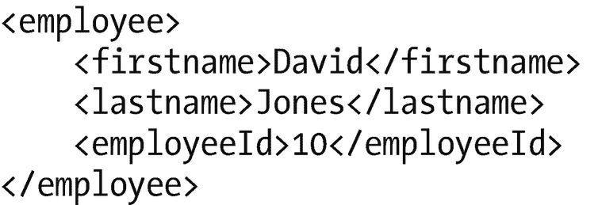
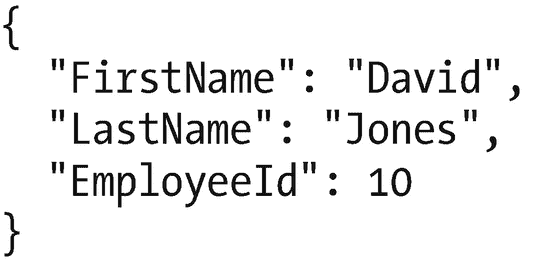
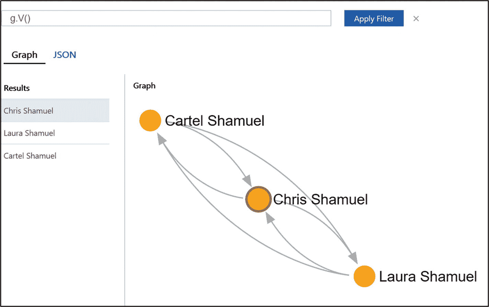

# 1.为什么是 NoSQL？

自从上学以来，我们大多数人都被教导要组织信息，这样它就可以用表格的形式来表示。但并不是所有的信息都能遵循这种结构，因此存在`NULL`值。`NULL`值表示没有信息的单元格。为了避免出现`NULL`,我们必须将一个表拆分成多个表，从而引入规范化的概念。在规范化中，我们根据我们选择的规范化级别来拆分表。这些级别是 1NF(第一范式)、2NF、3NF、BCNF(Boyce–Codd 范式，或 3.5NF)、4NF 和 5NF，仅举几例。每一层都规定了分割，最常见的是，人们使用 3NF，它基本上没有插入、更新和删除异常。

为了实现规范化，必须将信息拆分到多个表中，然后在检索时，连接所有的表以理解拆分的信息。这个概念没有什么问题，对于在线事务处理(OLTP)来说仍然是完美的。

在一个处理来自多个数据流的数据并遵循一个定义的结构的系统上工作，是非常难以实现和维护的。数据量通常非常庞大，而且大多不可预测。在这种情况下，在数据检索期间插入和连接表时将数据分割成多个部分会增加额外的延迟。

我们可以通过插入自然形式的数据来解决这个问题。由于不需要或只需要很少的转换，插入、更新、删除和检索过程中的等待时间将大大减少。这样，纵向扩展和横向扩展将变得快速且易于管理。考虑到这种解决方案的灵活性，它是最适合所定义问题的解决方案。解决方案是 NoSQL，也称为不仅，或非关系，SQL。

人们可以进一步将性能置于一致性之上，这在 NoSQL 解决方案中是可能的，并由 CAP(一致性、可用性和分区容差)定理定义。在这一章中，我将讨论 NoSQL，它的不同类型，它与关系数据库管理系统(RDBMS)的比较，以及它未来的应用。

## NoSQL 的类型

在 NoSQL，数据可以用多种形式表示。NoSQL 有多种形式，最常用的是键值、柱形图、文档图和图表。在这一节中，我将总结最常用的表单。

### 键值对

这是最简单的数据结构形式，但提供了出色的性能。所有的数据只通过键来引用，使得检索非常简单。这一类中最流行的数据库是 Redis Cache。表 [1-1](#Tab1) 给出了一个例子。

表 1-1

Key-Value Representation

<colgroup><col align="left"> <col align="left"></colgroup> 
| 钥匙 | 价值 |
| :-- | :-- |
| C1 | XXX XXXX XXXX |
| C2 | One hundred and twenty-three million four hundred and fifty-six thousand seven hundred and eighty-nine |
| C3 | 10/01/2005 |
| 补体第四成份缺乏 | Z ZZZZ ZZZZ |

键在有序列表中，HashMap 用于有效地定位键。

### 圆柱的

这种类型的数据库将数据存储为列，而不是行(像 RDBMS 一样),并针对查询大型数据集进行了优化。这种类型的数据库通常被称为宽列存储。这一类别中一些最受欢迎的数据库包括 Cassandra、Apache Hadoop 的 HBase 等。

与键-值对数据库不同，列数据库可以存储与构成表的键相关联的数百万个属性，但存储为列。但是，作为一个 NoSQL 数据库，它没有任何固定的名称或列数，这使它成为一个真正的无模式数据库。

### 文件

这种类型的 NoSQL 数据库以文档的形式管理数据。这种数据库有许多实现，它们有不同类型的文档表示。一些最流行的存储数据如 JSON、XML、BSON 等。以文档形式存储数据的基本思想是通过匹配其元信息来更快地检索数据(见图 [1-1](#Fig1) 和 [1-2](#Fig2) )。

图 1-2

Sample document structure (XML) code

图 1-1

Sample document structure (JSON) code

文档可以包含许多不同形式的数据键值对、键数组对，甚至是嵌套文档。MongoDB 是这一类别中最受欢迎的数据库之一。

### 图表

这种类型的数据库以网络的形式存储数据，例如社会关系、家谱等。(参见图 [1-3](#Fig3) )。它的美妙之处在于它存储数据的方式:使用图形结构进行语义查询，并以边和节点的形式表示。

节点是表示实体的叶信息，两个节点之间的关系(或多个关系)使用边来定义。在现实世界中，我们与其他每个人的关系是不同的，这可以通过各种属性来区分，在边缘层次上。

图 1-3

Graph form of data representation

数据的图表形式通常遵循 Apache TinkerPop 定义的标准，这一类别中最流行的数据库是 Neo4J(见图 [1-4b](#Fig5) ，它描述了图 [1-4a](#Fig4) 中执行的查询的结果)。

图 1-4b

Result in TinkerPop console

图 1-4a

Gremlin Query on TinkerPop Console to Fetch All the Records

## 对 NoSQL 有什么期待

为了更好地理解使用 NoSQL 的必要性，让我们从事务的角度将其与 RDBMS 进行比较。对于 RDBMS，任何事务都将具有某些特征，这些特征被称为 ACID——原子性、一致性、隔离性和持久性。

### 原子数

该属性确保事务应该完成或者根本不存在。如果由于任何原因，事务失败，在事务过程中发生的所有更改都将被删除。这称为回滚。

### 一致性

此属性确保系统在事务完成(失败或成功)后处于一致状态。

### 隔离

该属性确保每个事务对资源(例如表、行等)具有排他性。事务的读取和写入对于任何其他事务的读取和写入都是不可见的。

### 持久性

该属性确保数据应该是持久的，并且在硬件、电源、软件或任何其他故障期间不会丢失。为此，系统将记录事务中执行的所有步骤，并在需要时重新创建状态。

相比之下，NoSQL 依赖于 CAP 定理的概念，如下所示。

### 一致性

这确保了由任何事务执行的读取具有所有节点的最新信息/数据。它与 ACID 中定义的一致性略有不同，因为 ACID 的一致性声明所有数据更改都应为数据库连接提供一致的数据视图。

### 有效

每次请求数据时，都给出一个没有最新数据保证的响应。这对于需要高性能和容忍数据不确定性的系统来说至关重要。

### 分区容差

该属性将确保节点之间的网络故障不会影响系统故障或性能。这将有助于确保系统的可用性和一致的性能。

大多数时候，在持久的分布式系统中，网络持久性是内置的，这有助于使所有节点(分区)始终可用。这意味着我们只剩下两个选择，一致性或可用性。当我们选择可用性时，系统总是会处理查询并返回最新的数据，即使不能保证数据的并发性。

另一个定理 PACELC 是 CAP 的扩展，它指出如果一个系统在没有分区的情况下正常运行，那么必须在延迟和一致性之间做出选择。如果系统是为高可用性而设计的，则必须复制它，然后在一致性和延迟之间进行权衡。

因此，在定义分区容差时，架构师必须在可用性、一致性和延迟之间选择适当的平衡。以下是几个例子。

### 示例 1:可用性

例如，考虑安装在电梯上用于监控该电梯的设备。该设备向主服务器发送消息以提供状态报告。如果出现问题，它会提醒相关人员执行紧急响应。丢失这样的消息将危及整个应急响应系统，因此在这种情况下选择可用性而不是一致性将是最有意义的。

### 示例 2:一致性

考虑一个记录奖励积分分配和兑换的奖励目录系统。在兑换过程中，系统必须处理在时间点累积的奖励，并且交易应该是一致的。否则，您可以多次兑换奖励。在这种情况下，选择一致性是最关键的。

## NoSQL 和云

NoSQL 旨在横向扩展，可以跨越数千个计算机节点。它已经使用了相当一段时间，并因其无与伦比的性能而越来越受欢迎。然而，没有一个通用的数据库。因此，我们应该为给定的用例选择最好的技术。与其他传统系统不同，NoSQL 在设计上没有严格的界限，但它可以在内部部署的情况下轻松实现突破。

如今，行业需求不断增长，关注点正从资本支出(Capex)转向运营支出(Opex)，这意味着没有人真的想预先支付。这使得云成为架构师显而易见的选择，但即使在云中，服务也分为三个主要类别:基础设施即服务(IaaS)、平台即服务(PaaS)和软件即服务(SaaS)。让我们更仔细地看看这些术语。

### 基础设施即服务

这是最简单、最直接的云计算入门方式，在提升和转移场景中备受青睐。在这种情况下，云服务提供商负责虚拟化的所有方面，例如电力、房地产、冷却、硬件、虚拟化等。其他所有事情的责任都在用户身上。他们必须负责操作系统、应用服务器、应用程序等。此类服务的示例包括用于 Windows/Linux 的通用虚拟机、用于 SQL Server、SharePoint 等的专用虚拟机。

### 聚丙烯酸钠

这最适合希望只关注应用程序而将其他一切都交给云服务提供商的应用程序开发人员。PaaS 将有助于获得最大的可扩展性和性能，而无需担心端点的可用性。在这种情况下，云服务提供商保护开发者直到平台级别，意味着基础平台，例如应用服务器、数据库服务器等。这些服务的示例包括数据库即服务和缓存即服务等。

### 软件服务

在这种情况下，甚至软件的责任也在于云服务提供商。一切都将被卸载到云服务提供商，但开发人员仍然可以上传他或她的定制或通过 API 集成它们。这些服务的示例包括 Office 365、Dynamics 365 等。

前面提到的所有服务都有各自的优点和缺点。然而，完全没有必要坚持使用一种类型的服务。相反，人们可以为不同的目的选择它们的组合。例如，主应用程序部署在与 Office 365 集成的 SaaS 上。应用程序的遗留组件可以部署到虚拟机(IaaS)上，而数据库可以作为服务 PaaS 部署到数据库上。

## 结论

PaaS 是开发人员友好的选择，是应用程序开发人员的最佳选择，因为它将使他们摆脱基础架构管理难题，包括数据库服务的可用性、数据库服务支持、存储管理、监控工具等。

我将讨论业界最广泛和最快速采用的 NoSQL 数据库，在后续章节中作为 PaaS 讨论。