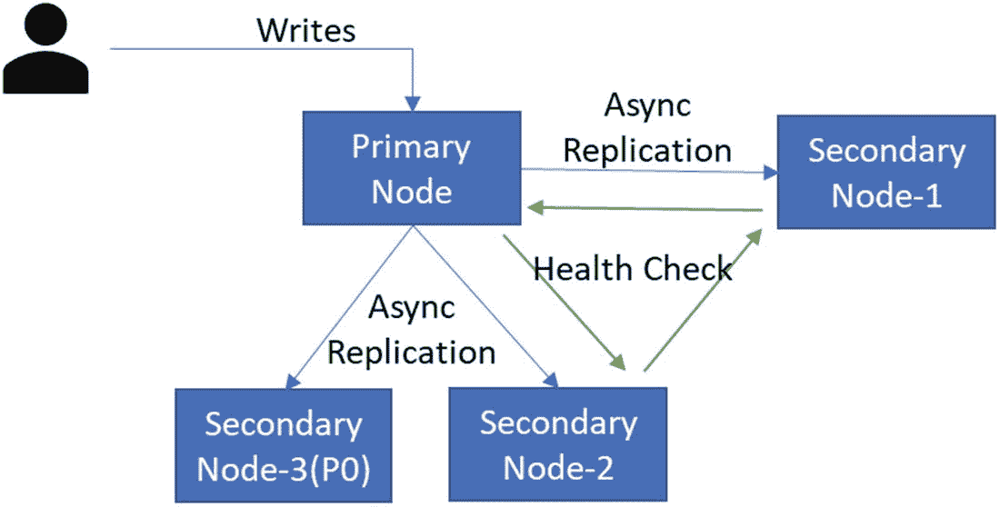
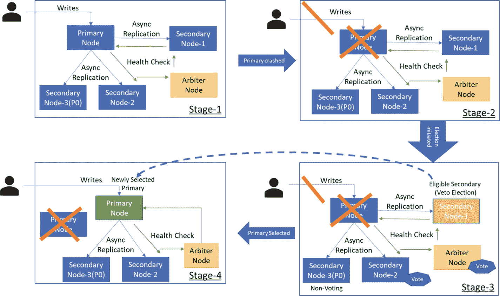
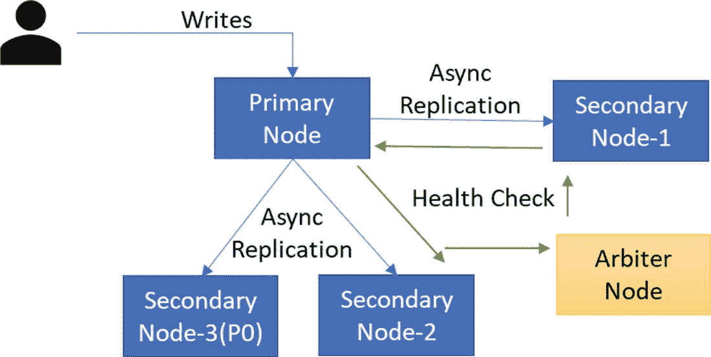
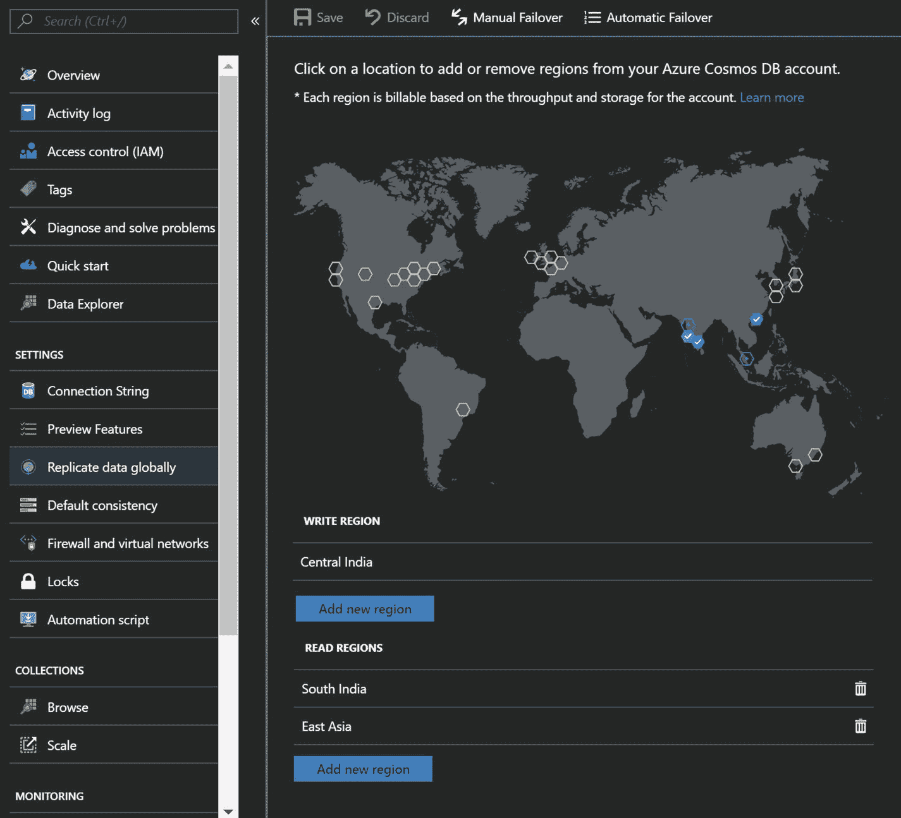
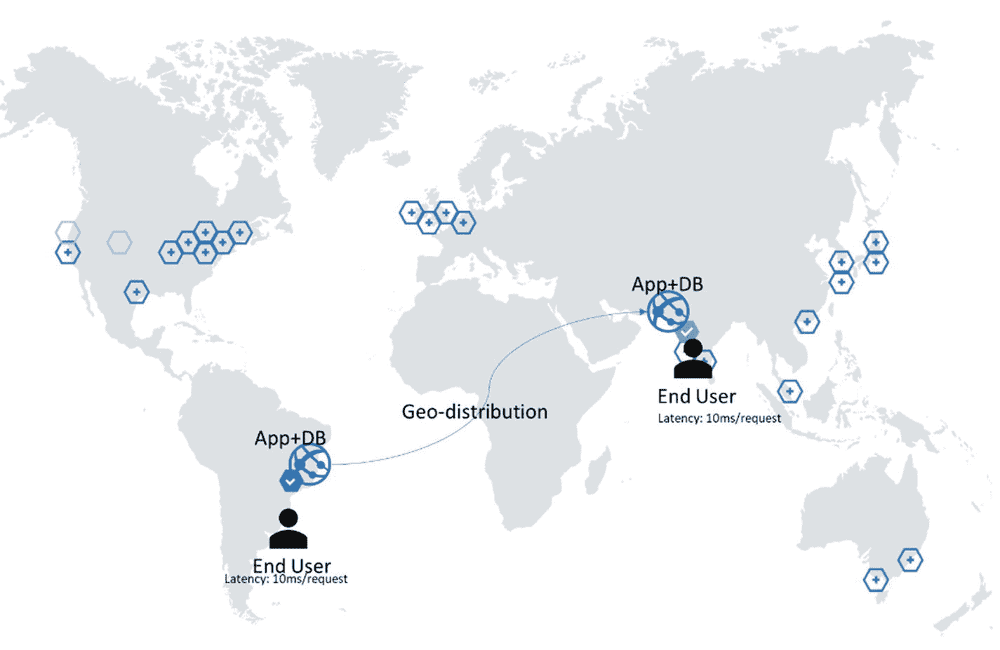
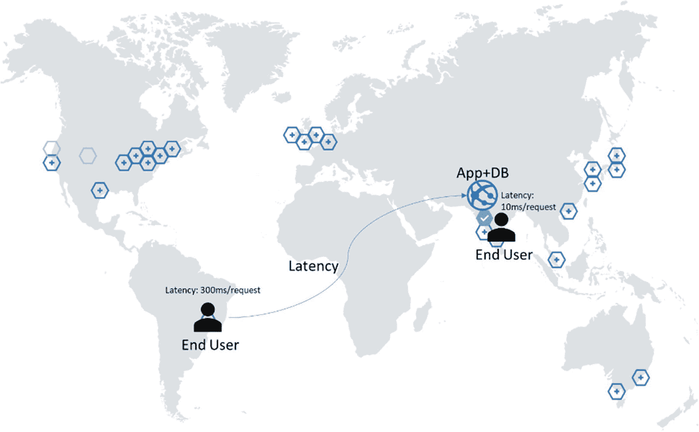
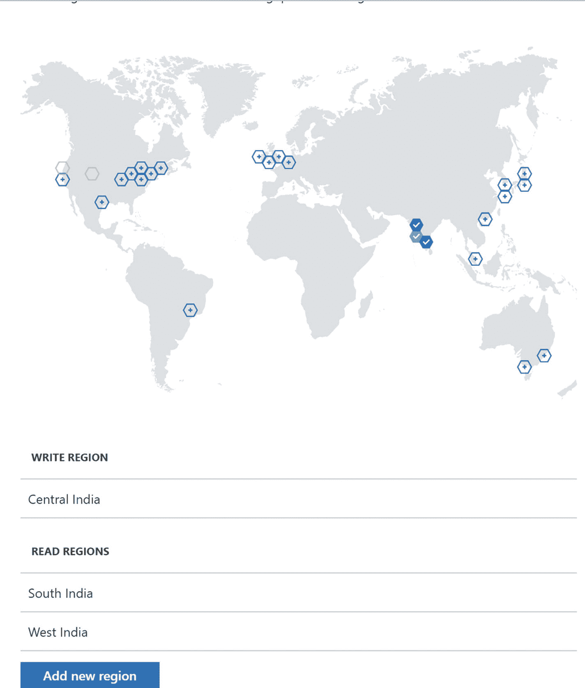

# 三、Azure Cosmos DB 地理复制

数据库的可用性对于任何应用的体验都是至关重要的。在用户参与至关重要的情况下，数据驱动应用中数据库的可用性是最重要的，必须确保数据库的可用性和可伸缩性。数据驱动应用的例子如下:一个电子商务应用有太多易于使用和引人注目的功能，每次用户试图购买时都会关闭，因为数据库不可用；一家医院的计费解决方案，由于数据库实例不可用，导致患者排队付款；或者是一家遍布全球的运输公司试图访问该系统，但是除了在主要位置之外，由于延迟问题，该系统的性能很差。那么，如何确保数据库可用呢？您如何确保数据库总是部署在离相关应用最近的地方？您如何实现尽可能低的延迟？

在本章中，我将尝试回答与数据库可用性相关的问题。此外，我将介绍 Azure Cosmos DB 的全球分发能力，并讨论它如何帮助解决可用性挑战。

## 数据库可用性

为了确保数据库的可用性，我们必须确保运行数据库的实例的可用性。我们可以通过设置高可用性(HA)来实现这一点。这仅仅意味着应该有两个以上的实例运行给定的工作负载。运行同一个数据库的两个或更多实例将是一项艰巨的工作，因为所有实例都应该同步，这样，如果一个实例离线，第二个实例将启动并运行，并提供所有所需的数据。这可以通过数据复制来实现，数据复制有两种类型:主/从和主/主。在主/从数据复制的情况下，有一个主数据库实例，它可以执行读取和写入事务，第二个或后续实例将拥有与主实例相同的数据的副本，但只执行读取事务。在主/主复制中，没有主实例。所有实例都具有同等权限，可以执行读写事务。

## MongoDB 复制

在 MongoDB 中，高可用性(基于主/从的架构)可以通过副本集来配置。在副本集中，主实例中的数据将被复制到辅助实例中。主实例处理所有的写入和读取事务，辅助节点处理读取事务。次节点进一步分为两种类型:数据承载节点和仲裁节点。我们来看看他们的一些底层细节。

### 数据承载节点

数据承载节点是那些承载数据集的节点。所有健康的数据承载节点将不断地相互发送 pings 以检查它们的健康状态。从主节点复制数据是通过复制主节点的操作日志并将其应用于次节点的数据集来进行的。如果主节点不可用，合格的辅助节点将进行选举，选择自己作为新的主节点。举行选举并被大多数次节点选举的第一个次节点将被提升为新的主节点。选举进行时，任何节点都不能接受写和读查询。可能有优先级为 0 (P-0)的节点不能成为主节点。这些节点作为冷备份或灾难恢复的辅助手段，也称为备用模式，参见图 [3-1](#Fig1) 。



图 3-1

Replication between primary and secondary nodes

选举中的投票不是提供给每个次级节点的权利。最多只有七个辅助节点可以投票。一个非投票节点将具有投票= 0 和优先级= 0 的配置，完整流程参见图 [3-2](#Fig2) 。



图 3-2

Failover and election of the primary node (Arbiter is detailed in the following “Arbiter Nodes” section.)

### 仲裁节点

仲裁器节点的存在是为了提供奇数个投票成员，而没有额外的复制数据集节点的开销。与承载数据的节点不同，仲裁节点不包含数据的副本；因此，它们不能成为主节点。仲裁节点只能在选举中投票和执行健康检查，参见图 [3-3](#Fig3) 。它们的配置总是投票数= 1，优先级= 0。



图 3-3

Arbiter in overall replication

让我们看看必须为复制环境修改的连接字符串(清单 [3-1](#Par9) )。

```js
MongoClient.connect("mongodb://xxx:30000,abcd:30001/db_prod?replicaSet=ProdReplication", function(err, db) {
.....
.....
}

Listing 3-1Connection String for MongoDB with replicaSet and Multiple Host Names

```

如果您查看连接字符串，就会发现它与平常不同。我在这里指定了多个端点，展示了指定命名节点的可能性，这将有助于连接到`replicaSet`中的特定节点。但是，不建议这样做，因为这会增加验证主机的开销。您应该指定`replicaSet`的名称，而不是指定主机，这足以自动导航到一个健康的节点(主节点或辅助节点)。

到目前为止，MongoDB 不支持多主复制，其中每个节点都可以处理读写事务。

HA 对一个地理区域有效，但是如果该地理区域经历自然灾害或数据中心范围的停机，并且所有实例变得不可用，该怎么办？因此，考虑为其他地理区域创建复制副本实例也很重要。这称为灾难恢复(DR)。为了设置灾难恢复，MongoDB 提供了异步复制，这有助于复制数据，即使在延迟较高的情况下也是如此，但只是在最终的一致性模式下。这意味着每个实例至少需要 4 个实例(2 个用于高可用性，2 个用于灾难恢复)，这些实例必须跨数据中心复制(以确保两端的高可用性)。

除了高可用性和灾难恢复之外，如果某个应用希望跨地理区域分布，并且需要对数据库进行本地访问以减少延迟并提高应用的性能，那么我们在每个区域都需要 2 个实例。如果我们必须管理一个大型数据集，我们必须将实例分割成多个子实例，称为碎片/分区(有关更多详细信息，请参见第 [5](5.html) 章)，然后每个碎片/分区将需要单独的 HA/DR/多地理部署考虑。这需要付出巨大的努力来部署—复制数据并在每个数据中心维护其可用性。即使是最轻微的配置错误也会造成巨大的破坏。因此，为了正确地实现多个实例，您必须雇用顾问或专门的资源。这也意味着一群 DevOps 专业人员必须全天候监视所有实例，即使这样，如果出现问题，也没有基于 SLA(服务级别协议)的承诺。

到目前为止，我已经解释了如何在 MongoDB 中执行复制，这是非常麻烦的，并且需要额外的工作来部署/管理。但不用担心，Azure Cosmos DB 是救星。它自动维护单个区域中的所有副本，并在配置后维护多个其他区域。

## Azure Cosmos 数据库复制

Azure Cosmos DB 通过 SLA 提供现成的 HA、DR 和地理复制。它还涵盖了可用性、吞吐量、一致性和延迟。每个实例都有一个预配置的 HA 结构。因此，不需要显式配置。对于灾难恢复和地理复制，用户可以通过导航到 Azure 门户➤ Azure Cosmos DB 帐户➤全局复制数据来添加读写区域，然后单击地图上突出显示的圆圈+图标，然后单击保存(参见图 [3-4](#Fig4) )。或者，您可以点按区域列表正下方的“添加区域”按钮。您可以选择任意数量的地区(最多不超过 Azure 的地区可用性限制)。



图 3-4

Configuring geo-distribution via the Azure portal

Azure Cosmos DB 支持多个地理复制的主节点，这将使应用全球分布。全球分布有助于设计低延迟访问的应用，因为它允许在更靠近应用的地方处理写和读请求。它还提高了应用的整体用户体验。地理分布前后的延迟影响示例见图 [3-5](#Fig5) 和 [3-6](#Fig6) 。



图 3-6

Optimal latency scenario after configuring global distribution



图 3-5

Latency before global distribution

添加具有多个区域的 Azure Cosmos DB 帐户的另一种方法是使用 Azure 的命令行界面(CLI)。(参见清单 [3-2](#Par18) )

```js
az group create --name mytestresourcegroup --location southindia
az cosmosdb create --name mycosmosdbacct --resource-group mytestresourcegroup --default-consistency-level Session --enable-automatic-failover true --kind MongoDB --locations "South India"=0 "Central India"=1 "West India"=2 --tags kiki

Listing 3-2Configuring Multiple Regions While Creating an Azure Cosmos DB Instance Using a CLI

```

除了故障转移优先级之外，我们还必须提供一个位置列表。优先级在序列中应该是唯一的，如前面的参考列表 [3-3](#Par20) 所示。优先级 0 < =表示写区域，优先级> 0 表示读区域(不像在 MongoDB 中，优先级-0 意味着实例永远不会成为主实例)。

```js
az cosmosdb failover-priority-change --failover-policies "South India"=1 "Central India"=0 "West India"=2 --name mycosmosdbacct --resource-group mytestresourcegroup

Listing 3-3CLI Command to Change the Failover Sequence in Azure Cosmos DB

```

请注意，在前面的命令中，我们还将写入区域从`"South India"`更改为`"Central India"`。图 [3-7](#Fig7) 说明了这种变化。



图 3-7

Updated map, reflecting the change

## 自动转换地理 API

在 MongoDB 中，建议您提供一个`replicaSet`引用，而不是指定主机，以便 MongoDB 可以隐式地管理故障转移。同样适用于 Azure Cosmos DB。编程时完全没有必要指定主机。相反，您可以简单地复制并粘贴门户中可用的连接字符串，它确实有一个引用`replicaSet`。要获取连接字符串，请导航到 Azure Cosmos DB 帐户➤连接字符串，并复制主要或次要连接字符串(请参见图 [3-8](#Fig8) ，参考清单 [3-4](#Par23) 获取连接字符串)。


图 3-8

Gettingthe connection string from the Azure portal (Primary and secondary connection strings are indicated by a red line.)

```js
mongodb://<CosmosDBAccountName>:<primary or secondary key>@<CosmosDBAccountName>.documents.azure.com:10255/?ssl=true&replicaSet=globaldb

Listing 3-4Connection String Depicting the replicaSet

```

在手动或自动故障转移的情况下，Azure Cosmos DB 将在后台处理，并且完全透明，不需要更改代码中的任何内容。

Azure Cosmos DB 的美妙之处在于，它的数据可以复制到几乎所有的 Azure 地区，因为它是一个 Ring 0 服务。一旦正式上市，所有 Azure 地区都可以使用 Ring 0 服务。到目前为止，Azure Cosmos DB 支持多个读写区域，以抑制应用的地理分布使用的延迟。

让我们在中创建一个普通的 Hello World 示例。NET 使用 MongoDB。要创建它，请执行以下步骤:

1.  打开 Visual Studio ➤新项目➤ Visual C# ➤控制台应用，然后点击确定。
2.  转到软件包管理器控制台并指定“Install-Package MongoDB”。司机，”然后回车。这将为. NET 添加必要的 MongoDB 客户端库。
3.  添加一个类，将其命名为`EventModel`，并用以下代码替换`EventModel`的类代码(列表 [3-5](#Par30) ):

    ```js
    /// <summary>
    /// Model defined for Event Message generated from sensors
    /// </summary>
    public class EventModel
    {
        /// <summary>
        /// Default ID
        /// </summary>
        public MongoDB.Bson.BsonObjectId _id { get; set; }
        /// <summary>
        /// Site information
        /// </summary>
        public int SiteId { get; set; }
        /// <summary>
        /// Device information installed for a site
        /// </summary>
        public int DeviceId { get; set; }
        /// <summary>
        /// Sensor information installed in Device
        /// </summary>
        public int SensorId { get; set; }
        /// <summary>
        /// Temperature Reading
        /// </summary>
        public decimal Temperature { get; set; }
        /// <summary>
        /// Overall Health of the Device
        /// </summary>
        public string TestStatus { get; set; }
        /// <summary>
        /// Message TimeStamp
        /// </summary>
        public DateTime TimeStamp { get; set; }
    }

    Listing 3-5Code for EventModel Class

    ```

4.  打开`Program.cs`并添加以下 using:

    ```js
    using MongoDB.Driver;
    using System.Configuration;

    ```

5.  现在用下面的代码替换函数 static main(清单 [3-6](#Par34) ):

    ```js
    static void Main(string[] args)
            {
                //ConnectionString, name of database & collection to connect
                //All those values will be acquired from App.config's setting section
                string connectionString = ConfigurationManager.AppSettings["ConnectionString"];
                string databaseName = ConfigurationManager.AppSettings["DatabaseName"];
                string collectionName = ConfigurationManager.AppSettings["CollectionName"];

                //Mongo client object
                MongoClient client = new MongoClient(connectionString);
                //Switch to specific database
                IMongoDatabase database = client.GetDatabase(databaseName);

                //While selecting the collection, we can specify the read preference
                MongoCollectionSettings collSettings = new MongoCollectionSettings()
                {
                    ReadPreference = new ReadPreference(ReadPreferenceMode.Secondary)
                };

                //Adding a record into primary instances
                var messageId = new MongoDB.Bson.BsonObjectId(new MongoDB.Bson.ObjectId());
                var deviceId = new Random(1).Next();
                IMongoCollection<EventModel> productCollection = database.GetCollection<EventModel>(collectionName, collSettings);
                 productCollection.InsertOne(new EventModel { _id = messageId, SiteId = 1, DeviceId = deviceId, SensorId = 1, Temperature = 20.05M, TestStatus = "Dormant", TimeStamp = DateTime.Now });
                EventModel result = null;

                //Loop through till the record gets replicated to secondary instance
                while (result == null)
               {    //Reading the newly inserted record from secondary instance
                    result = productCollection.Find<EventModel>(x => x.DeviceId == deviceId).FirstOrDefault<EventModel>();
                }
                Console.WriteLine("Message Time:" + result.TimeStamp.ToString("dd/mm/yyyy hh:mm:ss"));
                Console.Read();
            }

    Listing 3-6Code to Specify the Nearest Region to Connect With

    ```

6.  打开`App.config`并在`</startup>`下，添加以下代码(列表 [3-7](#Par36) ):

    ```js
    <appSettings>
        <add key="ConnectionString"
             Value="<Replace with ConnectionString"/>
        <add key="DatabaseName" value="<Replcace with name of Database>"/>
        <add key="CollectionName" value ="<Replace with name of collection>"/>
     </appSettings>

    Listing 3-7Configuration Changes in App.config

    ```

一旦运行代码，它将在一个区域插入记录，并从另一个区域获取记录，然后给你最后插入记录的时间戳，参见图 [3-9](#Fig9) 。您几乎不会看到一个`NULL`引用或循环结构被调用超过一次，这将证明全局分布中的最低延迟点。


图 3-9

Output of the MongoDB application connecting Azure Cosmos DB reference or looping construct being called more than once, which will prove the point of lowest latency in global distribution.

## 一致性和全球分布

一致性是 Azure Cosmos DB 最关键的因素之一，全球发行也不例外。写入区域只有在能够写入足够的仲裁时才会确认写入，这有助于 Azure Cosmos DB 在出现故障时减少数据丢失。将为每个分区复制数据，并在粒度级别实现复制保证，参见图 [3-10](#Fig10) 。


图 3-10

Replication of data at partition level

Azure Cosmos DB 对一致性级别的尊重被指定为默认一致性或通过代码，同时连接到 Cosmos DB。针对每个一致性级别，Azure Cosmos DB 的行为如下:

*   强一致性:一旦写入区域能够写入所有区域，它就会确认这一点。就消耗的 ru 数量而言，这是成本最高的操作之一。在这种情况下，同步复制会增加整体延迟。
*   有限陈旧性:如果您需要地理复制的高度一致性，这是首选。与强一致性写入相比，它的成本影响更低。它将异步复制数据，滞后时间相当于指定的时间间隔。在自动故障转移的情况下，数据丢失的保证是指这个间隔。
*   会话一致性:在这种情况下，一致性的范围仅限于用户的会话，复制将异步执行。
*   一致前缀:这是另一种形式的最终一致性，除了它在复制期间保持写入顺序。
*   最终:这种形式的一致性总是最快和最便宜的，因为成本更低，延迟也更低。

## 结论

在这一章中，我已经讨论了 Azure Cosmos DB 中地理复制的各个方面，并触及了特定于 Azure Cosmos DB 的各个方面。正如我们在众多例子中看到的，Azure Cosmos DB–MongoDB API 没有引入新的术语或语法，这减少了从 MongoDB 迁移的学习曲线。在随后的章节中，我将介绍索引、大小调整、分区和其他可能涉及本章的关键场景。