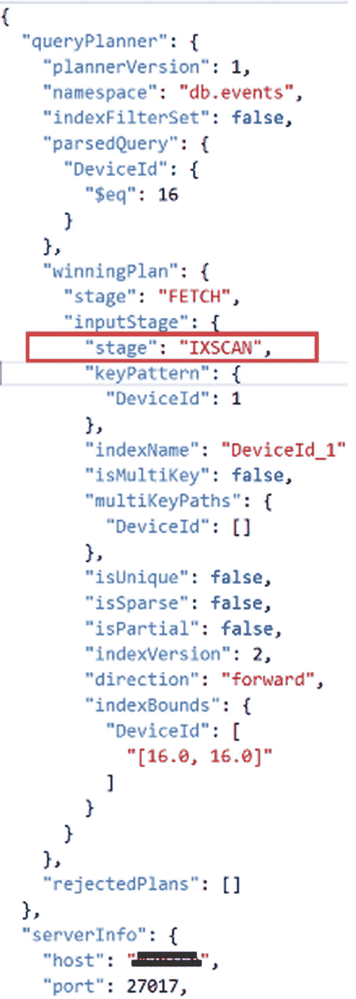
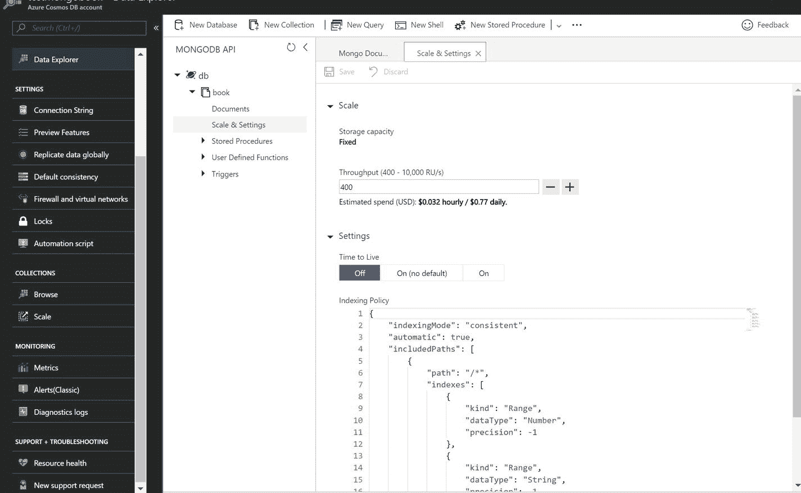

# 4.索引

索引是任何数据库固有的一部分，MongoDB 也是如此。索引数据是必要的，有助于减少查找值时的扫描开销，这有一句谚语，“大海捞针”在这一章中，我将讨论索引是如何工作的，索引策略，定制的可能性，以及索引优化。

## MongoDB 中的索引

在 MongoDB 中，用户必须定义哪个路径要被索引，以及如何被索引。这个决定定义了查询的性能。然而，索引有自己的开销。这会创建一个单独的并行树结构，在创建/更新/删除文档时，它会消耗 RAM、存储和 CPU。因此，确保索引的最大使用是很重要的，但是在实践中，可能会有一些查询不使用索引。在这种情况下，MongoDB 执行集合扫描，这将导致非最佳性能。这种场景可以通过使用 MongoDB 中的`explain()`方法来识别。

默认情况下，MongoDB 有一个带有唯一索引的`_id`字段，用于专门标识文档。不能删除此唯一索引。MongoDB 中存在不同类型的索引，用于不同的目的，包括单字段、复合、多键、地理空间、文本和散列索引。让我们逐一探究。

### 单字段索引

这是最简单的索引类型，应用于具有排序顺序的一个字段。无论何时执行查询，MongoDB 都会使用这个索引，或者在某些情况下，如果指定了多个索引字段，它也可以使用交集。详见清单 [4-1](#Par5) 。

```js
{
    "_id" : ObjectId("5ae714472a90b83cfcf650fc"),
    "SiteId" : 0,
    "DeviceId" : 16,
    "SensorId" : 9,
    "Temperature" : "20.9",
    "TestStatus" : "Pass",
    "TimeStamp" : {
        "$date" : 1522501431032
    },
    "deviceidday" : "163/31/2018"
}

Listing 4-1Sample Document

```

现在，连接到 MongoDB shell 并创建一个键索引(清单 [4-2](#Par7) ),排序顺序为 1，表示升序。若要创建按降序排序的单个键索引，请使用值-1。

```js
>db.events.createIndex({DeviceId: 1});

Output:
{
        "createdCollectionAutomatically" : true,
        "numIndexesBefore" : 1,
        "numIndexesAfter" : 2,
        "ok" : 1
}

Listing 4-2Command and Output to Create a Single Key Index

```

Note

在这种情况下，排序顺序无关紧要，因为 MongoDB 引擎也可以执行反向查找。

#### 使用索引进行查询

我们将使用`explain()`方法提取查询计划和关于查询计划的执行统计信息(参见清单 [4-3](#Par10) )。



图 4-1

Output of `explain()` (the usage of the index is highlighted)

```js
>db.events.find({DeviceId:16}).explain();

Listing 4-3Command to Be Executed (explain() is added to investigate the usage of the index; refer to Figure 4-1 for output)

```

在`explain()`方法中，在赢计划➤输入阶段➤阶段下，有以下五种可能的操作:

1.  `COLLSCAN`:表示要执行集合扫描的查询。
2.  `IXSCAN`:表示索引的使用(扫描索引键)。
3.  `FETCH`:表示检索单据的操作。
4.  `SHARD_MERGE`:这表示来自碎片的结果的合并。
5.  这将从碎片中过滤出孤立的文档。

如图 [4-1](#Fig1) 所示，使用`IXSCAN`的 winningPlan ➤阶段显示查询正在使用索引。

#### 不使用索引的查询

现在，让我们考虑一个例子，其中我们选择的字段没有使用索引。详见清单 [4-4](#Par19) 。

```js
> db.events.find( { "SensorId": 9 }).explain();
Output:
{
  "queryPlanner": {
    "plannerVersion": 1,
    "namespace": "db.events",
    "indexFilterSet": false,
    "parsedQuery": {
      "SensorId": {
        "$eq": 9
      }
    },
    "winningPlan": {
      "stage": "COLLSCAN",
      "filter": {
        "SensorId": {
          "$eq": 9
        }
      },
      "direction": "forward"
    },
    "rejectedPlans": []
  },
  "serverInfo": {
    "host": "xx",
    "port": 27017,
    "version": "3.6.4",
    "gitVersion": "xx"
  },
  "ok": 1
}

Listing 4-4Execution of find with explain() and Its Output

```

现在，如果你仔细看，这一次我们已经采取了字段`SensorId`，这是没有索引，`winningPlan` ➤阶段描述了操作`COLLSCAN`。

### 复合指数

这些指数是由多个字段组合而成的。在我们的例子中，我们将创建一个包含字段`SiteId`和`DeviceId`的复合索引(参见清单 [4-5](#Par22) )。

```js
> db.events.createIndex({SensorId:1, deviceidday:-1});
Output:
{
    "createdCollectionAutomatically" : false,
    "numIndexesBefore" : 3,
    "numIndexesAfter" : 4,
    "ok" : 1
}

Listing 4-5Creating a Compound Index and Its Output

```

在前面的例子中，排序顺序非常重要。让我们考虑几个其他的例子，比如当查询指定排序顺序为`db.events.find({},{sensorId:-1, deviceidday:1})`或`db.events.find({},{sensorId:1, deviceidday:-1})`时。在这种情况下，索引将是有效的，但是如果您指定了`db.events.find({},{sensorId:-1, deviceidday:-1})`或`db.events.find({},{sensorId:1, deviceidday:1})`，索引将不会被使用，因为 MongoDB 引擎在其索引条目中不会有这样的组合。

第二个最重要的考虑因素是索引中字段的顺序，它应该尽可能接近您的用途。

### 多键索引

这些索引用于保存数组值的字段。MongoDB 将为字段中的每个值创建一个索引条目。它可以为标量值(数字、字符串等)构造。)或嵌套文档。如果 MongoDB 引擎发现字段中有数组或嵌套文档，它会自动创建一个多键索引。因此，语法与复合或单字段索引相同。

### 地理空间索引

MongoDB 能够支持 2D 地理空间数据，并有两个不同的索引:一个用于平面几何，另一个用于球面几何搜索。第一种主要用于遗留数据，这些数据存储为遗留坐标，而不是 GeoJSON。

GeoJSON 是一种用于各种地理空间数据结构的编码格式。它支持各种几何类型，例如点、线串、多边形、多点、多线串和多多边形。

让我们尝试一下(参见清单 [4-6](#Par29) )。

```js
> db.geo2dcoll.createIndex( { location: "2dsphere" } )
Output:
{
        "createdCollectionAutomatically" : true,
        "numIndexesBefore" : 1,
        "numIndexesAfter" : 2,
        "ok" : 1
}

Listing 4-6Creation of a 2dsphere Index

```

现在，让我们插入一些数据(列表 [4-7](#Par31) )。

```js
> db.geo2dcoll.insertOne({location: {type: "Point", coordinates: [28.354153, 77.373746]}});
> db.geo2dcoll.insertOne({location: {type: "Point", coordinates: [28.370091, 77.315462]}});

Listing 4-7Inserting Some Coordinates in the 2dsphere Index

```

要找到 6.5 公里内的最近点，请参考清单 [4-8](#Par33) 。

```js
>db.geo2dcoll.find({    location: {      $near: {        $geometry: {           type: "Point",           coordinates: [ 28.354153, 77.373746 ]        },        $maxDistance: 6500,        $minDistance: 300      }    } });
Output:
{ "_id" : ObjectId("5afdc37f83ae6a55a8f185ba"), "location" : { "type" : "Point", "coordinates" : [ 28.370091, 77.315462 ] } }

Listing 4-8Search for Nearest Point

```

现在让我们尝试使用 2D 指数。参考清单 [4-9](#Par35) 创建索引。

```js
> db.geo2dcoll1.createIndex( { location: "2d" } )
{
    "createdCollectionAutomatically" : true,
    "numIndexesBefore" : 1,
    "numIndexesAfter" : 2,
    "ok" : 1
}

Listing 4-9Creation of a 2D Index

```

插入一些位置(列表 [4-10](#Par37) )。

```js
> db.geo2dcoll1.insertOne({location:[28.370091, 77.315462 ]})
> db.geo2dcoll1.insertOne({location:[28.354153, 77.373746]})

Listing 4-10Inserting Some Sample Locations

```

要执行命令搜索距离一个点大约 6500 米的另一个位置，请遵循清单 [4-11](#Par39) 中的代码。

```js
> db.runCommand( { geoNear: "geo2dcoll1", near: [28.354153, 77.373746 ], $maxDistance: 6500 } )
Output:
{
        "results" : [
                {
                        "dis" : 0,
                        "obj" : {
                                "_id" : ObjectId("5afdc6ee83ae6a55a8f185bc"),
                                "location" : [
                                        28.354153,
                                        77.373746
                                ]
                        }
                },
          {
            "dis": 0.060423873593142,
            "obj": {
              "_id": "ObjectId(\"5afdc6d383ae6a55a8f185bb\")",
              "location": [
                28.370091,
                77.315462
              ]
            }
          }
        ],
        "stats" : {
                "nscanned" : 31,
                "objectsLoaded" : 2,
                "avgDistance" : 0.030211936796571,
                "maxDistance" : 0.060423873593142,
                "time" : 1858
        },
        "ok" : 1
}

Listing 4-11Finding All Locations Within 6500 Meters

```

在前一种情况下，有一个最小距离要素会导致获得不必要的结果。当然，这样的结果会耗费不必要的时间和资源。

另一个主要差异是准确性。如果两点相距很远，你很容易就能看出差别。

### 文本索引

这是一种特殊类型的索引，有助于执行全文搜索。它支持基本的搜索功能，如词干，停用词，排名，短语搜索，关键字搜索等。这种类型的索引支持大约 21 种语言。但是，如果您希望支持同义词、小写分析器、特定于语言的规则、停止标记过滤器、HTML 剥离或更高级的评分集，请使用搜索技术，例如 ElasticSearch、Solr 等。

让我们创建一个文本索引。清单 [4-12](#Par44) 中的代码可用于创建收集文章的文本索引。

```js
>db.articles.createIndex({body: "text", abstract: "text"})
Output:
{
    "createdCollectionAutomatically" : true,
    "numIndexesBefore" : 1,
    "numIndexesAfter" : 2,
    "ok" : 1
}

Listing 4-12Creating a Text Index for Articles Collection

```

既然比赛场地已经准备好了，那就来推数据吧。清单 [4-13](#Par46) 中的代码引入了两个记录，用于收集集合中的文章。

```js
> db.articles.insertOne({body: "Quick brown fox jumps over the little lazy dog.", abstract: "this is the abstract for testing purpose"});
> db.articles.insertOne({body: "This is quickly created text for testing", abstract: "article on my cat"});

Listing 4-13Inserting Two Records for Articles Collection

```

数据现在被推送，让我们搜索一下(见清单 [4-14](#Par48) )。

```js
> db.articles.find({$text: {$search: "fox"}}, {score: {$meta: "textScore"}}).sort({score:{$meta:"textScore"}})
Output:
{ "_id" : ObjectId("5afd9ad797a3819f3ba91ba2"), "body" : "Quick brown fox jumps over the little lazy dog.", "abstract" : "this is the abstract for testing purpose", "score" : 0.5714285714285714 }

Listing 4-14Searching for “fox” in the Entire Collection. (A textscore [relevance score] will be displayed in the score field output.)

```

### 散列索引

这种类型的索引用于对使用哈希函数对字段值进行哈希处理的数据库进行分片，以便在分片之间分发数据。在散列索引中要记住的最重要的事情是，它们不支持多键索引，并且应用程序不需要知道散列函数，因为 MongoDB 数据库引擎会自动进行必要的转换。

使用清单 [4-15](#Par51) 中的代码创建一个散列索引。

```js
> db.articles.createIndex( { _id: "hashed" } )
Output:
{
        "createdCollectionAutomatically" : false,
        "numIndexesBefore" : 2,
        "numIndexesAfter" : 3,
        "ok" : 1
}

Listing 4-15Creating a Hashed Index

```

## Azure Cosmos DB 中的索引

拥有如此多类型的索引，然后选择和管理它们是一件令人头疼的事情。如果我们能卸下所有的烦恼呢？有一个答案。不是别人，正是 Azure Cosmos DB。它将通过自动索引所有内容(默认情况下，对所有字段启用索引)来解决您所有的索引担忧，无论您推送什么，因此它将有助于降低每次读取的成本。它有特殊的空间数据索引、可以选择性定义的独特索引功能、数组、嵌套文档，最重要的是，它可以自动分片。(详见第 [5](5.html) 章。)这使得 Azure Cosmos DB 成为一个完全无模式的 NoSQL 数据库引擎。

默认情况下，它还有一个`_id`字段，有一个惟一的索引，并可以选择指定其他字段为惟一的。在写这本书的时候，不支持文本`index`和`explain`方法。替换文本需要一个更复杂的搜索，称为 Azure Search，它很容易提供更好的搜索体验，只需最少的管理工作。

现在，让我们看看索引的魔力是如何配置的。导航到数据浏览器➤ < <database name="">> ➤ < <collection name="">> ➤比例&设置。输出如图 [4-2](#Fig2) 所示。</collection></database>



图 4-2

比例&设置页面

现在，单击 Scale 旁边的向下箭头，这允许您特别关注设置(参见图 [4-3](#Fig3) )。


图 4-3

Scale & Settings page, with the focus only on Settings

现在，让我们先来看看生存时间(TTL)索引的设置。

### TTL 索引

在需要删除历史数据的情况下，需要 TTL 索引。一个常见的用例是比最新数据更重要的时间序列数据。虽然在 MongoDB 中有一个专门用来删除旧数据的计算(在 TTL 的情况下)，但在 Azure Cosmos DB 中，它不会消耗丝毫 RUs。TTL 既可以应用于文档，也可以应用于集合级别，但在撰写本书时，使用 Azure Cosmos DB–MongoDB API，只能在集合级别应用 TTL。要使用此功能，您必须将`indexingMode`设置为 none 以外的值。还要注意，TTL 支持更新和删除操作。

现在是时候为 Cosmos DB 使用相同的 MongoDB shell 了。打开外壳并执行清单 [4-16](#Par59) 和 [4-17](#Par60) 中的代码。

```js
>sudo mongo <CosmosDBAccount>.documents.azure.com:10255/<dbname> -u <CosmosDBAccount> -p <primary/secondary key> --ssl --sslAllowInvalidCertificates

Listing 4-16Connecting Azure Cosmos DB Account from MongoDB Shell

```

```js
globaldb:PRIMARY> db.tscollection.createIndex( { "_ts": 1 }, { expireAfterSeconds: 3600 } )
Output:
{
    "createdCollectionAutomatically" : true,
    "numIndexesBefore" : 1,
    "numIndexesAfter" : 2,
    "ok" : 1
}

Listing 4-17Create TTL Index Using the Shell Command

```

Azure Cosmos DB 支持其他索引，这有助于处理特定的用例。我们将在本章的后续章节中更详细地探讨其中的一些。

### 数组索引

这些类型的索引解决了由数组值组成的字段的查询优化问题。每个数组值都被单独索引。在 MongoDB 中，不需要为每个数组编写单独的索引。如果字段由数组组成，则它包含在数组索引中。对于路径字符串，必须指定数组索引的路径，它会像数组索引一样对其进行索引。

```js
"path" : /field/[]/?

{"field.tag" :  "value"} 

{"field.tag" : {$lt : 100 } }

```

### 稀疏索引

这些索引仅由包含指定字段的文档条目组成。由于 MongoDB 的每个文档可以有不同的字段，所以一些字段可能只出现在文档的一个子集内是很常见的。当字段不存在于所有文档中时，稀疏索引允许创建更小、更有效的索引。

我们来看一个例子(清单 [4-18](#Par66) )。

```js
db.addresses.createIndex( { "xmpp_id": 1 }, { sparse: true } )

Listing 4-18Defining a Sparse Index

```

接下来，让我们探索 Azure Cosmos DB 中对唯一索引的支持。

### 唯一索引

这些类型的索引有助于避免字段或字段组合中的重复值。插入重复值时会产生错误。在无限制收集的情况下，在逻辑分区的范围内检查重复，并且一旦创建了唯一键索引，就不可能修改索引，除非重新创建容器。在 1 个约束中最多可以指定 16 个字段或字段路径，在每个唯一键中最多可以指定 10 个约束。在撰写本文时，不支持稀疏唯一键约束，缺失值被视为`NULL`并根据`unique`约束进行检查。唯一键约束的示例如下(列表 [4-19](#Par69) ):

```js
globaldb:PRIMARY> db.collection.createIndex( { "Address-1": 1, "City": 1, "State": 1 }, { "unique": true } )

Listing 4-19Example of Unique Key Constraint

```

在下一节中，我将深入研究 Cosmos DB 的索引配置。

## 自定义索引

在其门户网站上，Azure Cosmos DB 以 JSON 的形式展示了索引的配置，这一点我们已经在其他设置中看到过(见图 [4-2](#Fig2) 和 [4-3](#Fig3) )。让我们在这里详细复制 JSON(列表 [4-20](#Par72) )。

```js
{
    "indexingMode": "consistent",
    "automatic": true,
    "includedPaths": [
        {
            "path": "/*",
            "indexes": [
                {
                    "kind": "Range",
                    "dataType": "Number",
                    "precision": -1
                },
                {
                    "kind": "Range",
                    "dataType": "String",
                    "precision": -1
                },
                {
                    "kind": "Spatial",
                    "dataType": "Point"
                },
                {
                    "kind": "Spatial",
                    "dataType": "LineString"
                },
                {
                    "kind": "Spatial",
                    "dataType": "Polygon"
                }
            ]
        }
    ],
    "excludedPaths": []
}

Listing 4-20Default Indexing Configuration

```

这里的主要负责人是`indexingMode`、`automatic`、`includedPaths`和`excludedPaths`。下一节将详细讨论每种方法。

### 索引模式

让我们从`indexingMode`开始。此功能有多种模式可用于索引。

*   一致:这是默认的索引模式。它使得数据一被写入就被索引，并且在文档被索引后提供写入确认。在这种情况下，将遵循选定的一致性(无论是选择默认一致性还是在连接中指定)。下面是索引配置为 JSON，其中`indexingMode` = `consistent`(列表 [4-21](#Par77) ):

    ```js
    {
        "indexingMode": "consistent",
        "automatic": true,
        "includedPaths": [
            {
                "path": "/*",
                "indexes": [
                    {
                        "kind": "Range",
                        "dataType": "Number",
                        "precision": -1
                    },
                    {
                        "kind": "Range",
                        "dataType": "String",
                        "precision": -1
                    },
                    {
                        "kind": "Spatial",
                        "dataType": "Point"
                    },
                    {
                        "kind": "Spatial",
                        "dataType": "LineString"
                    },
                    {
                        "kind": "Spatial",
                        "dataType": "Polygon"
                    }
                ]
            }
        ],
        "excludedPaths": []
    }

    Listing 4-21Configuration with indexingMode As consistent

    ```

*   Lazy:这种索引模式会延迟索引，Azure Cosmos DB 会在写入磁盘时立即确认写入。一旦 RUs 变得未被充分利用，就会进行索引。在这种情况下，预定义的一致性模式将不起作用，一致性将始终是最终的。它将在写入期间提供最低的成本，但在读取时可能会引入不一致，因为写入磁盘的数据将需要一些时间才能被完全索引。因此，在这种情况下，包括聚合的查询，例如`COUNT`，在峰值负载期间可能会产生不一致的结果。下面是索引配置为 JSON，其中`indexingMode` = `lazy`(列表 [4-22](#Par80) ):

    ```js
    {
        "indexingMode": "lazy",
        "automatic": true,
        "includedPaths": [
            {
                "path": "/*",
                "indexes": [
                    {
                        "kind": "Range",
                        "dataType": "Number",
                        "precision": -1
                    },
                    {
                        "kind": "Range",
                        "dataType": "String",
                        "precision": -1
                    },
                    {
                        "kind": "Spatial",
                        "dataType": "Point"
                    },
                    {
                        "kind": "Spatial",
                        "dataType": "LineString"
                    },
                    {
                        "kind": "Spatial",
                        "dataType": "Polygon"
                    }
                ]
            }
        ],
        "excludedPaths": []
    }

    Listing 4-22Configuration with indexingMode As lazy

    ```

*   None:这种索引模式根本没有与数据相关联的索引，这意味着没有索引开销，从而在写入期间为您提供最大的产出。如果您使用 Azure Cosmos DB 作为键值对数据库，并且只能通过 ID 字段或自链接进行访问，那么通常会使用这种方法。在这种情况下，必须指定`EnableScanInQuery`选项(`x-ms-documentdb-enable-scan for REST API`)。它将通过门户或代码遵守指定的一致性。请注意，在撰写本文时，这种模式只能通过 Azure Cosmos DB–SQL API 使用。下面是索引配置为 JSON，其中`indexingMode` = `none`(列表 [4-23](#Par83) ):

    ```js
    {
        "indexingMode": "none",
        "automatic": false,
        "includedPaths": [],
        "excludedPaths": []
    }

    Listing 4-23Configuration with indexingMode as none

    ```

默认情况下，`indexingMode`被设置为`consistent`，但是如果您有一个非常繁重的写需求用例，在记录检索中有延迟是可以的，那么您可以使用`lazy`。如果您不必使用查询获取数据，请使用`none`。由于 Azure Cosmos DB 是高性能的，我建议您在更改 i `ndexingMode`之前进行一次负载测试。如有必要，对其进行更改和验证。现在，让我们看看索引路径。

### 索引路径

索引路径决定了您想要索引的路径，我建议主要用于查询。有两个配置选项:第一个是`includedPaths`，第二个是`excludedPaths`。顾名思义，“包含”意味着它符合数据索引，“排除”意味着它不在索引范围内。下面是几个例子，将有助于定义这一点。

首先是应用于文档树的默认路径(递归)。

```js
{ "path" : "/" }

```

接下来是为具有`Hash`或`Range`类型的查询提供服务所需的索引路径/子路径。

```js
{"path" : "/field/?" }

```

这些查询的一些示例包括:

```js
{"field" : "value"}

{"field" : {$lt : 100}}

db.book.find()._addSpecial( "$orderby", { "field" : -1 } )

db.book.find({$query:{}, $orderby : { "field"  : -1}})

db.book.find().sort({"field" : -1})

```

最后，这里是指定标签下所有路径的索引路径:

```js
/field/*

```

这适用于以下查询:

```js
{"field" : "value"}

{"field.subfield" : "value"}

{"field.subfield.subsubfield" : {$lt : 30 }}

```

### 索引种类

与 MongoDB 一样，Azure Cosmos DB 包括以下索引:

#### 哈希索引

Azure Cosmos DB 执行基于哈希的索引，高效地支持等式查询和连接查询。内置的`Hash`函数使用索引键执行哈希值的映射。默认情况下，对于所有字符串数据类型，都使用哈希索引。

下面是一个例子(列表 [4-24](#Par99) ):

```js
globaldb:PRIMARY> db.book.find({TestStatus : "Pass"});

Listing 4-24Sample Query That Uses a Hash Index

```

#### 范围索引

对于具有操作(例如，$lt，$gt，$ lte，$gte，$ne)或排序顺序或等式的范围查询，将使用范围索引。它是所有非字符串和空间数据类型的默认索引类型。

以下是使用范围键索引的示例查询(清单 [4-25](#Par102) ):

```js
globaldb:PRIMARY> db.book.find({DeviceId : {"$gt":1}});
globaldb:PRIMARY> db.book.find({DeviceId : {"$gt":1}},{},{_SiteId:-1});

Listing 4-25Sample Queries Using a Range Index

```

#### 地理空间索引

这些类型的索引有助于优化与二维空间内的位置相关的查询，例如地球投影系统。这种查询的例子是那些包含最接近给定点或线的多边形或点的查询；圆形、矩形或多边形内的那些；或者与圆形、矩形或多边形相交的那些。Azure Cosmos DB 支持 GeoJSON，并使用坐标参考系统(CRS)世界大地测量系统(WGS-84)，这是使用最广泛的坐标。以下是索引规范:

```js
{
   "automatic":true,
   "indexingMode":"Consistent",
   "includedPaths":[
      {
         "path":"/*",
         "indexes":[
            {
               "kind":"Range",
               "dataType":"String",
               "precision":-1
            },
            {
               "kind":"Range",
               "dataType":"Number",
               "precision":-1
            },
            {
               "kind":"Spatial",
               "dataType":"Point"
            },
            {
               "kind": "Spatial",
               "dataType": "LineString"
            },
            {
               "kind":"Spatial",
               "dataType":"Polygon"
            }                
         ]
      }
   ],
   "excludedPaths":[
   ]
}

```

目前，可用于空间索引的数据类型支持包括点、面或线串。以下是一些你可以使用的例子(列表 [4-26](#Par106) ):

```js
> db.geo2dcoll.insertOne({location: {type: "Point", coordinates: [28.354153, 77.373746]}});
> db.geo2dcoll.insertOne({location: {type: "Point", coordinates: [28.370091, 77.315462]}});

Listing 4-26Inserting Some Coordinates

```

现在，使用清单 [4-27](#Par108) 中的代码，在 6.5 公里内找到最近的点。

```js
>db.geo2dcoll.find({    location: {      $near: {        $geometry: {           type: "Point" ,           coordinates: [ 28.354153, 77.373746 ]        },        $maxDistance: 6500,        $minDistance: 300       }    } });
Output:
{ "_id" : ObjectId("5afdc37f83ae6a55a8f185ba"), "location" : { "type" : "Point", "coordinates" : [ 28.370091, 77.315462 ] } }

Listing 4-27Searching for the Nearest Point

```

### 索引精度

这对于平衡索引存储和查询性能非常重要。更高的精度意味着更高的存储量。但是，这仅适用于字符串数据类型。至于数字，JSON 最少由 8 个字节组成，使用 1–7 会降低精度并抑制存储开销的减少。不允许空间变化精度。在 string 中，这很有用，因为字符串的长度可以是任意的，并且默认情况下，范围是满的。但是，如果有任何用例不需要索引整个文本，您可以将其配置为 1–100 和-1(最大值)。在 MongoDB 中没有对等的东西。

### 数据类型

索引路径中的数据类型支持字符串、数字、点、多边形或线串。(可以在一个路径中指定其中一个。)

## 结论

默认情况下，在 Azure Cosmos DB 中，所有数据都将使用最佳配置自动索引，这提供了进行图表更改的灵活性，并有助于实现最高性能。此外，它不限制用户只能自动索引。相反，它提供了更大的定制灵活性。