# 6.一致性

一致性是数据库事务中一个非常重要的因素。它规定了数据库在读写期间的行为。在分布式数据库中，这是一个更加复杂和关键的因素。在这一章中，你将学习 Azure Cosmos DB 中可用的一致性级别。

## 分布式数据库中的一致性

由于数据库系统对于数据驱动的应用程序至关重要，因此确保可用性非常重要。因此，为了确保高可用性(HA)，您将最终拥有多个数据库副本(参见图 [6-1](#Fig1) )。

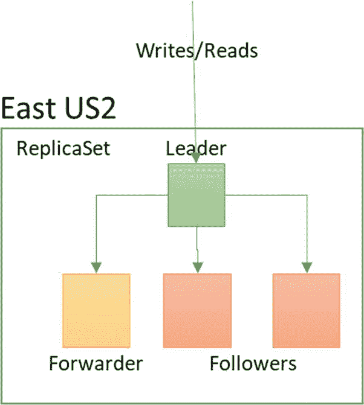

图 6-1

`ReplicaSet` consists of a leader (primary) and followers (secondaries)

跨区域拷贝将确保业务连续性，以防主区域出现问题。这就是所谓的灾难恢复(DR)。还可以有更多的跨区域用例。最普遍的一种情况是拥有遍布全球的用户群，并希望在离用户更近的地方部署应用程序，以避免网络延迟(见图 [6-2](#Fig2) )。


图 6-2

Database with `ReplicaSet` within geographical as well as cross-geographical regions

在这种情况下，确保一致性可能相当麻烦。我们来看一个例子。

如果您执行写入请求以插入项目 A，并立即从主节点和辅助节点读取项目 A，则响应将取决于一致性级别。在跨 geo 中，可能有更多的变量，例如网络延迟、连接故障等。，这将导致进一步的问题(参见图 [6-3](#Fig3) )。因此，CAP 定理指出，人们必须在一致性、可用性和分区容差这两个方面中选择任何一个。

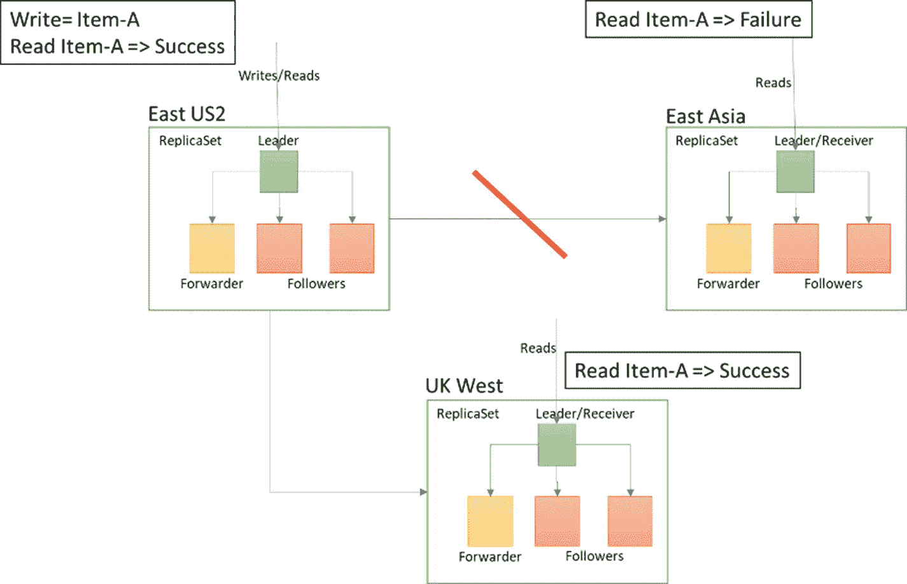

图 6-3

Database with `ReplicaSet` indicating a network failure

前面是一个失败的例子。跨地理区域的网络延迟的成功用例如何？程序是一样的。您必须插入数据，然后尝试跨地理区域执行读取命令(假设间隔为 80 毫秒)。这是否会返回正确的结果？另一个名为 PACELC 的定理在这里出现。它指出，如果系统在正常条件下工作，除了 CAP 之外，还必须考虑延迟与一致性(见图 [6-4](#Fig4) )。

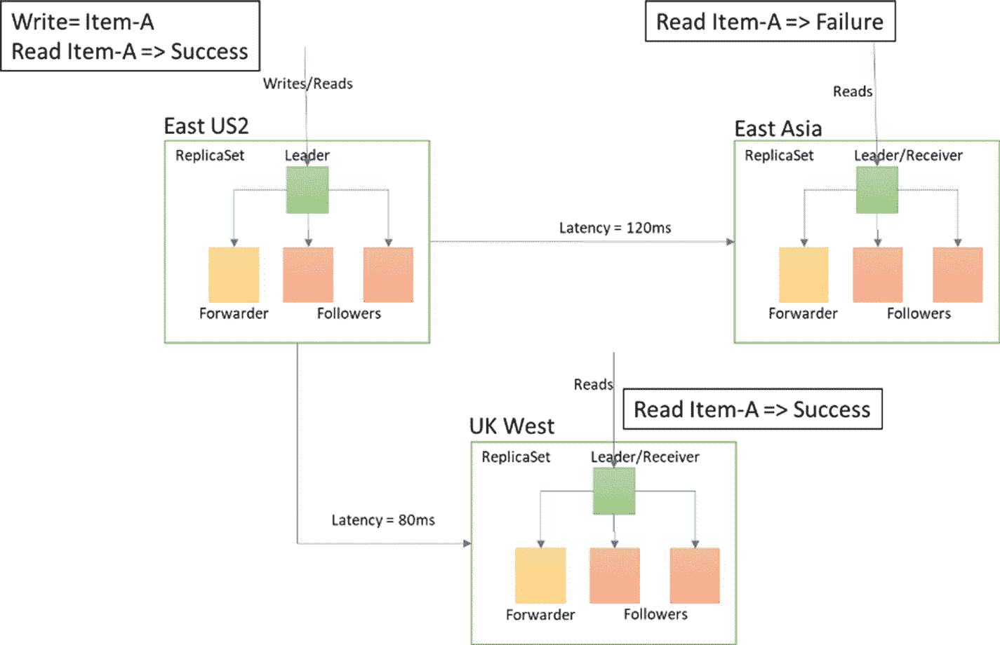

图 6-4

Database with `ReplicaSet` having network latency across geographic locations

现在，让我们看看不同的一致性级别。

## MongoDB 中的一致性

在 MongoDB 中，默认情况下，强一致性适用于本地实例，最终适用于读取副本。这种行为会受到定义事务行为的读写关注点的影响。

在 MongoDB 中，写请求可以指定写关注点，这决定了来自复制实例数量的写确认。这将确保写事务的持久性。对于读取请求，您可以定义四种类型的读取问题:本地、可用、多数和可线性化。在“本地”的情况下，不管写入问题如何，数据将从主实例可用，而不确保对其他复制副本的持久承诺。如果读取与因果一致的会话相关联，则默认为针对主节点的读取问题，默认为辅助节点。对于“可用”，行为保持与“本地”相同，只是当因果一致性会话不存在时，它默认为读取辅助节点的问题，并且当设置了因果一致性时，它不可用。在大多数节点确认写入后,“大多数”读取问题将恢复到更一致的数据。“可线性化”读取将等待，直到大多数副本确认写入，这确保了所有读取问题中最一致的读取。这只能为主要实例/主节点定义。

您可以通过在 MongoDB 中显式指定 read 关注点来执行该命令(参见清单 [6-1](#Par11) )。

```js
db.collection.find().readConcern(<"majority"|"local"|"linearizable"|"available">)

Listing 6-1MongoDB’s Shell Command for Specifying Read Concern

```

如果您在分布式数据库环境中工作，确保您可以读取您的写入是一个挑战，因为复制您的写入需要一些时间。在实践中，建立可线性化的读取问题通常是不可能的，因为这会增加等待时间。最近，在 MongoDB 3.6 中，引入了一个客户端会话，其中读/写在用户会话的范围内是一致的，这被称为因果一致性。这将确保您不会有性能故障，并且仍然允许您能够读取您的写入。

## Azure Cosmos DB 中的一致性

Azure Cosmos DB 有五种类型的一致性:强的、有界的陈旧性、会话、一致前缀和最终。为了完全理解这一点，让我们定义两组一致性行为:一致的读/写和高吞吐量。

### 一致的读取/写入

Azure Cosmos DB 提供了一致读/写的可能性，具有三个特征:强一致性、有限陈旧性和会话陈旧性。为了理解它们的行为，让我们考虑一下每种行为的几个例子。

清单 [6-2](#Par16) 给出了一个样本文档的代码，我们将使用它来探索不同的一致性级别。

```js
{ "_id" : "469", "SiteId" : 0, "DeviceId" : 0, "SensorId" : 0, "Temperature" : "20.9", "TestStatus" : "Pass", "deviceidday" : "03/10/2018" }

Listing 6-2Code for Sample Document

```

#### 强一致性

为了实现强大的一致性，Azure Cosmos DB 确保只有在写入被主副本和大多数副本提交为持久写入或被中止后，写入才是可见的。客户端永远不会看到未提交或部分提交的写入，并保证会读取最新确认的写入(参见图 [6-5](#Fig5) )。

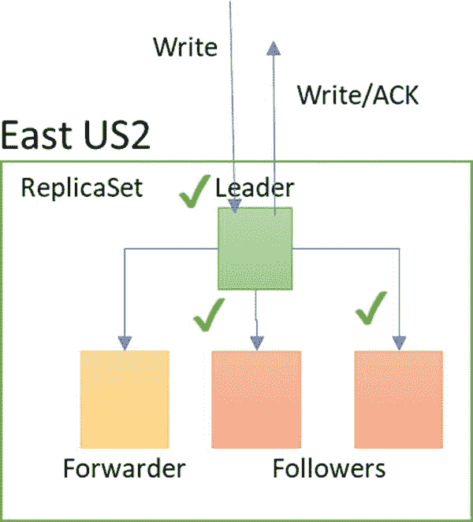

图 6-5

Write acknowledgment (checkmarks indicate committed writes)

就读取操作消耗的延迟和 ru 而言，这是成本最高的延迟级别(请参见本节后面的示例代码)。要在 Azure 门户中设置强一致性，请参见图 [6-6](#Fig6) 。

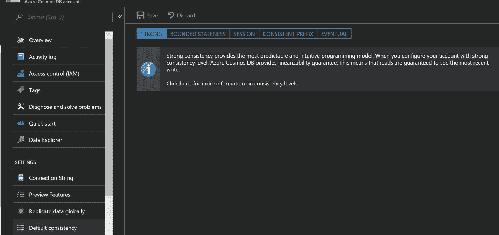

图 6-6

Configuration for a strong level of consistency

Azure Cosmos DB 采用了一个"[线性化](http://dl.acm.org/citation.cfm?id=1806634)检查器"，它持续监控操作并直接以指标报告任何一致性违规。让我们用一个例子来深入研究一下细节。

首先，让我们推送数据并尝试获取它。

```js
db.coll.insert({ "_id" : "469", "SiteId" : 0, "DeviceId" : 0, "SensorId" : 0, "Temperature" : "20.9", "TestStatus" : "Pass", "deviceidday" : "03/10/2018" });

```

为了更好地理解性能，运行以下命令(清单 [6-3](#Par23) )。插入花费了 13.9 RUs，延迟相当于 55 毫秒。

```js
db.runCommand({getLastRequestStatistics: 1});
{
        "_t" : "GetRequestStatisticsResponse",
        "ok" : 1,
        "CommandName" : "insert",
        "RequestCharge" : 13.9,
        "RequestDurationInMilliSeconds" : NumberLong(55)
}

Listing 6-3Checking Performance of Linearizability

```

请求费用是以 RUs 表示的成本。现在，我们来读一下(列表 [6-4](#Par25) )。读取请求的请求费用将为 6.98 RUs，延迟为 4ms。

```js
db.coll.find({"_id" : "469"})
db.runCommand({getLastRequestStatistics: 1});
{
        "_t" : "GetRequestStatisticsResponse",
        "ok" : 1,
        "CommandName" : "OP_QUERY",
        "RequestCharge" : 6.98,
        "RequestDurationInMilliSeconds" : NumberLong(4)
}

Listing 6-4Calculating the Request Charge (in RUs)

```

如果你注意到了，阅读一份文件的成本是 7。

#### 有限的陈旧

这是一个独特的概念，适用于非常高的吞吐量。在这种情况下，读操作可能会滞后于写操作一个配置的时间间隔或操作次数(参见图 [6-7](#Fig7) )。

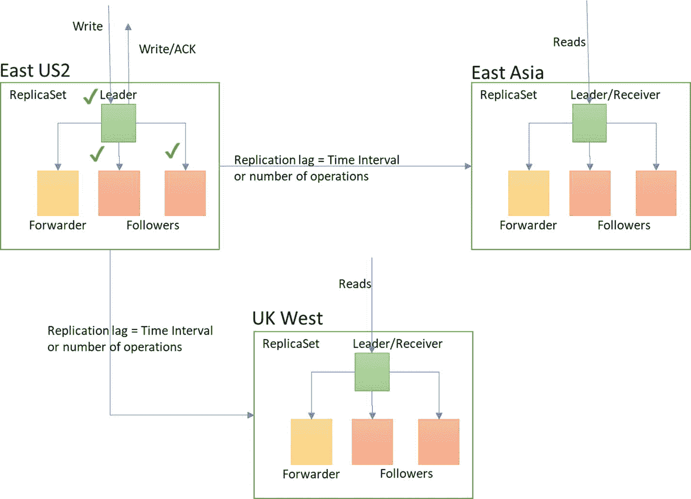

图 6-7

Write acknowledgment (checkmarks depict committed writes)

您可以根据需要创建尽可能多的地理复制实例，这对于强一致性来说是不可用的。这也是数据丢失保证的默认级别，以防您的主区域所在的 Azure 区域出现问题。就延迟和读取操作消耗的 ru 数量而言，成本与强一致性的成本相同。要在 Azure 门户中配置这个一致性级别，请参考图 [6-8](#Fig8) 。

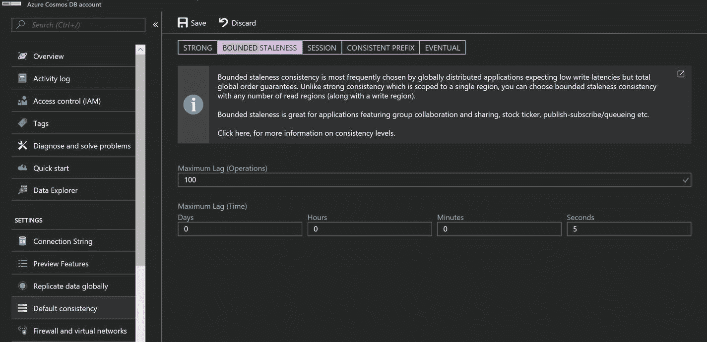

图 6-8

Configuration for a bounded staleness consistency level

为有界陈旧性配置值有两个约束:

1.  最大滞后(操作次数):10 到 1，000，000 适用于单个区域，100，000 到 1，000，000 适用于多个区域。
2.  最大滞后时间:单个地区 5 秒到 1 天，多个地区 5 分钟到 1 天

Note

在写这本书的时候，Azure Cosmos DB–MongoDB API 不支持这个一致性级别。我把它包含在这里供您参考，因为它是一个重要的功能，在不久的将来可能会作为 API 的一部分包含进来。

#### 会议

这种一致性的范围是局部的，在您必须读取写入内容的情况下非常有用。如果您必须在会话中执行立即读取操作，这也很重要，例如，为需要立即检索值的用户会话写入信息，或者任何设备写入需要立即与最新值聚合的数据，等等。详见图 [6-9](#Fig9) 。


图 6-9

Write acknowledgment (checkmarks depict committed writes)

在这种一致性级别下，允许任意数量的地理分布。与其他强一致性相比，它将以较低的成本提供最大的吞吐量。要在 Azure 门户中设置这个一致性级别，请参考图 [6-10](#Fig10) 。

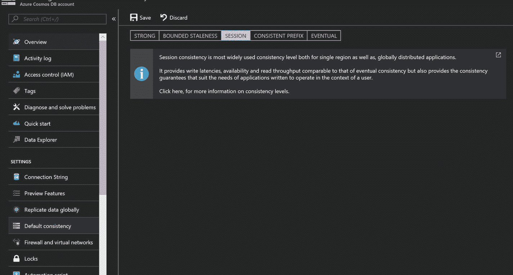

图 6-10

Configuration of the session consistency level Note

在写这本书的时候，Azure Cosmos DB–MongoDB API 不支持这个一致性级别。我把它包含在这里供您参考，因为它是一个重要的功能，在不久的将来可能会作为 API 的一部分包含进来。

### 高流通量

有一些一致性旨在以最小的成本提供最佳的吞吐量。这些是一致前缀和最终前缀。

#### 一致前缀

这种一致性是基于副本的最终收敛。它确保写入顺序保持不变。如果' 1 '，' 2 '，' 3 '是用相同的序列编写的，那么 Azure Cosmos DB 将确保检索到' 1 '或' 1 '，' 2 '或' 1 '，' 2 '，' 3 '，而不考虑区域(多/单)。(见图 [6-11](#Fig11) 。)


图 6-11

Configuration of the consistent prefix consistency level

这种一致性的性能也非常接近最佳。要在 Azure 门户中配置它，请参见图 [6-12](#Fig12) 。

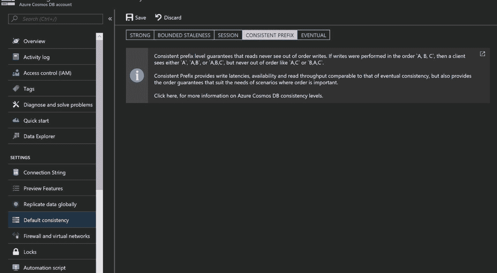

图 6-12

Configuration of the consistent prefix consistency level in the Azure portal Note

在写这本书的时候，Azure Cosmos DB–MongoDB API 不支持这个一致性级别。我把它包含在这里供您参考，因为它是一个重要的功能，可能会在不久的将来包含在 API 中。

#### 可能的

最终一致性是最弱的一致性形式，在这种情况下，客户端可能会获得过时的值(比写入时间更早的值)。它确保当没有进一步的写入时，数据最终将会收敛。因为它没有确保读取顺序、提交多数或法定人数等开销。与其他一致性级别一样，最终一致性以更低的成本在读取和写入方面表现最佳(参见图 [6-13](#Fig13) )。

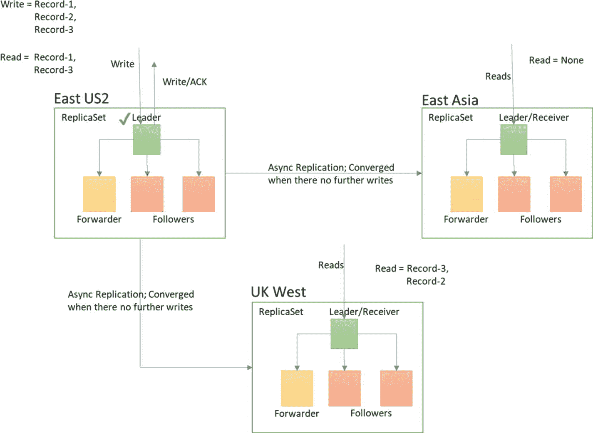

图 6-13

Configuration of eventual consistency level

要在 Azure 门户中配置最终的一致性级别，请参见图 [6-14](#Fig14) 。

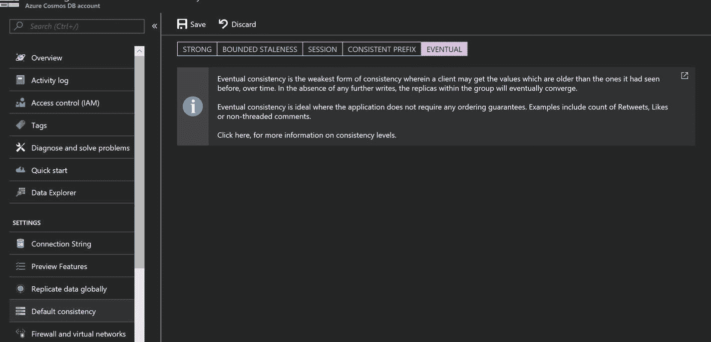

图 6-14

Configuration of the eventual consistency level in the Azure portal

一旦一致性级别发生变化，则将文档推送到集合中，并使用`db.runCommand()`评估结果，请参考清单 [6-5](#Par43) 。

```js
db.coll.insert({ "_id" : "469", "SiteId" : 0, "DeviceId" : 0, "SensorId" : 0, "Temperature" : "20.9", "TestStatus" : "Pass", "TimeStamp" : { "date" : 1520660314835 }, "deviceidday" : "03/10/2018" });

db.runCommand({getLastRequestStatistics: 1});
{
    "_t" : "GetRequestStatisticsResponse",
    "ok" : 1,
    "CommandName" : "insert",
    "RequestCharge" : 13.9,
    "RequestDurationInMilliSeconds" : NumberLong(5)
}

Listing 6-5Insertion Took 13.9 RUs with Latency Equivalent to 5ms

```

让我们试着阅读文档(参见清单 [6-6](#Par45) )。

```js
db.coll.find({"_id" : "469"})
db.runCommand({getLastRequestStatistics: 1});
{
    "_t" : "GetRequestStatisticsResponse",
    "ok" : 1,
    "CommandName" : "OP_QUERY",
    "RequestCharge" : 3.49,
    "RequestDurationInMilliSeconds" : NumberLong(4)
}

Listing 6-6Request Charge for Read Request

```

如果您将请求费用与强一致性费用进行比较，就会发现这要少得多。

## 结论

我已经讨论了各种类型的一致性，并解释了一些给出可比较的结果，一些是性能性的，一些保证一致的读取。没有支配选择一个而不是另一个的经验法则，但是建议您彻底分析用例并选择适当的一致性。

为了确保 Azure Cosmos DB 满足您选择的一致性级别，Azure Cosmos DB 将其包含在 SLA 保证中。它还有一个线性化检查器，可持续监控操作并报告任何违规情况。对于有界陈旧性，它验证在有界陈旧性配置中出现的复制界限，并报告指标中的违规，称为概率有界陈旧性指标。此外，其他一致性级别的违规将在 Azure 门户➤ Azure Cosmos DB 帐户➤度量➤一致性中可用的一致性度量中报告(见图 [6-15](#Fig15) )。

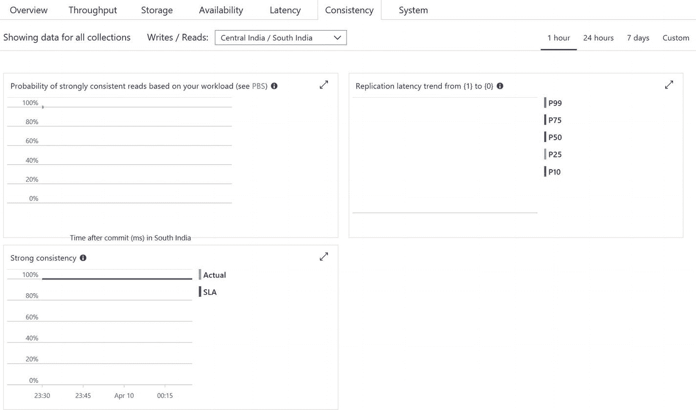

图 6-15

Consistency metrics