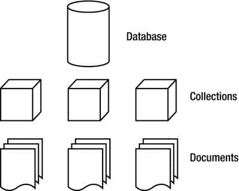
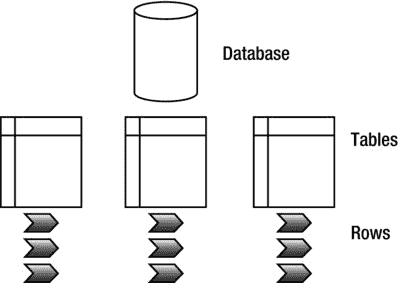

# 3.数据模型

Abstract

在前一章中，您学习了如何在两个常用的平台(Windows 和 Linux)上安装 MongoDB，以及如何用一些额外的驱动程序来扩展数据库。在本章中，您将把注意力从操作系统上转移，转而研究 MongoDB 数据库的总体设计。具体来说，您将了解什么是集合，文档看起来像什么，索引如何工作以及它们做什么，最后，何时何地引用数据而不是嵌入数据。我们在第一章中简单地提到了一些概念，但是在这一章中，我们将更详细地探讨它们。在这一章中，你会看到一些代码示例，它们旨在让你对所讨论的概念有一个良好的感觉。不过，不要太担心你将看到的命令，因为它们将在第 4 章中详细讨论。

在前一章中，您学习了如何在两个常用的平台(Windows 和 Linux)上安装 MongoDB，以及如何用一些额外的驱动程序来扩展数据库。在本章中，您将把注意力从操作系统上转移，转而研究 MongoDB 数据库的总体设计。具体来说，您将了解什么是集合，文档看起来像什么，索引如何工作以及它们做什么，最后，何时何地引用数据而不是嵌入数据。我们在第 1 章中简要地提到了其中的一些概念，但是在这一章中，我们将更详细地探讨它们。在这一章中，你会看到一些代码示例，它们旨在让你对所讨论的概念有一个良好的感觉。不过，不要太担心你将看到的命令，因为它们将在第四章[中被广泛讨论。](04.html)

## 设计数据库

正如您在前两章中了解到的，MongoDB 数据库是无关系和无模式的。这意味着 MongoDB 数据库不像关系数据库(如 MySQL)那样绑定到任何预定义的列或数据类型。这种实现的最大好处是处理数据非常灵活，因为文档中不需要预定义的结构。

更简单地说:您完全可以拥有一个包含数百甚至数千个文档的集合，这些文档都具有不同的结构——而不违反任何 MongoDB 数据库规则。

这种灵活的无模式设计的好处之一是，在用 Python 或 PHP 等动态类型语言编程时，您不会受到限制。事实上，如果由于数据库的先天限制，您的极其灵活且具有动态能力的编程语言不能发挥其全部潜力，这将是一个严重的限制。

让我们再看一下 MongoDB 中文档的数据设计是什么样子，特别注意 MongoDB 中的数据与关系数据库中的数据相比有多灵活。在 MongoDB 中，文档是包含实际数据的项，相当于 SQL 中的一行。在下面的例子中，您将看到两种完全不同类型的文档如何在一个名为`Media`的集合中共存(注意，集合大致相当于 SQL 世界中的一个表):

`{`

`"Type": "CD"`，

`"Artist": "Nirvana"`，

`"Title": "Nevermind"`，

`"Genre": "Grunge"`，

`"Releasedate": "1991.09.24"`，

`"Tracklist": [`

`{`

`"Track" : "1"`，

`"Title" : "Smells Like Teen Spirit"`，

`"Length" : "5:02"`

`}`，

`{`

`"Track" : "2"`，

`"Title" : "In Bloom"`，

`"Length" : "4:15"`

`}`

`]`

`}`

`{`

`"type": "Book"`，

`"Title": "Definitive Guide to MongoDB: A complete guide to dealing with Big Data using MongoDB 2nd, The"`，

`"ISBN": "987-1-4302-5821-6"`，

`"Publisher": "Apress"`，

`"Author": [`

`"Hows, David"`

`"Plugge, Eelco"`，

`"Membrey, Peter"`，

`"Hawkins, Tim]`

`}`

在查看这两个文档时，您可能已经注意到，大多数字段彼此并不紧密相关。是的，它们都有名为`Title`和`Type`的字段；但是除了相似性之外，这些文档是完全不同的。尽管如此，这两个文件都包含在一个叫做`Media`的集合中。

MongoDB 被称为无模式数据库，但这并不意味着 MongoDB 的数据结构完全没有模式。例如，您确实在 MongoDB 中定义了集合和索引(您将在本章后面了解更多)。然而，您不需要为将要添加的任何文档预定义一个结构，例如使用 MySQL 时就是这样。

简单地说，MongoDB 是一个非常动态的数据库；除非您也将每个可能的字段添加到您的表中，否则前面的示例在关系数据库中永远不会起作用。这样做将会浪费空间和性能，更不用说高度混乱了。

### 向下钻取集合

如前所述，集合是 MongoDB 中常用的术语。你可以把一个集合想象成一个存储你的文档(也就是你的数据)的容器，如图 [3-1](#Fig1) 所示。

图 3-1。

The MongoDB database model

现在将 MongoDB 数据库模型与关系数据库的典型模型进行比较(参见图 [3-2](#Fig2) )。

图 3-2。

A typical relational database model

正如您所看到的，这两种类型的数据库的一般结构是相同的；然而，你不会以一点相似的方式使用它们。MongoDB 中有几种类型的集合。默认集合类型的大小是可扩展的:添加的数据越多，它就越大。也可以定义有上限的集合。在最旧的文档被较新的文档替换之前，这些有上限的集合只能包含一定量的数据(您将在第 4 章中了解关于这些集合的更多信息)。

MongoDB 中的每个集合都有一个唯一的名称。当使用`createCollection`函数创建时，该名称应该以字母开头，或者可选地以下划线(`_`)开头。名称可以包含数字和字母；然而，`$`符号是由 MongoDB 保留的。同样，不允许使用空字符串(" ")；名称中不能使用空字符，并且不能以“`system`开头字符串。一般来说，建议您保持集合的名称简单而简短(大约九个字符左右)；但是，集合名称中允许的最大字符数是 128。显然，没有太多实际的理由来创造这么长的名字。

单个数据库的默认限制是 24，000 个名称空间。每个集合至少有两个名称空间:一个用于集合本身，另一个用于在集合中创建的第一个索引。但是，如果要为每个集合添加更多的索引，就需要使用另一个名称空间。理论上，这意味着默认情况下每个数据库最多可以有 12，000 个集合，假设每个集合只包含一个索引。但是，在执行 MongoDB 服务应用程序(`mongod`)时，可以通过提供`nssize`参数来增加对名称空间数量的限制。

### 使用文档

回想一下，文档由键值对组成。例如，对`"type" : "Book"`由名为`type`的键和它的值`Book`组成。键被写成字符串，但是其中的值可以有很大的不同。值可以是一组丰富的数据类型中的任何一种，例如数组，甚至是二进制数据。记住:MongoDB 以 BSON 格式存储它的数据(参见[第 1 章](01.html)了解关于这个主题的更多信息)。

接下来，让我们看看可以添加到文档中的所有可能的数据类型，以及它们的用途:

*   String:这种常用的数据类型包含一个文本字符串(或任何其他类型的字符)。该数据类型主要用于存储文本值(例如，`"Country" : "Japan"`)。
*   Integer (32b 和 64b):该类型用于存储一个数值(例如，`{ "Rank" : 1 }`)。请注意，整数前后没有引号。
*   Boolean:该数据类型可以设置为`TRUE`或`FALSE`。
*   Double:该数据类型用于存储浮点值。
*   最小/最大键:该数据类型用于将一个值分别与最低和最高 BSON 元素进行比较。
*   数组:该数据类型用于存储数组(例如，[ `"Membrey, Peter","Plugge, Eelco","Hows, David"]`)。
*   时间戳:该数据类型用于存储时间戳。当文档被修改或添加时，这对于记录非常方便。
*   对象:该数据类型用于嵌入的文档。
*   Null:该数据类型用于一个`Null`值。
*   符号:该数据类型的用法与字符串相同；然而，它通常是为使用特定符号类型的语言保留的。
*   Date *:该数据类型用于以 Unix 时间格式(POSIX 时间)存储当前日期或时间。
*   Object ID *:该数据类型用于存储文档的 ID。
*   二进制数据*:该数据类型用于存储二进制数据。
*   正则表达式*:该数据类型用于正则表达式。所有选项都由按字母顺序提供的特定字符表示。你会在第 4 章学到更多关于正则表达式的知识。
*   JavaScript 代码*:该数据类型用于 JavaScript 代码。

星号意味着最后五种数据类型(日期、对象 ID、二进制数据、正则表达式和 JavaScript 代码)是非 JSON 类型；具体来说，它们是 BSON 允许您使用的特殊数据类型。在第 4 章中，你将学习如何使用`$type`操作符来识别你的数据类型。

理论上，这听起来很简单。然而，您可能想知道如何实际设计文档，包括在其中放入什么信息。因为文档可以包含任何类型的数据，所以您可能认为没有必要从另一个文档中引用信息。在下一节中，我们将研究在文档中嵌入信息与从另一个文档中引用信息相比的优缺点。

#### 在文档中嵌入和引用信息

您可以选择将信息嵌入到文档中，或者从另一个文档中引用该信息。嵌入信息仅仅意味着将某种类型的数据(例如，包含更多数据的数组)放入文档本身。引用信息意味着创建对包含该特定数据的另一个文档的引用。通常，在使用关系数据库时会引用信息。例如，假设您想使用一个关系数据库来跟踪您的 CD、DVD 和书籍。在这个数据库中，您可能有一个用于 CD 收藏的表和另一个用于存储 CD 曲目列表的表。因此，您可能需要查询多个表来获取特定 CD 上的曲目列表。

然而，使用 MongoDB(和其他非关系数据库)，嵌入这样的信息会容易得多。毕竟，文档本身就能够做到这一点。采用这种方法可以使数据库保持整洁，确保所有相关信息都保存在一个文档中，甚至可以更快地工作，因为数据随后会存放在磁盘上。

现在让我们通过一个真实的场景来看看嵌入和引用信息之间的区别:将 CD 数据存储在数据库中。

在关系方法中，您的数据结构可能如下所示:

`|_media`

`|_cds`

`|_id, artist, title, genre, releasedate`

`|_ cd_tracklists`

`|_cd_id, songtitle, length`

在非关系方法中，您的数据结构可能如下所示:

`|_media`

`|_items`

`|_<document>`

在非关系方法中，文档可能如下所示:

`{`

`"Type": "CD"`，

`"Artist": "Nirvana"`，

`"Title": "Nevermind"`，

`"Genre": "Grunge"`，

`"Releasedate": "1991.09.24"`，

`"Tracklist": [`

`{`

`"Track" : "1"`，

`"Title" : "Smells Like Teen Spirit"`，

`"Length" : "5:02"`

`}`，

`{`

`"Track" : "2"`，

`"Title" : "In Bloom"`，

`"Length" : "4:15"`

`}`

`]`

`}`

在这个例子中，曲目列表信息被嵌入在文档本身中。这种方法既高效又组织有序。您希望存储的关于此 CD 的所有信息都被添加到一个文档中。在 CD 数据库的关系版本中，这至少需要两个表；在非关系数据库中，只需要一个集合和一个文档。

当检索给定 CD 的信息时，只需要将该信息从一个文档加载到 RAM 中，而不是从多个文档中。请记住，每个引用都需要数据库中的另一个查询。

Tip

使用 MongoDB 的经验法则是尽可能嵌入数据。这种方法效率更高，而且几乎总是可行的。

此时，您可能想知道一个应用程序有多个用户的用例。一般来说，前面提到的 CD 应用程序的关系数据库版本需要一个包含所有用户的表和两个添加条目的表。对于非关系数据库来说，为用户和添加的项建立单独的集合是一个很好的实践。对于这类问题，MongoDB 允许您以两种方式创建引用:手动或自动。在后一种情况下，您使用 DBRef 规范，它提供了更大的灵活性，以防集合从一个文档变化到下一个文档。你将在第 4 章中了解更多关于这两种方法的信息。

### 创建 _id 字段

MongoDB 数据库中的每个对象都包含一个惟一的标识符，用于将该对象与其他所有对象区分开来。这个标识符称为 _ `id`键，它会自动添加到您在集合中创建的每个文档中。

`_id`键是您创建的每个新文档中添加的第一个属性。即使您不告诉 MongoDB 创建密钥，这一点仍然成立。例如，前面例子中的代码都没有使用`_id`键。尽管如此，MongoDB 会在每个文档中自动为您创建一个`_id`键。这样做是因为`_id`键是集合中每个文档的强制元素。

如果不手动指定`_id`值，该类型将被设置为由 12 字节二进制值组成的特殊 BSON 数据类型。由于它的设计，这个值很有可能是唯一的。12 字节的值由一个 4 字节的时间戳(从纪元开始的秒数，或 1970 年 1 月 1 日 st )、一个 3 字节的机器 ID、一个 2 字节的进程 ID 和一个 3 字节的计数器组成。很高兴知道`counter`和时间戳字段是以大端格式存储的。这是因为 MongoDB 希望确保这些值的顺序是递增的，而 Big Endian 方法最适合这一要求。

Note

术语大端序和小端序指的是单个字节/位如何存储在存储器中较长的数据字中。Big Endian 仅仅意味着首先保存最重要的值。类似地，Little Endian 意味着首先保存最不重要的值。

图 [3-3](#Fig3) 显示了`_id`键的值是如何建立的，以及这些值的来源。

图 3-3。

Creating the _id key in MongoDB

使用 MongoDB 时加载的每一个额外支持的驱动程序(如 PHP 驱动程序或 Python 驱动程序)都支持这种特殊的 BSON 数据类型，并在创建新数据时使用它。您还可以从 MongoDB shell 调用`ObjectId()`来为`_id`键创建一个值。或者，您可以使用`ObjectId(` `string` `)`指定自己的值，其中`string`代表指定的十六进制字符串。

## 构建索引

正如在第一章中提到的，索引只不过是一种数据结构，它收集关于集合文档中指定字段值的信息。MongoDB 的查询优化器使用这种数据结构对集合中的文档进行快速排序。

请记住，索引可以确保快速查找文档中的数据。基本上，您应该将索引视为预定义的查询，该查询已被执行并存储了其结果。可以想象，这极大地提高了查询性能。MongoDB 的一般经验是，您应该为您希望在 MySQL 中拥有索引的同类场景创建一个索引。

创建自己的索引的最大好处是查询经常使用的信息会非常快，因为您的查询不需要遍历整个数据库来收集这些信息。

创建(或删除)索引相对容易——只要你掌握了窍门。您将在第 4 章中学习如何操作，该章涵盖了数据处理。在[第 1 章](01.html) 0 中，您还将学习一些更高级的利用索引的技术，其中涵盖了如何最大化性能。

### 索引对性能的影响

您可能想知道为什么需要删除索引、重建索引，甚至删除集合中的所有索引。简单的答案是，这样做可以让你清理一些违规行为。例如，有时数据库的大小会莫名其妙地急剧增加。在其他时候，索引占用的空间可能会让您觉得过多。

需要记住的另一件好事是:每个集合最多可以有 40 个索引。一般来说，这比你应该需要的要多得多，但是有一天你可能会达到这个极限。

Note

添加索引可以提高查询速度，但会降低插入或删除速度。最好只考虑为读取次数高于写入次数的集合添加索引。当写操作多于读操作时，索引甚至会适得其反。

最后，所有索引信息都存储在数据库的`system.indexes`集合中。例如，您可以运行`db.indexes.find()`命令来快速查看到目前为止已经存储的索引。要查看为特定集合创建的索引，可以使用`getIndexes`命令:

`db.collection.getIndexes()`

## 实施地理空间索引

正如[第 1 章](01.html)简要提到的，MongoDB 从 1.4 版本开始就实现了地理空间索引。这意味着，除了普通索引之外，MongoDB 还支持地理空间索引，这些索引旨在以最佳方式处理基于位置的查询。例如，您可以使用此功能来查找与用户当前位置最近的已知项目。或者，您可以进一步细化搜索，以查询当前位置附近指定数量的餐馆。如果您正在设计一个应用程序，希望找到离给定客户的邮政编码最近的分支机构，这种类型的查询会特别有用。

要为其添加地理空间信息的文档必须包含子对象或数组，其第一个元素指定对象类型，后跟项目的经度和纬度，如下例所示:

`> db.restaurants.insert({name: "Kimono", loc: { type: "Point", coordinates: [ 52.37045`

`1, 5.217497]}})`

注意，`type`参数可以用来指定文档的对象类型，可以是`Point`、`LineString`或`Polygon`。正如所料，`Point`类型用于指定项目(在本例中是一家餐馆)正好位于给定的地点，因此正好需要两个值，经度和纬度。`LineString`类型可用于指定项目沿着特定的线(比如街道)延伸，因此需要起点和终点，如下例所示:

`> db.streets.insert( {name: "Westblaak", loc: { type: "LineString", coordinates: [ [52.36881,4.890286],[52.368762,4.890021] ] } })`

类型可以用来指定一个(非默认的)形状(比如一个购物区)。使用此类型时，您需要确保第一个点和最后一个点是相同的，以闭合回路。此外，点坐标将作为数组中的数组提供，如下例所示:

`> db.stores.insert( {name: "SuperMall", loc: { type: "Polygon", coordinates: [ [ [52.146917,5.374337], [52.146966,5.375471], [52.146722,5.375085], [52.146744,5.37437], [52.146917,5.374337] ] ] } } )`

在大多数情况下，`Point`类型是合适的。

一旦地理空间信息被添加到文档中，您就可以创建索引(当然，甚至可以预先创建索引)并为`ensureIndex()`函数提供`2dsphere`参数:

`> db.restaurants.ensureIndex( { loc: "2dsphere" } )`

Note

`ensureIndex()`功能用于添加自定义索引。先不要担心这个函数的语法——你将在下一章深入学习如何使用`ensureIndex()`。

`2dsphere`参数告诉`ensureIndex()`它正在索引一个类似地球的球体上的坐标或一些其他形式的二维信息。默认情况下，`ensureindex()`假设给出了一个纬度/经度键，它使用的范围是从`-180`到`180`。但是，您可以使用`min`和`max`参数覆盖这些值:

`> db.restaurants.ensureIndex( { loc: "2dsphere" }, { min : -500 , max : 500 } )`

还可以通过使用次键值(也称为复合键)来扩展地理空间索引。当您打算查询多个值时，此结构会很有用，例如位置(地理空间信息)和类别(升序排序):

`> db.restaurants.ensureIndex( { loc: "2dsphere", category: 1 } )`

Note

此时，地理空间实现是基于世界是一个完美球体的想法。因此，每一度的纬度和经度正好是 111 公里(69 英里)长。然而，这只有在赤道上才是正确的；离赤道越远，经度的每一度变得越小，在两极接近零。

### 查询地理空间信息

在这一章中，我们主要关注两件事:如何对数据建模，以及数据库如何在应用程序的后台工作。也就是说，在各种各样的应用程序中，操作地理空间信息变得越来越重要，所以我们将花一些时间来解释如何在 MongoDB 数据库中利用地理空间信息。

在开始之前，一个温和的警告。如果您对 MongoDB 完全陌生，并且过去没有机会使用(地理空间)索引数据，这一部分可能会让您感到有些不知所措。不过，不用担心；你现在可以安全地跳过它，如果你愿意，以后再回来。给出的例子向您展示了如何(以及为什么)使用地理空间索引的实际例子，使其更容易理解。抛开这些不谈，如果你觉得自己很勇敢，请继续读下去。

一旦向集合中添加了数据，并且创建了索引，就可以进行地理空间查询。例如，让我们看几行简单而强大的代码，演示如何使用地理空间索引。

首先启动 MongoDB shell，用`use`函数选择一个数据库。在这种情况下，数据库被命名为`restaurants`:

>使用餐厅

一旦选择了数据库，您就可以定义一些包含地理空间信息的文档，然后将它们插入到`places`集合中(记住:您不需要事先创建集合):

`> db.restaurants.insert( { name: "Kimono", loc: { type: "Point", coordinates: [ 52.37045`

`1, 5.217497] } } )`

`> db.restaurants.insert( {name: "Shabu Shabu", loc: { type: "Point", coordinates: [51.9`

`15288,4.472786] } } )`

`> db.restaurants.insert( {name: "Tokyo Cafe", loc: { type: "Point", coordinates: [52.36`

`8736, 4.890530] } } )`

添加数据后，您需要告诉 MongoDB shell 根据在`loc`键中指定的位置信息创建一个索引，如下例所示:

`> db.restaurants.ensureIndex ( { loc: "2dsphere" } )`

一旦创建了索引，您就可以开始搜索您的文档了。首先搜索一个精确的值(到目前为止，这是一个“普通的”查询；此时与地理空间信息无关):

`> db.restaurants.find( { loc : [52,5] } )`

`>`

前面的搜索没有返回任何结果。这是因为查询太具体了。在这种情况下，更好的方法是搜索包含接近给定值的信息的文档。您可以使用`$near`操作符来完成这个任务。请注意，这需要指定`type`运算符，如下例所示:

`> db.restaurants.find( { loc : { $geoNear : { $geometry : { type : "Point", coordinates:`

`[52.338433,5.513629] } } } } )`

这会产生以下输出:

`{`

`"_id" : ObjectId("51ace0f380523d89efd199ac")`，

`"name" : "Kimono"`，

`"loc" : {`

`"type" : "Point"`，

`"coordinates" : [ 52.370451, 5.217497 ]`

`}`

`}`

`{`

`"_id" : ObjectId("51ace13380523d89efd199ae")`，

`"name" : "Tokyo Cafe"`，

`"loc" : {`

`"type" : "Point"`，

`"coordinates" : [ 52.368736, 4.89053 ]`

`}`

`}`

`{`

`"_id" : ObjectId("51ace11b80523d89efd199ad")`，

`"name" : "Shabu Shabu"`，

`"loc" : {`

`"type" : "Point"`，

`"coordinates" : [ 51.915288, 4.472786 ]`

`}`

`}`

尽管这组结果看起来确实更好，但是仍然有一个问题:所有的文档都被返回了！当不使用任何附加运算符时，`$near`返回前 100 个条目，并根据它们与给定坐标的距离对它们进行排序。现在，虽然我们可以选择使用`limit`函数来限制我们的结果，比如说前两项(或者两百项，如果我们想要的话),但是更好的做法是将结果限制在给定范围内。

这可以通过添加`$maxDistance`操作符来实现。使用这个操作符，您可以告诉 MongoDB 只返回那些距离给定点最大距离(以米为单位)以内的结果，如下例及其输出所示:

`> db.retaurants.find( { loc : { $geoNear : { $geometry : { type : "Point", coordinates: [52.338433,5.513629] }, $maxDistance : 40000 } } } )`

`{`

`"_id" : ObjectId("51ace0f380523d89efd199ac")`，

`"name" : "Kimono"`，

`"loc" : {`

`"type" : "Point"`，

`"coordinates" : [ 52.370451, 5.217497 ]`

`}`

`}`

如您所见，这仅返回一个结果:一家位于距起点 40 公里(或大约 25 英里)以内的餐馆。

Note

返回结果的数量和给定查询的执行时间之间有直接的关系。

除了`$geoNear`操作符，MongoDB 还包括一个`$geoWithin`操作符。您可以使用此运算符来查找特定形状的项目。此时，您可以找到位于`$box, $polygon, $center`和`$centerSphere`形状中的项目，其中`$box`表示矩形，`$polygon`表示您选择的特定形状，`$center`表示圆形，`$centerSphere`定义球体上的圆。让我们看几个额外的例子来说明如何使用这些形状。

Note

在 MongoDB 的 2.4 版本中，`$within`操作符被弃用，取而代之的是`$geoWithin`。这个操作符并不严格要求地理空间索引。此外，与`$near`操作符不同，`$geoWithin`不对返回的结果进行排序，从而提高了它们的性能。

要使用`$box`形状，首先需要指定盒子的左下角坐标，然后是右上角坐标，如下例所示:

`> db.restaurants.find( { loc: { $geoWithin : { $box : [ [52.368549,4.890238], [52.368849,4.89094] ] } } } )`

类似地，要在特定的多边形表单中查找项目，需要将点的坐标指定为一组嵌套数组。再次注意，第一个和最后一个坐标必须相同，才能正确闭合形状，如下例所示:

`> db.restaurants.find( { loc :`

`{ $geoWithin :`

`{ $geometry :`

`{ type : "Polygon"`，

`coordinates : [ [`

`[52.368739,4.890203], [52.368872,4.890477], [52.368726,4.890793]`，

`[52.368608,4.89049], [52.368739,4.890203]`

`] ]`

`}`

`}`

`} )`

在基本的`$circle`形状中查找项目的代码非常简单。在这种情况下，在执行`find()`功能之前，您需要指定圆心及其半径，用坐标系使用的单位测量:

`> db.restaurants.find( { loc: { $geoWithin : { $center : [ [52.370524, 5.217682], 10] } } } )`

注意，从 MongoDB 版本 2.2.3 开始，`$center`操作符可以在没有地理空间索引的情况下使用。但是，建议创建一个以提高性能。

最后，要查找位于球体(比如我们的星球)上的圆形内的项目，可以使用`$centerSphere`操作符。该运算符类似于`$center`，比如:

`> db.restaurants.find( { loc: { $geoWithin : { $centerSphere : [ [52.370524, 5.217682], 10] } } } )`

默认情况下，`find()`函数非常适合运行查询。然而，MongoDB 还提供了`geoNear()`函数，它的工作方式类似于`find()`函数，但也显示结果中每个项目离指定点的距离。`geoNear()`功能还包括一些额外的诊断。以下示例使用`geoNear()`函数来查找最接近指定位置的两个结果:

`> db.runCommand( { geoNear : "restaurants", near : { type : "Point", coordinates: [52.338433,5.513629] }, spherical : true})`

它返回以下结果:

`{`

`"ns" : "stores.restaurants"`，

`"results" : [`

`{`

`"dis" : 33155.517810497055`，

`"obj" : {`

`"_id" : ObjectId("51ace0f380523d89efd199ac")`，

`"name" : "Kimono"`，

`"loc" : {`

`"type" : "Point"`，

`"coordinates" : [`

`52.370451`，

`5.217497`

`]`

`}`

`}`

`}`，

`{`

`"dis" : 69443.96264213261`，

`"obj" : {`

`"_id" : ObjectId("51ace13380523d89efd199ae")`，

`"name" : "Tokyo Cafe"`，

`"loc" : {`

`"type" : "Point"`，

`"coordinates" : [`

`52.368736`，

`4.89053`

`]`

`}`

`}`

`}`，

`{`

`"dis" : 125006.87383713324`，

`"obj" : {`

`"_id" : ObjectId("51ace11b80523d89efd199ad")`，

`"name" : "Shabu Shabu"`，

`"loc" : {`

`"type" : "Point"`，

`"coordinates" : [`

`51.915288`，

`4.472786`

`]`

`}`

`}`

`}`

`]`，

`"stats" : {`

`"time" : 6`，

`"nscanned" : 3`，

`"avgDistance" : 75868.7847632543`，

`"maxDistance" : 125006.87383713324`

`}`，

`"ok" : 1`

`}`

这就完成了我们现在对地理空间信息的介绍；然而，在本书接下来的章节中，你会看到更多的例子来展示如何利用地理空间功能。

## 在现实世界中使用 MongoDB

现在您已经安装了 MongoDB 及其相关插件，并且已经了解了数据模型，是时候开始工作了。在本书接下来的五章中，您将学习如何构建、查询和操作各种示例 MongoDB 数据库(参见表 [3-1](#Tab1) 以快速浏览即将到来的主题)。每章将主要坚持使用该章独有的单一数据库；我们采用这种方法是为了以模块化的方式更容易阅读这本书。

表 3-1。

MongoDB Sample Databases Covered in This Book

<colgroup><col> <col> <col></colgroup> 
| 回 | 数据库名称 | 主题 |
| --- | --- | --- |
| four | `Library` | 使用数据和索引 |
| five | `Test` | 文件系统 |
| six | `Contacts` | PHP 和 MongoDB |
| seven | `Inventory` | Python 和 MongoDB |
| eight | `Test` | 高级查询 |

## 摘要

在这一章中，我们看了数据库后台发生的事情。我们还更深入地探讨了集合和文档的基本概念；我们还讨论了 MongoDB 中支持的数据类型，以及如何嵌入和引用数据。

接下来，我们研究了索引的作用，包括何时以及为什么应该使用(或不使用)索引。

我们还谈到了地理空间索引的概念。例如，我们讨论了如何存储地理空间数据；我们还解释了如何使用常规的`find()`函数或更基于地理空间的`geoNear`数据库命令来搜索这样的数据。

在下一章中，我们将进一步了解 MongoDB shell 是如何工作的，包括哪些函数可以用来插入、查找、更新或删除数据。我们还将探索条件运算符如何帮助您实现所有这些功能。