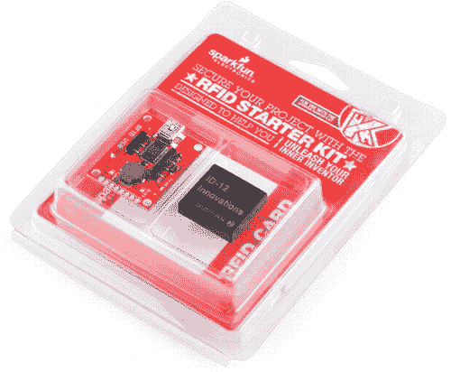
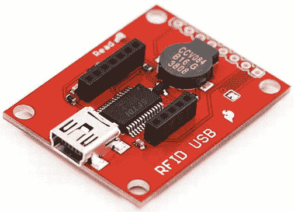
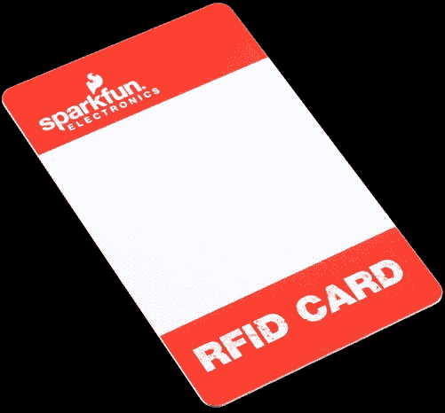
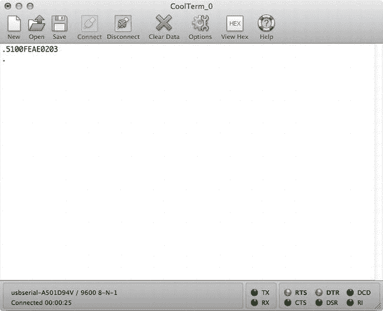

# 九、开发 MySQL 插件

在我们浏览 MySQL 源代码和架构的第三章中，我们提到了 MySQL 的一个特殊特性，叫做插件。MySQL 插件是专门设计的动态库，允许您在不使服务器离线的情况下向服务器添加新功能。目前支持多种形式的插件，但是随着服务器的不断发展，预计会看到更多使用这种架构的特性。

本章更详细地研究了 MySQL 插件架构。您将了解更多关于插件如何工作，如何构造，以及服务器支持哪些类型的插件。我还将演示如何通过创建一个独特的认证插件来创建一个插件。

MySQL 插件解释

MySQL 插件包含在名为库的动态可加载模块中。一个库可以包含一个或多个插件，可以单独安装(加载)或卸载(卸载)。插件以专门特性的形式为服务器提供扩展。除了特性本身，插件还可以包含自己的状态和系统变量。一个插件是使用被称为应用编程接口(API) 的标准化架构开发的。

插件架构(称为 MySQL 插件 API)使用一组特殊的结构，其中包含信息以及指向公共方法的函数指针。使用公共结构允许服务器调用特定的方法，由此函数指针将调用重新映射到该插件的方法的特定实现。我将在后面的章节中更详细地解释插件架构。

插件的类型

MySQL 服务器目前支持几种类型的插件。我们已经看到了一个非常早期的插件的例子——用户自定义函数 [<sup>1</sup>](#Fn1) (UDF)。[第 7 章](07.html)详细介绍了这种形式的插件。有些人会说 UDF 不是真正的插件，尽管事实上它们是可动态加载的，并且使用相同的命令来安装和卸载。这是因为它们不使用标准的插件架构。

[表 9-1](#Tab1) 列出了使用该架构支持的插件类型，包括插件名称、类型名称、简短描述以及源代码中示例的位置(如果有的话)。

[表 9-1](#_Tab1) 。MySQL 插件 API 支持的插件

| 类型 | 描述 | 例子 |
| --- | --- | --- |
| 南非民主统一战线(United Democratic Front) | SQL 命令中使用的特殊函数。 | /sql/udf_example.cc |
| 存储引擎 | 用于读写数据的存储引擎。 | /存储/* |
| 全文分析器 | 用于在表中搜索文本列的全文分析器。 | /插件/全文 |
| 守护进程 | 允许将离散代码模块加载到服务器中，而无需与服务器本身进行交互，例如复制心跳和监视 | /插件/守护程序 _ 示例 |
| 信息图式 | 允许创建新的 INFORMATION_SCHEMA 视图，以便向用户传达信息。 |  |
| 审计 | 启用服务器审核。MySQL 商业版中有一个审计日志插件。 | /plug-in/audit _ null |
| 分身术 | 专门的复制功能，如更改事件执行的同步方法。 | /plugin/semisync |
| 证明 | 更改登录服务器的验证方法。 | /plugin/auth |
| 验证密码 | 实施密码规则以获得更安全的密码。 | /plugin/密码验证 |

正如您所看到的，有许多类型的插件，它们提供了广泛的特性。随着更加强调模块化设计，我们很可能会在未来看到更多的插件类型。

使用 MySQL 插件

插件可以使用特殊的 SQL 命令作为启动选项来加载和卸载，也可以通过`mysql_plugin`客户端应用来加载和卸载。

要使用 SQL 命令加载插件，使用`LOAD PLUGIN`命令，如下所示。这里，我们正在加载一个名为`something_cool` 的插件，它包含在名为`some_cool_feature.so`的编译库模块中。这些库需要放在`plugin_dir`路径中，以便服务器可以找到它们。

```sql
mysql> SHOW VARIABLES LIKE 'plugin_dir';
+−−-------------+−−----------------------------+
| Variable_name | Value                        |
+−−-------------+−−----------------------------+
| plugin_dir    | /usr/local/mysql/lib/plugin/ |
+−−-------------+−−----------------------------+
1 row in set (0.00 sec)
```

 **注意**MySQL 文档使用术语*安装*和*卸载*来动态加载和卸载插件。文档使用术语 *load* 来指定通过启动选项使用的插件。

```sql
mysql> INSTALL PLUGIN something_cool SONAME some_cool_feature.so;
```

卸载插件更容易，如下所示。这里我们正在卸载刚刚安装的插件。

```sql
mysql> UNINSTALL PLUGIN something_cool;
```

插件也可以在启动时使用- plugin-load 选项安装。这个选项可以被多次列出——每个插件一次——或者可以接受一个分号分隔的列表(没有空格)。如何使用此选项的示例包括:

```sql
mysqld ... --plugin-load=something_cool ...
mysqld ... --plugin-load=something_cool;something_even_better ...
```

还可以使用`mysql_plugin`客户端应用加载和卸载插件。该应用要求服务器停止工作。它将以引导模式启动服务器，加载或卸载插件，然后关闭引导的服务器。该应用主要用于停机期间的服务器维护，或者作为一种诊断工具，用于通过消除插件(以简化诊断)来尝试重启故障服务器。

客户端应用使用一个配置文件来保存关于插件的相关数据，比如库的名称和其中包含的所有插件。一个插件库可以包含多个插件。下面是`daemon_example`插件的配置文件的一个例子。

```sql
#
# Plugin configuration file. Place on a separate line:
#
# library binary file name (without .so or .dll)
# component_name
# [component_name] - additional components in plugin
#
libdaemon_example
daemon_example
```

要使用`mysql_plugin`应用安装(启用)或卸载(禁用)插件，请至少指定插件的名称、`ENABLE`或`DISABLE`、`basedir`、`datadir`、`plugin-dir`和`plugin-ini`选项。如果该应用不在您的路径上，您可能还需要指定`my-print-defaults`选项。应用以静默方式运行，但是您可以打开 verbosity 来查看应用的运行情况(`vvv`)。下面描述了一个使用客户端应用加载`daemon_example`插件的例子。

```sql
cbell$ sudo ./mysql_plugin --datadir=/mysql_path/data/ --basedir=/mysql_path/ --plugin-dir=../plugin/daemon_example/ --plugin-ini=../plugin/daemon_example/daemon_example.ini --my-print-defaults=../extra daemon_example ENABLE -vvv
# Found tool 'my_print_defaults' as '/mysql_path/bin/my_print_defaults'.
# Command: /mysql_path/bin/my_print_defaults mysqld > /var/tmp/txtdoaw2b
#    basedir = /mysql_path/
# plugin_dir = ../plugin/daemon_example/
#    datadir = /mysql_path/data/
# plugin_ini = ../plugin/daemon_example/daemon_example.ini
# Found tool 'mysqld' as '/mysql_path/bin/mysqld'.
# Found plugin 'daemon_example' as '../plugin/daemon_example/libdaemon_example.so'
# Enabling daemon_example...
# Query: REPLACE INTO mysql.plugin VALUES ('daemon_example','libdaemon_example.so');
# Command: /mysql_path/bin/mysqld --no-defaults --bootstrap --datadir=/mysql_path/data/ --basedir=/mysql_path/ < /var/tmp/sqlft1mF7
# Operation succeeded.
```

请注意，在输出中，我必须使用超级用户权限。如果您试图从安装在隔离对 mysql 文件夹的访问的平台(如 Linux 和 Mac OS X)上的服务器安装或卸载插件，您将需要使用此工具。还要注意，详细输出显示了此应用正在做什么。在这种情况下，它用我们指定的插件的信息替换了`mysql.plugin`表中的任何行。类似的删除查询将被发出以禁用插件。

您可以通过以下三种方式之一发现哪些插件已经加载或已经加载。您可以使用特殊的 SHOW 命令，从 mysql.plugin 表中选择信息，或者从 INFORMATION_SCHEMA.plugins 视图中选择信息。每一种显示的信息都略有不同。下面演示了这些命令。为了简洁起见，我使用了输出的摘录。

```sql
mysql> show plugins;
+−−--------------------------+−−--------+−−------------------+−−-------+−−-------+
| Name                       | Status   | Type               | Library | License |
+−−--------------------------+−−--------+−−------------------+−−-------+−−-------+
| binlog                     | ACTIVE   | STORAGE ENGINE     | NULL    | GPL     |
| mysql_native_password      | ACTIVE   | AUTHENTICATION     | NULL    | GPL     |
| mysql_old_password         | ACTIVE   | AUTHENTICATION     | NULL    | GPL     |
| sha256_password            | ACTIVE   | AUTHENTICATION     | NULL    | GPL     |
| CSV                        | ACTIVE   | STORAGE ENGINE     | NULL    | GPL     |
| MEMORY                     | ACTIVE   | STORAGE ENGINE     | NULL    | GPL     |
| MyISAM                     | ACTIVE   | STORAGE ENGINE     | NULL    | GPL     |
| MRG_MYISAM                 | ACTIVE   | STORAGE ENGINE     | NULL    | GPL     |
| ARCHIVE                    | ACTIVE   | STORAGE ENGINE     | NULL    | GPL     |
| BLACKHOLE                  | ACTIVE   | STORAGE ENGINE     | NULL    | GPL     |
| FEDERATED                  | DISABLED | STORAGE ENGINE     | NULL    | GPL     |
| InnoDB                     | ACTIVE   | STORAGE ENGINE     | NULL    | GPL     |
...
| PERFORMANCE_SCHEMA         | ACTIVE   | STORAGE ENGINE     | NULL    | GPL     |
| partition                  | ACTIVE   | STORAGE ENGINE     | NULL    | GPL     |
+−−--------------------------+−−--------+−−------------------+−−-------+−−-------+
41 rows in set (0.00 sec)
```

注意显示在`SHOW PLUGINS`命令输出中的信息。这个视图是所有已知插件的列表，其中一些插件是通过命令行选项或特殊的编译指令自动加载的。它显示插件类型以及许可证类型。现在，让我们看看`mysql.plugin`表的输出。

```sql
mysql> select * from mysql.plugin;
Empty set (0.00 sec)
```

但是等等，没有输出！这是因为`mysql.plugin`表只存储那些已经安装的动态插件——更确切地说，是那些用`INSTALL PLUGIN`命令安装的插件。由于我们没有安装任何插件，所以没有什么可显示的。下面显示了插件安装后的输出。

```sql
mysql> install plugin daemon_example soname 'libdaemon_example.so';
Query OK, 0 rows affected (0.00 sec)

mysql> select * from mysql.plugin;
+−−--------------+−−--------------------+
| name           | dl                   |
+−−--------------+−−--------------------+
| daemon_example | libdaemon_example.so |
+−−--------------+−−--------------------+
1 row in set (0.00 sec)
```

现在让我们看看 INFORMATION_SCHEMA.plugins 视图的输出。下面显示了视图的输出。

```sql
mysql> select * from information_schema.plugins \G
*************************** 1\. row ***************************
           PLUGIN_NAME: binlog
        PLUGIN_VERSION: 1.0
         PLUGIN_STATUS: ACTIVE
           PLUGIN_TYPE: STORAGE ENGINE
   PLUGIN_TYPE_VERSION: 50606.0
        PLUGIN_LIBRARY: NULL
PLUGIN_LIBRARY_VERSION: NULL
         PLUGIN_AUTHOR: MySQL AB
    PLUGIN_DESCRIPTION: This is a pseudo storage engine to represent the binlog in a transaction
        PLUGIN_LICENSE: GPL
           LOAD_OPTION: FORCE
*************************** 2\. row ***************************
           PLUGIN_NAME: mysql_native_password
        PLUGIN_VERSION: 1.0
         PLUGIN_STATUS: ACTIVE
           PLUGIN_TYPE: AUTHENTICATION
   PLUGIN_TYPE_VERSION: 1.0
        PLUGIN_LIBRARY: NULL
PLUGIN_LIBRARY_VERSION: NULL
         PLUGIN_AUTHOR: R.J.Silk, Sergei Golubchik
    PLUGIN_DESCRIPTION: Native MySQL authentication
        PLUGIN_LICENSE: GPL
           LOAD_OPTION: FORCE
*************************** 3\. row ***************************
           PLUGIN_NAME: mysql_old_password
        PLUGIN_VERSION: 1.0
         PLUGIN_STATUS: ACTIVE
           PLUGIN_TYPE: AUTHENTICATION
   PLUGIN_TYPE_VERSION: 1.0
        PLUGIN_LIBRARY: NULL
PLUGIN_LIBRARY_VERSION: NULL
         PLUGIN_AUTHOR: R.J.Silk, Sergei Golubchik
    PLUGIN_DESCRIPTION: Old MySQL-4.0 authentication
        PLUGIN_LICENSE: GPL
           LOAD_OPTION: FORCE
...

*************************** 41\. row ***************************
           PLUGIN_NAME: partition
        PLUGIN_VERSION: 1.0
         PLUGIN_STATUS: ACTIVE
           PLUGIN_TYPE: STORAGE ENGINE
   PLUGIN_TYPE_VERSION: 50606.0
        PLUGIN_LIBRARY: NULL
PLUGIN_LIBRARY_VERSION: NULL
         PLUGIN_AUTHOR: Mikael Ronstrom, MySQL AB
    PLUGIN_DESCRIPTION: Partition Storage Engine Helper
        PLUGIN_LICENSE: GPL
           LOAD_OPTION: ON
*************************** 42\. row ***************************
           PLUGIN_NAME: daemon_example
        PLUGIN_VERSION: 1.0
         PLUGIN_STATUS: ACTIVE
           PLUGIN_TYPE: DAEMON
   PLUGIN_TYPE_VERSION: 50606.0
        PLUGIN_LIBRARY: libdaemon_example.so
PLUGIN_LIBRARY_VERSION: 1.4
         PLUGIN_AUTHOR: Brian Aker
    PLUGIN_DESCRIPTION: Daemon example, creates a heartbeat beat file in mysql-heartbeat.log
        PLUGIN_LICENSE: GPL
           LOAD_OPTION: ON
42 rows in set (0.01 sec)

mysql>
```

我们看到了与`SHOW PLUGINS`命令相似的信息，但是有更多的信息。除了名称、类型和许可信息，我们还可以看到插件的作者、版本和描述。还要注意，动态加载的插件`daemon_example`也显示在视图中。

现在您已经知道了这些命令的作用，您可以使用适当的命令来处理插件了。例如，如果您想一目了然地看到哪些插件可用，请使用`SHOW PLUGINS`命令。如果您想查看加载了哪些插件，请查询`mysql.plugin`表。如果你想查看可用插件的元数据，查询`INFORMATION_SCHEMA.plugins`视图。

MySQL 插件 API

插件架构在/include/mysql/plugin.h 中定义，这个文件中有很多元素，包括一些插件类型的专门代码。对每一行代码的完整解释超出了本书的范围；相反，在这一节中，我们关注的是为了构建你自己的插件，你需要熟悉的关键元素。

在文件的顶部附近，您会找到创建插件时使用的符号和值的定义。清单 9-1 显示了最常用符号的定义。每个插件类型都有定义，许可证类型也有定义。

***[清单 9-1](#_list1) 。*** 定义来自 plugin.h

```sql
/*
  The allowable types of plugins
*/
#define MYSQL_UDF_PLUGIN             0  /* User-defined function        */
#define MYSQL_STORAGE_ENGINE_PLUGIN  1  /* Storage Engine               */
#define MYSQL_FTPARSER_PLUGIN        2  /* Full-text parser plugin      */
#define MYSQL_DAEMON_PLUGIN          3  /* The daemon/raw plugin type */
#define MYSQL_INFORMATION_SCHEMA_PLUGIN  4  /* The I_S plugin type */
#define MYSQL_AUDIT_PLUGIN           5  /* The Audit plugin type        */
#define MYSQL_REPLICATION_PLUGIN     6       /* The replication plugin type */
#define MYSQL_AUTHENTICATION_PLUGIN  7  /* The authentication plugin type */
#define MYSQL_VALIDATE_PASSWORD_PLUGIN  8   /* validate password plugin type */
#define MYSQL_MAX_PLUGIN_TYPE_NUM    9  /* The number of plugin types   */

/* We use the following strings to define licenses for plugins */
#define PLUGIN_LICENSE_PROPRIETARY 0
#define PLUGIN_LICENSE_GPL 1
#define PLUGIN_LICENSE_BSD 2

#define PLUGIN_LICENSE_PROPRIETARY_STRING "PROPRIETARY"
#define PLUGIN_LICENSE_GPL_STRING "GPL"
#define PLUGIN_LICENSE_BSD_STRING "BSD"
```

插件支持的许可类型有定义。对于大多数标准的 MySQL 插件，许可是 GPL。对于那些只有 MySQL 商业许可才可用的插件，许可设置为专有。如果您需要添加更多的许可证类型，将它们添加到文件中，增加值，并提供一个文本字符串以在插件视图中标识它。

MySQL 插件 API 用来与服务器通信的机制是 st_mysql_structure，也是在/include/mysql/plugin.h 文件中定义的。清单 9-2 显示了 st_mysql_structure 的定义。

***[清单 9-2](#_list2) 。**T5 plugin . h 中的 st_mysql_plugin 结构*

```sql
/*
  Plugin description structure.
*/

struct st_mysql_plugin
{
  int type;             /* the plugin type (a MYSQL_XXX_PLUGIN value)   */
  void *info;           /* pointer to type-specific plugin descriptor   */
  const char *name;     /* plugin name                                  */
  const char *author;   /* plugin author (for I_S.PLUGINS)              */
  const char *descr;    /* general descriptive text (for I_S.PLUGINS)   */
  int license;          /* the plugin license (PLUGIN_LICENSE_XXX)      */
  int (*init)(MYSQL_PLUGIN);  /* the function to invoke when plugin is loaded */
  int (*deinit)(MYSQL_PLUGIN);/* the function to invoke when plugin is unloaded */
  unsigned int version; /* plugin version (for I_S.PLUGINS)             */
  struct st_mysql_show_var *status_vars;
  struct st_mysql_sys_var **system_vars;
  void * __reserved1;   /* reserved for dependency checking             */
  unsigned long flags;  /* flags for plugin */
};
```

结构中的前六个属性包含关于插件的元数据信息，包括类型、描述、名称、作者信息和许可证信息。接下来的两个属性是函数指针，指向加载和卸载插件的函数。接下来是包含为插件定义的状态和系统变量的结构。最后，有一个属性用于设置标志，以便将插件功能传达给服务器。

需要特别注意的是 info 属性。这是一个指向每种插件专用结构的指针。它们在/include/mysql 的头文件中定义，名为 plugin_*其中*代表插件类型。例如，plugin_auth.h 文件包含认证插件类型的结构定义。

定义的结构也以插件命名。每个结构包含每个插件类型的特定方法的属性和函数指针。通过这种方式，服务器可以成功地导航和调用每个插件类型的特定方法。下面显示了 plugin_auth.h 文件中的 st_mysql_auth 结构。

```sql
/**
  Server authentication plugin descriptor
*/
struct st_mysql_auth
{
  int interface_version;                        /** version plugin uses */
  /**
    A plugin that a client must use for authentication with this server
    plugin. Can be NULL to mean "any plugin".
  */
  const char *client_auth_plugin;
  /**
    Function provided by the plugin which should perform authentication (using
    the vio functions if necessary) and return 0 if successful. The plugin can
    also fill the info.authenticated_as field if a different username should be
    used for authorization.
  */
  int (*authenticate_user)(MYSQL_PLUGIN_VIO *vio, MYSQL_SERVER_AUTH_INFO *info);
};
```

文件中的特殊版本号对于每种插件类型都是唯一的。它定义了插件类型的版本号,用于在安装时帮助识别和确认架构与服务器的兼容性。

```sql
#define MYSQL_AUTHENTICATION_INTERFACE_VERSION 0x0100
```

插件和版本号

st_mysql_plugin 结构包含一个版本属性。除了在插件视图中显示之外，服务器不会直接使用它。我们应该知道另外两个版本号。第一个是 PLUGIN_LIBRARY_VERSION，服务器设置的版本号，表示插件 API 的版本。这允许服务器知道一个插件是否有兼容的架构。第二个是 PLUGIN_VERSION_TYPE，它特定于每个插件类型。我们可以在/library/mysql/plugin.h 中看到这些:

#定义 MYSQL _ PLUGIN _ INTERFACE _ VERSION 0x 0104

5.6.6 服务器的值是 1.4。您可以在上面 INFORMATION_SCHEMA.plugins 视图的输出中看到这一点。

#定义 MYSQL _ DAEMON _ INTERFACE _ VERSION(MYSQL _ VERSION _ ID < < 8)

上面显示了 daemon_example 的特定插件类型。在这种情况下，服务器的版本被放在高位字节中，以帮助进一步识别插件。对于服务器版本 5.6.6，该值将被计算为 50606.0。您可以在上面 INFORMATION_SCHEMA.plugins 视图的输出中看到这一点。

 **注意**正如我们上面看到的，大多数插件类型都有特定的值。作为早期的例子，daemon_example 的版本号为 0。

要创建一个插件，首先在/plugin 文件夹中创建一个新文件夹，命名为容易与你的插件关联的东西。在该文件夹中至少放置一个源文件，该文件包含 st_mysql_plugin 结构的实现，以及与插件类型相关的信息结构的具体实现。您应该用正确的元数据填充插件结构，实现初始化和取消初始化的方法，并实现插件类型的特定方法。

或者，您可以在源代码树之外创建一个文件夹，编译它，并将其与服务器库链接起来。如果高级开发人员希望将插件代码从服务器源代码中分离出来，他们可能想探索这个选项。

您还将创建一个 ini 文件，其中包含关于插件的信息，如“使用 MySQL 插件”一节中所述如果你有具体的结构，变量，定义等。，对于您的插件，您可以创建适当的文件并将它们放在同一个文件夹中。

现在我们已经看到了创建插件的构建模块，我们将看到如何编译插件，然后开始创建我们自己的插件。

编译 MySQL 插件

你可能会想，有一些神秘的机制用来编译你的插件。我有好消息告诉你——没有。您唯一需要的是一个 CMakeList.txt 文件，其中包含编译插件的 cmake 指令。对于库中只有一个插件的简单插件，文件内容很短。清单 9-3 显示了示例认证插件的完整内容。

***[清单 9-3](#_list3) 。*** CMakeLists.txt 为认证插件示例

```sql
# Copyright (c) 2010, Oracle and/or its affiliates. All rights reserved.
#
# This program is free software; you can redistribute it and/or
# modify it under the terms of the GNU General Public License as
# published by the Free Software Foundation; version 2 of the
# License.
#
# This program is distributed in the hope that it will be useful,
# but WITHOUT ANY WARRANTY; without even the implied warranty of
# MERCHANTABILITY or FITNESS FOR A PARTICULAR PURPOSE. See the
# GNU General Public License for more details.
#
# You should have received a copy of the GNU General Public License
# along with this program; if not, write to the Free Software
# Foundation, Inc., 51 Franklin St, Fifth Floor, Boston, MA 02110–1301  USA

MYSQL_ADD_PLUGIN(auth dialog.c
  MODULE_ONLY)

MYSQL_ADD_PLUGIN(auth_test_plugin test_plugin.c
  MODULE_ONLY)

MYSQL_ADD_PLUGIN(qa_auth_interface qa_auth_interface.c
  MODULE_ONLY)

MYSQL_ADD_PLUGIN(qa_auth_server qa_auth_server.c
  MODULE_ONLY)

MYSQL_ADD_PLUGIN(qa_auth_client qa_auth_client.c
  MODULE_ONLY)

CHECK_CXX_SOURCE_COMPILES(
"#define _GNU_SOURCE
#include <sys/socket.h>
int main() {
  struct ucred cred;
  getsockopt(0, SOL_SOCKET, SO_PEERCRED, &cred, 0);
}" HAVE_PEERCRED)

IF(HAVE_PEERCRED)
  MYSQL_ADD_PLUGIN(auth_socket auth_socket.c
    MODULE_ONLY)
ENDIF()
```

这个例子定义了五个插件。对于每个插件，MYSQL_ADD_PLUGIN 指令用于定义插件名称，并将其与源文件关联起来。在文件的顶部，定义了一个与插件无关的模块。如果您的插件代码要使用您在其他源文件中定义的特殊方法、函数或类，这就是您指定要编译的附加源文件的方式。

既然我们知道了构建插件的构件是什么，在哪里可以找到特定于插件类型的结构和定义，以及如何构建插件，我们就可以构建一个新的插件了。

在接下来的几节中，我将向您展示如何构建一个身份验证插件，该插件使用一个硬件设备来进一步保护您的服务器，方法是将登录限制为必须拥有特殊钥匙卡和个人识别码(PIN) 的用户。

RFID 认证插件

为了说明如何创建 MySQL 插件，我将向您展示如何创建身份验证插件，因为这可能是最有用的插件之一，也是寻求定制 MySQL 安装的开发人员可能想要创建的领域之一。我选择通过引入一个硬件设备来使该解决方案比典型的用户名和密码对更安全，从而使项目更有趣。在这种情况下，硬件设备读取管理员给用户的特殊身份卡，该卡包含硬件设备只读的唯一号码。这比简单的密码提供了更高一级的安全性。 [<sup>2</sup>](#Fn2)

我选择使用的 keycard 设备是射频识别卡(RFID) 。[<sup>3</sup>](#Fn3)RFID 标签通常是信用卡大小的塑料卡、标签或类似的东西，它包含一个特殊的天线，通常是线圈、细线或箔层的形式，被“调谐”到特定的频率，以便当读取器发射无线电信号时，标签可以使用电磁能量来传输嵌入在嵌入线圈中的非易失性消息，然后将其转换为字母数字串。这种形式的 RFID 标签是一种无源设备，因为它不包含电池。需要更大范围或功率的 RFID 系统通常在 RFID 标签本身中包括电池。这些被称为活动标签。

标签和阅读器必须调谐到相同的频率。有许多 RFID 标签制造商和众多频率。因此，当选择将 RFID 系统整合到您的项目中时，请确保您购买的标签与阅读器的频率相同。我建议购买一个包括阅读器和几个标签的套件，以确保避免兼容性问题。

对于这个项目，我们将使用这个字符串作为认证机制的一部分。如果我们还包括提示用户记住 PIN，这将进一步加强解决方案的安全性，因为除了目标用户之外，没有人可以使用该卡登录(当然，除非他们分享了他们的 PIN，但在这种情况下，您会遇到更严重的问题)。

该解决方案更加安全，因为它不仅仅依赖于用户必须知道的东西，例如密码，用户还必须拥有他们必须出示的物理项目来完成身份验证。因此，该解决方案提供了被认为是非常安全的身份验证的三个要素中的两个。第三个要素是进一步识别用户的生物特征，如指纹或掌纹。

在下一节中，我将描述这种认证机制是如何工作的。正如您将看到的，它包括一个客户机软件组件、一个客户机硬件组件和一个服务器软件组件。软件组件是一个特殊的认证插件。

操作概念

该项目使用 RFID 阅读器和标签或钥匙卡来代替传统的用户密码。服务器端的设置包括使用 CREATE USER 命令的变体来创建用户，并将她的帐户与 RFID 认证插件相关联。用户还被分配或允许使用一个短的数字串(我像大多数银行和信用卡一样使用 4 位数字)选择一个特殊的个人识别码(PIN)。我们使用 RFID 代码和连接的 PIN 来形成该用户的密码。

当用户希望登录到服务器时，她启动她的 mysql 客户端，然后提示她刷卡，一旦读取正确，就要求输入她的 PIN。该信息然后被传输到服务器以验证组合的代码和 PIN。通过验证后，用户登录到服务器，客户端继续。如果代码不匹配，用户将收到相应的错误消息，指示其登录尝试失败。

如果这听起来对你们有些人来说很熟悉，这不是一个意外。我使用了几个类似的系统来访问分配给我的资源。这些系统不仅更安全，而且对用户来说也更容易，因为除非他们丢失了钥匙卡，否则她只需记住一个短的密码。

既然您已经熟悉了系统的运行方式，那么让我们来看看如何构建系统。

RFID 模块

您需要的第一个组件是 RFID 阅读器(模块)。我选择购买一个入门套件，其中包含一个可以读取 125kHz 标签和三个标签(钥匙卡)的 RFID 标签读取器。我是一名创客，所以我经常求助于迎合创客群体的电子产品供应商。一个是 SparkFun 电子`(http://www.sparkfun.com)`。

 **注意**如果您购买了不同的 RFID 系统，请遵循供应商的安装指南，但如果您的系统相似，请阅读以下内容。

SparkFun 的 RFID 入门套件(项目# RTL-09875 $49.95 美元)是一个很好的选择，因为它是基于 USB 的，因此可以在所有现代平台上工作。它相对便宜，并在模块上暴露引脚，允许您探索 RFID 模块的硬件功能，如果您想做出更复杂的解决方案。虽然它不包含外壳(稍后将详细介绍)，但它确实提供了一个无焊料解决方案，并配有一个声音读取蜂鸣器。最后，该套件包括三个带有独特 RFID 代码的钥匙卡。

[图 9-1](#Fig1) 显示了零售包装中的 RFID 入门套件。它包含一个 RFID 模块、模块板和三张钥匙卡。你必须提供自己的 USB 转迷你 USB 电缆(也可以从 SparkFun 获得)。[图 9-2](#Fig2) 显示了模块板本身的细节，以及为开发者准备的额外引脚(显示在右边)。[图 9-3](#Fig3) 显示了套件中包含的样本钥匙卡。

我建议通读这一章，并跟随代码走一遍。一旦您订购了自己的 RFID 套件，您可以返回到该章节并完成示例。



[图 9-1。](#_Fig1)spark fun 电子公司的 RFID 启动套件



[图 9-2。](#_Fig2) RFID 模块板



[图 9-3。钥匙卡](#_Fig3)

我喜欢从迎合业余爱好者和专业人士的电子产品供应商那里购买产品的一个原因是，他们通常会提供大量的产品信息。他们的网站上什么都有，从数据手册(详细的规格，包括电子专业人员在项目中使用元件所需的一切)和原理图到示例项目的链接，在某些情况下，还有教程和快速入门指南。

在这方面，SparkFun 是一个优秀的供应商。例如，RFID 入门套件包含数据手册、原理图、用于创建您自己的模块板的 Eagle 文件的链接，以及使用套件的快速入门指南(`http://www.sparkfun.com/tutorials/243`)。

我不会复制本书中的快速入门指南，但我会在接下来的章节中向您介绍在这个示例项目中使用 RFID 模块需要做的事情。我建议你在通读完本章后，阅读快速入门指南，以查看设置的替代演示。

 **注**快速入门指南是为 Windows 编写的，所以如果你使用 Windows，你会发现该指南比使用其他平台更有用。

安装驱动程序

如果你想使用 RFID 模块通过串行接口 [<sup>5</sup>](#Fn5) 读取代码，就像调制解调器从 COM 端口读取一样，你需要一个叫做 FTDI 芯片驱动程序的特殊驱动程序。幸运的是，SparkFun 上的人也提供了一个链接。

大多数平台都需要这个驱动程序，这样现有的软件就可以通过那些标准化的 COM 端口从设备中读取数据。安装驱动程序并连接 RFID 模块后，驱动程序会将 USB 端口映射到 COM 端口(Windows)或 tty 设备(Linux 和 Mac OS X)。您可以通过如下所示列出`/dev`文件夹的内容来发现 Linux 和 Mac OS X 平台中的 USB 设备。

```sql
Chucks-iMac:∼ cbell$ ls /dev/tty.usb*
/dev/tty.usbserial-A501D94V
```

在上面的输出中，我们看到了一个名为的设备，这样它就为您提供了一个线索。FTDI 驱动程序将负责连接 USB 端口和标准通信端口协议。

在 Windows 上，您可以通过打开设备管理器，展开 COM 和 LPT 端口树，右键单击一个端口，然后选择高级设置对话框来找到指定的 COM 端口。您不仅可以看到分配的 COM 端口，如果需要，您还可以更改它。[图 9-4](#Fig4) 显示了该对话框的一个例子。


[图 9-4。](#_Fig4)Windows 上的 COM 端口高级设置

 **提示**我发现有必要把我的 Windows 笔记本电脑的 COM 端口从 COM13 改成 COM1。在我更改映射之前，RFID 模块不能与 Windows 上的任何终端客户端一起工作。一旦改变，它可以在终端客户端和认证插件中完美地工作。

安装驱动程序并通过 USB 电缆连接模块后，打开终端客户端并更改设置以连接到 COM 端口。SparkFun RFID 入门套件使用 9600，8，N，1 的波特率、位、奇偶校验和停止位配置。这是大多数终端客户端的典型默认设置。如果您的客户端有连接按钮或开关，请立即点按它，然后尝试刷卡。如果一切正常，您应该会听到 RFID 模块发出一声响亮的嘟嘟声，表明它已经读取了钥匙卡，并且您应该会看到终端客户端中出现一个 12 个或更多字符的字符串。如果没有，请返回并诊断 COM 端口、USB 端口和终端客户端的设置。

发现卡的识别号码

如果你仔细看了钥匙卡(也许试着看天线)，你可能会注意到上面没有写任何代码。那你怎么知道密码是什么呢？如果您按照上一节所述设置 RFID 模块，您将会看到该钥匙卡的代码。

因此，您需要阅读每张钥匙卡并记下返回的代码。现在花一点时间来发现所有的代码，并在每张卡上做一个标记，这样你就可以发现(回忆)与钥匙卡相关的代码。[图 9-5](#Fig5) 显示了一个终端客户端从连接的 RFID 模块读取代码的例子。



[图 9-5。](#_Fig5)终端客户端读取 RFID 码

根据您的终端客户端设置(有些有十六进制视图选项)，您可能会看到几个额外的字符，这些字符可能会显示为点或其他奇怪的符号。这些是 RFID 模块发送的控制代码，对于我们的使用，可以安全地忽略它们。您要寻找的是代表 RFID 代码的 12 个字符。

现在，您已经知道了与钥匙卡相关的代码，让我们绕一小段路，谈谈如何使裸露的印刷电路板(RFID 模块板)更加安全、坚固和用户友好。

固定RFID 模块

除了对 RFID 阅读器本身缺乏保护之外，对这种解决方案的批评可能是对 RFID 阅读器本身缺乏安全性。正如你所看到的，对于一个精明的读者来说，将阅读器从 USB 系绳中拔出并在另一台计算机上使用它来发现他或其他人的钥匙卡号码是非常容易的。

幸运的是，这只能让差事用户到此为止。他还必须发现另一个用户的 PIN。以这种方式，保护 RFID 读取器本身可以被认为是不太重要的。如果你担心保护读者，我提供一些可能的解决方案。

如果您对硬件开发或电子产品有经验，您可以将 RFID 模块集成到用户的电脑机箱中。一个可能的位置是在一个空的驱动器托架后面。许多 PC 制造商在主板上有额外的 USB 连接器，一些供应商不连接这些额外的端口。在某些情况下，主板可能有专用的内部 USB 连接。如果有一个这样的接口，你可以将 RFID 阅读器的 USB 电缆连接到内部端口。最后，您可以使用特殊的安全锁来防止箱子被篡改。

我选择使用 Radio Shack 的一个小项目案例(项目编号 270–1801，价格 3.99 美元)来安装 RFID 模块。[图 9-6](#Fig6) 为工程案例。我首先在外壳的一端钻了一个小孔，这样读音就不会被抑制(它不会那么大声)，我在另一端切了一个槽，让 USB 电缆可以贴合。


[图 9-6。](#_Fig6) RFID 外壳未经修改

然后，我用一片双面胶带将 RFID 模块固定到金属盖上。我调整了模块的方向，使读者面朝上，塑料盒倒置(盖子朝下)放在桌子上。然后，我用提供的螺钉合上外壳，放置一个不打滑的自粘性支脚来隐藏每个螺钉。[图 9-7](#Fig7) 显示未组装的机箱，[图 9-8](#Fig8) 显示完成的解决方案。让我们把完成的单元简称为 RFID 阅读器。


[图 9-7。](#_Fig7)组装 RFID 阅读器单元


[图 9-8。](#_Fig8)组装好的 RFID 阅读器

现在我们有了一个可以工作的 RFID 阅读器，让我们深入研究使用 MySQL 实现这一功能的代码。在下一节中，我将解释身份验证插件是如何构建的，并向您展示构建使用 RFID 阅读器来验证用户登录的身份验证插件的细节。

认证插件的架构

既然我们已经看到了解决方案是如何工作的，以及如何配置 RFID 阅读器和发现钥匙卡标识字符串，那么让我们来看看身份验证插件的组成和架构。

认证插件包含两个组件:客户端插件和服务器端插件。为了方便起见，这两者可以驻留在同一个代码模块中。

与所有插件一样，您必须在服务器上配置插件，然后才能使用它。本章前面和[第 7 章](07.html)中描述的程序与认证插件相同。具体来说，你必须将编译好的库放在由`plugin-dir`变量指定的文件夹中，并使用`INSTALL PLUGIN`命令来安装插件。下面是一个在 Linux 上安装我们将要构建的插件的示例命令。

```sql
INSTALL PLUGIN rfid_auth SONAME 'rfid_auth.so';
```

要将用户与认证插件相关联，使用创建用户命令的 IDENTIFIED WITH 子句(见下文)。这告诉服务器用请求客户机启动指定插件的客户端组件来替换普通的 MySQL 身份验证。

```sql
CREATE USER 'test'@'localhost' IDENTIFIED WITH rfid_auth AS 'XXXXXXXPPPPP';
```

在上面的两个示例命令中，我将插件称为 rfid_auth，这是我为 rfid 身份验证插件选择的名称。您将需要为您可能希望创建的任何身份验证插件提供相同的一致性。

还要注意`AS`子句。该子句允许您指定一个短语，服务器端身份验证插件可以使用该短语来帮助识别用户。出于说明、简洁和易于开发的目的，我选择使用这个字符串来存储用户的 keycard 代码和她的 PIN。虽然它以明文形式存储在`mysql.user`表中，但它仍然是安全的，因为大多数用户没有读取该表的权限。在后面的小节中，我将提供一些更安全的方法来存储这个值。现在让我们把注意力转向认证插件是如何工作的。

认证插件是如何工作的？

当用户与身份验证插件相关联，并且用户试图连接到服务器时，服务器将向服务器请求包含响应的数据包，服务器将使用该数据包来完成验证。这种机制反映了传统 MySQL 服务器认证协议的挑战和响应序列。

在这种情况下，客户端被设计为尝试加载与服务器端插件同名的相应客户端插件。客户端知道这一点，因为插件的名称在从服务器发送的包的一个特殊区域中被返回。通过这种方式，我们确信认证插件段(服务器和客户端)只相互通信。

你可能想知道，“这怎么可能呢？难道客户端不需要知道如何加载插件吗？”第二个问题的答案是，“是的。”客户端必须能够加载客户端插件。因此，您不能使用旧版本的 mysql 客户端应用通过与服务器端身份验证插件关联的用户帐户登录到服务器。

MySQL 客户端应用将尝试从 MySQL 配置文件中指定的- plugin-dir 加载插件。您还可以通过提供- plugin-dir 选项来指定其位置，如下所示:

```sql
cbell@ubuntu $ ../client/mysql -utest -h 127.0.0.1 --port=13000 --plugin-dir=../lib/plugin
```

现在我们对认证插件的工作原理有了一个概念，让我们花点时间看看每个插件是如何构造的。

创建身份验证插件

要创建身份验证插件，您需要创建以下三个文件。

*   cmakelists . txt–cmake 配置文件
*   RFID _ auth . cc–源文件
*   RFID _ auth . ini–插件 ini 文件(如上所述，由`mysql_plugin`客户端应用使用)

就这样！简单，嗯？现在开始创建文件夹。

构建 RFID 身份验证插件

让我们从 CMakeLists.txt 文件开始我们的编码工作。打开一个你选择的文本编辑器，输入如[清单 9-4](#list4) 所示的指令。第一行调用一个宏，该宏设置了正确编译 MySQL 插件(因此得名)所需的一切。该宏将插件名、源文件名和任何特殊指令作为参数。在这种情况下，我们使用`MODULE_ONLY` [<sup>6</sup>](#Fn6) 来构建模块，但不将其链接到服务器，并使用`MODULE_OUTPUT_NAME`来设置已编译插件的名称。

***[清单 9-4](#_list4) 。**T5】cmakelists . txt 文件*

```sql
# cmake configuration file for the RFID Authentication Plugin

MYSQL_ADD_PLUGIN(rfid_auth rfid_auth.cc
  MODULE_ONLY MODULE_OUTPUT_NAME "rfid_auth")

INSTALL(FILES rfid_auth.ini DESTINATION ${INSTALL_PLUGINDIR})
```

这是 Oracle MySQL 工程师不懈努力的又一个例子，他们努力使服务器代码更加模块化，更易于通过插件接口进行扩展。

现在我们准备开始编码解决方案。打开您最喜欢的代码编辑器，创建一个新文件，并将其命名为`rfid_auth.cc`。将其放在`/plugin/rfid_auth`文件夹中。我不会列出 rfid_auth.cc 文件的全部内容，而是一次遍历代码的一部分。我从包含文件部分开始，然后描述并列出客户端插件代码，稍后描述并列出服务器端插件代码。[清单 9-5](#list5) 到[清单 9-10](#list10) 中的所有代码都应该放在同一个源文件中。

包括文件和定义

首先，列出所有包含文件和您想为代码做的任何定义。清单 9-5 显示了 RFID 认证插件所需的包含文件。这是两个插件都需要的包含文件。

***[清单 9-5](#_list5) 。*** 包含和定义代码

```sql
#include <my_global.h>
#include <mysql/plugin_auth.h>
#include <mysql/client_plugin.h>
#include <string.h>
#include <stdio.h>
#include <stdlib.h>
#include <stdio.h>
#include <fcntl.h>
#include <errno.h>
#include <mysql.h>

#ifndef __WIN__

#include <unistd.h>
#include <pwd.h>

#else

#include <windows.h>
#include <conio.h>
#include <iostream>
#include <string>
using namespace std;

/*
 Get password with no echo.
*/
char *getpass(const char *prompt)
{
  string pass ="";
  char ch;
  cout << prompt;
  ch = _getch();
  while(ch != 13) //character 13 is enter key
  {
    pass.push_back(ch);
    ch = _getch();
  }
  return (char *)pass.c_str();
}

#endif

#define MAX_RFID_CODE  12
#define MAX_BUFFER    255
#define MAX_PIN        16
```

请注意，这里有一个条件编译语句。这是因为 Windows 平台具有不同的从串行端口读取的机制。此外，Windows 平台没有原生的`getpass()`方法。

既然源文件的序言已经完成，让我们看看客户端插件的代码是怎样的。

客户端插件

使用类似于上述的`st_mysql_plugin`结构的特定结构来构建客户端认证插件。幸运的是，有一些宏可以用来简化创建过程。

客户端插件负责将用户凭证发送到服务器进行验证。对于 RFID 认证插件，这意味着提示用户刷卡，读取钥匙卡，要求用户输入 PIN，然后将连接的 RFID 代码和 PIN 发送到服务器。

让我们从看代码开始阅读键码。我们再次需要使用条件编译，因为在 Windows 上读取 COM 端口的代码与在 Linux 和 Mac OS X 上的代码有很大的不同。

***[清单 9-6](#_list6) 。*** 读取 RFID 码

```sql
/*
 * Read a RFID code from the serial port.
 */
#ifndef __WIN__
unsigned char *get_rfid_code(char *port)
{
  int fd;
  unsigned char *rfid_code= NULL;
  int nbytes;
  unsigned char raw_buff[MAX_BUFFER];
  unsigned char *bufptr = NULL;

  fd = open(port, O_RDWR | O_NOCTTY | O_NDELAY);
  if (fd == −1)
  {
    printf("Unable to open port: %s.\n", port);
    return NULL;
  }
  else
    fcntl(fd, F_SETFL, 0);

  bufptr = raw_buff;
  while ((nbytes = read(fd, bufptr, raw_buff + sizeof(raw_buff) - bufptr - 1)) > 0)
  {
    bufptr += nbytes;
    if (bufptr[−1] == '\n' || bufptr[−2] == '\n' || bufptr[−3] == '\n' ||
        bufptr[−1] == '\r' || bufptr[−2] == '\r' || bufptr[−3] == '\r' ||
        bufptr[−1] == 0x03 || bufptr[−2] == 0x03 || bufptr[−3] == 0x03)
    break;
  }
  *bufptr = '\0';

  rfid_code = (unsigned char *)strdup((char *)raw_buff);
  return rfid_code;
}

#else

unsigned char *get_rfid_code(char *port)
{
  HANDLE com_port;
  DWORD nbytes;
  unsigned char raw_buff[MAX_BUFFER];
  unsigned char *rfid_code= NULL;

    /* Open the port specified. */
    com_port = CreateFile(port, GENERIC_READ, 0, 0, OPEN_EXISTING,
    FILE_ATTRIBUTE_NORMAL, 0);
    if (com_port == INVALID_HANDLE_VALUE)
    {
      int error = GetLastError();
      if (error == ERROR_FILE_NOT_FOUND)
      {
        printf("Unable to open port: %s.\n", port);
        return NULL;
      }
      printf("Error opening port: %s:%d.\n", port, error);
      return NULL;
    }

    /* Configure the port. */
    DCB com_config = {0};
    com_config.DCBlength = sizeof(com_config);
    if (!GetCommState(com_port, &com_config))
    {
      printf("Unable to get port state.\n");
      return NULL;
    }
    com_config.BaudRate = CBR_9600;
    com_config.ByteSize = 8;
    com_config.Parity = NOPARITY;
    com_config.StopBits = ONESTOPBIT;
    if (!SetCommState(com_port, &com_config))
    {
      printf("Unable to set port state.\n");
      return NULL;
    }

    /* Set timeouts. */
    COMMTIMEOUTS timeouts = {0};
    timeouts.ReadIntervalTimeout=50;
    timeouts.ReadTotalTimeoutConstant=50;
    timeouts.ReadTotalTimeoutMultiplier=10;
    if (!SetCommTimeouts(com_port, &timeouts))
    {
      printf("Cannot set timeouts for port.\n");
      return NULL;
    }

    /* Read from the port. */
    if (!ReadFile(com_port, raw_buff, MAX_BUFFER, &nbytes, NULL))
    {
      printf("Unable to read from the port.\n");
      return NULL;
    }

    /* Close the port. */
    CloseHandle(com_port);

  rfid_code = (unsigned char *)strdup((char *)raw_buff);
    return rfid_code;
}

#endif /* __WIN__ */
```

我把 Windows 部分的细节留给那些熟悉 Windows 编程的人，因为这段代码是经过充分验证的、经常重复的代码部分。

 **注**非 Windows 代码很容易写，但是它有一个特别有趣的小窍门。在几个平台上测试 RFID 阅读器时，我发现从阅读器返回的 RFID 代码可以包含许多不同模式的控制代码。因此，我必须编写代码来考虑我遇到的所有排列。您自己对平台的体验可能会导致类似的观察结果。

现在，让我们把注意力转向这个插件的核心方法。清单 9-7 显示了用来控制客户端插件的代码。这个方法被映射到客户端插件结构(如下所述)，当客户端检测到服务器正在从 rfid_auth 插件请求数据时，就会调用这个方法。

***[清单 9-7](#_list7) 。*** 向服务器发送 RFID 代码

```sql
static int rfid_send(MYSQL_PLUGIN_VIO *vio, st_mysql *mysql)
{
  char *port= 0;
  char pass[MAX_PIN];
  int len, res;
  unsigned char buffer[MAX_BUFFER];
  unsigned char *raw_buff= NULL;
  int start= 0;

  /* Get the port to open. */
  port= getenv("MYSQL_RFID_PORT");
  if (!port)
  {
    printf("Environment variable not set.\n");
    return CR_ERROR;
  }

  printf("Please swipe your card now...\n");

  raw_buff = get_rfid_code(port);
  if (raw_buff == NULL)
  {
    printf("Cannot read RFID code.\n");
    return CR_ERROR;
  }
  len = strlen((char *)raw_buff);

  // Strip off leading extra bytes.
  for (int j= 0; j < 2; j++)
     if (raw_buff[j] == 0x02 || raw_buff[j] == 0x03)
       start++;

  strncpy((char *)buffer, (char *)raw_buff+start, len-start);
  len = strlen((char *)buffer);
  /* Check for valid read. */
  if (len >= MAX_RFID_CODE)
  {
    // Strip off extra bytes at end (CR, LF, etc.)
    buffer[MAX_RFID_CODE] = '\0';
        len = MAX_RFID_CODE;
  }
  else
  {
    printf("RFID code length error. Please try again.\n");
    return CR_ERROR;
  }

  strncpy(pass, getpass("Please enter your PIN: "), sizeof(pass));
  strcat((char *)buffer, pass);
  len = strlen((char *)buffer);

  res= vio->write_packet(vio, buffer, len);

  return res ? CR_ERROR : CR_OK;
}
```

上述方法从检查使用哪个端口从 RFID 读取器读取开始。我使用一个名为`MYSQL_RFID_PORT` 的环境变量，让用户指定要打开的端口的文本字符串。例子有 COM1，COM2，`/dev/ttyUSB0`等。可能还有其他更好的方式来指定端口，但这是最容易编码和部署的方式(只需将其添加到用户的登录脚本中)。

在包含端口的环境变量被读取后，该方法提示用户刷她的钥匙卡，并调用上面定义的 get_rfid_code()方法来读取 rfid 代码。包括一些简单的错误处理，以确保代码被正确读取(所有 12 个字符都可用)。一旦代码被读取，该方法提示用户输入她的 PIN，然后从标准输入(键盘)读取 PIN。

然后使用 vio 类方法`write_packet()` 将这些信息连接起来并发送给服务器。就这样！客户端身份验证插件已将控制权移交给服务器端插件来验证字符串。如果有效，`write_packet()`返回`CR_OK`，否则返回`CR_ERROR`。如果服务器端验证成功，客户端应用将接管与服务器的握手，并完成登录。

最后要讨论和编码的是客户端插件定义结构。有一些宏使这个定义变得更容易。[清单 9-8](#list8) 显示了前缀宏`mysql_declare_client_plugin` 和`mysql_end_client_plugin` 后缀宏的使用。该结构的内容以插件名、作者、插件描述、版本数组和许可证开始。接下来是指向 MySQL API(仅供内部使用)、初始化、反初始化和选项处理帮助器方法的函数指针。由于 RFID 认证插件相当简单，我们不使用这些方法中的任何一个，因此，我们将它们设置为 NULL。最后一项是函数指针，指向服务器从客户机请求验证数据时调用的方法。正如你所看到的，这就是上面描述的`rfid_send()`方法。

***[清单 9-8](#_list8) 。*** 定义 *客户端插件*

```sql
mysql_declare_client_plugin(AUTHENTICATION)
  "rfid_auth",
  "Chuck Bell",
  "RFID Authentication Plugin - Client",
  {0, 0, 1},
  "GPL",
  NULL,
  NULL,
  NULL,
  NULL,
  rfid_send
mysql_end_client_plugin;
```

 **注意**你分配给客户端插件(结构中的第一个条目)**的名字必须**匹配服务器端插件的名字(见下文)。如果不匹配，您将会遇到一些来自客户端或服务器的异常错误消息。

如您所见，客户端插件并不复杂(除了从串口读取)。现在让我们看看服务器端插件代码。

服务器端插件

服务器端插件代码更简单。这是因为它只需验证从客户端收到的 RFID 代码。清单 9-9 显示了验证代码。

***[清单 9-9](#_list9) 。*** 验证 RFID 代码

```sql
/*
 * Server-side plugin
 */
static int rfid_auth_validate(MYSQL_PLUGIN_VIO *vio,
                     MYSQL_SERVER_AUTH_INFO *info)
{
  unsigned char *pkt;
  int pkt_len, err= CR_OK;

  if ((pkt_len= vio->read_packet(vio, &pkt)) < 0)
    return CR_ERROR;

  info->password_used= PASSWORD_USED_YES;

  if (strcmp((const char *) pkt, info->auth_string))
    return CR_ERROR;

  return err;
}
```

上面的代码只需要通过 vio->read_packet()类方法从客户端读取一个包，并将其与 mysql.user 表中存储的代码进行匹配。

服务器端定义也使用宏来定义结构。然而，它需要定义两种结构。我们有一个类似的结构来定义插件，但也有一个特殊的结构，插件处理程序结构，用来存储版本、文本字符串描述符和指向服务器端验证代码的函数指针(在一些文档中也称为身份验证方法)。处理程序结构也用于通过插件实用程序命令呈现关于插件的信息。清单 9-10 显示了用于定义服务器端插件的两种结构。

***[清单 9-10](#_list10) 。*** 定义服务器端插件

```sql
static struct st_mysql_auth rfid_auth_handler=
{
  MYSQL_AUTHENTICATION_INTERFACE_VERSION,
  "rfid_auth",
  rfid_auth_validate
};

mysql_declare_plugin(rfid_auth_plugin)
{
  MYSQL_AUTHENTICATION_PLUGIN,
  &rfid_auth_handler,
  "rfid_auth",
  "Chuck Bell",
  "RFID Authentication Plugin - Server",
  PLUGIN_LICENSE_GPL,
  NULL,
  NULL,
  0x0100,
  NULL,
  NULL,
  NULL,
  0,
}
mysql_declare_plugin_end;
```

第二个结构与用于定义任何服务器插件的结构相同。宏`mysql_declare_plugin`和`mysql_declare_plugin_end`有助于简化代码。如您所见，它包含插件类型、处理程序结构的地址、插件名称、作者、描述字符串、许可证类型、指向初始化和取消初始化的函数指针、版本(十六进制)、指向状态变量的函数指针、系统变量、内部专用位置，最后是一组用于进一步描述插件功能的标志。有关此结构的更多详细信息，请参见在线参考手册。

 **注意**你分配给服务器端插件(结构中的第一个条目)**的名字必须**匹配客户端插件的名字(见上)。如果没有，您将会遇到一些来自客户端或服务器的异常错误消息。

现在我们有了 RFID 认证插件的所有代码，我们可以编译插件并测试它。首先，我们来看最后一个文件——`rfid_auth.ini`文件。

rfid_auth.ini 文件

为了完成我们的插件，我们还需要创建用于 mysql_plugin 客户端应用的初始化文件。如果您不打算将插件与服务器的特殊版本捆绑在一起，或者从源代码树中启动 make install 命令，那么您不需要创建这个文件。[清单 9-11](#list11) 显示了文件的内容。

***[清单 9-11](#_list11) 。**T5 文件 rfid_auth.ini*

```sql
#
# Plugin configuration file. Place the following on a separate line:
#
# library binary file name (without .so or .dll)
# component_name
# [component_name] - additional components in plugin
#
librfid_auth
rfid_auth
```

既然源文件已经完成，让我们编译插件。

编译插件

编译插件甚至更容易。服务器代码的基本 cmake 文件包含所有需要的宏，以确保当从源代码树的根发出以下命令时，任何放置在/plugin 文件夹中的具有正确格式的 CMakeLists.txt 文件的插件都将被自动配置。

```sql
cmake .
make
```

没错。不需要特殊的、复杂的或令人费解的命令。只需创建一个文件夹，比如/plugin/rfid_auth，并将文件放入其中。当准备好编译时，导航到树的根并输入上面的命令。

继续编译插件，然后将其复制到服务器的插件目录中。如果您遇到错误，请返回并修复这些错误，直到插件代码编译时没有错误或警告。

RFID 认证在行动

在您匆忙购买 RFID 阅读器并开始编码之前，让我们来看看这个在真实服务器上执行的例子。回想一下，编译后，我们需要将插件(例如 rfid_auth.so 或 rfid_auth.dll)复制到服务器上与- plugin-dir 设置对应的位置。

服务器不需要重新启动，但是如果您试图复制一个现有的、已安装的插件，您可能会遇到服务器的一些不寻常的和潜在的破坏性行为。例如，在 Windows 上，服务器可能会崩溃，但在 Ubuntu 上，服务器不会受到影响。

对于认证插件，插件还必须放在客户端可以找到的位置(或者通过客户端应用的- plugin-dir 选项指定)。

一旦插件在正确的位置，我们必须去服务器安装插件，如下所示。

```sql
INSTALL PLUGIN rfid_auth SONAME 'rfid_auth.so';
```

该命令应该没有错误地返回。您可以通过对 INFORMATION_SCHEMA.plugins 视图发出一个查询来验证插件是否被加载，如[清单 9-12](#list12) 所示。注意插件的名称、类型、描述、作者和版本。将这些与上面代码中定义的进行比较。

***[清单 9-12](#_list12) 。*** 验证插件已安装

```sql
mysql> select * from information_schema.plugins where plugin_name like 'rfid%' \G
*************************** 1\. row ***************************
           PLUGIN_NAME: rfid_auth
        PLUGIN_VERSION: 1.0
         PLUGIN_STATUS: ACTIVE
           PLUGIN_TYPE: AUTHENTICATION
   PLUGIN_TYPE_VERSION: 1.0
        PLUGIN_LIBRARY: rfid_auth.so
PLUGIN_LIBRARY_VERSION: 1.4
         PLUGIN_AUTHOR: Chuck Bell
    PLUGIN_DESCRIPTION: RFID Authentication Plugin - Server
        PLUGIN_LICENSE: GPL
           LOAD_OPTION: ON
1 row in set (0.00 sec)
```

一旦我们知道插件已经安装，我们就可以创建与插件相关联的用户。下面显示了创建用户以使用 RFID 身份验证插件进行身份验证的示例。

```sql
CREATE USER 'test'@'localhost' IDENTIFIED WITH rfid_auth AS '51007BB754C91234';
```

现在，我们可以转到客户端，尝试使用插件登录。[清单 9-13](#list13) 显示用户试图登录服务器。注意使用- plugin-dir 选项来指定 RFID 身份验证插件的位置。还要注意客户端插件提示刷卡和输入 PIN。当提示我刷卡时，我只是将卡放在 RFID 阅读器外壳的顶部，直到我听到它发出一声正确读取的信号。这个过程用了不到两秒钟(我把我的卡放在桌子上，随时可以使用)，输入 PIN 只是简单的输入一个四位数。

***[清单 9-13](#_list13) 。*** 登录 *用 RFID 认证插件*

```sql
cbell@ubuntu:$ ../client/mysql -utest -h 127.0.0.1 --port=13000 --plugin-dir=../lib/plugin
Please swipe your card now...
Please enter your PIN:
Welcome to the MySQL monitor.  Commands end with ; or \g.
Your MySQL connection id is 2
Server version: 5.6.6-m9 Source distribution

Copyright (c) 2000, 2012, Oracle and/or its affiliates. All rights reserved.

Oracle is a registered trademark of Oracle Corporation and/or its
affiliates. Other names may be trademarks of their respective
owners.

Type 'help;' or '\h' for help. Type '\c' to clear the current input statement.

mysql>
```

您可能想知道是否只有 mysql 客户端应用启用了客户端插件。好消息是，所有提供的客户端应用都支持插件，可以与身份验证插件一起使用。[清单 9-14](#list14) 展示了一个使用认证插件的 mysqladmin 客户端应用的例子。

***[清单 9-14](#_list14) 。*** 使用 mysqladmin 客户端应用登录

```sql
cbell@ubuntu:$ mysqladmin processlist -utest -h 127.0.0.1 --port=13000 --plugin-dir=../lib/plugin
Please swipe your card now...
Please enter your PIN:
+−−--+−−----+−−---------------+−−--+−−-------+−−----+−−-----+−−----------------+
| Id | User | Host            | db | Command | Time | State | Info             |
+−−--+−−----+−−---------------+−−--+−−-------+−−----+−−-----+−−----------------+
| 3  | test | localhost:46374 |    | Query   | 0    | init  | show processlist |
+−−--+−−----+−−---------------+−−--+−−-------+−−----+−−-----+−−----------------+
```

 **注意**使用认证插件不会违反或绕过 MySQL 服务器中的用户安全层。

如您所见，使用身份验证插件改变了用户登录服务器的方式。在这个例子中，我创建了一种登录服务器的独特方法，它要求使用特殊的钥匙卡，并且不使用密码(PIN 码除外)。

在下一节中，我将提出一些改进和强化插件的建议，以便在生产环境中使用，或者创建您自己的基于专业 RFID 阅读器的认证机制。

进一步的工作

如果您发现 RFID 身份验证插件是构建您自己的更安全的用户登录机制的一个有价值的模型，您可以在许多方面改进这个解决方案。您可以更改 PIN 的大小，使用 validate_password 插件 来帮助创建更安全的 PIN，或者添加额外的硬件元素，例如客户端工作站的 MAC 地址。在这种情况下，MAC 地址将进一步限制用户使用特定的钥匙卡和从特定机器读取的匹配 PIN 进行登录。

也许最好也是最安全的选择是使用 SHA1 或 MD%算法对 mysql.plugin 表 中存储的 keycode 进行加密。客户端插件必须使用相同的种子来形成加密字符串，所以使用 MySQL 方法可能会有问题。然而，一个简单的散列或者甚至是一个加扰应该足以保护代码不被意外发现。即使这样，代码的使用也是有限的，因为入侵者必须构建一个客户端插件的复制品，我希望你同意，这超出了一般用户的技能。

另一种选择是使用 RFID 代码本身作为种子，并加密一个已知的短语。我建议使用随机字节流，这样有人读取代码时——或者如果一个极端持久的窥探者试图读取插件的二进制代码——就不会发现明文形式的密码。无论哪种方式，对存储在 mysql.user 表中的内容进行加密都应该被认为是生产使用的一项重要要求。

除了保护 RFID 阅读器本身之外，您还可以结合生物特征元素，例如指纹阅读器。实现这样一个设备可能需要更多的编程，但如果你正在寻找一个高度安全的解决方案，生物识别设备将完成你的追求。

摘要

你可能会想，“哇，这太难理解了。”这可能是真的，但是一旦您使用了代码并看到了它的运行，我希望您将会看到这是一个如何构建认证插件的好例子，您可以使用它作为您自己的认证插件的样板。

在这一章中，我讨论了 MySQL 服务器最重要的特性——在不停止或重新配置服务器的情况下添加新特性的能力。向您介绍了可用的插件类型，以及它们如何构成服务器功能未来扩展的基础。然后，我研究了 MySQL 插件的架构以及它们是如何安装和卸载的，并演示了如何通过使用 RFID 阅读器创建认证插件来创建插件。

下一章将探索最复杂的插件类型，MySQL 存储引擎。您将看到如何创建自己的存储引擎。您应该对扩展 MySQL 系统以满足您的需求的容易程度印象深刻。仅嵌入式服务器库一项就开启了广阔的可能性领域。再加上在 MySQL 中创建自己的存储引擎甚至(后来)自己的函数的能力，很容易理解为什么 MySQL 是“世界上最受欢迎的开源数据库”

[<sup>1</sup>](#_Fn1)UDF 先于插件架构，最早出现在 3.21.24 版本。它们没有被改变以使用新的体系结构。

我将描述一些使这个例子更加安全的修改。

[<sup>3</sup>](#_Fn3)T0】

虽然仍有可能丢失钥匙卡，但拥有一张可以避免更频繁的忘记密码事件。

[<sup>5</sup>](#_Fn5) 虽然 USB 端口被定义为串行连接，但大多数人将带有九个或更多引脚的老式端口称为“串行端口”我指的就是这种类型的港口。

[<sup>6</sup>](#_Fn6) 这些指令在 cmake/plugin.cmake 文件中定义。*