# 6.MySQL 路由器

现在，您已经了解了 InnoDB Cluster 的工作原理，并看到了如何通过 MySQL Shell 使用 AdminAPI 快速配置测试集群的简短演示，为了使您的应用程序真正具有高可用性，您还需要 InnoDB Cluster 的一个部分。

考虑一下，如果我们连接到集群，而我们所连接的机器离线，应用程序会做什么。我们知道集群可以从这样的损失中恢复(假设组中的服务器数量足够(参见第 [3](03.html) 章))，但是我们对我们的应用程序做些什么呢？如果服务器离线，我们无法知道哪一个(或者是否)另一个服务器已经接管。

一些开发人员可能会尝试在他们的应用程序中构建重试连接的能力，或者在与当前服务器的连接失败时重试预先确定的不同连接的能力。虽然这可以得到您所需要的，但是它是脆弱的，需要将集群中服务器的所有主机名、端口等嵌入或提供给应用程序。显然，一定有更好的方法。Oracle 用 MySQL 路由器回应了这一呼吁。

本章讨论 MySQL 路由器，包括如何设置和配置路由器。本章最后给出了修改应用程序以充分利用路由器的建议。

## 概观

*MySQL 路由器*是 MySQL InnoDB 集群的透明连接路由服务，提供负载平衡、应用程序连接故障转移和客户端路由。路由器的连接路由特性意味着我们可以编写应用程序来连接到路由器，并让 MySQL Router 通过使用一种支持的路由策略来处理到正确服务器的连接路由。路由器成为应用程序和集群之间的中介服务。

其他连接路由应用程序和服务器可能会检查路由到正确服务器的数据包(或除此之外),但 MySQL 路由器(因此，路由器)不会进行这种检查。您的通信数据包未被打开、检查或更改；它们只是根据几个选项之一被转发到正确的服务器。

虽然这种简单性意味着路由器是轻量级的，需要很少的资源，但是路由器的配置有一些挑战。更具体地说，单个写集群的简单设置和配置是容易的。事实上，MySQL 安装程序有一个自动配置步骤，使在 Windows 上安装路由器成为一件简单的事情。然而，对于更复杂的配置，您可能希望花一些时间用可能的策略和其他选项来配置和测试您的应用程序。您将在后面的章节中看到更多关于配置路由器的内容。

对于那些希望增强其诊断或调试工作的人，路由器还支持记录消息，包括关于连接如何路由、状态、错误和警告等的声明。这只是完全可定制的几个关键功能之一。

该路由器可用于多种用例，包括为 MySQL 服务器提供高可用性甚至可伸缩性。在这种情况下，高可用性是通过自动故障转移功能实现的，如果群集中指定(选定)的服务器出现故障，该功能会自动路由客户端连接。

当与 MySQL InnoDB Cluster(通过底层组复制)一起使用以跨多个服务器复制数据库，同时在服务器出现故障时执行自动故障转移时，路由器充当代理来隐藏网络上的多个 MySQL 实例，并将数据请求映射到其中一个集群实例。如果有足够的在线副本并且可靠的网络通信是可能的，那么使用该路由器的应用程序将能够联系剩余的服务器之一。路由器通过让应用程序连接到 MySQL 路由器而不是直接连接到特定的 MySQL 服务器来实现这一点。图 [6-1](#Fig1) 显示了路由器相对于您的应用程序和 InnoDB 集群所处位置的逻辑视图。

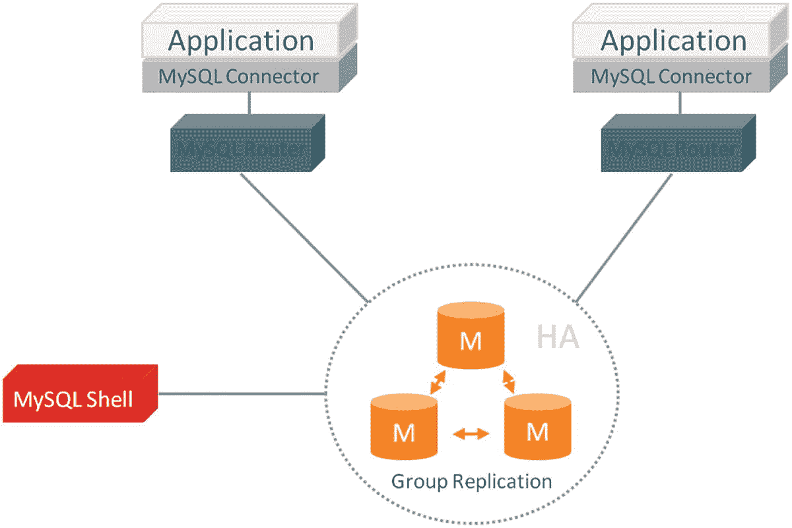

图 6-1

使用 MySQL 路由器的应用程序架构(Oracle 公司出品)

注意，我们描述了两个应用程序，每个都连接到 MySQL 路由器的一个实例。路由器通过位于应用程序和 MySQL 服务器之间来工作。当应用程序连接到路由器时，路由器从候选服务器池中选择合适的 MySQL 服务器并进行连接，将所有网络流量从应用程序转发到该服务器(并将响应从服务器返回到应用程序)。

### 小费

您可以在一台或多台机器上运行多个 MySQL Router 实例，在路由点提供一定程度的容错。您不需要将路由器隔离到一台机器上。这是可能的，因为路由器与其主机没有亲缘关系。

在后台，路由器存储来自 InnoDB 集群的服务器列表及其状态。这个服务器列表(或缓存)最初是从配置文件中读取的，路由器和集群之间的后续通信确保它在拓扑变化时得到更新。当服务器丢失时，它们被路由器标记为离线，路由器会跳过它们。同样，如果集群中添加了新的服务器，路由器的缓存也会更新以包含这些服务器。

为了保持高速缓存更新，路由器保持与集群中一个服务器的开放连接，从性能模式数据库中查询集群元数据。每当检测到集群状态发生变化时，组复制就会实时更新这些表(或视图)，例如，如果某个 MySQL 服务器意外关闭。

最后，该路由器使开发人员能够通过使用定制用例的插件来扩展 MySQL 路由器。如果您的应用程序需要不同的路由策略，或者您想要在解决方案中构建数据包检测，您可以使用自定义插件来扩展路由器。尽管为路由器构建定制插件超出了本章的范围，也没有可供研究的示例，但请务必查看 MySQL 开发者网站( [`https://dev.mysql.com`](https://dev.mysql.com) )和 MySQL 工程博客( [`https://mysqlserverteam.com`](https://mysqlserverteam.com) `/`)以获取最新的信息和示例。

现在，您已经了解了什么是路由器以及它应该放在基础设施中的什么位置，下面让我们来看看如何安装和配置路由器。

## 装置

安装 MySQL 路由器很容易。Oracle 为 MySQL 服务器支持的所有平台提供路由器安装包。路由器也包含在 Windows 的 MySQL 安装程序中。

在本节中，您将学习如何在 Windows 上安装 MySQL Router，并观看 MySQL 安装程序中提供的示例配置步骤的演示。您还将简要了解如何为其他平台安装路由器。您将在后面的章节中学习如何手动配置路由器。让我们先来看看 MySQL 安装程序。

### MySQL Installer (Windows)

如果您已经按照前面的章节安装了 MySQL Server、MySQL Shell 和其他组件，那么本节中的信息将会很熟悉。但是，如果这是您第一次在 Windows 上使用路由器，让我们一步一步来安装。

### 小费

如果您的环境不是同构的，并且您的应用程序服务器是一台 Windows 机器，您将希望使用本节作为在您的 Windows 应用程序服务器上设置路由器的指南。

使用 MySQL 安装程序安装 MySQL 路由器遵循与安装 MySQL Shell 相同的模式。但是，因为安装程序已经在系统中，我们只需再次启动它，并添加我们想要的 MySQL 产品(如路由器)。当您启动安装程序时，会出现一个欢迎面板，其中包含已安装产品的列表。图 [6-2](#Fig2) 显示了 MySQL Shell 安装后 MySQL 安装程序的欢迎面板。

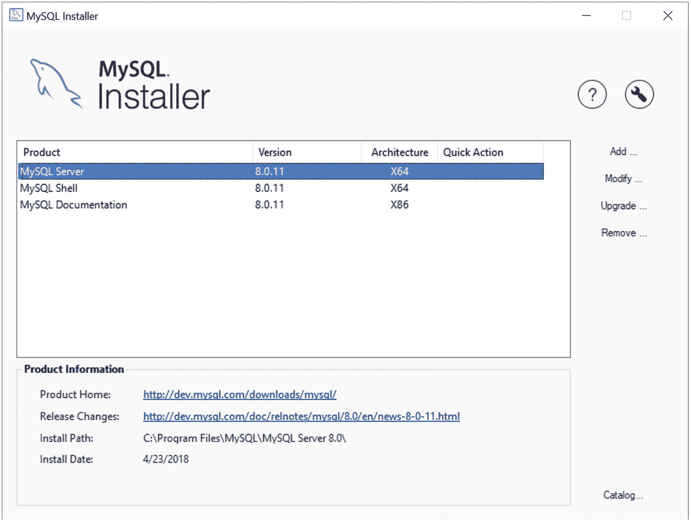

图 6-2

安装程序欢迎面板-安装后(MySQL 安装程序)

请注意，我们可以选择添加(*添加…* )新产品，修改(*修改…* )已安装产品的安装或配置，从目录(安装程序)中升级(*升级…* )具有较新版本的已安装产品，或者移除已安装产品(*移除…* )。请注意，还有一个名为 *Catalog…* 的按钮，它允许您更新安装程序中的产品目录。这允许您用新版本更新产品。

对于本教程，我们希望安装 MySQL 路由器和连接器/Python 数据库连接器。我们将通过编写一个基本的连接示例来使用数据库连接器测试路由器安装，这意味着我们还需要安装 Python。如果您的 Windows 机器上没有安装 Python，请参见 [`https://www.python.org/downloads/windows/`](https://www.python.org/downloads/windows/) 下载并安装最新版本(版本 2.7 或 3.6 或更高版本)。

回想一下，我们单击“添加”继续。然后您将看到产品选择面板，如图 [6-3](#Fig3) 所示。只需导航左侧的树找到 MySQL 路由器，选择它，然后单击绿色箭头将其添加到右侧的列表中。重复上述步骤，选择与您的 Python 安装相匹配的连接器/Python 版本。添加完两者后，单击“下一步”按钮继续。

### 小费

MySQL 安装程序将灰显任何与您的 Python 安装不匹配的版本。如果您不确定您安装了哪个版本的 Python，您可以从命令提示符下运行`python --version`。


图 6-3

选择产品和功能(MySQL 安装程序)

图 [6-4](#Fig4) 中显示的下一个面板是一个安装摘要，允许您确认是否有正确的产品列出进行安装。该面板还会指示状态，以便您可以观察安装进度。当您准备好开始安装所选产品时，请单击执行。

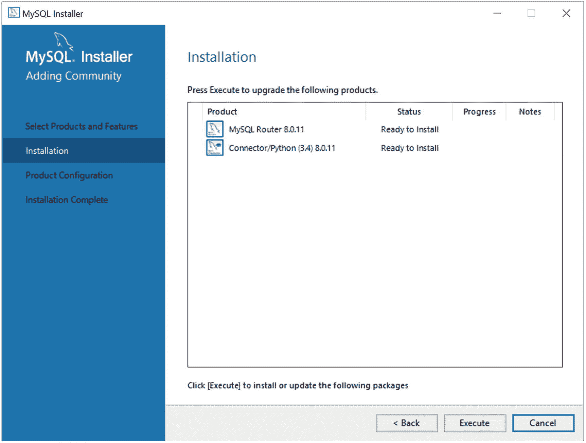

图 6-4

安装对话框–暂存(MySQL 安装程序)

安装开始后，你会看到每个产品的进度，如图 [6-5](#Fig5) 所示。

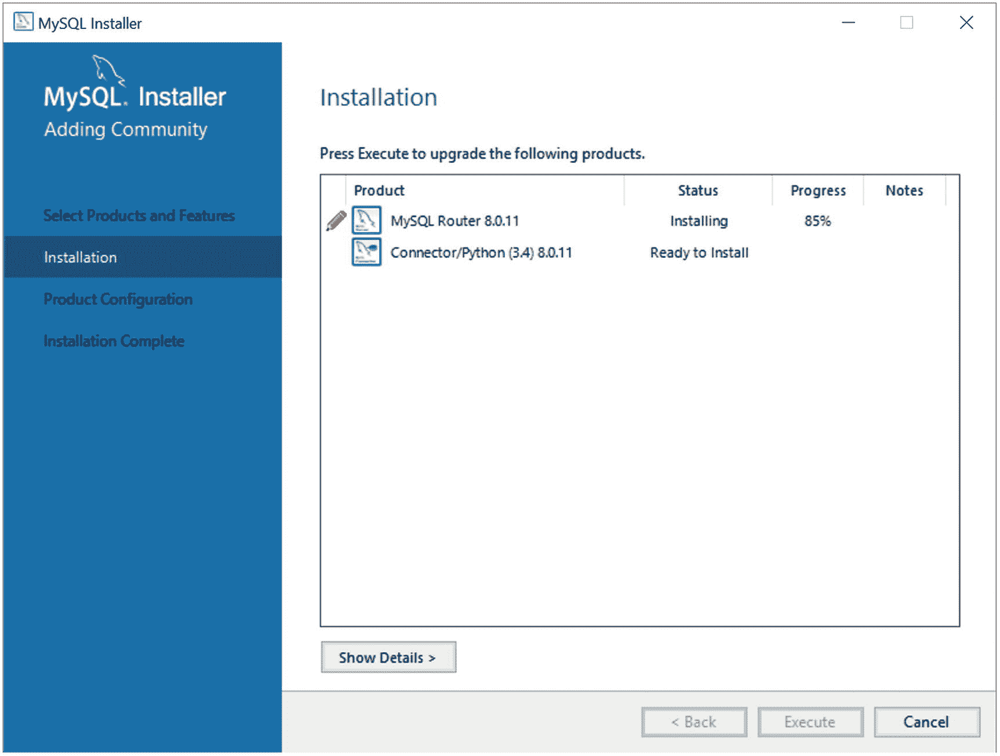

图 6-5

安装对话框–安装进度(MySQL 安装程序)

所有产品安装完成后，安装面板将显示所有安装的状态为完成，并将底部的按钮改为显示下一步，如图 [6-6](#Fig6) 所示。准备好后，单击下一步。


图 6-6

安装对话框–安装完成(MySQL 安装程序)

安装的下一步是配置任何具有安装后选项的产品。MySQL Server 就是这样一种产品，它允许您设置几个配置项来完成安装。图 [6-7](#Fig7) 显示了产品配置面板。准备好开始配置时，单击“下一步”。

在这一步中，我们将配置路由器用于沙盒安装。如果您尚未将 InnoDB 集群配置为在沙箱中运行，请参见第 [5](05.html) 章了解详细信息。在使用 MySQL 安装程序配置路由器之前，必须运行 InnoDB 集群。

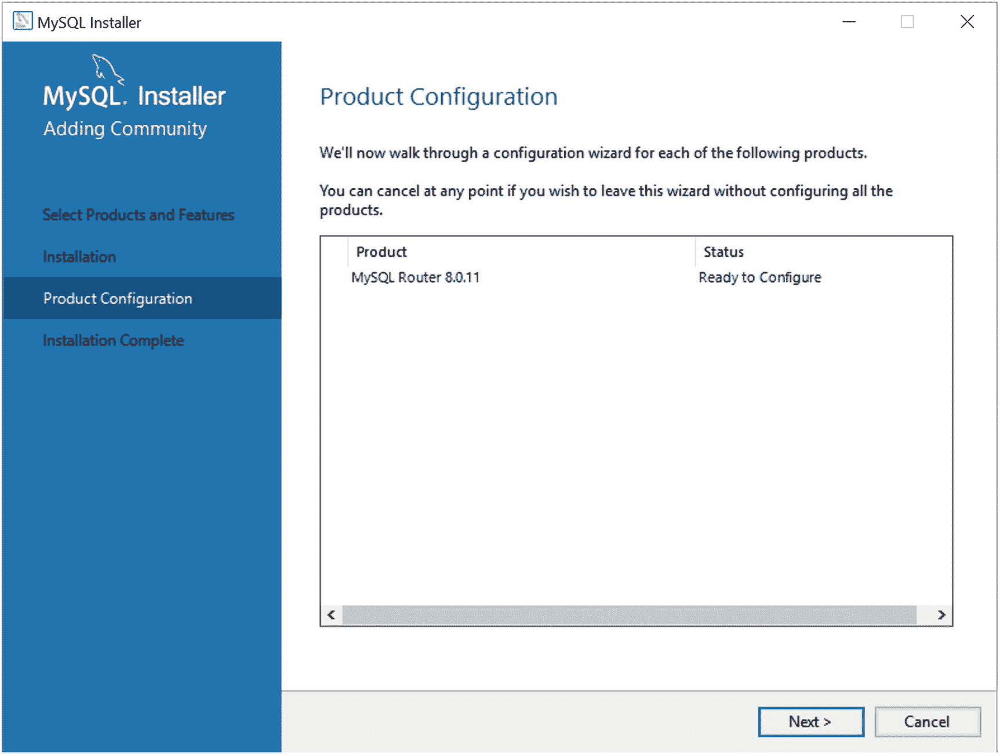

图 6-7

产品配置(MySQL 安装程序)

这一步开始 MySQL 路由器配置。请注意，在图 [6-8](#Fig8) 中，安装程序正在询问集群中某个服务器的连接信息。回想一下第 [5](05.html) 章，我们使用端口 3311 作为主端口。因此，我们在端口文本框中输入 3311，并在密码文本框中提供根密码。我们将使用传统协议端口的默认值。准备好后，单击下一步。

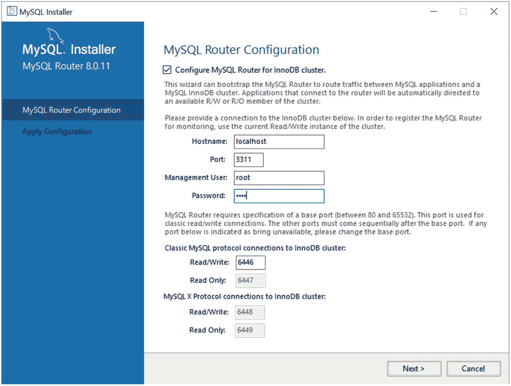

图 6-8

MySQL 路由器配置(MySQL 安装程序)

此时，安装程序将向您显示要执行的步骤摘要，并允许您开始该过程或返回并进行更改，如图 [6-9](#Fig9) 所示。准备好继续时，单击执行按钮。

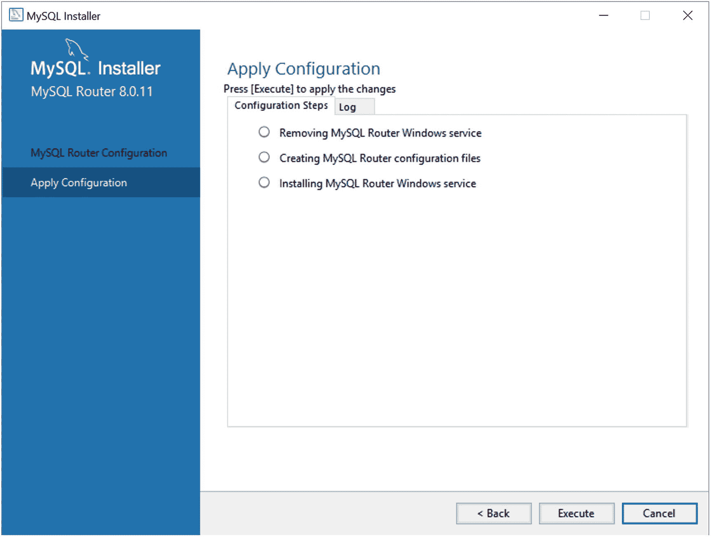

图 6-9

应用配置-暂存(MySQL 安装程序)

当配置过程运行时，面板将变灰执行和返回按钮，并在每个步骤旁边的点上显示绿色复选标记，如图 [6-10](#Fig10) 所示。如果出现错误，面板将显示一个红色 X，如果错误禁止继续，可能会显示一条错误消息。

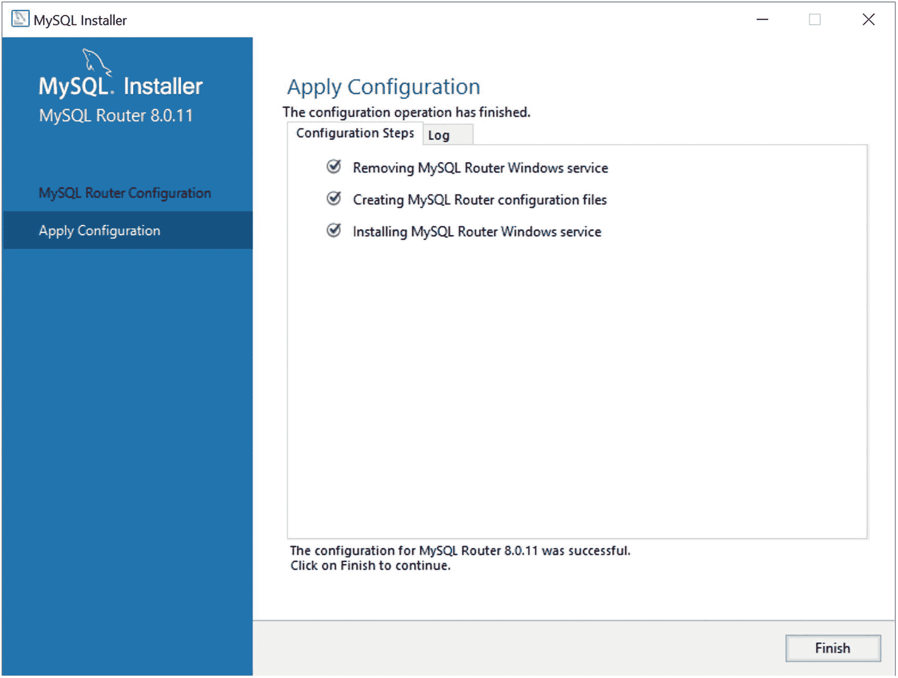

图 6-10

应用配置-完成(MySQL 安装程序)

当产品配置完成后，面板会发生变化，显示已配置产品的摘要，如图 [6-11](#Fig11) 所示。准备好后，请单击“下一步”按钮继续。

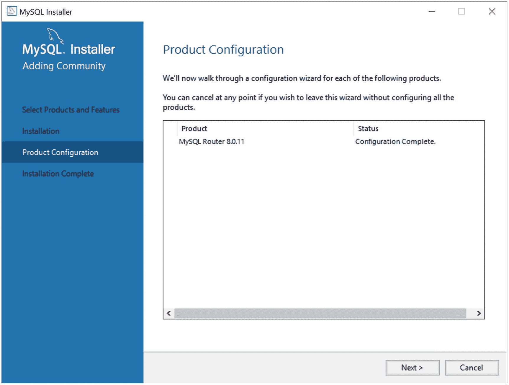

图 6-11

产品配置–摘要(MySQL 安装程序)

确认无误后，点击下一步按钮进入最后一个面板，如图 [6-12](#Fig12) 所示。您可以单击“完成”按钮来完成安装。

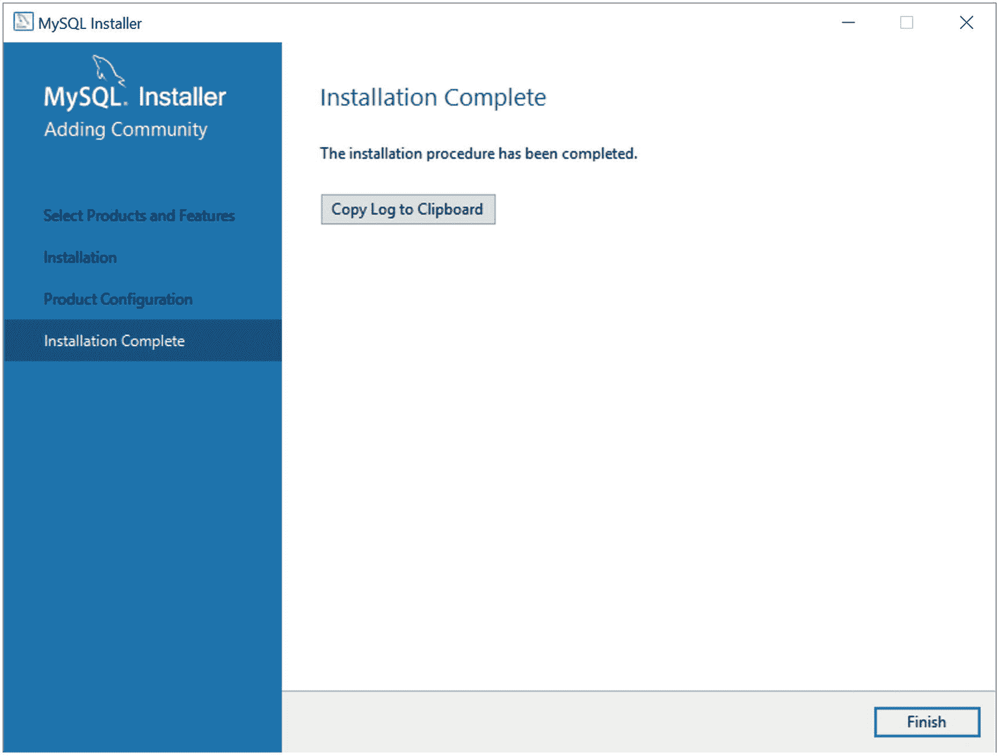

图 6-12

安装完成(MySQL 安装程序)

当所有操作完成后，安装程序将返回到欢迎面板，显示所有已安装产品的列表，如图 [6-13](#Fig13) 所示。完成后，您可以关闭安装程序，或者添加、修改、升级或移除其他产品。您还可以通过单击“重新配置”链接来重新配置任何已安装的产品。

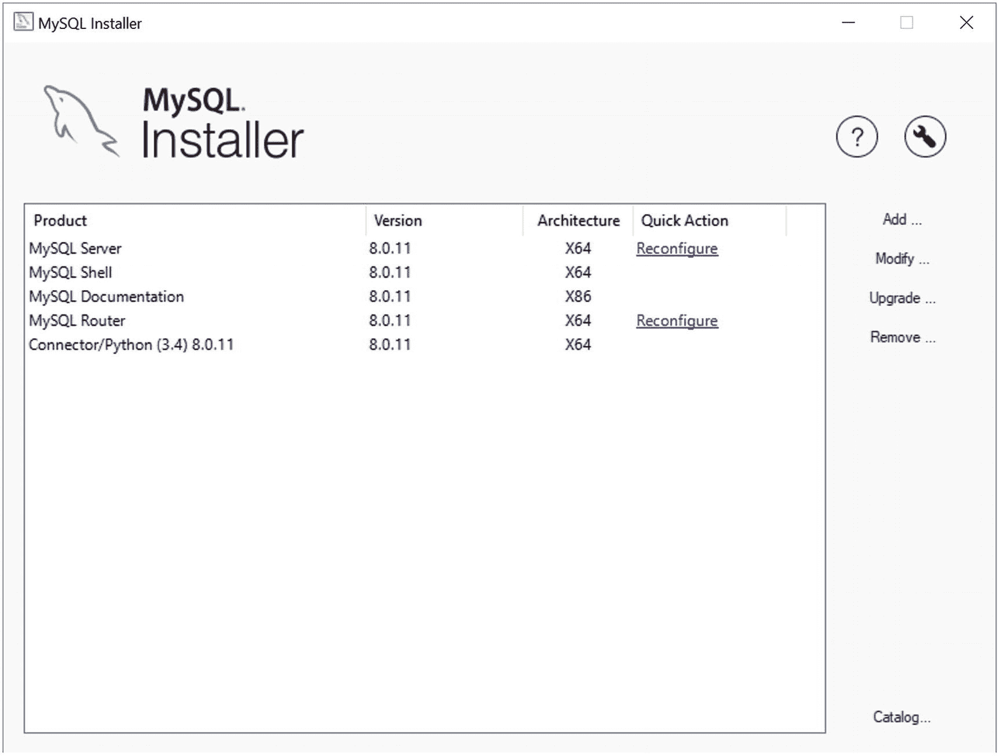

图 6-13

安装程序欢迎面板-安装后(MySQL 安装程序)

### 配置路由器时出现问题

如果您已经安装了 MySQL 路由器，但是配置步骤失败了，这很可能是因为 root 用户的密码错误。这也可能是由于对 InnoDB 集群中的服务器使用了错误的端口(通常，这是单主服务器设置中的主服务器)造成的。如果您更正了这些信息，但仍然无法完成配置，请尝试连接到您的 InnoDB 集群，如第 [5](05.html) 章所述。当您可以成功连接到集群时，路由器的配置应该会成功。如果您想再次运行配置，只需重新启动 MySQL 安装程序并单击 Reconfigure 链接即可重新运行配置。

现在我们已经在 Windows 上安装了路由器，并为 InnoDB 集群进行了配置，让我们使用一个简单的 Python 脚本来测试路由器。

清单 [6-1](#PC1) 展示了一个通过路由器连接到 InnoDB 集群的简单 Python 脚本。回想一下，我们在 Windows 机器上安装了路由器，因此这个脚本(为了一致性，如果不是练习的话)应该在同一台机器上执行。花点时间检查一下代码。即使您从未使用过 Connector/Python 或编写过 Python，也应该很清楚发生了什么。

```sql
#
# Introducing MySQL InnoDB Cluster
#
# This example shows how to use the MySQL Router to connect to
# the cluster. Notice how connecting via the router port 6446
# results in a seamless transport to one of the cluster servers,
# in this case, the server with the primary role.
#
# Dr. Charles Bell, 2018
#
import mysql.connector

# Simple function to display results from a cursor
def show_results(cur_obj):
  for row in cur:
    print(row)

my_cfg = {
  'user':'root',
  'passwd':'secret',
  'host':'127.0.0.1',
  'port':6446   # <<<< Router port (R/W)
}

# Connecting to the server
conn = mysql.connector.connect(**my_cfg)

print("Listing the databases on the server.")
query = "SHOW DATABASES"
cur = conn.cursor()
cur.execute(query)
show_results(cur)

print("\nRetrieve the port for the server to which we're connecting.")
query = "SELECT @@port"
cur = conn.cursor()
cur.execute(query)
show_results(cur)

# Close the cursor and connection
cur.close()
conn.close()

Listing 6-1Router Connection Test

```

代码的第一部分导入连接器并定义一个连接术语字典——在本例中，是路由器的用户、密码、主机和端口。我们使用的是端口号 6446，如 MySQL 安装程序中路由器配置期间所示(参见图 [6-8](#Fig8) )。

接下来，代码打开一个连接，然后运行两个查询；一个用于获取数据库列表并显示它们(使用定义为`show_results()`的函数)，另一个用于选择服务器的当前端口。第二个查询结果可能会让您大吃一惊。

要执行代码，保存这个名为`router_connect_test.py`的文件(扩展名将其标识为 Python 脚本)。然后，使用以下命令运行代码:

```sql
python ./router_connect_test.py

```

运行后，您将看到如下输出:

```sql
Listing the databases on the server.
('information_schema',)
('mysql',)
('mysql_innodb_cluster_metadata',)
('performance_schema',)
('sys',)

Retrieve the port for the server to which we're connecting.
(3311,)

```

等等！为什么输出显示端口 3311？不应该显示端口 6446 吗？毕竟，这是我们在代码中使用的端口。回想一下，路由器只是将通信路由到适当的服务器；它本身不是服务器连接。因此，路由器成功地将我们的连接路由到端口 3311 上的机器。这台机器是主机器(在集群中列为读/写)。

那么，我们如何连接到集群中的只读服务器呢？我们需要做的就是修改程序来连接只读服务器(在端口 6447 上)。当我们重新运行该脚本时，我们将看到以下输出:

```sql
Listing the databases on the server.
('information_schema',)
('mysql',)
('mysql_innodb_cluster_metadata',)
('performance_schema',)
('sys',)

Retrieve the port for the server to which we're connecting.
(3312,)

```

现在我们看到我们连接到的不是端口 3311 上的服务器。回想一下沙箱设置，端口 3312、3313 和 3314 上的机器都是只读的。

虽然这个例子很简单，但它说明了路由器如何将连接重定向到其他 MySQL 服务器。这个例子还有助于强化这样一个概念，即我们必须将我们的应用程序连接到路由器本身，而不是连接到集群中的机器，并允许路由器为我们完成所有繁重的连接路由。正如您所看到的，MySQL 路由器非常复杂，它从初始(和后来缓存的)配置中知道基于使用的端口请求哪些服务器。在这种情况下，我们使用 6446 进行读/写连接，使用 6447 进行只读连接。是的，就是这么简单。不再有复杂的硬编码端口！

### 其他平台

如前所述，如果不是使用 Windows，仍然可以使用 MySQL 路由器；路由器不需要使用 Windows。然而，在其他平台上设置路由器实际上需要更多的手动操作。

在其他平台上安装 MySQL 路由器最好使用第 [2](02.html) 章中描述的特定于平台的存储库。本节演示如何在 Ubuntu 上使用 MySQL APT 库安装 shell。前提条件是您已经安装了存储库。

在安装了存储库并用`sudo apt-get update`更新了系统之后，您可以简单地发出`sudo apt-get install mysql-router`命令，如清单 [6-2](#PC5) 所示。

```sql
$ sudo apt-get install mysql-router
Reading package lists... Done
Building dependency tree
Reading state information... Done
The following packages were automatically installed and are no longer required:
  libevent-core-2.0-5 libllvm4.0 libqmi-glib1 snap-confine
Use 'sudo apt autoremove' to remove them.
The following NEW packages will be installed:
  mysql-router
0 upgraded, 1 newly installed, 0 to remove and 38 not upgraded.
Need to get 2,388 kB of archives.
After this operation, 15.3 MB of additional disk space will be used.
Get:1 http://repo.mysql.com/apt/ubuntu xenial/mysql-tools amd64 mysql-router amd64 8.0.11-1ubuntu16.04 [2,388 kB]
Fetched 2,388 kB in 20s (115 kB/s)
Selecting previously unselected package mysql-router.
(Reading database ... 309484 files and directories currently installed.)
Preparing to unpack .../mysql-router_8.0.11-1ubuntu16.04_amd64.deb ...
Unpacking mysql-router (8.0.11-1ubuntu16.04) ...
Processing triggers for libc-bin (2.23-0ubuntu10) ...
/sbin/ldconfig.real: /usr/lib/libmysqlcppconn.so.7 is not a symbolic link

Processing triggers for systemd (229-4ubuntu21.2) ...
Processing triggers for ureadahead (0.100.0-19) ...
Setting up mysql-router (8.0.11-1ubuntu16.04) ...
Processing triggers for libc-bin (2.23-0ubuntu10) ...
/sbin/ldconfig.real: /usr/lib/libmysqlcppconn.so.7 is not a symbolic link

Processing triggers for systemd (229-4ubuntu21.2) ...
Processing triggers for ureadahead (0.100.0-19) ...

Listing 6-2Installing the MySQL Router (Ubuntu)

```

现在路由器已经安装好了，回想一下，我们还希望安装 Connector/Python，以便像在上一节中一样测试路由器。我们使用清单 [6-3](#PC6) 中所示的`sudo apt-get install mysql-connector-python`命令来安装连接器/Python。

```sql
$ sudo apt-get install mysql-connector-python
[sudo] password for cbell:
Reading package lists... Done
Building dependency tree
Reading state information... Done

The following packages were automatically installed and are no longer required:
  libevent-core-2.0-5 libllvm4.0 libqmi-glib1 snap-confine
Use 'sudo apt autoremove' to remove them.
The following NEW packages will be installed:
  mysql-connector-python
0 upgraded, 1 newly installed, 0 to remove and 38 not upgraded.
Need to get 174 kB of archives.
After this operation, 1,339 kB of additional disk space will be used.
Get:1 http://repo.mysql.com/apt/ubuntu xenial/mysql-tools amd64 mysql-connector-python all 8.0.11-1ubuntu16.04 [174 kB]
Fetched 174 kB in 6s (25.7 kB/s)
Selecting previously unselected package mysql-connector-python.
(Reading database ... 309396 files and directories currently installed.)
Preparing to unpack .../mysql-connector-python_8.0.11-1ubuntu16.04_all.deb ...
Unpacking mysql-connector-python (8.0.11-1ubuntu16.04) ...
Setting up mysql-connector-python (8.0.11-1ubuntu16.04) ...

Listing 6-3Installing the MySQL Connector/Python (Ubuntu)

```

如上所述，以这种方式安装 MySQL 路由器不会像在 Windows 上演示的那样运行自定义配置步骤。要在其他平台上使用路由器或进行自定义安装，我们必须手动配置路由器以匹配我们的集群。

## 配置

配置 MySQL 路由器并不难，但是配置项的数量可能会让它看起来很难。本节给出了一个简单的例子，说明如何配置 MySQL 路由器，以便与运行在沙箱中的 InnoDB 集群一起使用；本节演示了使路由器工作所需的手动步骤。我们还将使用上一节中显示的相同的简单 Python 脚本来测试路由器设置。

### 在沙盒中设置 InnoDB 集群

让我们花点时间来回顾一下我们是如何在沙盒中设置 InnoDB 集群的。如果您没有尝试过上一章中的示例，或者您没有在 Windows 上使用路由器，或者之前没有设置过路由器，这在这一点上可能会有所帮助。回想一下第 [5](05.html) 章，我们有两个脚本通过 MySQL Shell 使用 Python 命令来设置和关闭一个示例集群。

在这种情况下，我们将使用第 [5 章](05.html)中所示的相同脚本来设置一个集群，运行一个写(主)和三个只读(辅助)服务器。但是，因为该脚本是为 Windows 编写的，所以我们必须对其稍加修改，以更改集群数据的默认目录。清单 [6-4](#PC7) 显示了`setup_idc_sandbox.py`文件的修改版本，其中的变化以粗体显示。

```sql
# Introducing InnoDB Cluster

#
# This Python script is designed to set up an InnoDB Cluster in a sandbox.
#
# Note: Change the cluster directory to match your preferred directory setup.
#
# The steps include:
# 1) create the sandbox directory
# 2) deploy instances
# 3) create the cluster
# 4) add instances to the cluster
# 5) show the cluster status
#
# Dr. Charles Bell, 2018
#
import os
import time

# Method to deploy sandbox instance
def deploy_instance(port):
    try:
        dba.deploy_sandbox_instance(port, {'sandboxDir':'/home/cbell/idc_sandbox', 'password':'secret'})
    except:
        print("ERROR: cannot setup the instance in the sandbox.")
    time.sleep(1)

# Add instance to cluster

def add_instance(cluster, port):
    try:
        cluster.add_instance('root:secret@localhost:{0}'.format(port))
    except:
        print("ERROR: cannot add instance to cluster.")
    time.sleep(1)

print("##### STEP 1 of 5 : CREATE SANDBOX DIRECTORY #####")
os.mkdir('/home/cbell/idc_sandbox')

print("##### STEP 2 of 5 : DEPLOY INSTANCES #####")
deploy_instance(3311)
deploy_instance(3312)
deploy_instance(3313)
deploy_instance(3314)

print("##### STEP 3 of 5 : CREATE CLUSTER #####")
shell.connect('root:secret@localhost:3311')
my_cluster = dba.create_cluster('MyCluster', {'multiMaster':False})
time.sleep(1)

print("##### STEP 4 of 5 : ADD INSTANCES TO CLUSTER #####")
add_instance(my_cluster, 3312)
add_instance(my_cluster, 3313)
add_instance(my_cluster, 3314)

print("##### STEP 5 of 5 : SHOW CLUSTER STATUS #####")
shell.connect('root:secret@localhost:3311')
time.sleep(1)
my_cluster = dba.get_cluster('MyCluster')
time.sleep(1)
status = my_cluster.status()

print(status)

Listing 6-4Setup InnoDB Cluster Script (Ubuntu)

```

### 注意

您还必须更改脚本中的密码和路径，以匹配您的配置。

清单 [6-5](#PC8) 显示了运行在 Ubuntu 上的这个脚本的摘录。回想一下，因为脚本使用的是 AdminAPI，所以我们必须使用 MySQL Shell 来执行它。

```sql
$ mysqlsh -f setup_idc_sandbox.py
##### STEP 1 of 5 : CREATE SANDBOX DIRECTORY #####
##### STEP 2 of 5 : DEPLOY INSTANCES #####
Deploying new MySQL instance...

Instance localhost:3311 successfully deployed and started.
Use shell.connect('root@localhost:3311'); to connect to the instance.
...
##### STEP 3 of 5 : CREATE CLUSTER #####
A new InnoDB cluster will be created on instance 'root@localhost:3311'.
...
##### STEP 4 of 5 : ADD INSTANCES TO CLUSTER #####
A new instance will be added to the InnoDB cluster. Depending on the amount of
data on the cluster this might take from a few seconds to several hours.

Adding instance to the cluster ...

Validating instance at localhost:3312...
Instance detected as a sandbox.
...
##### STEP 5 of 5 : SHOW CLUSTER STATUS #####
{"clusterName": "MyCluster", "defaultReplicaSet": {"name": "default", "primary": "localhost:3311", "ssl": "REQUIRED", "status": "OK", "statusText": "Cluster is ONLINE and can tolerate up to ONE failure.", "topology": {"localhost:3311": {"address": "localhost:3311", "mode": "R/W", "readReplicas": {}, "role": "HA", "status": "ONLINE"}, "localhost:3312": {"address": "localhost:3312", "mode": "R/O", "readReplicas": {}, "role": "HA", "status": "ONLINE"}, "localhost:3313": {"address": "localhost:3313", "mode": "R/O", "readReplicas": {}, "role": "HA", "status": "ONLINE"}, "localhost:3314": {"address": "localhost:3314", "mode": "R/O", "readReplicas": {}, "role": "HA", "status": "ONLINE"}}}, "groupInformationSourceMember": "mysql://root@localhost:3311"}

Listing 6-5Setting Up the InnoDB Cluster in a Sandbox

```

### 修改配置文件

MySQL 路由器将其初始配置存储在一个文件中。该文件设置路由器与集群配合工作的参数，包括故障转移协议、路由信息、为应用程序通告(监听)的端口以及集群本身的连接元数据等。

### 小费

参见在线 MySQL 路由器文档( [`https://dev.mysql.com/doc/mysql-router/8.0/en/`](https://dev.mysql.com/doc/mysql-router/8.0/en/) )了解 MySQL 路由器所有选项和配置项的完整说明。

尽管路由器没有任何平台关联性(它在所有平台上都运行良好)，但配置文件的位置可能会有所不同。对于 Windows，配置文件位于名为`mysqlrouter.conf`的`C:\ProgramData\MySQL\MySQL Router`文件夹中。在 Linux 上，配置文件位于名为`mysqlrouter.conf`的`/etc/mysqlrouter/`文件夹中。

您可以通过运行命令`mysqlrouter --help`立即找到文件的位置以及大量其他信息，该命令不仅记录了所有选项，还显示了文件的位置。清单 [6-6](#PC9) 显示了输出的摘录。

```sql
$ mysqlrouter --help
MySQL Router v8.0.11 on Linux (64-bit) (GPL community edition)
Copyright (c) 2015, 2018, Oracle and/or its affiliates. All rights reserved.
...
Configuration read from the following files in the given order (enclosed
in parentheses means not available for reading):
  /etc/mysqlrouter/mysqlrouter.conf
  (/home/cbell/.mysqlrouter.conf)
Plugins Path:
  /usr/lib/x86_64-linux-gnu/mysqlrouter
Default Log Directory:
  /var/log/mysqlrouter
Default Persistent Data Directory:
  /var/lib/mysqlrouter
Default Runtime State Directory:
  /run/mysqlrouter

...

Listing 6-6MySQL Router Help (Ubuntu)

```

现在我们知道集群正在运行，并且安装了 MySQL 路由器，让我们看看路由器的默认配置文件。清单 [6-7](#PC10) 显示了典型 Linux 安装的配置文件。

```sql
 [DEFAULT]
logging_folder = /var/log/mysqlrouter/
plugin_folder = /usr/lib/x86_64-linux-gnu/mysqlrouter
runtime_folder = /var/run/mysqlrouter
config_folder = /etc/mysqlrouter

[logger]
level = INFO

# If no plugin is configured that starts a service, keepalive
# will make sure MySQL Router will not immediately exit. It is
# safe to remove after Router is configured.
[keepalive]
interval = 60

Listing 6-7Default Router Configuration File

```

请注意文件中的最后几行。当我们完成配置时，我们将看到这些被删除。还要注意，文件中没有关于集群配置的信息。完成路由器配置需要两个基本组件。首先，我们必须设置正确的路径，以确保路由器能够访问正确的密码加密机制。其次，我们必须在初始配置中为每台服务器配置所有路由参数和策略。虽然您可以自己手动操作，但使用`--bootstrap`选项可以快速启动。

#### 使用引导选项进行配置

特殊的引导选项将连接到您的集群，读取元数据，然后自动更新配置文件。如果您正在使用沙盒安装，这是设置路由器的最快和最可靠的方法。即使您没有使用沙盒安装，也可以使用这种方法快速设置基本配置，以后可以根据需要进行更改。

让我们看看如何使用引导选项。要使用该选项，我们需要其他参数。简而言之，我们必须提供用于保护配置文件的连接信息和用户。我们还将添加一个可选参数来为配置提供一个名称，这在您使用不同的集群或配置时会很有帮助。以下是我们需要的参数:

*   `--bootstrap <server_url>`:引导并配置路由器，以便与 MySQL InnoDB 集群一起运行。也可以使用快捷键`-B`。

*   `--name (optional)`:给路由器实例一个符号名。

*   `--user <username>`:以指定名称的用户身份运行`mysqlrouter`(在 Windows 上不可用)。你也可以使用快捷键`-u`。

在本例中，我们以 URI(如`<username>:<password>@<hostname>:<port>`)的形式提供带有引导选项的连接信息。我们将使用本地用户，以便通过沙盒安装更容易地运行路由器，沙盒安装也在当前用户下运行。我们使用提升的权限，因为路由器文件的默认位置是受保护的。以下是命令:

```sql
sudo mysqlrouter --bootstrap root:secret@localhost:3311 --name sandbox --user cbell

```

当我们运行这个命令时，路由器将联系我们指定的服务器，并检索集群的所有元数据，为我们自动创建路由。清单 [6-8](#PC12) 显示了该命令的输出示例。

```sql
$ sudo mysqlrouter --bootstrap root:secret@localhost:3311 --name sandbox --user cbell

Bootstrapping system MySQL Router instance...
Module “ not registered with logger - logging the following message as 'main' instead
MySQL Router 'sandbox' has now been configured for the InnoDB cluster 'MyCluster'.

The following connection information can be used to connect to the cluster.

Classic MySQL protocol connections to cluster 'MyCluster':
- Read/Write Connections: localhost:6446
- Read/Only Connections: localhost:6447
X protocol connections to cluster 'MyCluster':
- Read/Write Connections: localhost:64460
- Read/Only Connections: localhost:64470

Existing configurations backed up to '/etc/mysqlrouter/mysqlrouter.conf.bak'

Listing 6-8Configuration with the Bootstrap Option

```

请注意，路由器已经分别使用默认端口 6446 和 6447 识别了读/写和只读连接。我们还看到，引导步骤分别在端口 64460 和 64470 上创建了使用 X 协议的路由。在我们测试路由器之前，让我们了解一下自举方法为我们做了什么。具体来说，我们将查看修改后的配置文件。

#### 使用引导配置文件

bootstrap 选项创建的配置文件包含在应用程序和集群中使用路由器所需的所有信息。它使用所有设置的默认值和集群中的值来设置队列和端口。经典协议的默认端口为 6446、6447，X 协议的默认端口为 64460、64470。

清单 [6-9](#PC13) 显示了清单 [6-8](#PC12) 中所示的执行所产生的配置文件。

```sql
# File automatically generated during MySQL Router bootstrap
[DEFAULT]
name=sandbox
user=cbell
keyring_path=/var/lib/mysqlrouter/keyring
master_key_path=/etc/mysqlrouter/mysqlrouter.key
connect_timeout=30
read_timeout=30

[logger]
level = INFO

[metadata_cache:MyCluster]
router_id=10
bootstrap_server_addresses=mysql://localhost:3311,mysql://localhost:3312,mysql://localhost:3313,mysql://localhost:3314
user=mysql_router10_r7dqvu1t52bj
metadata_cluster=MyCluster
ttl=5

[routing:MyCluster_default_rw]
bind_address=0.0.0.0
bind_port=6446
destinations=metadata-cache://MyCluster/default?role=PRIMARY
routing_strategy=round-robin
protocol=classic

[routing:MyCluster_default_ro]
bind_address=0.0.0.0
bind_port=6447
destinations=metadata-cache://MyCluster/default?role=SECONDARY
routing_strategy=round-robin
protocol=classic

[routing:MyCluster_default_x_rw]
bind_address=0.0.0.0
bind_port=64460
destinations=metadata-cache://MyCluster/default?role=PRIMARY
routing_strategy=round-robin
protocol=x

[routing:MyCluster_default_x_ro]
bind_address=0.0.0.0
bind_port=64470
destinations=metadata-cache://MyCluster/default?role=SECONDARY
routing_strategy=round-robin
protocol=x

Listing 6-9Bootstrap Configuration File

```

哇，这与我们之前看到的简短默认配置文件非常不同。这看起来可能很复杂，但实际上并不复杂。让我们看看配置文件中的每个部分。更具体地说，该文件的格式类似于许多其他配置文件:方括号用于定义节，每个节中有一个或多个带有赋值的关键字(变量)(有时称为*键/值对*)。

##### [默认]

默认部分是放置路由器实例的所有常规设置的地方，即路由器正确执行所需的所有参数。下面总结了示例中出现的变量及其用法:

*   `name`:引导选项中为集群提供的名称

*   `user`:用于访问路由器实例的配置文件和元数据的用户名

*   `keyring_path`:密匙环安全文件的路径

*   `master_key_path`:key ring 主密钥文件的路径

*   `connect_timeout`:尝试连接时超时的秒数

*   `read_timeout`:等待读取请求时超时的秒数

如您所见，bootstrap 步骤为所有这些变量提供了默认值，除了 name 和 user，它们是在命令行上指定的。

##### [记录者]

logger 部分没有修改默认文件。在这种情况下，它只记录信息性消息。要了解有关记录选项的更多信息，包括如何自定义记录的内容，请参见在线参考手册中的“使用记录功能”一节( [`https://dev.mysql.com/doc/mysql-router/8.0/en/mysql-router-server-logging.html`](https://dev.mysql.com/doc/mysql-router/8.0/en/mysql-router-server-logging.html) )。

##### [元数据 _ 缓存:我的群集]

本节定义了集群的初始元数据。此示例使用以下变量:

*   `router_id`:和`server_id`一样，这是路由器实例的唯一值，每个路由器实例都应该有自己的 ID 值。

*   `bootstrap_server_addresses`:初始队列中的服务器列表。

*   `user`:使用密匙环服务连接到服务器的自动生成用户。

*   `metadata_cluster`:集群的名称。

*   `ttl`:元数据高速缓存中信息的生存时间(秒)。

在本节中，您应该了解更多的两个关键变量是`bootstrap_server_addresses`和`user`。`bootstrap_server_addresses`变量需要集群中每个服务器的`host:port`值的逗号分隔列表。因为引导操作连接到群集，所以它为我们检索信息。这里，列表包括集群中的所有服务器。这里的`user`变量是一个自动生成的用户，用于密匙环协议。你不需要改变这个。

如果手动构建配置文件，`bootstrap_server_addresses`是获得正确结果的最关键的值。确保包括群集中所有已知的服务器。请记住，路由器会随着集群拓扑的变化自动更新其缓存，但它需要一个稳定的起点，这个变量提供了该数据。

##### [路由: <name>]</name>

此部分是连接路由部分，用于定义路由器为应用程序提供的连接路由。路由按类型组织，如读/写和只读。对于我们想要定义的每种类型的路线，该部分重复一次。在这种情况下，我们有四个路由:一个用于使用传统(经典)协议的读/写，另一个用于只读，一个用于使用 X 协议的读/写，还有一个用于使用 X 协议的只读。对于每个部分，我们指定以下变量。每个部分名称必须以`routing:`开头，后跟唯一的名称标签。在这种情况下，引导操作选择描述每个连接的读/写状态和所用协议的名称。

*   `bind_address`:路由器绑定的地址，如果没有定义端口，也使用`bind_port`

*   `bind_port`:默认端口`bind_address`使用

*   `destinations`:以逗号分隔的 MySQL 服务器列表的形式路由目的地

*   `routing_strategy`:路由策略(可选)，路由器如何选择目的 MySQL 服务器

*   `protocol`:用于值为`classic`的连接的协议(也称为传统协议)，或者简称为 X 协议的`x`

`bind_address`和`bind_port`变量特定于用于定义连接的服务器。类似地，`protocol`让我们可以选择用于连接的协议。因此，我们看到读/写和只读路由的两个连接路由:一个用于 classic，另一个用于 X 协议。此外，指定的端口是路由器侦听连接路由的端口，而不是路由器将路由定向到的服务器的端口。这可能是配置连接路由时需要掌握的最重要的概念。

这里最有趣的是`destinations`变量。此变量为建立连接提供主机信息。它接受逗号分隔的目标地址列表或指向群集的元数据缓存链接。引导操作生成元数据缓存选项。该字符串定义如下:

```sql
destinations=metadata-cache://mycluster/default?role=PRIMARY

```

角色可以是`PRIMARY`、`SECONDARY`或`PRIMARY_AND_SECONDARY`。这决定了连接可用的实例类型。

最后，`routing_strategy`可以用来改变路由器选择队列中下一个服务器的方式。默认值为`round-robin`，但也可以是以下值之一:

*   `first-available`:新连接被路由到目的地列表中第一个可用的服务器。如果失败，将使用下一个可用的服务器。这个循环一直持续到所有服务器都不可用。

*   `next-available`:与`first-available`类似，新连接被路由到目的地列表中第一个可用的服务器。与`first-available`不同，如果一台服务器被标记为不可达，它就会被丢弃，并且永远不会再被用作目的地。

*   为了负载平衡，每个新连接都以循环方式连接到下一个可用的服务器。

*   `round-robin-with-fallback`:为了负载平衡，每个新连接都以循环方式连接到下一个可用的辅助服务器。如果辅助服务器不可用，则以循环方式使用主列表中的服务器。

花点时间再次浏览文件，看看每个连接路由是如何配置的。一旦你习惯了这些术语，就不会觉得奇怪了。

### 等等，其他服务器的连接在哪里？

如果您想知道为什么集群中的其他服务器没有连接路由，您必须记住，路由器被设计为查询集群中的元数据并自动选择服务器。不需要为每个服务器指定特定的连接路由。相反，我们为每种类型的服务器定义路由:读/写、只读等等。

现在，您对如何配置路由器有了更多的了解，让我们开始测试吧。

#### 启动路由器

最后，我们可以使用以下命令启动路由器:

```sql
$ mysqlrouter &

```

这将启动路由器，它将读取配置文件。请注意，我们没有使用提升的特权。这是因为我们在引导步骤中提供了一个用户选项，允许用户读取文件。这对于保护您的安装非常重要，您将在后面的章节中探讨这一点。

现在我们已经配置了路由器，让我们用示例 Python 连接脚本来测试它。

#### 测试新配置

为了测试路由器，我们将使用清单 [6-1](#PC1) (名为`router_connect_test.py`)中的 Python 脚本。回想一下，这是一个包含 Python 中 AdminAPI 调用的脚本。我们必须从 MySQL Shell 运行这个脚本。幸运的是，它不需要任何改变就可以在 Ubuntu 上运行。但是，如果您遵循前面的示例，您应该更改连接字典以连接到读/写端口 6446，如下所示:

```sql
my_cfg = {
  'user':'root',
  'passwd':'secret',
  'host':'127.0.0.1',
  'port':6446   # <<<< Router port (R/W)
}

```

回想一下，我们使用`python ./router_connect_test.py`命令告诉 shell 加载 Python 脚本并执行它。当您这样做时，您应该会看到如下所示的输出:

```sql
$ python ./router_connect_test.py
Listing the databases on the server.
(u'information_schema',)
(u'mysql',)
(u'mysql_innodb_cluster_metadata',)
(u'performance_schema',)
(u'sys',)

Retrieve the port for the server to which we're connecting.

(3311,)

```

在这里，我们看到我们确实通过路由器连接到了 InnoDB 集群，报告的端口是 3311，这是主(读/写)服务器的端口。酷！

演示如何手动安装和配置路由器到此结束。对于大多数安装，这是使路由器为您的应用工作所需要的。但是，如果您需要更高级的路由或特定选项，您可以查看所有可用选项的在线参考手册，如果您计划为多个单主模式配置您的集群，或者您想要在多个应用服务器上部署路由器的多个实例，强烈建议您查看该手册。例如，如果您想要使用 SSL 连接运行路由器，请参见以`--ssl*`开头的选项。

### 小费

要了解有关配置路由器的更多信息，包括设置不同的路由策略，请参见在线参考手册 [`https://dev.mysql.com/doc/mysql-router/8.0/en/mysql-router-configuration.html`](https://dev.mysql.com/doc/mysql-router/8.0/en/mysql-router-configuration.html) 。

下一节将介绍在应用程序中使用路由器的一些方面，包括修改应用程序以充分利用路由器的技巧和建议。

## 在应用程序中使用路由器

至此，我们有了一个基本的工作路由器实例，它将连接路由到我们的 InnoDB 集群。您已经看到了我们如何使用应用程序中路由器配置中列出的端口连接到集群。具体来说，我们有以下可用端口，它们映射到路由器配置文件中定义的连接路由:

*   `6446`:用于读/写操作的经典协议连接(例如，`PRIMARY`)

*   `6447`:只读操作的经典协议连接(例如，`SECONDARY`)

*   `64460`:用于读/写操作的 X 协议连接(例如，`PRIMARY`

*   `64470`:只读操作的 X 协议连接(如`SECONDARY`

太棒了，对吧？但是这对我们的应用程序意味着什么呢？让我们后退一步，考虑一下在我们的应用中使用路由器的条件和后果。

首先，理解 MySQL 路由器不需要特定的库或接口是很重要的。它是自包含的，没有任何先决条件或依赖性，例如需要服务器实例才能工作。这对于规划您的应用程序部署来说是个好消息。您可以在您的应用服务器上部署路由器，而不用担心依赖性冲突或者甚至性能影响。

其次，在应用程序中使用路由器时，您应该始终连接到连接路由中定义的端口，而不要直接连接到集群服务器本身。此外，您应该为您的连接建立一个重试机制。这是必要的，因为当路由器检测到服务器脱机时，它可能会断开连接，并与下一台服务器重新建立连接。更具体地说，由于 MySQL 路由器在尝试连接时重定向连接，并且不读取数据包或执行分析，因此如果 MySQL 服务器出现故障，路由器会将连接错误返回给应用程序。因此，应该编写应用程序来测试连接错误，如果遇到错误，就重试连接。幸运的是，开发人员通常将这种机制构建到他们的应用程序中，因此您可能只需将连接更改为路由器的连接即可。

让我们考虑一些在您的应用中实现路由器的用例。当然，路由器的使用方式有很多，下面仅列出了一些较为常见的使用案例:

*   我希望我的应用程序连接到一个服务，这样默认情况下，它可以连接到组复制集群的当前主服务器。

*   我想设置多个服务，所以 MySQL 路由器监听每个高可用性副本集(集群)的不同端口。

*   我希望能够在端口 3306 上运行连接路由服务，这样对用户或应用程序来说就更加透明了。

*   我想为每个连接路由服务配置一个模式，这样我就可以指定返回主服务还是辅助服务。

最后，让我们讨论一下路由器的工作流程，这样您就可以了解它如何适合规划您的应用。以下绝不是唯一的工作流，但它是大多数使用案例的典型:

1.  应用程序连接到 MySQL 路由器，例如连接到端口 6446。

2.  路由器检查可用的 MySQL 服务器。

3.  路由器打开到合适的 MySQL 服务器的连接。

4.  路由器在应用程序和 MySQL 服务器之间来回转发数据包。

5.  如果连接的 MySQL 服务器出现故障，路由器会断开应用程序。

6.  然后，应用程序可以重试连接到路由器，路由器选择一个不同的可用 MySQL 服务器。

在下一章的典型部署场景中，我们将探索如何使用 InnoDB 集群，同时我们将考虑在我们的应用程序中使用 MySQL 路由器的更多含义。

## 摘要

我们现在有了一个完整的高可用性故事。尽管 MySQL InnoDB Cluster 为我们的数据提供了高可用性，但它并不能(直接)帮助我们在应用程序级别实现高可用性。是的，您可以编写您的应用程序来查询集群，并获取信息，以便在服务器离线时帮助您的应用程序“恢复”,但是实践表明这是一个脆弱的解决方案，过于依赖于已知的参数。如果集群配置发生任何变化，应用程序可能会失败，或者需要重新启动。

这对大多数组织来说并不理想。我们需要的是能够快速轻松地使我们的应用程序适应集群中的变化。更具体地说，如果集群中的服务器脱机或被脱机或其角色改变，应用程序不应该停止。这就是 MySQL 路由器大放异彩的地方。

MySQL Router 将连接路由的负担从应用程序中分离出来，并将其放在自己的轻量级、易于配置的实例中。现在，可以构建应用程序来依赖路由器进行所有连接路由，包括故障转移事件或正常的高可用性恢复事件。

由于路由器体积小、重量轻，您甚至可以通过让多个实例运行单独的连接路由，在路由器中构建冗余。MySQL 路由器有什么不喜欢的地方？不多。这是许多高可用性解决方案似乎缺少的一部分。

下一章将介绍如何在一组机器上部署 MySQL InnoDB 集群，并使用一个简单的应用程序配置路由器，以展示如何为自己的应用程序实现高可用性目标。