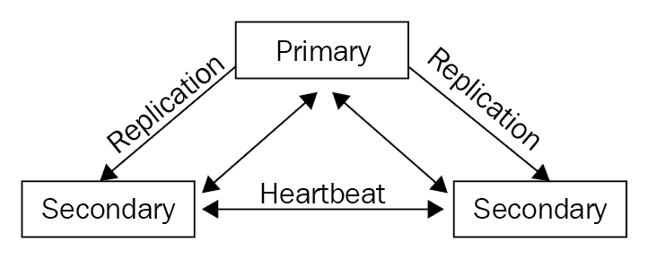
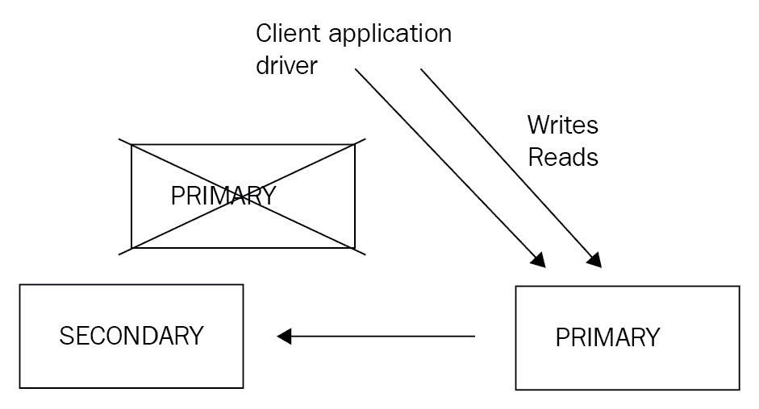
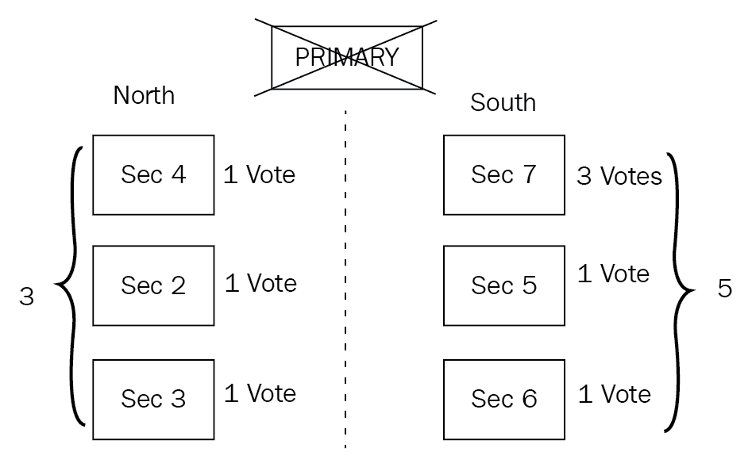

# 复制

从很早的时候起，复制就是 MongoDB 最有用的特性之一。通常，复制指的是跨不同服务器同步数据的过程。复制的好处包括防止数据丢失和数据的高可用性。复制还提供了灾难恢复、避免停机维护、扩展读取（因为我们可以从多个服务器读取）和扩展写入（仅当我们可以写入多个服务器时）。

在本章中，我们将介绍以下主题：

*   体系结构概述、选择和复制用例
*   设置副本集
*   连接到副本集
*   副本集管理
*   使用云提供程序部署副本集的最佳做法
*   副本集限制

# 复制

复制有不同的方法。MongoDB 采用的方法是主从逻辑复制，我们将在本章后面更详细地解释。

# 逻辑或物理复制

通过复制，我们可以跨多个服务器同步数据，从而提供数据可用性和冗余。即使由于硬件或软件故障而丢失服务器，通过使用复制，我们也可以使用多个拷贝来恢复数据。复制的另一个优点是，我们可以使用其中一台服务器作为专用报告或备份服务器

在逻辑复制中，我们让主/主服务器执行操作；从属/从属服务器跟踪来自主服务器的操作队列，并以相同的顺序应用相同的操作。以 MongoDB 为例，**操作日志**（**oplog**）跟踪在主服务器上发生的操作，并以完全相同的顺序在辅助服务器上应用它们。

逻辑复制对于广泛的应用程序非常有用，例如信息共享、数据分析和**在线分析处理**（**OLAP**报告。

在物理复制中，数据在物理级别上进行复制，复制级别低于数据库操作。这意味着我们不是在应用这些操作，而是在复制受这些操作影响的字节。这也意味着我们可以获得更好的效率，因为我们使用低级结构来传输数据。我们还可以确保数据库的状态完全相同，因为它们是完全相同的。

物理复制通常缺少的是关于数据库结构的知识，这意味着从数据库复制某些集合而忽略其他集合会更加困难（如果不是不可能的话）。

物理复制通常适用于更为罕见的情况，如灾难恢复，在这种情况下，所有内容（包括数据、索引、日志中数据库的内部状态以及重做/撤消日志）的完整准确拷贝对于将应用程序恢复到其所处的准确状态至关重要。

# 不同的高可用性类型

在高可用性中，我们可以使用几种配置。我们的主服务器称为**热服务器**，因为它可以处理传入的每个请求。我们的辅助服务器可以处于以下任何状态：

*   寒冷的
*   温暖的
*   热的

**二级冷服务器**是一台在主服务器离线的情况下存在的服务器，不希望它保存主服务器拥有的数据和状态。

**辅助热服务器**定期从主服务器接收数据更新，但通常情况下，主服务器并不完全更新数据。它可以用于一些非实时分析报告，以卸载主服务器，但通常情况下，如果主服务器出现故障，它将无法接收主服务器的事务负载。

**辅助热服务器**始终保存来自主服务器的数据和状态的最新副本。它通常在热备用状态下等待，准备在主服务器停机时接管。

MongoDB 具有热服务器和热服务器两种类型的功能，我们将在下面的部分中进行探讨。

Most database systems employ a similar notion of primary/secondary servers, so conceptually, everything from MongoDB gets applied there, too.

# 建筑概述

下图提供了 MongoDB 的复制：



主服务器是唯一可以随时进行写操作的服务器。辅助服务器处于热备用状态，准备在主服务器出现故障时接管。一旦主服务器出现故障，就会选择哪个辅助服务器将成为主服务器。

我们也可以有**仲裁节点**。仲裁节点不保存任何数据，其唯一目的是参与选举过程。

我们必须始终有奇数个节点（包括仲裁器）。三台、五台和七台都可以，因此如果主服务器（或更多服务器）出现故障，我们将在选举过程中获得多数票。

当副本集的其他成员在超过 10 秒（可配置）的时间内没有收到主副本的消息时，合格的辅助副本将启动选举过程，为新的主副本投票。第一个举行选举并赢得多数票的中学将成为新的初选。所有剩余的服务器现在都将从新的主服务器进行复制，保留其作为辅助服务器的角色，但从新的主服务器进行同步。

Starting with MongoDB 3.6, client drivers can retry write operations a **single time **if they detect that the primary is down. A replica set can have up to 50 members, but only up to seven of them can vote in the election process.

在新的选择之后，我们的副本集的设置如下所示：



在下一节中，我们将讨论选举如何运作。

# 选举如何运作？

副本集中的所有服务器都通过心跳与每个其他成员保持定期通信。heartbeat 是一个定期发送的小数据包，用于验证所有成员是否正常工作。

次要成员还与主要成员通信，以从 oplog 获取最新更新，并将其应用于自己的数据。

The information here refers to the latest replication election protocol, version 1, which was introduced in MongoDB v3.2.

示意图上，我们可以看到这是如何工作的。

当主成员宕机时，所有的辅助成员都会错过一个或多个心跳。他们将等待到`settings.electionTimeoutMillis`时间过去（默认值为 10 秒），然后二级候选人将开始一轮或多轮选举，以找到新的初选。

要从辅助服务器中选择服务器作为主服务器，它必须具有两个属性：

*   属于拥有*50%+1*选票的选民群体
*   成为该组中最新的第二名

在一个简单的示例中，三台服务器各有一票，一旦我们失去了主服务器，其他两台服务器将各有一票（因此，总共有三分之二），因此，具有最新 oplog 的服务器将被选为主服务器。

现在，考虑一个更复杂的设置，如下：

*   七台服务器（一台主服务器，六台辅助服务器）
*   每人一票

我们失去了主服务器，剩下的六台服务器存在网络连接问题，导致网络分区：


这些分区可以描述如下：

*   分区北：三台服务器（各一票）
*   分区南：三台服务器（每个服务器有一票）

这两个分区都不知道其余服务器发生了什么。现在，当他们举行选举时，没有任何分治能够建立多数，因为他们拥有七分之三的选票。不会从任一分区中选择任何主分区。例如，可以通过使用一台服务器进行三次投票来克服此问题。

现在，我们的总体群集设置如下所示：

*   **服务器#1**：一票
*   **服务器 2**一票
*   **服务器#3**一票
*   **服务器 4**一票
*   **服务器 5**一票
*   **服务器#6**一票
*   **服务器#7**三票

在失去服务器#1 后，我们的分区现在看起来如下所示：



北分区如下：

*   **服务器 2**一票
*   **服务器#3**一票
*   **服务器 4**一票

南分区如下：

*   **服务器 5**一票
*   **服务器#6**一票
*   **服务器#7**三票

Partition South 有三台服务器，九张选票中总共有五张。服务器#5、#6 和#7 中最新的次服务器（根据其 oplog 条目）将被选为主服务器。

# 副本集的用例是什么？

MongoDB 提供了使用副本集的大部分优势，其中一些优势如下所示：

*   防止数据丢失
*   数据的高可用性
*   灾难恢复
*   避免因维护而停机
*   扩展读取，因为我们可以从多个服务器读取
*   帮助设计地理位置分散的服务
*   数据隐私

列表中缺少的最值得注意的项是缩放写入。这是因为，在 MongoDB 中，我们只能有一个主服务器，并且只有这个主服务器可以从我们的应用服务器进行写操作。

当我们想要扩展写性能时，我们通常会设计和实现分片，这将是下一章的主题。MongoDB 复制实现方式的两个有趣特性是地理位置分散的服务和数据隐私。

我们的应用服务器位于全球多个数据中心的情况并不少见。使用复制，我们可以使辅助服务器尽可能靠近应用程序服务器。这意味着我们的读取速度会很快，就好像它们是本地的一样，而且我们只会因为写入而受到延迟性能的惩罚。当然，这需要在应用程序级别进行一些规划，以便我们可以维护到数据库的两个不同连接池，这可以通过使用官方 MongoDB 驱动程序或使用更高级别的 ODM 轻松完成。

MongoDB 复制设计的第二个有趣特性是实现数据隐私。当服务器分布在不同的数据中心时，我们可以启用每个数据库的复制。通过将数据库排除在复制过程之外，我们可以确保我们的数据被限制在我们需要的数据中心中。我们还可以在同一 MongoDB 服务器中为每个数据库设置不同的复制模式，以便根据我们的数据隐私需求采用多种复制策略，如果我们的数据隐私法规不允许，则将一些服务器从复制集中排除。

# 设置副本集

在本节中，我们将介绍设置副本集的最常见部署过程。这些包括将独立服务器转换为副本集或从头设置副本集。

# 将独立服务器转换为副本集

要将独立服务器转换为副本集，我们首先需要彻底关闭`mongo`服务器：

```js
> use admin
> db.shutdownServer()
```

然后，我们通过命令行（我们将在这里执行）或使用配置文件，使用`--replSet`配置选项启动服务器，我们将在下一节中解释：

1.  首先，我们（通过 mongo shell）连接到新的启用副本集的实例，如下所示：

```js
> rs.initiate()
```

2.  现在，我们有了复制集的第一台服务器。我们可以使用 mongo shell 添加其他服务器（也必须是用`--replSet`启动的），如下所示：

```js
> rs.add("<hostname><:port>")
```

Double-check the replica set configuration by using `rs.conf()`. Verify the replica set status by using `rs.status()`.

# 创建副本集

作为副本集的一部分启动 MongoDB 服务器与通过命令行在配置中设置它一样简单：

```js
> mongod --replSet "xmr_cluster"
```

这对于开发目的来说是很好的。对于生产环境，建议改用配置文件：

```js
> mongod --config <path-to-config>
```

这里，`<path-to-config>`可以如下所示：

```js
/etc/mongod.conf
```

此配置文件必须采用 YAML 格式。

YAML does not support tabs. Convert tabs to spaces by using your editor of choice.

下面是一个简单的配置文件示例：

```js
systemLog:
  destination: file
  path: "/var/log/mongodb/mongod.log"
  logAppend: true
storage:
  journal:
     enabled: true
processManagement:
  fork: true
net:
  bindIp: 127.0.0.1
  port: 27017
replication:
  oplogSizeMB: <int>
  replSetName: <string>
```

根级别选项定义叶级别选项通过嵌套应用于的节。关于复制，强制选项是`oplogSizeMB`（成员的 oplog 大小，单位为 MB）和`replSetName`（副本集名称，如`xmr_cluster`。

我们也可以在`replSetName`的同一级别上设置以下内容：

```js
secondaryIndexPrefetch: <string>
```

这仅适用于 MMAPv1 存储引擎，它指的是在应用来自 oplog 的操作之前将加载到内存中的辅助设备上的索引。

默认为`all`，可用选项为`none`和`_id_only`，以便不将索引加载到内存中，只加载在`_id`字段上创建的默认索引：

```js
enableMajorityReadConcern: <boolean>
```

这是为该成员启用`majority`读取首选项的配置设置。

在不同节点上启动所有副本集进程后，我们使用相应的`host:port`从命令行使用`mongo`登录到其中一个节点。然后，我们需要从一个成员启动集群。

我们可以使用配置文件，如下所示：

```js
> rs.initiate()
```

或者，我们可以将配置作为文档参数传入，如下所示：

```js
> rs.initiate( {
 _id : "xmr_cluster",
 members: [ { _id : 0, host : "host:port" } ]
})
```

We can verify that the cluster was initiated by using `rs.conf()` in the shell.

接下来，我们使用我们在网络设置中定义的`host:port`将其他成员添加到副本集中：

```js
> rs.add("host2:port2")
> rs.add("host3:port3")
```

The minimum number of servers that we must use for an HA replica set is `3`. We could replace one of the servers with an arbiter, but this is not recommended. Once we have added all of the servers and have waited a bit, we can check the status of our cluster by using `rs.status()`. By default, the oplog will be 5% of the free disk space. If we want to define it when we create our replica set, we can do so by passing the command-line parameter `--oplogSizeMB` or `replication.oplogSizeMB` in our configuration file. An oplog size cannot be more than 50 GB.

# 阅读偏好

默认情况下，所有写入和读取都从主服务器进行。辅助服务器复制数据，但不用于查询。

在某些情况下，改变这一点并开始从二级数据库读取数据可能是有益的。

MongoDB 官方驱动程序支持五个级别的读取首选项：

| **读取首选项模式** | **说明** |
| `primary` | 这是默认模式，读取来自复制集的`primary`服务器。 |
| `primaryPreferred` | 在这种模式下，应用程序将从`primary`读取，除非它不可用，在这种情况下，读取将来自`secondary`成员。 |
| `secondary` | 读取仅来自`secondary`服务器。 |
| `secondaryPreferred` | 在这种模式下，应用程序将从`secondary`成员读取，除非它们不可用，在这种情况下，读取将来自`primary`成员。 |
| `nearest` | 应用程序将从副本集的成员处读取数据，该副本集在网络延迟方面为`nearest`，不考虑成员的类型。 |

使用除`primary`之外的任何读取首选项都有利于对时间不太敏感的异步操作。例如，报告服务器可以从辅助服务器而不是主服务器读取数据，因为聚合数据的延迟可能很小，这有利于在主服务器上产生更多的读取负载。

地理上分布的应用程序也将受益于从二级数据库读取，因为二级数据库的延迟将大大降低。虽然这可能与直觉相反，但仅仅将读取首选项从`primary`更改为`secondary`并不会显著增加集群的总读取容量。这是因为我们集群的所有成员分别从客户机的写入和主、辅设备的复制中承担相同的写入负载。

但是，更重要的是，从辅助设备读取可能会返回过时的数据，这必须在应用程序级别进行处理。从可能具有可变复制延迟（与我们的主写入相比）的不同二级读取可能导致读取文档超出其插入顺序（**非单调读取**。

考虑到前面所有的警告，如果我们的应用程序设计支持，那么测试从第二方读取仍然是一个好主意。另一个可以帮助我们避免读取过时数据的配置选项是`maxStalenessSeconds`。

根据每个辅助设备对其落后于主设备多远的粗略估计，我们可以将其设置为 90（秒）或更大的值，以避免读取陈旧数据。考虑到二级供应商知道他们离一级供应商有多远（但不能准确或积极地估计），这应该被视为一种近似值，而不是我们设计的基础。

# 书面关注

默认情况下，主服务器确认写入后，MongoDB 副本集中的写入操作将被确认。如果我们想改变这种行为，我们可以用两种不同的方式：

*   我们可以针对每个操作请求不同的写入问题，如果我们希望在将其标记为完成之前确保写入已传播到复制集的多个成员，如下所示：

```js
> db.mongo_books.insert(
 { name: "Mastering MongoDB", isbn: "1001" },
 { writeConcern: { w: 2, wtimeout: 5000 } }
)
```

在前面的示例中，我们正在等待两台服务器（主服务器加上任何一台辅助服务器）确认写操作。我们还设置了一个`5000`毫秒的超时时间，以避免在网络速度较慢或我们没有足够的服务器来确认请求的情况下写入阻塞。

*   我们还可以更改整个副本集的默认写入关注点，如下所示：

```js
> cfg = rs.conf()
> cfg.settings.getLastErrorDefaults = { w: "majority", wtimeout: 5000 }
> rs.reconfig(cfg)
```

这里，我们将写关注点设置为`majority`，超时时间为`5`秒。写入关注点`majority`确保我们的写入将传播到至少*n/2+1*个服务器，其中*n*是我们副本集成员的数量。

The write concern `majority` is useful if we have a read preference of `majority` as well, as it ensures that every write with `w: "majority"` will also be visible with the same read preference. If we set `w>1`, it's useful to also set `wtimeout: <milliseconds>` with it. `wtimeout` will return from our write operation once the timeout has been reached, thus not blocking our client for an indefinite period of time. It's recommended to set `j: true`, as well. `j: true` will wait for our write operation to be written to the journal before acknowledging it. `w>1`, along with `j: true`, will wait for the number of servers that we have specified to write to the journal before acknowledgement.

# 自定义写入关注点

我们还可以使用不同的标记（即，`reporting`、东海岸服务器和 HQ 服务器）识别我们的副本集成员，并为每个操作指定一个自定义写入关注点，如下所示：

1.  使用通常的程序通过 mongo 外壳连接到主电源，如下所示：

```js
> conf = rs.conf()
> conf.members[0].tags = { "location": "UK", "use": "production", "location_uk":"true"  }
> conf.members[1].tags = { "location": "UK", "use": "reporting", "location_uk":"true"  }
> conf.members[2].tags = { "location": "Ireland", "use": "production"  }
```

2.  我们现在可以设置自定义写入关注点，如下所示：

```js
> conf.settings = { getLastErrorModes: { UKWrites : { "location_uk": 2} } }
```

3.  应用此命令后，我们使用`reconfig`命令：

```js
> rs.reconfig(conf)
```

4.  现在我们可以在写入中设置`writeConcern`，如下所示：

```js
> db.mongo_books.insert({<our insert object>}, { writeConcern: { w: "UKWrites" } })
```

这意味着只有当满足`UKWrites`写关注点时，才会确认我们的写操作，反过来，至少有两台服务器满足了`UKWrites`写关注点，并且标签`location_uk`正在验证它。由于我们在英国只有两台服务器，因此我们可以确保通过这种定制写入关注点，我们已经将数据写入了所有基于英国的服务器。

# 副本集成员的优先级设置

MongoDB 允许我们为每个成员设置不同的优先级。这允许实现一些有趣的应用程序和拓扑。

要在设置集群后更改优先级，我们必须使用 mongo shell 连接到主服务器并获取配置对象（在本例中为`cfg`）：

```js
> cfg = rs.conf()
```

然后，我们可以将`members`子文档`priority`属性更改为我们选择的值：

```js
> cfg.members[0].priority = 0.778
> cfg.members[1].priority = 999.9999
```

The default `priority` is `1` for every member. The priority can be set from `0` (never become a primary) to `1000`, in floating-point precision.

在初选结束时，优先级别较高的成员将首先要求进行选举，而且也最有可能赢得选举。

Custom priorities should be configured with consideration of the different network partitions. Setting priorities the wrong way may lead to elections not being able to elect a primary, thus stopping all writes to our MongoDB replica set.

如果我们想防止次要设备成为主要设备，我们可以将其优先级设置为`0`，我们将在下一节中解释。

# 零优先级副本集成员

在某些情况下（例如，如果我们有多个数据中心），我们希望一些成员永远不能成为主服务器。

在具有多个数据中心复制的场景中，我们的主数据中心可能位于英国，其中一个主数据中心和一个辅助数据中心，另一个辅助服务器位于俄罗斯。在这种情况下，我们不希望我们位于俄罗斯的服务器成为主服务器，因为这会导致我们位于英国的应用服务器出现延迟。在本例中，我们将使用`priority`作为`0`来设置我们位于俄罗斯的服务器。

`priority`为`0`的副本集成员也不能触发选举。在所有其他方面，它们与副本集中的所有其他成员相同。要更改副本集成员的`priority`，我们必须首先通过连接（通过 mongo shell）到主服务器获取当前副本集配置：

```js
> cfg = rs.conf()
```

这将提供包含副本集中每个成员的配置的配置文档。在`members`子文档中，我们可以找到`priority`属性，需要设置为`0`：

```js
> cfg.members[2].priority = 0
```

最后，我们需要使用更新的配置重新配置副本集：

```js
rs.reconfig(cfg)
```

Make sure that you have the same version of MongoDB running in every node, otherwise there may be unexpected behavior. Avoid reconfiguring the replica set cluster during high volume periods. Reconfiguring a replica set may force an election for a new primary, which will close all active connections, and may lead to a downtime of 10-30 seconds. Try to identify the lowest traffic time window to run maintenance operations like reconfiguration, and always have a recovery plan in case something goes wrong.

# 隐藏副本集成员

隐藏副本集成员用于特殊任务。它们对客户端不可见，不会出现在`db.isMaster()`mongo shell 命令和类似的管理命令中，并且在所有情况下，客户端都不会考虑它们（即，读取首选项）。

他们可以投票选举，但永远不会成为主要服务器。隐藏的副本集成员将只同步到主服务器，而不从客户端读取数据。因此，它具有与主服务器相同的写入负载（出于复制目的），但本身没有读取负载。

由于前面提到的特性，报告是隐藏成员最常见的应用。我们可以直接连接到此成员，并将其用作 OLAP 的真实数据源。

要设置隐藏副本集成员，我们遵循与`priority`到`0`类似的过程。在我们通过 mongo shell 连接到我们的主节点之后，我们获得配置对象，在 members 子文档中识别与我们想要设置为`hidden`的成员相对应的成员，然后将其`priority`设置为`0`，并将其`hidden`属性设置为`true`。最后，我们必须通过调用作为参数的`config_object`来应用新配置：

```js
> cfg = rs.conf()
> cfg.members[0].priority = 0
> cfg.members[0].hidden = true
> rs.reconfig(cfg)
```

`hidden`副本集成员也可用于备份目的。但是，正如您将在下一节中看到的，我们可能希望使用其他选项，无论是在物理级别还是在逻辑级别复制数据。在这些情况下，考虑使用延迟副本集来代替。

# 延迟副本集成员

在许多情况下，我们希望有一个节点在较早的时间点保存数据的副本。这有助于从大量人为错误中恢复，如意外删除收藏或升级出现严重错误。

延迟副本集成员必须是`priority = 0`和`hidden = true`。延迟的副本集成员可以投票选举，但永远不会对客户端可见（`hidden = true`，也永远不会成为主副本集成员（`priority = 0`。

例如：

```js
> cfg = rs.conf()
> cfg.members[0].priority = 0
> cfg.members[0].hidden = true
> cfg.members[0].slaveDelay = 7200
> rs.reconfig(cfg)
```

这会将`members[0]`设置为延迟 2 小时。决定主服务器和延迟的辅助服务器之间的增量时间段的两个重要因素如下：

*   主数据库中有足够的 oplog 大小
*   在延迟的成员开始提取数据之前，有足够的时间完成维护

下表显示了副本集的延迟（以小时为单位）：

| **维护窗口，以小时为单位** | **延时** | **主设备上的 Oplog 大小，以小时为单位** |
| *0.5* | *[0.5,5】* | *5* |

# 生产考虑

在单独的物理主机上部署每个`mongod`实例。如果您使用的是虚拟机，请确保它们映射到不同的底层物理主机。使用`bind_ip`选项确保您的服务器映射到特定的网络接口和端口地址。

使用防火墙阻止对任何其他端口的访问和/或仅允许在应用程序服务器和 MongoDB 服务器之间进行访问。更好的是，设置 VPN，以便您的服务器以安全、加密的方式相互通信。

# 连接到副本集

连接到副本集与连接到单个服务器没有根本区别。在本节中，我们将展示一些使用官方`mongo-ruby-driver`的示例。我们将对副本集使用以下步骤，如下所示：

1.  首先，我们需要设置我们的`host`和`options`对象：

```js
client_host = ['hostname:port']
client_options = {
 database: 'signals',
 replica_set: 'xmr_btc'
}
```

在前面的示例中，我们正准备连接到`replica_set xmr_btc`中的数据库信号中的`hostname:port`。

2.  在`Mongo::Client`上调用初始值设定项将返回一个`client`对象，该对象包含到复制集和数据库的连接：

```js
client = Mongo::Client.new(client_host, client_options)
```

`client`对象具有与连接到单个服务器时相同的选项。

MongoDB uses auto-discovery after connecting to our `client_host` to identify the other members of our replica set, regardless of whether they are the primary or secondaries. The `client` object should be used as a singleton, created once and reused across our code base.

3.  拥有一个单例`client`对象是在某些情况下可以重写的规则。如果我们的副本集有不同的连接类别，我们应该创建不同的`client`对象。

例如，对于大多数操作都有一个`client`对象，然后对于只需要从二级读取的操作有另一个`client`对象：

```js
client_reporting = client.with(:read => { :mode => :secondary })
```

4.  这个 Ruby MongoDB`client`命令将返回`MongoDB:Client`对象的一个副本，该副本具有一个读取首选项，可以用于报告等目的。

我们可以在`client_options`初始化对象中使用的一些最有用的选项如下：

| **选项** | **说明** | **型** | **违约** |
| `replica_set` | 在我们的示例中使用：复制集名称。 | 一串 | 没有一个 |
| `write` | `write`关注选项作为`hash`对象；可用选项有`w`、`wtimeout`、`j`和`fsync`。也就是说，要指定对两台服务器的写入，使用日志记录、磁盘刷新（`fsync``true`和`1`秒的超时：`{ write: { w: 2, j: true, wtimeout: 1000, fsync: true } }` | 搞砸 | `{ w: 1 }` |
| `read` | 将读取首选项模式设置为哈希。可用选项有`mode`和`tag_sets`。也就是说，为了限制从具有标记`UKWrites`的辅助服务器的读取：`{ read:`
` { mode: :secondary,`
`   tag_sets: [ "UKWrites" ]`
` }`
`}` | 搞砸 | `{ mode: primary }` |
| `user` | 要进行身份验证的用户的名称。 | 一串 | 没有一个 |
| `password` | 要进行身份验证的用户的密码。 | 一串 | 没有一个 |
| `connect` | 使用`:direct`，我们可以绕过自动发现，强制将副本集成员视为独立服务器。其他选项包括：`:direct`、`:replica_set`和`:sharded`。 | 象征 | 没有一个 |
| `heartbeat_frequency` | 副本集成员通信以检查它们是否都处于活动状态的频率。 | 浮动 | `10` |
| `database` | 数据库连接。 | 一串 | `admin` |

与连接到独立服务器类似，SSL 和身份验证也有以相同方式使用的选项。

我们还可以通过设置以下代码来配置连接池：

```js
min_pool_size(defaults to 1 connection),
max_pool_size(defaults to 5),
wait_queue_timeout(defaults to 1 in seconds).
```

MongoDB 驱动程序将尝试重用现有连接（如果可用），或者打开新连接。一旦达到池限制，驱动程序将阻塞，等待释放连接以使用它。

# 副本集管理

副本集的管理可能比单服务器部署所需的复杂得多。在本节中，我们将重点介绍我们必须执行的一些最常见的管理任务，以及如何执行这些任务，而不是试图详尽地涵盖所有不同的案例。

# 如何对副本集执行维护

如果我们必须在副本集中的每个成员中执行一些维护任务，那么我们总是从第二个成员开始。我们通过执行以下步骤进行维护：

1.  首先，我们通过 mongo shell 连接到其中一个辅助设备。然后，我们停止第二步：

```js
> use admin
> db.shutdownServer()
```

2.  然后，使用在上一步中连接到 mongo shell 的同一用户，我们将 mongo 服务器作为独立服务器重新启动到另一个端口：

```js
> mongod --port 95658 --dbpath <wherever our mongoDB data resides in this host>
```

3.  下一步是连接到这个`mongod`服务器（正在使用`dbpath`：

```js
> mongo --port 37017
```

4.  此时，我们可以在独立服务器上安全地执行所有管理任务，而不会影响副本集操作。完成后，我们将以与第一步相同的方式关闭独立服务器。
5.  然后，我们可以使用通常使用的命令行或配置脚本在副本集中重新启动服务器。最后一步是通过连接到副本集服务器并获取其副本集`status`来验证一切工作正常：

```js
> rs.status()
```

服务器最初应该在`state: RECOVERING`中，一旦它赶上了辅助服务器，它应该回到`state: SECONDARY`中，就像开始维护之前一样。

我们将对每个辅助服务器重复相同的过程。最后，我们必须对主设备进行维护。主服务器流程中唯一的区别是，我们将在每一步之前，先将主服务器下放到辅助服务器：

```js
> rs.stepDown(600)
```

通过使用上述论点，我们在 10 分钟内阻止我们的中学被选为硕士。这应该是足够的时间关闭服务器并继续我们的维护，就像我们对二级服务器所做的那样。

# 重新同步副本集的成员

通过重放 oplog 的内容，辅助设备与主设备同步。如果我们的 oplog 不够大，或者如果我们遇到网络问题（分区、网络性能不佳或只是辅助服务器停机）的时间比 oplog 长，那么 MongoDB 就不能再使用 oplog 来赶上主服务器。

目前，我们有两种选择：

*   更直接的选择是删除我们的`dbpath`目录并重新启动`mongod`进程。在这种情况下，MongoDB 将从头开始初始同步。此选项的缺点是会给复制集和网络带来压力。
*   更复杂的（从操作角度来看）选项是从复制集的另一个性能良好的成员复制数据文件。这可以追溯到[第 8 章](12.html)、*监控、备份和安全*的内容。需要记住的重要一点是，简单的文件拷贝可能不够，因为从开始拷贝到拷贝结束，数据文件都发生了变化。

因此，我们需要能够在`data`目录下获取文件系统的快照副本。

另一个需要考虑的问题是，当我们用新复制的文件启动辅助服务器时，MongoDB 辅助服务器将再次尝试使用 oplog 与主服务器同步。因此，如果我们的 oplog 远远落后于主服务器，以至于在主服务器上找不到条目，那么这个方法也会失败。

Keep a sufficiently sized oplog. Don't let data grow out of hand in any replica set member. Design, test, and deploy sharding early on.

# 更改 oplog 的大小

与前面的操作技巧相结合，随着数据的增长，我们可能需要重新思考并调整 oplog 的大小。随着数据的增长，操作变得更加复杂和耗时，我们需要调整 oplog 大小以适应它。更改 oplog 大小的步骤如下：

1.  第一步是将 MongoDB 辅助服务器作为独立服务器重新启动，这一操作在*如何对副本集*部分中进行了描述。
2.  然后，我们对现有的 oplog 进行备份：

```js
> mongodump --db local --collection 'oplog.rs' --port 37017
```

3.  我们保留了一份数据副本，以防万一。然后，我们连接到独立数据库：

```js
> use local
> db = db.getSiblingDB('local')
> db.temp.drop()
```

到目前为止，我们已经连接到`local`数据库并删除了`temp`集合，以防它有任何遗留文档。

4.  下一步是获取当前 oplog 的最后一个条目，并将其保存在`temp`集合中：

```js
> db.temp.save( db.oplog.rs.find( { }, { ts: 1, h: 1 } ).sort( {$natural : -1} ).limit(1).next() )
```

6.  重新启动辅助服务器时将使用此条目，以便跟踪它在 oplog 复制中到达的位置：

```js
> db = db.getSiblingDB('local')
> db.oplog.rs.drop()
```

7.  现在，我们删除现有的 oplog，下一步，我们将在`size`中创建一个`4`GB 的新 oplog：

```js
> db.runCommand( { create: "oplog.rs", capped: true, size: (4 * 1024 * 1024 * 1024) } )
```

8.  下一步是将`temp`集合中的一个条目复制回 oplog：

```js
> db.oplog.rs.save( db.temp.findOne() )
```

9.  最后，我们使用`db.shutdownServer()`命令从`admin`数据库彻底关闭了服务器，并作为副本集的成员重新启动了辅助服务器。
10.  我们对所有辅助服务器重复此过程，并且作为最后一步，我们对主成员重复此过程，这是在我们使用以下命令将主服务器退出后完成的：

```js
> rs.stepDown(600)
```

# 在丢失大多数服务器时重新配置副本集

当我们面临停机和集群操作中断时，这只是一个临时解决方案和最后手段。当我们失去了大部分服务器，并且我们仍然有足够的服务器来启动副本集（可能包括一些快速生成的仲裁器）时，我们可以强制只使用幸存的成员进行重新配置。

首先，我们获得副本集配置文档：

```js
> cfg = rs.conf()
```

使用`printjson(cfg)`，我们识别仍在运行的成员。假设它们是`1`、`2`和`3`：

```js
> cfg.members = [cfg.members[1] , cfg.members[2] , cfg.members[3]]
> rs.reconfig(cfg, {force : true})
```

通过使用`force : true`，我们正在强制进行这种重新配置。当然，我们需要在复制集中至少有三个幸存的成员才能工作。

It's important to remove the failing servers as soon as possible, by killing the processes and/or taking them out of the network, avoid unintended consequences; these servers may believe that they are still a part of a cluster that doesn't acknowledge them anymore.

# 链式复制

MongoDB 中的复制通常从主服务器到辅助服务器。在某些情况下，我们可能希望从另一个辅助服务器而不是主服务器进行复制。链式复制有助于减轻主服务器的读取负载，但同时，它增加了选择从辅助服务器复制的辅助服务器的平均复制延迟。这是有意义的，因为复制必须从主服务器到辅助服务器（1），然后从该服务器到另一个辅助服务器（2）。

可以使用以下`cfg`命令启用（和分别禁用）链接复制：

```js
> cfg.settings.chainingAllowed = true
```

如果`printjson(cfg)`没有显示设置子文档，我们需要先创建一个空文档：

```js
> cfg.settings = { }
```

If there is already a `settings` document, the preceding command will result in deleting its settings, leading to potential data loss.

# 副本集的云选项

我们可以从自己的服务器上设置和操作副本集，但我们可以通过使用**数据库即服务**（**DBaaS**提供商来减少操作开销。使用最广泛的两个 MongoDB 云提供商是 mLab（前身为 MongoLab）和 MongoDB Atlas，MongoDB，Inc.的原生产品。

在本节中，我们将介绍这些选项，以及它们与使用我们自己的硬件和数据中心相比的表现。

# mLab

mLab 是 MongoDB 最流行的云 DBaaS 提供商之一。自 2011 年开始提供，被认为是稳定和成熟的供应商。

注册后，我们可以轻松地在一组云服务器中部署副本集集群，而无需任何操作开销。配置选项包括 AWS、Microsoft Azure 或 Google Cloud 作为基础服务器提供商。

最新 MongoDB 版本有多个大小调整选项。在编写本书时，没有人支持 MMAPv1 存储引擎。每个供应商都有多个地区（美国、欧洲和亚洲）。最值得注意的是，缺失的地区是 AWS 中国、AWS 美国政府和 AWS 德国地区。

# 蒙哥达地图集

MongoDB Atlas 是 MongoDB，Inc.较新的产品，于 2016 年夏季推出。与 mLab 类似，它通过 web 界面提供单个服务器、副本集或分片集群的部署。

它提供了最新的 MongoDB 版本。唯一的存储选项是 WiredTiger。每个供应商都有多个地区（美国、欧洲和亚洲）。

最值得注意的是，缺失的地区是 AWS 中国和 AWS 美国政府区域。

In both (and most of the other) providers, we can't have a cross-region replica set. This is prohibitive if we want to deploy a truly global service, serving users from multiple data centers around the globe, with our MongoDB servers being as close to the application servers as possible.

云托管服务的运行成本可能比在我们自己的服务器上设置它们要高得多。我们从便利性和上市时间中获得的可能必须以运营成本支付。

# 副本集限制

当我们了解为什么需要复制集以及它不能做什么时，复制集是非常棒的。副本集的不同限制如下所示：

*   它不会水平缩放；我们需要切分
*   如果我们的网络不稳定，我们将引入复制问题
*   如果我们使用二级读取，那么调试问题将变得更加复杂，而这些已经落后于主服务器

另一方面，正如我们在本章前面几节中所解释的，副本集可以是复制、数据冗余、符合数据隐私、备份甚至从人为错误或其他错误中恢复的最佳选择。

# 总结

在本章中，我们讨论了副本集以及如何管理它们。从副本集的体系结构概述和涉及选举的副本集内部结构开始，我们着手设置和配置副本集。

您学习了如何使用副本集执行各种管理任务，还学习了将操作外包给云 DBaaS 提供商的主要选项。最后，我们确定了 MongoDB 中副本集目前存在的一些限制。

在下一章中，我们将继续讨论 MongoDB 中最有趣的概念之一（有助于实现水平缩放）：切分。