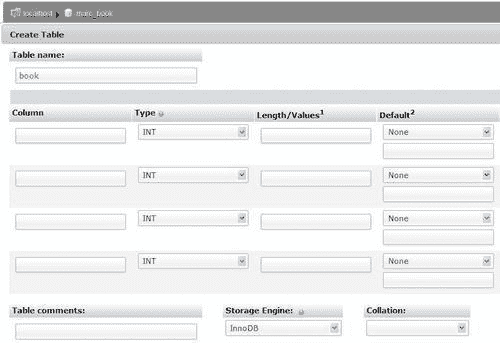
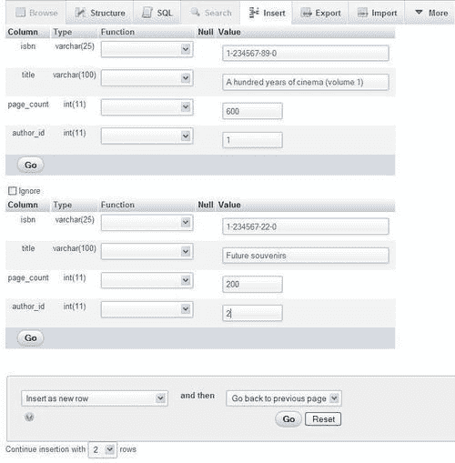
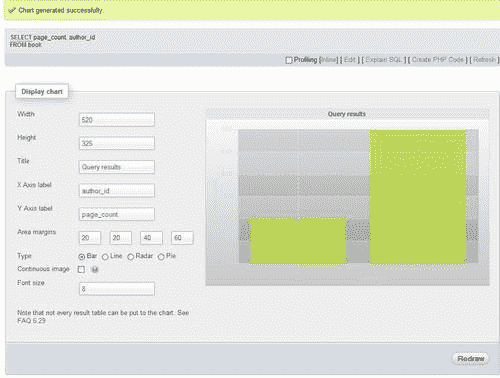

# 第四章创建和浏览表格

看到了 phpMyAdmin 的总体布局之后，我们准备创建一个数据库，创建第一个表，向其中插入一些数据，然后浏览它。这些第一步是有意简单的，但是它们会给你以后更复杂的操作的基础。在本章末尾，我们将有两个基本表格供我们使用，其余的练习都是基于这两个基本表格进行的。

# 创建数据库

在创建表之前，我们必须确保我们有一个 MySQL 服务器管理员授予我们 `CREATE`特权的数据库。存在以下可能性：

*   管理员已经为我们创建了一个数据库，我们可以在导航面板中看到它的名称；我们无权创建其他数据库。
*   我们有权从 phpMyAdmin 创建数据库。
*   我们在一个共享主机上，主机提供商安装了一个通用的 web 界面（例如，cPanel）来创建 MySQL 数据库和帐户；在这种情况下，我们现在应该访问这个 web 界面，并确保至少创建了一个数据库和一个 MySQL 帐户。

`Server`视图中的**数据库**面板是查找数据库创建对话框的地方。请注意，配置参数 `$cfg['ShowCreateDb']`控制**创建新数据库**对话框的显示。默认设置为 `true`，显示对话框。

## 没有特权

如果您没有创建数据库的权限，面板会在**创建新数据库**标签下显示**无权限**消息。这意味着您必须使用已经为您创建的数据库，或者要求 MySQL 服务器的管理员授予您必要的 `CREATE`权限。

### 注

如果您是 MySQL 服务器的管理员，请参阅[第 19 章](19.html "Chapter 19. Administrating the MySQL Server")。

## 已授权首次创建数据库

如果 phpMyAdmin 检测到我们有权创建数据库，则会出现如下屏幕截图所示的对话框：


在输入字段中，如果 `$cfg['SuggestDBName']`参数设置为 `TRUE`，则会显示建议的数据库名称，这是默认设置。建议的数据库名称是根据我们拥有的权限生成的。

如果我们仅限于使用前缀，则可以在输入字段中建议使用前缀。（此前缀的一个常用选择是用户名，用户名后面可能有下划线字符，也可能没有下划线字符。）请注意，在本例中，前缀后面是省略号，由 phpMyAdmin 添加。我们应该删除此省略号，并用适当的名称填写输入字段。


**排序规则**选项暂时可以保持不变。通过此对话框，我们可以为该数据库选择默认字符集和排序规则。此设置可在以后更改（有关此设置的详细信息，请参阅[第 9 章](09.html "Chapter 9. Performing Table and Database Operations")。

这里我们假设我们有权创建一个名为**marc_book**的数据库。我们在输入字段中输入**marc_book**，点击**创建**。创建数据库后，我们将看到以下屏幕：


请注意以下事项：

*   主面板的标题已更改，以反映我们现在位于此数据库中的事实
*   将显示有关创建的确认消息
*   导航面板已更新；我们看到**马克书**
*   默认情况下，phpMyAdmin 发送到服务器以创建数据库的 SQL 查询以彩色显示

### 注

phpMyAdmin 显示它生成的查询，因为 `$cfg['ShowSQL']`设置为 `TRUE`。查看生成的查询是学习 SQL 的一种好方法。

由于生成的查询可能很大，占用屏幕上的大部分空间， `$cfg['MaxCharactersInDisplayedSQL']`起到了限制作用。它的默认值 `1000`应该在看到的查询太少和看到的查询太多之间取得很好的平衡，尤其是在执行大型导入时。

检查 phpMyAdmin 反馈以确定我们通过接口进行的操作的有效性非常重要。通过这种方式，我们可以检测诸如名称中的拼写错误或在错误的数据库中创建表之类的错误。phpMyAdmin 从 MySQL 服务器检索错误消息，并将其显示在界面上。

# 创建我们的第一张表

现在我们有了一个新的数据库，是时候在其中创建一个表了。我们将创建的示例表名为**book**。

## 选择栏目

在创建表之前，我们应该计划要存储的信息。这通常在数据库设计期间完成。在我们的案例中，一个简单的分析会让我们找到以下我们想要保存的与书籍相关的数据：

*   国际标准书号（ISBN）
*   标题
*   页数
*   作者身份

目前，为我们的**book**表提供完整的列列表并不重要。我们将通过现在对结构进行原型化并在以后对其进行细化来对其进行修改。在本章末尾，我们将添加第二个表 `author`，其中包含每个作者的信息。

## 创建表

我们已经选择了表名，并且知道列数。我们在**创建表格**对话框中输入此信息，然后点击**Go**开始创建表格。在这一点上，列的数量是否准确并不重要，因为后续面板将允许我们在创建表时添加列。


然后我们会看到一个指定列信息的面板。当我们要求四列时，我们得到四个输入行。每行指的是特定于一列的信息。以下屏幕截图表示此面板的左侧：



下一个代表右侧：


MySQL 文档解释了表名和列名的有效字符（如果我们搜索“合法名称”）。这可能因 MySQL 版本而异。通常，文件名中允许的任何字符（点和斜杠除外）在表名中都是可以接受的，并且名称的长度不得超过 64 个字符。列名也有 64 个字符的限制，但我们可以使用任何字符。

我们在**栏**栏下输入我们的列名。每列都有一个类型，最常用的类型位于下拉列表的开头。

当列内容为字母数字时，**VARCHAR**（变量字符）类型被广泛使用，因为内容将只占用它所需的空间。这种类型需要一个最大长度，这是我们指定的。如果我们忘记这样做，一个小弹出消息提醒我们以后当我们保存。对于页面计数和作者标识，我们选择了**INT**类型（整数），如以下屏幕截图所示：


列还有其他属性，但在本例中我们将它们保留为空。您可能会注意到屏幕底部的**添加 1 列**对话框。通过输入适当的值并点击**Go**，我们可以使用它向这个表创建面板添加一些列。输入行的数量将根据新列的数量而改变，保留关于前四列的已输入信息。在保存页面之前，让我们定义一些键。

## 选择按键

一个表通常应该有一个主键（一个具有代表每一行的唯一内容的列）。建议使用主键来标识行、提高性能和可能的跨表关系。这里一个很好的值是 ISBN；因此，在**索引**对话框中，我们为**isbn**列选择**主**。索引类型的其他可能性包括**索引、唯一**和**全文**（更多信息请参见[第 5 章](05.html "Chapter 5. Changing Data and Structure")。

### 注

**索引管理**（也称密钥管理）可以在初始表创建时进行，也可以在 `Table`视图的**结构**页面中进行。

为了提高**作者**的查询速度，我们应该在此列上添加一个索引。现在屏幕的右侧部分如以下截图所示：


此时，我们可以从相应的下拉菜单中选择不同的**存储引擎**。但是，目前我们只接受默认的存储引擎。

现在我们可以通过点击**保存**来创建表了。如果一切顺利，下一个屏幕将确认该表已创建；我们现在在当前数据库的**结构**页面。


在为**book**表显示的各种链接中，有些链接不是活动的，因为如果表中没有行，则浏览或搜索表是没有意义的。

# 手动插入数据

现在我们有了一个表，让我们手动将一些数据放入其中。在此之前，本书中有一些关于数据操作的有用参考资料：

*   [第 5 章](05.html "Chapter 5. Changing Data and Structure")说明如何更改数据和结构，包括如何使用**功能**选择器
*   [第 7 章](07.html "Chapter 7. Importing Structure and Data")说明如何从现有文件导入数据
*   [第 9 章](09.html "Chapter 9. Performing Table and Database Operations")解释了如何从其他表复制数据
*   [第 10 章](10.html "Chapter 10. Benefiting from the Relational System")解释了关系系统（在我们的例子中，我们希望链接到 `author`表）

现在，点击**插入**链接，这将引导我们进入数据输入（或编辑）面板。这个屏幕有空间输入两行信息，也就是我们示例中的两本书。这是因为 `$cfg['InsertRows']`的默认值为 `2`。在屏幕下部，如果默认行数不符合我们的需要，可以使用对话框**继续插入 2 行**。默认情况下，**忽略**复选框被勾选，这意味着第二组输入字段将被忽略。当我们在该组的一个字段中输入一些信息并退出该字段时，如果浏览器中启用了 JavaScript，**忽略**框将自动取消选中。

我们可以为两本书输入以下示例信息：

*   ISBN:1-234567-89-0，标题：电影百年（第一卷），600 页，作者 ID:1
*   ISBN:1-234567-22-0，标题：未来的纪念品，200 页，作者 ID:2

**值**列宽服从字符列的最大长度。对于本例，我们将下部下拉选择器保持为其默认值**Insert as new row**。然后点击**Go**插入数据。每套代表一行的列后面都有一个**Go**按钮，另一个按钮位于屏幕下部。所有这些都具有保存输入数据的相同效果，但都是为了方便而提供的。



如果我们的目的是在这两本书之后输入更多书籍的数据，我们会在点击**Go**之前从第二个下拉列表中选择**插入另一行**。然后，这将插入我们提供的数据，并重新加载屏幕以插入更多数据。

## CHAR 和 VARCHAR 的数据输入面板调整

默认情况下，phpMyAdmin 在单行上显示列类型 `CHAR`和 `VARCHAR`的输入字段。这是通过将 `$cfg['CharEditing']`设置为`'input'`来控制的。有时，我们可能希望在字段中插入换行符（新行）。这可以通过将 `$cfg['CharEditing']`设置为`'textarea'`来实现。这是一个全局设置，将应用于所有表的所有列，适用于此 phpMyAdmin 副本的所有用户。在此模式下，可通过*输入*键手动插入换行符，或通过复制和粘贴来自另一屏幕源的文本行。应用此设置将生成不同的**插入**屏幕，如下所示：


在这种输入模式下，每列的最大长度不再适用。它将在插入时由 MySQL 强制执行。

# 浏览模式

有很多方法可以进入这种模式。事实上，每次显示查询结果时都会使用它。我们可以通过点击导航面板上的表格名称进入此模式，或者在 `Table`视图中点击**浏览**查看特定表格。


## SQL 查询链接

在**浏览**结果中，显示的第一部分是查询本身，以及一些链接。显示的链接可能因我们的操作和某些配置参数而异。


以下几点描述了每个链接的功能：

*   本章的*评测查询*部分中包含了**评测**复选框。
*   **内联**链接允许将查询放入文本区域，而无需重新加载页面；然后可以编辑查询并执行新查询。
*   如果 `$cfg['SQLQuery']['Edit']`设置为 `TRUE`，则会出现**编辑**链接。其目的是打开**查询窗口**，可以对该查询进行编辑（详见[第 11 章](11.html "Chapter 11. Entering SQL Statements")。
*   如果 `$cfg['SQLQuery']['Explain']`设置为 `TRUE`，则显示**解释 SQL**。我们将在[第 5 章](05.html "Chapter 5. Changing Data and Structure")中了解此链接的用途。
*   可以单击**创建 PHP 代码**链接，将查询重新格式化为 PHP 脚本中预期的语法。然后可以将其复制并粘贴到我们正在处理的 PHP 脚本中需要查询的位置。请注意，单击后，此链接将变为不带 PHP 代码（如以下屏幕截图所示）的**，这将恢复正常的查询显示。如果 `$cfg['SQLQuery']['ShowAsPHP']`设置为 `TRUE`，则此链接可用。**


*   **刷新**用于再次执行同一查询。结果可能会改变，因为 MySQL 服务器是多用户服务器，其他用户或进程可能正在修改相同的表。如果 `$cfg['SQLQuery']['Refresh']`设置为 `TRUE`，则显示此链接。

## 导航栏

导航栏显示在结果的顶部和底部。根据在字段之后的**重复标题中输入的值，可以在结果之间以一定的间隔重复列标题。**


该栏使我们能够从一页导航到另一页，显示任意数量的行，从结果中的某个点开始。当我们通过点击**浏览**进入浏览模式时，生成结果的底层查询包括整个表。然而，情况并非总是如此。

我们目前正在使用一个包含少量行的表。对于较大的表，我们可以看到一组更完整的导航按钮。为了模拟这种情况，让我们使用**显示**对话框将默认行数从**30**更改为**1**；然后点击**节目**。我们可以看到，导航栏自行调整，如以下屏幕截图所示：


这一次，有标记为**<<、<、>**、**>>**的按钮，分别方便访问结果的第一页、上一页、下一页和最后一页。按钮仅在必要时出现；例如，如果我们已经在第一页上，**第一页**按钮不显示。这些符号以这种方式显示，因为 `$cfg['NavigationBarIconic']`的默认设置为 `TRUE`。此处的 `FALSE`将产生**下一步**和**结束**等按钮，而`'both'`的值将显示**>下一步**和**>>结束**。

### 注

注意， `$cfg['NavigationBarIconic']`指令仅控制这些导航按钮的行为；其他按钮和链接，如**编辑**由其他配置指令控制。

还有一个**页码**下拉菜单，可以直接转到当前页面附近的一个页面。由于可能有数百或数千页，此菜单保持较小，并包含通常请求的页面：当前页面前后的一些页码，开头和结尾的一些页码，以及基于计算间隔的页码示例。

根据设计，phpMyAdmin 总是试图给出快速的结果，实现这一结果的一种方法是在 `SELECT`中添加 `LIMIT`子句。如果原始查询中已有一个 `LIMIT`子句，phpMyAdmin 将尊重它。默认限制为 30 行，在 `$cfg['MaxRows']`中设置。如果服务器上有许多用户，限制返回的行数有助于将服务器负载降至最低。

导航栏上有另一个按钮，但必须通过将 `$cfg['ShowAll']`设置为 `TRUE`来激活。对于用户来说，经常使用这个按钮是非常诱人的。因此，在 phpMyAdmin 的多用户安装中，建议将按钮保留为其默认值 disabled（FALSE）。启用时，导航栏会增加一个**显示所有**按钮。单击此按钮检索当前结果集的所有行，这些行可能会达到 PHP 中的执行时间限制或服务器中的内存限制；当要求显示数千行时，大多数浏览器也会崩溃。可以安全显示的确切行数无法预测，因为它取决于列中的实际数据和浏览器的功能。

### 注

如果我们在**显示行**对话框中输入一个大数字，将获得相同的结果（并且我们可能会面临相同的问题）。

## 查询结果操作

标记为**查询结果操作**的部分位于结果下方。它包含打印结果（带或不带 `FULL TEXT`列）、导出这些结果（请参阅[第 6 章](06.html "Chapter 6. Exporting Structure and Data (Backup)")中的*导出部分查询结果*部分）或从此查询创建视图的链接（更多信息，请参阅[第 17 章](17.html "Chapter 17. Supporting Features Added in MySQL 5")。

### 以图表形式显示数据

另一个可用的操作是**显示图表**。为了实践这一点，我们将使用一个只选择两列的不同查询。为此，我们可以使用查询旁边显示的**内联**链接，并将查询更改为：

```php
SELECT page_count, author_id from book

```

点击**Go**生成一个只有这两列的结果集；接下来点击**显示图**，生成如下面板：



更多详情请访问[http://wiki.phpmyadmin.net/pma/Charts](http://wiki.phpmyadmin.net/pma/Charts) 。

## 排序结果

在 SQL 中，我们永远无法确定检索数据的顺序，除非我们显式地对数据进行排序。检索引擎的一些实现可能会按照与输入数据相同的顺序显示结果，或者根据主键显示结果。然而，按照我们想要的顺序获得结果的一个可靠方法是显式排序。

显示浏览结果时，可以单击任何列标题对此列进行排序，即使它不是索引的一部分。让我们点击**作者 id**列标题。


通过观察屏幕顶部的 SQL 查询，我们可以确认排序已经发生；它包含一个**ORDER BY**子句。

我们现在看到一个小三角形，指向**作者 id**标题旁边的上方。这意味着当前排序顺序为“升序”。将鼠标悬停在**作者 id**标题上会使三角形改变方向，以指示如果我们再次单击标题会发生什么情况—通过降低**作者 id**值进行排序。

另一种排序方法是按键排序。**排序**对话框显示所有已定义的键。这里我们看到一个名为**PRIMARY 的键**在创建时，当我们为该列选中**PRIMARY**时，在**isbn**列上为我们的主键指定了名称：


这可能是一次对多列进行排序的唯一方法（对于多列索引）。

初始排序顺序在 `$cfg['Order']`中定义，其中 `ASC`表示升序， `DESC`表示降序， `SMART`表示降序；后者是默认的排序顺序，这意味着类型为 `DATE, TIME, DATETIME`和 `TIMESTAMP`的列将按降序排序，而其他列类型将按升序排序。

### 标题词

因为我们可以更改页面上显示的行数，所以很可能看不到整个数据。在这种情况下，它将有助于查看**标题词**——关于第一行和最后一行显示数据的指示。这样，您可以单击**下一步**或**上一步**，而无需滚动到窗口底部。

然而，phpMyAdmin 应该以哪一个专栏为基础来生成标题词？我们做了一个简单的假设：如果您单击某个列的标题以表明您对该列进行排序的意图，phpMyAdmin 将该列的数据用作标题词。对于我们当前的**图书**表格，我们没有足够的数据来清楚地注意到这种技术的好处。然而，我们仍然可以看到，经过排序后，屏幕顶部现在包含以下消息：

**显示第 0-1 行（共 2 行，查询耗时 0.0006 秒）[作者 id:1-2]**

在这里，方括号之间的消息表示**作者 id**编号**1**在第一行显示，编号**2**在最后一行显示。

## 颜色标记行或列

在行之间（或列标题之间）移动鼠标时，行（或列）背景颜色可能会更改为 `$cfg['BrowsePointerColor']`中定义的颜色。此参数可在 `themes/<themename>/layout.inc.php`中找到。要启用此功能，所有主题的浏览指针`—$cfg['BrowsePointerEnable']—`必须在 `config.inc.php`中设置为 `TRUE`（默认值）。

当表中有许多列并且必须不断地向左和向右滚动以读取数据时，直观地标记一些行可能会很有趣。另一个用法是突出显示某些行对于个人数据比较的重要性，或者在向人们显示数据时。高亮显示是通过单击行来完成的。再次单击将删除行上的标记。所选颜色由 `$cfg['BrowseMarkerColor']`定义（请参见 `themes/<themename>/layout.inc.php)`。必须通过将 `$cfg['BrowseMarkerEnable']`设置为 `TRUE`来启用此功能，这次是在 `config.inc.php`中。这将为所有主题设置此功能。我们可以标记多行。标记该行也会激活该行的复选框。


标记列是通过单击列标题而不是列名本身来完成的。

## 限制每根立柱的长度

在前面的示例中，我们总是看到每一列的完整内容，因为每一列的字符数都在 `$cfg['LimitChars']`定义的限制范围内。这是对所有非数字列强制执行的限制。如果该限值较低（例如 `10)`，则显示如下：


这将有助于我们同时看到更多的列（以减少每列的显示为代价）。

### 显示选项

为了查看全文，我们现在将使用**选项**滑块，其中显示一些显示选项。所有这些选项将在涵盖相应概念的章节中解释。我们目前关注的选项是**部分文本/全文**对；我们可以选择**全文**查看所有被截断的文本。即使我们选择不更改 `$cfg['LimitChars']`参数，也会有一段时间要求提供全文是有用的（当我们在[第 5 章](05.html "Chapter 5. Changing Data and Structure")中使用 `TEXT`列类型时）。

查看全文的一种更快的方式是点击位于**编辑**和**删除**图标上方的大**T**。再次点击**T**可将显示从完全切换到部分。

## 浏览不同的值

有一种快速方法可以显示所有不同的值以及列中每个值的出现次数。此功能可在表格的**结构**页面上找到。例如，我们想知道我们的书桌上有多少不同的作者，每个人写了多少本书。在描述我们想要浏览的专栏的那一行（这里是**作者 id】**，我们打开**更多**菜单，点击**浏览不同值**链接。


我们的测试集有限，但仍然可以看到结果。


# 评测查询

MySQL 版本 5.0.37 和 5.1.28 中添加了评测支持。我们之前已经在查询结果中看到了**评测**复选框。

选中此框后，phpMyAdmin 将分析每个查询（包括当前查询），并显示每个 MySQL 内部操作的执行时间报告，如下图所示：


尽管分析系统可以报告有关操作的附加信息（例如 CPU 时间，甚至内部服务器的函数名），但 phpMyAdmin 当前仅显示操作的名称及其持续时间。

# 创建附加表

在我们（简单的）设计中，我们知道我们需要另一个表**author**表。**作者**表将包含：

*   作者身份
*   全名
*   电话号码

要创建此表，我们返回到**marc_book**的 `Database`视图，并请求创建另一个包含三列的表，如以下屏幕截图所示：


使用创建第一个表时使用的相同技术，我们键入：


由于我们有三列或更少，显示器现在处于垂直模式（更多详细信息，请参阅[第 5 章](05.html "Chapter 5. Changing Data and Structure")中的*垂直模式*部分）。

列名**id**是我们在这个新表中的主键，它与 `book`表中的 `author_id`列相关。保存表结构后，我们为作者 1 和 2 输入一些数据。发挥你的想象力吧！

# 总结

本章介绍了如何创建数据库和表，以及如何在表中手动输入数据。它还介绍了如何使用浏览模式确认数据的存在，浏览模式包括 SQL 查询链接、导航栏、排序选项和行标记。

下一章将解释如何编辑数据行，并介绍删除行、表和数据库的各个方面。