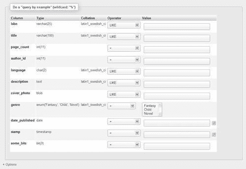
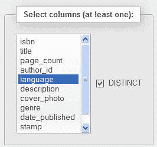
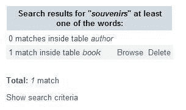

# 第八章数据检索

在本章中，我们将介绍可用于查找所需数据的机制，而不仅仅是逐页浏览表并对其进行排序。在**搜索**模式下，应用程序开发人员可以以他们正在构建的接口所不期望的方式查找数据，调整数据，有时修复数据。本章介绍单表搜索和整个数据库搜索。[第 12 章](12.html "Chapter 12. Generating Multi-table Queries")是对本章的补充，并提供了同时涉及多个表的搜索示例。

# 单表搜索

本节描述了**搜索**页面，其中提供了单表搜索。仅在一个表中搜索仅在单个表重新组合要搜索的所有数据的情况下有效。如果数据分散在许多表中，则应启动数据库搜索，本章后面将介绍这一点。

## 进入搜索页面

点击 `Table`视图中的**搜索**链接，即可进入**搜索**页面。此处已针对 `book`表完成此操作

**搜索**界面**（示例查询）**中最常用的部分是立即显示的部分，而其他对话框隐藏在一个滑块中，可通过**选项**链接激活（本章后面将详细介绍这些对话框）。

## 列查询示例搜索条件

**搜索**面板的主要用途是为某些列输入条件，以便仅检索我们感兴趣的数据。这被称为**示例查询**，因为我们给出了一个我们正在寻找的示例。我们的第一次检索将涉及查找 ISBN**1-234567-89-0**的书籍。我们只需在**isbn**框中输入该值，并将**运算符**字段设置为**=**。

点击**Go**给出这些结果（部分显示在下面的屏幕截图中）：

这是一个标准的结果页面。如果结果在页面中运行，我们可以在页面中导航，并编辑和删除过程中所选子集的数据。phpMyAdmin 的另一个特性是，通过更改列的边框颜色来突出显示用作标准的列，以更好地反映它们在结果页面上的重要性。

无需指定显示**isbn**列，即使这是我们搜索的列。我们可以只选择**标题**列进行显示（参考*选择要显示的列*部分），并选择**isbn**列作为标准。

### 搜索空/非空值

当列的字符类型为 `CHAR, VARCHAR`或 `TEXT:`时，操作员列表中有两个方便的操作员

*   `= ''`
*   `!= ''`

当您想要在某个列中搜索空的 `(= '')`或非空的`(!= '')`值时，可以使用这些选项。通常，在列的**值**字段中键入任何内容都表示该列不参与搜索过程。但是，使用其中一个运算符，此列将包含在生成的搜索查询中。

### 注

请不要将此方法与搜索 `NULL`值相混淆，这是完全不同的。实际上，一个 `NULL`值（参考[http://en.wikipedia.org/wiki/Null_（SQL）](http://en.wikipedia.org/wiki/Null_(SQL))是一个特殊值，表示此列中缺少某些信息。

## 生成带打印视图的报表

我们可以在结果页面上看到**打印视图**和**打印视图（带全文）**链接。这些链接直接向打印机生成更正式的结果报告（无导航界面）。在我们的例子中，使用**打印视图**将产生以下结果：

此报表包含有关服务器、数据库、生成时间、phpMyAdmin 版本、MySQL 版本和生成的 SQL 查询的信息。另一个链接**打印视图（带全文）**将完整打印 `TEXT`列的内容。

## 使用通配符进行搜索

让我们假设我们正在寻找一些不那么精确的东西——所有书名中都有“电影”的书。首先，我们回到搜索页面。对于这种类型的搜索，我们将使用 SQL 的类似于**的**操作符。此运算符接受通配符 `%`字符（与任意数量的字符匹配）和下划线（_）字符（与单个字符匹配）。因此，我们可以使用**%cinema%**让 phpMyAdmin 找到与单词“cinema”匹配的任何子字符串。如果我们省略了这两个通配符，我们将只获得与单个单词的精确匹配。

此子字符串匹配更易于访问，属于**运算符**下拉列表的一部分。我们只需输入单词**cinema**并使用操作员**如%…%**来执行该匹配。我们应该避免在大表（由数千行组成）上使用类似于**的**操作符的这种形式，因为 MySQL 在这种情况下不使用索引进行数据检索，导致等待时间取决于服务器硬件及其当前负载。这就是为什么此运算符不是下拉列表中的默认运算符，即使这种搜索方法通常用于较小的表。

下面的屏幕截图显示了我们如何请求与**LIKE%…%**运营商在**影院**上进行搜索：

### 注

`LIKE`运算符可用于其他类型的通配符搜索，例如 `History%`，它将在标题开头搜索该单词。由于表达式不是以通配符开头的，如果 MySQL 找到一个可以加快数据检索速度的索引，它将尝试使用该索引。有关 MySQL 使用索引的更多详细信息，请参考[http://dev.mysql.com/doc/refman/5.1/en/mysql-indexes.html](http://dev.mysql.com/doc/refman/5.1/en/mysql-indexes.html) 。

使用这些执行查询的方法中的任何一种都会产生以下结果：

`%`和 `_`通配符可以在搜索表达式中重复；例如， `histo__`（两个下划线）将匹配 `history`，而 `histo%`将匹配 `history`和 `historian`。MySQL 手册在[中给出了更多示例 http://dev.mysql.com/doc/refman/5.1/en/string-comparison-functions.html](http://dev.mysql.com/doc/refman/5.1/en/string-comparison-functions.html) 。

## 案例敏感性和搜索

在前面的例子中，我们本可以用“电影院”代替“电影院”，并获得类似的结果。原因是**标题**栏的校勘为**拉丁文 1\u 瑞典语**。默认情况下，此排序规则来自数据库创建时的排序规则集，除非服务器的默认排序规则已更改（请参阅[http://dev.mysql.com/doc/refman/5.1/en/charset-mysql.html)](http://dev.mysql.com/doc/refman/5.1/en/charset-mysql.html))。这里，**ci**表示比较是以不区分大小写的方式进行的。请参考[http://dev.mysql.com/doc/refman/5.1/en/case-sensitivity.html](http://dev.mysql.com/doc/refman/5.1/en/case-sensitivity.html) 了解更多详情。

## 合并标准

我们可以对同一个查询使用多个条件（例如，查找超过 300 页的所有英文书籍）。**运算符**中比较选项较多，因为**页数**列为数字，如下图截图所示：

## 搜索选项

**选项**滑块显示更多面板，以进一步完善搜索过程。

### 选择要显示的列

在**选项**滑块中，**选择列**面板有助于选择要在结果中显示的列。默认选择所有列，但我们可以*Ctrl*并单击其他列进行必要的选择。Mac 用户将使用*命令*并单击来选择/取消选择列。

以下是本例中感兴趣的列：

我们还可以在列选择旁边的文本框中指定每页的行数。**添加搜索条件**框将在*应用 WHERE 子句*一节中解释，稍后将进行解释。

### 排序结果

**显示顺序**对话框允许指定结果的初始排序顺序。在此对话框中，下拉菜单包含表的所有列；这取决于我们选择一个我们想要排序的。默认情况下，排序顺序为**升序**序，但也可以选择**降序**序。

需要注意的是，在结果页面上，我们可以使用[第 4 章](04.html "Chapter 4. Creating and Browsing Tables")中介绍的技术更改排序顺序。

### 应用 WHERE 子句

有时，我们可能希望输入一个在**示例查询**部分的**函数**列表中未提供的搜索条件。该列表不能包含该语言中所有可能的变体。假设我们想找到所有使用 `IN`子句的英语或法语书籍。为此，我们可以使用**添加搜索条件**部分。

### 注

将搜索条件和其他条件（通过示例行在**查询中输入）与逻辑 `AND`运算符组合生成完整的搜索表达式。**

我们可以在同一个文本框中输入更复杂的搜索条件列表，可能带有括号和运算符，如 `AND`或 `OR`。

一个**文档**链接指向 MySQL 手册，在这里我们可以看到大量可用函数的选择。（每个函数适用于特定的列类型。）

### 避免重复结果

`SELECT`语句的正常行为是获取与条件对应的所有条目，即使某些条目重复。有时，我们可能希望避免多次获得相同的结果。例如，如果我们想知道在哪些城市有客户，只需显示一次每个城市的名称就足够了。在这里，我们想知道我们的书是用哪种语言写的。在**选择列**对话框中，我们只选择**语言**列，并选中**不同的**，如下图截图所示：

点击**Go**会产生一个结果页面，我们只会看到**en**一次；如果没有**DISTINCT**选项，则包含**en**的行将出现三次。

如果我们选择多个列（例如 `author_id`和 `language)`并标记 `DISTINCT`选项，我们现在将在结果中看到两行，因为有两本英文书（但来自不同作者）。结果仍然不会重复。

# 执行完整的数据库搜索

在前面的示例中，搜索仅限于一个表。这假设您知道存储必要信息的确切表（和列）。

当数据隐藏在数据库中的某个位置时，或者当相同的数据可以显示在不同的列中时（例如，**标题**列或**描述**列），使用数据库搜索方法更容易。

我们在 `marc_book`数据库的 `Database`视图中进入**搜索**页面：

在**单词或值**部分，我们输入我们想要查找的内容。**%**通配符在这里可能很有用，但请记住本章前面给出的有关通配符的性能建议。我们输入**纪念品**。

在**查找**部分，我们指定如何处理输入的值。我们可能需要找到**至少一个输入的单词**、**所有单词**（没有特定顺序），或者**确切的短语**（单词顺序相同，在一列中的某个位置）。另一种选择是使用**作为正则表达式**，这是一种更复杂的模式匹配方法。更多详情请访问[http://dev.mysql.com/doc/refman/5.1/en/regexp.html](http://dev.mysql.com/doc/refman/5.1/en/regexp.html) 和[http://www.regular-expressions.info/](http://www.regular-expressions.info/) 。我们将保留默认值-**至少一个单词**。

我们可以选择表格来限制搜索或选择所有表格。因为我们只有两个（小）表，所以我们选择两者。

### 注

由于搜索将在每个选定表的每一行上进行，如果行或表的数量太多，我们可能会遇到一些时间限制。因此，可以通过将 `$cfg['UseDbSearch']`设置为 `FALSE`来停用此功能。（默认设置为 `TRUE`。

点击**Go**为我们找到以下结果：

这是对匹配数和相关表格的概述。我们可能会在表中找到一些我们可能不感兴趣的匹配项。但是，对于看起来有希望的匹配，我们可以点击**浏览**浏览结果页面，或者选择**删除**删除不需要的行。**显示搜索条件**链接将带回我们的条件面板。

## 将搜索限制为一列

有时，一个特定的列名是一个（或多个）表的一部分，我们只想在该列中搜索。例如，假设我们正在寻找“marc”；但这个名字也可能是书名的一部分。因此，我们希望将搜索限制为所有选定表中的“name”列。这可以通过在**内栏**选项中输入“名称”来实现。

# 停止错误的查询

假设我们启动一个复杂的搜索，并注意到浏览器正在等待结果。这可能发生在数据库搜索中，也可能发生在单表搜索中。我们可以指示浏览器停止，但这只会告诉 web 服务器停止处理我们的请求。但是，此时 MySQL 服务器进程很忙，可能正在执行复杂的连接或完整表扫描。以下是停止此错误查询的方法：

1.  我们打开一个不同的浏览器（例如，错误的查询是通过 Firefox 启动的，我们打开 Internet Explorer）。
2.  我们使用相同的帐户通过 phpMyAdmin 登录到 MySQL。
3.  在主页上，我们点击**流程**。
4.  此时，我们应该看到一个由**命令**列下的**查询**标识的进程，该进程包含错误的查询（除了 `SHOW PROCESSLIST`，它不是要终止的查询）。
5.  我们点击**Kill**进行这个过程。
6.  为了验证，我们可以立即再次点击**进程**，所选进程现在应该被标识为**已终止**，而不是**查询**。

# 总结

在本章中，我们概述了使用“示例查询”标准和附加标准规范选择显示值和排序结果的单表搜索。我们还研究了通配符搜索和完整数据库搜索。

下一章将解释如何对表执行操作，例如，更改表的属性，如其存储引擎。本章还介绍了修复和优化表格的主题。