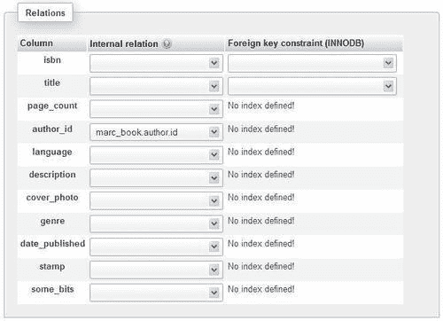
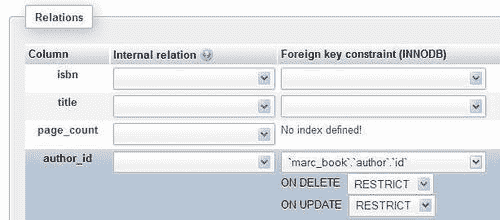
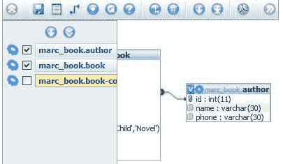
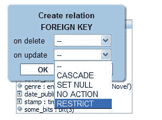
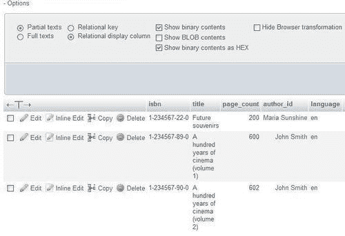

# 第十章受益于关系系统

关系系统允许用户与 phpMyAdmin 更紧密地协作，我们将在下面的章节中看到。本章介绍如何定义表间关系。

# 关系型 MySQL

当应用程序开发人员使用 PHP 和 MySQL 构建 web 界面或其他数据操作应用程序时，他们通常使用底层 SQL 查询在表之间建立关系。例如，查询“获取发票及其所有项目”和“获取作者的所有书籍”。

在 phpMyAdmin 的早期版本中，关系数据结构（表之间的关系）没有存储在 MySQL 中。应用程序以编程方式联接表以生成有意义的结果。

phpMyAdmin 开发人员和用户认为这是 MySQL 的一个缺点。因此，团队开始构建一个基础设施来支持 `MyISAM`表的关系，现在称为 phpMyAdmin 配置存储。该基础设施不断发展，以支持越来越多的特殊功能，如查询书签和基于 MIME 的转换。

现在，表之间的关系通常是通过 `InnoDB`和 `PBXT`存储引擎的 `FOREIGN KEY`特性本地定义的。phpMyAdmin 支持这种类型的关系以及为 `MyISAM`定义的关系。

## InnoDB 和 PBXT

`InnoDB`（[http://www.innodb.com](http://www.innodb.com) 是 Oracle 子公司 Innobase Oy 开发的 MySQL 存储引擎。在 MySQL 5.5 之前，此存储引擎可能不可用，因为它必须由系统管理员激活；但是，它是 5.5 版中的默认存储引擎。

`PrimeBase XT`存储引擎或 PBXT（[http://www.primebase.org](http://www.primebase.org) 由 PrimeBase Technologies 开发。MySQL 所需的最低版本为 5.1，因为该版本支持 `PBXT`和其他第三方用于提供替代存储引擎的可插拔存储引擎 API。此事务存储引擎比 `InnoDB`更新。它通常是在从他们的网站下载并经过编译步骤后安装的。对于某些操作系统，可以使用预编译二进制文件。请访问上述网站以获取下载和安装说明。

在考虑关系方面时，以下是对表使用 `InnoDB`或 `PBXT`存储引擎的好处：

它们支持基于外键的引用完整性，外键是外键（或引用）表中的键。相反，仅使用 phpMyAdmin 的内部关系（稍后讨论）不会带来自动引用完整性验证。

`InnoDB`和 `PBXT`表的导出结构包含定义的关系。因此，它们很容易被导入，以实现更好的跨服务器互操作性。

这些存储引擎的外键功能可以有效地替代 phpMyAdmin 配置存储中处理关系的部分。我们将看到 phpMyAdmin 如何与 `InnoDB`和 `PBXT`外键系统接口。

### 注

phpMyAdmin 的配置存储的其他部分（例如书签）在 `InnoDB, PBXT`或 MySQL 中没有等价物。因此，他们仍然需要访问完整的 phpMyAdmin 功能集。然而，在 MySQL 5.x 中，视图是受支持的，并且与 phpMyAdmin 的书签有相似之处。

# 用关系视图定义关系

安装 phpMyAdmin 配置存储后， `Database`视图和 `Table`视图中有更多选项可用。现在我们将检查 `Table`视图的**结构**页面中的**关系视图**链接。


此视图用于：

*   定义当前表与其他表的关系
*   选择显示列

我们的目标是在 `book`表（包含作者 ID）和 `author`表（通过 ID 描述每个作者）之间创建一个关系。我们从 `book`表的 `Table`视图开始，进入**结构**，点击**关系视图**链接。

## 界定内部关系

如果 `book`表是 `MyISAM`格式，我们会看到下面的屏幕（否则显示会有所不同，如后面的*定义外键关系*部分所述）：


这个屏幕允许我们创建**内部关系**（存储在 `pma_relation`表中），因为 MySQL 本身对 `MyISAM`表没有任何关系概念。每列旁边的空下拉列表表示没有与任何外部表的关系（链接）。

### 定义关系

我们可以将 `book`表的每一列与另一个表中的一列相关联（或者在同一个表中，因为有时需要自引用关系）。该接口在同一数据库的所有表中查找唯一键和非唯一键，并在下拉列表中显示键。（目前不支持从接口创建与其他数据库的内部关系。）**作者 id**列的适当选择是从 `author`表中选择相应的**id**列。


然后点击**保存**，定义保存在 phpMyAdmin 的配置存储中。要删除该关系，我们只需返回屏幕，选择空选项，然后单击**保存**。

### 定义显示列

我们的 `author`表的主键是 `id`，这是一个我们为了键的目的而编的唯一数字。作者的名字是指作者的自然方式。在浏览 `book`表时，看到作者的名字会很有趣。这就是显示列的用途。我们通常应该为参与关系的每个表定义一个显示列作为外部表。

我们将从定义的关系部分中看到该信息如何显示在*中。现在我们转到 `author`表的**关系视图**（在本例中是外部表）并指定显示列。我们选择**名称**作为显示栏，点击**保存**，如下图所示：*


### 注

phpMyAdmin 提供了为一个表定义一个显示列的功能，并且该列用于该表用作外部表的所有关系中。

这个关系的定义现在已经完成了。虽然我们没有将 `author`表中的任何列与另一个表关联，但是可以这样做。例如，我们可以在这个表中有一个国家代码，并且可以创建一个与国家表的国家代码的关系。

现在，我们将看看如果我们的表在 `InnoDB`或 `PBXT`存储引擎的控制下会发生什么。

## 对外关键关系

`InnoDB`和 `PBXT`存储引擎为我们提供了本机外键系统。

### 注

您可以选择使用 `InnoDB`或 `PBXT`存储引擎完成本节中的练习。 `InnoDB`已在文本中选择。

对于本练习，我们的 `book`和 `author`表必须位于 `InnoDB`存储引擎下。我们可以从 `Table`视图中的**操作**页面执行此操作。

另一个步骤是必要的，以查看在练习过程中缺失索引的后果。我们回到 `book`表的**结构**，删除我们在**作者 id**和**语言**列上创建的组合索引。

`InnoDB`中的外键系统保持相关表之间的完整性。因此，我们不能将不存在的作者 ID 添加到 `book`表中。此外，当在主表上执行 `DELETE`或 `UPDATE`操作时（在本例中为 `book)`操作），操作是可编程的

打开**结构**页面上的 `book`表，进入**关系视图**，现在显示另一个页面：



本页为我们提供以下信息：

*   **作者 id**与 `author`表之间定义了一个内部关系。
*   尚未定义 `InnoDB`关系。
*   当 `InnoDB`中定义了相同的关系时，我们将能够删除内部关系。事实上，将鼠标悬停在**内部关系**旁边的问号上会显示以下消息：**当存在对应的外键关系**时，不需要内部关系。因此，最好将其移除。

在相关键的可能选择中，我们可以看到在同一数据库的所有 `InnoDB`表中定义的键。（phpMyAdmin 当前不支持创建跨数据库关系。）还显示了当前表中定义的键，因为可以使用自引用关系。让我们删除**作者 id**列的内部关系，然后单击**保存**。我们的目标是为**author_id**列添加一个 `InnoDB-type`关系，但这是不可能的，因为**没有定义索引！**此行显示消息。这是因为只有当两列都有索引时， `InnoDB`或 `PBXT`中的外键定义才能完成。

### 注

MySQL 手册中解释了有关约束的其他条件。请参考[http://dev.mysql.com/doc/refman/5.1/en/innodb-foreign-key-constraints.html](http://dev.mysql.com/doc/refman/5.1/en/innodb-foreign-key-constraints.html) 。

因此，我们回到 `book`表的**结构**页面，向**作者 id**列添加一个普通（非唯一）索引，生成以下屏幕：


在**关系视图**中，我们可以再次尝试添加我们想要的关系；这次成功了！



我们还可以使用**上的**删除选项和**上的**更新选项设置一些操作。例如，DELETE CASCADE 上的**会使 MySQL 在从父表中删除对应行时自动删除相关（外来）表中的所有行。例如，当父表为 `invoices`，而外部表为 `invoice‑items`时，这将非常有用。MySQL 本机支持这些选项，因此在 phpMyAdmin 之外删除会导致删除级联。**

### 注

如果我们还没有这样做，我们应该为 `author`表定义显示列，如*定义显示列*部分所述。

### 没有 phpMyAdmin 配置存储的外键

我们在 `InnoDB`或 `PBXT`表的**结构**页面上看到**关系视图**链接，即使没有安装配置存储。这将把我们带到一个屏幕，在这里我们可以定义外键，在本例中为 `book`表定义外键。

请注意，如果选择此选项，则无法定义链接表的显示列（在本例中为 `author)`，因为它属于 phpMyAdmin 的配置存储。因此，我们将失去查看外键相关说明的好处。

# 定义与设计师的关系

基于 Ajax 的**设计器**提供了一种可视化的方式来管理关系（基于内键和外键），并为每个表定义显示列。它还可以充当：

*   用于访问现有表格结构和表格创建页面的菜单
*   一个 PDF 模式管理器，如果我们想要一个包含所有表的 PDF 模式

在**设计器**工作区中，我们可以处理同一面板上所有表的关系。另一方面，**关系视图**一次只显示一个表的关系。

我们通过点击**设计器**菜单选项卡，从 `Database`视图访问此功能。

### 注

如果此菜单选项卡未出现，则是因为我们尚未按照[第 1 章](01.html "Chapter 1. Getting Started with phpMyAdmin")中的说明安装 phpMyAdmin 配置存储。

## 过度查看界面

**设计器**页面包含可查看表格的主工作区。此工作区将根据表的位置动态地增长和收缩。下面的屏幕截图展示了包含我们三个表的**设计器**界面以及它们之间的关系：


顶部菜单包含图标，通过将鼠标悬停在图标上可显示其说明。下表总结了顶部菜单图标的目标：

<colgroup><col style="text-align: left"> <col style="text-align: left"></colgroup> 
| 

偶像

 | 

描述

 |
| --- | --- |
| **显示/隐藏左菜单** | 显示或隐藏左侧菜单。 |
| **保存位置** | 保存工作区的当前状态。 |
| **创建表** | 退出**设计器**进入对话框创建表；单击此按钮之前，我们应该注意保存表的位置。 |
| **创建关系** | 将**设计器**置于关系创建模式。 |
| **选择要显示的列** | 指定表示表的列。 |
| **重新加载** | 如果表的结构在**设计器**之外发生更改，则刷新表的信息。 |
| **帮助** | 显示有关选择关系的说明。 |
| **角链/直链** | 指定关系链接的形状。 |
| **捕捉到网格** | 影响相对于虚拟栅格的表格移动行为。 |
| **小/大全** | 隐藏或显示每个表的列列表。 |
| **切换小/大** | 反转每个表的列显示模式，因为每个表的角图标**V**或**>**都可以选择此模式。 |
| **进出口** | 显示要从现有 PDF 架构定义导入或导出到现有 PDF 架构定义的对话框。 |
| **移动菜单** | 顶部菜单可以向右移动，也可以向后移动。 |

点击**显示/隐藏左菜单**图标时，会出现一个侧菜单。其目的是显示表的完整列表，以便您可以决定工作区中出现的表，并允许访问特定表的**结构**页面。在本例中，我们选择从工作区中删除**book copy**表，如以下屏幕截图所示：



如果我们想永久删除它，我们点击**保存位置**顶部图标。此图标还保存工作区中表格的当前位置。

可以通过拖动表格的标题栏在工作空间中移动表格，并且可以借助每个表格的左上角图标使表格的列列表可见/不可见。在此列列表中，小图标向我们显示数据类型（数字、文本和日期），并告诉我们此列是否为主键。

## 定义关系

由于我们已经用**关系视图**定义了一个关系，我们将首先看到如何删除它。**设计师**不允许变更关系。但是，**设计器**允许删除和定义关系。

问号图标显示一个面板，说明在何处单击以选择关系以进行后续删除。


让我们单击关系行来选择它。我们在确认面板上点击**删除**。


然后我们可以继续重建它。为此，我们首先点击**创建关系**图标：


然后，光标以短信的形式显示**选择参考键**。在我们的例子中，引用的键是**作者**表的**id**列；所以我们把光标放在这个列上，然后点击它。验证已经完成，确保我们选择了主键或唯一键。

接下来，将光标更改为**选择外键**后，我们将其带到 `book`表的 `author_id`列并再次单击它。这确认了关系的创建。目前，该接口不允许创建复合键（具有多个列）。

### 定义外键关系

删除或定义 `InnoDB`或 `PBXT`表之间关系的过程与内部关系相同。唯一的例外是，在创建时，会出现一个不同的确认面板，使我们能够指定 `on delete`和 `on update`操作。



## 定义显示列

在工作空间中， `author`表中的 `name`列有一个特殊的背景色。这表示此列用作显示列。我们只需点击**选择列显示**图标，将短信**选择列显示**拖到另一列，如 `phone`列。这会将显示列更改为此列。如果我们要将消息拖到现有的显示列，我们将删除此列作为表的显示列的定义。

## 导出 PDF 模式

在第 15 章中，我们将看到如何为数据库的子集生成 PDF 模式。我们可以将表的坐标从这样的模式导入到**设计器的**工作区中，并反过来将它们导出到 PDF 模式中。**导入/导出坐标**图标可用于此目的。

# 受益于定义的关系

在本节中，我们将了解当前可以测试的已定义关系的好处。其他好处将在[第 12 章](12.html "Chapter 12. Generating Multi-table Queries")和[第 15 章](15.html "Chapter 15. Documenting the System")中描述。phpMyAdmin 配置存储的其他好处将出现在[第 14 章](14.html "Chapter 14. Using Query Bookmarks")、[第 16 章](16.html "Chapter 16. Transforming Data using MIME")和[第 18 章](18.html "Chapter 18. Tracking Changes")中。

这些好处适用于内部和外部关键关系。

## 外键信息

让我们浏览一下 `book`表。我们看到相关键**（作者 id】**的值现在是链接。将光标移动到任何**作者 id**值上会显示作者的姓名（由 `author`表的显示列定义）。


点击**作者 id**进入该特定作者的相关表格`—author—`：


与其查看键，不如查看所有行的显示列。回到 `book`表，我们可以选择**关系显示列**显示选项并点击**Go**。这将生成一个类似于以下屏幕截图的屏幕：



我们现在通过选择**关系键**并点击**Go**返回查看键。

## 外键下拉列表

显示 `book`表，在**插入**模式（或**编辑**模式）下，现在有一个具有定义关系的每列可能键的下拉列表。该列表包含键到显示列以及显示列到键的顺序中的键和说明（显示列）。这使我们能够使用键盘并键入键或显示列的第一个字母。


### 注

只有密钥（在本例中为**1】**将存储在 `book`表中。显示的显示列仅用于帮助我们。

默认情况下，如果外部表中最多有 100 行，将显示此下拉列表。这由以下参数控制：

```php
$cfg['ForeignKeyMaxLimit'] = 100;

```

对于大于该值的外部表，将在可浏览的外部表窗口（请参阅下一节）中显示一个独特的窗口。

我们可能更希望在下拉列表中以不同的方式查看信息。此处，**John Smith**为内容，**1**为 ID，默认显示由以下代码行控制：

```php
$cfg['ForeignKeyDropdownOrder'] = array( 'content-id', 'id-content');

```

我们可以使用一个或两个字符串`—content-id`和 `id-content—in`作为定义数组，并按照我们喜欢的顺序使用。因此，将 `$cfg['ForeignKeyDropdownOrder']`定义为 `array('id-content')`将生成一个仅包含以下选项的列表：

```php
1 John Smith
2 Maria Sunshine
3 André Smith

```

## 可浏览的外桌窗口

我们当前的 `author`表只有很少的条目。因此，为了说明这种机制，我们将 `$cfg['ForeignKeyMaxLimit']`设置为一个人为的低数值，1。现在在 `book`表格的**插入**模式中，我们看到一个小的表格状图标和**作者 id**列的**浏览外来值**链接。此图标打开另一个窗口，显示 `author`表和**搜索**输入字段的值。左侧的值按键值排序（此处为**id**列），右侧的值按描述排序。


选择其中一个值（通过单击键值或描述）将关闭此窗口，并将该值带回**作者 id**列。

## 参考完整性检查

我们在第 9 章讨论了**操作**页面及其**表维护**部分。对于本练习，我们假设 `book`和 `author`表都不受 `InnoDB`或 `PBXT`存储引擎的控制。如果我们已经为 `author`表定义了一个内部关系，那么 `book`表将出现一个新的选项—**检查引用完整性**。


每个定义的关系都会出现一个链接**（author\u id->author.id）**，点击该链接即可开始验证。对于每一行，验证外部表中是否存在相应的键，并报告错误（如果有）。如果生成的页面报告零行，这是个好消息！

之所以存在此操作，是因为对于本机不支持外键的存储引擎下的表，MySQL 和 phpMyAdmin 都不强制引用完整性。例如，完全有可能在 `book`表中为**作者 id**列插入具有无效值的数据。

## 元数据的自动更新

phpMyAdmin 使内部关系的元数据与通过 phpMyAdmin 对表所做的每次更改保持同步。例如，重命名作为关系一部分的列将使 phpMyAdmin 在关系的元数据中重命名此列。这可以保证内部关系继续发挥作用，即使在列名更改之后也是如此。删除列或表时也会发生同样的情况。

### 注

如果从 phpMyAdmin 外部对结构进行更改，则应手动维护元数据。

# 栏目点评

在 MySQL 4.1 之前，MySQL 结构本身不支持向列中添加注释。尽管如此，由于 phpMyAdmin 的元数据，我们可以对列进行评论。但是，自 MySQL 4.1 以来，就支持本机列注释。好消息是，对于任何 MySQL 版本，phpMyAdmin 中的专栏评论总是通过编辑每个专栏的结构通过**结构**页面访问。在下面的示例中，我们需要对 `book`表的三列进行注释。因此，我们选择它们并点击**附近的铅笔图标，选择**选项。


如图所示，为了获得下一个面板，我们正在垂直模式下工作。此模式已在[第 5 章](05.html "Chapter 5. Changing Data and Structure")中介绍。我们输入如下截图所示的评论，然后点击**保存：**


这些注释出现在不同的地方，例如，在导出文件（参考[第 6 章）](06.html "Chapter 6. Exporting Structure and Data (Backup)")中，在 PDF 关系模式（参考[第 15 章）](15.html "Chapter 15. Documenting the System")中，以及在浏览模式下，如以下屏幕截图所示：


如果我们不希望评论以浏览模式出现，我们可以将 `$cfg['ShowBrowseComments']`设置为 `FALSE`。（默认为 `TRUE`）

在**结构**页面中，列注释也作为一个工具提示出现，列名称用破折号下划线。要停用此行为，可以将 `$cfg['ShowPropertyComments']`设置为 `FALSE`。（此项也默认为 `TRUE`

## 自动迁移列注释

每当 phpMyAdmin 检测到列注释已存储在其元数据中时，它就会自动将这些列注释迁移到本机 MySQL 列注释。

# 总结

本章介绍了如何定义 `InnoDB`和非 InnoDB 表之间的关系。它还检查了 phpMyAdmin（当存在关系时）和外键的修改行为。最后，它介绍了**设计器**功能、列注释以及如何从表中获取信息。

下一章将介绍输入 SQL 命令的方法，当 phpMyAdmin 的接口不足以完成我们需要的任务时，这些方法非常有用。