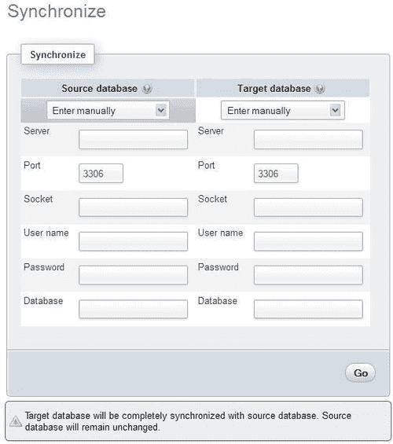
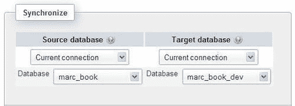
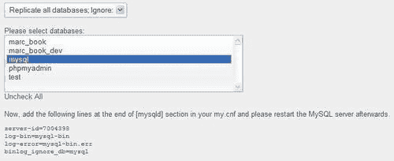
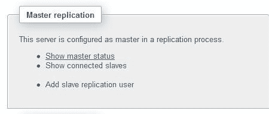
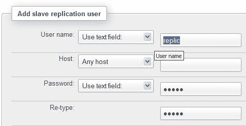
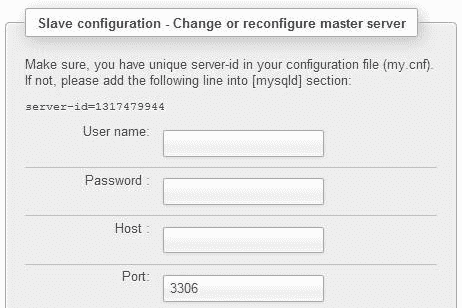
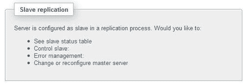
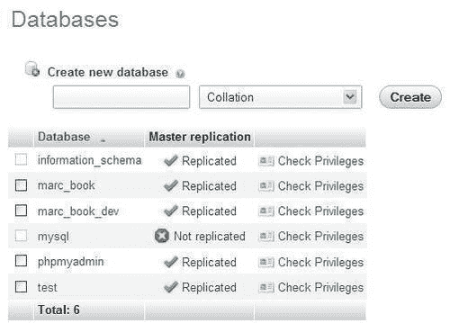

# 第 13 章同步数据和支持复制

在本章中，我们将介绍 phpMyAdmin 3.3.0 中发布的两个功能。第一个特性是同步数据库的能力，这是在多台服务器上工作的开发人员所要求的。第二个特性允许管理 MySQL 复制，它用于性能和数据安全非常重要的环境中。这些特性有些关联，因为在复制过程中设置数据库时，通常需要将其与从属服务器同步。

# 同步数据和结构

在早期的 phpMyAdmin 版本中，可以在同一服务器或不同服务器上的两个数据库之间实现结构和数据的某种同步，但这需要手动操作。从一个数据库导出结构和/或数据并导入另一个数据库是（现在仍然是）可能的。我们甚至可以直观地比较两个表的结构，并根据需要进行调整。然而，比较这两个数据库以确定需要导入的内容必须通过开发人员自己的眼球来完成。此外，没有考虑到数据库之间的结构差异，当目标表中缺少一列时，可能会导致错误。

phpMyAdmin 的**synchronize**特性通过处理初始比较过程，当然也通过执行同步本身，允许了很大的灵活性。我们将首先讨论同步的原因，然后对所有涉及的步骤进行检查和实验。

## 同步的目标

尽管想要同步两个数据库的原因可能很多，但我们可以将它们分为以下几类。

### 在开发和生产服务器之间移动

良好的数据库开发策略包括在不同于生产服务器的服务器上执行开发和测试。如果不选择使用单独的开发服务器，则建议至少使用一个不同的开发数据库。随着时间的推移，测试环境和生产环境之间的结构差异逐渐增大，这是正常的。例如，可以在测试版本中添加一列，或者放大字符列。同步特性允许我们首先看到差异，然后将它们应用到生产中（如果它们有意义的话）。

有时需要以另一种方式移动数据，例如，用实际生产数据填充测试数据库，以测量性能。

### 数据库设计者之间的协作

由于 MySQL 测试服务器的安装方式很简单，因此可能会出现这样的情况：开发团队的每个成员都有自己的服务器（或自己的数据库副本），用于开发项目的某些方面。当需要协调每个人对同一个表的更改时，同步功能是非常宝贵的。

### 准备复制

MySQL 支持主服务器和一个或多个从属服务器之间的异步复制。这种数据复制被称为“异步”，因为主设备和从设备之间的连接不需要是永久性的。但是，要使复制过程起作用（并假设主机已经包含一些数据），需要将所有数据复制到从机。MySQL 手册中给出了完成此副本的建议，可在[中找到 http://dev.mysql.com/doc/refman/5.1/en/replication-howto.html](http://dev.mysql.com/doc/refman/5.1/en/replication-howto.html) ，并提及如下：

“如果您的主机上已经有数据，并且您想用它来同步从机，则需要创建数据快照。您可以使用 `mysqldump`（…）创建快照。”

但是，这需要使用命令行工具，根据托管选项的不同，这并不总是可能的。此外，从机上可能已经存在数据库的某些部分；因此，同步功能非常方便，因为它集成到 phpMyAdmin 中，而且还负责比较阶段。

## 查看同步过程

重要的原则是从源数据库同步到目标数据库。在此操作期间，源数据库保持不变。由我们来正确识别哪个数据库是源数据库，哪个数据库是目标数据库（可能会被修改）。

整个过程分为多个步骤，可在任何阶段停止：

*   服务器和数据库选择
*   比较
*   完全同步或选择性同步

出于以下原因之一，我们可以选择停止该过程：

*   我们没有连接到其中一台服务器所需的凭据
*   我们看到了两个数据库之间的差异，并没有准备好同步，因为需要做进一步的研究
*   在比较阶段之后，我们注意到目标数据库已充分同步

在执行同步之前，我们将放置必要的元素。

## 准备同步演练

由于我们将只使用 `author`和 `book`表，因此本练习将假定 `marc_book`数据库中没有其他表。我们首先将 `marc_book`数据库复制到 `marc_book_dev`（具体操作方法请参见[第 9 章](09.html "Chapter 9. Performing Table and Database Operations")，然后打开 `marc_book_dev`数据库并执行以下操作：

*   删除 `book`表
*   删除 `author`表中的一行
*   将 `name`列的类型从 `VARCHAR(30)`更改为 `VARCHAR(29)`
*   从 `author`表中删除 `phone`列

[第 5 章](05.html "Chapter 5. Changing Data and Structure")介绍了如何执行前面的操作。

## 选择源和目标服务器及数据库

初始同步页面通过 `Server`视图中的**同步**菜单选项卡显示。请注意，这是唯一有此菜单的地方。

第一个面板允许我们连接到服务器（如果需要）并选择正确的数据库。如果 `$cfg['AllowArbitraryServer']`参数设置为其默认值 `false`，则出现以下面板：


这意味着我们只能使用 `config.inc.php`中已经定义的服务器。如果允许使用任意服务器，我们将看到另一个面板，如以下屏幕截图所示：



对于源数据库和目标数据库，我们都可以选择服务器位置。默认情况下，选择器位于**手动输入**，我们可以输入其主机名、端口、套接字名称、用户名、密码和数据库名称。在大多数情况下，端口应保留为默认 3306，套接字名称应保留为空。请注意，我们当前连接到一个 MySQL 服务器（通过普通登录面板），该面板允许我们连接到另外两个服务器。

服务器位置的另一个选择是**当前连接**。这是指我们为正常 phpMyAdmin 操作而连接的服务器；其名称显示在主面板的顶部。如果我们选择此选项，启用 JavaScript 的浏览器将隐藏除数据库名称之外的所有选项（在这种情况下不需要连接凭据），并且选择器变为可用，显示我们可以访问的所有数据库。

在源端和目标端选择相同的服务器是完全可能的；但是，在这种情况下，我们至少会选择一个与目标数据库不同的源数据库。另一种常见情况是选择当前服务器和某些数据库作为源，选择具有相同数据库的远程服务器作为目标，假设远程服务器是生产服务器，并且两个服务器都拥有同名数据库。

对于本练习，让我们选择源服务器和目标服务器的**当前连接**；然后我们可以选择 `marc_book`作为源数据库，选择 `marc_book_dev`作为目标数据库，如下图所示：



点击**Go**后，phpMyAdmin 会尝试连接到服务器（如果需要）。此时，可能会显示连接错误消息。然而，连接应该有望成功，程序将开始比较两个数据库，然后向我们展示结果。

## 对比结果分析

“比较结果”面板包含三个部分。第一部分显示结构和数据差异，并包含用于启动选择性同步的图标：


如上图所示，红色**S**图标触发结构同步，而绿色**D**图标用于数据同步。然后，对于每一张表，我们都会得到差异的简要说明。如果对应表的结构和数据相同，则中心**差异**列将为空。在这里，我们看到两个表都有一个红色的**S**和一个绿色的**D**，但每个表的原因不同。

中间部分显示了作为同步过程一部分计划的操作（当前没有，如以下屏幕截图所示）：


下半部分包含一个复选框**（是否要从目标表中删除之前的所有行？**和两个操作按钮。我们将在以下章节中看到它们的用途：


请注意，book 表旁边的**源**侧有一个加号（+），表示该表在源数据库中，但不在目标数据库中。我们甚至在**目标**侧看到**未出现**注释。如果一个表在目标数据库中，但不在源数据库中，它将在**目标**侧用减号（-）标记。

在这一点上，我们可以决定，我们是满意的比较，不想继续下去；在这种情况下，我们只需在 phpMyAdmin 中选择一个数据库并继续我们的工作。我们还有机会在一次扫描中同步数据库**（完全同步）**或以更精细的方式进行更改**（选择性同步）**。让我们检查这两种方法。

## 执行完全同步

如果我们不想问自己太多问题，只需要完全同步，我们可以点击**同步数据库**。请注意，在本例中，我们不必使用任何红色**S**或绿色**D**图标。

### 注

如果其中一个目标表包含一些在相应的源表中不存在的行，则这些行将保留在目标表中，除非我们勾选您要删除的**。。**。复选框。这是一个安全网，可避免意外丢失数据。然而，如果我们想要精确的同步，我们应该选择这个选项。

点击后，我们得到如下消息：**目标数据库已与源数据库**同步。在屏幕的下半部分，我们看到为实现此操作而必须执行的查询。我们还获得了数据库现在已同步的视觉确认：


## 执行选择性同步

如果我们希望更加谨慎，并收到关于即将执行的操作的初步反馈，我们可以同步选定的表。本节假设数据库处于与本章前面介绍的*准备同步练习*部分结束时相同的状态。

如果我们点击 `author`表描述行上的红色**S**图标，该**S**图标将变为灰色，屏幕中部将更新要执行的操作，如下图所示：


尚未对数据采取任何实际行动！我们仍然可以通过点击同一个图标来改变我们的想法，这个图标会变回红色，删除屏幕中间部分所建议的更改。

现在我们点击绿色的**D**图标，看到另一行提议的变更显示出来，如以下屏幕截图所示：


需要插入 `author`表中的一行，因为目标数据库中的作者少了一个。总共有四行需要更新，因为我们删除了同一个表中的 `phone`列。

我们现在可以点击**应用所选更改**按钮。您要删除的**项。。**。复选框不适用于此操作。

我们现在看到屏幕的上半部分建议进行较少的更改：


我们可以继续选择结构或数据更改，然后按照我们认为合适的顺序应用它们。

描述同步功能的部分到此结束。我们继续介绍复制支持。

# 支持 MySQL 复制

在*准备复制*部分，我们看到了 MySQL 复制的概述。在本节中，我们将介绍以下主题：

*   如何使用 phpMyAdmin 配置复制
*   如何准备包含一个主服务器和两个从服务器的测试环境
*   如何发送命令来控制服务器
*   如何获取有关服务器、数据库和表的复制的信息

phpMyAdmin 的界面提供了一个**复制**页面；但是，其他页面包含有关复制的信息或控制复制操作的链接。在涉及相关主题时，我们将指出每个适当的位置。

如何使用此部分取决于我们可以使用的服务器数量。如果我们至少有两台服务器，并且希望通过 phpMyAdmin 在主/从关系中配置它们，那么我们可以遵循*配置复制*部分。如果我们只有一台服务器可以使用，那么我们应该听取*设置测试环境*部分的建议，在同一台机器上安装多个 MySQL 服务器实例。

## 复制菜单

在 `Server`视图中，**复制**菜单只显示给特权用户，如 MySQL root 用户。当服务器已配置为主服务器或从服务器（或两者）时，**复制**页面用于显示状态信息并提供发送命令的链接。

## 配置复制

对于本练习，我们假设服务器当前不担任主服务器或从服务器的角色。phpMyAdmin 无法直接配置 MySQL 复制的所有方面。原因是，与通过向 MySQL 服务器发送查询来操作数据库结构和数据相反，复制配置（部分）由存储在 MySQL 配置文件中的命令行组成，该文件通常名为 `my.cnf`。phpMyAdmin 作为 web 应用程序，无权访问此文件。这就是 MySQL 服务器的开发人员希望在配置文件级别进行配置的方式。

在这种情况下，phpMyAdmin 所能做的最好的事情就是根据我们的偏好生成（屏幕上）正确的命令行，然后由我们将这些命令行复制到需要的地方并重新启动服务器。phpMyAdmin 甚至无法读取当前复制配置行；只能通过一些 `SHOW`命令推断服务器状态。

让我们进入**复制**菜单，看看会发生什么：


### 主服务器配置

现在我们通过点击相应的**配置**链接选择将服务器配置为主服务器。出现的小组给了我们一个彻底的建议：


第一段确认此服务器未配置为复制过程中的主服务器。我们希望实现这种配置，但首先需要考虑我们想要的复制类型。是否应复制所有数据库（其中某些数据库除外）？还是我们想要相反的结果？一个方便的下拉列表为我们提供了以下选择：

*   **复制所有数据库；忽略：**
*   **忽略所有数据库；复制：**

第一个选择（默认）意味着，一般来说，所有数据库都是复制的；我们甚至不必在配置文件中枚举它们。在本例中，数据库选择器用于指定要从复制过程中排除的数据库。让我们拿起**mysql**数据库，看看启用 JavaScript 的浏览器中发生了什么：



我们注意到出现了一行，上面写着 `binlog_ignore_db=mysql`。这是一条 MySQL 服务器指令（不是 SQL 语句），它告诉服务器忽略将有关此数据库的事务发送到二进制日志的操作。让我们来看看其他几行的意思。 `server-id`是 phpMyAdmin 生成的唯一 ID；参与复制的每台服务器都必须有一个唯一的服务器 ID。因此，我们要么手工跟踪服务器 ID，确保其唯一性，要么简单地使用 phpMyAdmin 随机生成的数字。我们还看到了 `log-bin`和 `log-error`说明；事实上，为了进行任何复制，二进制日志记录是必需的。

我们可以使用*Ctrl*单击或*命令*单击将其他数据库名称添加到列表中，具体取决于我们工作站的操作系统。然而，phpMyAdmin 所做的只是生成正确的行；为了使它们能够运行，我们仍然需要遵循给定的建议，并将这些行粘贴到 MySQL 配置文件的 `[mysqld]`部分的末尾。然后我们应该重新启动 MySQL 服务器进程，具体方法取决于我们的环境。

服务器重启后，返回**复制**菜单；在这一点上，我们看到了一个关于主控的不同面板：



我们可以使用**Show master status**链接获取有关主机的一些信息，包括当前二进制日志名和位置，以及要复制或忽略哪些数据库的信息，如前面所述。

**显示连接的从机**链接当前不会报告任何内容，因为没有从机连接到此主机。

现在是使用**添加从属复制用户**链接的时候了，因为此主机需要有一个专用于复制的单独帐户。从属服务器将使用在主服务器上创建的此帐户连接到主服务器。点击此链接将显示以下面板，其中正在使用我们选择的密码创建用户帐户**replic**：



单击**Go**后，phpMyAdmin 负责创建具有正确权限设置的此用户。

### 从服务器配置

现在，在复制过程中充当从属服务器的机器上，我们启动 phpMyAdmin。在**复制**菜单中，点击以下对话框中的**配置**：


将出现从属服务器配置面板，如以下屏幕截图所示：



与主配置一样，我们得到一个关于在从配置文件中使用唯一服务器 ID 的建议，我们应该遵循这个建议。

在此面板中，我们输入在主机上创建的专用复制帐户的用户名和密码。我们还必须指出主服务器对应的主机名和端口号。填充此面板并单击**Go**后，phpMyAdmin 向从属服务器发送相应的 `CHANGE MASTER`命令，将此服务器置于从属模式。

## 设置测试环境

复制过程发生在至少两个 MySQL 服务器实例之间。在生产中，这通常意味着至少需要两台物理服务器才能获得这些好处：

*   更好的性能
*   增加冗余

但是，由于 MySQL 的可配置端口号（默认为 3306）、数据目录和套接字，在同一台服务器上可能有多个 MySQL 实例。此设置可以手动配置，也可以通过 MySQL 沙盒等安装系统进行配置。这是一个位于[的开源项目 http://mysqlsandbox.net](http://mysqlsandbox.net) 。使用此工具，我们可以非常快速地设置一个或多个 MySQL 服务器。通过使用强大的 `make_replication_sandbox`Linuxshell 命令，我们可以安装一个由一个主服务器和两个从服务器组成的环境。每个服务器都可以单独启动或停止。

以下练习假设您的服务器上已安装 MySQL 沙盒，并且 phpMyAdmin 的 `config.inc.php`包含对这些沙盒服务器的引用，如以下代码块所示（请根据您自己的环境调整套接字名称）：

```php
$i++;
$cfg['Servers'][$i]['auth_type'] = 'cookie';
$cfg['Servers'][$i]['host'] = 'localhost';
$cfg['Servers'][$i]['socket'] = '/tmp/mysql_sandbox25562.sock';
$cfg['Servers'][$i]['verbose'] = 'master';
$i++;
$cfg['Servers'][$i]['auth_type'] = 'cookie';
$cfg['Servers'][$i]['host'] = 'localhost';
$cfg['Servers'][$i]['socket'] = '/tmp/mysql_sandbox25563.sock';
$cfg['Servers'][$i]['verbose'] = 'slave1';
$i++;
$cfg['Servers'][$i]['auth_type'] = 'cookie';
$cfg['Servers'][$i]['host'] = 'localhost';
$cfg['Servers'][$i]['socket'] = '/tmp/mysql_sandbox25564.sock';
$cfg['Servers'][$i]['verbose'] = 'slave2';

```

在这里，我们使用 `$cfg['Servers'][$i]['verbose']`指令为每个实例指定一个唯一的名称，因为所有这些实例的真实服务器名称都是 `localhost`。每个沙盒服务器最初包含两个数据库： `mysql`和 `test`。

## 控制从服务器

这里我们假设已经设置了沙箱测试环境。然而，这些解释对于我们有从属服务器的所有情况都是有用的。连接到从机后，再次打开**复制**菜单，我们看到：



以下选项可用：

*   **See slave status table**链接允许我们接收与此从属服务器的复制相关的所有系统变量的信息。
*   **控制从机：**链接显示更多选项；其中一些可以在停止和启动条件之间切换：
    *   **完全停止**选项用于停止 IO 线程（MySQL 服务器负责从主服务器接收更新并将其写入从服务器的中继日志的部分）和 SQL 线程（从中继日志读取更新并执行更新）
    *   **重置从机**选项停止从机，发送 `RESET SLAVE`命令，使其忘记在主机二进制日志中的复制位置，然后重新启动从机
    *   **SQL Thread Stop only**选项和**IO Thread Stop only**选项用于仅停止各自的线程
*   **错误管理：**链接允许通知从属服务器跳过从主服务器发送的一些事件（更新）。详情请参考[http://dev.mysql.com/doc/refman/5.1/en/set-global-sql-slave-skip-counter.html](http://dev.mysql.com/doc/refman/5.1/en/set-global-sql-slave-skip-counter.html) 。
*   **更改或重新配置主服务器**链接可用于指定此从属服务器现在应接收来自不同主服务器的更新。

## 获取复制信息

除**复制**菜单外，phpMyAdmin 中的其他屏幕会通知我们复制相关项目。在其他复制对话框中找不到这些屏幕；相反，它们分散在各个页面上，在各个页面的上下文中显示复制信息。

### 正在收集复制状态

通过在 `Server`视图中输入**状态**面板，我们首先得到一条简短消息，例如：

此 MySQL 服务器在复制过程中充当主机。有关服务器上复制状态的详细信息，请访问复制部分

此页面上有几个**复制**链接，向我们显示主服务器或从服务器的状态变量，还有一些链接可以获取有关连接了多少从主机以及复制的一般状态的信息。

### 复制数据库

在主服务器上，查看 `Server`视图中的**数据库**菜单，我们发现一些数据库可能会被复制，在**主复制**列中有一个绿色复选标记：



这是因为此服务器配置了二进制日志，并且这些数据库未从复制中排除。

由于我们在主机配置文件的 `[mysqld]`部分中有以下代码行，我们可以从二进制日志中排除影响 `mysql`数据库的所有事务：

```php
binlog_ignore_db=mysql

```

因此，**数据库**页面的输出在 `mysql`数据库旁边显示一个红色图标。

如果这是从属服务器，则会显示一个**服务器复制**列。

### 提示

请注意，从属服务器本身可以有一个二进制日志；因此，在这种情况下，**主复制**和**从复制**列都显示出来。这意味着这个从服务器可以反过来成为另一个从服务器的主服务器。

### 复制表

假设在主服务器上，我们在 `test`数据库中创建了一个名为 `employee`的表。此时，复制发挥了神奇的作用，我们可以看看从属服务器上的 `test`数据库：


此处，**复制**列作为提示显示。我们不应该直接在从属服务器上修改此表，因为它的存在仅用于复制目的。如果我们决定直接修改它，我们的更改将只在这个表中进行，这会在主程序和从程序之间引入不一致，这不是一个好主意。

# 总结

在本章中，我们学习了如何在同一台服务器或不同的服务器上将结构和数据从一个数据库同步到另一个数据库。我们讨论了同步的目标以及如何执行完全或选择性同步。然后，我们研究了如何使用 phpMyAdmin 指导我们进行复制设置，包括主服务器和从服务器；如何使用 MySQL 沙箱准备测试环境，以及如何控制从属服务器。

下一章将向您展示如何保留查询的永久书签。