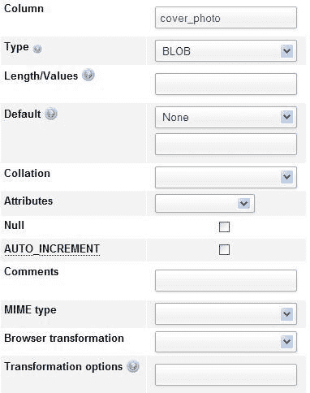
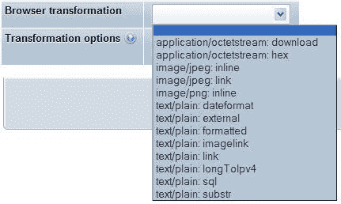
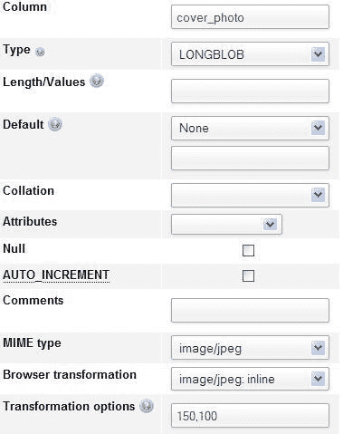
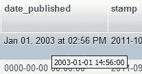
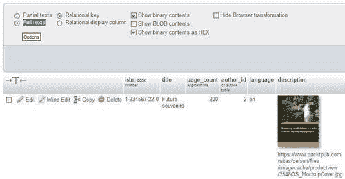

# 第 16 章使用 MIME 转换数据

在本章中，我们将介绍一个强大的 phpMyAdmin 功能，它能够根据称为转换的特定规则在表浏览期间转换列的内容。通常，浏览表时只显示驻留在其中的原始数据。但是，基于 MIME 的转换允许更改显示格式。

请注意，这种转换与永久性数据更改（例如通过 `UPDATE`语句进行的更改）的效果不同。转换后的数据不会写回 MySQL 服务器；它只是为了显示而发送到浏览器。

# 无需转换即可浏览数据

通常显示每行的确切内容，除了：

*   根据 `$cfg['LimitChars']`，根据我们是否选择查看**全文**，可能会截断**文本**和**字符**列
*   **BLOB**和几何相关列可能会被**【BLOB-1.5 KB】**等消息替换

我们将使用术语**单元格**来表示特定行的特定列。包含“未来纪念品”书籍封面照片的单元格（一个**BLOB**列）当前显示为神秘数据，如**‰PNG\r\n\Z\n\0\0\rIHDR\0**或作为说明**BLOB**列大小的消息。在 phpMyAdmin 中直接看到图片的缩略图（如下屏幕截图所示）以及可能的全尺寸图片本身会很有趣。通过适当的转换，这将成为可能。


## 切换显示选项

在**浏览**模式下，**选项**链接显示一个滑块，其中包含一个**隐藏浏览器转换**复选框。只要我们想在查看单元格的真实数据和转换后的数据之间切换，就可以使用它。

# 启用转换

我们将**转换**定义为一种机制，通过该机制，在浏览时使用为该列定义的元数据转换与该列相关的所有单元格。仅转换当前结果页上可见的单元格。

此功能的使用由 `config.inc.php`中的 `$cfg['BrowseMIME']`指令控制。此指令的默认值为 `TRUE`，表示已启用转换。但是，phpMyAdmin 配置存储必须到位（参见[第 1 章](01.html "Chapter 1. Getting Started with phpMyAdmin")，因为转换所需的元数据在官方 MySQL 表结构中不可用。这是专门为 phpMyAdmin 添加的。

### 注

转换逻辑本身用 PHP 脚本编码，存储在 `libraries/transformations`中，并使用插件架构调用。在 phpMyAdmin 主页的文档部分（目前位于[http://www.phpmyadmin.net/home_page/docs.php)](http://www.phpmyadmin.net/home_page/docs.php))中有一个链接，指向希望了解插件内部结构以编写自己转换代码的开发人员的其他信息。

## 配置 MIME 列的设置

如果我们进入 `book`表的**结构**页面的 `Table`视图，点击**封面照片**栏的**更改**链接，我们会看到三个附加属性（前提是启用了转换功能）：

*   **MIME 类型**
*   **浏览器转换**
*   **转换选项**

这显示在以下屏幕截图中：



对于特定列，可以只指示一种类型的转换。这里，列是一个**BLOB**。因此，它可以保存任何类型的数据。为了使 phpMyAdmin 能够正确解释数据并对其采取行动，必须将数据格式和预期结果通知转换系统。因此，我们必须确保上传的数据始终遵循相同的文件格式。

我们将首先了解这些属性的用途，然后在本章后面的*转换示例*部分尝试一些可能性。

### 选择 MIME 类型

MIME 规范（[http://en.wikipedia.org/wiki/MIME 已选择](http://en.wikipedia.org/wiki/MIME)）作为元数据属性，以对列所包含的数据类型进行分类。**多用途互联网邮件扩展（MIME）**最初设计用于扩展邮件，现在也用于描述其他协议的内容类型。在 phpMyAdmin 的上下文中，当前可能的值为：

*   **图像/jpeg**
*   **图像/png**
*   **文本/普通**
*   **应用程序/八进制流**

对于包含任何类型文本（例如，XHTML 或 XML 文本）的列，可以选择**文本/纯**类型。在*转换示例*部分，您将看到需要选择哪种 MIME 类型才能实现特定效果。

### 浏览器转换

这就是我们设置要执行的精确转换的地方。每个 MIME 类型可能支持多个转换。例如，对于**图像/jpeg**MIME 类型，我们有两种可用的转换：**图像/jpeg:inline**用于图像的可点击缩略图，而**图像/jpeg:link**仅显示链接。

以下屏幕截图显示了可用转换的列表：



点击**转换选项**旁边的问号图标，然后点击出现的**转换说明**链接，可以获得更完整的转换说明和可能的选项列表。

### 为转换选项赋值

在*转换示例*部分中，我们将看到一些转换接受选项。例如，我们可以指示生成图像的变换的宽度和高度（以像素为单位）。逗号用于分隔选项列表中的值，有些选项可能需要用引号括起来。

有些选项有一个默认值，我们必须小心遵守记录在案的选项顺序。例如，如果有两个选项，并且我们只想为第二个选项指定一个值，那么我们可以使用空引号作为第一个选项的占位符，以便系统使用其默认值。

## 图像生成要求

正常的缩略图生成需要 web 服务器上存在一些组件，并且需要正确配置 `config.inc.php`中的参数。

### 配置 GD2 库可用性验证

phpMyAdmin 使用一些内部函数来创建缩略图。这些函数需要 GD2 库出现在我们的 PHP 服务器上。

phpMyAdmin 可以检测是否存在正确的 GD2 库，但这种检测需要一些时间。它也不是每次会话都会发生一次，而是几乎每次在 phpMyAdmin 中执行操作时都会发生。

将 `config.inc.php`中的 `$cfg['GD2Available']`参数设置为其默认值`'auto'`表示需要检测库的存在和版本。

如果我们知道 GD2 库是可用的，那么将 `$cfg['GD2Available']`设置为 `yes`将使执行更快。如果 GD2 库不可用，建议您将此参数设置为 `no`。

要了解服务器上有哪个 GD2 库，我们可以转到 phpMyAdmin 的主页并单击**显示 PHP 信息**。如果不存在此链接，我们需要将 `$cfg['ShowPhpInfo']`参数设置为 `true`。然后，我们查找标题为**gd**的部分，并验证识别的版本。在下面的屏幕截图中，一切正常，因为我们可以看到 GD 版本是 2.X，支持 JPEG 和 PNG：


### 断言支持 JPEG 和 PNG 库

如果我们想为这些类型的图像生成缩略图，web 服务器中的 PHP 组件需要支持 JPEG 和 PNG 图像。详情请参考[http://php.net/manual/en/ref.image.php](http://php.net/manual/en/ref.image.php) 。

### 评估内存限制的影响

在某些服务器上， `memory_limit`的 `php.ini`中的默认值为 `8M`，表示 8 MiB。这对于正确的图像处理来说太低了，因为用于生成最终图像的 GD 函数需要工作内存。例如，在一个测试中， `memory_limit`中的 `11M`值需要从 300kib JPEG 图像生成缩略图。此外，如果同时查看多行，则需要更多的工作内存。

# 变换示例

现在我们将讨论几个转换示例。显示了典型的选项值，建议对其进行调整，直到达到所需的结果。根据 phpMyAdmin 版本的不同，可能会提供更多转换。

## 可点击缩略图（JPEG 或 PNG）

我们将首先将我们的**封面照片**栏目类型从**BLOB**更改为**LONGBLOB**，以确保我们可以上传尺寸大于 65 KiB 的照片。然后输入以下屏幕截图中显示的属性：



在这里，选项以宽度和高度的形式显示。如果省略这些选项，默认值是 100 和 100。缩略图生成代码保留图像的原始纵横比。因此，输入的值是生成图像的最大宽度和高度。然后我们将一个 `.jpeg`文件上传到一个单元格中（使用[第 5 章](05.html "Chapter 5. Changing Data and Structure")中的说明）。因此，我们在**浏览**模式下获得该表的以下屏幕：


单击此缩略图可显示全尺寸照片。

### 注

缩略图不会存储在任何地方，而是在我们每次进入**浏览**模式时为这组行生成的。在双 Xeon 3.2 GHz 服务器上，通常每秒生成 6 幅 JPEG 图像。phpMyAdmin 不提供这些缩略图的缓存。

对于`.png`文件，我们必须在**MIME 类型**对话框中使用**img/png**，在**浏览转换**对话框中使用**img/png:inline**。

## 向图像添加链接

为了提供没有缩略图的链接，我们使用了**img/jpeg:link**转换。没有转换选项。此链接可用于查看照片（通过左键单击链接），然后可能会下载照片（通过右键单击照片本身）。


## 日期格式

在我们的 `book`表中有一个名为**date_**的列；让我们将其类型更改为**日期时间**。然后，我们将其 MIME 类型设置为**text/plain**，并将浏览器转换为**text/plain:dateformat**。下一步是编辑“未来纪念品”书籍的行，在**出版日期**栏中输入**2003-01-01 14:56:00**。当我们浏览表时，我们现在看到列已经格式化。将鼠标悬停在其上会显示未格式化的原始内容，如以下屏幕截图所示：



此转换接受两个选项。第一个是将添加到原始值的小时数（默认为零）。如果我们存储基于**协调世界时（UTC）**的所有时间值，但希望显示特定区域的时间值（例如 UTC+5），则添加小时数非常有用。第二个选项是我们想要使用的时间格式，使用任何 PHP `strftime`参数指定（更多详细信息参见[http://php.net/strftime](http://php.net/strftime) ）。因此，如果我们在**转换选项**中加入**‘0’、‘年份：%Y’**，我们将得到以下输出：


## 来自文本的链接

假设我们在 `book`表的**描述**列中放置了一个完整的 URL—`http://domain.com/abc.pdf` 。浏览表格时将显示链接文本，但我们无法单击它。现在我们将看到在这种情况下使用**text/plain**MIME 类型。

### 文本/普通：链接

如果我们在刚才提到的场景中使用**text/plain**MIME 类型和**text/plain:link**浏览器转换，我们仍然会看到链接的文本，并且可以单击。


如果我们想要指向的所有文档都位于一个公共 URL 前缀处，我们可以将此前缀（例如，[）http://domain.com/](http://domain.com/) ）在第一个转换选项中，在引号内。然后，我们只需要在每个单元格中放置 URL`(abc.pdf)`的最后一部分。

第二个转换选项可用于设置标题。这将在**浏览**模式下显示，而不是 URL 内容，但单击会将我们带到预期的 URL。

如果只使用第二个转换选项，则必须使用引号作为第一个选项的值。可以按`'','this is the title'`进行。

### 文本/普通：图像链接

**text/plain:imagelink**转换与前一个类似，只是在单元格中，我们放置了一个指向图像的 URL。此图像将被提取并与链接文本一起显示在单元格中。该映像可以位于 web 上的任何位置，包括我们的本地服务器。

在这里，我们有以下三种选择：

*   通用 URL 前缀（如 `text/plain: link)`的前缀）
*   图像的宽度（以像素为单位）（默认值：100）
*   高度（默认值：50）

对于我们的测试 URL，您应该输入以下选项：

```php
'','100','123'

```

如果链接的文本太长，则不会发生转换。默认情况下，选择**部分文本**显示选项。


在这种情况下，我们可以切换到**全文**来显示完整的链接。然后我们可以看到完整的图像。



其他转换，如 `img/jpeg: inline`和 `img/png: inline`指定图像的确切 MIME 类型。在这些情况下，phpMyAdmin 使用 GD2 库函数生成缩略图。然而， `text/plain: imagelink`转换中包含的链接可能引用任何浏览器支持的图像类型。因此，phpMyAdmin 只显示一个调整大小的图像，其中包含一个 HTML `img`标记，以及根据转换中定义的大小选项设置的 `width`和 `height`属性。要查看原始图像，我们可以单击链接或缩略图。

## 保留原始格式

通常，在显示文本时，phpMyAdmin 会转义特殊字符。例如，如果我们在一本书的**描述**栏中输入**这本书是<b>好</b>**，我们在浏览表格时通常会看到**这本书是<b>好</b>**。但是，如果我们对本专栏使用转换**text/plain:formatted**，我们在浏览时会得到以下输出：


在本例中，结果是正确的。但是，在列中输入的其他 HTML 标记可能会产生令人惊讶的结果（包括无效的 HTML 页面）。例如，由于 phpMyAdmin 使用 HTML 表显示结果，列中的非转义`</table>`标记将破坏输出。

## 显示部分文本

`text/plain: substr`转换仅用于显示文本的一部分。以下是选项：

*   文本中的起始位置（默认值：0）
*   多少个字符（默认值：所有剩余文本）
*   显示为后缀的内容，以显示已发生截断；默认设置是显示省略号（…）

记住， `$cfg['LimitChars']`对每个非数字列执行字符截断。因此， `text/plain: substr`是一种逐列微调此列的机制。

## 显示下载链接

假设我们想在 MySQL 中存储一个关于每本书的小音频评论。我们在 `book`表中添加了一个新列，名称为**audio_contents**，类型为**MEDIUMBLOB**。我们将其**MIME 类型**设置为**应用程序/octetstream**并选择**应用程序/octetstream:下载**转换。在**转换选项**中，我们插入**‘comment.wav’**。

此 MIME 类型和扩展将通知我们的浏览器有关传入的数据，并且浏览器应打开相应的播放器。要插入注释，我们首先以 `.wav`格式记录它，然后将文件内容上传到其中一本书的**音频内容**列中。浏览我们的表格时，我们可以看到音频评论的链接**comment.wav**：


## 十六进制表示法

字符作为数字数据存储在 MySQL 中（通常在计算机中），并转换为对屏幕或打印机有意义的内容。用户有时会将另一个应用程序中的数据剪切并粘贴到 phpMyAdmin，如果 MySQL 不直接支持字符，则会导致意外结果。phpMyAdmin 帮助论坛中报告的一个案例涉及在 Microsoft Word 文档中输入特殊引号并粘贴到 phpMyAdmin。它有助于看到精确的十六进制代码，这可以通过使用 `application/octetstream: hex`转换来实现。

在下面的示例中，此转换将应用于我们的 `book`表的**title**列。当浏览包含**未来纪念品**标题的行时，我们可以看到以下屏幕：


由于我们知道此列使用哪个字符集编码，因此可以将其内容与描述每个字符的图表进行比较。例如，[http://en.wikipedia.org/wiki/Latin1](http://en.wikipedia.org/wiki/Latin1) 描述拉丁 1 字符集。

## SQL 打印

术语**漂亮印刷**（[http://en.wikipedia.org/wiki/Pretty_printing](http://en.wikipedia.org/wiki/Pretty_printing) 是指一种“美化”源代码的方式（在我们的例子中是 SQL 语句）。在 phpMyAdmin 配置存储中， `pma_bookmark.query`和 `pma_history.sqlquery`列包含 SQL 语句。通过为这些列定义的 `text/plain: sql`转换，这些 SQL 语句将以彩色显示，并在浏览表时突出显示语法。

## IP 地址

IP（v4）地址可以编码成长整数（例如，通过 PHP `iptolong()`函数），并存储到 MySQL `UNSIGNED INT`列中。要将其转换回熟悉的虚线字符串（例如， `127.0.0.1)`，您可以使用 `text/plain: longToIpv4`转换。

## 通过外部应用程序转换数据

前面描述的转换直接在 phpMyAdmin 中实现。但是，通过现有的外部应用程序可以更好地执行某些转换。

`text/plain: external`转换使我们能够将一个单元的数据发送到另一个将在 web 服务器上启动的应用程序，捕获该应用程序的输出，并在单元的位置显示该输出。

### 注

此功能仅在 Linux 或 UNIX 服务器上受支持（在 Microsoft Windows 下，PHP 进程无法轻松捕获输出和错误重定向）。此外，PHP 不应该在安全模式下运行。因此，该功能在托管服务器上可能不可用。

出于安全原因，无法从 phpMyAdmin 中将应用程序的确切路径和名称设置为转换选项。应用程序名称直接在其中一个 phpMyAdmin 脚本中设置。

首先，在 phpMyAdmin 安装目录中，我们编辑 `libraries/transformations/`中的 `text_plain__external.inc.php`文件，找到以下部分：

```php
$allowed_programs = array();
//$allowed_programs[0] = '/usr/local/bin/tidy';
//$allowed_programs[1] = '/usr/local/bin/validate';

```

默认情况下没有配置外部应用程序，我们必须显式地添加自己的应用程序。

### 注

转换脚本的名称是使用以下格式构造的：MIME 类型、双下划线，然后是指示应进行哪个转换的部分。

允许的每个程序及其完整路径必须在这里用从 0 开始的索引号进行描述。然后我们保存对该脚本的修改，并在需要时将其放回服务器。其余的设置是从面板中完成的，我们在该面板中选择其他浏览器转换的选项。

当然，我们现在将在转换菜单中选择**text/plain:external**。

作为第一个选项，我们放置应用程序编号（例如，0 表示 tidy 应用程序）。第二个选项保存我们需要传递给这个应用程序的参数。如果我们希望 phpMyAdmin 对结果应用 `htmlspecialchars()`函数，我们将**1**作为第三个参数，这是默认值。我们可以在那里放置一个**0**，以避免使用 `htmlspecialchars()`保护输出。

如果我们想避免重新格式化细胞株，我们将**1**作为第四个参数。这将使用 `NOWRAP`修饰符，默认情况下完成。

### 外部应用示例：单元内排序

此示例显示如何对单个单元格的文本内容进行排序。我们首先修改 `text_plain__external.inc.php`脚本，如前一节所述，添加 `sort`程序：

```php
$allowed_programs[0] = '/bin/sort';

```

请注意，我们的新程序带有索引号 `0`。

然后我们在 `book`表中添加一个名为**关键字**的**文本**列。最后填写 MIME 相关信息，输入**‘0’、‘r’**作为转换选项，如下图所示：


这里的**‘0’**是指 `sort`的索引号，**'-r’**是 `sort`的参数，使得程序按相反的顺序排序。

接下来，我们编辑《百年电影（第一卷）》一书的行，输入一些没有特定顺序的关键字（如以下截图所示），点击**Go**以保存更改：


为了测试外部程序的效果，我们浏览表格并查看已排序的单元格内关键字：


请注意，关键字以相反的顺序显示。

# 总结

在本章中，我们学习了如何通过使用各种方法转换数据来改善浏览体验。特别是，我们看到了如何显示来自 `.jpeg`和 `.png`和**BLOB**列的缩略图和全尺寸图像的概览，如何生成链接，格式化日期，仅显示部分文本，以及如何执行外部程序来重新格式化单元格内容。

下一章将介绍 phpMyAdmin 对 5.0 和 5.1 版中新增的 MySQL 功能的支持。