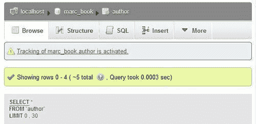
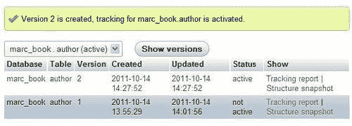

# 第 18 章跟踪变更

本章将研究如何使用变更跟踪机制，以记录从 phpMyAdmin 接口完成的结构和数据变更，并获取有关此类变更的报告。

# 了解跟踪系统的目标

每个软件应用程序都有自己的想法，即哪些更改对其用户来说很重要。本节介绍其他应用程序中存在的跟踪系统，并将其与 phpMyAdmin 提供的系统进行比较。

## 其他软件应用中的跟踪

在许多软件产品中，访问显示对信息系统所做的所有更改的历史数据是一项理所当然的功能。任何严肃的文字处理软件的“撤销”功能都是能够回到时间的一个例子，尽管一次只执行一步。更复杂的例子是 MediaWiki（维基百科的核心软件）的历史功能。它使我们能够返回到给定页面的任何状态，查看任意两个版本之间的更改，甚至将任何旧版本标记为当前版本。跟踪信息包括作者（或 IP 地址）、更改日期和时间以及注释。

在 MySQL 本身中，日志系统`(binlog)`记录对数据库所做的所有更改；然而，在这种情况下，目标有两个：

*   允许主从同步
*   通过 `mysqlbinlog`命令行实用程序启用恢复

## phpMyAdmin 中的跟踪

phpMyAdmin 的跟踪系统允许用户指定要跟踪的表，因此可以称之为**选择加入系统**。默认情况下，除非开发人员选择跟踪，否则不会跟踪任何表；当开发人员激活表跟踪时，即使由其他人执行更改，也会开始记录更改。仅记录通过 phpMyAdmin 进行的更改。

此外，对于给定的表，我们可以指出我们对跟踪哪些语句感兴趣。语句列表分为两组：数据定义和数据操作。

假设一个团队正在进行一个项目，该项目涉及对表的结构进行更改。通过激活跟踪，并假设每个开发人员都使用自己的帐户登录 MySQL，我们现在可以访问历史数据，包括关于哪个开发人员删除了一些关键列的信息！当然，这种跟踪不是防篡改的；毕竟，它存储在 MySQL 表中，因此跟踪信息的安全性取决于谁有权访问跟踪表。

# 先决条件

phpMyAdmin 配置存储保存跟踪机制的所有元数据。如果我们不久前已经实现了这个存储（对于以前的 phpMyAdmin 版本，如 3.1 或更高版本），我们可以使用当前 phpMyAdmin 版本中的 `scripts/create_tables.sql`来升级配置存储，并使用缺少的表（在我们的例子中是 `pma_tracking`表）。这样做的原因是脚本使用 `CREATE TABLE IF NOT EXISTS `pma_tracking``语句谨慎地创建了这个表，从而确保在表已经存在的情况下不会创建它。

### 注

在 phpMyAdmin 3.3.3 中， `pma_tracking`中 `data_sql`列的类型在 `create_tables.sql`脚本中从 `TEXT`更改为 `LONGTEXT`。因此，如果我们在版本 3.3.3 之前运行此脚本，则在我们自己的 `pma_tracking`表中手动进行此更改非常重要。

## 配置基本跟踪机制

在 `config.inc.php`中，对于特定 MySQL 服务器的配置， `$cfg['Servers'][$i]['tracking']`应该包含跟踪表的名称；建议名称为 `pma_tracking`以匹配 `scripts/create_tables.sql`中的默认值。

### 注

如果此指令为空，则此服务器上不可能进行跟踪（我们不会看到任何**跟踪**菜单）。

默认情况下，每个表都必须激活跟踪。如果我们希望所有未来的表和视图自动打开跟踪机制， `$cfg['Servers'][$i]['tracking_version_auto_create']`可以设置为 `TRUE`。请注意，这仅适用于将来的表和视图，我们仍然需要激活对现有表的跟踪。

使用自动创建的优点是我们不必考虑它；跟踪是从表的诞生开始进行的。这样做的一个不方便的副作用是，我们无法选择要跟踪的语句；这些将从默认列表中获取（请参阅本章后面的*选择要跟踪的语句*部分）。

其他配置指令将在与其相关的部分中讨论。

# 原则

本节定义了跟踪机制所基于的重要原则：版本控制、快照和跟踪信息的归档问题。

## 版本控制

使用版本号是我们熟悉的事情；例如，本书介绍了 phpMyAdmin 版本 3.4.x。然而，在这一点上，我们必须确切地理解为什么我们使用版本号。

关于软件版本控制的一个很好的参考资料位于维基百科的[http://en.wikipedia.org/wiki/Software_versioning](http://en.wikipedia.org/wiki/Software_versioning) 。本文提到可以使用版本名，但版本号更常见。更重要的是，它指出版本号“与软件的新开发相对应”。

如果我们将这一原则应用到数据库开发中，那么当一个表即将发生重大更改时，开发团队就应该决定该表是否适合新版本。为了触发新版本，更改的重要性取决于团队内部的解释。这些决定中至少有一个是容易做出的：版本 1 总是表示我们第一次打开特定表的跟踪的时刻。

在跟踪数据操作语句的情况下，我们还应该注意，更改可能与数据本身有关，而不一定与结构有关。

### 注

phpMyAdmin 的跟踪系统只使用正整数作为版本号；不可能像“1.1”中那样使用小数点。

## 拍摄当前结构的快照

每次创建新版本时，跟踪系统都会对表的当前结构和索引进行快照，并在跟踪系统中创建一个新条目。此条目中存储了数据库名称、表名、版本号、创建日期和完整的结构信息。

### 注

此跟踪快照不包含表的数据！因此，跟踪系统不会取代备份系统。

在快照拍摄后的该表的生命周期内，所有跟踪语句都存储在此快照旁边。因此，在新版本启动之前，表跟踪版本除了快照之外，还包括在拍摄此快照之后所做的所有更改。

## 了解归档问题

当一个表被丢弃时，它的跟踪信息仍然存在，除非我们决定抑制它。这将在后面的*删除跟踪信息*部分讨论。

# 启动一张表的跟踪

在本节中，我们将使用 `Table`视图中的**跟踪**菜单开始收集 `author`表发生的更改。所以我们打开 `author`表，然后点击**跟踪**，产生如下画面：


这个面板告诉我们即将创建表的版本 1；这是我们所期望的。我们可以选择数据定义和数据操作语句；现在，我们将保留所有标记，并单击**创建版本**按钮。下一节将解释如何指定要在上面显示的面板中显示的语句。

创建版本 1 后，将显示以下确认面板：


我们注意到发生了两种截然不同的行为：

*   版本 1 本身的创建
*   激活此表的跟踪

实际上，一个表可能存在一个或多个版本，每个版本都包含某个时间点的快照以及自该快照以来的更改；但这与表的跟踪处于活动状态并且正在记录更改这一事实无关。

在这个面板中，我们看到将在*选择要跟踪的语句*和*停用和激活跟踪*部分中涵盖的子面板。

## 选择要跟踪的报表

`$cfg['Servers'][$i]['tracking_default_statements']`包含由逗号分隔的语句组成的字符串。这些是我们可以在小组中选择要跟踪哪些陈述的部分。语句的默认列表定义如下：；请注意，PHP 中存在允许串接字符串的点字符：

```php
$cfg['Servers'][$i]['tracking_default_statements'] =
'CREATE TABLE,ALTER TABLE,DROP TABLE,RENAME TABLE,' .
'CREATE INDEX,DROP INDEX,' .
'INSERT,UPDATE,DELETE,TRUNCATE,REPLACE,' .
'CREATE VIEW,ALTER VIEW,DROP VIEW,' .
'CREATE DATABASE,ALTER DATABASE,DROP DATABASE';

```

# 跟踪机构测试

我们现在准备验证这个跟踪系统是否真的有效！由于系统应该跟踪 `ALTER TABLE`语句，因此我们将对结构进行轻微更改，看看会发生什么。我们进入表**作者**的**结构**面板，选择**名称**列，将其大小从**30**增加到**40**个字符（具体步骤请参见[第 5 章](05.html "Chapter 5. Changing Data and Structure")）。

我们收到一条消息，如以下屏幕截图所示：


我们将执行另一个操作，这次与数据本身有关，将作者**约翰·史密斯**的电话号码更改为**111-2222**。

为了确保跟踪系统记录这些行动，让我们编写一份报告。

## 跟踪报告

返回**跟踪**面板**作者**仍在 `Table`视图中，点击**跟踪报告**版本 1，生成如下截图所示的报告：


事实上，报告的前缀是主跟踪信息；我们可以点击**关闭**，回到之前的状态。

我们可以看到，在**跟踪报告**标题下，显示了被跟踪的语句列表。然后，我们有一个选择器来确定是否希望在报告中看到与以下内容对应的语句：

*   **结构及数据**
*   **仅限结构**
*   **仅数据**

我们还可以指定要生成报告的日期和时间范围。还可以指示我们要报告的用户（星号表示所有用户）。

报告的主要部分包括声明本身；这里我们看到四种说法。第一条语句是一条 `DROP TABLE`语句，如果我们需要导出此版本并将其导入回，它将有助于重新创建此表。第二条语句 `(CREATE TABLE)`包含启动版本 1 时拍摄的快照。然后我们看到与我们作为测试执行的操作相对应的 `ALTER TABLE`和 `UPDATE`语句。

如何导出结构将在本章后面的*导出版本*一节中介绍。

# 确定跟踪状态

让我们讨论一下界面中可以确定表的跟踪活动的所有位置。首先，在 `Table`视图中，我们可以看到位于菜单选项卡下的消息，说明此表的跟踪已激活，如以下屏幕截图所示：



在**跟踪**面板本身的**状态**栏告诉我们，对于最新版本，跟踪是**激活**还是**未激活**。事实上，当我们为表创建另一个版本时，我们将看到只有当前版本可以具有活动跟踪状态，因为以前的版本现在只包含历史数据。


在 `Database`视图中，系统跟踪的每个表格（处于活动或非活动状态）都会显示一个眼睛图标，根据其状态，该图标为彩色或灰色。在以下示例中，眼睛是彩色的：


该眼睛图标可点击，并将我们带到该特定表格的**跟踪**面板。

最后，在 `Database`视图中，**跟踪**菜单为我们提供了所有表的概览。首先显示跟踪的表，然后显示未跟踪的表。对于任一类别，我们都有链接可查看更多信息或开始跟踪：


对于跟踪表，下表给出了所提供信息的明细以及可用链接：

<colgroup><col style="text-align: left"> <col style="text-align: left"></colgroup> 
| 

标题或链接

 | 

描述

 |
| --- | --- |
| **数据库** | 表位于哪个数据库中 |
| **表** | 跟踪哪个表 |
| **最新版本** | 最新跟踪版本；看看这个表有多少版本是很有趣的 |
| **创建** | 这个版本是什么时候创建的 |
| **更新** | 为该表存储的最后一条跟踪语句是什么时候 |
| **状态** | 活跃还是不活跃 |
| **动作** | **Drop**链接可用于删除所有跟踪（参见本章后面的*删除跟踪信息*部分） |
| **展示****版本** | 进入该表的 `Table`视图，并显示跟踪版本 |
| **显示****跟踪报告** | 进入该表的 `Table`视图，并显示跟踪报告 |
| **展示****结构快照** | 进入该表的 `Table`视图，显示结构快照（参见本章后面的*结构快照*部分） |

对于未跟踪的表，**跟踪表**链接允许我们直接在**跟踪**面板中输入该表的 `Table`视图，从而创建版本 1 以启动跟踪机制。

## 停用和激活跟踪

从特定表的**跟踪**页面，如果我们希望停止（临时或永久）进一步存储跟踪语句，可以使用**立即停用**按钮（作为切换，并更改为**立即激活）**。存储的过去语句在与当前版本相关的跟踪数据中保持不变。

# 结构快照

在 `Table`视图的**跟踪**面板中，**结构快照**链接显示创建此版本时表的过去状态。面板以熟悉的 phpMyAdmin**结构**面板格式显示存储的 SQL 代码和可视化表示。


# 导出版本

由于为特定版本创建时的完整 SQL 代码已与自那时起发生的所有跟踪语句一起存储，因此我们可能希望以可执行形式重用它们。在**跟踪报告**面板的底部，有一个**导出为**对话框，提供三个导出变量。如果我们选择**SQL 转储（文件下载）**菜单选项，那么为该版本存储的所有语句都会传输到一个文件中，我们可以保存到工作站。对于 `author`表，这将生成一个包含以下行的文件：

```php
# Tracking report for table `author`
# 2011-10-14 14:24:12
DROP TABLE IF EXISTS `author`;
CREATE TABLE `author` (
`id` int(11) NOT NULL,
`name` varchar(30) NOT NULL,
`phone` varchar(30) CHARACTER SET latin1 DEFAULT NULL,
`country_code` char(2) NOT NULL,
`total_page_count` int(11) NOT NULL,
PRIMARY KEY (`id`)
) ENGINE=InnoDB DEFAULT CHARSET=utf8;
ALTER TABLE `author` CHANGE `name` `name` VARCHAR(40) CHARACTER SET utf8 COLLATE utf8_general_ci NOT NULL;
UPDATE `author` SET `phone` = '111-2222' WHERE `author`.`id` = 1;

```

相反，如果我们选择**SQL 转储**选项，则语句将显示在屏幕上的文本区域中；从这一点上，我们可以剪切并粘贴 SQL 代码，或者点击**Go**运行它。作为预防措施，在代码顶部生成额外语句；它们处理另一个数据库的创建，将在其中创建表。当然，用户必须拥有创建此数据库的权限。

最后，**SQL 执行**选项允许直接执行当前数据库中存储的语句。但是，会发出警告消息，因为这些语句可能反映表的旧状态；我们可能不想回到这个旧状态。此外，默认情况下，第一个语句是一个 `DROP TABLE`，它可能成功，也可能不成功，这取决于是否有外键约束阻止了表的删除。

# 创建新版本

如前所述，我们可以决定为某个表标记一个新的里程碑；换句话说，我们可以开始一个新版本。现在我们将创建一个新版本作为练习。

在 `author`表的**跟踪**面板中，我们看到了创建**版本 2**的对话框（目前最高的是版本 1）：


我们注意到每个版本都可以跟踪自己的语句集；在这个问题上，版本是相互独立的。在这里，我们决定版本 2 只跟踪数据定义语句。我们现在看到了一些与这些版本的状态相关的有趣内容，如以下屏幕截图所示：



事实上，版本 1 被自动标记为**未激活**；它进入了某种历史地位。我们还可以看看版本 2 的快照，它反映了**名称**列是一个**VARCHAR（40）**。

## 快速获取跟踪信息

当我们在一个表的**跟踪**面板中时，一个快捷对话框允许我们直接进入任何其他被跟踪表的**跟踪**面板。

为了探索这个特性，现在让我们创建 `book`表的版本 1。完成后，我们查看**显示版本**按钮旁边的下拉列表，如下图所示：


此列表与我们在查看**跟踪表**部分时在**跟踪**面板中看到的数据库 `marc_book`类似，但无需返回此面板。

# 删除跟踪信息

跟踪系统的一个可能不明显的特征是，当删除相应的表时，表的所有版本的跟踪信息以及整个生命周期的跟踪信息仍然保留。原因是为了在以后创建同名表时保持历史记录信息的完整性。

让我们复制一份 `author`表（如果需要，请参阅[第 9 章](09.html "Chapter 9. Performing Table and Database Operations")，并将其命名为 `author_copy`。然后，我们在这个新表上激活跟踪。最后一个操作是放下这个 `author_copy`表。即使我们不再在正常的表列表中看到它，它在数据库 `marc_book`的**跟踪**面板中也是不同的。


此时，我们可以返回时间，并查看此已删除表版本的跟踪报告和快照。如果我们真的想删除该表曾经存在过的所有证据，那么我们也可以使用**Drop**链接销毁跟踪数据（在随后的确认面板中点击**OK**之后）。

# 总结

在本章中，我们概述了报表跟踪功能带来的好处，然后介绍了创建和维护表版本所涉及的所有面板。

下一章将介绍 MySQL 服务器的管理，重点介绍用户帐户和权限的管理。