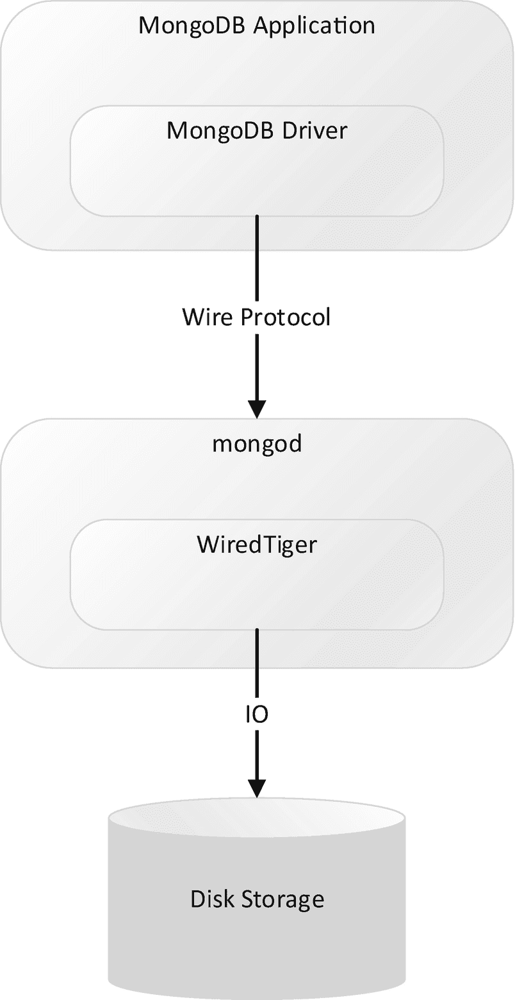

# 2.MongoDB 架构和概念

本章旨在让您了解 MongoDB 架构和后续章节中提到的内部机制，这对于 MongoDB 性能调优是必要的。

MongoDB 调优专家应该对 MongoDB 技术的以下主要领域非常熟悉:

*   MongoDB 文档模型

*   MongoDB 应用通过 MongoDB API 与 MongoDB 数据库服务器交互的方式

*   MongoDB *优化器*，它是与最大化 MongoDB 请求性能相关的软件层

*   MongoDB 服务器架构，包括内存、进程和文件，它们相互作用以提供数据库服务

对这份材料非常熟悉的读者可能希望略读或跳过这一章。然而，我们将在后续章节中假设您熟悉这里介绍的核心概念。

## MongoDB 文档模型

正如您所知，MongoDB 是一个*文档数据库*。文档数据库是一系列非关系数据库，它们将数据存储为结构化文档——通常是以 *JavaScript 对象符号* ( *JSON* )格式。

像 MongoDB 这样基于 JSON 的文档数据库在过去的十年里蓬勃发展，原因有很多。特别是，它们解决了长期困扰软件开发者的面向对象编程和关系数据库模型之间的冲突。灵活的文档模式模型支持敏捷开发和 DevOps 范例，并与主流编程模型紧密结合——尤其是那些基于 web 的现代应用。

### 数据

MongoDB 使用一种不同的 JavaScript 对象符号 (JSON)作为它的数据模型和通信协议。JSON 文档是由一小组基本构造组成的——*值*、*对象*和*数组*:

*   **数组**由用方括号(“[”和“]”)括起来并用逗号(“，”)分隔的值列表组成。

*   **对象**由一个或多个名称-值对组成，格式为“name-value”，用大括号(“{”和:}”)括起来，用逗号(“，”)分隔。

*   **值**可以是 Unicode 字符串、标准格式数字(可能包括科学记数法)、布尔值、数组或对象。

前面定义中的最后几个词很关键。因为值可能包含对象或数组，而对象或数组本身又包含值，所以 JSON 结构可以表示任意复杂的嵌套信息集。特别是，数组可以用来表示重复的文档组，这在关系数据库中需要单独的表。

### 二进制 JSON (BSON)

MongoDB 在内部以*二进制 JSON* ( *BSON* )格式存储 JSON 文档。BSON 旨在成为 JSON 数据的一种更紧凑、更高效的表示，并对数字和其他数据类型使用更高效的编码。例如，BSON 包括字段长度前缀，允许扫描操作“跳过”元素，从而提高效率。

BSON 还提供了许多 JSON 不支持的额外数据类型。例如，JSON 中的数值在 BSON 可以是 Double、Int、Long 或 Decimal128。ObjectID、Date 和 BinaryData 等其他类型也很常用。然而，大多数时候，JSON 和 BSON 之间的差异并不重要。

### 收集

MongoDB 允许您将“相似的”文档组织到*集合*中。集合类似于关系数据库中的表。通常，您将只存储特定集合中具有相似结构或目的的文档，尽管默认情况下集合中文档的结构是不强制的。

图 [2-1](#Fig1) 展示了 JSON 文档的内部结构，以及文档是如何组织成集合的。


图 2-1

JSON 文档结构

### 蒙戈布图式

MongoDB 文档模型允许将需要关系数据库中许多表的对象存储在单个文档中。

考虑下面的 MongoDB 文档:

```js
{
  _id: 1,
  name: 'Ron Swanson',
  address: 'Really not your concern',
  dob: ISODate('1971-04-15T01:03:48Z'),
  orders: [
    {
      orderDate: ISODate('2015-02-15T09:05:00Z'),
      items: [
        { productName: 'Meat damper', quantity: 999 },
        { productName: 'Meat sauce', quantity: 9 }
      ]
    },
    { otherorders  }
  ]
};

```

与前面的示例一样，一个文档可能包含另一个子文档，而该子文档本身可能包含一个子文档，依此类推。有两个限制将最终停止该文档嵌套:100 层嵌套的默认限制和单个文档(包括其所有子文档)的 16MB 大小限制。

在数据库术语中，*模式*定义了数据库对象中的数据结构。默认情况下，MongoDB 数据库不强制模式，所以您可以在集合中存储任何您喜欢的内容。但是，可以使用`createCollection`方法的`validator`选项创建一个模式来实施文档结构，如下例所示:

```js
db.createCollection("customers", {
  "validator": {
      "$jsonSchema": {
          "bsonType": "object",
          "additionalProperties": false,
          "properties": {
              "_id": {
                  "bsonType": "objectId"
              },
              "name": {
                  "bsonType": "string"
              },
              "address": {
                  "bsonType": "string"
              },
              "dob": {
                  "bsonType": "date"
              },
              "orders": {
                  "bsonType": "array",
                  "uniqueItems": false,
                  "items": {
                      "bsonType": "object",
                      "properties":  {
                            "orderDate": { "bsonType": "date"},
                            "items": {
                                "bsonType": "array",
                                "uniqueItems": false,
                                "items": {
                                    "bsonType": "object",
                                    "properties": {
                                        "productName": {
                                            "bsonType": "string"
                                        },
                                        "quantity": {
                                            "bsonType": "int"
                                        }
                                    }
                                }
                            }
                      }

                  }
              }
          }
      }
  },
  "validationLevel": "strict",
  "validationAction": "warn"
});

```

验证器采用的是 *JSON 模式*格式——这是一种开放标准，允许对 JSON 文档进行注释或验证。如果 MongoDB 命令导致文档与模式定义不匹配，JSON 模式文档将生成警告或错误。JSON 模式可用于定义强制属性、限制其他属性，以及定义文档属性可以采用的数据类型或数据范围。

## MongoDB 协议

MongoDB 协议定义了客户机和服务器之间的通信机制。尽管协议的细节超出了我们的性能调优工作的范围，但是理解协议是很重要的，因为许多诊断工具将以 MongoDB 协议格式显示数据。

### 有线协议

MongoDB 的协议也被称为 MongoDB *有线协议*。这是发送到 MongoDB 服务器和从 MongoDB 服务器接收的 MongoDB 包的结构。有线协议通过 TCP/IP 连接运行，默认情况下通过端口 27017 运行。

wire 协议的实际包结构超出了我们的范围，但是每个包的本质都是一个包含请求或响应的 JSON 文档。例如，如果我们从 shell 向 MongoDB 发送如下命令:

```js
db.customers.find({FirstName:'MARY'},{Phone:1}).sort({Phone:1})

```

然后，shell 将通过有线协议发送一个请求，如下所示:

```js
{ "find" : "customers",
  "filter" : { "FirstName" : "MARY" },
  "sort" : { "Phone" : 1.0 },
  "projection" : { "Phone" : 1.0},
  "$db" : "mongoTuningBook",
  "$clusterTime" : { "clusterTime" : {
        "$timestamp" : { "t" : 1589596899, "i" : 1 } },
   "signature" : { "hash" : { "$binary" : { "base64" : ]
                "4RGjzZI5khOmM9BBWLz6y9xLZ9w=", "subType" : "00" } },
    "keyId" : 6826926447718825986 } },
    "lsid" : { "id" : { "$binary" : { "base64" :
    "JI3lUrOMRQm0Y6Pr3iQ8EQ==", "subType" : "04" } } } }

```

### MongoDB 驱动程序

MongoDB 驱动程序将来自编程语言的请求翻译成有线协议格式。每个驱动程序都有细微的语法差异。例如，在 NodeJS 中，前面的 MongoDB shell 请求略有不同:

```js
    const docs = await db.collection('customers').
            find({'FirstName': 'MARY'},
                 {'Phone': 1}).
            sort({Phone: 1}).toArray();

```

因为 NodeJS 是一个 JavaScript 平台，所以语法仍然类似于 MongoDB shell。但是在其他语言中，这种差异会更加明显。例如，下面是 Go 语言中的相同查询:

```js
      collection := client.Database("MongoDBTuningBook").
                  Collection("customers")
      filter := bson.D{{"FirstName", "MARY"}}
      findOptions := options.Find()
      findOptions.SetSort(map[string]int{"Phone": 1})
      findOptions.SetProjection(map[string]int{"Phone": 1})
      cursor, err := collection.Find(ctx, filter, findOptions)
      var results []bson.M
      cursor.All(ctx, &results)

```

然而，不管 MongoDB 驱动程序需要什么语法，MongoDB 服务器总是接收标准有线协议格式的数据包。

## MongoDB 命令

从逻辑上讲，MongoDB 命令分为以下几类:

*   **查询命令**，如`find()`和`aggregate()`，从数据库返回信息

*   **数据操作命令**，如`insert()`、`update()`、`delete()`，修改数据库内的数据

*   **数据定义命令**，如`createCollection()`、`createIndex()`，定义数据库中数据的结构

*   **管理命令**，如`createUser()`、`setParameter()`，控制数据库的操作

数据库性能管理主要关注查询和数据操作语句的开销和吞吐量。然而，管理和数据定义命令包括一些我们用来解决性能问题的“专业工具”(见第 [3](03.html) 章)。

### 查找命令

find 命令是 MongoDB 数据访问的主力。它有一个快速和简单的语法，并具有灵活和强大的过滤能力。`find`()命令具有以下高级语法:

```js
db.collection.find(
      {filter},
      {projection})
  sort({sortCondition}),
  skip(skipCount),
  limit(limitCount)

```

前面的语法是针对 Mongo shell 显示的；特定语言驱动程序的语法可能略有不同。

`find()`命令的关键参数如下:

*   **Filter** 是一个 JSON 文档，定义了要返回的文档。

*   **Projection** 定义了将被返回的每个文档的属性。

*   **排序**定义单据返回的顺序。

*   **跳过**允许跳过输出中的一些初始文档。

*   **限制**限制要返回的文档总数。

在 wire 协议中，`find`()命令只返回第一批文档(通常是 1000 个)，随后的几批由`getMore`命令获取。MongoDB 驱动程序通常代表您处理`getMore`处理语句，但是在许多情况下，您可以改变批处理大小来优化性能(参见第 [6 章](06.html))。

### 聚合命令

`find()`可以执行各种各样的查询，但是它缺乏关系数据库的 SQL 命令的许多功能。例如，`find()`操作不能连接来自多个集合的数据，也不能聚合数据。当你需要比`find()`更多的功能时，一般会求助于`aggregate()`。

概括地说，aggregate 的语法看似简单:

```js
db.collection.aggregate([pipeline]);

```

其中`pipeline`是集合命令的指令数组。Aggregate 支持二十多个管道操作符，大多数都超出了本书的范围。但是，最常用的运算符是

*   **$match** ，它使用类似于`find()`命令的语法过滤管道中的文档

*   **$group** ，它将多个文档聚合到一个更小的集合中

*   **$sort** ，对管道内的文档进行排序

*   **$project** ，定义每个文档返回的属性

*   **$unwind** ，为数组中的每个元素返回一个文档

*   **$limit** ，限制要返回的文档数量

*   **$lookup** ，它连接另一个集合中的文档

下面是一个 aggregate 示例，它使用大多数这些操作来按类别返回电影观看次数:

```js
db.customers.aggregate([
  { $unwind:  "$views" },
  { $project: {
          "filmId": "$views.filmId"
         }
  },
  { $group:{     _id:{ "filmId":"$filmId"  },
             "count":{$sum:1}
      }
  },
  { $lookup:
     { from:         "films",
       localField:   "_id.filmId",
       foreignField: "_id",
       as:           "filmDetails"
     }
  },
  { $group:{     _id:{
             "filmDetails_Category":"$filmDetails.Category"},
             "count":{$sum:1},
             "count-sum":{$sum:"$count"}
      }
  },
  { $project: {
          "category": "$_id.filmDetails_Category"  ,
          "count-sum": "$count-sum"
         }
  },
  { $sort:{  "count-sum":-1 }},
]);

```

聚合管道很难编写，也很难优化。我们将在第 [7](07.html) 章中详细介绍聚合管道优化。

### 数据操作命令

`insert()`、`update()`和`delete()`允许在集合中添加、更改或删除文档。

`update()`和`delete()`都有一个过滤器参数，它定义了要处理的文档。过滤条件与`find()`命令相同。

在优化更新和删除时，筛选条件的优化通常是最重要的因素。它们的性能也受*写操作*的配置影响(见下一节)。

以下是插入、更新和删除命令的示例:

```js
db.myCollection.insert({_id:1,name:'Guy',rating:9});
db.myCollection.update({_id:1},{$set:{rating:10}});
db.myCollection.deleteOne({_id:1});

```

我们将在第 8 章中讨论数据操作语句的优化。

## 一致性机制

所有数据库都必须在一致性、可用性和性能之间做出权衡。像 MySQL 这样的关系数据库被认为是*强一致性*数据库，因为所有用户总是看到一致的数据视图。像 Amazon Dynamo 这样的非关系数据库通常被称为*弱一致*或*最终一致*数据库，因为不能保证用户看到这样一致的视图。

默认情况下，MongoDB(在一定限度内)是非常一致的，尽管可以通过配置*写关注点*和*读偏好*使其表现得像一个最终一致的数据库。

### 读偏好和写关注

MongoDB 应用可以控制读写操作的行为，提供一定程度的可调一致性和可用性。

*   **写问题**设置决定了 MongoDB 何时认为写操作已经完成。默认情况下，一旦主节点收到修改，写操作就会完成。因此，如果主服务器发生不可恢复的故障，数据可能会丢失。

    但是，如果写入问题设置为“*多数*”，则数据库将不会完成写入操作，直到大多数辅助节点收到写入。我们还可以将写操作设置为等待，直到所有辅助节点或特定数量的辅助节点收到写操作。

    写问题还可以确定写操作在被确认之前是否继续到磁盘上的日志。默认情况下是这样的。

*   **读取偏好**决定了客户端向何处发送读取请求。默认情况下，读取请求会发送到主节点。但是，客户端驱动程序可以配置为默认情况下向辅助服务器发送读取请求，仅在主服务器不可用时向辅助服务器发送，或者向“最近”的服务器发送后一种设置旨在支持低延迟而非一致性。

读首选项和写关注点的默认设置导致 MongoDB 表现为一个严格一致的系统:每个人都将看到同一版本的文档。允许从辅助节点满足读取会导致更一致的行为。

读偏好和写关注有明确的性能影响，我们将在第 [8](08.html) 和 [13](13.html) 章中讨论。

### 处理

尽管 MongoDB 最初是作为一个非事务性数据库出现的，但从 4.0 版本开始，它已经可以跨多个文档执行原子事务。例如，在本例中，我们自动将一个帐户的余额减少 100，并将另一个帐户增加相同的数量:

```js
session.startTransaction();
mycollection.update({userId:1},{$inc:{balance:100}});
mycollection.update({userId:2},{$inc:{balance:-100}});
session.commitTransaction();

```

这两次更新要么都成功，要么都失败。

实际上，编码事务需要一些错误处理逻辑，事务的设计会显著影响性能。我们将在第 [9](09.html) 章中讨论这些考虑因素。

## 查询优化

像大多数数据库一样，MongoDB 命令表示对数据的逻辑请求，而不是检索数据的一系列指令。例如，`find()`操作指定了将要返回的数据，但没有明确指定检索数据时要使用的索引或其他访问方法。

因此，MongoDB 代码必须确定处理数据请求的最有效方式。 *MongoDB 优化器*是做出这些决定的 MongoDB 代码。优化器为每个命令做出的决定被称为*查询计划*。

当一个新的查询或命令被发送到 MongoDB 时，优化器执行以下步骤:

1.  优化器在 MongoDB *计划缓存*中寻找匹配的查询。匹配查询是所有筛选和操作属性都匹配的查询，即使值不匹配。这样的查询被称为具有相同的*查询形状*。例如，如果您对不同客户名称的`customers`集合发出相同的查询，MongoDB 会认为它们具有相同的查询形状。

2.  如果优化器找不到匹配的查询，那么优化器将考虑执行查询的所有可能方式。具有最低数量的*工作单元*的查询将会成功。工作单元是 MongoDB 必须执行的特定操作——主要与必须处理的文档数量相关。

3.  MongoDB 将选择工作单元数量最少的计划，使用该计划执行查询，并将该查询计划存储在计划缓存中。

在实践中，MongoDB 倾向于尽可能使用基于索引的计划，并且通常会选择最具选择性的索引(参见第 5 章)。

## MongoDB 架构

不参考 MongoDB 架构也可以做很多性能优化。然而，如果我们做好工作并完全优化工作负载，最终性能的限制因素将变成数据库服务器本身。在这一点上，如果我们想优化 MongoDB 的内部效率，我们需要了解它的架构。

### 蒙戈布

在一个简单的 MongoDB 实现中，MongoDB 客户端向 MongoDB 守护进程 *mongod* 发送有线协议消息。例如，如果您在笔记本电脑上安装 MongoDB，一个单独的`mongod`进程将响应所有的 MongoDB 有线协议请求。

### 存储引擎

一个*存储引擎*从底层存储介质和格式中抽象出数据库存储。例如，一个存储引擎可能将数据存储在内存中，而另一个可能被设计为将数据存储在云对象存储中，而第三个可能将数据存储在本地磁盘上。

MongoDB 可以支持多个存储引擎。最初，MongoDB 附带了一个相对简单的存储引擎，将数据存储为内存映射文件。这种存储引擎被称为 MMAP 引擎。

2014 年，MongoDB 收购了 *WiredTiger* 存储引擎。WiredTiger 比 MMAP 有很多优势，从 MongoDB 3.6 开始成为默认的存储引擎。在本书中，我们将主要关注 WiredTiger。

WiredTiger 为 MongoDB 提供了一个高性能的磁盘访问层，包括缓存、一致性、并发管理和其他现代数据访问设施。

图 [2-2](#Fig2) 展示了一个简单 MongoDB 部署的架构。



图 2-2

简单的 MongoDB 部署架构

### 副本集

MongoDB 通过使用*副本集*来实现容错。

副本集由一个*主节点*和两个或多个*次节点*组成。主节点接受所有同步或异步传播到辅助节点的写请求。

通过涉及所有可用节点的选举来选择主节点。为了有资格成为主节点，节点必须能够联系一半以上的副本集。这种方法确保了如果一个网络分区将一个副本集分成两个分区，只有一个分区会尝试选举一个主分区。 *RAFT 协议* <sup>[1](#Fn1)</sup> 用于确定哪个节点成为主节点，目的是最大限度地减少故障转移后的任何数据丢失或不一致。

主节点将关于文档更改的信息存储在其本地数据库的集合中，该集合被称为*操作日志*。主实例将不断尝试将这些更改应用到辅助实例。

副本集中的成员通过*心跳*消息频繁通信。如果主节点发现它不能从超过一半的辅助节点接收心跳消息，那么它将放弃其主节点状态，并且将进行新的选举。图 [2-3](#Fig3) 展示了一个三成员的副本集，并展示了一个网络分区如何导致主副本集的改变。


图 2-3

MongoDB 副本集选举

MongoDB 副本集的存在主要是为了支持高可用性——允许 MongoDB 集群在单个节点出现故障时仍然存在。但是，它们也可能带来性能优势或劣势。

如果 MongoDB *写关注点*大于 1，那么每个 MongoDB 写操作(插入、更新和删除)都需要由集群的多个成员确认。这将导致群集的运行速度比单节点群集慢。另一方面，如果将*读取偏好*设置为允许从辅助节点读取，那么通过将读取负载分散到多个服务器上，可以提高读取性能。我们将在第 [13 章](13.html)中讨论读偏好和写关注对性能的影响。

### 碎片

副本集的存在主要是为了支持高可用性，而 MongoDB *分片*旨在提供向外扩展的能力。“横向扩展”允许我们通过向集群添加更多节点来增加数据库容量。

在分片的数据库集群中，所选的集合跨多个数据库实例进行分区。每个分区被称为一个“碎片”这种划分基于*分片密钥*值；例如，您可以共享客户标识符、客户邮政编码或出生日期。选择一个特定的分片键可以对您的性能产生积极或消极的影响；在第 14 章[中，我们将介绍如何优化分片密钥。当操作特定的文档时，数据库确定哪个碎片应该包含数据，并将数据发送到适当的节点。](14.html)

MongoDB 分片架构的高级表示如图 [2-4](#Fig4) 所示。每个分片都是由一个不同的 MongoDB 服务器实现的，在大多数情况下，它并不知道自己在更广泛的分片服务器中的角色(1)。一个独立的 MongoDB 服务器——config server(2)——包含元数据，用于确定数据如何跨分片分布。路由进程(3)负责将客户端请求路由到适当的碎片服务器。


图 2-4

蒙戈布沙丁

为了对集合进行分片，我们选择一个*分片键*，这是一个或多个索引属性，将用于确定文档在分片中的分布。请注意，并非所有集合都需要分片。非共享集合的流量将被定向到单个碎片。

### 共享机制

跨碎片的数据分布可以是基于*范围的*或基于*散列的*。在基于范围的分区中，每个分片都被分配了一个特定范围的分片键值。MongoDB 查询索引中键值的分布，以确保每个碎片都分配有大致相同数量的键。在基于散列的分片中，基于应用于分片密钥的散列函数来分发密钥。

参见第 [14](14.html) 章了解更多基于范围和散列的分片细节。

### 集群平衡

当实现基于散列的分片时，每个分片中的文档数量在大多数情况下趋于平衡。然而，在基于范围的分片配置中，分片很容易变得不平衡，特别是如果分片键基于连续增加的值，比如自动增加的主键 ID。

因此，MongoDB 将定期评估集群中碎片的平衡，并在需要时执行重新平衡操作。

## 结论

在本章中，我们简要回顾了 MongoDB 的关键架构元素，它们是 MongoDB 性能调优的必要前提。大多数读者已经大致熟悉了本章中的概念，但是确保您已经掌握了 MongoDB 的基础知识总是有好处的。

了解这些主题的最佳途径是 MongoDB 文档集——可以在 [`https://docs.mongodb.com/`](https://docs.mongodb.com/) 在线获得。

在下一章中，我们将深入探讨 MongoDB 提供的基本工具，它们应该是您调优过程中的忠实伙伴。

<aside aria-label="Footnotes" class="FootnoteSection" epub:type="footnotes">Footnotes [1](#Fn1_source)

[T2`https://en.wikipedia.org/wiki/Raft_(computer_science)`](https://en.wikipedia.org/wiki/Raft_%2528computer_science%2529)

 </aside>