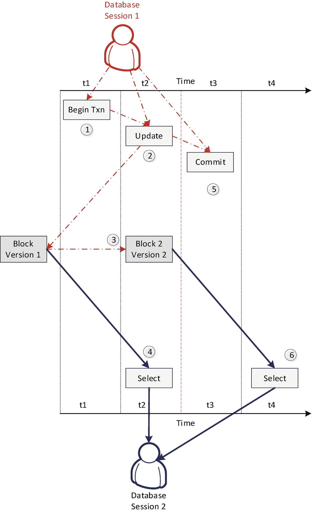
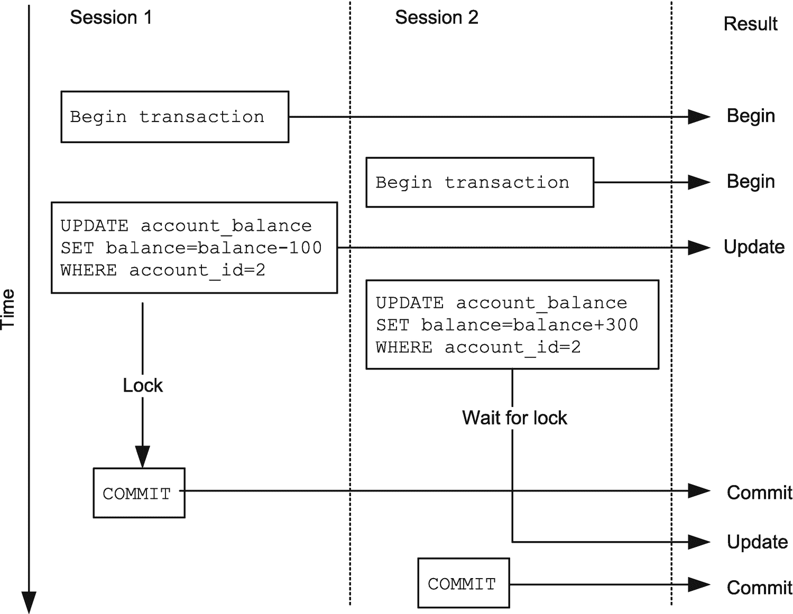
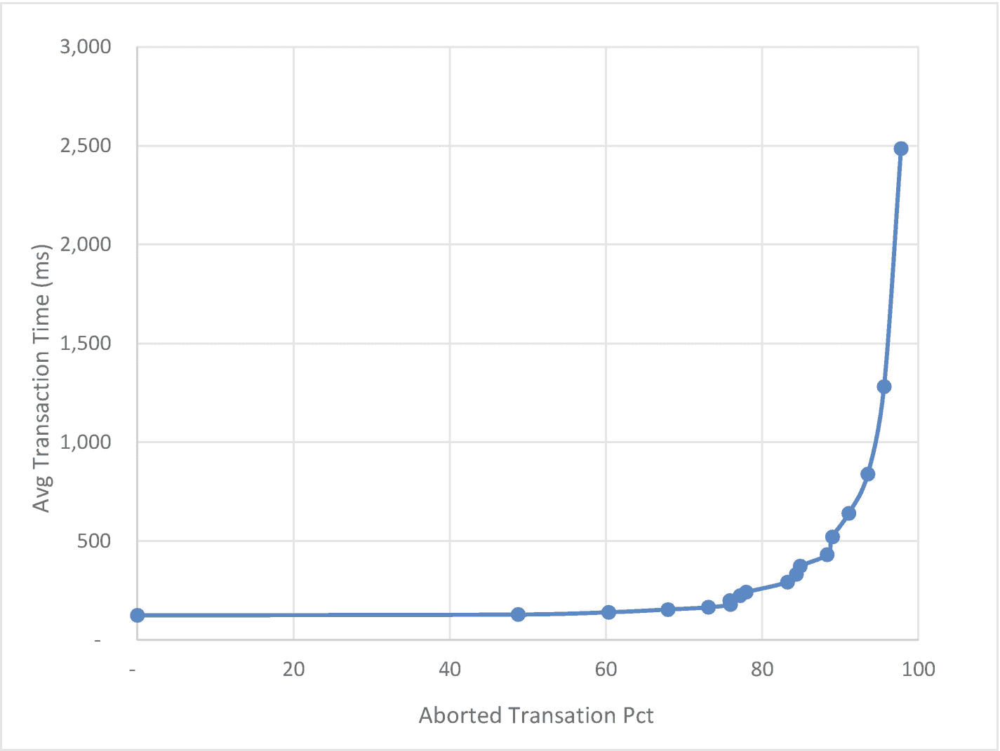
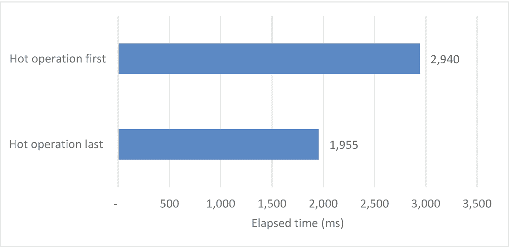
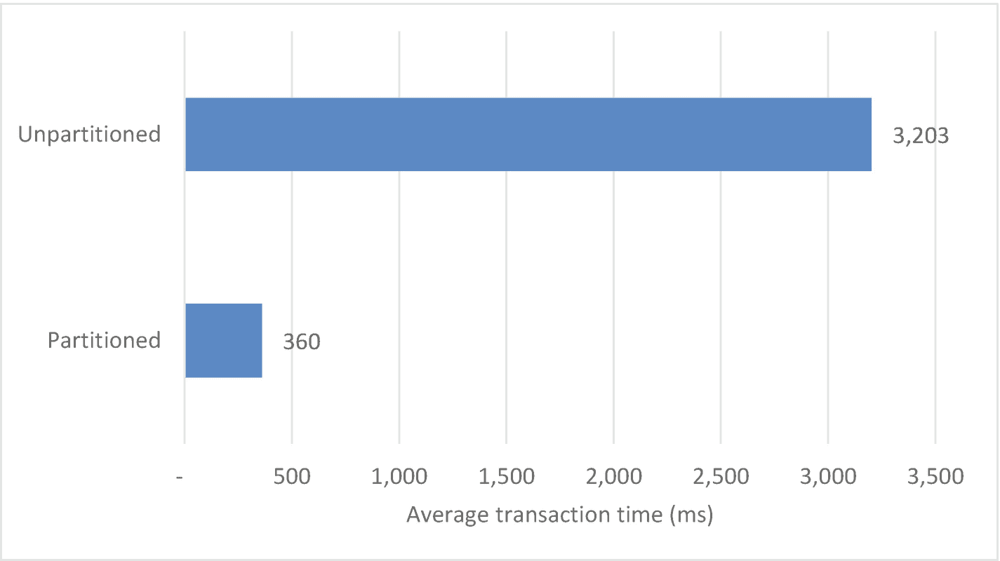

# 9.处理

事务在 MongoDB 中是新的，但在 SQL 数据库中已经存在了 30 多年。事务用于维护数据库系统中的一致性和正确性，这些数据库系统会受到多个用户发出的并发更改的影响。

事务通常会以降低*并发性*为代价来提高*一致性*。因此，事务对数据库性能有很大影响。

本章并不打算作为交易的教程。要了解如何对事务进行编程，请参阅 MongoDB 手册中关于事务的部分。 <sup>[1](#Fn1)</sup> 在本章中，我们将集中讨论最大化事务吞吐量和最小化事务等待时间。

## 交易理论

数据库通常使用两种主要的架构模式来满足一致性需求: *ACID 事务*和*多版本并发控制* ( *MVCC* )。

ACID 事务模型是在 20 世纪 80 年代开发的。ACID 交易应

*   **Atomic** :事务是不可分割的——要么将事务中的所有语句应用于数据库，要么不应用任何语句。

*   **一致**:数据库在事务执行前后保持一致状态。

*   **隔离**:虽然多个事务可以由一个或多个用户同时执行，但是一个事务不应该看到其他正在进行的事务的影响。

*   **持久**:一旦事务被保存到数据库中(通常通过 COMMIT 命令)，即使操作系统或硬件出现故障，它的更改也将持续。

实现 ACID 一致性最简单的方法是使用*锁*。使用基于锁的一致性，如果一个会话正在读取一个项目，其他任何会话都不能修改它；如果一个会话正在修改一个项目，其他任何会话都不能读取它。然而，基于锁的一致性会导致不可接受的高争用和低并发性。

为了在没有过多锁定的情况下提供 ACID 一致性，现代数据库系统几乎普遍采用了*多版本并发控制* ( *MVCC* )模型。在 MVCC 模型中，数据的多个副本标有时间戳或更改标识符，允许数据库在给定时间点构建数据库的*快照*。这样，MVCC 在最大化并发性的同时提供了事务隔离和一致性。

例如，在 MVCC，如果数据库表在会话开始读取表和会话结束之间被修改，数据库将使用以前版本的表数据来确保会话看到一致的版本。MVCC 还意味着，在事务提交之前，其他会话看不到事务的修改——其他会话会查看数据的旧版本。这些较旧的数据副本也用于回滚未成功完成的事务。

图 [9-1](#Fig1) 展示了 MVCC 模型。数据库会话在时间 t1 (1)启动一个事务。在时间 t2，会话更新文档(2):这导致该文档的新版本被创建(3)。大约在同一时间，第二个数据库会话查询文档，但是因为第一个会话的事务还没有提交，所以他们看到的是文档的前一个版本(4)。在第一个会话提交事务(5)之后，第二个数据库会话将从文档的修改版本中读取(6)。



图 9-1

多版本一致性控制

## MongoDB 事务

您可能在其他数据库中使用过事务——MySQL、PostgreSQL 或其他 SQL 数据库——并且对这些基本原则有合理的理解。MongoDB 事务表面上类似于 SQL 数据库事务；然而，在幕后，实现是明显不同的。

SQL 数据库和 MongoDB 中的事务之间的两个重要区别是

*   最初——在 MongoDB 4.4 之前——MongoDB 没有在磁盘上维护多个版本的块来支持 MVCC。相反，块保存在 WiredTiger 缓存中。

*   MongoDB 不使用阻塞锁来防止事务之间的冲突。相反，它发出`TransientTransactionErrors`来中止可能导致冲突的事务。

### 交易限额

MongoDB 使用图 [9-1](#Fig1) 中概述的 MVCC 机制来确保事务看到数据库的独立和一致的表示。这种快照隔离确保事务看到一致的数据视图，并且会话不会观察到未提交的事务。这种 MongoDB 隔离机制被称为*快照*读取问题。

大多数实现 MVCC 系统的关系数据库使用基于磁盘的“镜像前”或“回滚”段来存储创建这些数据库快照所需的数据。在这些数据库中，快照的“年龄”仅受磁盘上可用磁盘空间的限制。

然而，最初的 MongoDB 实现依赖于保存在 WiredTiger 基于内存的缓存中的数据副本。因此，MongoDB 无法为长期运行的事务可靠地维护数据快照。为了避免 WiredTiger 内存的内存压力，默认情况下，事务的持续时间限制为 60 秒。可通过改变`transactionLifetimeLimitSeconds`参数来修改该限值。在 MongoDB 4.4 中，snaphot 数据可以写入磁盘，但是默认的事务时间限制仍然是 60 秒。

### transientstransactionerrors

几乎毫无例外，PostgreSQL 或 MySQL 等关系数据库使用锁来实现事务一致性。图 [9-2](#Fig2) 说明了这是如何工作的。当会话修改表中的某一行时，它会锁定该行以防止并发修改。如果第二个会话试图修改同一行，它必须等到原始事务提交时锁被释放。



图 9-2

关系数据库事务中的锁

许多开发人员熟悉关系数据库的阻塞锁，并可能认为 MongoDB 也做同样的事情。然而，MongoDB 的方法完全不同。在 MongoDB 中，当第二个会话试图修改在另一个事务中修改过的文档时，它不会等待锁被释放。相反，它接收一个`TransientTransactionError`事件。然后，第二个会话必须重试该事务(理想情况下是在第一个事务完成之后)。

图 9-3 展示了 MongoDB 范例。当会话更新文档时，它不会锁定文档。但是，如果第二个会话试图修改事务中的文档，就会发出一个`TransientTransactionError`。


图 9-3

蒙戈布·德·特拉斯潘瑟罗

由应用决定对`TransientTransactionError`做什么，但是推荐的方法是简单地重试事务，直到它最终成功。

下面是一些说明`TransientTransactionError`范例的代码。该代码片段创建了两个会话，每个会话都在自己的事务中。然后，我们尝试在每个事务中更新同一个文档。

```js
var session1=db.getMongo().startSession();
var session2=db.getMongo().startSession();
var session1Collection=session1.getDatabase(db.getName())
            .transTest;
var session2Collection=session2.getDatabase(db.getName())
            .transTest;
session1.startTransaction();
session2.startTransaction();

session1Collection.update({_id:1},{$set:{value:1}});
session2Collection.update({_id:1},{$set:{value:2}});

session1.commitTransaction();
session2.commitTransaction();

```

当遇到第二个 update 语句时，MongoDB 会发出一个错误:

```js
mongo>session1Collection.update({_id:1},{$set:{value:1}});
WriteCommandError({
        "errorLabels" : [
                "TransientTransactionError"
        ],
        "operationTime" : Timestamp(1596785629, 1),
        "ok" : 0,
        "errmsg" : "WriteConflict error: this operation conflicted with another operation. Please retry your operation or multi-document transaction.",
        "code" : 112,
        "codeName" : "WriteConflict",

```

### MongoDB 驱动程序中的事务

从 MongoDB 4.2 开始，MongoDB 驱动程序通过自动重试事务来对您隐藏`transientTransationErrors`。例如，您可以同时运行这个 NodeJS 代码的多个副本，而不会遇到任何`TransientTransactionErrors:`

```js
async function myTransaction(session, db, fromAcc,
                              toAcc, dollars) {
    try {
        await session.withTransaction(async () => {

          await db.collection('accounts').
            updateOne({ _id: fromAcc },
              { $inc: {  balance: -1*dollars }  },
              { session });

          await db.collection('accounts').
            updateOne({ _id: toAcc },
              { $inc: {  balance: dollars }  },
              { session });

        }, transactionOptions);
    } catch (error) {
        console.log(error.message);
    }
}

```

NodeJS 驱动程序——以及 Java、Python、Go 等其他语言的驱动程序——自动处理任何`TransientTransactionErrors`并重新提交任何中止的事务。但是，MongoDB 服务器仍然会发出错误，您可以在 MongoDB 日志中看到这些错误的记录:

```js
~$ grep -i 'assertion.*writeconflict' \
            /usr/local/var/log/mongodb/mongo.log \
            |tail -1|jq
{
  "t": {
    "$date": "2020-08-08T14:04:47.643+10:00"
  },
  …
  "msg": "Assertion while executing command",
  "attr": {
    "command": "update",
    "db": "MongoDBTuningBook",
    "commandArgs": {
      "update": "transTest",
      "updates": [
        {
          "q": {
            "_id": 1
          },
          "u": {
            "$inc": {
              "value": 2
            }
          },
          "upsert": false,
          "multi": false
        }
      ],
      /* Other transaction information */
    },
    "error": "WriteConflict: WriteConflict error: this operation conflicted with another operation. Please retry your operation or multi-document transaction."
  }
}

```

在 NodeJS 驱动程序中，您还可以记录服务器级的调试消息 <sup>[2](#Fn2)</sup> 来查看正在幕后进行的中止的事务。当一个事务在幕后中止时，您将在输出流中看到以下消息:

```js
[DEBUG-Server:20690] 1596872732041 executing command [{"ns":"admin.$cmd","cmd":{"abortTransaction":1,"writeConcern":{"w":"majority"}},"options":{}}] against localhost:27017 {
  type: 'debug',
  message: 'executing command [{"ns":"admin.$cmd","cmd":{"abortTransaction":1,"writeConcern":{"w":"majority"}},"options":{}}] against localhost:27017',
  className: 'Server',
  pid: 20690,
  date: 1596872732041
}

```

其他驱动程序可能会提供类似的方法来查看事务重试次数。

在全局级别，重试在`db.serverStatus`计数器`transactions.totalAborted`中可见。我们可以使用以下函数来检查启动、中止和提交的事务数量:

```js
function txnCounts() {
  var ssTxns = db.serverStatus().transactions;
  print(ssTxns.totalStarted + 0, 'transactions started');
  print(ssTxns.totalAborted + 0, 'transactions aborted');
  print(ssTxns.totalCommitted + 0, 'transactions committed');
  print(Math.round(ssTxns.totalAborted * 100 /
            ssTxns.totalStarted) + '% txns aborted');
}

mongo> txnCounts();
203628 transactions started
167989 transactions aborted

35639 transactions committed
82% txns aborted

```

### TransientTransactionErrors 的性能影响

由`TransientTransactionErrors`引起的重试是昂贵的——它们不仅包括丢弃事务中迄今为止所做的任何工作，还包括将数据库状态恢复到事务开始时的状态。使 MongoDB 事务变得昂贵的最大原因是事务重试的影响。图 [9-4](#Fig4) 显示，随着事务中止百分比的增加，事务的运行时间迅速减少。



图 9-4

中止的事务对性能的影响

Note

MongoDB 事务模型包括中止与其他事务冲突的事务。这些中止是昂贵的操作，是 MongoDB 事务性能的主要瓶颈。

## 交易优化

鉴于`TransientTransactionError`重试对事务性能有如此严重的影响，因此我们需要尽一切可能减少这些重试。我们可以采用几个策略:

*   完全避免交易。

*   对操作进行排序，以尽量减少冲突操作的数量。

*   对容易发生高级写冲突的“热”文档进行分区。

### 避免交易

您可能不需要使用 MongoDB 事务来实现事务性结果。例如，考虑这个交易，它在一个假设的银行应用中的分支机构之间转移资金:

```js
    try {
        await session.withTransaction(async () => {
          await db.collection('branches').
            updateOne({ _id: fromBranch },
              { $inc: {  balance: -1*dollars }  },
              { session });
          await db.collection('branches').
            updateOne({ _id: toBranch },
              { $inc: {  balance: dollars }  },
              { session });
        }, transactionOptions);
    } catch (error) {
        console.log(error.message);
    }

```

这当然看起来像是事务的候选——两个 update 语句作为一个单元应该同时成功或失败。但是，如果分支的数量相对较少——小到足以容纳一个文档——那么我们可以将所有余额存储在一个文档中的嵌入式数组中，如下所示:

```js
mongo> db.embeddedBranches.findOne();
{
  "_id": 1,
  "branchTotals": [
    {
      "branchId": 0,
      "balance": 101208675
    },
    {
      "branchId": 1,
      "balance": 98409758
    },
    {
      "branchId": 2,
      "balance": 99407654
    },
    {
      "branchId": 3,
      "balance": 98807890
    }
  ]
}

```

然后，我们可以使用相对简单的 update 语句在分支之间自动移动数据。我们的新“事务”将如下所示:

```js
try {
   let updateString =
       `{"$inc":{
      "branchTotals.`+fromBranch+`.balance":`+dollars+`,
      "branchTotals.`+toBranch +`.balance":`+dollars+`}}`;
   let updateClause = JSON.parse(updateString);

   await db.collection('embeddedBranches').updateOne(
      {_id: 1 }, updateClause);
} catch (error) {
   console.log(error.message);
}

```

我们已经将四条语句减少到一条，并且完全消除了任何`TransientTransactionErrors`的可能性。图 [9-5](#Fig5) 比较了性能——非事务性方法比事务性方法快 100 多倍。


图 9-5

MongoDB 事务与嵌入式数组

Tip

对于 MongoDB 事务，可能有替代的应用策略，这些策略可能比正式的事务执行得更好，尤其是在写入冲突的可能性很高的情况下。

### 操作排序

从本质上讲，事务会向 MongoDB 数据库发出多个操作。其中一些操作可能比其他操作更容易产生写冲突。在这些场景中，更改操作顺序可能会给您带来性能优势。

例如，考虑以下事务:

```js
      await session.withTransaction(async () => {
        await db.collection('txnTotals').
          updateOne({ _id: 1 },
            { $inc: {  counter: 1 }  },
            { session });
        await db.collection('accounts').
          updateOne({ _id: fromAcc },
            { $inc: {  balance: -1*dollars }  },
            { session });
        await db.collection('accounts').
          updateOne({ _id: toAcc },
            { $inc: {  balance: dollars }  },
            { session });

      }, transactionOptions);

```

这个交易在两个账户之间转移资金，但是首先，它更新一个全局“交易计数器”试图发出该事务的每个事务都将试图更新该计数器，结果许多事务将遇到`TransientTransactionError`次重试。

如果我们将有争议的语句移到事务的末尾，那么发生`TransientTransactionError`的机会将会减少，因为冲突的窗口将会减少到事务执行的最后几个时刻。修改后的代码如下所示——我们只是将`txnTotals`更新移到了事务的末尾:

```js
        await session.withTransaction(async () => {
          await db.collection('accounts').
            updateOne({ _id: fromAcc },
              { $inc: {  balance: -1*dollars }  },
              { session });
          await db.collection('accounts').
            updateOne({ _id: toAcc },
              { $inc: {  balance: dollars }  },
              { session });
          await db.collection('txnTotals').
            updateOne({ _id: 1 },
              { $inc: {  counter: 1 }  },
              { session });

        }, transactionOptions);

```

图 [9-6](#Fig6) 提供了更改示例交易的交易顺序的效果示例。将“热”操作放在最后可以减少争用，并显著缩短事务执行时间。



图 9-6

事务中重新排序操作的影响

Tip

考虑将“热”操作——那些可能遇到`TransientTransactionErrors`的操作——放在事务的最后，以减少冲突时间窗口。

### 划分热文档

当多个事务试图修改一个特定的文档时发生。这些“热”文档成为事务瓶颈。在某些情况下，我们可以通过将文档中的数据划分为多个不同的文档来缓解瓶颈。

例如，考虑我们在上一节中看到的事务。该交易更新了交易计数器文档:

```js
          await db.collection('txnTotals').
            updateOne({ _id: 1 },
              { $inc: {  counter: 1 }  },
              { session });

```

这是一个“热”文档的完美例子——每个事务都想更新的文档。如果我们真的需要在一个事务中保存类似这样的运行总数，我们可以将总数拆分到多个文档中。例如，以下替代语法将总计拆分为十个文档:

```js
        let id=Math.floor(Math.random()*10);

        await db.collection('txnTotals').
          updateOne({ _id: id },
            { $inc: {  counter: 1 }  },
            { session });

```

当然，如果我们想要得到一个总计，我们将需要聚集来自十个小计的数据，但是这对于提高我们的事务性能来说是一个很小的代价。

图 [9-7](#Fig7) 显示了这种分区带来的性能提升。通过对热文档进行分区，我们将平均事务时间减少了近 90%。



图 9-7

对“热”文档进行分区以缩短事务时间

Tip

考虑将“热”文档——由多个事务同时更新的文档——划分为多个文档。

## 结论

事务是许多应用的基本要求，MongoDB 4.0 中事务支持的引入是 MongoDB 的一大进步。

不幸的是，与 MongoDB 的其他新特性不同，事务本身并不能提高性能。通过在会话之间引入争用，事务本质上会降低并发性，从而降低吞吐量并增加响应时间。

MongoDB 事务架构没有利用大多数 SQL 数据库使用的阻塞锁。相反，它中止试图同时修改文档的事务。这些中止和重试由 MongoDB 驱动程序“秘密”处理。然而，事务中止和重试是 MongoDB 事务的一个关键性能拖累，应该是事务调优工作的重点。

在本章中，我们研究了几种减少争用从而提高事务吞吐量的方法:

*   我们有时可以完全避免事务，例如，通过在单个文档中嵌入必须自动更新的数据。

*   我们可以通过将高争用操作移到事务的末尾来减少事务中止的机会。

*   我们可以将“热”文档划分为多个文档，从而减少这些文档中的数据争用。

<aside aria-label="Footnotes" class="FootnoteSection" epub:type="footnotes">Footnotes [1](#Fn1_source)

[T2`https://docs.mongodb.com/manual/core/transactions/`](https://docs.mongodb.com/manual/core/transactions/)

  [2](#Fn2_source)

[`https://docs.mongodb.com/drivers/node/fundamentals/logging`见](https://docs.mongodb.com/drivers/node/fundamentals/logging)

 </aside>