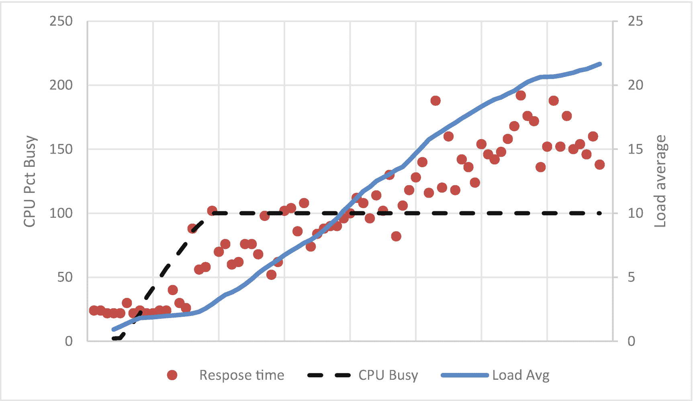
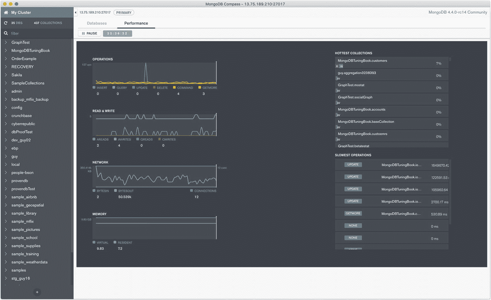
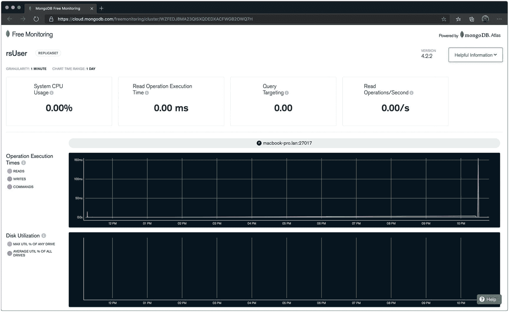
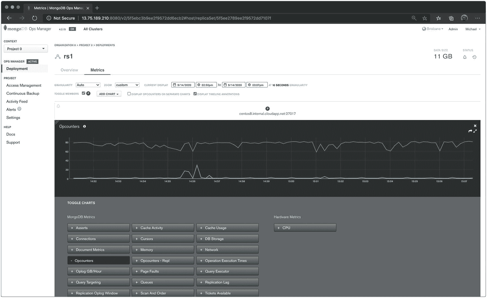
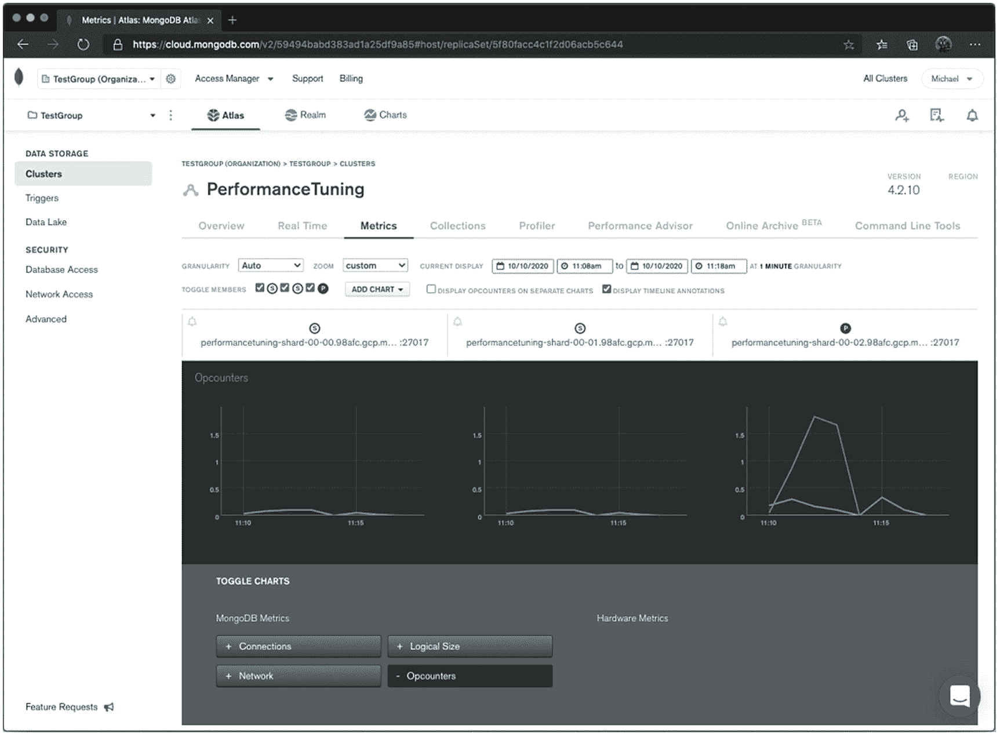

# 十、服务器监控

到目前为止，我们一直致力于通过优化应用代码和数据库设计来管理性能。在理想情况下，这是我们开始调优工作的地方，通过优化应用，我们使 MongoDB 工作得更智能，而不是更困难。通过优化我们的模式、应用代码和索引，我们减少了 MongoDB 完成一项任务所需的工作量。

然而，可能有一天你已经完成了所有可能的实际应用调优。此外，有些情况下，您根本没有能力返工应用代码——例如，当您使用第三方应用时。

现在是时候查看您的服务器配置，并确保服务器针对应用工作负载进行了优化。理想情况下，这种服务器端调优分四个阶段进行:

*   确保服务器主机上有足够的内存和 CPU 来支持工作负载

*   确保有足够的正确配置的内存来减少 IO 需求

*   优化磁盘 IO 以确保磁盘请求返回时不会有过长的延迟

*   确保群集配置得到优化，以避免群集协调中的延迟，并最大限度地利用群集资源

这些话题是本书接下来四章的主题。在这一章中，我们将了解监控服务器性能的基础知识和一些有助于这一过程的有用工具。

## 主机级监控

所有的 MongoDB 服务器都运行在一个操作系统中，而这个操作系统又托管在某个硬件平台中。在当今由虚拟机、容器和云基础设施组成的世界中，硬件拓扑可能会变得模糊不清。但是，即使您不能直接观察底层硬件，您也可以观察提供支持 MongoDB 服务器的原始资源的操作系统容器。

在最基本的层面上，操作系统提供了四种基本资源:

*   **网络**带宽，允许数据进出机器

*   **CPU** ，允许执行程序代码

*   **内存**，允许快速访问非永久性数据

*   **磁盘 IO** ，允许永久存储海量数据

有各种各样的工具可以帮助您监控主机利用率，包括商业的和免费的。根据我们的经验，最好理解如何使用内置的性能实用程序，因为它们总是可用的。

在 Linux 上，您应该熟悉以下命令:

*   `top`

*   `uptime`

*   `vmstat`

*   `iostat`

*   `netstat`

*   `bwm-ng`

在 Windows 上，您可以使用*资源监视器*应用获得图形视图，并从 PowerShell `Get-Counter`命令获得原始统计数据。

### 网络

网络负责将数据从服务器传输到应用，并在组成集群的服务器之间传输。

我们已经在第 [6](06.html) 章中讨论了网络往返的作用，我们将在第 [13](13.html) 章中更多地讨论集群优化背景下的网络流量。

MongoDB 服务器中的网络接口成为瓶颈并不常见——网络瓶颈更常见于服务器和各种客户端之间的许多网络跳跃。也就是说，MongoDB 服务器可以处理的数据量通常小于通过典型网络接口可以传输的数据量。您可以使用`bwm-ng`命令监控通过网络接口传输的流量:

```js
bwm-ng v0.6.2 (probing every 5.200s), press 'h' for help
  input: /proc/net/dev type: rate
iface                Rx                Tx             Total
  =================================================================
    lo:        0.00  B/s         0.00  B/s         0.00  B/s
  eth0:      173.52 KB/s         8.84 MB/s         9.01 MB/s
virbr0:        0.00  B/s         0.00  B/s         0.00  B/s
-----------------------------------------------------------------
 total:      173.52 KB/s         8.84 MB/s         9.01 MB/s

```

现代服务器中的网络接口通常是 10 或 100 千兆以太网卡，这些网卡限制客户机和服务器之间传输的数据量的可能性很小。然而，如果您有一台使用 10GbE 卡以下的旧服务器，那么升级您的网卡是一种廉价的优化。

然而，虽然服务器上的网络接口不太可能成为问题，但是客户端和服务器之间的网络很可能包含各种具有不同性能特征的路由和交换机。此外，客户端和服务器之间的距离造成了不可避免的延迟。应用和 MongoDB 服务器之间的网络往返时间通常是整体性能的限制因素。

您可以使用 ping 或 traceroute 等命令来测量两台服务器之间的往返时间。这里，我们测量三个广泛分布的副本集成员的网络延迟:

```js
$ traceroute mongors01.eastasia.cloudapp.azure.com --port=27017 -T

traceroute to mongors01.eastasia.cloudapp.azure.com (23.100.91.199), 30 hops max, 60 byte packets
 1  * * *
 . . .
18  * * 23.100.91.199 (23.100.91.199)  118.392 ms
$ traceroute mongors02.japaneast.cloudapp.azure.com --port=27017 -T
traceroute to mongors02.japaneast.cloudapp.azure.com (20.46.164.146), 30 hops max, 60 byte packets
 1  * * *
      . . .
19  * 20.46.164.146 (20.46.164.146)  128.611 ms
$ traceroute mongors03.koreacentral.cloudapp.azure.com --port=27017 -T
traceroute to mongors03.koreacentral.cloudapp.azure.com (20.194.1.136), 30 hops max, 60 byte packets
 1  * * *
  . . .
26  * * *
27  20.194.1.136 (20.194.1.136)  152.857 ms

```

测量响应一个非常简单的 MongoDB 命令(如`rs.isMaster()`)所需的时间也很有用。当我们从服务器主机上的 shell 运行`rs.isMaster()`时，我们会看到一个最小的延迟:

```js
mongo> var start=new Date();
mongo> var isMaster=rs.isMaster();
mongo> print ('Elapsed time', (new Date())-start);
Elapsed time 14

```

当我们从远程主机运行`rs.isMaster()`时，由于网络延迟，运行时间要长几百毫秒:

```js
mongo> var start=new Date();
mongo> var isMaster=rs.isMaster();
mongo> print (‘Elapsed time’, (new Date())-start);
Elapsed time 316

```

如果您的网络延迟过高——超过几个 100 毫秒——那么您可能需要检查您的网络配置。您的网络管理员或 ISP 可能需要参与跟踪延迟的原因。

但是，在复杂的网络拓扑中，网络延迟的原因可能超出了您的控制范围。一般来说，处理网络延迟的最佳方法是

*   将您的应用工作负载“移近”您的数据库服务器。理想情况下，应用服务器应该与您的 MongoDB 服务器位于同一个区域、数据中心甚至同一个机架中。

*   减少应用中的网络往返次数。我们在第 [6](06.html) 和 [8](08.html) 章中讨论了优化网络往返的方法。

Tip

超过几百毫秒的网络延迟令人担忧。调查您的网络硬件和拓扑，并考虑将您的应用代码“移近”您的 MongoDB 服务器。在这两种情况下，请确保使用本书前面讨论的技术来最小化网络往返。

### 中央处理器

CPU 瓶颈通常会导致性能下降。MongoDB 服务器进程在解析请求、访问缓存中的数据以及用于许多其他目的时会消耗 CPU。

当调查 CPU 利用率时，可以理解大多数人从 *CPU 繁忙百分比*指标开始。但是，这个指标只有在 CPU 利用率低于 100%时才有用。一旦 CPU 利用率达到 100%，更重要的指标是*运行队列*。

运行队列——有时称为*平均负载*——反映了想要使用一个 CPU 的进程的平均数量，但是当其他进程正在独占该 CPU 时，这些进程必须等待。与 CPU 繁忙百分比相比，运行队列是衡量 CPU 负载的更好方法，因为即使 CPU 得到充分利用，对 CPU 的需求仍会增加，因此运行队列仍会增长。大型运行队列几乎总是与较差的响应时间有关。

我们喜欢把 CPU 和运行队列想象成超市收银台。即使所有的收银台都很忙，只要收银台前没有大排长龙，你仍然可以快速走出超市。当队伍开始变长时，你就开始担心了。

图 [10-1](#Fig1) 说明了运行队列、CPU 繁忙百分比和响应时间之间的关系。随着工作量的增加，这三个指标都会增加。然而，CPU 繁忙百分比达到 100%，而运行队列和响应时间继续以高度相关的方式增加。因此，运行队列是 CPU 利用率的最佳衡量标准。

理想情况下，运行队列不应该超过系统中 CPU 数量的两倍。例如，在图 [10-1](#Fig1) 中，主机系统有四个 CPUs 因此，大约 8–10 的运行队列代表最大的 CPU 利用率。



图 10-1

运行队列、CPU 繁忙百分比和响应时间之间的关系

Tip

“CPU 运行队列”或“平均负载”是衡量 CPU 负载的最佳指标。运行队列应该保持在系统上可用 CPU 数量的两倍以下。

要获得 Linux 上的运行队列值，可以发出 uptime 命令:

```js
$ uptime
 06:38:39 up 42 days …  load average: 12.77, 3.66, 1.37

```

该命令报告过去 1、5 和 15 分钟的平均运行队列长度(平均负载)。

在 Windows 上，您可以在 PowerShell 提示符下发出以下`Get-Counter`命令:

```js
PS C:\Users\guy> Get-Counter '\System\Processor Queue Length' -MaxSamples 5

Timestamp                 CounterSamples
---------                 --------------
29/08/2020 1:32:20 PM     \\win10\system\processor queue length :
                          4

29/08/2020 1:32:21 PM     \\win10\system\processor queue length :
                          1

```

### 记忆

所有计算机应用都使用内存来存储正在处理的数据。数据库是内存的特别大的用户，因为它们通常在内存中缓存数据以避免执行过多的磁盘 IO。

我们将在下一章专门讨论 MongoDB 内存管理。请查看第 [11](11.html) 章，了解更多关于内存监控和 MongoDB 内存管理的知识。

### 磁盘 IO

磁盘 IO 对数据库性能至关重要，因此我们在第 [12](12.html) 章和第 [13](13.html) 章讨论了这个主题。我们将在这些章节中讨论磁盘 IO 性能管理的所有方面。

## MongoDB 服务器监控

`db.serverStatus()`命令是理解 MongoDB 服务器性能所需的大多数原始指标的最终来源。我们在第三章[中介绍了`db.serverStatus()`。然而，原始数据很难解释，因此有各种各样的调优工具以更容易理解的格式呈现信息。](03.html)

### `Compass`

MongoDB Compass(图 [10-2](#Fig2) )是使用 MongoDB 的官方 GUI，可以在 mongodb.com 免费获得。尽管 Compass performance dashboard 相对简单，但它是一个有用的入门点。如果你已经下载了 MongoDB 社区版，你可能已经有了 Compass。



图 10-2

MongoDB 指南针监控

### `Free Monitoring`

MongoDB 还提供了一种简单的方法来访问任何 MongoDB 服务器的基于云的性能仪表板。与 Compass 仪表板类似，免费的监控仪表板(图 [10-3](#Fig3) )提供了一个关于性能的最小视图，但是作为一种免费和直接的方式来获得 MongoDB 性能的摘要。



图 10-3

MongoDB 免费监控

从版本 4.0 开始，community edition 服务器可以免费监控。服务器主机防火墙必须允许访问 [`http://cloud.mongodb.com/freemonitoring`](http://cloud.mongodb.com/freemonitoring) 。

要启用免费监控，只需登录 MongoDB 服务器并运行`db.enableFreeMonitoring()`。如果一切顺利，您将获得一个指向您的监控仪表板的 URL:

```js
rsUser:PRIMARY> db.enableFreeMonitoring()
{
        "state" : "enabled",
        "message": "To see your monitoring data, navigate to the unique URL below. Anyone you share the URL with will also be able to view this page. You
can disable monitoring at any time by running db.disableFreeMonitoring().",
        "url" : "https://cloud.mongodb.com/freemonitoring/cluster/WZFEDJBMA23QISXQDEDXACFWGB2OWQ7H",
        "userReminder" : "",
        "ok" : 1,
        "operationTime" : Timestamp(1599995708,

```

### `Ops Manager`

MongoDB Ops Manager(通常简称为“Ops Man”)是 MongoDB 的商业平台，用于管理、监控和自动化 MongoDB 服务器操作(图 [10-4](#Fig4) )。Ops Man 可以与您现有的服务器一起部署，也可以用于创建新的基础架构。除了自动化和部署功能，Ops Man 还为所有注册的部署提供了一个性能监控仪表板。



图 10-4

MongoDB 运营经理

#### 蒙戈布地图集

如果您已经在 MongoDB 的 Atlas database-as-a-service 平台上创建了一个集群，您将可以访问一个与 MongoDB Ops Manager 非常相似的图形监控界面。Atlas 仪表板(图 [10-5](#Fig5) )提供了配置指标和选择生成活动图的时间窗口的能力。高级集群(M10 及以上)也将能够进行实时监控。



图 10-5

MongoDB 地图集监控

#### 第三方监控工具

还有各种各样的免费和商业监控工具为 MongoDB 提供了强大的支持。一些最受欢迎的是

*   Percona 专门从事开源数据库软件和服务。除了提供自己的 MongoDB 发行版，他们还提供 Percona 监控和管理平台，该平台提供 MongoDB 服务器的实时和历史性能监控。

*   **Datadog** 是一个流行的监控平台，为应用堆栈的所有元素提供诊断。他们为 MongoDB 提供了一个专用模块。

*   **网络安全管理软件产品**于 2019 年收购了 **VividCortex** 。用于 MongoDB 的 VividCortex 产品为 MongoDB 提供了一个有些独特的监控解决方案，它使用低级的工具来实现对 MongoDB 性能的高粒度跟踪。

## 摘要

我们在本书中一直认为，在更改硬件或服务器配置之前，您应该优化您的工作负载和数据库设计。然而，一旦您有了一个调优的应用，就该监控和调优您的服务器了。

操作系统为 MongoDB 服务器提供了四种关键资源——网络、CPU、内存和磁盘 IO。在这一章中，我们看了监控和理解 CPU 和内存。在接下来的两章中，我们将深入探讨内存和磁盘 IO。

在第 [3](03.html) 章中，我们回顾了 MongoDB 调优的基本工具。图形监控可以通过提供更好的可视化和历史趋势来补充这些工具。MongoDB 在 Compass 桌面 GUI 和基于云的免费监控仪表板中提供免费的图形监控。更广泛的监控可以在 MongoDB 的商业产品中找到:MongoDB Atlas 和 MongoDB Ops Manager。许多商业监控工具也提供了对 MongoDB 性能的洞察。