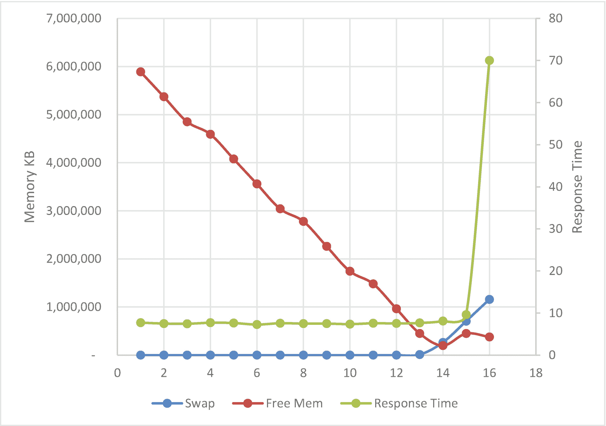
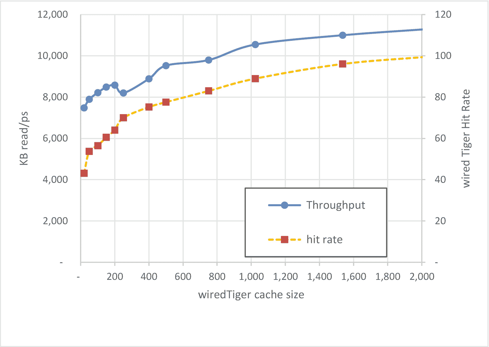
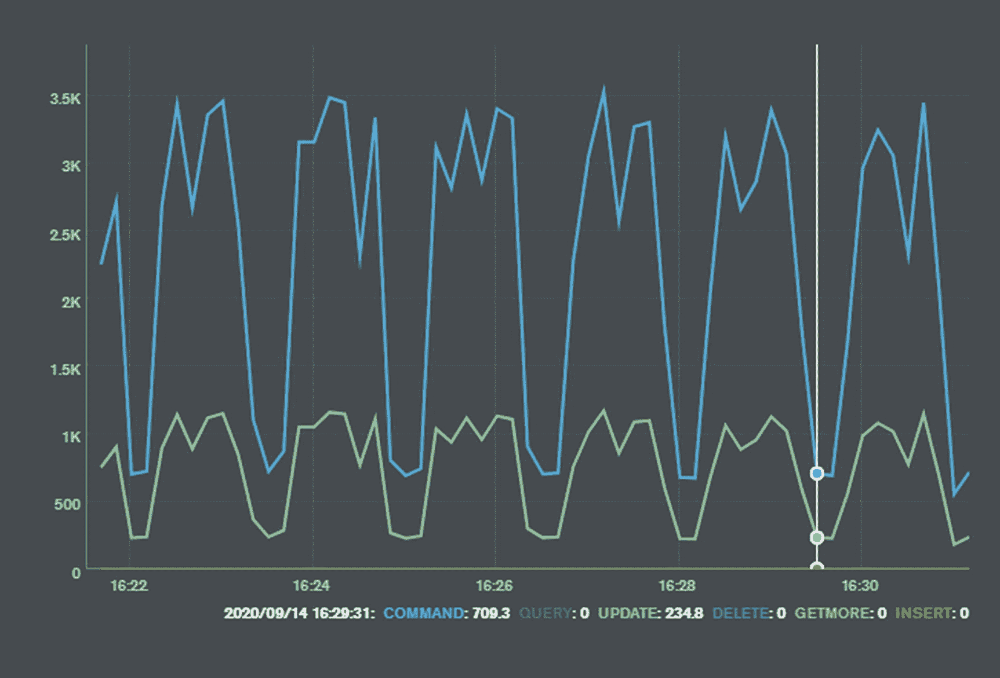

# 11.内存调整

在本书的前几章中，我们研究了减少 MongoDB 服务器上的工作负载需求的技术。我们考虑了对数据集进行结构化和索引的选项，并调整了我们的 MongoDB 请求，以最小化响应工作请求时必须处理的数据量。性能调优带来的 80%的性能提升可能来自于这些应用级的优化。

然而，在某种程度上，我们的应用模式和代码得到了优化，我们对 MongoDB 服务器的要求是合理的。我们现在的首要任务是确保 MongoDB 能够快速响应我们的请求。当我们向 MongoDB 发送数据请求时，最关键的因素变成了*数据是在内存中还是必须从磁盘*中获取？

和所有数据库一样，MongoDB 使用内存来避免磁盘 IO。从内存读取通常需要大约 20 纳秒。从一个非常快的固态硬盘读取数据需要大约 25 微秒，是这个时间的 1000 倍。从磁盘读取可能需要 4-10 毫秒，也就是慢了 2000 倍！所以 MongoDB——像所有数据库一样——被设计为尽可能避免磁盘 IO。

## MongoDB 内存架构

MongoDB 支持多种可插拔存储引擎，每种引擎对内存的利用都不同。事实上，甚至有一个*内存中的*存储引擎，它只在内存中存储活动数据。然而，在本章中，我们将只关注默认的 WiredTiger 存储引擎。

当使用 WiredTiger 存储引擎时，MongoDB 消耗的大部分内存通常是 WiredTiger 缓存。

MongoDB 根据工作负载需求分配额外的内存。您不能直接控制分配的额外内存量，尽管工作负载和一些服务器配置参数确实会影响分配的内存总量。最重要的内存分配与排序和聚合操作有关——我们在第 [7](07.html) 章中看到了这些。每个到 MongoDB 的连接也需要内存。

在 WiredTiger 缓存中，内存被分配用于缓存集合和索引数据，用于支持事务多版本一致性控制的快照(参见第 [9](09.html) 章)，以及缓冲 WiredTiger 预写日志。

图 [11-1](#Fig1) 展示了 MongoDB 内存的重要组成部分。


图 11-1

MongoDB 内存架构

### 主机内存

虽然配置 MongoDB 内存是一个大话题，但是从操作系统的角度来看，内存管理非常简单。要么有一些可用的空闲内存，一切都很好，要么没有足够的空闲内存，一切都很糟糕。

当物理空闲内存耗尽时，分配内存的尝试将导致现有的内存分配“换出”到磁盘。由于磁盘比内存慢几百倍，内存分配突然需要多几个数量级的时间来满足。

图 [11-2](#Fig2) 显示了当内存耗尽时，响应时间如何突然下降。随着可用内存的减少，响应时间保持稳定，但是一旦内存耗尽并且涉及到基于磁盘的交换，响应时间会突然显著下降。



图 11-2

内存、交换和响应时间

Tip

当服务器内存被过度利用时，内存可以被交换到磁盘。在 MongoDB 服务器上，这几乎总是表明 MongoDB 内存配置的内存不足。

虽然我们不希望看到内存过度分配和交换，但我们也不希望看到大量未分配的内存。未使用的内存没有任何用处——将这些内存分配给 WiredTiger 缓存可能比让其闲置更好。

### 测量记忆

在 Linux 系统上，您可以使用`vmstat`命令来显示可用内存:

```js
$ vmstat -s
     16398036 K total memory
     10921928 K used memory
     10847980 K active memory
      3778780 K inactive memory
      1002340 K free memory
         4236 K buffer memory
      4469532 K swap cache
            0 K total swap
            0 K used swap
            0 K free swap

```

这里最关键的计数器是`active memory`——代表当前分配给一个进程的内存，以及`used swap`，指示有多少内存已经交换到磁盘。如果`active memory`接近总内存，你可能会遇到内存不足。`Used swap`通常应该为零，尽管在解决了内存不足问题后，swap 可能会在一段时间内包含非活动内存。

在 Windows 上，您可以使用资源监视器应用或从 PowerShell 提示符发出以下命令来测量内存:

```js
PS C:\Users\guy> systeminfo |Select-string Memory

Total Physical Memory:     16,305 MB
Available Physical Memory: 3,363 MB
Virtual Memory: Max Size:  27,569 MB
Virtual Memory: Available: 6,664 MB
Virtual Memory: In Use:    20,905 MB

```

`db.serverStatus()`命令提供了 MongoDB 使用了多少内存的详细信息。以下脚本打印出内存利用率的顶级汇总: <sup>[1](#Fn1)</sup>

```js
mongo>function memory() {
...   let serverStats = db.serverStatus();
...   print('Mongod virtual memory ', serverStats.mem.virtual);
...   print('Mongod resident memory', serverStats.mem.resident);
...   print(
...     'WiredTiger cache size',
...     Math.round(
...       serverStats.wiredTiger.cache
             ['bytes currently in the cache'] / 1048576
...     )
...   );
... }
mongo>memory();
Mongod virtual memory  9854
Mongod resident memory 8101
WiredTiger cache size 6195

```

该报告告诉我们，MongoDB 已经分配了 9.8GB 的虚拟内存，其中 8.1GB 当前被主动分配给物理内存。虚拟内存和常驻内存之间的差异通常表示已经分配但尚未使用的内存。

在分配的 9.8GB 内存中，6.1GB 分配给了 WiredTiger 缓存。

## 有线内存

大多数 MongoDB 生产部署使用 WiredTiger 存储引擎。对于这些部署，最大的内存块将是 WiredTiger 缓存。在本章中，我们将只讨论 WiredTiger 存储引擎，因为虽然存在其他存储引擎，但它们远没有 WiredTiger 部署得广泛。

WiredTiger 缓存对服务器性能有很大的影响。如果没有缓存，每次数据读取都是磁盘读取。缓存通常会减少 90%以上的磁盘读取次数，因此可以大幅提高吞吐量。

### 缓存大小

默认情况下，WiredTiger 缓存将被设置为总内存的 50%减去 1GB 或 256MB，以最大值为准。因此，例如，在一个 16GB 的服务器上，您会期望默认大小为 7GB((16/2)-1)。剩余的内存可用于排序和聚合区域、连接内存和操作系统内存。

默认的 WiredTiger 缓存大小是一个有用的起点，但很少是最佳值。如果其他工作负载在同一台主机上运行，可能会过高。相反，在 MongoDB 专用的大型内存系统上，它可能太低了。鉴于 WiredTiger 缓存对性能的重要性，您应该准备好调整缓存大小以满足您的需要。

Tip

默认的 WiredTiger 缓存大小是一个有用的起点，但很少是最佳值。确定和设置最佳值通常是值得的。

mongod 配置参数`wiredTigerCacheSizeGB`控制缓存的最大大小。在 MongoDB 配置文件中，这由`storage/WiredTiger/engineConfig/cacheSizeGB`路径表示。例如，要将缓存大小设置为 12GB，您可以在您的`mongod.conf`文件中指定以下内容:

```js
storage:
  wiredTiger:
     engineConfig:
        cacheSizeGB: 12

```

您可以在正在运行的服务器上调整 WiredTiger 缓存的大小。以下命令将缓存大小调整为 8GB:

```js
    db.getSiblingDB('admin').runCommand({setParameter: 1,
         wiredTigerEngineRuntimeConfig: 'cache_size=8G'});

```

### 确定最佳缓存大小

太小的缓存会导致 IO 增加，从而降低性能。另一方面，增加超过可用操作系统内存的缓存大小会导致交换，甚至更严重的性能下降。MongoDB 越来越多地部署在云容器中，其中可用内存的数量可以动态调整。即便如此，内存通常是云环境中最昂贵的资源，因此在没有证据的情况下向服务器“扔更多内存”是不可取的。

那么，我们如何确定正确的缓存内存量呢？没有确定的方法来确定更多的高速缓存是否会带来更好的性能，但是我们确实有一些指标可以指导我们。两个最重要的是

*   缓存“命中率”

*   驱逐率

### 数据库缓存“命中率”

数据库*缓存命中率*是一个有点臭名昭著的指标，历史悠久。简而言之，缓存命中率描述了您在内存中找到所需数据块的频率:


高速缓存命中率表示数据库高速缓存在不需要读取磁盘的情况下满足的块请求的比例。每次“命中”——当在内存中找到该块时——都是一件好事，因为它避免了耗时的磁盘 IO。因此，很明显，高缓冲区缓存命中率也是一件好事。

不幸的是，虽然缓存命中率明确地衡量了*某些东西*，但是高缓存命中率并不总是或者甚至通常并不意味着数据库调优良好。特别是，调优不佳的工作负载经常反复读取相同的数据块；这些块几乎肯定在内存中，所以具有讽刺意味的是，最低效的操作往往会产生非常高的缓存命中率。著名的 Oracle 数据库管理员 Connor McDonald 创建了一个脚本，它可以生成任何期望的命中率，本质上是通过反复读取相同的块。Connor 的脚本不执行任何有用的工作，但可以实现几乎完美的命中率。

Tip

缓存命中率没有“正确”的值，高值很可能是工作负载调优不佳的结果，也可能是内存配置调优的结果。

尽管如此，对于一个经过良好调优的工作负载(具有良好的模式设计、适当的索引和优化的聚合管道)，观察 WiredTiger 命中率可以让您了解 WiredTiger 缓存支持 MongoDB 工作负载需求的情况。

这里有一个计算命中率的脚本:

```js
mongo> var cache=db.serverStatus().wiredTiger.cache;
mongo> var missRatio=cache['pages read into cache']*100/cache['pages requested from the cache'];
mongo> var hitRatio=100-missRatio;
mongo> print(hitRatio);
99.93843137484377

```

此计算返回自服务器上次启动以来的缓存命中率。要计算较短时间内的速率，您可以从我们的优化脚本中使用以下命令:

```js
mongo> mongoTuning.monitorServerDerived(5000,/cacheHitRate/)
{
  "cacheHitRate": "58.9262"
}

```

这表明在前 5 秒内的缓存命中率为 58%。

如果我们的工作负载得到很好的调优，较低的缓存命中率表明增加 WiredTiger 缓存可能会提高性能。

图 [11-3](#Fig3) 显示了不同的缓存大小如何影响未命中率和吞吐量。随着我们增加缓存的大小，我们的命中率会增加，吞吐量也会增加。因此，较低的初始命中率表明增加缓存大小可能会增加吞吐量。



图 11-3

WiredTiger 缓存大小(MB)、未命中率和吞吐量

随着我们增加缓存的大小，我们*可能会*看到命中率和吞吐量的增加。最后一句话的关键词是*可能*:一些工作负载将很少或根本不会从增加的缓存大小中受益，要么是因为所有需要的数据都已经在内存中，要么是因为一些数据从未被重新读取，因此无法从缓存中受益。

尽管 WiredTiger 的缺失率并不完美，但对于许多 MongoDB 数据库来说，它是一个至关重要的健康指标。

引用 Mongodb 手册:

> *性能问题可能表明数据库正在满负荷运行，是时候向数据库添加额外的容量了。特别是，应用的工作集应该适合可用的物理内存。*

高缓存命中率是工作集适合内存的最佳指标。

Tip

如果您的工作负载得到了优化，WiredTiger 缓存命中率较低可能表明应该增加 WiredTiger 缓存的大小。

### 逐出

高速缓存通常不能在内存中保存所有的东西。通常，缓存通过仅将最近访问的数据页面保存在缓存中，来尝试将最频繁访问的文档保存在内存中。

一旦缓存达到其最大大小，为新数据腾出空间就需要从缓存中删除旧数据—*逐出*。被删除的数据页面通常是最近最少使用的*(LRU)页面。*

 *MongoDB 不会等到缓存完全满了才执行驱逐。默认情况下，MongoDB 将尝试为新数据保留 20%的缓存空间，并在空闲百分比达到 5%时开始限制新页面进入缓存。

如果缓存中的数据项没有被修改，那么驱逐几乎是瞬间的。但是，如果数据块已被修改，则在写入磁盘之前，不能将其收回。这些磁盘写入需要时间。出于这个原因，MongoDB 试图将修改的“脏”块的百分比保持在 5%以下。如果修改块的百分比达到 20%，那么操作将被阻塞，直到达到目标值。

MongoDB 服务器为回收处理分配专用线程——默认情况下，分配四个回收线程。

#### 阻止驱逐

当干净数据块或脏数据块的数量达到较高的阈值时，尝试将新数据块放入缓存的会话将被要求在读取操作完成之前执行驱逐。

因为“紧急”驱逐会阻塞操作，所以您希望确保驱逐配置能够避免这种情况。这些“阻塞”驱逐记录在 WiredTiger 参数“页面获取驱逐阻塞”中:

```js
db.serverStatus().wiredTiger["thread-yield"]["page acquire eviction blocked"]

```

这些阻止驱逐应该保持相对罕见。您可以计算阻止驱逐与整体驱逐的总比率，如下所示:

```js
mongo> var wt=db.serverStatus().wiredTiger;
mongo> var blockingEvictRate=wt['thread-yield']['page acquire eviction blocked'] *100 / wt['cache']['eviction server evicting pages'];
mongo>
mongo> print(blockingEvictRate);
0.10212131891589296

```

您可以使用我们的调优脚本计算较短时间段内的比率:

```js
mongo> mongoTuning.monitorServerDerived(5000,/evictionBlock/)
{
  "evictionBlockedPs": 0,
  "evictionBlockRate": 0
}

```

如果阻塞驱逐率很高，这可能表明需要更积极的驱逐策略。要么早点开始驱逐，要么在驱逐过程中应用更多的线程。可以更改 WiredTiger 驱逐配置值，但这是一个有风险的过程，部分原因是尽管可以设置这些值，但不能直接检索现有的值。

例如，以下命令将回收线程数和目标设置为它们发布的默认值:

```js
mongo>db.adminCommand({
...   setParameter: 1,
...   wiredTigerEngineRuntimeConfig:
...     `eviction=(threads_min=4,threads_max=4),
...      eviction_dirty_trigger=5,eviction_dirty_target=1,
...      eviction_trigger=95,eviction_target=80`
... });

```

如果驱逐出现问题，我们可以尝试增加线程的数量或改变阈值，以促进或多或少的积极驱逐处理机制。

Tip

如果“阻止”驱逐的比率很高，那么可能需要更积极的驱逐政策。但是在调整 WiredTiger 内部参数时要非常小心。

### 检查站

当更新或其他数据操作语句更改缓存中的数据时，它不会立即反映在表示文档持久表示的数据文件中。数据更改的表示被写入顺序预写日志*中*。这些顺序日志写入可用于在服务器崩溃时恢复数据，并且所涉及的顺序写入比随机写入要快得多，而随机写入是保持数据文件与缓存绝对同步所必需的。

但是，我们不希望缓存在数据文件之前移动太远，部分原因是这样会增加在服务器崩溃时恢复数据库的时间。因此，MongoDB 会定期确保数据文件与缓存中的更改保持同步。这些*检查点*涉及将修改后的“脏”块写出到磁盘。默认情况下，检查点每 60 秒出现一次。

检查点是 IO 密集型的—根据缓存的大小和缓存中脏数据的数量，可能需要将许多千兆字节的信息刷新到磁盘。因此，检查点通常会导致吞吐量明显下降——尤其是对于数据操作语句。

图 [11-4](#Fig4) 说明了检查点的影响——每 60 秒一次；当出现检查点时，吞吐量会突然下降。结果是“锯齿”性能模式。



图 11-4

检查点会导致性能不均衡

这种锯齿性能曲线可能值得关注，也可能不值得关注。但是，有几个选项可以改变检查点的影响。以下设置是相关的:

*   上一节讨论的`eviction_dirty_trigger`和`eviction_dirty_target settings`控制在驱逐处理开始之前，缓存中允许有多少修改的块。可以对这些进行调整，以减少缓存中修改的数据块数，从而减少在检查点期间必须写入磁盘的数据量。

*   `eviction.threads_min`和`eviction.threads_max`设置指定将有多少线程专用于驱逐处理。为逐出分配更多的线程将加快逐出处理的速度，这反过来会在检查点期间在缓存中留下更少的要刷新的块。

*   可以调整`checkpoint.wait`设置来增加或减少检查点之间的时间。如果设置了一个较高的值，那么在检查点出现之前，逐出处理可能会将大多数块写入磁盘，检查点的总体影响可能会降低。然而，这些延迟检查点的开销也可能是巨大的。

检查点没有一个正确的设置，有时检查点的影响可能是反直觉的。例如，当您拥有大型 WiredTiger 缓存时，检查点的开销会更大。这是因为修改块的默认回收策略被设置为 WiredTiger 缓存的一个百分比——缓存越大，回收处理器就越“懒惰”。

但是，如果您愿意尝试，您可以通过调整检查点之间的时间和回收处理的积极性来建立一个较低的检查点开销。例如，这里我们将检查点调整为每 5 分钟出现一次，增加回收线程数，并降低脏块回收的目标阈值:

```js
db.adminCommand({
      setParameter: 1,
          wiredTigerEngineRuntimeConfig:
                 `eviction=(threads_min=10,threads_max=10),
                 checkpoint=(wait=500),
                 eviction_dirty_trigger=5,
                 eviction_dirty_target=1`
                });

```

我们想绝对清楚地表明，我们并不推荐前面的设置，也不建议您修改这些参数。但是，如果您担心检查点会产生不可预测的响应时间，这些设置可能会有所帮助。

Tip

默认情况下，检查点每一分钟将修改过的页面写出到磁盘。如果您在一分钟的周期内遇到性能下降，您可能会考虑调整——小心地 WiredTiger 检查点和脏驱逐策略。

### WiredTiger 并发

在 WiredTiger 缓存中读写数据需要一个线程获得一个读或写“票”默认情况下，有 128 张这样的票。`db.serverStatus()`报告`wiredTiger.concurrentTransactions`部分的可用门票数量:

```js
mongo> db.serverStatus().wiredTiger.concurrentTransactions
{
  "write": {
    "out": 7,
    "available": 121,
    "totalTickets": 128
  },
  "read": {
    "out": 28,
    "available": 100,
    "totalTickets": 128
  }
}

```

在前面的示例中，128 个读取票证中有 28 个正在使用，128 个写入票证中有 7 个正在使用。

考虑到大多数 MongoDB 操作的持续时间很短，128 个票通常就足够了——如果并发操作超过 128 个，服务器或操作系统的其他地方就可能出现瓶颈——要么排队等待 CPU，要么排队等待 MongoDB 内部锁。但是，可以通过调整参数`wiredTigerConcurrentReadTransactions`和`wiredTigerConcurrentWriteTransactions`来增加这些票的数量。例如，要将并发读取器的数量增加到 256，我们可以发出以下命令:

```js
db.getSiblingDB("admin").
   runCommand({ setParameter: 1, wiredTigerConcurrentReadTransactions: 256 });

```

但是，增加并发读取器的数量时要小心，因为较高的值可能会淹没可用的硬件资源。

## 降低应用内存需求

正如我们前面强调的，当您在优化硬件和服务器配置之前优化应用设计和工作负载时，会产生最佳的优化结果。通过为 IO 开销较高的服务器增加内存，通常可以提高性能。然而，内存并不是免费的，而创建一个索引或调整一些代码不会花费你任何成本——至少从金钱的角度来看是这样的。

我们在本书的前十章中讨论了关键的应用调优原则。然而，关于它们如何影响内存消耗，这里有必要重新概括一下。

### 文件设计

WiredTiger 缓存存储完整的文档副本，而不仅仅是您感兴趣的文档部分。举例来说，如果你有一个像这样的文档:

```js
{
  _id: 23,
  Ssn: 605-21-9090,
  Name: 'Guy Harrison',
  Address: '89 InfiniteLoop Drive, Cupertino, CA 9000',
  HiResScanOfDriversLicense : BinData(0,"eJy0kb2O1UAMhV ……… ==")
}

```

除了用户驾驶执照的大量二进制表示外，文档相当小。WiredTiger 缓存将需要在缓存中存储驾照的所有高分辨率扫描，无论您是否要求。因此，为了最大化内存，你不妨采用第 [4](04.html) 章介绍的*垂直分区*设计模式。我们可以将驾照扫描放在一个单独的集合中，只在需要时才加载到缓存中，而不是在访问 SSN 记录时才加载。

Tip

请记住，文档越大，缓存中可以存储的文档就越少。保持文档较小可以提高缓存效率。

### 索引

索引为选定的数据提供了一个快速的路径，但也有助于内存。当我们使用全集合扫描来搜索数据时，所有文档都会被加载到缓存中，而不管该文档是否符合过滤标准。因此，索引查找有助于保持缓存的相关性和有效性。

索引还减少了排序所需的内存。我们在第 [6](06.html) 和 [7](07.html) 章中看到了如何使用索引来避免磁盘排序。但是，如果我们执行大量的内存排序，那么我们将需要操作系统内存(WiredTiger 缓存之外)来执行这些排序。索引排序没有同样的内存开销。

Tip

索引通过只将需要的文档引入缓存和减少排序的内存开销来帮助减少内存需求。

### 处理

我们在第 [9](09.html) 章中看到了 MongoDB 事务如何使用数据快照来确保会话不会读取未提交版本的文档。在 MongoDB 4.4 之前，这些快照保存在 WiredTiger 缓存中，减少了可用于其他目的的内存量。

因此，在 MongoDB 4.4 之前，向应用添加事务会增加 WiredTiger 缓存所需的内存量。此外，如果您调整`transactionLifetimeLimitSeconds`参数以允许更长的事务，您将增加更多的内存压力。从 MongoDB 4.4 开始，快照作为“持久历史”存储在磁盘上，长事务对内存的影响不太显著。

## 摘要

和所有数据库一样，MongoDB 使用内存主要是为了避免磁盘 IO。如果可能的话，应该在优化内存之前优化应用的工作负载，因为对模式设计、索引和查询的更改都会改变应用的内存需求。

在 WiredTiger 实现中，MongoDB 内存由 WiredTiger 缓存(主要用于缓存频繁访问的文档)和操作系统内存组成，后者用于各种目的，包括连接数据和排序区域。无论您的内存占用量如何，请确保它永远不会超过操作系统的内存限制；否则，部分内存可能会被换出到磁盘。

您可以使用的最重要的调节旋钮是 WiredTiger 缓存大小。默认情况下，它略低于操作系统内存的一半，在许多情况下可以增加，尤其是在服务器上有大量空闲内存的情况下。缓存中的“命中率”是一个可能表明需要增加内存的指标。

缓存和内存的其他区域用来避免磁盘 IO，但是最终，数据库必须发生一些磁盘 IO 来完成它的工作。在下一章中，我们将考虑如何测量和优化必要的磁盘 IO。

<aside aria-label="Footnotes" class="FootnoteSection" epub:type="footnotes">Footnotes [1](#Fn1_source)

这个脚本作为`mongoTuning.memoryReport()`包含在我们的调优脚本中。

 </aside>*