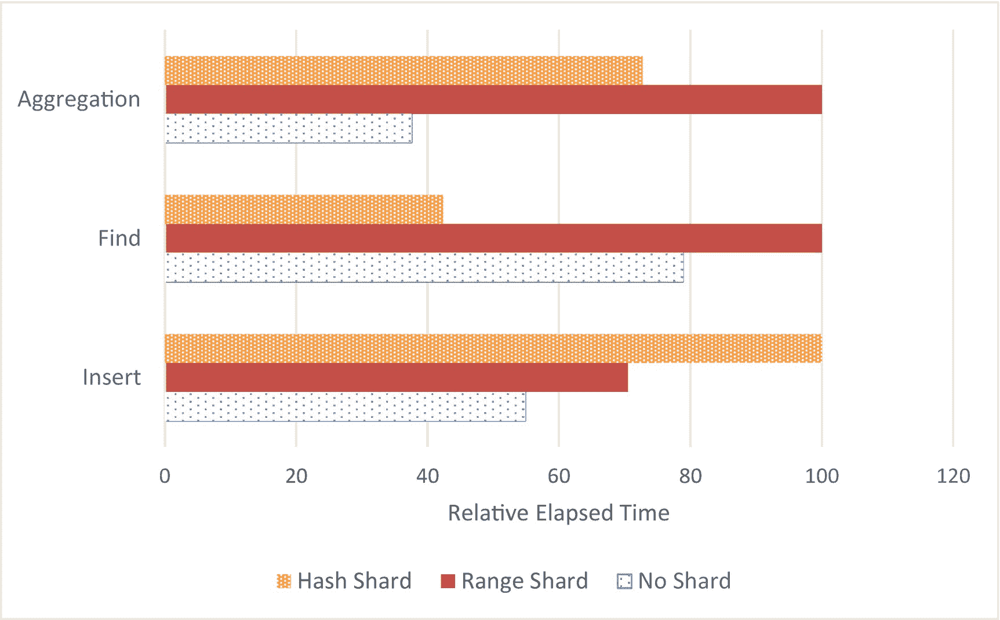
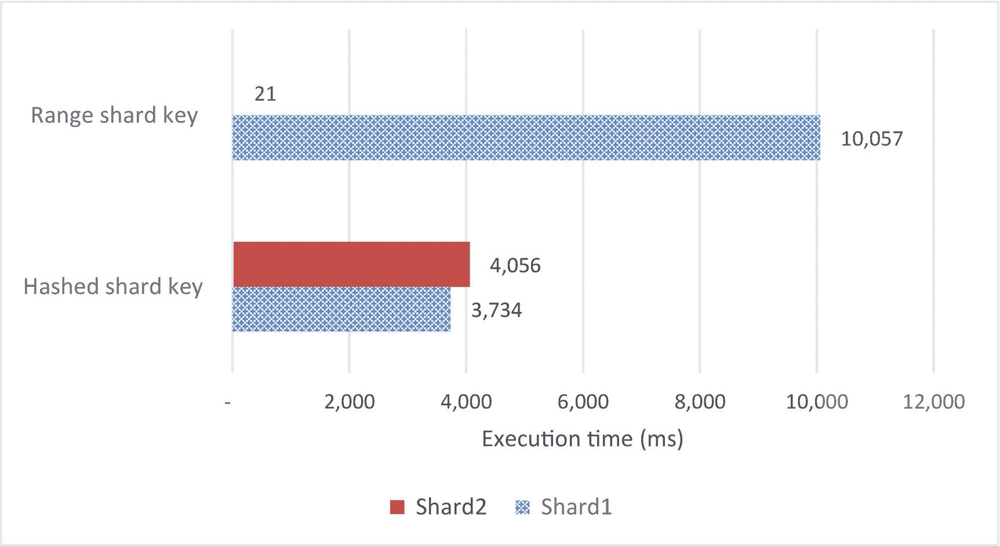
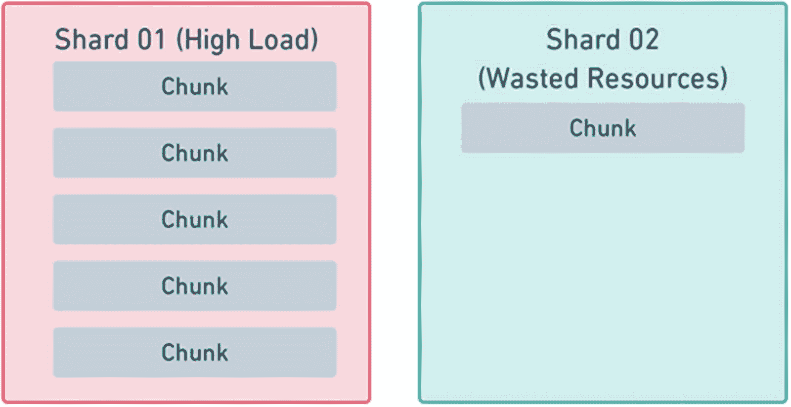
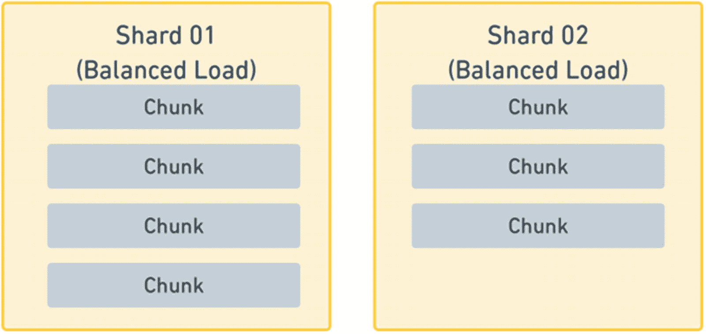

# 14.分片

在前一章中，我们介绍了最常部署的 MongoDB 配置:副本集。副本集对于现代应用来说是必不可少的，这些应用需要单个 MongoDB 实例无法提供的可用性。正如我们已经看到的，副本集可以通过二次写入进行一些有限的读取扩展。但是，对于大型应用，尤其是写入工作负载超过单个群集的能力时，可以部署分片群集。

我们在前面章节中介绍的所有内容都完全适用于分片的 MongoDB 服务器。事实上，在使用前面章节中介绍的技术优化应用工作负载和单个服务器配置之前，最好不要考虑分片。

然而，分片 MongoDB 部署带来了一些重要的性能机会和挑战，这些将在本章中讨论。

## 切分基础知识

我们在第 [2](02.html) 章介绍了分片。在分片的数据库集群中，所选的集合跨多个数据库实例进行分区。每个分区被称为一个“碎片”这种划分是基于分片键值的。

副本集旨在提供高可用性，而分片旨在提供更大的可伸缩性。当您的工作负载(尤其是写入工作负载)超过服务器的容量时，分片提供了一种将工作负载分散到多个节点的方法。

### 缩放和分片

分片是一种架构模式，旨在让数据库支持世界上最大的网站的大量工作负载。

随着应用负载的增长，在某些时候，工作负载会超出单台服务器的能力。可以通过将一些读取工作负载转移到辅助节点来扩展服务器的能力，但是最终主节点的写入工作负载量会变得太大。我们不能再“扩大规模”

当“纵向扩展”变得不可能时，我们转向“横向扩展”我们添加更多主节点，并使用分片在这些主节点之间分配工作负载。

大规模分片对现代网络的建立至关重要——脸书和 Twitter 都是使用 MySQL 大规模分片的早期采用者。然而，它并不普遍受欢迎 MySQL 的分片涉及大量的手动配置，并破坏了一些核心数据库功能。然而，MongoDB 中的分片完全集成到核心数据库中，并且相对容易配置和管理。

### 分片概念

分片是一个很大的话题，我们不能在这里提供所有分片考虑的教程。请查阅 MongoDB 文档或 Nicholas Cottrell 的书 *MongoDB 拓扑设计*(a press，2020)以获得对分片概念的完整回顾。

以下分片概念尤为重要:

*   **碎片键**:碎片键是决定任何给定文档将被放入哪个碎片的属性。分片键应该具有高基数(许多唯一值)，以确保数据可以均匀地分布在各个分片上。

*   **组块**:文档包含在组块中，组块被分配给特定的碎片。分块避免了 MongoDB 必须费力地跨分片移动单个文档。

*   **范围分片**:使用范围分片，相邻的分片键组存储在同一个块中。范围分片允许高效的分片键范围扫描，但是如果分片值单调增加，可能会导致“热”块。

*   **散列分片**:在基于散列的分片中，基于应用于分片密钥的散列函数来分发密钥。

*   **平衡器** : MongoDB 试图保持分配给每个分片的数据和工作负载相等。平衡器定期将数据从一个碎片移动到另一个碎片，以保持这种平衡。

### 切还是不切？

分片是最复杂的 MongoDB 配置拓扑，世界上一些最大、性能最好的网站都在使用分片。所以分片一定对性能有好处，对吧？嗯，事情没那么简单。

分片在您的 MongoDB 数据库之上增加了一层复杂性和处理，这通常会使单个操作变得稍微慢一些。但是，它允许您在工作负载上投入更多的硬件资源。如果且仅如果您有一个涉及到主副本集操作的硬件瓶颈，那么分片可能是最好的解决方案。然而，在大多数其他情况下，分片会增加部署的复杂性和开销。

图 [14-1](#Fig1) 比较了相同硬件上一些简单操作的分片和非共享集合的性能。 <sup>[1](#Fn1)</sup> 在大多数情况下，对分片集合的操作要比对非分片集合的操作慢。当然，每个工作负载都会有所不同，但关键是单靠分片并不能让事情进展得更快！



图 14-1

分片并不总是有助于性能

就硬件的美元成本和运营开销而言，分片是昂贵的。这确实应该是最后的手段。只有当您用尽了所有其他调优措施和所有“扩展”选项时，才应该考虑分片。特别是，在考虑分片之前，要确保主磁盘上的磁盘子系统已经过优化。购买和部署一些新的固态硬盘比共享一个主硬盘要便宜得多，也容易得多！

Warning

分片应该是扩展 MongoDB 部署的最后手段。在开始分片项目之前，请确保您的工作负载、服务器和副本集配置已经过优化。

即使您认为分片是不可避免的，您仍然应该在开始分片项目之前彻底调优您的数据库。如果您的工作负载和配置产生了不必要的负载，那么您最终可能会产生更多不必要的碎片。只有当您的工作负载得到优化时，您才能合理地确定您的分片需求。

### 碎片键选择

分片发生在集合级别。虽然集群中的碎片数量对于所有集合都是相同的，但是并非所有集合都需要被碎片化，并且并非所有集合都需要具有相同的碎片键。

如果集合上的总 IO 写入需求超过单个主节点的容量，则应该对集合进行分片。然后，我们根据以下标准选择分片密钥:

*   这些键应该有一个**高基数**，以便在必要时可以将数据分成小块。

*   这些键应该有**个均匀分布**的值。如果任何单个值特别常见，那么 shard 键可能是一个糟糕的选择。

*   这个键应该经常包含在查询中，这样查询就可以被路由到特定的碎片。

*   关键应该是**非单调**递增。当碎片键值单调增加时(例如，总是以设定值增加)，则新文档出现在相同的块中，导致热点。如果您确实有一个单调递增的键值，可以考虑使用散列分片键。

Tip

选择正确的分片键对于分片项目的成功至关重要。分片键应该支持跨分片文档的良好平衡，并支持尽可能多的查询过滤条件。

### 基于范围和基于散列的分片

跨碎片的数据分布可以是基于*范围的*或基于*散列的*。在基于范围的分区中，每个分片都被分配了一个特定范围的分片键值。MongoDB 查询索引中键值的分布，以确保每个碎片都分配有大致相同数量的键。在基于散列的分片中，基于应用于分片密钥的散列函数来分发密钥。

每种方案都有优点和折衷之处。图 [14-2](#Fig2) 展示了插入和范围查询的范围和散列分片所固有的性能权衡。


图 14-2

基于范围和基于哈希的分片比较

基于范围的分区允许高效地执行分片键范围扫描，因为这些查询通常可以通过访问单个分片来解决。基于散列的分片要求通过访问所有分片来解决范围查询。另一方面，基于散列的分片更有可能将“热”文档(例如，未完成的订单或最近的帖子)均匀地分布在集群中，从而更有效地平衡负载。

Tip

散列碎片键导致更均匀分布的数据和工作负载。但是，对于基于范围的查询，它们会导致较差的性能。

散列碎片键确实会导致更均匀的数据分布。然而，我们很快就会看到，散列碎片键确实给各种查询操作带来了巨大的挑战，尤其是那些涉及排序或范围查询的查询操作。此外，我们只能对单个属性进行哈希，而我们理想的碎片键通常由多个属性组成。

然而，有一个用例明确指出了散列碎片键。如果我们必须对一个不断增加的属性进行分片——通常称为单调增加的属性——那么范围分片策略将导致所有新文档被插入到一个分片中。这个碎片在插入和读取方面将变得“热”,因为最近的文档比旧文档更容易被更新和读取。

散列碎片键在这里起了拯救作用，因为散列值将均匀地分布在碎片上。

图 [14-3](#Fig3) 展示了单调递增的分片键如何影响使用散列或范围分片键的集合插入。在这个例子中，碎片键是`orderDate`，它总是随着时间的推移而增加。使用散列分片，插入在分片之间均匀分布。在范围分片场景中，所有文档都被插入到一个单独的分片中。散列碎片键不仅将工作负载分布在多个节点上，而且由于单个节点上的争用更少，还会导致更大的吞吐量。



图 14-3

将 120，000 个文档插入分片集合的时间–散列与范围单调递增键

Tip

如果您的碎片键必须是一个永久(单调)递增的值，那么散列碎片键是更好的选择。但是，如果需要对 shard 键进行范围查询，请考虑对另一个属性进行分片的可能性。

### 区域分片

大多数时候，我们的分片策略是将文档和工作负载平均分布在所有的分片上。只有平均分配负载，我们才有希望获得有效的可伸缩性。如果一个碎片负责不成比例的工作量，那么这个碎片可能会成为我们整个应用吞吐量的一个限制因素。

然而，分片还有另一个可能的动机——在分片之间分配工作负载，以便从网络角度来看，数据靠近需要该数据的应用，或者分配数据，以便“热”数据存储在昂贵的高性能硬件上，而“冷”数据存储在较便宜的硬件上。

*区域分片*允许 MongoDB 管理员微调文档到分片的分发。通过将一个碎片与一个区域相关联，并在该区域内的集合中关联一系列键，管理员可以明确地确定这些文档将驻留在哪个碎片上。这可以用于将数据归档到更便宜但速度更慢的存储碎片中，或者将特定数据定向到特定的数据中心或地理位置。

为了创建区域，我们首先将碎片分配给区域。在这里，我们为美国创建一个区域，为世界其他地区创建另一个区域:

```js
sh.addShardToZone("shardRS2", "US");
sh.addShardToZone("shardRS", "TheWorld");

```

尽管我们只有两个区域，但我们可以拥有任意多的碎片，每个区域可以有多个碎片。

现在我们给每个区域分配分片键范围。在这里，我们按照国家和城市进行了划分，因此我们使用`minKey`和`maxKey`作为国家范围内城市值高低的代表:

```js
sh.addTagRange(
  "MongoDBTuningBook.customers",
  { "Country" : "Afghanistan", "City" : MinKey },
  { "Country" : "United Kingdom", "City" : MaxKey },
  "TheWorld");

sh.addTagRange(
  "MongoDBTuningBook.customers",
  { "Country" : "United States", "City" : MinKey },
  { "Country" : "United States", "City" : MaxKey },
  "US");

sh.addTagRange(
  "MongoDBTuningBook.customers",
  { "Country" : "Venezuela", "City" : MinKey },
  { "Country" : "Zambia", "City" : MaxKey },
  "TheWorld");

```

然后，我们会将“美国”区域的硬件放在美国的某个地方，将“世界”区域的硬件放在世界其他地方(可能是欧洲)。我们还将在这些地区部署 mongos 路由。图 [14-4](#Fig4) 展示了这种部署可能的样子。


图 14-4

减少地理网络延迟的区域共享

最终结果是，从美国路由发出的美国查询的延迟更低，其他地区也是如此。当然，如果从欧洲发出对美国数据的查询，往返时间会更长。但是，如果从一个区域发出的查询主要是针对分区到该区域的数据，那么整体性能会得到提高。

随着应用的增长，我们可以在其他区域添加更多的区域。

Tip

区域分片可用于跨地理分布数据，减少特定区域查询的延迟。

区域分片的另一个用途是在缓慢但便宜的硬件上创建旧数据的档案。例如，如果我们有几十年的订单数据，我们可以为托管在具有更少 CPU、内存的虚拟机或服务器上的旧数据创建一个区域，甚至可以使用磁盘而不是高级 SSD。最近的数据可以保存在高速服务器上。对于给定的硬件预算，这可能会带来更好的整体性能。

## 碎片平衡

`getShardDistribution()`方法可以显示跨分片的数据分解。以下是一个平衡的分片系列示例:

```js
mongo> db.iotDataHshard.getShardDistribution()

Shard shard02 at shard02/localhost:27022,localhost:27023
 data : 304.04MiB docs : 518520 chunks : 12
 estimated data per chunk : 25.33MiB
 estimated docs per chunk : 43210

Shard shard01 at shard01/localhost:27019,localhost:27020
 data : 282.33MiB docs : 481480 chunks : 11
 estimated data per chunk : 25.66MiB
 estimated docs per chunk : 43770

Totals
 data : 586.38MiB docs : 1000000 chunks : 23
 Shard shard02 contains 51.85% data, 51.85% docs in cluster, avg obj size on shard : 614B
 Shard shard01 contains 48.14% data, 48.14% docs in cluster, avg obj size on shard : 614B

```

在一个平衡的分片集群中，每个分片中有大约相同数量的块和相同数量的数据。如果碎片之间的块数量不一致，那么平衡器应该能够迁移块以恢复集群的平衡。

如果块的数量大致相当，但是每个分片的数据量相差很大，那么可能是你的分片键分布不均匀。单个碎片键值不能跨越块，所以如果一些碎片键有大量的文档，那么就会产生大量的“巨型”块。巨型块是次优的，因为其中的数据不能有效地跨分片分布，因此更大比例的查询可能被发送到单个分片。

### 重新平衡碎片

假设您已经选择了一个合适的分片键类型(range 或 hashed ),并且该键拥有正确的属性——高基数、均匀分布、频繁查询、非单调递增。在这种情况下，您的块可能会在各个分片之间得到很好的平衡，因此，您将获得分布良好的工作负载。然而，几个因素可能会导致碎片失去平衡，一个碎片上的块比另一个碎片上的块多得多。当这种情况发生时，单个节点将成为瓶颈，直到数据可以在多个节点之间均匀地重新分布——如图 [14-5](#Fig5) 所示。



图 14-5

一组不均衡的碎片，大部分查询将去往碎片 01

如果我们能够在我们的碎片之间保持适当的平衡，查询负载更有可能在节点之间平均分配——如图 [14-6](#Fig6) 所示。



图 14-6

一组平衡良好的碎片:查询负载将均匀分布

幸运的是，只要在碎片之间检测到足够大的差异，MongoDB 就会自动重新平衡碎片集合。这种差异的阈值取决于总块的数量。例如，如果有 80 个或更多的块，阈值将是一个分片上最多的块和最少的块之间的差值 8。对于 20 到 80 之间的块，阈值是 4，如果块少于 20，阈值是 2。

如果检测到这种差异，分片平衡器将开始迁移块，以重新平衡数据的分布。这种迁移可能是由于在特定范围内插入了大量新数据，或者仅仅是由于添加了一个碎片。一个新的碎片最初是空的，因此会导致块分布的巨大差异，需要重新平衡。

`balancerStatus`命令允许您查看当前平衡器的状态:

```js
mongos> db.adminCommand({ balancerStatus: 1})
{
        "mode" : "full",
        "inBalancerRound" : false,
        "numBalancerRounds" : NumberLong(64629),
        "ok" : 1,
        "operationTime" : Timestamp(1604706062, 1),
        . . .
}

```

在前面的输出中，`mode`字段表示启用了平衡器，而`inBalancerRound`字段表示平衡器当前没有分发块。

尽管 MongoDB 会自动处理重新平衡，但重新平衡不会对性能没有影响。在区块迁移期间，带宽、工作负载和磁盘空间使用率都会增加。为了减轻这种性能损失，MongoDB 一次只迁移一个碎片。此外，每个碎片一次只能参与一个迁移。如果数据块迁移的影响正在影响您的应用性能，那么有一些事情可以尝试:

*   修改平衡器窗口

*   手动启用和禁用平衡器

*   更改块大小

我们将在接下来的几页中讨论这些选项。

#### 修改平衡器窗口

平衡器窗口定义平衡器处于活动状态的时间段。修改平衡器窗口将阻止平衡器在给定的时间窗口之外运行；例如，您可能只想在应用负载最低时平衡块。在本例中，我们将重新平衡限制在从晚上 10:30 开始的 90 分钟窗口内:

```js
mongos> use config
switched to db config
mongos> db.settings.update(
... { _id: "balancer" },
... { $set: {activeWindow :{ start: "22:30", stop: "23:59" } } },
... { upsert: true })
WriteResult({ "nMatched" : 1, "nUpserted" : 0, "nModified" : 1 })

```

Note

选择平衡窗口时，必须确保提供足够的时间来平衡当天的所有新单据。如果你的窗口太小，将会有剩余碎片的累积效应，这将使你的碎片越来越不平衡。

#### 禁用平衡器

可以禁用平衡器，稍后再重新启用。例如，您可以在修改大量文档的夜间批处理窗口中禁用平衡器，因为您不希望平衡器在此过程中“反复折腾”。

但是，使用这种方法时要小心，因为未能重新启用平衡器可能会导致碎片严重失衡。下面是一些代码，展示了停止和重新启动平衡器的过程:

```js
mongos> sh.getBalancerState()
true
mongos> sh.stopBalancer()
{
        "ok" : 1,
        "operationTime" : Timestamp(1604706472, 3),
        . . .
}
mongos> sh.getBalancerState()
false
mongos> sh.startBalancer()
{
        "ok" : 1,
        "operationTime" : Timestamp(1604706529, 3),
        . . .
        }
mongos> sh.getBalancerState()
true

```

Note

禁用平衡器后，迁移可能仍在进行中。您可能需要等到`sh.isBalancerRunning()`返回`false`才能确定平衡器已经完全停止。

#### 更改块大小

`chunksize`选项——默认为 64MB 将决定一个块在被分割之前将增长到多大。通过减少`chunksize`选项，您将拥有更多的小块。这将增加迁移和查询路由时间，但也会提供更均匀的数据分布。通过增加块大小，您将拥有更少、更大的块；这在迁移和路由方面会更有效，但可能会导致更大比例的数据位于单个区块中。此选项不会立即生效，您必须更新或插入到现有的块中才能触发拆分。

Note

一旦块被分割，它们就不能通过增加`chunksize`选项来重新组合，所以在减少这个参数时要小心。此外，有时一个块可能会增长到超过这个参数，但是不能被分割，因为所有的文档都有相同的碎片键。这些不可分割的块被称为巨型块。

这些重新平衡选项中的每一个都涉及维护集群平衡和优化重新平衡开销之间的权衡。持续的重新平衡可能会对您的吞吐量造成明显的拖累，而允许集群失去平衡可能会在单个碎片上造成性能瓶颈。没有“一刀切”的解决方案，但是为重新平衡操作建立一个维护窗口是一种低风险、低影响的方法，可以确保重新平衡操作不会在高峰期导致性能下降。

Tip

为重新平衡操作建立维护窗口通常是维护集群平衡同时避免过多重新平衡开销的最佳方式。

在使用这些方法直接控制平衡器之前，首先要避免碎片失去平衡！仔细选择一个分布良好的分片密钥是很好的第一步。如果集群正在经历持续的高重新平衡开销，散列碎片键也可能值得考虑。

### 更改碎片密钥

如果您已经确定一个选择不当的分片键会产生性能开销，那么有一些方法可以改变这个分片键。在 MongoDB 中，更改或重新创建 shard 密钥并不是一个容易或快速的过程。没有可以运行的自动过程或命令。更改集合的 shard 键的过程甚至比一开始就创建它还要麻烦。更改现有分片密钥的过程是

1.  备份您的数据

2.  删除整个集合

3.  创建新的碎片密钥

4.  导入旧数据

可以想象，对于大型数据集，这可能是一个漫长而乏味的过程。

这个笨拙的过程使得从一开始就考虑、设计和实现一个好的分片密钥变得更加重要。如果您不确定您是否有正确的 shard 键，那么用较小的数据子集创建一个测试集合会很有用。然后，您可以在观察分布的同时创建和重新创建碎片密钥。请记住，在选择要测试的数据子集时，它必须代表整个数据集，而不仅仅是单个数据块。

尽管 MongoDB 没有明确支持更改分片键，但从 4.4 版开始，它支持一种无需完全重新创建就能提高现有分片集合性能的方法。在 MongoDB 中，这被称为*提炼*一个分片密钥。

当细化一个分片键时，我们可以向分片键添加额外的字段，但是不能删除或编辑现有的字段。可以添加这些后缀字段来增加粒度并减小块的大小。记住，平衡器不能分割或移动由单个碎片键的文档组成的巨型块(大于`chunksize`选项的块)。通过细化我们的分片密钥，我们也许能够将一个巨大的块分成许多小块，然后可以重新平衡这些小块。

假设我们的应用相对较小，最初，通过`country`字段进行分片就足够了。然而，随着我们应用的增长，我们在一个国家有很多用户，产生了巨大的块。通过用`district`字段细化这个分片键，我们增加了块的粒度，从而消除了巨型块造成的永久不平衡。

下面是一个用`district`属性细化`country`分片密钥的例子:

```js
mongos> db.adminCommand({
   refineCollectionShardKey:
     "MongoDBTuningBook.customersSCountry",
     key: {
         Country: 1, District: 1}
})
{
        "ok" : 1,
        "operationTime" : Timestamp(1604713390, 40),
        . . .
}

```

Note

要细化分片键，必须确保新的分片键属性上存在匹配的索引。例如，在前面的代码片段中，索引必须存在于`{Country: 1, District: 1}`上。

请记住，优化碎片键不会对数据分布产生直接影响:它只会增强平衡器拆分和重新平衡现有数据的能力。此外，新插入的数据将具有更精细的粒度，这将导致更少的巨型块和更平衡的分片。

## 共享查询

分片可能会帮助您摆脱写瓶颈，但是如果关键查询受到负面影响，那么您的分片项目就不太可能被认为是成功的。我们希望确保分片不会导致任何查询降级。

### 共享解释计划

像往常一样，我们可以使用`explain()`方法来查看 MongoDB 将如何执行请求——即使请求是在一个分片集群的多个节点上执行的。一般来说，在查看分片查询时，我们会希望使用`executionStats`选项，因为只有该选项会向我们展示工作是如何在集群中分配的。

下面是一个分片查询的`executionStats`部分的例子。在输出中，我们应该看到一个`shards`步骤，它包含每个分片的子步骤。下面是一个分片查询的 explain 输出的截断版本:

```js
var exp=db.customers.explain('executionStats').
    find({'views.title':'PRINCESS GIANT'}).next();

mongos > exp.executionStats {
    "nReturned": 17874,
    "executionTimeMillis": 9784,
    "executionStages": {
        "stage": "SHARD_MERGE",
        "nReturned": 17874,
        "executionTimeMillis": 9784,
        "shards": [
            {"shardName": "shard01",
             "executionStages": {
                 "stage": "SHARDING_FILTER",
                  "inputStage": {
                      "stage": "COLLSCAN"}}},
            {"shardName": "shard02",
             "executionStages": {
                 "stage": "SHARDING_FILTER",
                  "inputStage": {
                      "stage": "COLLSCAN"}}}}}

```

该计划显示，查询是通过在每个碎片上执行集合扫描，然后在将数据返回给客户机之前合并结果来解决的。

我们的调优脚本(参见第 [3 章](03.html))为分片查询生成一个易读的执行计划。下面是一个输出示例，显示了每个分片上的计划:

```js
mongos> var exp=db.customers.explain('executionStats').
      find({'views.title':'PRINCESS GIANT'}).next();

mongos> mongoTuning.executionStats(exp)

1     COLLSCAN ( ms:4712 returned:6872 docs:181756)
2    SHARDING_FILTER ( ms:4754 returned:6872)
3   Shard ==> shard01 ()
4     COLLSCAN ( ms:6395 returned:11002 docs:229365)
5    SHARDING_FILTER ( ms:6467 returned:11002)
6   Shard ==> shard02 ()
7  SHARD_MERGE ( ms:6529 returned:17874)

Totals:  ms: 6529  keys: 0  Docs: 411121

```

当我们组合来自多个碎片的输出时，就会发生`SHARD_MERGE`步骤。表示`mongos`路由从多个分片接收数据，并组合成统一输出。

然而，如果我们发出一个根据 shard 键过滤的查询，那么我们可能会看到一个`SINGLE_SHARD`计划。在下面的例子中，集合在`LastName`上被分片，因此`mongos`能够从单个分片中检索所有需要的数据:

```js
mongos> var exp=db.customersShardName.explain('executionStats').
      find({'LastName':'HARRISON'})

mongos> mongoTuning.executionStats(exp)

1      IXSCAN ( LastName_1_FirstName_1 ms:0
                returned:730 keys:730)
2     SHARDING_FILTER ( ms:0 returned:730)
3    FETCH ( ms:149 returned:730 docs:730)
4   Shard ==> shard01 ()
5  SINGLE_SHARD ( ms:158 returned:730)

Totals:  ms: 158  keys: 730  Docs: 730

```

### 分片键查找

正如我们所看到的，当查询包含碎片键时，MongoDB 可能能够从单个碎片中满足查询。

例如，如果我们在`LastName`上分片，那么在`LastName`上的查询解析如下:

```js
mongos> var exp=db.customersSLName.explain('executionStats').
               find({LastName:'SMITH','FirstName':'MARY'});

mongo> mongoTuning.executionStats(exp);
1      IXSCAN ( LastName_1 ms:0 returned:711 keys:711)
2     FETCH ( ms:93 returned:9 docs:711)
3    SHARDING_FILTER ( ms:93 returned:9)
4   Shard ==> shardRS ( ms:97 returned:9)
5  SINGLE_SHARD ( ms:100 returned:9)

Totals:  ms: 100  keys: 711  Docs: 711

```

但是，请注意，在前面的示例中，我们缺少对`LastName`和`FirstName`的组合索引，因此查询的效率比预期的要低。我们应该细化 shard 键以包含`FirstName`，或者我们可以简单地在两个属性上创建一个新的复合索引:

```js
mongo> var exp=db.customersSLName.explain('executionStats').
              find({LastName:'SMITH','FirstName':'MARY'});

mongo> mongoTuning.executionStats(exp);

1      IXSCAN ( LastName_1_FirstName_1 ms:0 returned:9 keys:9)
2     SHARDING_FILTER ( ms:0 returned:9)
3    FETCH ( ms:0 returned:9 docs:9)
4   Shard ==> shardRS ( ms:1 returned:9)
5  SINGLE_SHARD ( ms:2 returned:9)

Totals:  ms: 2  keys: 9  Docs: 9

```

Tip

如果查询包含碎片键和附加过滤条件，您可以通过创建一个包含碎片键和这些附加属性的索引来优化查询。

### 意外碎片合并

只要有可能，我们希望将查询发送到单个碎片。为了实现这一点，我们应该确保我们的 shard 键与我们的查询过滤器一致。

例如，如果我们按`Country`分片，但按`City`查询，MongoDB 将需要进行分片合并，即使给定城市的所有文档都在包含该城市所在国家的分片中:

```js
mongo> var exp=db.customersSCountry.explain('executionStats').
            find({City:"Hiroshima"});

mongo> mongoTuning.executionStats(exp);

1      IXSCAN ( City_1 ms:0 returned:544 keys:544)
2     FETCH ( ms:0 returned:544 docs:544)
3    SHARDING_FILTER ( ms:0 returned:0)
4   Shard ==> shardRS ( ms:2 returned:0)
5      IXSCAN ( City_1 ms:0 returned:684 keys:684)
6     FETCH ( ms:0 returned:684 docs:684)
7    SHARDING_FILTER ( ms:0 returned:684)
8   Shard ==> shardRS2 ( ms:2 returned:684)
9  SHARD_MERGE ( ms:52 returned:684)

Totals:  ms: 52  keys: 1228  Docs: 1228

```

按`City`切分可能比按`Country`切分更好——因为`City`有更高的基数。然而，在这种情况下，简单地将`Country`添加到查询过滤器中同样有效:

```js
mongo> var exp=db.customersSCountry.explain('executionStats').
            find({Country:'Japan',City:"Hiroshima"});

mongo> mongoTuning.executionStats(exp);

1      IXSCAN ( City_1 ms:0 returned:684 keys:684)
2     FETCH ( ms:0 returned:684 docs:684)
3    SHARDING_FILTER ( ms:0 returned:684)
4   Shard ==> shardRS2 ( ms:2 returned:684)
5  SINGLE_SHARD ( ms:55 returned:684)

Totals:  ms: 55  keys: 684  Docs: 684

```

Tip

只要有意义，就向针对分片集群执行的查询添加分片键。如果 shard 键不包含在查询过滤器中，那么查询将被发送到所有的 shard，即使数据只存在于其中一个 shard 中。

### 分片密钥范围

如果 shard 键是范围分片的，那么我们可以使用该键来执行索引范围扫描。例如，在本例中，我们按照`orderDate`对订单进行了分段:

```js
mongo> var startDate=ISODate("2018-01-01T00:00:00.000Z");
mongo> var exp=db.ordersSOrderDate.explain('executionStats').
            find({orderDate:{$gt:startDate}});

mongo> mongoTuning.executionStats(exp);

1      IXSCAN ( orderDate_1 ms:0 returned:7191 keys:7191)
2     SHARDING_FILTER ( ms:0 returned:7191)
3    FETCH ( ms:0 returned:7191 docs:7191)
4   Shard ==> shardRS2 ( ms:16 returned:7191)
5  SINGLE_SHARD ( ms:68 returned:7191)

Totals:  ms: 68  keys: 7191  Docs: 7191

```

但是，如果实现了散列分片，则需要在每个分片中进行集合扫描:

```js
mongo> var exp=db.ordersHOrderDate.explain('executionStats').
      find({orderDate:{$gt:startDate}});
mongo> mongoTuning.executionStats(exp);

1     COLLSCAN ( ms:1 returned:2615 docs:28616)
2    SHARDING_FILTER ( ms:1 returned:2615)
3   Shard ==> shardRS ( ms:17 returned:2615)
4     COLLSCAN ( ms:1 returned:4576 docs:29881)
5    SHARDING_FILTER ( ms:1 returned:4576)
6   Shard ==> shardRS2 ( ms:20 returned:4576)
7  SHARD_MERGE ( ms:72 returned:7191)

Totals:  ms: 72  keys: 0  Docs

: 58497

```

Tip

如果您经常对分片键执行范围扫描，则范围分片比哈希分片更可取。但是，请记住，如果键值不断增加，范围分片会导致热点。

### 整理

当从多个碎片中检索排序后的数据时，排序操作分两个阶段进行。首先，数据在每个分片上进行排序，然后返回到`mongos`，在这里`SHARD_MERGE_SORT`将排序后的输入组合成一个合并的、排序后的输出。

支持排序的索引——如果合适的话，包括分片键索引——可以在每个分片上使用，以便于排序，但是即使您按分片键排序，最终的排序操作仍然必须在`mongos`上执行。

下面是一个根据`orderDate`对订单进行排序的查询示例。shard 键用于在 mongos 上执行最终的`SHARD_MERGE_SORT`之前，从每个分片中按排序顺序返回数据:

```js
1      IXSCAN ( orderDate_1 ms:22 returned:527890 keys:527890)
2     SHARDING_FILTER ( ms:58 returned:527890)
3    FETCH ( ms:87 returned:527890 docs:527890)
4   Shard ==> shardRS2 ( ms:950 returned:527890)
5      IXSCAN ( orderDate_1 ms:29 returned:642050 keys:642050)
6     SHARDING_FILTER ( ms:58 returned:642050)
7    FETCH ( ms:102 returned:642050 docs:642050)
8   Shard ==> shardRS ( ms:1011 returned:642050)
9  SHARD_MERGE_SORT ( ms:1013 returned:1169940)

Totals:  ms: 1013  keys: 1169940  Docs: 1169940

```

如果没有合适的索引来支持排序，那么需要在每个碎片上执行分块排序:

```js
1      COLLSCAN ( ms:37 returned:564795 docs:564795)
2     SHARDING_FILTER ( ms:70 returned:564795)
3    SORT ( ms:237 returned:564795)
4   Shard ==> shardRS ( ms:1111 returned:564795)
5      COLLSCAN ( ms:30 returned:605145 docs:605145)
6     SHARDING_FILTER ( ms:78 returned:605145)
7    SORT ( ms:273 returned:605145)
8   Shard ==> shardRS2 ( ms:1315 returned:605145)
9  SHARD_MERGE_SORT ( ms:1363 returned:1169940)

Totals:  ms: 1363  keys: 0  Docs: 1169940

```

优化排序的一般考虑适用于每种分片排序。特别是，你需要确保不超过每个碎片上的排序内存限制——更多细节见第 [6](06.html) 章。

### 非分片键查找

如果一个查询不包含一个分片键谓词，那么该查询被发送到每个分片，结果在`mongos`上被合并。例如，这里我们在每个碎片上执行集合扫描，并在`SHARD_MERGE`步骤中合并结果:

```js
mongo> var exp=db.customersSCountry.explain('executionStats').
                  find({'views.filmId':637});

mongo> mongoTuning.executionStats(exp);

1     COLLSCAN ( ms:648 returned:10331 docs:199078)
2    SHARDING_FILTER ( ms:648 returned:10331)
3   Shard ==> shardRS ( ms:1602 returned:10331)
4     COLLSCAN ( ms:875 returned:4119 docs:212043)
5    SHARDING_FILTER ( ms:882 returned:4119)
6   Shard ==> shardRS2 ( ms:1954 returned:4119)
7  SHARD_MERGE ( ms:2002 returned:14450)

Totals:  ms: 2002  keys: 0  Docs: 411121

```

使用`SHARD_MERGE`没有任何问题——我们完全应该预料到许多查询需要以这种方式解决。但是，您应该确保在每个碎片上运行的查询是优化的。在前面的例子中，清楚地表明了对`views.filmId`的索引的需求。

Tip

对于必须针对每个分片执行的查询，使用前面章节中概述的索引和文档设计原则，确保每个分片的工作量最小化。

### 聚合和排序

当执行聚合操作时，MongoDB 试图将尽可能多的工作推给碎片。碎片不仅负责聚合的数据访问部分(如`$match`和`$project`)，还负责满足`$group`和`$unwind`操作所需的预聚合。

分片聚合的解释计划包括独特的部分，用于说明如何解析聚合。

例如，考虑以下聚合:

```js
db.customersSCountry.aggregate([
  { $unwind:  "$views" },
  { $group:{     _id:{ "views_title":"$views.title"  },
             "count":{$sum:1}
      }
  },
]);

```

此聚合的执行计划包含一个独特的部分，显示如何在聚合中拆分工作:

```js
  "mergeType": "mongos",
  "splitPipeline": {
    "shardsPart": [
      {
        "$unwind": {
          "path": "$views"
        }
      },
      {
        "$group": {
          "_id": {
            "views_title": "$views.title"
          },
          "count": {
            "$sum": {
              "$const": 1
            }
          }
        }
      }
    ],
    "mergerPart": [
      {
        "$group": {
          "_id": "$$ROOT._id",
          "count": {
            "$sum": "$$ROOT.count"
          },
          "$doingMerge": true
        }
      }
    ]
  },

```

`mergeType`部分告诉我们哪个组件将执行合并。我们期望在这里看到`mongos`，但是在某些情况下，我们可能会看到分配给其中一个碎片的合并，在这种情况下，我们会看到“`primaryShard`或“`anyShard`”。

`splitPipeLine`显示了发送到碎片的聚合阶段。在这个例子中，我们可以看到`$group`和`$unwind`操作将在碎片上执行。

最后，`mergerPart`向我们展示了在合并节点中会发生什么操作——在本例中，是在`mongos`上。

对于最常用的聚合步骤，MongoDB 会将大部分工作下推到碎片上，并在`mongos`上组合输出。

### 分片$查找操作

分片集合仅部分支持使用`$lookup`的连接操作。在`$lookup`阶段*的`from`部分引用的集合不能*分片。因此，`$lookup`的工作不能跨分片分布。所有的工作都将发生在包含查找集合的主碎片上。

Warning

`$lookup`不完全支持分片集合。在`$lookup`管道阶段中引用的集合不能是分片集合，尽管启动集合可能是分片的。

## 摘要

分片为超大型 MongoDB 实现提供了一个横向扩展解决方案。特别是，它允许写工作负载分布在多个节点上。然而，分片增加了操作复杂性和性能开销，不应该轻易实现。

对于分片集群实现，最重要的考虑是小心选择一个分片键。shard 键应该具有较高的基数，以允许块随着数据的增长而分裂，应该支持可以针对单个碎片进行操作的查询，并且应该在各个碎片之间均匀地分配工作负载。

重新平衡是 MongoDB 为保持碎片平衡而执行的后台操作。重新平衡操作可能会导致性能下降:您可能希望调整重新平衡以避免这种情况，或者将重新平衡限制在维护窗口内。

分片集群上的查询调优是由与单节点 MongoDB 相同的考虑因素驱动的——索引和文档设计仍然是最重要的因素。但是，您应该确保可以包含 shard 键的查询确实包含该键，并且存在索引来支持路由到每个 shard 的查询。

<aside aria-label="Footnotes" class="FootnoteSection" epub:type="footnotes">Footnotes [1](#Fn1_source)

为了公平比较，碎片与单个副本集选项位于同一主机上。每个节点都有相等的缓存大小，并且没有内存瓶颈。

 </aside>