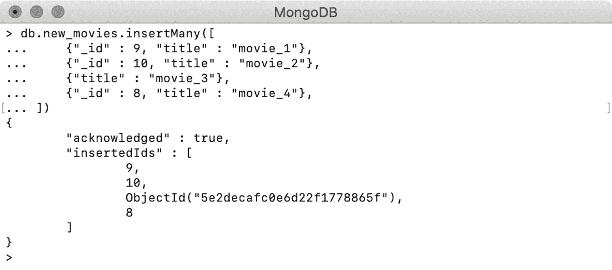
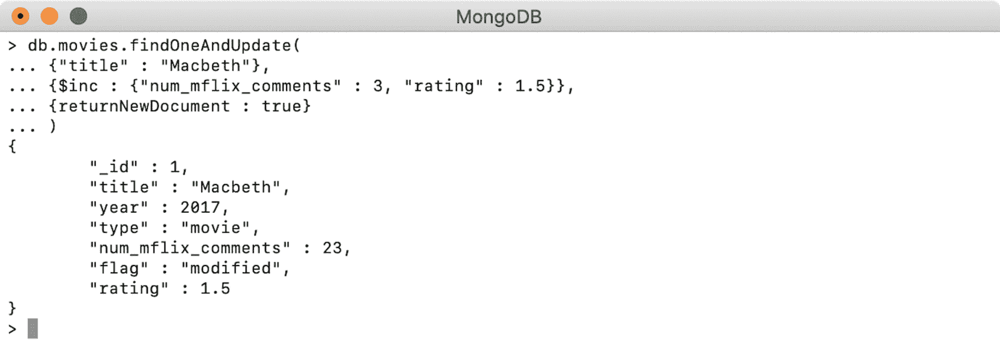
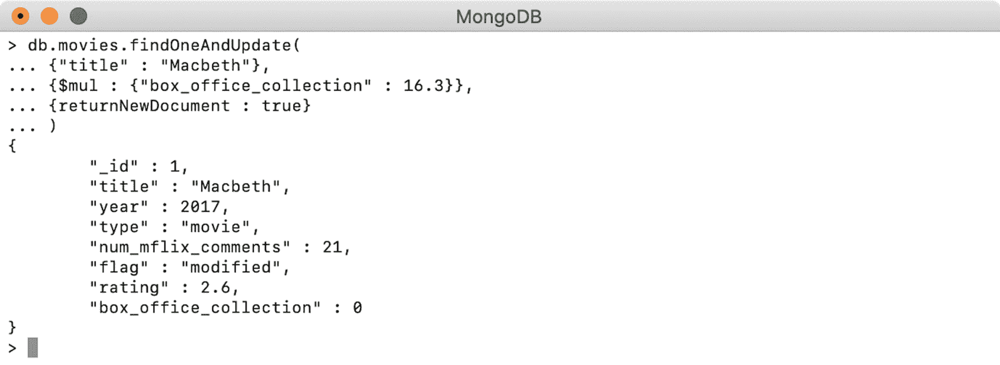
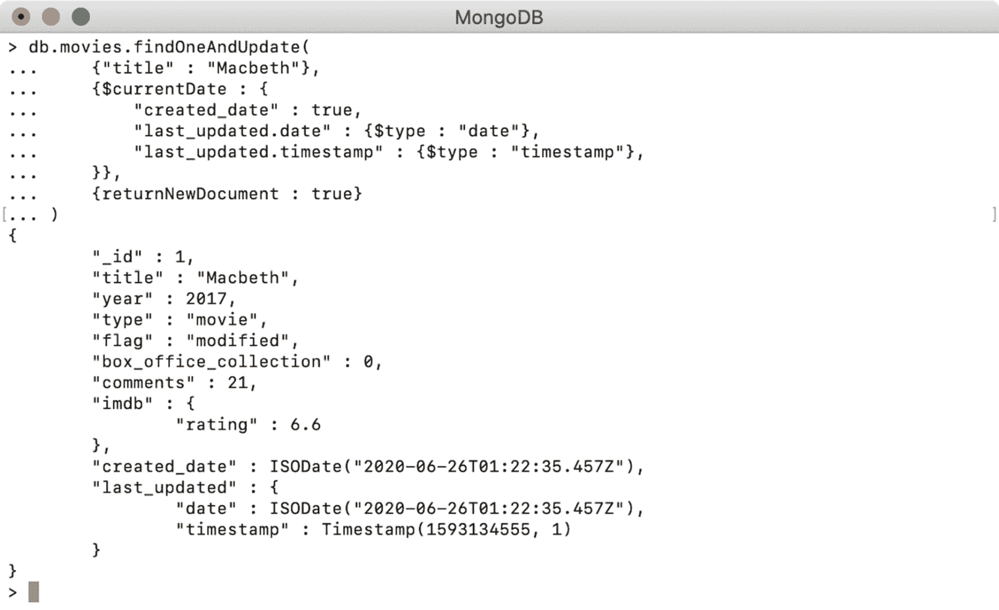
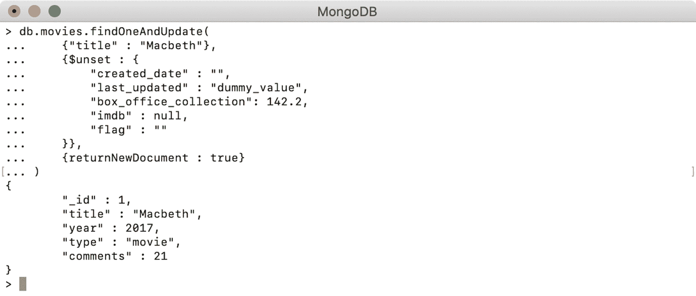
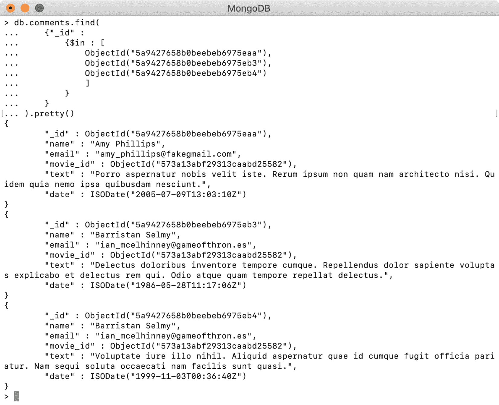

# 5。插入、更新和删除文档

概述

本章向您介绍 MongoDB 中的核心操作，即在集合中插入、更新和删除文档。您将学习如何在 MongoDB 集合中插入单个文档或一批多个文档。您将添加或自动生成一个**字段，替换现有文档，并更新现有集合文档中的特定字段。最后，您将了解如何删除集合中的所有文档或特定文档。**

 **# 导言

在前几章中，我们介绍了各种数据库命令和查询。我们学习了准备查询条件，并使用它们来查找或计算匹配的文档。我们还学习了在字段、嵌套字段和数组上使用各种条件运算符、逻辑运算符和正则表达式。除此之外，我们还学习了如何格式化、跳过、限制和排序结果集中的文档。

现在，您已经知道如何从集合中正确查找和表示所需的文档，下一步是学习如何修改集合中的文档。在任何数据库管理系统上工作时，都需要修改基础数据。考虑一下：你正在管理我们的电影数据集，并且经常需要在发布时向集合中添加新电影。您还需要从数据库中永久删除一些电影或删除错误插入的电影。在一段时间内，一些电影可能会获得新的奖项、评论和评级。在这种情况下，您需要修改现有电影的详细信息。

在本章中，您将学习如何创建、删除和更新集合中的文档。我们将首先创建新的集合，向集合中添加一个或多个文档，并考虑唯一主键的重要性。然后我们将介绍从集合中删除所有文档或特定文档，以及 MongoDB 提供的各种删除功能及其特性。接下来，您将学习如何替换集合中的现有文档，并了解 MongoDB 如何保持主键不变。您还将看到如何使用 replace 操作执行更新或插入，这也称为 upsert。最后，您将学习修改文档。MongoDB 提供了各种更新功能和广泛的更新操作符，可用于特定需求。我们将深入介绍所有这些功能，并与操作员一起实践。

# 插入文件

在本节中，您将学习在 MongoDB 集合中插入新文档。MongoDB 集合提供了一个名为**insert（）**的函数，用于在集合中创建新文档。函数在集合上执行，并将要插入的文档作为参数。此函数的语法显示在下一个命令中：

```js
db.collection.insert( <Document To Be Inserted>)
```

要在示例中看到这一点，请打开 mongo Shell，连接到数据库集群，并使用**use CH05**命令创建一个新数据库。您可以根据自己的喜好为数据库指定不同的名称。如果此命令中提到的数据库之前不存在，则将创建该数据库。在下面的操作中，我们正在插入一个带有**标题**字段和**id**的电影，并在下一行打印输出：

```js
> db.new_movies.insert({"_id" : 1, "title" : "Dunkirk"})
WriteResult({ "nInserted" : 1 })
```

笔记

在本章中，我们将插入、更新和删除集合中的大量文档，我们不希望损坏现有的**样本**数据集。因此，我们正在创建一个不同的数据库，并在本章中使用它。练习和活动侧重于真实场景，因此将使用**样本**数据集。

这个 mongo shell 代码段显示了**insert**命令的执行情况以及下一行的结果。结果（**WriterResult**显示成功插入了一条记录。首先执行一个**find（）**查询，确认记录是否按照我们的要求创建：

```js
> db.new_movies.find({"_id" : 1})
{ "_id" : 1, "title" : "Dunkirk" }
```

前面的查询及其输出验证了文档的正确插入。然而，请注意，**新电影**的收藏从未出现过，我们也没有创造它。文件到哪里去了？

要找到它，您需要在 shell 上执行**show collections**命令。此命令打印当前数据库中所有集合的名称：

```js
> show collections
new_movies
```

前面的片段显示数据库中添加了一组新的**新电影**。这证明，当执行文档**insert**命令时，如果给定集合不存在，MongoDB 也将创建该集合。

笔记

插入新文档时，MongoDB 不会验证集合的名称。集合名称中的键入将导致文档被添加到一个全新的集合中。此外，默认情况下，MongoDB 没有任何与集合关联的模式。因此，通过提供错误的集合名称，您可能会意外地将文档添加到任何其他现有集合中，MongoDB 不会抱怨。这就是为什么在**insert**命令中应该始终注意集合名称的原因。

## 插入多个文档

当一个集合中需要插入多个文档时，可以多次调用前面章节中看到的**insert（）**函数，如下图：

```js
db.new_movies.insert({"_id": 2, "title": "Baby Driver"})
db.new_movies.insert({"_id": 3, "title": "title" : "Logan"})
db.new_movies.insert({"_id": 4, "title": "John Wick: Chapter 2"})
db.new_movies.insert({"_id": 5, "title": "A Ghost Story"})
```

MongoDB 集合还提供了**insertMany（）**函数，该函数专门用于将多个文档插入集合中。如下面的语法所示，此函数接受包含一个或多个要插入的文档的数组的一个参数：

```js
db.movies.insertMany(< Array of One or More Documents>)
```

要使用此函数，请创建要插入的所有文档的数组，然后将此数组传递给函数。相同四部电影的阵列如下所示：

```js
[
    {"_id" : 2, "title": "Baby Driver"},
    {"_id" : 3, "title": "Logan"},
    {"_id" : 4, "title": "John Wick: Chapter 2"},
    {"_id" : 5, "title": "A Ghost Story"}
]
```

现在，将以下四部新电影插入到收藏中：

```js
db.new_movies.insertMany([
    {"_id" : 2, "title": "Baby Driver"},
    {"_id" : 3, "title": "Logan"},
    {"_id" : 4, "title": "John Wick: Chapter 2"},
    {"_id" : 5, "title": "A Ghost Story"}
])
```

前面的命令使用**insertMany（）**并将一个包含四个电影的数组传递给它。您可以在下图中看到结果：


图 5.1：使用 insertMany（）传递包含四个电影的数组

前面操作中的结果包含两个内容。第一个字段为**已确认**，其值为**真**。这确认写入操作已成功执行。结果的第二个字段列出了插入文档的所有**ID**。要插入多个文档，最好使用**insertMany（）**函数，因为插入是作为单个操作进行的。另一方面，单独插入每个文档将作为许多不同的数据库命令执行，这将使过程变慢。

笔记

您可以使用函数**insertMany（）**插入任意数量的文档。但是，批量大小不应超过 100000。在 mongo shell 上，如果尝试在单个批中插入 100000 多个文档，则查询将失败。如果使用编程语言执行相同的操作，MongoDB 驱动程序将在内部将单个操作拆分为多个允许大小的批，并执行批插入。

## 插入重复钥匙

在任何数据库系统中，主键在表中总是唯一的。类似地，在 MongoDB 集合中，**\u id**字段表示的值是主键，因此必须是唯一的。如果您尝试插入其密钥已存在于集合中的文档，您将得到一个*重复密钥错误*。

在前面的示例中，我们已经插入了一部电影，其**u id**是**2**。现在我们将尝试在另一个**插入**操作中复制主键：

```js
db.new_movies.insert({"_id" : 2, "title" : "Some other movie"})
```

此**插入**操作将一个虚拟电影插入到集合中，并明确将**id**字段提到为**2**。当执行该命令时，我们会得到一个带有详细消息的重复密钥错误，如下图所示：


图 5.2：重复 id 字段的错误消息

类似地，当给定数组中的一个或多个文档具有重复的**\U id**时，批量插入操作失败。例如，考虑下面的片段：

```js
db.new_movies.insertMany([
    {"_id" : 6, "title" : "some movie 1"}, 
    {"_id" : 7, "title" : "some movie 2"},
    {"_id" : 2, "title" : "Movie with duplicate _id"},
    {"_id" : 8, "title" : "some movie 3"},
])
```

在这里，使用**insertMany（）**操作，您将在收藏中插入四部不同的电影。但是，第三部电影的**id**为**2**，我们知道已经存在另一部具有相同**id**的电影。这会导致错误，如下图所示：


图 5.3：重复 id 字段的错误消息

当您执行该命令时，它将失败并显示详细的错误消息。错误信息清楚地表明**2**的值在**id**字段中重复。但是，**n 插入的**值表示已成功插入两个文档。要确认这一点，您将查询数据库并观察输出：

```js
> db.new_movies.find({"_id" : {$in : [6, 7, 2, 8]}})
{ "_id" : 2, "title" : "Baby Driver" }
{ "_id" : 6, "title" : "some movie 1" }
{ "_id" : 7, "title" : "some movie 2" } 
```

从前面的代码片段中显示的**find（）**命令及其输出，我们可以得出结论，该命令在插入第三个文档时失败。但是，在第三个文档之前插入的文档将保留在数据库中。

## 无 id 插入

到目前为止，我们已经学习了在集合中创建新文档的基础知识。在迄今为止的所有示例中，我们都显式地添加了一个主键（**\U id**字段）。但是，在*第 2 章*、*文档和数据类型*中，我们了解到，在创建新文档时，MongoDB 会验证给定主键的存在性和唯一性，如果主键不存在，数据库会自动生成并添加到文档中。

下面是 mongo shell 的一个片段，其中执行了一个**insert**命令。**insert**命令试图将新电影推送到收藏中，但文档没有**id**字段。下一行的结果显示文档已在集合中成功创建：

```js
> db.new_movies.insert({"title": "Thelma"})
WriteResult({ "nInserted" : 1 })
```

现在，您可以查询新插入的文档，看看它是否有**\u id**字段。为此，请使用**标题**字段的值查询集合：

```js
> db.new_movies.find({"title" : "Thelma"})
{ "_id" : ObjectId("5df6a0e1b32aea114de21834"), "title" : "Thelma" }
```

在前面的代码片段中，结果显示该文档存在于集合中，并向该文档添加了一个自动生成的**字段。正如我们在*第 2 章*、*文档和数据类型*中了解到的，自动生成的主对象是从**ObjectId**构造函数派生的，并且是全局唯一的。批量插入也是如此。例如，考虑下面的片段：**

 **```js
db.new_movies.insertMany([
    {"_id" : 9, "title" : "movie_1"},
    {"_id" : 10, "title" : "movie_2"},
    {"title" : "movie_3"},
    {"_id" : 8, "title" : "movie_4"},
])
```

这里，**insertMany（）**命令正在将四部电影推入收藏。在四个新文档中，第三个文档没有主键；但是，其余文档都有各自的主键。其结果如下所示：



图 5.4：插入没有 _id 的电影

查询的输出表明查询成功，**insertedIds**字段显示除第三个文档外的所有文档都使用给定的密钥插入，并且第三个文档具有自动生成的主键。

在处理数据集时，我们的文档将具有唯一的字段，可以用作主键。主键是能够唯一标识记录的键。MongoDB 的自动生成密钥在唯一性方面很有用，但在各自文档所代表的数据方面却毫无意义。此外，这些自动生成的密钥很长，因此输入或记忆起来很繁琐。因此，我们应该始终尝试使用数据集中已经存在的主键。例如，在用户的数据集中，**电子邮件地址**字段是主键的最佳示例。然而，就电影而言，没有一个领域是独一无二的。因此，对于电影，我们可以使用自动生成的主键。

在本节中，我们介绍了如何在一个集合中创建单个文档以及多个文档。在此期间，我们了解到，在 MongoDB 中，**insert**命令也会创建基础集合（如果它不存在）。我们还了解到，主键在集合中必须是唯一的，如果新文档没有主键，MongoDB 将自动生成并添加它。

# 删除文件

在本节中，我们将了解如何从集合中删除文档。要从集合中删除一个或多个文档，我们必须使用 MongoDB 提供的各种删除功能之一。每个功能都有不同的行为和目的。要从集合中删除文档，我们必须使用其中一个 delete 函数，并提供一个查询条件来指定应该删除哪些文档。让我们详细地看一下这个问题。

## 使用 deleteOne（）删除

顾名思义，函数**deleteOne（）**用于从集合中删除单个文档。它接受表示查询条件的文档。成功执行后，返回一张包含已删除文档总数的文档（由字段**deletedCount**表示）以及操作是否已确认（由字段**Converted**给出）。但是，由于该方法只删除一个文档，**deletedCount**的值始终为一。如果给定的查询条件与集合中的多个文档匹配，则仅删除第一个文档。

要查看此信息，请使用**deleteOne（）**编写一个 delete 命令，并查看结果：

```js
> db.new_movies.deleteOne({"_id": 2})
{ "acknowledged" : true, "deletedCount" : 1 }
```

在前面的代码片段中，您执行了**deleteOne（）**命令，并传递了一个查询条件**{U id:2}**。这意味着您要删除一个文档，**id**的值为**2**。下一行的输出表示删除成功。

## 练习 5.01：删除多个匹配文档中的一个

在本练习中，您将使用与多个文档匹配的查询，并验证执行此操作时仅删除第一个文档。执行以下步骤以完成此练习：

1.  Use a regular expression in a query to match all movies where the **title** field starts with the word **movie**, as follows:

    ```js
    ({"title" : {"$regex": "^movie"}}
    ```

    以下来自 mongo shell 的片段显示，当您在**find（）**查询中使用前面的查询条件时，您会看到四部电影：

    ```js
    > db.new_movies.find({"title" : {"$regex": "^movie"}})
    { "_id" : 9, "title" : "movie_1" }
    { "_id" : 10, "title" : "movie_2" }
    { "_id" : ObjectId("5ef2666a6c3f28e14fddc816"), "title" : "movie_3" }
    { "_id" : 8, "title" : "movie_4" }
    ```

2.  Use the same query condition with **deleteOne()** to match all movies with titles starting with the word **movie**:

    ```js
    > db.new_movies.deleteOne({"title" : {"$regex": "^movie"}})
    { "acknowledged" : true, "deletedCount" : 1 }
    ```

    此处第二行中的输出确认仅成功删除了一个文档。

3.  要查找删除的文档，请对您的收藏执行相同的**find（）**查询：

    ```js
    > db.new_movies.find({"title" : {"$regex": "^movie"}})
    { "_id" : 10, "title" : "movie_2" }
    { "_id" : ObjectId("5ef2666a6c3f28e14fddc816"), "title" : "movie_3" }
    { "_id" : 8, "title" : "movie_4" }
    ```

前面的代码片段确认，尽管所有四个文档都符合查询条件，但只删除第一个文档。

## 使用 deleteMany（）删除多个文档

要删除多个符合给定条件的文档，可以多次执行**deleteOne（）**函数。但是，在这种情况下，每个文档都将在单独的数据库命令中删除，这会降低性能。MongoDB 集合提供功能**deleteMany（）**在一个命令中删除多个文档。

**deleteMany（）**函数必须提供查询条件，所有符合给定查询的单据都将被删除：

```js
> db.new_movies.deleteMany({"title" : {"$regex": "^movie"}})
{ "acknowledged" : true, "deletedCount" : 3 }
```

前面代码段中的**deleteMany（）**命令使用与前面示例中相同的正则表达式。下一行中的输出表示标题以“movie”开头的所有三部电影都将被删除。

这两个 delete 函数在将文档与给定查询表达式相匹配方面的行为类似于查找文档，如前一章所述。传递空查询文档相当于不传递任何筛选器，因此，所有文档都是匹配的。

在以下示例中，两个命令都被赋予了一个空查询文档：

```js
db.new_movies.deleteOne({})
db.new_movies.deleteMany({})
```

**deleteOne（）**函数将删除首先找到的文档。但是，**deleteMany（）**函数将删除集合中的所有文档。同样，以下查询对不存在的字段执行**null**检查。在 MongoDB 中，一个不存在的字段被认为是**null**，因此给定的条件将匹配集合中的所有文档：

```js
db.new_movies.deleteOne({"non_existent_field" : null})
db.new_movies.deleteMany({"non_existent_field" : null})
```

笔记

与查找文档不同，删除操作是**写入**操作，它们会永久更改集合的状态。因此，在编写包含空检查的查询条件时，应始终确保字段名中没有输入错误。字段名不正确可能导致从集合中删除所有文档。

## 使用 findOneAndDelete（）删除

除了我们前面看到的两种删除方法外，还有另一个名为**findOneAndDelete（）**的函数，如名称所示，它从集合中查找并删除一个文档。尽管其行为类似于**deleteOne（）**函数，但它还提供了一些选项：

*   它找到一个文档并将其删除。
*   如果找到多个文档，则仅删除第一个文档。
*   一旦删除，它会将删除的文档作为响应返回。
*   在多个文档匹配的情况下，**排序**选项可用于影响删除哪个文档。
*   投影可用于在响应文档中包括或排除字段。

在这里，使用**findOneAndDelete（）**删除一条记录，并将删除的文档作为响应：

```js
> db.new_movies.findOneAndDelete({"_id": 3})
{ "_id" : 3, "title" : "Logan" }
```

在前面的代码段中，delete 命令通过其**\u id**查找文档。下一行中的响应显示已删除的文档已在响应中返回。这是一个非常有用的特性。首先，因为它清楚地表明了哪些记录被匹配和删除。其次，它允许您进一步处理已删除的记录。在某些情况下，您可能希望将记录存储在存档集合中，或者您可能希望将此删除通知其他系统。如果查询匹配多个文档，则只删除第一个文档。但是，您可以使用选项对匹配的文档进行排序，并控制删除哪个文档，如以下代码段所示：

```js
db.new_movies.insertMany([
  { "_id" : 11, "title" : "movie_11" },
  { "_id" : 12, "title" : "movie_12" },
  { "_id" : 13, "title" : "movie_13" },
  { "_id" : 14, "title" : "movie_14" },
  { "_id" : 15, "title" : "series_15" }
])
```

使用前面的**insert**命令，您已将五个新文档插入到收藏中。在下面的代码段中，您将使用**findOneAndDelete（）**命令，该命令使用正则表达式查找集合中以单词**movie**开头的标题。查询将匹配四个文档；但是，您将按降序对**字段进行排序，以便删除**为 14 的文档：****

 ****```js
> db.new_movies.findOneAndDelete(
      {"title" : {"$regex" : "^movie"}},
      {sort : {"_id" : -1}}
  )
{ "_id" : 14, "title" : "movie_14" }
```

此操作演示排序选项如何影响删除的文档。如果不提供排序选项，**为 11 的单据将被删除。**

 **正如我们所看到的，这个 delete 函数总是在响应中返回已删除的文档。我们还可以使用“投影”选项来控制响应文档中包含或排除的字段：

```js
> db.new_movies.findOneAndDelete(
      {"title" : {"$regex" : "^movie"}},
      {sort : {"_id" : -1}, projection : {"_id" : 0, "title" : 1}}
  )
{ "title" : "movie_13" }
```

在这个 delete 命令中，我们使用了投影选项，以便在响应中只包含**title**字段。下一行的输出确认删除成功，响应的文档仅显示**标题**字段。

## 练习 5.02：删除低评级电影

您组织中的电影档案团队是确保数据库中存在最高评级电影的团队。为了改善用户体验，他们希望经常对数据库执行质量检查，并删除收视率最低的电影。为了衡量质量，他们想考虑 IMDB 评级和总票数，因为更高的投票数意味着更可靠的评级。

基于此，他们要求您删除一部 IMDb 票数高、平均收视率低、低收视率电影列表中获奖最少的电影。本练习的任务是连接到**示例 _mflix**集群并执行删除命令，以便删除获奖最少、IMDb 评级低于 2、投票数超过 50000 的电影。然后，记录被删除电影的**标题**和**id**。以下步骤将帮助您完成此练习：

1.  As you have to delete one movie, you can use either the **deleteOne()** or **findOneAndDelete()** function and prepare a query filter using the IMDb rating and votes. However, to ensure that the movie with the least awards gets deleted, you need to sort the films in ascending order of awards won and let the first movie in the resulting list be deleted. This means you will need to use **findOneAndDelete()**. First, open any text editor and start writing the query. Begin by writing the query filter. The first condition is to find movies with less than a two-point rating in IMDb:

    ```js
    ("imdb.rating" : {$lt : 2}}
    ```

    IMDb 评级是一个嵌套字段；因此，您将使用点符号访问该字段，然后使用**$lt**运算符写入条件。

2.  Next, the second condition says the total number of IMDb votes should be more than 50,000\. Add this condition to your query:

    ```js
    ("imdb.rating" : {$lt : 2}, "imdb.votes" : {$gt : 50000}}
    ```

    第二个条件使用**$gt**运算符表示。

3.  Now, write a **findOneAndDelete()** function and add the preceding query into it:

    ```js
    db.movies.findOneAndDelete(
      {"imdb.rating" : {$lt : 2}, "imdb.votes" : {$gt : 50000}}
    )
    ```

    前面的命令将查找收视率低于 2 星级且票数超过 50000 的电影，并删除第一部。但是，您还希望确保删除奖励最少的电影。

4.  To delete the movie with the least awards won, add a **sort** option:

    ```js
    db.movies.findOneAndDelete(
      {"imdb.rating" : {$lt : 2}, "imdb.votes" : {$gt : 50000}},
      {"sort" : {"awards.won" : 1}}
    )
    ```

    此命令按获奖的升序对过滤后的电影进行排序。

5.  Now, add a projection option to return only the **_id** and **title** field of the deleted movie:

    ```js
    db.movies.findOneAndDelete(
      {"imdb.rating" : {$lt : 2},"imdb.votes" : {$gt : 50000}},
      {
        "sort" : {"awards.won":1},
        "projection" : {"title" : 1}
      }
    )
    ```

    前面的命令有一个投影选项，其中显式包括**标题**字段。这意味着将排除所有其他字段，而默认情况下包括**【U id】**。

6.  Finally, open the mongo shell and connect to the Atlas cluster. Use the **sample_mflix** database and execute the preceding command. You should see the following output:

    

图 5.5：删除低分级电影

如前面的输出所示，该命令已成功执行。响应中返回的文档正确包含删除电影的**id**和**标题**。

在本练习中，您使用了其中一个 delete 函数从现实世界的电影集合中正确删除特定记录。

# 更换文件

在本节中，您将了解如何完全替换集合中的文档。

有时，您可能需要替换集合中错误插入的文档。或者考虑到，通常存储在文档中的数据随时间而变化。或者，为了支持产品的新需求，您可能需要更改文档的结构方式或更改文档中的字段。在所有这些情况下，您都需要替换文档。

在上一节中，我们使用了一个新的数据库**CH05**，我们将在本节中继续使用该数据库。在同一数据库中，创建一个名为**users**的集合，并在其中插入几个用户，如下所示：

```js
> db.users.insertMany([
  {"_id": 2, "name": "Jon Snow", "email": "Jon.Snow@got.es"},
  {"_id": 3, "name": "Joffrey Baratheon", "email":     "Joffrey.Baratheon@got.es"},
  {"_id": 5, "name": "Margaery Tyrell", "email":     "Margaery.Tyrell@got.es"},
  {"_id": 6, "name": "Khal Drogo", "email": "Khal.Drogo@got.es"}
])
{ "acknowledged" : true, "insertedIds" : [ 2, 3, 5, 6 ] }
```

您可以看到该命令已成功，并添加了四个用户。在继续之前，请快速使用**find（）**命令，确保集合中除了新插入的文档外，没有其他文档：

```js
> db.users.find()
{ "_id" : 2, "name" : "Jon Snow", "email" : "Jon.Snow@got.es" }
{ "_id" : 3, "name" : "Joffrey Baratheon", "email" :   "Joffrey.Baratheon@got.es" }
{ "_id" : 5, "name" : "Margaery Tyrell", "email" :   "Margaery.Tyrell@got.es" }
{ "_id" : 6, "name" : "Khal Drogo", "email" : "Khal.Drogo@got.es" }
```

在前面代码段中的文档中，每个用户都有一个唯一的 ID、名称和电子邮件地址。现在，假设用户**Margaery Tyrell**与**Joffrey Baratheon**结婚，并希望将自己的姓氏改为丈夫的姓氏。要做到这一点，你必须改变她的名字以及她的电子邮件。

根据要求，**Margaery Tyrell**的新记录如下：

```js
{"_id": 5, "name": "Margaery Baratheon", "email": "Margaery.Baratheon@got.es"}
```

为了替换集合中的单个文档，MongoDB 提供了方法**replaceOne（）**，该方法接受查询过滤器和替换文档。函数将查找与条件匹配的文档，并用提供的文档替换它。以下示例演示了这一点：

```js
> db.users.replaceOne(
  {"_id" : 5},
  {"name": "Margaery Baratheon", "email": "Margaery.Baratheon@got.es"}
)
{ "acknowledged" : true, "matchedCount" : 1, "modifiedCount" : 1 }
```

这里，第一个参数是用于标识要替换的文档的查询过滤器，第二个参数是新文档。输出清楚地表明给定的查询匹配了一个文档，并且更新了一个文档。查询筛选器不一定总是**\u id**字段。它可以是使用任何字段或多个字段和运算符的组合进行筛选的任何查询。例如，只要只有一个名为**Margaery Tyrell**的用户，下面的 replace 命令将与前面的命令具有相同的效果。如果有多个文档与查询匹配，则仅替换第一个文档：

```js
db.users.replaceOne(
  {"name": "Margaery Tyrell },
  {"name": "Margaery Baratheon", "email": "Margaery.Baratheon@got.es"}
)
```

### \u id 字段是不可变的

在前面的示例中，您会注意到替换文档中没有**\U id**字段。在这种情况下，您认为 MongoDB 必须添加并自动生成主键字段吗？查询文档并找出：

```js
> db.users.find({"name" : "Margaery Baratheon"})
{"_id": 5, "name": "Margaery Baratheon", "email":   "Margaery.Baratheon@got.es" }
```

前面的输出表示原始文档的**id**保留在新文档中。

这是因为在 MongoDB 中，**\u id**字段是不可变的。不可变字段与普通字段类似；但是，一旦指定了值，就不能再次更改其值。**字段作为文档的唯一标识符，因此只要文档存在，就不应更改。**

 **它类似于您在各种在线门户上创建的用户帐户，其中您的用户名是您的唯一标识符。您可以更改密码或个人资料中的任何其他信息，但是，大多数门户不允许您更改用户名。即使他们允许你修改你的用户名，旧用户名也不能分配给任何人，因为可能有人仍然知道你的旧用户名。

这就是为什么 MongoDB 中的**字段是不可变的理论。但是，请尝试修改字段并观察发生的情况：**

 **```js
db.users.replaceOne(
  {"name" : "Margaery Baratheon"},
  {"_id": 9, "name": "Margaery Baratheon", "email":     "Margaery.Baratheon@got.es"}
)
```

在这里，replace 命令找到一个名为**Margaery Baratheon**的文档。在替换文档中，它还为**字段提供了一个新值：**

 **

图 5.6：修改 _id 时的错误

在本例中，您执行了一个 replace 命令，如前面的代码段所示，其中替换文档现在有一个显式的**\u id**字段。命令失败，并显示一条非常详细的错误消息。前面的快照突出显示了错误消息的最重要部分，这表明该字段是不可变的。因此，更新被回滚，记录没有发生任何更改。

## 使用 Replace 向上插入

在前面的部分中，我们了解到可以在集合中找到现有文档并用新文档替换它。但是，有时您希望用新文档替换现有文档，如果该文档不存在，请插入新文档。此操作称为更新（如果找到）或插入（如果找不到），进一步缩短为 upsert。Upsert 是许多数据库提供的功能，MongoDB 也支持它。

### 为什么要使用 Upsert？

对于我们上面看到的简单场景，upsert 听起来有点不必要，尤其是当可以使用两个不同的命令轻松执行相同的操作时。例如，我们可以首先执行 replace 命令并检查结果。匹配计数的值将指示是否在集合中找到文档。如果找不到文档，我们可以执行一个**insert**命令。

然而，在现实世界中，您将主要大量地执行这些操作。考虑您的系统接收来自用户服务器的每日更新，服务器向您发送在一天中被修改的所有文档。这些每日更新可能包括与服务器注册的新用户的记录以及对现有用户配置文件的更改。在大型系统中，对每个记录执行两步更新或插入操作将非常耗时且容易出错。但是，有了专用命令，您只需为接收到的每个记录准备并执行 upsert 命令，然后让 MongoDB 进行更新或插入。

请考虑下面的记录：

```js
> db.users.find()
{"_id": 2, "name": "Jon Snow", "email": "Jon.Snow@got.es"}
{"_id": 3, "name": "Joffrey Baratheon", "email":   "Joffrey.Baratheon@got.es"}
{"_id": 5, "name": "Margaery Baratheon", "email":   "Margaery.Baratheon@got.es"}
{"_id": 6, "name": "Khal Drogo", "email": "Khal.Drogo@got.es"}
```

在一集的结尾，乔弗里国王被杀了。因此，**玛加里**想改用她的旧姓，**汤门·巴拉森**成为新国王。您从用户服务器收到的更新包含**Margaery**的更新记录和**Tommen**的新记录，如下所示：

```js
{"name": "Margaery Tyrell", "email": "Margaery.Tyrell@got.es"}
{"name": "Tommen Baratheon", "email": "Tommen.Baratheon@got.es"}
```

在以下命令中，您传递了一个额外的参数**{upsert:true}**，该参数使这些命令向上插入命令：

```js
db.users.replaceOne(
  {"name" : "Margaery Baratheon"},
  {"name": "Margaery Tyrell", "email": "Margaery.Tyrell@got.es"},
  { upsert: true }
)
db.users.replaceOne(
  {"name" : "Tommen Baratheon"},
  {"name": "Tommen Baratheon", "email": "Tommen.Baratheon@got.es"},
  { upsert: true }
)
```

在 mongo shell 上逐个执行命令时，会看到以下输出：


图 5.7：upsert 操作的输出

第一次向上插入的结果表明找到了匹配项，并且文档已更新。但是，第二个表示未找到匹配项，并且使用自动生成的主键更新了一个新文档。

## 使用 findOneAndReplace（）进行更换

我们已经看到了**replaceOne（）**函数，它在成功执行后返回匹配和更新文档的计数。MongoDB 提供了另一个操作**findOneAndReplace（）**来执行相同的操作。然而，它提供了更多的选择。其主要特点如下：

*   正如名称所示，它查找一个文档并替换它。
*   如果找到多个与查询匹配的文档，将替换第一个文档。
*   如果匹配了多个文档，则可以使用排序选项来影响替换哪个文档。
*   默认情况下，它返回原始文档。
*   如果设置了**{returnNewDocument:true}**选项，则会返回新添加的文档。
*   字段投影可用于在响应返回的文档中仅包括特定字段。

要查看**findOneAndReplace（）**函数的运行情况，请向电影集添加五个文档：

```js
db.movies.insertMany([
    { "_id": 1011, "title" : "Macbeth" },
    { "_id": 1513, "title" : "Macbeth" },
    { "_id": 1651, "title" : "Macbeth" },
    { "_id": 1819, "title" : "Macbeth" },
    { "_id": 2117, "title" : "Macbeth" }
])
```

现在，假设这五部电影，都有相同的**标题**，在不同的日历年发行和插入。最初插入这些记录时，未添加发布年份的字段。因此，要查找具有此**标题**的最新电影，需要使用增量**id**字段，其中**id**值最大的电影是最新的电影。为了使以后的查找查询更简单，我们已指示您查找具有此**标题**的最新电影的文档，并在该文档中添加一个**latest:true**标志。因此，当有人试图查找该电影时，他们可以通过此附加过滤器以获取响应中的最新电影，如下所示：

```js
db.movies.findOneAndReplace(
    {"title" : "Macbeth"},
    {"title" : "Macbeth", "latest" : true},
    {
        sort : {"_id" : -1},
        projection : {"_id" : 0}
    }
)
```

在前面的代码片段中，您找到了电影的文档，其标题为**标题为**，并将其替换为另一个文档，该文档包含一个附加字段，即**latest:true**。除此之外，该命令还使用了**排序**选项，使得具有最大值**\u id**的记录显示在顶部。该命令还使用投影选项在响应中仅包括**标题**字段。结果如下：


图 5.8:findOneAndReplace 命令的输出

前面的快照确认操作成功，响应中包含旧文档的**标题**。或者，如果需要在响应中获取更新的文档，可以使用命令中的**returnNewDocument**标志。将此标志设置为 true 将从集合中返回替换的文档，如下所示：

```js
db.movies.findOneAndReplace(
    {"title" : "Macbeth"},
    {"title" : "Macbeth", "latest" : true},
    {
        sort : {"_id" : -1},
        projection : {"_id" : 0},
        returnNewDocument : true
    }
)
```

这个 replace 命令的工作原理与前一个类似，但唯一的区别是它使用了一个额外的选项**returnNewDocument**，该选项被设置为**true**：


图 5.9：将 returnNewDocument 设置为 true 后的输出

此输出显示将**returnNewDocument**标志设置为**true**后返回新文档。现在，快速查询数据库并查看 replace 命令是否确实有效：

```js
> db.movies.find({"title" : "Macbeth"})
{ "_id" : 1011, "title" : "Macbeth" }
{ "_id" : 1513, "title" : "Macbeth" }
{ "_id" : 1651, "title" : "Macbeth" }
{ "_id" : 1819, "title" : "Macbeth" }
{ "_id" : 2117, "title" : "Macbeth", "latest" : true }
```

前面的输出显示最新记录现在具有所需的标志。

## 替换与删除和重新插入

正如我们在前面几节中所看到的，有专门的函数来查找和替换集合中的文档。可以使用“删除”和“插入”组合替换文档，即删除现有文档并插入新文档。删除和**插入**组合的两步操作得到相同的结果；让我们看看如何。

要执行这两个步骤，使用 delete 和**insert**替换操作，请使用在**findOneAndReplace（）**部分中看到的相同示例。

首先，从集合中删除以前插入或修改的所有文档：

```js
> db.movies.deleteMany({})
{ "acknowledged" : true, "deletedCount" : 5 }
```

现在，再次插入五个文档：

```js
db.movies.insertMany([
    { "_id": 1011, "title" : "Macbeth" },
    { "_id": 1513, "title" : "Macbeth" },
    { "_id": 1651, "title" : "Macbeth" },
    { "_id": 1819, "title" : "Macbeth" },
    { "_id": 2117, "title" : "Macbeth" }
])
```

现在，找到名为**麦克白**的最新电影的文档，并在其中添加标志**“latest”：true**：

```js
var deletedDocument = db.movies.findOneAndDelete(
                          {"title" : "Macbeth"},
                          {sort : {"_id" : -1}}
    )
db.movies.insert(
  {"_id" : deletedDocument._id, "title" : "Macbeth", "latest" : true}
)
```

此代码段显示了两个不同的命令。第一个是一个**findOneAndDelete（）**命令，该命令根据电影的**标题**查找电影，并使用排序选项，以便仅删除具有最大**id**的电影。删除操作的结果（即已删除的文档）存储在变量**deletedDocument**中。

前面代码段中的下一个命令是一个插入操作，该操作将重新插入相同的电影以及标记**latest:true**。在执行此操作时，它使用已删除文档中的**\U id**值，以便使用相同的主键插入新记录：


图 5.10：先删除后插入的输出

前面的输出表示您已按顺序执行了这两个命令，响应显示一个文档已成功插入，可以使用**查找**操作进行验证：

```js
> db.movies.find()
{ "_id" : 1011, "title" : "Macbeth" }
{ "_id" : 1513, "title" : "Macbeth" }
{ "_id" : 1651, "title" : "Macbeth" }
{ "_id" : 1819, "title" : "Macbeth" }
{ "_id" : 2117, "title" : "Macbeth", "latest" : true }
```

对集合进行的**查找**操作的结果证实，两步更换操作工作正常。

虽然结果完全相同，但两步操作更容易出错。两步操作执行两个完全不同的命令，一个接一个。在第一个命令中，MongoDB 客户机或编程语言的驱动程序向服务器发送**delete**命令。然后，服务器验证并处理该命令以删除该文档。然后，删除的文档通过网络发送回客户端。然后，客户机或驱动程序将返回的结果解析为特定于语言的对象。在我们的例子中，我们正在执行来自 mongo shell 的命令，因此结果被解析为 JSON 格式并存储在变量**deleteDocument**中。

接下来，您的 MongoDB 客户端或驱动程序发送另一个命令来插入新文档。在我们的例子中，新文档是 JSON 格式的，它被转换成 BSON 并通过网络发送到服务器。对于 MongoDB 服务器，这个**insert**命令与任何其他新的**insert**命令一样。服务器执行文档的初始验证，检查**\u id**字段是否存在，并验证集合中值的唯一性。如果发现文档有效，则会进行插入。

既然您已经熟悉了两步替换操作的细节，那么考虑使用专用替换函数的潜在缺点：

1.  首先，在 delete-and-insert 方法中，数据通过导线传输多次。这涉及驱动程序或客户端在多个阶段解析数据。这将降低整体性能。
2.  当多个客户端不断地读写您的集合时，可能会出现并发问题。例如，假设您已成功删除一条记录，并且在插入新记录之前，其他一些客户端意外地插入了一条具有相同**\u id**的不同记录。
3.  您的数据库客户端或驱动程序可能在两个操作的中间丢失与数据库的连接。例如，删除操作成功，但无法插入。为了避免此类问题，您必须在事务中运行命令，以便一个操作的失败可以恢复同一事务中以前成功的操作。

另一方面，专用的替换函数实际上是原子函数，因此在并发环境中使用是安全的。原子操作是不能进一步划分的最小操作单元。因此，当执行原子操作时，它作为单个单元一次性执行。因此，与删除和插入组合相比，专用替换功能更安全。

专用功能首先查找要替换的文档并将其锁定。只有在操作完成后，锁才会释放。因此，在锁定特定文档时，没有其他客户端或进程能够修改该文档。此外，replace 操作仅替换文档中的其余字段，保持**\U id**未被触及。其他进程不可能推送具有相同**\u id**值的不同文档。

因此，最好使用 MongoDB 提供的特殊功能。

# 修改字段

在前面的章节中，我们了解到，一旦插入 MongoDB 集合中的任何文档，我们都可以替换它。在替换操作期间，数据库中的文档将被替换为一个全新的文档，同时保留相同的主键。当涉及到纠正错误和合并数据更改或更新时，替换操作非常有用。但是，在大多数情况下，更新只会影响文档的一个或几个字段。想想**示例 _mflix**数据集中的任何电影记录，其中的大部分字段（如标题、演员、导演、持续时间等）可能永远不会更改。然而，在一段时间内，这部电影可能会收到新的评论、新的评论和评级。

当文档的所有或大部分字段都被修改时，查找和替换操作非常有用。但是，使用它只更新文档中的特定字段并不容易。为此，您提供的替换文档将需要所有未更改的字段及其现有值，更改的字段及其新值。对于较小的文档，这听起来不是问题，但是对于较大的文档，如我们的电影记录，该命令将非常庞大且容易出错。我们将通过一个不在数据库上执行的命令示例来了解这一点。

假设数据库中添加了一条电影记录，但字段**year**的值不正确。下面是一个示例，说明了如果使用“替换”操作更正该值，该命令的外观。在第一条语句中，我们找到电影文档并将其分配给一个变量。接下来是实际的 replace 命令，其中需要提供替换文档及其所有字段。我们使用在第一行中指定的变量**movie**，并引用其所有未更改的字段。替换单据的最后一个字段为**年**字段，新值为：

```js
// Find the movie and assign it to a variable
var movie = db.movies.findOne({"title" : "The Italian"})
// A replace function that keeps all the fields same except "year"
db.movies.replaceOne(
  {"title" : "The Italian"},
  {
    "plot" : movie.plot,
    "genres" : movie.genres,
    "runtime" : movie.runtime,
    "rated" : movie.rated,
    "cast" : movie.cast,
    "title" : movie.title,
    "fullplot" : movie.fullplot,
    "language" : movie.language,
    "released" : movie.released,
    "directors" : movie.directors,
    "writers" : movie.writers,
    "awards" : movie.awards,
    "imdb" : movie.imdb,
    "countries" : movie.countries,
    "type" : movie.type,
    "tomatoes" : movie.tomatoes,
    "year" : 1915
  }
)
```

这个命令的问题是它太大了，特别是因为我们只想更新一个字段。它会重新输入所有字段，即使它们没有更改，并且在重新分配未更改的字段值时，很有可能会出现输入错误。此外，这是一个两步操作，并引入了难以调试的并发问题。

为了理解并发性问题，假设第一条语句中的 find 操作成功，下一条语句是 replace 命令，它引用了现有文档中所有未更改的字段；但在执行第二条语句之前，数据库中的实际文档被其他客户机或线程修改。执行语句后，由其他客户端添加的更新将永远丢失。

这就是为什么只有在修改所有或大部分字段时才应使用替换操作。为了修改文档的一个或几个字段，MongoDB 提供了**更新**命令。让我们在下一节中探讨这一点。

## 使用 updateOne（）更新文档

要更新集合中单个文档的字段，可以使用函数**updateOne（）**。此函数由 MongoDB collections 提供，它接受一个查询条件来查找要更新的记录，以及一个指定字段级更新表达式的文档。函数的第三个参数是提供杂项选项，是可选的。此函数的语法如下所示：

```js
db.collection.updateOne(<query condition>,   <update expression>, <options>)
```

与 replace 命令一样，**updateOne（）**不能用于更新文档的**id**字段，因为它是不可变的。执行更新后，它将以文档的形式返回一个详细的结果，该结果指示匹配了多少条记录以及更新了多少条记录。

在使用此功能之前，首先从集合中删除以前插入和修改的所有记录：

```js
> db.movies.deleteMany({})
{ "acknowledged" : true, "deletedCount" : 5 }
```

现在，使用以下**insert**命令向集合中添加四条新记录：

```js
> db.movies.insertMany([
  {"_id": 1, "title": "Macbeth", "year": 2014, "type": "series"}, 
  {"_id": 2, "title": "Inside Out", "year": 2015,     "type": "movie", "num_mflix_comments": 1},
  {"_id": 3, "title": "The Martian", "year": 2015,     "type": "movie", "num_mflix_comments": 1},
  {"_id": 4, "title": "Everest", "year": 2015,     "type": "movie", "num_mflix_comments": 1}
])
{ "acknowledged" : true, "insertedIds" : [ 1, 2, 3, 4 ] }
```

编写并执行您的第一个更新命令，以更改电影**麦克白**的**年**字段：

```js
db.movies.updateOne(
    {"title" : "Macbeth"},
    {$set : {"year" : 2015}}
)
```

在前面的命令中，**updateOne（）**函数的第一个参数是查询条件，其中指定电影的名称应该是**Macbeth**。第二个参数是指定**年**的新字段及其值的文档。在这里，我们使用一个新的操作符**$set**，为文档中提供的字段赋值。在接下来的章节中，我们将了解更多关于**$set**操作符以及所有更新函数支持的其他一些操作符的信息。

在 mongo shell 上执行命令时，输出如下所示：

```js
> db.movies.updateOne(
  {"title" : "Macbeth"},
  {$set : {"year" : 2015}}
)
{ "acknowledged" : true, "matchedCount" : 1, "modifiedCount" : 1 }
```

输出是一个表示以下内容的文档：

*   **“确认”：true**表示已执行并确认更新。
*   **“matchedCount”：1**显示为更新找到并选择的文档数（本例中为 1）
*   **“修改数”：1**表示修改的单据数（本例为 1）

以下查询和随后的输出确认 update 命令已正确执行：

```js
> db.movies.find({"title" : "Macbeth"})
{ "_id" : 1, "title" : "Macbeth", "year" : 2015, "type" : "series" }
```

在上一条记录中，**年**字段正确设置为**2015**，之前为**2014**。如果我们再次执行相同的命令，则不会执行更新，因为该值已经是**2015**：

```js
> db.movies.updateOne(
    {"title" : "Macbeth"},
    {$set : {"year" : 2015}}
)
{ "acknowledged" : true, "matchedCount" : 1, "modifiedCount" : 0 }
```

*图 5.12*显示再次执行同一更新命令的输出。生成的文档表明有一个文档符合更新条件；但是，没有更新任何文件。

### 修改多个字段

我们用来更新文档字段的**$set**操作符也可以用来修改文档的多个字段。如前面的示例所示，**$set**提供了一个包含更新表达式的文档。类似地，要修改多个字段，更新表达式可以包含多个字段和值对。例如，考虑这个片段：

```js
db.movies.updateOne(
  {"title" : "Macbeth"},
  {$set : {"type" : "movie", "num_mflix_comments" : 1}}
)
```

在前面的操作中，更新表达式**{“type”：“movie”，“num_mflix_comments”：1}}**指定了两个字段及其值。其中，**num_mflix_comment**字段在相应的电影中不存在。对我们的电影集执行命令并查看输出：

```js
> db.movies.updateOne(
  {"title" : "Macbeth"},
  {$set : {"type" : "movie", "num_mflix_comments" : 1}}
)
{ "acknowledged" : true, "matchedCount" : 1, "modifiedCount" : 1 }
```

上图显示操作已成功，并按预期修改了一条记录。现在，查询文档并查看字段是否正确修改：

```js
> db.movies.find({"title" : "Macbeth"}).pretty()
{
  "_id" : 1,
  "title" : "Macbeth",
  "year" : 2015,
  "type" : "movie",
  "num_mflix_comments" : 1
}
```

集合中的文档表明电影类型已正确修改，并使用给定值添加了一个名为**num_mflix_comments**的新字段。因此，您已经看到，**$set**可以用于更新同一命令中的多个字段，如果一个字段是新字段，它将以指定的值添加到文档中。

在我们继续下一节之前，重要的是要知道，在更新操作中，多次更新同一字段是有效的，而不管字段的值如何。如前一个输出所示，电影《麦克白》**的**年**字段设置为 2015 年。在同一命令中多次修改同一字段：**

```js
db.movies.updateOne(
  {"title" : "Macbeth"},
  {$set : {"year" : 2015, "year" : 2015, "year" : 2016, "year" : 2017}}
)
```

前面的 update 命令使用**$set**操作符多次设置年份。前两个表达式将字段设置为其当前值；但是，最后两个表达式的值不同。执行命令并观察行为：

```js
db.movies.updateOne(
  {"title" : "Macbeth"},
  {$set : {"year" : 2015, "year" : 2015, "year" : 2016, "year" : 2017}}
)
{ "acknowledged" : true, "matchedCount" : 1, "modifiedCount" : 1 }
```

正如预期的那样，该操作是有效的，并且修改了一个文档。从集合中查询单据，查看**年**字段的值：

```js
> db.movies.find({"title" : "Macbeth"}).pretty()
{
  "_id" : 1,
  "title" : "Macbeth",
  "year" : 2017,
  "type" : "movie",
  "num_mflix_comments" : 1
}
```

在前面的输出中，我们证明了当多次提供同一字段时，更新是从左到右进行的。首先，将**年**字段（已经是 2015 年）设置为 2015 年两次；然后用第三个表达式，将年份设置为 2016 年；最后，最右边的表达式设置为 2017 年。

在任何有效的场景中，您几乎不会在更新操作中两次更新字段。然而，即使您这样做了，也许是偶然的，您现在知道了行为，这将帮助您进行调试。

### 多个单据匹配一个条件

正如**updateOne（）**函数的名称所示，它总是只更新集合中的一个文档。如果给定的查询条件匹配多张单据，则只修改第一张单据：

```js
db.movies.updateOne(
  {"type" : "movie"},
  {$set : {"flag" : "modified"}}
)
```

前面的操作查找**类型**为**电影**的文档，并将**标志**的值设置为**修改**。记住，我们的电影收藏中总共有三个类型为**电影**的文档。在我们的集合上执行命令时，结果如下所示：

```js
db.movies.updateOne(
  {"type" : "movie"},
  {$set : {"flag" : "modified"}}
)
{ "acknowledged" : true, "matchedCount" : 1, "modifiedCount" : 1 }
```

执行的结果表明匹配并选择了一个文档进行更新，并且实际修改了一个文档。因此，它证明了即使有多个文档与给定的查询条件匹配，也只会选择和更新一个文档。

### 使用 updateOne（）更新插入

在上一节中，我们详细了解了 upsert 操作。当执行基于 upsert 的更新时，如果找到文档，将更新文档；但是，如果找不到文档，则会在集合中创建一个新文档。与替换操作类似，**updateOne（）**还通过命令中的附加标志支持 upserts。考虑下面的片段：

```js
db.movies.updateOne(
  {"title" : "Sicario"},
  {$set : {"year" : 2015}}
)
```

前面的操作对电影**Sicario**执行更新命令，该电影在我们的收藏中不存在。在没有任何**upsert**标志的情况下执行命令时，不执行更新：

```js
> db.movies.updateOne(
  {"title" : "Sicario"},
  {$set : {"year" : 2015}}
)
{ "acknowledged" : true, "matchedCount" : 0, "modifiedCount" : 0 }
```

输出表明没有匹配的文档，也没有更新文档。现在，我们将使用**upsert**标志执行相同的命令：

```js
db.movies.updateOne(
  {"title" : "Sicario"},
  {$set : {"year" : 2015}},
  {"upsert" : true}
)
```

前面的操作使用了第三个参数，其中包含一个文档，**upsert**标志设置为**true**，默认为 false。可以在此处看到输出：


图 5.11：使用 upsert 标志更新不存在的影片

因此，这次执行命令的输出略有不同。它表示没有匹配的文档，也没有更新文档。但是，**“upsertedId”：ObjectId（“5e…”）**表示插入了一个带有自动生成主键的文档。

以下查询使用自动生成的主键查找文档。在 shell 上执行此查询时，必须使用在上一个命令中生成的**ObjectId**：

```js
> db.movies.find({"_id" : ObjectId("5ef5484b76db1f20a60917d2")}).pretty()
{
  "_id" : ObjectId("5ef5484b76db1f20a60917d2"),
  "title" : "Sicario",
  "year" : 2015
}
```

当我们使用新创建的主键值查询集合时，我们会得到新插入的记录。

这里需要注意的一点是，新文档有两个字段，其中字段**year**是更新表达式的一部分；然而，**标题**是查询条件的一部分。当 MongoDB 作为**upsert**操作的一部分创建新文档时，它会将更新表达式中的字段以及查询条件组合在一起。

## 使用 findOneAndUpdate（）更新文档

我们已经看到了函数**updateOne（）**，它修改集合中的一个文档。MongoDB 还提供了**findOneAndUpdate（）**函数，它能够完成**updateOne（）**所做的一切，并提供了一些附加功能，我们现在将对此进行探讨。此函数的语法与**updateOne（）**相同：

```js
db.collection.findOneAndUpdate (
  <query condition>, 
  <update expression>, 
  <options>
)
```

**findOneAndUpdate（）**至少需要两个参数，其中第一个是查找要修改的文档的查询条件，第二个是更新表达式。默认情况下，它在响应中返回旧文档。在某些情况下，取回旧文档非常有用，尤其是当它需要归档到某个地方时。但是，通过将标志作为参数传递，可以更改函数的行为以在响应中返回新文档。考虑下面的例子。

我们收藏的电影**麦克白**的记录只有一条评论，由**num_mflix_comments**字段给出。使用 update 命令修改这些注释的计数，如下所示：

```js
db.movies.findOneAndUpdate(
  {"title" : "Macbeth"},
  {$set : {"num_mflix_comments" : 10}}
)
```

前面的命令通过电影的**标题**查找电影，并将**num_mflix_comments**的值设置为 10。我们可以看到，它看起来非常类似于**updateOne（）**命令，对集合的影响将完全相同。然而，我们在这里看到的唯一区别是响应，如下图所示：


图 5.12：使用 fineOneAndUpdate（）进行更新

输出显示，**findOneAndUpdate（）**函数没有返回查询统计信息，例如匹配了多少条记录以及修改了多少条记录。相反，它以旧状态返回文档。现在查询并验证更新是否成功：

```js
> db.movies.find({"title" : "Macbeth"}).pretty()
{
  "_id" : 1,
  "title" : "Macbeth",
  "year" : 2017,
  "type" : "movie",
  "num_mflix_comments" : 10,
  "flag" : "modified"
}
```

此处的查询及其输出确认注释数已修改为其新值。

### 返回新文档作为响应

到目前为止，我们使用了带有两个参数的函数，其中第一个参数是查询条件，第二个参数是更新表达式。但是，该函数还支持可选的第三个参数，用于为命令提供其他选项。在这些选项中，**布尔**标志**returnNewDocument**可用于控制响应中应返回的文档。默认情况下，此标志的值设置为 false，这就是为什么我们在不传递选项的情况下获取旧文档的原因。但是，如果将此标志设置为 true，我们将在响应中返回修改过的或新的文档。例如，考虑下面的片段：

```js
db.movies.findOneAndUpdate(
  {"title" : "Macbeth"},
  {$set : {"num_mflix_comments" : 15}},
  {"returnNewDocument" : true}
)
```

前面的操作将注释计数设置为 15，并将**returnNewDocument**的标志设置为 true。输出结果如下所示：


图 5.13：带有 returnNewDocument 标志的 findOneAndUpdate（）

输出显示，通过将标记**returnNewDocument**设置为**true**，响应显示修改后的文档，这也确认了注释的计数已正确修改。

通过函数的可选第三个参数，我们还可以提供一个表达式来限制文档中返回的字段数（也称为投影表达式）。投影表达式可用于两种情况，即返回旧文档或新文档作为响应：

```js
db.movies.findOneAndUpdate(
  {"title" : "Macbeth"},
  {$set : {"num_mflix_comments" : 20}},
  {
    "projection" : {"_id" : 0, "num_mflix_comments" : 1},
    "returnNewDocument" : true
  }
)
```

前面的更新命令通过**标题**查找电影，并将评论数设置为 20。作为第三个参数，它将两个选项传递给命令。第一个选项是投影表达式，它在响应中仅包含**num_mflix_comments**，并明确排除**id**。通过使用第二个操作，函数将返回修改后的文档。可以在此处看到输出：


图 5.14：带投影的 findOneAndUpdate（）

我们可以看到，投影表达式已经排除了**id**字段，而只包含了**num\u mflix\u comments**字段，这与预期一致。

### 通过排序查找文档

到目前为止，我们已经介绍了两个更新功能，它们都能够一次更新一个文档。如果给定的查询条件匹配了多张单据，则选择第一张单据进行修改。这一行为在两个函数之间都很常见。但是，**findOneAndUpdate（）**函数提供了一个附加选项，可以按特定顺序对匹配的文档进行排序。使用“排序”选项，可以影响为修改选择的文档。

排序选项指定为**findOneAndUpdate（）**函数的可选第三个参数下的字段。排序字段的值必须是包含有效排序表达式的文档。现在我们将看到在 update 命令中使用 sort 选项的示例。

*图 5.15*显示我们的收藏有四条记录，属于电影类型。每一个都有一个连续的**字段，其中最新插入的记录在序列中具有最大值：**

 **

图 5.15：具有四条记录的集合

编写一个命令，使用相同的过滤器**{“type”：“movie”}**并将标志**“latest”：true**放在最后插入的记录上：

```js
db.movies.findOneAndUpdate(
  {"type" : "movie"},
  {$set : {"latest" : true}},
  {
    "returnNewDocument" : true,
    "sort" : {"_id" : -1}
  }
)
```

前面代码段中的 update 命令将**latest**标志设置为 true。查询条件查询出**类型**为**电影**的单据。options 参数设置一个标志，以在响应中返回修改过的文档，并指定一个排序表达式，以按主键的降序对文档进行排序：


图 5.16：通过排序匹配的文档更新一条记录

对 update 命令的响应，如*图 5.16*所示，表示 id 为**的记录有最新标志。这是由于指定的排序选项，该选项对匹配的记录进行排序，以便首先显示最大的 ID。函数拾取第一条记录并对其进行修改。**

## 练习 5.03：更新 IMDb 和 Tomometer 评级

您的电影数据库中有大量全球电影及其详细信息的记录。您的产品所有者希望您使用最新的更改来更新数据库。人们仍然喜欢观看一些永恒的经典电影，并对它们进行评级或发布评论，因此几十年前发行的一些流行电影的评级每天都在变化。您的组织已决定对所有电影进行分级更新，无论其发行日期如何。作为概念证明，他们选择了《教父》这部历史上最伟大的电影之一，并要求您更新最新的 IMDb 和 Tomometer 收视率。如果您的产品团队对更新感到满意，他们将签署同意接收来自这些平台的定期更新。您的任务是编写并执行更新操作来更新这些评级。

以下是电影的最新 IMDb 和 Tomometer 收视率：

**IMDb 评级**

评分：9.2，得票数：1565120

**Tomometer 观众评分**

评分：4.76，审核次数：733777，米 98

查看数据库以查找这些评级的当前值：

```js
db.movies.find(
  {"title" : "The Godfather"},
  {"imdb" : 1, "tomatoes.viewer" : 1, "_id" : 0}
).pretty()
```

此查询查找并打印电影**教父**的 IMDb 和 Tomometer 收视率：


图 5.17：电影《教父》的收视率

输出显示来自**样本**数据库的电流额定值。

1.  打开任意文本编辑器，编写一个**findOneAndUpdate（）**命令和一个查询参数：

    ```js
    db.movies.findOneAndUpdate(
      {"title" : "The Godfather"}
    )
    ```

2.  现在，使用**$set**操作符设置 IMDb 字段。由于 IMDb 评分仍然相同，您将只更新字段**投票**字段。要引用**投票**的嵌套字段，请使用点符号：

    ```js
    db.movies.findOneAndUpdate(
      {"title" : "The Godfather"},
      {
        $set: {"imdb.votes" : 1565120}
      }
    )
    ```

3.  接下来，为 Tomotometer ratings 添加另一个更新表达式。对于 Tomotometer 查看器分级，您只需要更新**分级**和**numReviews**字段。由于这是两个单独的字段，请将两个单独的更新表达式添加到**$set**运算符。由于这些字段嵌套在嵌套对象中，请使用点表示法两次：

    ```js
    db.movies.findOneAndUpdate(
      {"title" : "The Godfather"},
      {
        $set: {
          "imdb.votes" : 1565120,
          "tomatoes.viewer.rating": 4.76,
          "tomatoes.viewer.numReviews": 733777
        }
      }
    )
    ```

4.  现在更新查询已经完成，添加标记以返回修改后的文档作为响应，并在特定字段上投影：

    ```js
    db.movies.findOneAndUpdate(
      {"title" : "The Godfather"},
      {
        $set: {
          "imdb.votes" : 1565120,
          "tomatoes.viewer.rating": 4.76,
          "tomatoes.viewer.numReviews": 733777
        }
      },
      {
        "projection" : {"imdb" : 1, "tomatoes.viewer" : 1, "_id" : 0},
        "returnNewDocument" : true
      }
    )
    ```

5.  Open the mongo shell and connect to the Atlas **sample_mflix** database. Copy the previous command and execute it:

    

图 5.18：更新评级

前面的输出显示各个字段已正确更新。

在本练习中，您已经练习了使用**findOneAndUpdate（）**和**$set**更新嵌套字段的值。接下来，我们将学习使用**updateMany（）**更新多个文档。

## 使用 updateMany（）更新多个文档

在前面的部分中，我们学习了查找一个文档并修改或更新其字段。但是，很多时候，您都希望对集合中的多个文档执行相同的更新操作。MongoDB 提供了**updateMany（）**函数，一次更新多个文档。与**updateOne（）**类似，**updateMany（）**函数接受两个强制参数。第一个参数是查询条件，第二个参数是更新表达式。第三个参数是可选的，用于提供其他选项。执行时，此函数将更新与给定查询条件匹配的所有文档。函数的语法如下所示：

```js
db.collection.updateMany(<query condition>,   <update expression>, <options>)
```

我们将在我们的电影集上编写并执行更新操作。考虑到我们的电影收藏有四部电影在 2015 发行。在这些电影中添加一个名为**语言**的字段，如下所示：

```js
db.movies.updateMany(
  {"year" : 2015},
  {$set : {"languages" : ["English"]}}
)
```

此更新操作使用两个参数。首先是查找 2015 年发行的所有电影。第二个参数是一个更新表达式，它使用**$set**操作符添加一个名为**语言**的新字段。**语言**字段的值是一个数组，其中包含英语作为唯一语言。可以在此处看到输出：

```js
db.movies.updateMany(
  {"year" : 2015},
  {$set : {"languages" : ["English"]}}
)
{ "acknowledged" : true, "matchedCount" : 4, "modifiedCount" : 4 }
```

输出表明操作成功，并且与**updateOne（）**函数一样，在响应中返回类似的文档。响应表明查询条件总共匹配了四个文档，并且所有文档都已修改。

在本节中，我们了解了如何修改 MongoDB 集合中一个或多个文档的字段。我们已经介绍了三个更新函数，其中**updateOne（）**和**findOneAndUpdate（）**用于更新集合中的一个文档，**updateMany（）**用于更新集合中的多个文档。以下是有关更新操作的几个要点，适用于所有三个功能：

*   所有更新功能都不允许您更改**\u id**字段。
*   文档中字段的顺序始终保持不变，除非更新包括重命名字段。但是，**\u id**字段将始终首先出现。（我们将在下一节介绍重命名字段）。
*   更新操作在单个文档上是原子的。在另一个进程完成更新之前，无法修改文档。
*   所有更新函数都支持 upsert。要执行 upsert 命令，需要将**upsert:true**作为选项传递。

在下一节中，我们将介绍各种更新操作符及其用法。

# 更新运算符

为了方便使用不同类型的更新命令，MongoDB 提供了各种更新操作符或更新修改器，如 set、multiply、increment 等。在前面的章节中，我们使用了操作符**$set**，它是 MongoDB 提供的更新操作符之一。在本节中，我们将学习一些最常用的运算符和示例。在讨论操作符之前，我们将讨论它们的语法。以下代码段显示了使用更新运算符的更新表达式的基本语法：

```js
{
  <update operator>: {<field1> : <value1>, ... }
}
```

按照前面的语法，可以为操作员分配一个包含一对或多对字段和值的文档。然后使用相应的值将运算符应用于每个字段。当所有给定字段都需要使用相同的运算符更新时，类似于上一个的更新表达式非常有用。您可能还希望使用不同的运算符更新文档的不同字段。对于这种情况，更新表达式可以包含多个更新运算符，每个运算符之间用逗号分隔。

```js
{
  <update operator 1>: {<field11> : <value11>, ... },
  <update operator 2>: {<field21> : <value21>, ... },
  ...,
}
```

前面的代码段显示了在同一个更新表达式中使用多个运算符的语法。在更新操作中，这些操作符中的每一个都将按顺序执行。

现在让我们详细介绍一下每个更新操作符。

## 套（套）

正如我们已经看到的，**$set**操作符用于设置文档中字段的值。它是最常用的运算符，因为它可以轻松地用于设置任何类型字段的值或在文档中添加新字段。运算符获取包含字段名对及其新值的文档。如果给定字段尚未存在，则将创建该字段。

## 增量（$inc）

递增运算符**（$inc**）用于将数字字段的值递增一个特定的数字。操作员接受包含字段名和数字对的文档。给定一个正数，该字段的值将递增，如果提供负数，该值将递减。显而易见，但值得一提的是，**$inc**运算符只能与数字字段一起使用；如果尝试对非数字字段执行此操作，操作将失败并出现错误。

目前，在我们的收藏中，**麦克白**电影的文档如下所示：

```js
> db.movies.find({"title" : "Macbeth"}).pretty()
{
  "_id" : 1,
  "title" : "Macbeth",
  "year" : 2017,
  "type" : "movie",
  "num_mflix_comments" : 20,
  "flag" : "modified"
}
```

现在，使用**$inc**操作符在两个字段上编写更新，其中一个字段存在于文档中，另一个字段不存在：

```js
db.movies.findOneAndUpdate(
  {"title" : "Macbeth"},
  {$inc : {"num_mflix_comments" : 3, "rating" : 1.5}},
  {returnNewDocument : true}
)
```

前面的更新操作通过电影的**标题**查找电影，将**num_mflix_comments**字段增加 3，将不存在的名为**rating**的字段增加**1.5**。它还将**returnNewDocument**设置为**true**，以便在响应中返回更新后的记录。您可以在以下屏幕截图中看到输出：



图 5.19：增加评论数量和评级分数

因此，update 命令是成功的。**num_mflix_comments**字段正确递增 3，并且**评级**（该字段不存在）现在以指定值添加到文档中。我们将看到一个递减字段值的示例：

```js
db.movies.findOneAndUpdate(
  {"title" : "Macbeth"},
  {$inc : {"num_mflix_comments" : -2, "rating" : -0.2}},
  {returnNewDocument : true}
)
```

前面的命令在两个字段上使用了**$inc**运算符，并提供负数：


图 5.20：减少评论数量和评分

如*图 5.20*所示，负增量导致响应。**评级**为 1.5，现在降低了 0.2，**num_mflix_ 注释**降低到 21。

## 乘法（$mul）

乘法**（$mul**运算符用于将数字字段的值乘以给定的数字。操作员接受包含字段名和数字对的文档，并且只能用于数字字段。例如，考虑下面的片段：

```js
db.movies.findOneAndUpdate(
  {"title" : "Macbeth"},
  {$mul : {"rating" : 2}},
  {returnNewDocument : true}
)
```

前面的更新操作通过电影的**标题**查找电影，使用**$mul**将**评级**字段的值乘以 2，并在响应中添加一个选项返回修改后的文档。如下所示：


图 5.21：评分加倍

输出显示字段**额定值**乘以 2。当使用一个不存在的字段**$mul**时，我们应该始终记住，无论我们提供什么乘数，该字段都将被创建并始终设置为零。这是因为，对于乘法运算，不存在的数值字段的值被假定为零。因此，在零上使用任何乘数都会导致零：

```js
db.movies.findOneAndUpdate(
  {"title" : "Macbeth"},
  {$mul : {"box_office_collection" : 16.3}},
  {returnNewDocument : true}
)
```

此更新操作将不存在的字段**票房**乘以给定值：



图 5.22：乘以不存在字段的值

*图 5.22*中的输出证明，无论提供的值是多少，**box\u office\u collection**中不存在的字段被加上了一个值为零。

## 重命名（$Rename）

如名称所示，**$rename**运算符用于重命名字段。操作员接受包含字段名对及其新名称的文档。如果该字段尚未出现在文档中，操作员将忽略该字段，而不执行任何操作。提供的字段及其新名称必须不同。如果它们相同，则操作将失败并出现错误。如果文档已包含具有提供的新名称的字段，则现有字段将被删除。

要尝试**$rename**操作符的各种场景，首先为**麦克白**插入一个名为**imdb_rating**的字段。以下更新操作设置新字段，输出显示已正确添加该字段：

```js
> db.movies.findOneAndUpdate(
  {"title" : "Macbeth"},
  {$set : {"imdb_rating" : 6.6}},
  {returnNewDocument : true}
)
{
  "_id" : 1,
  "title" : "Macbeth",
  "year" : 2017,
  "type" : "movie",
  "num_mflix_comments" : 21,
  "flag" : "modified",
  "rating" : 2.6,
  "box_office_collection" : 0,
  "imdb_rating" : 6.6
}
```

现在，将字段**num_mflix_comments**重命名为**comments**，并将字段**imdb_rating**重命名为**rating**，如下所示：

```js
db.movies.findOneAndUpdate(
  {"title" : "Macbeth"},
  {$rename : {"num_mflix_comments" : "comments",     "imdb_rating" : "rating"}},
  {returnNewDocument : true}
)
```

更新操作使用**$rename**操作符，并传递一个包含两对字段名和新名称的文档。注意，第二个字段名和新名称组合试图将**imdb_ 评级**的字段重命名为**评级**；但是，该记录已经有一个名为**评级**的字段。输出结果如下所示：


图 5.23：重命名字段

输出显示重命名操作成功。如上所述，**评级**的原始字段被删除，**imdb_ 评级**字段现更名为**评级**。使用此运算符，还可以在嵌套文档之间移动字段。为此，必须使用点表示法，如下所示：

```js
db.movies.findOneAndUpdate(
  {"title" : "Macbeth"},
  {$rename : {"rating" : "imdb.rating"}},
  {returnNewDocument : true}
)
```

这里，更新操作正在重命名**评级**字段。但是，新名称包含一个点符号：


图 5.24：重命名嵌套字段

由于点符号，字段**评级**已移动到嵌套文档**imdb**下。类似地，可以将字段从嵌套文档移动到根或任何其他嵌套文档。

## 当前日期（$currentDate）

运算符**$currentDate**用于将给定字段的值设置为当前日期或时间戳。如果该字段尚未出现，则将使用当前日期或时间戳值创建该字段。如果字段名的值为**true**，则会将当前日期插入为**日期**。或者，可以使用**$type**运算符将该值显式指定为**日期**或**时间戳**：

```js
db.movies.findOneAndUpdate(
  {"title" : "Macbeth"},
  {$currentDate : {
    "created_date" : true,
       "last_updated.date" : {$type : "date"},
       "last_updated.timestamp" : {$type : "timestamp"},
  }},
  {returnNewDocument : true}
)
```

前面的**findOneAndUpdate**操作使用**$currentDate**操作符设置三个字段。创建日期字段**的值为 true，默认为**日期**类型。其他两个字段使用点表示法和显式的**$type**声明。输出如下图所示：**



图 5.25：设置当前日期和时间戳

我们可以看到字段**created_date**的值为**date**类型。添加了一个新字段**last_updated**，该字段具有嵌套文档。在嵌套文档下，另一个字段已初始化为**日期**类型，另一个字段已初始化为**时间戳**。

## 删除字段（$unset）

**$unset**操作符从文档中删除给定字段。操作员接受包含字段名和值对的文档，并从匹配的文档中删除所有给定字段。在删除提供的字段时，其指定的值没有影响。例如，考虑下面的片段：

```js
> db.movies.find({"title" : "Macbeth"}).pretty()
{
  "_id" : 1,
  "title" : "Macbeth",
  "year" : 2017,
  "type" : "movie",
  "flag" : "modified",
  "box_office_collection" : 0,
  "comments" : 21,
  "imdb" : {
    "rating" : 6.6
  },
  "created_date" : ISODate("2020-06-26T01:22:35.457Z"),
  "last_updated" : {
    "date" : ISODate("2020-06-26T01:22:35.457Z"),
  "timestamp" : Timestamp(1593134555, 1)
  }
}
```

使用**$unset**运算符执行更新操作，以删除不需要的字段：

```js
db.movies.findOneAndUpdate(
  {"title" : "Macbeth"},
  {$unset : {
    "created_date" : "", 
    "last_updated" : "dummy_value",
    "box_office_collection": 142.2,
    "imdb" : null,
    "flag" : ""
  }},
  {returnNewDocument : true}
)
```

前面的更新操作将从文档中删除四个字段。如前所述，在删除字段时是否为其提供值以及为其提供什么值并不重要。在这里，您试图删除多个字段并为它们提供不同的值，您会发现它们的值没有影响。第一个字段**created_date**的值为空字符串。接下来的两个字段有一些伪值，字段**imdb**有一个空值。最后一个字段**标志**也提供了一个空字符串。在这五个字段中，**imdb**和**上次更新的**是嵌套字段。现在，您将执行操作并观察输出，如下所示：



图 5.26：删除多个字段

输出表明已从文档中正确删除所有五个字段。操作和响应证明为字段指定的值对字段删除没有影响。此外，指定值为嵌套对象的字段将删除相应的对象和包含的字段。

## 插入时的设置（$setOnInsert）

操作员**$setOnInsert**与**$set**类似；但是，它仅在**upsert**操作期间发生插入时设置给定字段。当**upsert**操作导致现有文档更新时，不会产生影响。为了更好地理解这一点，请考虑下面的片段：

```js
db.movies.findOneAndUpdate(
  {"title":"Macbeth"},
  {
    $rename:{"comments":"num_mflix_comments"},
    $setOnInsert:{"created_time":new Date()}
  },
  {
    upsert : true,
    returnNewDocument:true
  }
)
```

在这里，upsert 操作查找并更新*麦克白*电影记录。它使用新名称重命名字段，并在创建的字段**上使用**$setOnInsert**，该字段被初始化为当前**日期**。由于电影已存在于收藏中，此操作将导致更新：**


图 5.27：在现有文档上使用$setOnInsert 和 upsert

输出显示**$setOnInsert**没有更改文档，但是**注释**字段现在重命名为**num_mflix_comments**。此外，由于 upsert 操作用于更新现有文档，因此未添加创建时间字段**。现在，请尝试使用 upsert 操作进行插入的示例：**

```js
db.movies.findOneAndUpdate(
  {"title":"Spy"},
  {
    $rename:{"comments":"num_mflix_comments"},
    $setOnInsert:{"created_time":new Date()}
  },
  {
    upsert : true,
    returnNewDocument:true
  }
)
```

此片段与上一个片段的唯一区别在于，此操作找到了一部名为**Spy**的电影，这部电影不在我们的收藏中。由于 upsert，该操作将导致向集合中添加文档。输出如下图所示：


图 5.28：在新文档上使用$setOnInsert 和 upsert

正如我们所看到的，一个新的电影记录已经随着**字段的创建**时间一起创建。在前面的示例和输出中，我们已经看到，**$setOnInsert**操作符仅在作为 upsert 操作的一部分插入记录时设置字段。

## 活动 5.01：更新电影评论

您数据库的一些用户抱怨说，他们对电影的评论在网站上找不到。您的客户支持团队进行了一些调查，发现一部电影中总共有三条评论被错误地贴在了实际上属于其他电影的电影上。错误注释的 ID 如下所示：

```js
ObjectId("5a9427658b0beebeb6975eaa")
ObjectId("5a9427658b0beebeb6975eb3")
ObjectId("5a9427658b0beebeb6975eb4")
```

下面的**find**查询返回这三条注释：

```js
db.comments.find(
  {"_id" : 
    {$in : [
      ObjectId("5a9427658b0beebeb6975eaa"), 
      ObjectId("5a9427658b0beebeb6975eb3"), 
      ObjectId("5a9427658b0beebeb6975eb4")
      ]
    }
  }
).pretty()
```

在 MongoDB Atlas**sample_mflix**数据库上执行前面的查询，输出如下：



图 5.29：不正确的评论

以上三条评论都是针对 2009 年的一部电影**夏洛克·福尔摩斯**（**ObjectId（“573A13BCF2913CAABD57DB6”）**）发布的，然而，它们属于 2014 年的一部电影**50 首约会**（**ObjectId（“573A13BCF2913CAABD25582”）**。

此活动的任务是更正所有三个评论中的**电影 id**，并分别更新这些电影的**num\u mflix\u comments**字段。以下步骤将帮助您完成此活动：

1.  更新所有三个文档中的**电影 id**字段。
2.  通过 ID 查找电影**夏洛克·福尔摩斯**，并减少 3 条评论。
3.  在 mongo shell 上执行您在*步骤 2*中使用的命令，并确认结果。
4.  找到电影**50 首约会**并增加 3 条评论。
5.  Execute the command you used in *step 3* on the mongo shell and confirm the results.

    笔记

    此活动的解决方案可通过[此链接](14.html#_idTextAnchor469)找到。

# 总结

本章从创建集合中的文档开始。我们看到，在插入操作期间，如果基础集合不存在，MongoDB 将创建该集合，如果文档中还没有**\U id**字段，MongoDB 将自动生成该字段。然后，我们介绍了 MongoDB 提供的删除和替换集合中的一个或多个文档的各种功能，以及 upsert 的概念、优点、在 MongoDB 中的支持，以及 upsert 操作与删除和插入的区别。然后，我们学习了如何使用各种函数和运算符在 MongoDB 文档中添加、更新、重命名或删除字段。

在下一章中，我们将使用 MongoDB 4.2 中添加的聚合管道支持执行一些复杂的更新命令，并学习如何修改数组字段中的元素。******************