# 12。数据可视化

概述

本章将向您介绍 MongoDB 图表，它提供了使用 MongoDB 数据库中的数据创建可视化效果的最佳方法。您将从学习 MongoDB 图表数据可视化引擎的基础知识开始，然后继续创建新的仪表盘和图表，以了解各种类型图形之间的差异。您还将与其他外部应用程序集成和自定义图形。本章结束时，您将熟悉 Charts PaaS 云界面的基本概念，并能够执行构建有用图形所需的步骤。

# 导言

数据的可视化表示对于报告和业务演示非常有用。在科学、统计学和数学中使用图表进行数据可视化的优势怎么强调都不为过。图形和图表可以有效地传达商业决策所需的基本信息，就像电影通过动态图像讲述故事一样。

MongoDB 开发了一种新的、集成的数据可视化工具，称为 MongoDB 图表。这是一个相对较新的功能，2018 年第二季度首次发布。MongoDB 图表允许用户从 MongoDB 数据库执行快速数据表示，而无需使用 Java 或 Python 等编程语言编写代码。目前，MongoDB 图表有两种不同的实现：

*   **MongoDB Charts PaaS**（**平台即服务**）：指用于图表的云服务。此版本的图表与 Atlas 云项目和数据库完全集成。它不需要在客户端进行任何安装，并且可以免费与 Atlas 云帐户一起使用。
*   **MongoDB 图表服务器**：指本地安装的本地 MongoDB 图表工具。Charts 服务器需要从 MongoDB 下载，并使用 Docker 安装在专用服务器上。本地图表是 MongoDB Enterprise Advanced 的一部分，本课程将不介绍。

在两个版本的 MongoDB 图表中，用户可用的功能是相似的。只需使用一个简单的浏览器客户端，用户就可以创建仪表盘和各种图表。Mongo DB 通过在应用程序中添加新功能和每个新版本的 bug 修复，不断扩展图表工具。

在本章中，我们将考虑一个场景，其中 XYZ 组织的雇员约翰被分配来创建一个仪表板，其中包含一个包含一组电影的数据库中的信息。John 是一名初学者，在 MongoDB 方面经验有限。他想知道是否有一种不用编程语言编写代码就可以轻松构建图形的方法。这就是 MongoDB 图表发挥作用的地方。首先，我们将了解 MongoDB 图表中的**菜单和**选项卡。

## 浏览菜单和选项卡

要启动 MongoDB 图表 GUI 应用程序，用户需要首先登录 Atlas cloud web 应用程序。MongoDB 图表（PaaS 版本）绑定到一个 Atlas 项目（“每个项目”选项），因此如果有多个 Atlas 项目，用户需要选择当前活动的 Atlas 项目。如前几章所述，Atlas 项目的名称是在创建项目时选择的。本章项目名称为图集**项目 0**中默认的项目名称。**图表**选项卡在 Atlas web 应用程序中可见，如下图所示：


图 12.1：图表选项卡

在首次使用之前，需要激活 MongoDB 图表选项。为此，您需要点击**立即激活**按钮来激活图表应用程序，如*图 12.1*所示。激活过程只需一分钟。在激活期间，Atlas 应用程序将设置图表，并生成创建和运行图表所需的数据库元数据。

从*图 12.1*可以看出，在 MongoDB 图表中，每月可用于沙坑测试和了解图表的最大数据传输限制为 1 GB。一旦达到限制，MongoDB 图表将在月底之前无法使用。但是，可以通过将免费层服务升级为付费 Atlas 服务来增加限制。您可以在[上找到更多关于此的详细信息 https://www.mongodb.com/pricing](https://www.mongodb.com/pricing) 。

请注意，一旦激活，MongoDB 图表选项将在 Atlas 项目的整个生命周期内保持激活状态。将询问您是否希望使用示例数据填充或连接 ATALS 云中的现有集群。如果要删除“图表”选项，可以转到 Atlas 项目设置。如果要为现有项目重新激活新版本的图表，这可能非常有用。不过，删除图表时应谨慎，因为它会自动删除云中保存的所有图表和仪表盘。激活 Atlas 图表后，应用程序将启动，并可用于创建图表，如以下屏幕截图所示：


图 12.2：图表应用

选项按钮显示在应用程序的左侧：

*   **仪表板**：顾名思义，此选项有助于管理仪表板。仪表板是一组不同的图表组合成一个页面，用于业务报告目的。
*   **数据源**：使用此选项，您可以管理数据源，该数据源只是对 MongoDB 数据库集合的引用，从中处理数据以显示图表。
*   **Charts Settings**: This option allows users to manage chart authentication providers and to monitor the network bandwidth usage of the Charts application.

    笔记

    要返回主 Atlas web 应用程序，您可以单击图表应用程序顶部栏上的**Atlas**选项卡链接。

## 仪表盘

在商务演讲中，通常会显示与主题领域相关的信息。主题领域是一个类别，如人力资源或房地产。主题显示包含各个业务领域的所有相关数据指标，但来自一个主题领域的数据通常与数据库结构不相关。这就是数据存储在 MongoDB 数据库中的方式。因此，当我们需要以集中且有意义的方式为业务提供数据时，仪表板是一种图表分组功能。

在当前版本的图表中，云应用程序会自动为我们创建一个空的仪表板。默认仪表板名称为**用户仪表板**，如*图 12.2*所示，其中**用户**为 Atlas 登录用户名。

您可以删除默认仪表板，并为业务演示文稿创建其他仪表板。要创建新的仪表板，您可以点击**添加仪表板**按钮，如*图 12.2*所示。将打开一个对话框，您需要在其中添加有关新仪表板的详细信息：


图 12.3：添加仪表板对话框

要访问仪表板属性，请单击仪表板框中的**…**按钮，如下图所示：

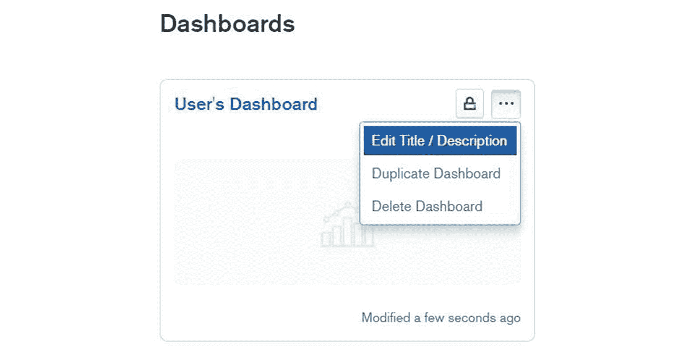

图 12.4：仪表板属性下拉菜单

仪表板上下文中有几个可用的按钮和选项：

*   **编辑标题/说明**：此选项用于更改仪表板的当前标题或说明。
*   **复制仪表板**：此选项将仪表板复制到新仪表板，并使用不同的名称。
*   **删除仪表板**：此选项从 MongoDB 图表中删除仪表板。
*   **锁定**：该选项为 Atlas 项目用户分配仪表板权限。此选项对于免费层 Atlas 图表不有用，因为 MongoDB 不允许您使用免费层管理项目用户和团队。

要查看仪表板，请单击仪表板名称链接（例如，**用户仪表板**。仪表板将打开并显示其中包含的所有图表。如果未创建图表，则会显示一个空的仪表板，如以下屏幕截图所示：


图 12.5：用户仪表板

在本章后面，我们将完成向仪表板添加图表的步骤。但在添加新图表之前，我们必须确保数据库文档可用于图表。这是下一节的主题。

## 数据源

数据源表示 MongoDB 数据库结构和 MongoDB 图表表示引擎之间的接口。数据源是指向特定数据库集合（一个或多个集合）的指针，从中处理数据以创建图形。由于 MongoDB 图表与 Atlas web 应用程序集成，所有数据源都配置为连接到 Atlas 数据库部署。因此，数据源包含对 Atlas 集群部署、数据库和将用于图表的集合的描述。

数据源还支持 MongoDB 数据库和 MongoDB 图表应用程序用户之间的隔离级别。可以保证数据源不会修改 MongoDB 数据库，因为它们以只读模式访问数据库。如果没有数据源，图表无法从 MongoDB 数据库访问 JSON 文档。

笔记

MongoDB 图表（PaaS 版本）允许数据源仅引用 Atlas 云集群部署的数据。因此，无法从本地 MongoDB 数据库安装创建数据源。在生成新数据源之前，必须将数据库集合和文档上载到 Atlas 数据库集群。

要访问数据源，点击左侧**数据源**页签，如下图所示：


图 12.6：数据源选项卡

在中间，您可以观察到现有数据源的列表，并在页面右上角添加数据源“OutT1 席”按钮。

如您所见，在当前版本的图表中，应用程序会自动填充一个示例数据源。此样本数据源的名称为**样本数据：电影**。MongoDB 试图通过提供示例数据源和示例仪表盘/图表来帮助快速介绍图表，这样用户就可以在不学习如何使用图表界面的情况下查看一些图表。

笔记

样本数据源**样本数据：用户不能更改或删除电影**。这是因为示例数据源指向一个特殊的 Atlas 数据库，该数据库位于项目外部，用户无法访问。由于不能保证此数据源在将来的版本中存在，您应该忽略此数据源并继续，就像没有数据源一样。

要创建新的数据源，必须提供云 MongoDB 数据库的连接详细信息。数据源通常指向单个数据库集合。由于您已经熟悉 MongoDB 数据库结构，在图表中创建新的数据源应该相对容易。

但是，处理数据源可能比处理单个数据库集合更复杂。图表用户可以使用更复杂的选项（称为**数据源预处理**。复杂数据源包括过滤、连接和聚合等功能。有关预处理功能的更多详细信息将在本章后面介绍。目前，让我们重点关注在图表中创建一个新的数据源。

要创建数据源，点击**添加数据源**按钮，如*图 12.6*所示。屏幕上将出现一个带有**添加数据源**向导的新窗口：


图 12.7：添加数据源窗口

您将看到可用于图表的云数据库列表（*图 12.7*。如果是免费的 tier Atlas，将有一个**M0**集群可用。如您所见，页脚上写着**从图表到集群的连接将是只读的**。这是为了向您保证数据源不会更改数据库信息。您可以从集群列表中选择**集群 0**，然后点击**下一步**按钮。

接下来，将显示可用数据库的列表。您可以展开每个数据库，显示其中的所有集合，并从相应的数据库中选择特定集合，如以下屏幕截图所示：

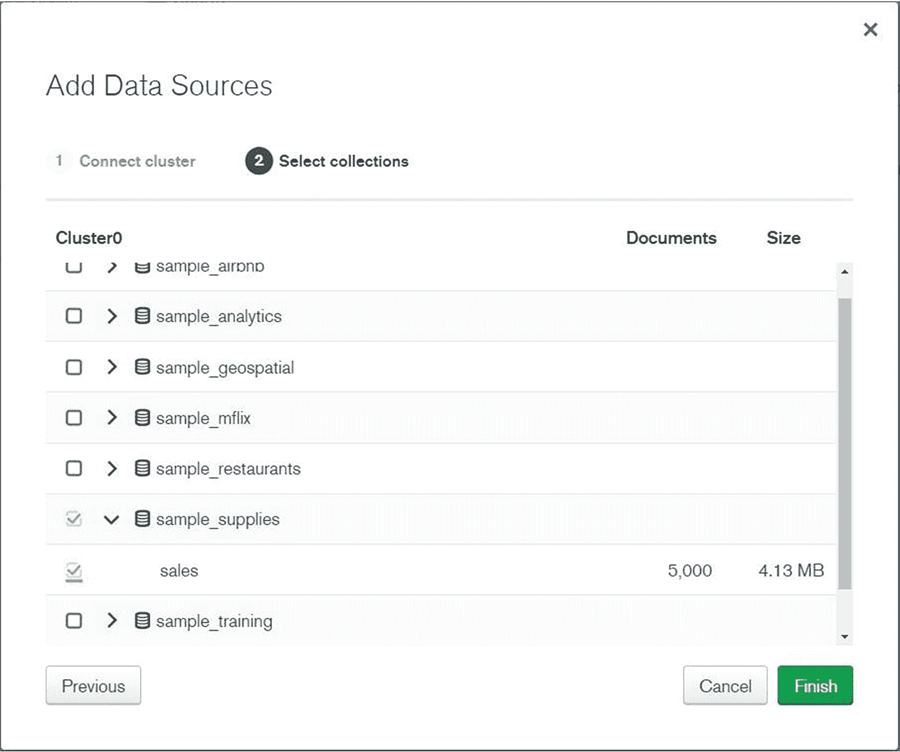

图 12.8：选择集合窗口

可以选择整个数据库，也可以展开“数据库”部分，然后从数据库中选择一个或多个集合。如果选择多个集合（或多个数据库），Atlas 将为每个数据库集合生成多个数据源。因此，可以创建多个数据源，而无需多次使用此设置助手。这种情况下的限制是，所有数据源都将指向以前选择的单个数据库集群。

数据源配置保存后会出现在列表中，如*图 12.9*所示：

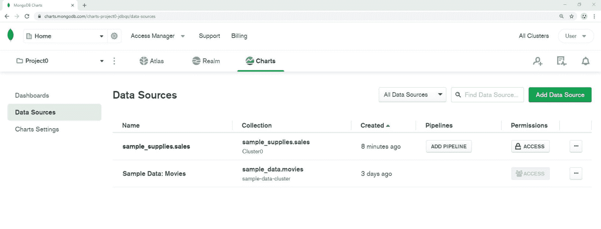

图 12.9：“数据源”选项卡显示配置了样本库

## 练习 12.01：使用数据源

在本练习中，您将为图表创建新的数据源。这些将在本章后面的示例中再次出现，因此仔细遵循此处的步骤非常重要：

笔记

请确保您已将 Atlas 样本数据上传到您的**M0**集群中，如本书前三章所示。如前所述，如果没有有效的 MongoDB 数据库集合，则无法定义新的数据源。

1.  在**数据源**页签中，点击**添加数据源**，如*图 12.6*所示。
2.  选择您自己的集群，如*图 12.7*所示。然后，单击下一步：
3.  From the database list, click on the **sample_mflix** database. If you wish, you can expand the database section to see the list of all collections from the **sample_mflix** database:

    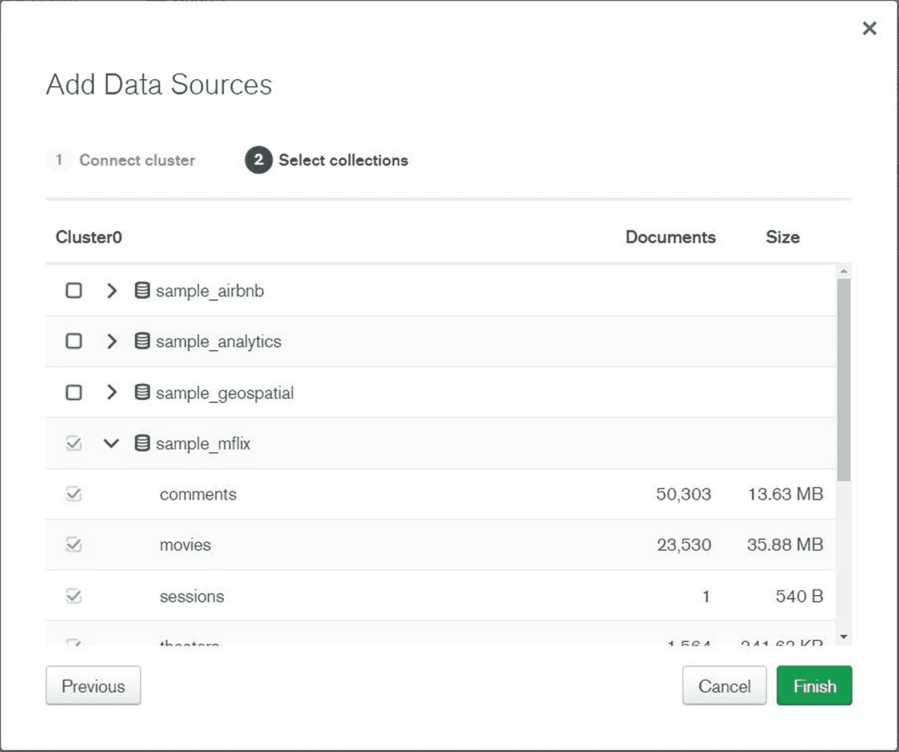

    图 12.10：选择样本 _mflix 数据库

4.  Click on the **Finish** button. You should be able to see five additional data sources (one for each collection) created in your interface, as shown in the following figure:

    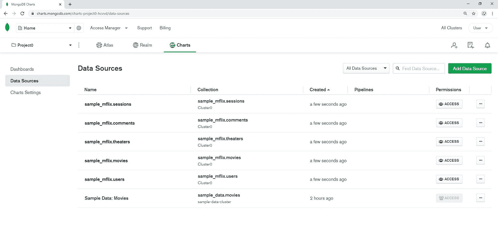

图 12.11：更新的数据源列表

在本例中，您在 MongoDB 图表中添加了一个新的数据源。

## 数据源权限

复杂的 MongoDB 项目可以让许多开发人员和业务用户使用图表。在这种情况下，创建新数据源的 Atlas 用户可能需要与其他 Atlas 项目用户共享。如前几章所述，Atlas 应用程序可以为大型 Atlas 部署管理多个用户。然而，这一概念不适用于本书中介绍的大多数示例的自由层 Atlas sandpit 项目。

一旦用户创建了一个新的数据源，他们就成为该数据源的所有者，可以通过点击**数据源**窗口**图表**选项卡中的**访问**按钮与其他项目成员共享该数据源（参见*图 12.9*。下面是一个来自**M0**免费层集群的屏幕截图示例：

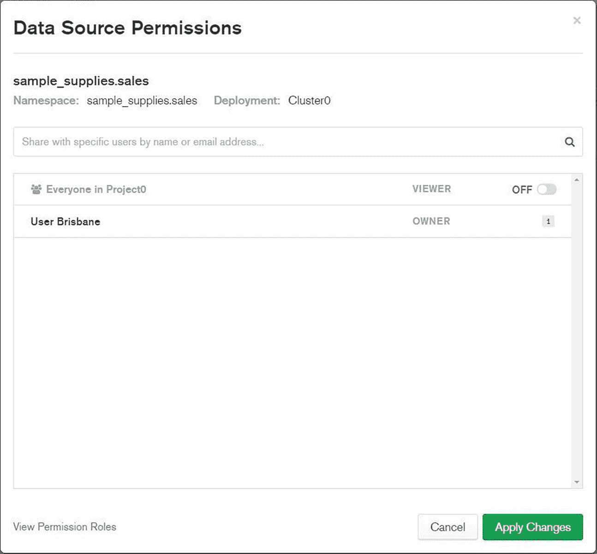

图 12.12：数据源权限窗口

从前面的屏幕截图可以看出，所有者可以为 Project0 中的**所有人启用或禁用**查看器**权限。**查看器**权限允许用户“使用”数据源构建自己的图表。不允许其他用户修改或删除数据源。**

对于大型项目，数据源所有者可以向特定 Atlas 组或受邀参与项目的用户授予权限。这些高级权限是大型 Atlas 项目特有的，本入门课程不包括这些权限。

## 建筑图

可以使用图表生成器在 MongoDB 图表中创建新图表。要启动图表生成器，请打开仪表板。您可以通过点击仪表板选项卡中的**用户仪表板**链接打开自己的用户仪表板，如*图 12.5*所示。然后，点击**添加图表**按钮。

以下是图表生成器的屏幕截图：


图 12.13：图表生成器

第一步是选择数据源。**选择数据源**按钮在左上角以绿色突出显示。请注意，需要先创建并发布有效的数据源，然后才能将其分配给图表。此外，不能将多个数据源分配给图表。默认情况下，将为图表生成器检索集合中的所有文档。

有一个选项可点击**样本模式**单选按钮。此模式允许图表仅从数据库检索文档的子集。关于图表生成器中应加载的 JSON 文档的最大数量，没有任何规则。例如，如果目标是显示精确的聚合值，那么我们可能需要检索所有文档。另一方面，如果目标是显示一个趋势或相关图，那么仅仅一个文档样本就足够了。然而，在图表中加载极高数量的数据（超过 1GB）会对图表的性能产生负面影响，因此不鼓励这样做。

### 字段

在图表生成器页面的左侧，您可以看到集合字段列表：

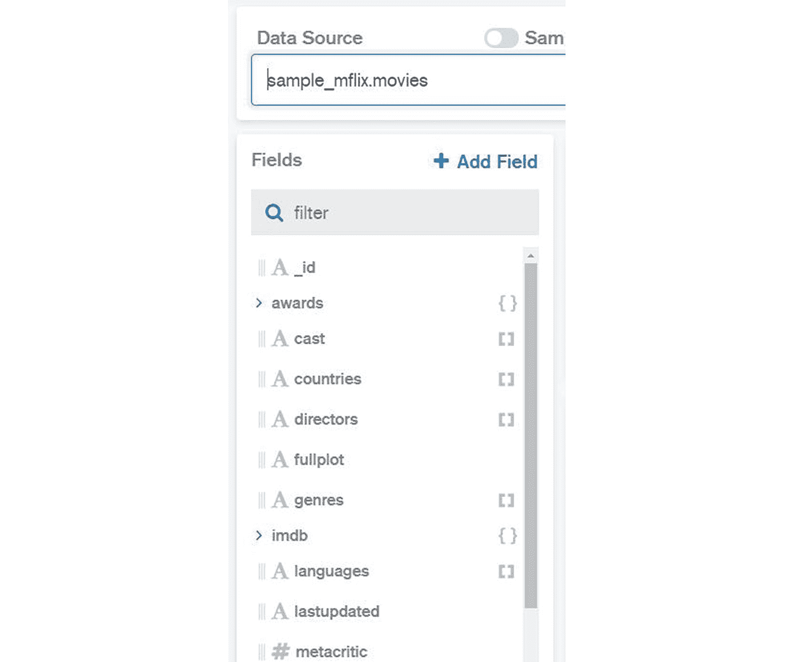

图 12.14：图表生成器中的字段区域

每个字段都有一个名称和一个数据类型，正如您在*第 2 章*、*文档和数据类型*中所看到的。

以下是图表生成器中的数据类型列表：

*   **A**-字符串
*   **-数字（整数或浮点）**
***   日期*   **【】**-阵列*   **{}** – Sub-document

    笔记

    在示例屏幕截图（*图 12.14*中，**样本 _mflix.movies**选择了电影数据源。** 

 **## 图表类型

有各种类型的图表可供选择。他们都可以代表相似的观点。但是，某些图表类型更适合于特定场景或数据库数据类型。下表列出了所有图表类型及其各自的功能：


图 12.15:MongoDB 中的图表类型

每个图表类型可以有一个或多个子类型，这些子类型是主图表的视觉变体，在不同的演示中很有用。由于图表子类型依赖于主图表类型，我们将针对每种类型的图表讨论它们。

在**图表类型**下方，可以从同一菜单中选择一个图表子类型，如**栏**图表类型截图所示：

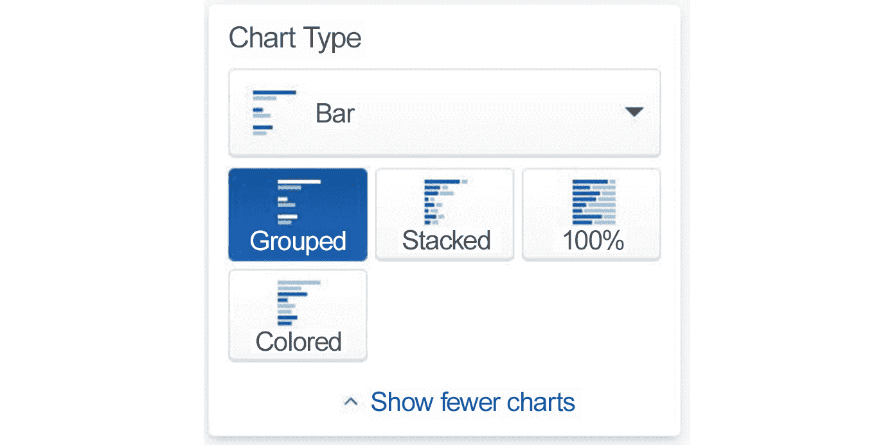

图 12.16：条形图子类型

请注意，条形图和柱状图有四种不同的子类型，如*图 12.16*所示。虽然大多数子类型只是同一图表类型的变体，但有些子类型对于关注数据的不同方面是有用的。例如，**分组的**子类型用于比较不同类别的值，而**堆叠的**用于查看所有类别的累积值。为您确定正确的子类型的最简单方法是快速浏览它们。图表引擎将自动以您选择的子类型表单重新显示图表。

在**图表类型**选择菜单的正下方，有一个子菜单和其他选项卡，用于定义图表通道或尺寸。以下屏幕截图显示了以下内容：

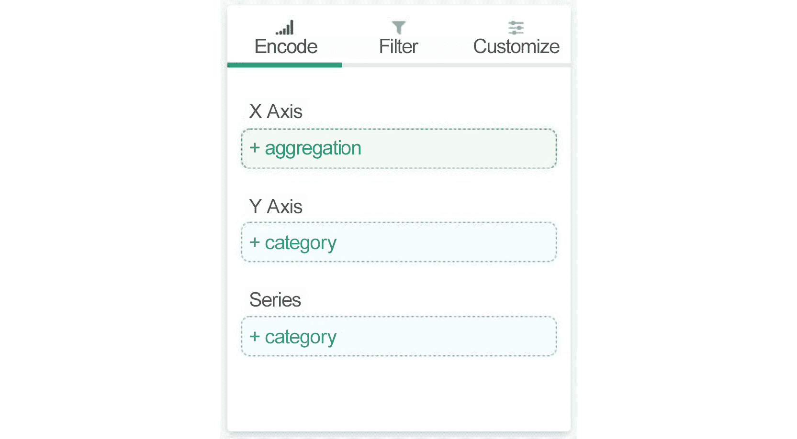

图 12.17：图表通道

以下列表对每个选项卡进行了简要说明：

*   **编码**：用于定义图表通道。通道描述如何将数据转换为图表可视化项目。不同的图表类型有不同的编码通道。例如，条形图和线形图具有笛卡尔坐标（X 轴和 Y 轴）表示的通道。
*   **过滤器**：用于定义数据过滤器。此选项有助于过滤输入文档，因此图表打印只考虑所需文档。如果我们想从图表中排除不相关的数据，这是很有用的。
*   **定制**：用于定义图表的功能和美学定制，如图表颜色和标签。虽然此选项不是必需的，但它通常会在图形可读性方面产生很大的差异。

有关信道利用率的更多详细信息将在本章后面介绍。现在，让我们来看一些图表类型和实际示例。

## 条形图和柱状图

条形图和柱状图可能是演示文稿中最常用的图表类型。图表的基本格式由一组具有不同高度和厚度值的条形组成，以二维图形的形式排列。

条形图对于表示分类数据的聚合值特别有用。因此，条形图的主要名称是数据分类或分类。虽然本材料不是一个关于数据科学的综合理论，但一个简短的介绍将帮助您理解基础知识。以下是如何定义分类数据的说明：

*   **数据分类**：指可以根据类别或标签识别的数据，例如质量（高、中、低）或颜色（白、红、蓝）。这还可能包括一些不同的数值或用作类别的数字（而不是值）。
*   **数据装箱**：指按照区间将数据分组到一个类别中。例如，0 到 9.99 之间的数值可以在第一个存储箱中分组，10 到 19.99 之间的数字可以在第二个存储箱中分组，依此类推。通过这种方式，我们可以将许多值分组到相对较少的类别中。Binning 是用于表示统计分析图形的方法，称为直方图。

一旦定义了数据类别，就可以从中构建二维条形图。数据类别将填充图表的一个维度，而计算（聚合）值将填充图表的另一个维度。

## 练习 12.02：创建条形图以显示电影

本练习的目标是创建条形图，并熟悉 MongoDB 图表界面菜单和选项：

1.  First, choose the chart type and then drag and drop fields into the **Encode** area. For example, if you choose the chart type **Bar** and **Grouped**, you can see the X and Y axes in the **Encode** area.

    笔记

    为此图表选择**样本 _mflix.movies 数据源**（左上下拉菜单）

2.  Click on the field named **title** (movie title) and drag it to **Y Axis**:

    

    图 12.18：将标题字段拖动到 Y 轴

3.  To limit the number of values, click **Limit Results** and enter **5** in the **Show** box.

    笔记

    接受**按**排序的默认选项，即**值**（参见*图 12.17*。在接下来的章节中，我们将解释编码通道中的各种选项。

4.  The next step is to define values for the X axis. Expand the **awards** field sub-document, then click and drag and drop **wins** to **X Axis**. Keep the default setting for **AGGREGATE**, which is **SUM**:

    

    图 12.19：将 wins 字段添加到 X 轴

    图表现在应自动显示在图表生成器屏幕的右侧：

    

    图 12.20：按奖项数量排序的前五名电影

5.  Now, group the bars based on database fields. For this feature, add multiple fields to the **X Axis** channel while keeping **title** as the only **Y Axis** value. To add a second set of values on the X axis (**Grouped** bar), drag and drop **nominations** to **X Axis**:

    

图 12.21：将提名字段拖动到 X 轴

然后，图表会自动更新，显示每部电影的**提名**和**获奖**：

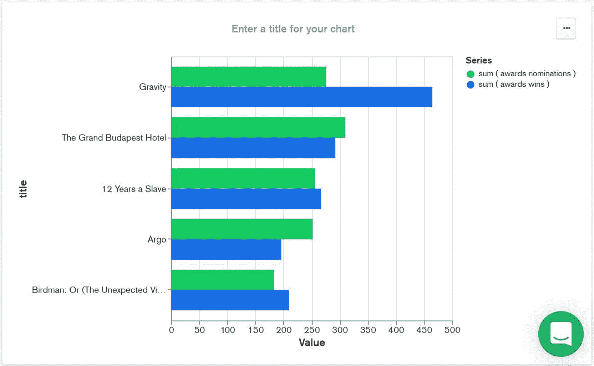

图 12.22：显示顶级电影奖项和提名的条形图

如果要比较值，此图形子类型特别有用。在本例中，您比较了每部电影的提名和获奖数量。如您所见，这些值是“分组”的。这正是**图表类型**选择菜单中**分组**选项卡的含义。

如果您希望看到它们“堆叠”而不是分组，则只需点击**堆叠**按钮（*图 12.21*，图表将自动更新。如果我们想查看电影奖提名和获奖的总累积值，此选项非常有用：


图 12.23：堆叠钢筋的结果（而不是分组）

正如您所看到的，在 MongoDB 图表中从一个子类型切换到另一个子类型只需单击一次。因此，图表将自动以新格式重新绘制，无需任何其他用户输入。一旦我们确定最初的子类型选择是否适合我们的演示文稿，此功能将非常有用。

现在，让我们看看 Atlas 中提供的其他类型的图表。

## 圆形图

圆形图表是带颜色的圆形或半圆，通常细分为片以表示值或百分比。圆形图表也是“一维”的，这意味着图形只能表示一组标量值，而不能表示笛卡尔坐标系中的值。考虑到这一局限性，我们需要意识到，使用这种类型的图表可以表示的信息很少。尽管如此，圆形图表通过强调一个切片与整个切片之间的比率，提供了数据比例的强大可视化表示。由于它的简单性和视觉冲击力，这种类型的图表对于演示也非常有效。

圆形图有两个子类型：**油炸圈饼**和**量规**：

*   **油炸圈饼**：这代表一个完整的彩色圆圈（饼），分为代表数值或百分比的切片。可能有许多值或切片。但是，建议限制值的数量，以便将甜甜圈分成相对较少的切片。
*   **量规**：表示一个半圆，与总的比值。这种类型的图是甜甜圈类型的简化版本，因为它可以表示单个值比例。

在下一个练习中，您将学习如何构建圆环图。

## 练习 12.03：从电影集合创建饼图

假设您需要根据电影的原产国来表示这些电影。由于饼图表示法通常比表格更直观，因此您决定使用圆环图来表示此数据。这也将使您能够将重点放在世界顶级电影制作国家：

1.  Select the **Donut** sub-type from the **Chart Type** drop-down menu:

    

    图 12.24：选择圆环图子类型

2.  Click and drag the **countries** field to the **Label** channel, as in the following screenshot:

    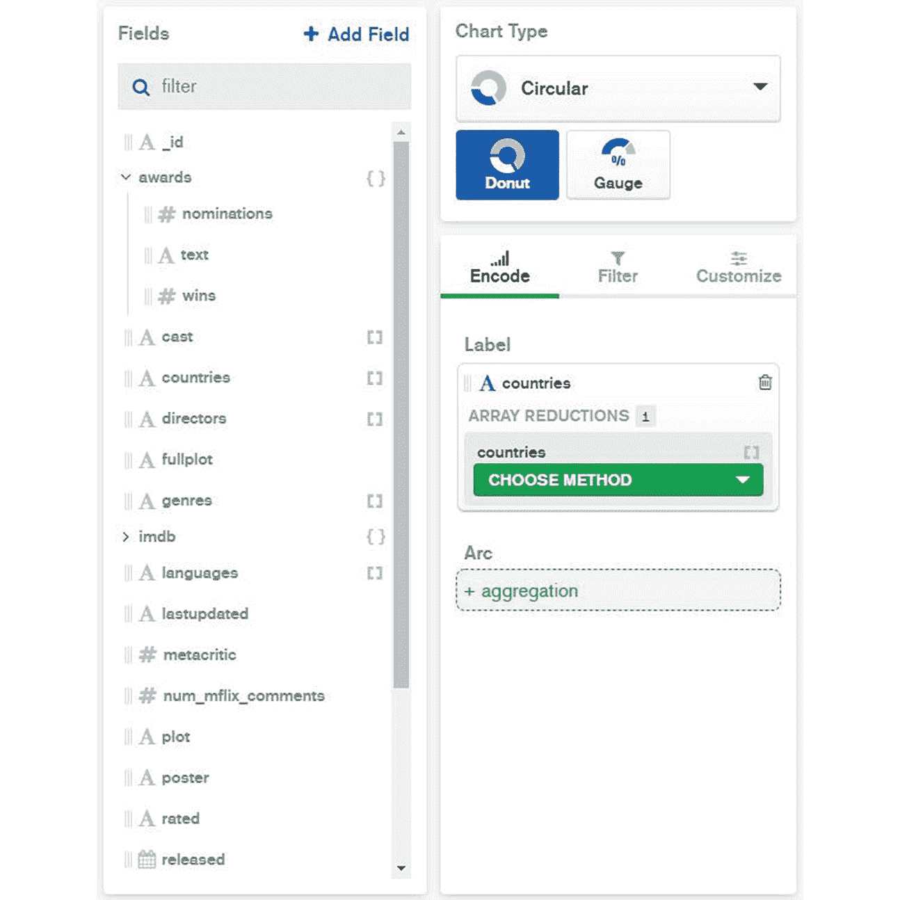

    图 12.25：将“国家”字段拖动到标签通道

3.  Click on the **CHOOSE METHOD** dropdown and select **Array element by index (index = 0)** to choose the first element of the array in all documents. Accept the default option for **SORT BY**—that is, **VALUE**.

    笔记

    因为**国家**字段是 JSON 数组数据类型，所以最好的选择是**数组缩减**方法，这样图表就会知道如何解释数据。在本例中，您关注的是主要国家生产者（**指数=0**），而忽略了共同生产者。

4.  Reduce the number of results (using the **Limit Results** option) to **10**. In this way, your pie will have only **10** slices, which will correspond to the top 10 movie producers:

    

    图 12.26：将极限结果值设置为 10

5.  Drag and drop the **title** field into the **Arc** channel and select the option of **COUNT** for the **AGGREGATE** dropdown. The circular chart should appear on the right side of the screen as follows:

    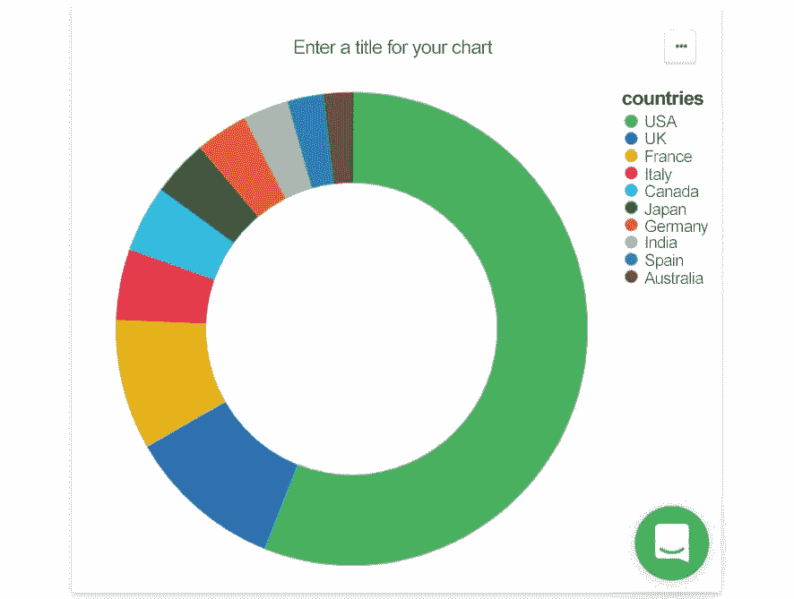

图 12.27：顶级电影制作国的甜甜圈图表

本练习指导您完成构建甜甜圈或饼图所需的几个简单步骤。几乎任何演示文稿或仪表板都至少包含一个饼图，因为它们看起来很吸引人。但吸引力并不是甜甜圈排行榜如此受欢迎的唯一原因。甜甜圈图表也是一个强大的工具，可以在可视图形中表示比率和比例。下一节将介绍另一种类型的图表，即地理空间图表。

## 地理空间图

地理空间图表是一类特殊的图表，其中地理数据是构建图表的主要成分。地理（或地理空间）数据最简单的定义是，它包含有关地球上特定位置的信息。位置细节在地图上精确定位，以构建地理空间图。

地理空间信息可以是特定的，也可以是更一般的。以下是一些可以使用地图引擎（如 Google Maps）轻松绘制地图的地理空间数据示例：

*   精确的经纬度坐标
*   可以使用映射引擎映射的地址
*   更广泛的位置，如城市、地区或国家

例如，假设我们有一个包含汽车信息的数据库。主数据库集合包含数百万个关于汽车的文档，例如模型、里程表详细信息和其他属性。其他一些属性也将描述车辆注册的物理地址。然后，这些信息可以用于使用城市地图构建地理空间图。

地理空间图表有以下几种图表子类型：

*   **Choropleth**图表：此图表显示彩色地理区域，如地区和国家。这种类型的图表不太具体，一般来说，对于高级别的汇总很有用，例如，显示每个国家新冠病毒-19 病例总数的图表。
*   **散点图**图：此图需要精确的地址或位置。图表在地图上用点或小圆标记位置。如果要显示具有相对较少精确位置的图表，此图表非常有用。
*   **热图**图表：热图在地图上显示不同强度的颜色。强度越高，该位置的数据库实体密度越高。热图图表对于在地图上显示大量对象非常有用，因为用户更感兴趣的是密度，而不是精确的位置。

在下一节中，您将使用**sample_mflix**数据库完成一个练习，该数据库包含示例地理空间信息，以进一步练习在新的地理空间图表中使用地理点信息。

## 练习 12.04：创建地理空间图

本练习的目的是创建一个地理空间图，该图表示位于美利坚合众国的所有电影院的地图。您将使用**剧院**集合绘制地理数据：

1.  For **Data Source**, choose **sample_mflix.theaters**:

    

    图 12.28：选择样本 _mflix.theates 作为数据源

2.  Select the **Geospatial** chart and, from the sub-type categories, select **Heatmap**:

    

    图 12.29：从地理空间图表子类型列表中选择热图

3.  Click on the **geo** field and drag it into the **Coordinates** encoding channel:

    

    图 12.30：将地理场拖动到坐标编码通道中

4.  Next, click on the **theatreId** field and drag it into the **Intensity** channel:

    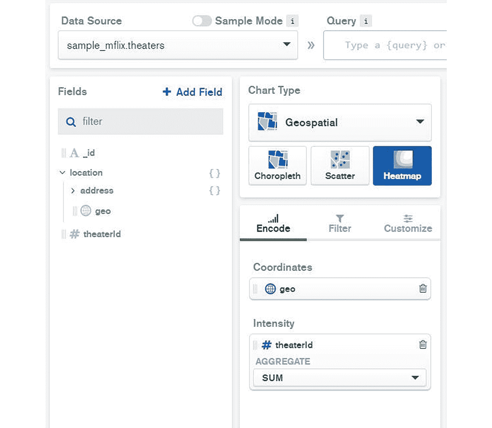

图 12.31：将场拖动到强度通道中

当切换到**热图**图表类型时，你应该注意到一个带有彩色区域的即时图表更新，而不是美国大城市周围带有红色强度的点。

美国地图应该出现在窗口的右侧，并使用不同的颜色渐变显示影院的密度。颜色编码显示在图表的右侧。最高密度的电影院（纽约市周围）将以红色显示在地图上（参见*图 12.32*：

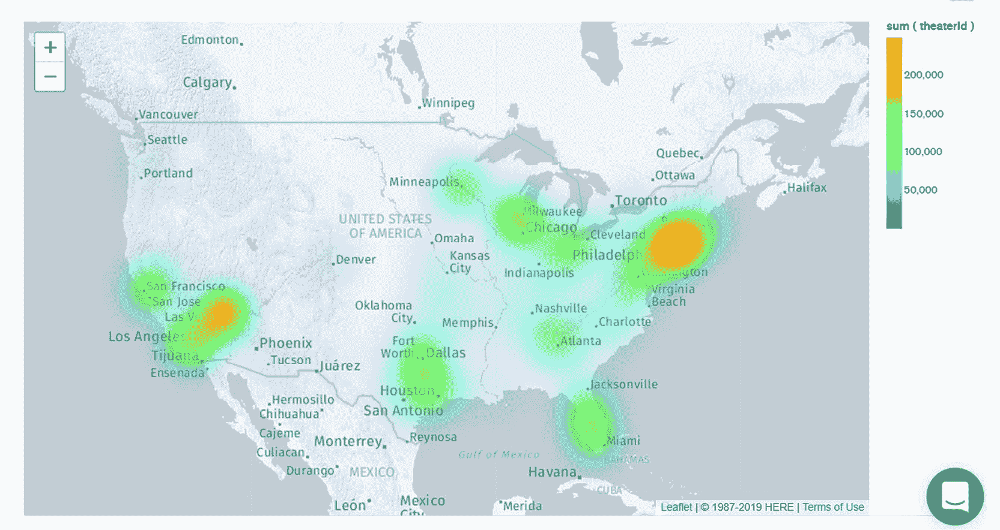

图 12.32：热图

在本练习中，您练习了如何构建美国所有电影院的地理空间图。您从数据分析开始，以查看数据库信息是否适合通过地理空间图显示。一旦 MongoDB 数据库中有了数据，构建图表就相对容易了。

# 复杂图表

在前面的部分中，您看到了在 Atlas 中使用 MongoDB 图表是多么容易。虽然用户界面非常直观和易于使用，但它也非常强大。MongoDB 图表中有许多可用选项，因此数据库中的数据可以以各种方式进行预处理、分组和显示。在本节中，我们将了解更多高级配置主题。

## 数据预处理和过滤

如前所述，图表通过图表中定义的数据源访问数据库。默认情况下，将选择数据库集合中的所有文档以生成新图表。此外，图表中的数据字段将继承原始数据库 JSON 文档数据格式。

还请注意，数据源不能更改或修改数据库。在现实生活中，数据格式往往不适合通过图表显示。数据必须准备好，或者数据格式需要以某种方式进行更改，然后才能用于图表。这类用于打印的数据准备称为预处理。

数据预处理包括以下内容：

*   **数据过滤**：过滤数据，只选择某些单据
*   **数据类型更改**：修改数据类型，使其更适合图表生成器
*   **新增字段**：新增 MongoDB 数据库中不存在的自定义字段

### 过滤数据

数据筛选允许用户仅从 MongoDB 集合中选择文档的子集。有时，数据库集合太大，这会使图表生成器中的操作速度变慢，效率降低。克服这一问题的方法之一是对数据进行采样。另一种方法是简单地根据某些类别过滤数据，以便图表只考虑文档的子集。

用户可以通过几种方式控制图表中处理的文档数量。下表列出了这些问题：

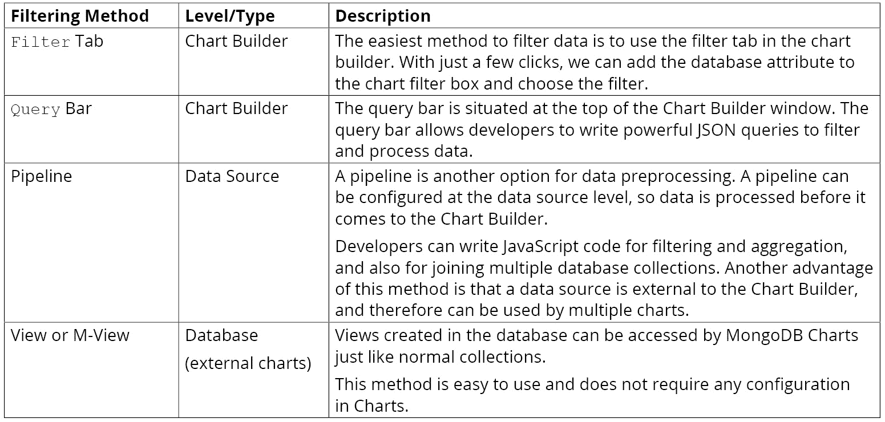

图 12.33：用户控制图表中处理的文档数量的方法

笔记

建议您选择一种最适合图表要求的过滤器方法，并仅使用该过滤器。将两种或三种过滤方法混合到同一图表中可能会导致混淆，应避免混淆。

除了作为 UI 一部分的**过滤器选项卡**方法外，所有其他方法都需要 JavaScript 代码来定义过滤器。查询语法在*第 4 章*、*查询文档*中有详细介绍。同样的查询格式也可以在图表中使用。例如，要为 1999 年之后发行的所有意大利或法国电影定义过滤器，可以编写以下 JSON 查询：

```js
{ countries: { $in: ["Italy", "France"]}, 
  year: { $gt : 1999}}
```

在**查询**栏中输入此查询后，点击**应用**按钮，如下图所示：


图 12.34：查询栏示例屏幕截图

笔记

过滤文档可能会导致图表响应延迟，尤其是在处理大型数据库时。为了提高性能，您可以在过滤器表达式中涉及的集合字段上创建索引，如*第 9 章*、*性能*所示。

### 添加自定义字段

图表允许用户添加可用于构建图表的自定义字段。有时候，来自 MongoDB 的原始数据不能提供用于创建新图表的正确属性，因此添加自定义字段变得非常重要。大多数自定义字段都是使用源数据库值派生或计算的。

在图表生成器的**字段**区域，点击**+添加字段**按钮，可以添加自定义字段，如下图所示：


图 12.35：字段区域中的添加字段按钮

可以添加两种类型的字段：

*   **遗漏**：此选项用于添加字段列表中遗漏的字段。例如，假设应用程序中添加了一个新字段，而数据库中只有少数文档具有该新字段。在这种情况下，MongoDB 图表可以将缺少的字段添加到初始加载中。
*   **CALCULATED**: This is used to add a new field that does not exist in the collection. For example, the source database for a ride-sharing app can have fields for the number of hours and the tariff per hour. However, the total value (hours multiplied by the tariff) might not be in the database. Therefore, we can add a new custom field that is calculated from other values in the database.

    笔记

    如果**遗漏的**字段在任何收款单中都不存在，则无法添加该字段。在这种情况下，您需要首先添加/更新收集文档。

为了更好地理解这个概念，考虑这个实际的例子。在本例中，您将在图表中添加一个新的计算字段。执行以下步骤：

1.  Click on the **Add Field** button, and then click on the **CALCULATED** button, as in the following screenshot:

    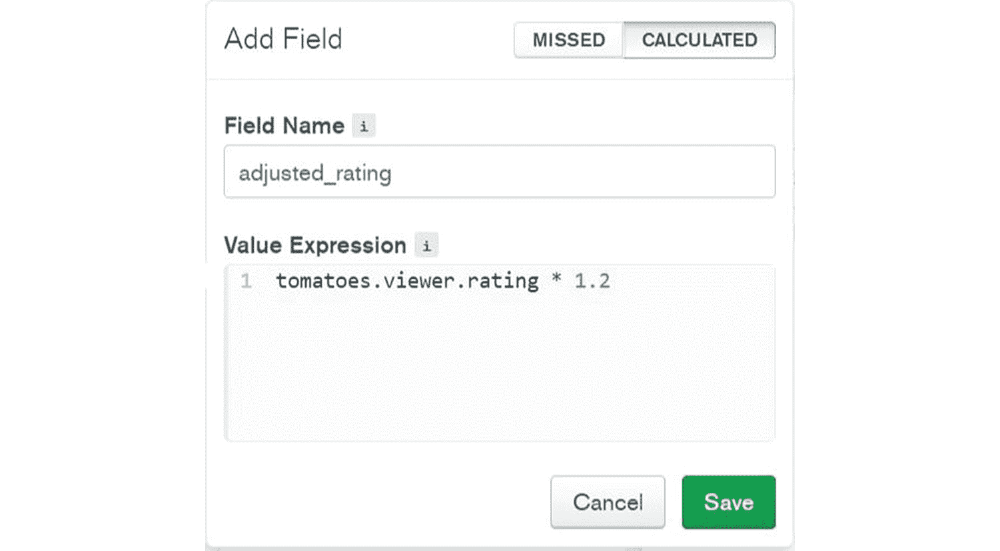

    图 12.36：添加新字段

2.  在 as**调整后的**中键入新字段名。
3.  输入计算总值的公式，即**番茄.viewer.rating*1.2**。
4.  Click on the **Save** button. You should now be able to see the new calculated field and use it in charts, just like any other data-type attribute.

    笔记

    计算字段不保存在数据库中。它们的作用域仅在 MongoDB 图表生成器中。此外，可以从**字段**列表中删除计算字段。

### 变换场

有时，数据库中的数据不是正确的数据类型。在这种情况下，MongoDB 图表允许用户将字段更改为适合图表打印的数据类型。例如，图表通道可能要求数据为数字格式，以聚合**和**或**平均**。要更改字段，请将鼠标指针拖动到**字段**列表中的字段名称上（在**图表生成器**窗口的左侧）：


图 12.37：从 fullplot 字段选择转换类型

点击**后。。。**菜单并选择**转换类型**选项（唯一可用的选项），将显示 JSON 数据类型列表。然后，您可以选择所需的数据类型并点击**保存**按钮。

例如，如果您想将**元临界**数值字段（**更改为字符串字段（**a**，您可以点击**元临界**，一个新的**转换类型**窗口将显示如下：**

 **

图 12.38：转换类型窗口

请注意，更改字段的数据类型仅对当前图表有效，不会更改数据库中的数据类型。

笔记

在最新版本的图表中，上下文字段菜单中有另一个选项[**…【T1]，称为**查找**。**查找**字段允许我们通过加入来自同一数据库的第二个集合来构建图表。有关如何加入集合的更多详细信息，请参见*第 4 章*、*查询文档*。**

# 频道

编码通道是数据可视化最重要的方面之一。通道决定数据在图表中的可视化方式。如果用户选择了错误的频道类型，可能会得到混乱的图表或完全出乎意料的结果。因此，正确理解编码通道对于高效的图表构建和数据可视化至关重要。

如前面的示例所示，编码通道位于图表生成器的**编码**选项卡下，就在图表子类型选择按钮的下方：


图 12.39：编码通道

每个编码通道都有一个名称和一个类型。通道名称定义了图形中的目标，即通道将被使用的终点。例如，**X 轴**通道名称表示该通道正在为图形的水平轴提供值。很明显，在这种情况下，我们将有一个笛卡尔二维图。通道类型定义了预期作为通道输入的数据类型。为通道输入找到正确的数据类型很重要。此外，正如您现在可能已经注意到的，并非所有数据类型都可以接受为通道输入。

MongoDB 图表中有四种可用通道类型，如下表所示：


图 12.40:MongoDB 图表中的通道类型列表

笔记

可以从 JSON 文档中的子文档或数组字段分配通道值。在这种情况下，MongoDB 图表将要求您识别通道编码考虑的元素，例如数组索引**[0】**（对于每个文档，它指向数组中的第一个元素）。

## 聚集和装箱

一个通道中的数据通常与类别数据类型通道组合，以便计算每个类别的聚合值。例如，我们可以**合计**法国电影的所有奖项。在图表生成器中，当将字段拖放到聚合通道中时，假定值将在图表中聚合。图表生成器可以透明地执行此操作，而无需为聚合管道编写代码。

聚合类型将取决于我们在通道输入上提供的数据类型。例如，如果提供给通道的数据类型为文本，则无法**求和**。

有几种类型的聚合，如下表所示：


图 12.41：聚合类型

笔记

一些通道可以有**系列**类型。此选项允许用户通过将数据分组到一系列值中，向图表添加第二个维度（唯一维度或分格维度）。

## 练习 12.05：条形图的装箱值

在本练习中，您将构建另一个条形图，显示意大利制作的电影。在这个图中，您需要聚合每个电影发行年份的数据。此外，图表应该只考虑 1970 后发行的电影。要构建此图表，您需要筛选文档并选择用于表示每年聚合的电影的编码字段。以下步骤将帮助您完成此练习：

1.  在仪表板窗口中，点击**添加图表**，然后选择**栏**图表类型。
2.  Drag and drop the **year** field to the categorical channel **Y Axis**. The chart builder will detect that there are too many categorical distinct values (years) and will propose binning them (grouping them in 10-year periods). Now, toggle **Binning** on and for **Bin Size**, enter the value **10** (see the following figure):

    

    图 12.42：输入 10 作为料仓尺寸值

3.  将**标题**字段拖放到分类通道**X 轴**上。然后选择**聚合**功能选项**计数**点击**过滤器**页签。
4.  将**国家**字段拖放到图表过滤器中。
5.  Select **Italy** from the chart filter as follows:

    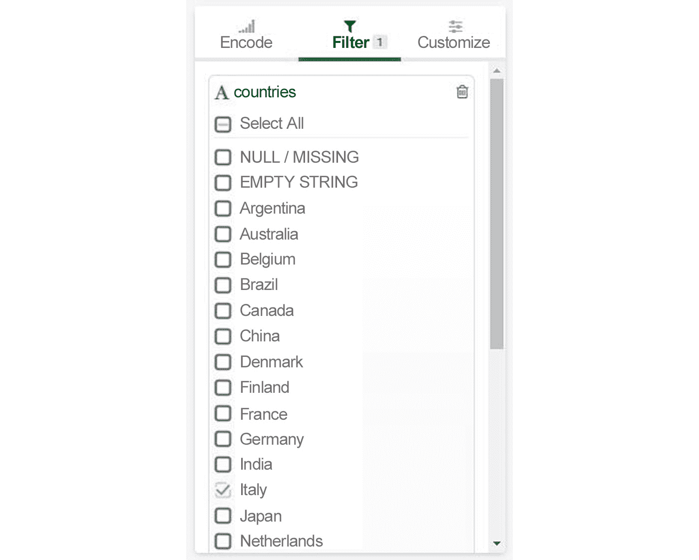

    图 12.43：从国家名单中选择意大利

6.  Drag and drop the second field, **year**, to the chart filter, and set **Min** to **1970** as follows:

    

    图 12.44：选择 1970 作为年份字段的最小值

7.  Edit the chart title to **Movies from Italy**, as follows:

    

    图 12.45：来自意大利的最终电影条形图

8.  保存图表。

在本练习中，您以简单的方式使用过滤和聚合技术创建了一个图表，并且没有编写任何 JavaScript 代码。新图表保存在仪表板上，以便以后可以加载和编辑。MongoDB 图表生成器具有高效的 web GUI，可帮助用户创建复杂的图表。除了简单易用之外，该界面还有许多选项和配置项可供选择。

# 整合

到目前为止，本章中的主题重点描述了 MongoDB 图表 PaaS 的功能。我们了解到，用户可以使用 Atlas 云数据库中的数据源轻松构建仪表盘和图表。本章的最后一个主题介绍 MongoDB 图表的最终结果，即如何将仪表板和图表用于演示和应用程序。

一个选项是将图表另存为图像，并将其集成到 MS PowerPoint 演示文稿中，或将其发布为网页内容。虽然此选项非常简单，但它有一个主要缺点，即图表图像是静态的。因此，数据库更新时图表不会更新。

另一种选择是使用 MongoDB 图表作为表示工具。此选项保证每次更新数据库时都刷新和呈现图表。然而，此选项可能并不理想，因为内容仅限于 MongoDB 图表用户界面，无法轻松集成。

幸运的是，MongoDB 图表可以选择将图表作为网页和 web 应用程序的动态内容发布。它还可以轻松地集成到 MS PowerPoint 演示文稿中。此集成功能称为**嵌入式图表**，允许在预先设定的时间间隔后自动刷新图表。

## 嵌入式图表

嵌入图表是一个选项，通过提供可用于数据演示和应用程序的 web 链接，您可以在 MongoDB 图表工具之外共享图表。

共享图表有三种方法：

*   **未经身份验证**：使用此方法，用户无需通过身份验证即可访问图表。他们只需要有访问链接。此选项适用于不敏感的公共数据或信息。
*   **已验证**：通过此方法，用户需要进行身份验证才能访问图表。此选项适用于包含非公共数据的图表。
*   **验证签名**：此方法要求用户提供签名密钥才能访问图表。此选项适用于敏感数据，需要额外的配置和代码来验证签名。

选择方法取决于数据安全要求和策略。**未经验证的**方法可用于学习或测试非敏感数据。在具有真实或敏感数据的应用程序中，应始终使用**验证签名**方法与其他应用程序集成。

嵌入式图表有几个选项，如这里的屏幕截图所示：


图 12.46：嵌入图表窗口

例如，假设您想要为用户配置**未经验证的**访问权限。选择**未经验证的**选项后，您可以指定以下详细信息：

*   **用户指定过滤器（可选）**：您可以指定共享时不可见的字段。
*   **自动刷新**：可以指定图表自动刷新的时间间隔。
*   **主题**：您可以指定**亮**或**暗**图表主题。

嵌入的代码是自动生成的，可以复制到应用程序代码中，如*图 12.46*所示。

## 练习 12.06：向 HTML 页面添加图表

在本练习中，您将创建一个简单的 HTML 报告，其中包含使用 MongoDB Atlas 图表创建的嵌入式图表。使用保存的图表**意大利电影**，在*练习 12.05*中创建*条形图的装箱值*：

1.  如前几节所述，通过导航到**数据源**选项卡并选择数据源**示例 _mflix.movies**来启用对数据源的访问。
2.  点击菜单右侧（**…**，选择**外部共享选项**。
3.  Click **Unauthenticated or Authenticated Access**, and then click on **Save**, as shown in the following figure:

    

    图 12.47：外部共享选项屏幕截图

4.  进入**仪表板**选项卡，打开**电影**仪表板。您应该能够看到创建和保存的图表，包括**意大利电影**条形图。
5.  Click on the right side of the chart (**…**) and then click **Embed Chart** as shown in the following figure:

    

    图 12.48：选择嵌入图表选项

    此时会出现**嵌入图表**窗口，如下图所示：

    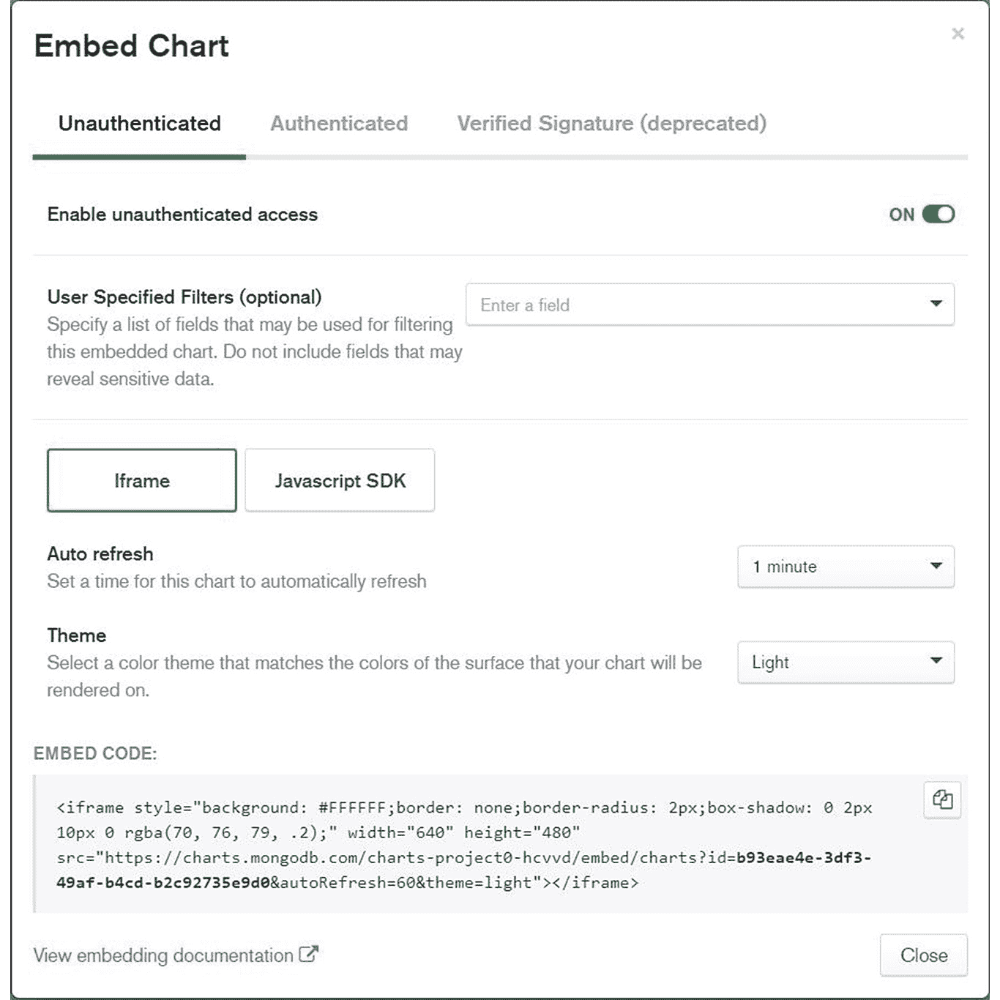

    图 12.49：嵌入图表页面

6.  Click the **Unauthenticated** tab and change the settings as follows:

    **自动刷新**：**1 分钟**

    **主题**：**灯光**

7.  Copy the **EMBED CODE** content that appears at the bottom of the page.

    笔记

    用户可以通过选择过滤器与嵌入式图表交互。要激活此可选功能，请单击**用户指定过滤器（可选）**并选择可用于确定图表过滤器的字段。JavaScript SDK 允许使用编码库集成 MongoDB 图表。此选项由开发人员驱动，本章不介绍。

8.  使用文本编辑器（如记事本）创建一个简单的 HTML 页面，并使用**.HTML**扩展名：

    ```js
    <hr />
    <h3 style="text-align: left;">Introduction to MongoDB - Test HTML&nbsp;</h3>
    <p align="center">
    <! – Paste here the embedded code copied from MongoDB Chart -- >
    </p>
    <h3 style="text-align: center;">&nbsp;</h3>
    <hr />
    <p>&nbsp;</p>
    ```

    保存该页面
9.  现在，考虑下面的代码行：
10.  在其位置添加在*步骤 7*中复制的代码。最终代码结果应如下所示：

    ```js
    <hr />
    <h3 style="text-align: left;">Introduction to MongoDB - Test HTML&nbsp;</h3>
    <p align="center">
    <iframe style="background: #FFFFFF;border: none;border-radius: 2px;box-  shadow: 0 2px 10px 0 rgba(70, 76, 79, .2);" width="640" height="480"     src="https://charts.mongodb.com/charts-project-0-      paxgp/embed/charts?id=772fcf16-f0ec-467d-b2bf-        d6a49e665511&tenant=e6ffce97-1ff7-4430-9bb2-          8b8fb32917c5&theme=light"></iframe>
    </p>
    <h3 style="text-align: center;">&nbsp;</h3>
    <hr />
    <p>&nbsp;</p>
    ```

11.  Save the Notepad file. Then, open the file using an internet browser, such as Google Chrome or Microsoft Edge. The browser should display the page with dynamic chart content, as the following screenshot shows:

    

图 12.50：浏览器视图

本练习是一个很好的示例，说明了如何将 MongoDB 图表集成到 HTML 网页中，以便在每次数据更改时动态更新内容。在这种情况下，如果更新了数据库记录并更改了图表，则网页也将在间隔 1 分钟后更新，以反映更改。

在本节中，我们讨论了图表显示和与外部应用程序集成的可用选项。在大多数业务用例中，静态图像不适合动态 web 内容和应用程序。MongoDB 的**嵌入图表**选项允许用户在演示文稿和 web 应用程序中集成图表。安全和非安全图表发布选项都可用。但是，安全选项应始终用于对数据敏感的演示文稿。

## 活动 12.01：创建销售演示文稿仪表板

在本活动中，您将使用示例数据库中的销售统计信息创建一个新图表。具体而言，分析必须有助于根据销售项目类型确定科罗拉多州丹佛市的销售额。以下步骤将帮助您完成此活动：

1.  创建一个圆环图，以绘制每个销售项目的最高销售额汇总。
2.  从**样本**数据库创建一个新的数据源。
3.  过滤数据，以便报告中只考虑来自丹佛商店的文档。图表应显示一个包含前 10 项（按价值）的甜甜圈，并应命名为**丹佛销售额（百万美元）**。
4.  使用图表标签格式以百万为单位显示值，并根据生成的图表解释数据。

最终输出应如下所示：


图 12.51：销售图表

笔记

此活动的解决方案可通过[此链接](14.html#_idTextAnchor483)找到。

# 总结

本章与前几章的不同之处在于，它侧重于图表用户界面，而不是 MongoDB 编程。使用 Atlas 云图模块可以获得令人印象深刻的结果，使用户可以专注于数据，而不是编程和演示。

有各种图表类型和子类型可供选择，这使得图表更有效，也更易于使用。MongoDB 图表还可以使用**嵌入代码**选项轻松地与其他 web 应用程序集成，这对开发人员来说是一个优势，因为他们不需要处理其他编程模块来在应用程序中绘制图形。在下一章中，我们将看一个业务用例，其中 MongoDB 将用于管理后端。****