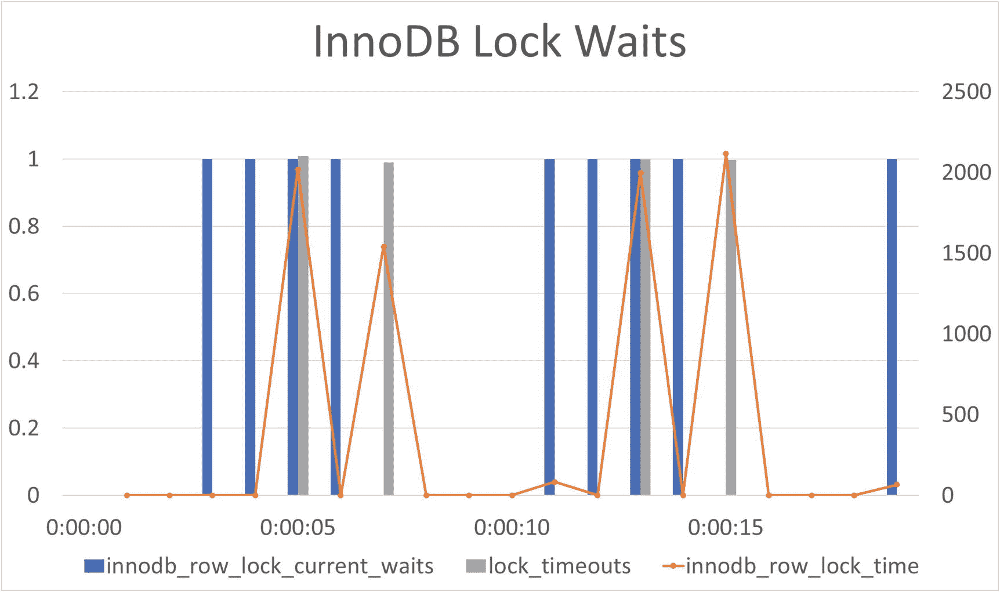
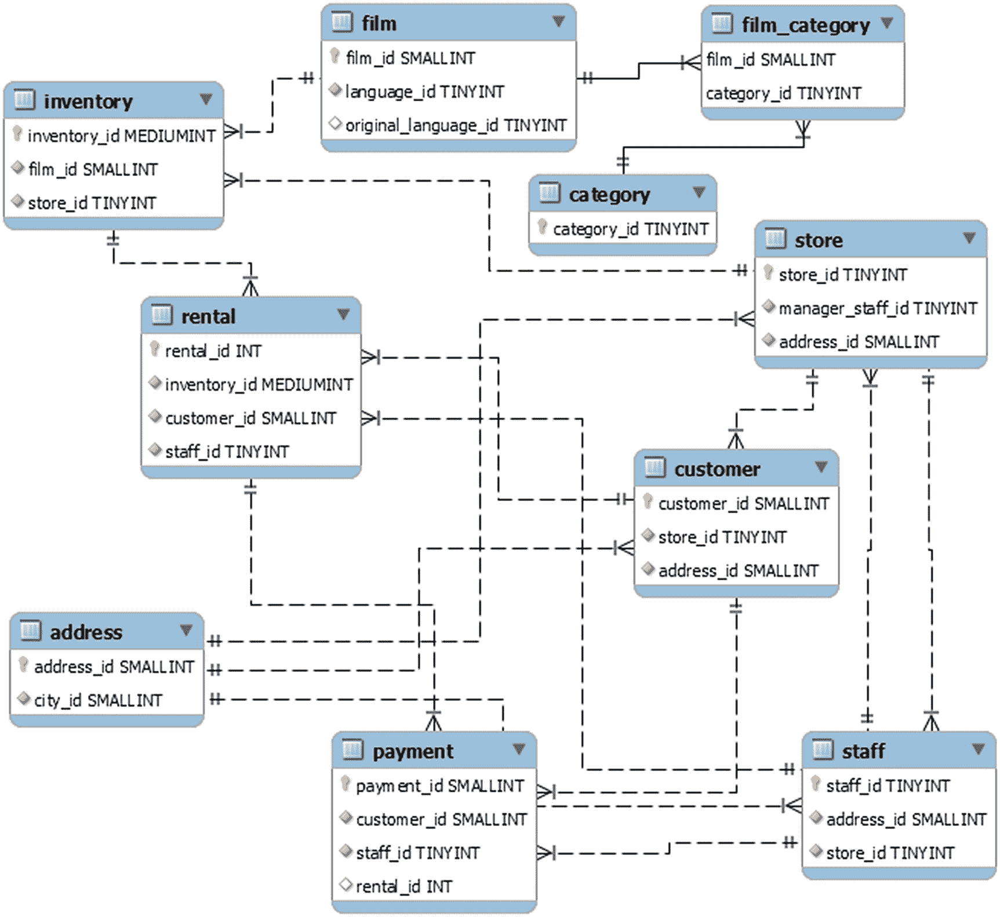

# 17.案例研究:外键

最难调查的锁争用情况之一发生在涉及外键的时候，因为您可以对不同的表内容查询相同的锁。本案例研究调查了一个由于外键而导致元数据和 InnoDB 记录锁定的例子。由于症状和原因与第[章第 14](14.html) 节讨论元数据锁的案例研究和第[章第 15](15.html) 节讨论 InnoDB 记录锁的案例研究相同，因此在本讨论中省略。

## 设置

这个案例研究比前几个更复杂，没有一个简单的方法可以自行重现。但是，MySQL Shell 的`concurrency_book`模块中的`Listing` [`17-1`](#PC1) 工作负载将允许您重现争用。工作负载由五个连接组成:

*   更新`sakila.customer`表的两个连接，以这种方式，总是有一个事务正在进行，并且在表上有一个元数据和记录锁。在`COMMIT`之前有一个休眠，以确保持续时间足够长，以避免竞争情况。休眠的持续时间可以在工作负载执行期间进行配置。

*   一个在`sakila.inventory`表上执行`ALTER TABLE`的连接。这个用`lock_wait_timeout = 1`。

*   一个更新`sakila.film_category`表的连接。

*   一个更新`sakila.category`表的连接。这个用的是`innodb_lock_wait_timeout = 1`。

当您执行工作负载时，在输入密码之后，您将被要求输入测试的运行时间，以及更新`sakila.customer`表的两个连接应该休眠多长时间来提交它们的事务。睡眠被指定为乘以 0.1 秒的因子。

Note

测试不具有确定性，因为即使重现相同的问题，您也应该预期会看到不同的数据。

测试开始后，将显示各种监视输出，以便您可以调查问题。

清单 [17-1](#PC1) 显示了工作负载的一个示例执行的部分输出(遇到的锁的确切数量和各种指标的值将因执行而异)。完整的输出可以在本书的 GitHub 库的`listing_17-1.txt`中找到。本章剩余部分的讨论中也会用到输出的几个部分。

```sql
Specify the number of seconds to run for (10-3600) [15]:
Specify the sleep factor (0-30) [15]:

-- Connection   Processlist ID   Thread ID   Event ID
-- --------------------------------------------------
--          1              462         792          6
--          2              463         793          6
--          3              464         794          6
--          4              465         795          6
--          5              466         796          6

mysql> SELECT error_number, error_name, sum_error_raised
         FROM performance_schema.events_errors_summary_global_by_error
        WHERE error_name IN ('ER_LOCK_WAIT_TIMEOUT', 'ER_LOCK_DEADLOCK');
+--------------+----------------------+------------------+
| error_number | error_name           | sum_error_raised |
+--------------+----------------------+------------------+
|         1205 | ER_LOCK_WAIT_TIMEOUT |              310 |
|         1213 | ER_LOCK_DEADLOCK     |               12 |
+--------------+----------------------+------------------+

...

mysql> UPDATE sakila.category SET name = IF(name = 'Travel', 'Exploring', 'Travel') WHERE category_id = 16;

ERROR: 1205: Lock wait timeout exceeded; try restarting transaction

mysql> ALTER TABLE sakila.inventory FORCE;
ERROR: 1205: Lock wait timeout exceeded; try restarting transaction -- Metrics reported by rate collected during the test:
time,innodb_row_lock_time,innodb_row_lock_waits,lock_deadlocks,lock_timeouts
2020-08-02 14:17:12.168000,0.0,0.0,0.0,0.0
2020-08-02 14:17:13.180000,0.0,0.0,0.0,0.0
2020-08-02 14:17:14.168000,0.0,1.0121457489878543,0.0,0.0
2020-08-02 14:17:15.177000,0.0,0.0,0.0,0.0
2020-08-02 14:17:16.168000,2019.1725529767912,1.0090817356205852,0.0,1.0090817356205852
2020-08-02 14:17:17.169000,0.0,0.0,0.0,0.0
2020-08-02 14:17:18.180000,1541.0484668644908,0.0,0.0,0.9891196834817014
2020-08-02 14:17:19.180000,0.0,0.0,0.0,0.0
2020-08-02 14:17:20.168000,0.0,0.0,0.0,0.0
2020-08-02 14:17:21.180000,0.0,0.0,0.0,0.0
2020-08-02 14:17:22.168000,82.99595141700405,2.0242914979757085,0.0,0.0
2020-08-02 14:17:23.179000,0.0,0.0,0.0,0.0
2020-08-02 14:17:24.180000,1997.0029970029973,0.9990009990009991,0.0,0.9990009990009991
2020-08-02 14:17:25.179000,0.0,0.0,0.0,0.0
2020-08-02 14:17:26.182000,2115.6530408773683,0.9970089730807579,0.0,0.9970089730807579
2020-08-02 14:17:27.180000,0.0,0.0,0.0,0.0
2020-08-02 14:17:28.168000,0.0,0.0,0.0,0.0
2020-08-02 14:17:29.180000,0.0,0.0,0.0,0.0
2020-08-02 14:17:30.168000,66.80161943319838,2.0242914979757085,0.0,0.0

mysql> SELECT error_number, error_name, sum_error_raised
         FROM performance_schema.events_errors_summary_global_by_error
        WHERE error_name IN ('ER_LOCK_WAIT_TIMEOUT', 'ER_LOCK_DEADLOCK');
+--------------+----------------------+------------------+
| error_number | error_name           | sum_error_raised |
+--------------+----------------------+------------------+
|         1205 | ER_LOCK_WAIT_TIMEOUT |              317 |
|         1213 | ER_LOCK_DEADLOCK     |               12 |
+--------------+----------------------+------------------+

...

2020-08-02 14:17:30.664018  0 [INFO] Stopping the threads.

2020-08-02 14:17:33.818122  0 [INFO] Completing the workload Listing 17-1
2020-08-02 14:17:33.820075  0 [INFO] Disconnecting for the workload Listing 17-1
2020-08-02 14:17:33.820075  0 [INFO] Completed the workload Listing 17-1

Listing 17-1Locks and foreign keys

```

首先，提示运行时和睡眠因素的问题。对于这个讨论，默认值将起作用，但是鼓励您尝试其他设置来进行您自己的测试。特别的，将睡眠因子降低到 8 或更低会使`ALTER TABLE`开始成功，你会看到`ER_LOCK_DEADLOCK`计数器递增；这是一个元数据死锁。

Note

由于 MySQL Shell 中的并发工作负载并不完全是线程安全的，因此有时有必要重试测试。

其次，打印一些初始监控信息。在测试结束时执行相同的监控，因此您可以获得关于发生的错误数量和其他指标的信息。测试结束时的监控信息还包括 CSV 格式的信息，您可以将其复制到电子表格中，例如，为其创建图表。

否则，输出包含关于元数据锁和锁等待的信息，以及经历锁等待超时的语句。

## 讨论

调查通常会经历几个步骤。首先，将涵盖应用程序和监控记录的错误。其次，讨论锁指标。第三，介绍了元数据锁，最后讨论了 InnoDB 锁争用。

### 错误和高级监控

您可能注意到的第一件事是应用程序遇到了错误；在这种情况下，它们是锁等待超时。在现实世界中，您可能不会像在本案例研究中那样直接获得错误。如果您不处理这些错误，您可能会看到应用程序出错，甚至崩溃。务必处理错误，最好记录错误，这样您就可以跟踪应用程序遇到的问题，并且可以使用 Splunk <sup>[1](#Fn1)</sup> 等日志分析器来分析错误的频率。本案例研究中的错误示例包括

```sql
mysql> UPDATE sakila.category SET name = IF(name = 'Travel', 'Exploring', 'Travel') WHERE category_id = 16;
ERROR: 1205: Lock wait timeout exceeded; try restarting transaction

mysql> ALTER TABLE sakila.inventory FORCE;
ERROR: 1205: Lock wait timeout exceeded; try restarting transaction

```

您还可以查看您的监控，其中应该包括与图 [17-1](#Fig1) 所示类似的关于 InnoDB 锁等待的信息，即 InnoDB 锁等待的次数、InnoDB 锁等待超时的次数以及在测试期间测量的 InnoDB 锁时间(毫秒)。



图 17-1

InnoDB 锁等待指标

当前等待是直接测量，而锁超时和锁时间是与前一次测量的差异。当前等待和锁定超时使用左侧的 y 轴，并由条形表示，而锁定时间使用右侧的 y 轴显示在折线图中。x 轴是测试开始的时间。

从图中可以看到锁定问题是间歇性的，您可以使用它来确定问题发生的时间。如果您有一个监视解决方案，允许您查看在给定的时间间隔内哪些查询正在运行，那么您可以使用它来调查导致锁等待的工作负载。支持这一点的监控解决方案的例子有 MySQL Enterprise Monitor(也称为 MEM) <sup>[2](#Fn2)</sup> 、Solarwinds 数据库性能监控器(DPM，以前的 VividCortex) <sup>[3](#Fn3)</sup> 和 Percona 监控和管理(PMM)。 <sup>[4](#Fn4)</sup>

### 锁定指标

通过监视锁指标，可以很容易地发现锁争用增加的时段，并且值得进一步讨论这些指标。对于 InnoDB 来说，监控锁等待很简单，就像刚才显示的那样，但是不幸的是，对于元数据锁来说，没有可以轻松给出相同信息的度量标准。您可以使用性能模式中的错误统计信息来跟踪锁等待超时和死锁的数量:

```sql
mysql> SELECT error_number, error_name, sum_error_raised
         FROM performance_schema.events_errors_summary_global_by_error
        WHERE error_name IN ('ER_LOCK_WAIT_TIMEOUT', 'ER_LOCK_DEADLOCK');
+--------------+----------------------+------------------+
| error_number | error_name           | sum_error_raised |
+--------------+----------------------+------------------+
|         1205 | ER_LOCK_WAIT_TIMEOUT |              310 |
|         1213 | ER_LOCK_DEADLOCK     |               12 |
+--------------+----------------------+------------------+

...

mysql> SELECT error_number, error_name, sum_error_raised
         FROM performance_schema.events_errors_summary_global_by_error
        WHERE error_name IN ('ER_LOCK_WAIT_TIMEOUT', 'ER_LOCK_DEADLOCK');
+--------------+----------------------+------------------+
| error_number | error_name           | sum_error_raised |
+--------------+----------------------+------------------+
|         1205 | ER_LOCK_WAIT_TIMEOUT |              317 |
|         1213 | ER_LOCK_DEADLOCK     |               12 |
+--------------+----------------------+------------------+

```

这表明在这个测试中，有七次锁等待超时，没有死锁。这个信息的问题是，它没有告诉您是元数据锁、InnoDB 锁还是第三种锁类型经历了锁等待超时或死锁。也就是说，由于 InnoDB 有自己的锁等待超时和死锁统计数据，您可以通过减去这两个统计数据来获得非 InnoDB 锁的数量。清单 [17-2](#PC4) 中显示了测试的 InnoDB 锁统计数据。

```sql
mysql> SELECT Variable_name, Variable_value
         FROM sys.metrics
        WHERE Variable_name IN (
                 'innodb_row_lock_current_waits',
                 'lock_row_lock_current_waits',
                 'innodb_row_lock_time',
                 'innodb_row_lock_waits',
                 'lock_deadlocks',
                 'lock_timeouts'
              );
+-------------------------------+----------------+
| Variable_name                 | Variable_value |
+-------------------------------+----------------+
| innodb_row_lock_current_waits | 0              |
| innodb_row_lock_time          | 409555         |
| innodb_row_lock_waits         | 384            |
| lock_deadlocks                | 0              |
| lock_row_lock_current_waits   | 0              |
| lock_timeouts                 | 188            |
+-------------------------------+----------------+

...

mysql> SELECT Variable_name, Variable_value
         FROM sys.metrics
        WHERE Variable_name IN (
                 'innodb_row_lock_current_waits',
                 'lock_row_lock_current_waits',
                 'innodb_row_lock_time',
                 'innodb_row_lock_waits',
                 'lock_deadlocks',
                 'lock_timeouts'
              )

+-------------------------------+----------------+
| Variable_name                 | Variable_value |
+-------------------------------+----------------+
| innodb_row_lock_current_waits | 1              |
| innodb_row_lock_time          | 417383         |
| innodb_row_lock_waits         | 392            |
| lock_deadlocks                | 0              |
| lock_row_lock_current_waits   | 1              |
| lock_timeouts                 | 192            |
+-------------------------------+----------------+

Listing 17-2The InnoDB lock statistics for the test

```

在这里，您可以看到在总共七个`ER_LOCK_WAIT_TIMEOUT`错误中，总共有四个 InnoDB 锁等待超时(`lock_timeouts`状态计数器),因此您可以得出结论，有三个非 InnoDB 锁等待超时。在这个案例研究中，这些都是元数据锁定等待超时。

### 元数据锁争用

实际上，如果您能在锁争用正在进行时捕捉到它，这是最好的，如前面的案例研究所示。在这个例子的输出中，有来自`performance_schema.metadata_locks`表以及`schema_table_lock_waits`和`innodb_lock_waits sys`模式视图的输出。`metadata_locks`表突出显示了元数据锁定的范围，这可以从清单 [17-3](#PC5) 中看出。

```sql
mysql> SELECT object_name, lock_type, lock_status,
              owner_thread_id, owner_event_id
         FROM performance_schema.metadata_locks
        WHERE object_type = 'TABLE'
              AND object_schema = 'sakila'
        ORDER BY owner_thread_id, object_name, lock_type\G
*************************** 1\. row ***************************
    object_name: category
      lock_type: SHARED_READ
    lock_status: GRANTED
owner_thread_id: 792
 owner_event_id: 9
*************************** 2\. row ***************************
    object_name: film
      lock_type: SHARED_READ
    lock_status: GRANTED
owner_thread_id: 792
 owner_event_id: 9
*************************** 3\. row ***************************
    object_name: film_category
      lock_type: SHARED_WRITE
    lock_status: GRANTED
owner_thread_id: 792
 owner_event_id: 9
*************************** 4\. row ***************************
    object_name: category
      lock_type: SHARED_WRITE
    lock_status: GRANTED
owner_thread_id: 793
 owner_event_id: 9
*************************** 5\. row ***************************
    object_name: film
      lock_type: SHARED_READ
    lock_status: GRANTED
owner_thread_id: 793
 owner_event_id: 9
*************************** 6\. row ***************************
    object_name: film_category
      lock_type: SHARED_WRITE
    lock_status: GRANTED
owner_thread_id: 793
 owner_event_id: 9

*************************** 7\. row ***************************
    object_name: address
      lock_type: SHARED_READ
    lock_status: GRANTED
owner_thread_id: 794
 owner_event_id: 10
*************************** 8\. row ***************************
    object_name: customer
      lock_type: SHARED_WRITE
    lock_status: GRANTED
owner_thread_id: 794
 owner_event_id: 10
*************************** 9\. row ***************************
    object_name: inventory
      lock_type: SHARED_READ
    lock_status: GRANTED
owner_thread_id: 794
 owner_event_id: 10
*************************** 10\. row ***************************
    object_name: payment
      lock_type: SHARED_WRITE
    lock_status: GRANTED
owner_thread_id: 794
 owner_event_id: 10
*************************** 11\. row ***************************
    object_name: rental
      lock_type: SHARED_WRITE
    lock_status: GRANTED
owner_thread_id: 794
 owner_event_id: 10

*************************** 12\. row ***************************
    object_name: staff
      lock_type: SHARED_READ
    lock_status: GRANTED
owner_thread_id: 794
 owner_event_id: 10
*************************** 13\. row ***************************
    object_name: store
      lock_type: SHARED_READ
    lock_status: GRANTED
owner_thread_id: 794
 owner_event_id: 10
*************************** 14\. row ***************************
    object_name: address
      lock_type: SHARED_READ
    lock_status: GRANTED
owner_thread_id: 795
 owner_event_id: 10
*************************** 15\. row ***************************
    object_name: customer
      lock_type: SHARED_WRITE
    lock_status: GRANTED
owner_thread_id: 795
 owner_event_id: 10
*************************** 16\. row ***************************
    object_name: inventory
      lock_type: SHARED_READ
    lock_status: PENDING
owner_thread_id: 795
 owner_event_id: 10
*************************** 17\. row ***************************
    object_name: payment
      lock_type: SHARED_WRITE
    lock_status: GRANTED
owner_thread_id: 795
 owner_event_id: 10
*************************** 18\. row ***************************
    object_name: rental

      lock_type: SHARED_WRITE
    lock_status: GRANTED
owner_thread_id: 795
 owner_event_id: 10
*************************** 19\. row ***************************
    object_name: staff
      lock_type: SHARED_READ
    lock_status: GRANTED
owner_thread_id: 795
 owner_event_id: 10
*************************** 20\. row ***************************
    object_name: store
      lock_type: SHARED_READ
    lock_status: GRANTED
owner_thread_id: 795
 owner_event_id: 10
*************************** 21\. row ***************************
    object_name: #sql-35e8_1d2
      lock_type: EXCLUSIVE
    lock_status: GRANTED
owner_thread_id: 796
 owner_event_id: 9
*************************** 22\. row ***************************
    object_name: film
      lock_type: SHARED_UPGRADABLE
    lock_status: GRANTED
owner_thread_id: 796
 owner_event_id: 9
*************************** 23\. row ***************************
    object_name: inventory
      lock_type: EXCLUSIVE
    lock_status: PENDING
owner_thread_id: 796
 owner_event_id: 9
*************************** 24\. row ***************************
    object_name: inventory
      lock_type: SHARED_UPGRADABLE
    lock_status: GRANTED
owner_thread_id: 796
 owner_event_id: 9
*************************** 25\. row ***************************
    object_name: rental
      lock_type: SHARED_UPGRADABLE
    lock_status: GRANTED
owner_thread_id: 796
 owner_event_id: 9
*************************** 26\. row ***************************
    object_name: store
      lock_type: SHARED_UPGRADABLE
    lock_status: GRANTED
owner_thread_id: 796
 owner_event_id: 9

Listing 17-3The metadata locks found during the test

```

两个挂起的锁(第 16 和 23 行)用于`customer`表上的`ALTER TABLE`和其中一个`UPDATE`语句。

在收集该输出的时间点，仅 5 个线程就有 26 个被授予或挂起的元数据锁。所有语句只查询一个表(从技术上讲，`ALTER TABLE`还有第二个表——在本例中是名为`#sql-35e8_1d2`的表，但这是用于重建`inventory`表的临时表名)。按表名对锁进行分组，您可以看到包括临时表在内的 11 个表都有元数据锁(这些数字可能与前面的输出不一致，因为它们不是在完全相同的时间生成的):

```sql
mysql> SELECT object_name, COUNT(*)
         FROM performance_schema.metadata_locks
        WHERE object_type = 'TABLE'
              AND object_schema = 'sakila'
        GROUP BY object_name
        ORDER BY object_name;
+---------------+----------+
| object_name   | COUNT(*) |
+---------------+----------+
| #sql-35e8_1d2 |        1 |
| address       |        2 |
| category      |        2 |
| customer      |        2 |
| film          |        3 |
| film_category |        2 |
| inventory     |        4 |
| payment       |        2 |
| rental        |        3 |
| staff         |        2 |
| store         |        3 |
+---------------+----------+

```

所有这些表受到影响的原因是,`sakila`模式大量使用外键。图 [17-2](#Fig2) 显示了这些表及其外键关系。在该图中，只包括属于表主键或外键的列。



图 17-2

测试中表之间的关系

为了找到导致`ALTER TABLE`锁定等待超时的语句，最简单的方法是使用第 [14 章](14.html)中讨论的`sys.schema_table_lock_waits`视图。这些步骤留给读者作为练习。冲突的语句是`customer`表上的更新和`inventory`表上的`ALTER TABLE`。

### InnoDB 锁争用

当您考虑上一节中表之间的外键关系时，很容易得出这样的结论，即`category`表上的`UPDATE`语句的锁等待超时也是由于从`inventory`表上的`ALTER TABLE`级联的元数据锁造成的。然而，在做出这样的结论之前，你必须小心谨慎，研究事实——而在这种情况下，结论是错误的。

如果查看来自`metadata_locks`表的信息，可以看到没有一个挂起的锁是针对`category`表的:

```sql
*************************** 16\. row ***************************
    object_name: inventory
      lock_type: SHARED_READ
    lock_status: PENDING
owner_thread_id: 795
 owner_event_id: 10
...
*************************** 23\. row ***************************
    object_name: inventory
      lock_type: EXCLUSIVE
    lock_status: PENDING
owner_thread_id: 796
 owner_event_id: 9

```

这是这里的关键信息。虽然模式知识很重要，但是您应该从查看锁等待信息开始，然后使用模式知识来理解为什么会发生锁，而不是试图根据模式知识猜测可能存在什么锁。

前面讨论的监控确实显示存在 InnoDB 锁等待超时，清单 [17-4](#PC8) 中的`sys.innodb_lock_waits`输出显示了哪些是冲突的锁和语句。

```sql
mysql> SELECT * FROM sys.innodb_lock_waits\G
*************************** 1\. row ***************************
                wait_started: 2020-08-02 14:17:13
                    wait_age: 00:00:02
               wait_age_secs: 2
                locked_table: `sakila`.`category`
         locked_table_schema: sakila
           locked_table_name: category
      locked_table_partition: None
   locked_table_subpartition: None
                locked_index: PRIMARY
                 locked_type: RECORD
              waiting_trx_id: 535860
         waiting_trx_started: 2020-08-02 14:17:13
             waiting_trx_age: 00:00:02
     waiting_trx_rows_locked: 1
   waiting_trx_rows_modified: 0
                 waiting_pid: 463
               waiting_query: UPDATE sakila.category SET name = IF(name = 'Travel', 'Exploring', 'Travel') WHERE category_id = 16
             waiting_lock_id: 2711671600928:1795:4:282:2711634698920
           waiting_lock_mode: X,REC_NOT_GAP
             blocking_trx_id: 535859
                blocking_pid: 462
              blocking_query: None
            blocking_lock_id: 2711671600096:1795:4:282:2711634694976
          blocking_lock_mode: S,REC_NOT_GAP
        blocking_trx_started: 2020-08-02 14:17:13
            blocking_trx_age: 00:00:02
    blocking_trx_rows_locked: 5
  blocking_trx_rows_modified: 2
     sql_kill_blocking_query: KILL QUERY 462
sql_kill_blocking_connection: KILL 462
1 row in set (0.0017 sec)

Listing 17-4The InnoDB lock waits during the test

```

锁争用发生在`category`表的主键上，进程列表 id 462 是阻塞连接。该连接在输出时是空闲的，因此您需要使用性能模式语句历史表或监控解决方案中的查询分析，或者研究应用程序或它们的组合来确定事务执行了哪些查询。在这种情况下，它是对`film_category`表的更新(为了可读性而格式化):

```sql
UPDATE sakila.film_category
   SET category_id = IF(category_id = 7, 16, 7)
 WHERE film_id = 64;

```

这导致对`category`表的锁定的原因是在`film_category`和`category`表中的`category_id`列之间有一个外键，所以当进程列表 id 为 463 的连接试图更新与连接 462 更新的 id 相同的`category`表中的行时，它将阻塞，直到 462 被提交或回滚。

## 解决方案和预防措施

第 [14](14.html) 和 [15](15.html) 章中讨论的解决方案和预防措施也适用于涉及外键的情况。这意味着首先避免这些问题的最有效方法是避免长时间运行的事务，作为解除元数据锁等待的快速方法，您可以终止请求排他锁的 DDL 语句。

Note

外键是元数据锁比 InnoDB 记录锁更大的问题，因为后者只影响外键中使用的列。

当存在外键时，将`lock_wait_timeout`保持在一个较低的值会特别有用，这样可以避免在等待所有请求被批准时，跨许多表请求或长时间持有大量元数据锁定请求。这可能与减少`max_write_lock_count`的值相结合，以避免延迟通过繁忙表上的外键请求的共享元数据锁的请求。(减少`max_write_lock_count`不会改变这个案例研究。)

如果由于外键而出现锁争用的严重问题，一种可能是将保持数据一致性的责任转移到应用程序中。但是，您应该意识到，这确实会在 MySQL 级别上移除保险，以保持数据的一致性(ACID 中的 C ),因此不建议这样做。也就是说，在某些情况下，这可能是避免高并发系统中过度锁定的唯一方法。

Caution

虽然在应用程序中处理外键关系有助于减少数据库中的锁定，但是要小心，因为这也会削弱一致性保证。

此外，还存在一些通用的解决方案，它们并不专门针对外键:

*   如果锁被持有的时间太长，例如，由于一个被放弃的事务，可以考虑终止阻塞的事务，但是要记住考虑必须回滚的更改的数量。

*   请记住，处理查询因锁等待超时而失败的事务，这样事务就不会保留在失败的语句之前获取的锁。

*   考虑一下你能做些什么来减少交易的持续时间和规模。

*   使用索引来减少被访问的记录数量。

*   考虑一下`READ COMMITTED`事务隔离级别，如果它适合您的应用程序的话。

## 摘要

本章通过一个案例研究了由外键引起的同步元数据锁和 InnoDB 锁争用。主要讨论点是锁如何传播到查询所使用的表之外的其他表。对于元数据锁来说尤其如此，而对于 InnoDB 记录锁来说影响较小，因为只有在涉及到用于外键的列时才会使用额外的锁。

调查锁问题的原理与不涉及外键时的原理相同；然而，由于涉及的锁的数量，这更加困难；对于示例中的元数据锁，`performance_schema.metadata_locks`返回了 26 个锁请求。因此，使用`sys`模式视图来帮助分析特别有用。

除了减少锁问题的常用方法之外，对于元数据锁，您可以考虑将较低的`lock_wait_timeout`与相对较低的`max_write_lock_count`值相结合。另一个对元数据和 InnoDB 锁都有帮助的选项是将保证外键一致性的责任留给应用程序；但是，如果你这样做的话要非常小心，因为它不会像 MySQL 处理它时那样提供强有力的保证。

还有一个案例研究，它涵盖了 InnoDB 中存在信号量等待的情况，这将在下一章中讨论。

<aside aria-label="Footnotes" class="FootnoteSection" epub:type="footnotes">Footnotes [1](#Fn1_source)

[T2`https://www.splunk.com/`](https://www.splunk.com/)

  [2](#Fn2_source)

[T2`https://www.mysql.com/products/enterprise/monitor.html`](https://www.mysql.com/products/enterprise/monitor.html)

  [3](#Fn3_source)

[T2`https://www.solarwinds.com/database-performance-monitor`](https://www.solarwinds.com/database-performance-monitor)

  [4](#Fn4_source)

[T2`https://www.percona.com/software/database-tools/percona-monitoring-and-management`](https://www.percona.com/software/database-tools/percona-monitoring-and-management)

 </aside>