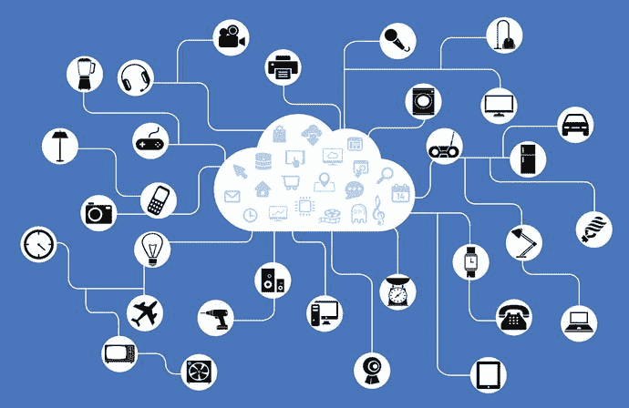
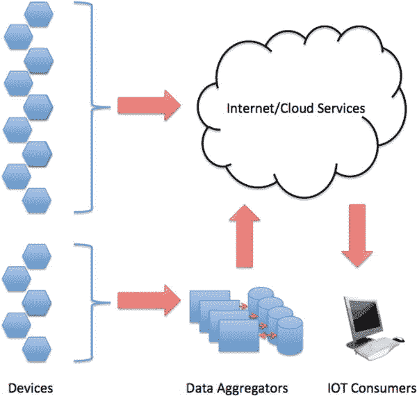
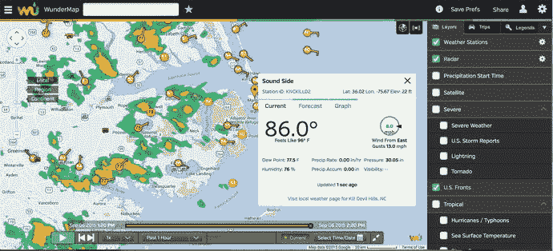
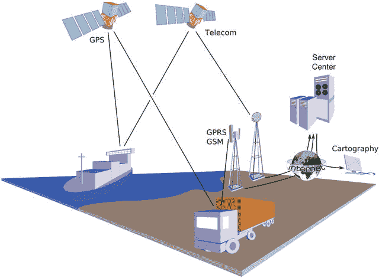
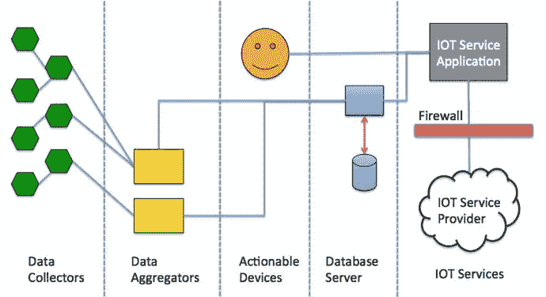

# 1.物联网和数据

Electronic supplementary material The online version of this chapter (doi:[10.​1007/​978-1-4842-1293-6_​1](http://dx.doi.org/10.1007/978-1-4842-1293-6_1)) contains supplementary material, which is available to authorized users.

互联网使开发人员能够创建解决方案，生成世界上任何地方的任何人都可以查看的数据。调整解决方案的原型或较小版本以融入互联网可能是一项挑战。这并不像在本地网络或类似的通信机制上采用一个可行的解决方案并增加互联网连接那么简单。例如，将您的传感器网络从几个传感器监控几个人查看的数据发展到一个包含数百个传感器的传感器网络，并且数据可能可供所有人查看，这可能需要重新设计您的通信方法、数据收集和数据存储。

你不仅要弄清楚如何扩展传感器、数据收集器和数据托管服务或数据库服务器之间的通信，还要处理数据的爆炸。也就是说，从十几个传感器中捕获数据相对容易，并且可能不需要太多的仔细规划来保存数据，但是从数百甚至数千个传感器中捕获数据要困难得多，因为数据以指数方式积累。

显然，将数据存储在可移动介质或文件中是不可能的——尤其是当您考虑数据将如何被使用时。此外，如何存储或更恰当地检索数据会使理解所有这些数据变得复杂。例如，如果你家里、汽车里、办公室里的每一个设备都产生数据，会发生什么？再加上对可穿戴传感器和类似设备日益增长的兴趣，你有可能产生比任何人都能管理甚至破译的数据更多的数据。

然而，不仅仅是传感器网络面临类似的数据危机。事实上，新兴和发展中物联网世界(IOT)的创新者最大的担忧是随着越来越多的设备生成、交流和呈现数据，数据爆炸的可能性。我们需要的是一种探索和利用这些数据的方法，一个起点是如何在较小的规模上收集和存储数据，如传感器网络。

What Is The Internet Of Things?

IOT 的本质是简单的互联设备，它们从观察、事实和其他数据中生成和交换数据，使其可供任何人使用。虽然似乎有一些营销努力试图将连接到互联网的任何东西都变成 IOT 的解决方案或设备(就像无耻地将一切都贴上“云”的标签一样)，但 IOT 的解决方案旨在使我们对周围世界的知识更加及时和相关，使我们可以随时随地获得任何东西的数据。无论如何，很明显 IOT 设备的数量有可能超过地球上的人口数量。

本书将指导您成功规划和实施传感器网络的数据存储组件以及类似的 IOT 解决方案。让我们先简短讨论一下 IOT 解决方案，然后看看开发以数据为中心的 IOT 解决方案的主要挑战。

## IOT 解决方案

IOT 解决方案就是一组设计用于产生、消费或呈现关于某个事件或一系列事件或观察结果的数据的设备。这可以包括生成数据的设备(如传感器)、组合数据以推断某些东西的设备、设计用于制表和存储数据的设备或服务，以及设计用于呈现数据的设备或系统。任何或所有这些都可以连接到互联网。

IOT 解决方案可能包括一个或所有这些品质，无论它们是结合在一个单一的设备，如网络摄像头，使用传感器包和监测单元，如气象站，或使用专用传感器，聚合器，数据存储和演示的复杂系统，如完整的家庭自动化系统。图 [1-1](#Fig1) 展示了通过数据库、数据收集器或集成器、显示服务甚至其他设备连接到互联网的所有设备的未来图景。

图 1-1。

The future of IOT—all devices, everywhere[2](#Fn2)

### IOT 不仅仅是连接到互联网

那么，如果一个设备连接到互联网，这是一个 IOT 解决方案吗？那取决于你问谁。一些人认为答案是肯定的。然而，其他人(比如我自己)认为答案是否定的，除非这样做有好处。

例如，如果你把你的烤面包机连接到互联网，这样做有什么好处？如果你的烤面包机给你的手机发短信说你的烤面包准备好了，这是毫无意义的(或者至少是极端古怪的)。因此，在这种情况下，答案是否定的。然而，如果你想监控不负责任的青少年或老年人，那么查看他们使用烤面包机的频率和时间可能会有所帮助。也就是说，您可以使用这些数据来帮助您对他们的护理和安全做出决策。

请允许我用另一个例子来说明。我有幸参加了 20 世纪 90 年代末在微软校园举行的设计研讨会。在我们参观校园期间，我们看到了世界上第一台可以上网的冰箱(也称为智能冰箱)。 [3](#Fn3) 货架上有传感器来检测食物的重量。有人建议，只要有点独创性，有人可以在牛奶供应不足时使用传感器通知杂货店，这将使人们不仅可以在线购物，而且可以自动购物。如果你住在杂货店送货上门的地方，这就太好了，但对我们这些生活在农村地区的人来说没什么帮助。虽然它没有被吹捧为 IOT 设备(该术语是后来创造的)，但许多人认为该设备展示了如果设备连接到互联网可能会发生什么。

因此，连接到互联网不是 IOT 的事情，也不是一个新概念。相反，IOT 解决方案必须是那些提供一些意义的东西——无论对某人或其他设备或服务的好处有多小。图 [1-2](#Fig2) 比图 [1-1](#Fig1) 描述得更清楚一些。

图 1-2。

“Connect the world” by Wilgengebroed on Flickr,[5](#Fn5) via Wikimedia Commons

请注意，在这里您可以看到连接到互联网的逻辑分组。观察相连的植物。该图描绘了几个传感器，但每个传感器不一定直接连接到互联网。将来自一个或多个工厂的传感器连接到中间节点更有可能且更实际，该中间节点将数据发送到互联网上的服务或网络中的另一个节点以供以后处理。图 [1-3](#Fig3) 显示了这在逻辑形式下的样子。

图 1-3。

How IOT devices connect to the Internet

图 [1-3](#Fig3) 的左侧是 IOT 装置。这些可能是简单的传感器、整个传感器网络、具有一个或多个传感器的设备、具有传感器的嵌入式微控制器解决方案、更复杂的基于微处理器的解决方案，甚至是微波炉、闹钟或电视等设备。一些设备将直接连接到互联网，如图 [1-3](#Fig3) 顶部所示。这些设备是具有内置网络功能的更复杂的设备。底部是连接到中间节点的设备，如数据聚合器、计算机等，它们在通过互联网连接呈现数据或将数据发送到云服务之前过滤、增强和存储数据。最右边是通过互联网或云服务访问数据的用户。当然，这可以是任何类型的设备，如笔记本电脑、台式机、平板电脑、手机、手表或其他智能设备或电器(包括另一个 IOT 设备)。

### IOT 服务

可悲的是，有些公司吹嘘拥有 IOT 的产品和服务，这只不过是营销炒作——就像一些公司通过在名称前加上“云”或附加“为了云”所做的那样。幸运的是，有一些真正好的产品和服务是专为 IOT 打造的。这些范围从数据存储和托管到专门的硬件。

事实上，企业在他们的产品中加入 IOT 服务的速度比任何人都快。它不是通常的嫌疑人，如互联网巨头。我看到思科、美国电话电报公司、惠普以及无数初创公司和小型企业提供 IOT 解决方案和服务。我使用术语 IOT 供应商来描述那些为 IOT 解决方案提供服务的企业。

你可能想知道这些服务和产品是什么，为什么有人会考虑使用它们。也就是说，什么是 IOT 服务，你为什么会决定购买它？您决定购买服务的最大原因是成本和上市时间。

如果您的开发人员没有资源或专业知识，并且获得这些资源或专业知识所需的费用超过了服务的费用，那么购买服务可能更经济。但是，您也应该考虑在决策中任何必要的重组。我曾经遇到过一个善意的、有良好文档记录的合同服务，它允许一个产品比预期的更快地进入市场，从而节省了大量成本。可悲的是，虽然该合同的冠军赢得了技术成就奖，但他们没有考虑到系统必须重新调整才能使用新服务。更具体地说，采用新服务比从头开始编写新服务需要更长的时间。因此，该组织没有节省资金，而是花费了近三倍的资金，并且上市时间较晚。显然，你必须考虑所有的因素。

同样，如果您的时间不多，或者您很难在截止日期前准备好解决方案，那么购买 IOT 服务可能比创建或修改您自己的服务更快。这可能需要多花一点钱，但在这种情况下，动机是时间，而不是(必然)成本。当然，实际上这是成本和时间的混合。

那么，IOT 有哪些服务呢？以下是过去几年出现的几个例子。随着 IOT 解决方案和服务的成熟，可能会提供更多的服务。

*   企业 IOT 数据托管和显示:允许您的用户开发企业 IOT 解决方案的服务，如连接、管理和定制友好形式的数据显示，如图形、图表等。例如:Xively ( [`https://xively.com/`](https://xively.com/) )。
*   IOT 数据存储:允许您存储 IOT 数据并获得简单报告的服务。例如:Sparkfun 的 IOT 数据服务( [`https://data.sparkfun.com/`](https://data.sparkfun.com/) )。
*   网络:为 IOT 提供网络和类似通信协议或平台的服务。大多数专门从事机器对机器(M2M)服务。例如:美国电话电报公司的蜂窝全球 SIM 卡服务( [`http://business.att.com/enterprise/Family/mobility-services/internet-of-things`](http://business.att.com/enterprise/Family/mobility-services/internet-of-things) )。
*   IOT 硬件平台:允许您使用硬件平台和一系列受支持的模块和工具快速开发和制作 IOT 设备原型的供应商，用于构建从简单组件到完整设备的设备。例如:英特尔的 IOT 网关开发套件( [`http://intel.com/content/www/us/en/embedded/solutions/iot-gateway/development-kits.html`](http://intel.com/content/www/us/en/embedded/solutions/iot-gateway/development-kits.html) )。

How To Raise Capital For Development: Kickstarter

在开发新的解决方案时，有时可能需要资金来赚钱。无论听起来多么滑稽，大多数开发者并不富裕，也没有资金投入到他们设备的大规模生产工具和生产中。幸运的是，互联网为开发商提供了一个筹集资金的机制，以将他们的想法推向市场。

虽然有几个网站提供类似的服务，但 Kickstarter ( [`http://kickstarter.com`](http://kickstarter.com/) )提供了一种革命性的融资方式。你可以在网站上发布你的想法，并提供你的产品或服务，收取少量的捐款。事实上，大多数成功的 Kickstarter 活动都会为捐款者提供回报和同情。例如，小额捐赠可以让你得到一件 t 恤或者打折购买产品的机会。对于一个更大的捐赠，你可能会得到第一个生产单位，免费升级到新的模式，甚至在利润的股份。

Kickstarter 不仅允许开发者筹集资金，还允许个人以比典型的风险投资家低得多的货币承诺参与项目融资。如果你感兴趣，请访问 Kickstarter 主页，浏览数百个可用的活动。你永远不知道，你可能会找到你想投资的东西。

为了让你知道什么是可能的，看看 Kossel Pro 的 Kickstarter 活动( [`http://kickstarter.com/projects/ttstam/openbeam-kossel-pro-a-new-type-of-3d-printer`](http://kickstarter.com/projects/ttstam/openbeam-kossel-pro-a-new-type-of-3d-printer) )。开发商的资金目标增加了一倍多，他们的产品已经成为现实，订单源源不断。我应该知道；我拥有首批生产单位之一！

### IOT 解决方案示例

让我们来看一些 IOT 解决方案的例子。本节中描述的 IOT 解决方案是多种解决方案的组合，您应该对 IOT 解决方案的规模和复杂性有所了解。我还指出了其中一些解决方案如何利用 IOT 供应商的服务。

#### 传感器网络

传感器网络是 IOT 解决方案最常见的形式之一。简单地说，传感器网络让你可以观察你周围的世界并理解它。传感器网络可以采取池塘监测系统的形式，提醒你水位、水的纯度(污染)和水温；探测捕食者；甚至可以自动开启照明或喂鱼等功能。如果你或你认识的人在医疗机构呆过一段时间，就有可能使用传感器网络来监控身体功能，如体温、心脏和呼吸，甚至运动。现代汽车还包含传感器网络，专用于监控发动机、气候，甚至一些汽车的路况。例如，车道警告功能使用传感器(通常是摄像头、微处理器和软件)来检测您何时偏离车道或道路分界线太远。

因此，传感器网络采用一个或多个传感器，这些传感器对事件或状态进行测量(观察)，并将该数据传送给网络中的另一个组件或节点，然后以某种形式呈现该数据以供分析。让我们来看一个有趣的替代天气服务的例子。

Weather Underground ( [`http://wunderground.com`](http://wunderground.com/) )是一个社区驱动的网站，它允许世界各地的业余和专业气象爱好者将他们的气象站连接到互联网，并共享他们的传感器提供的数据。这意味着您只需点击地图并放大即可获得您所在地区、城市甚至地方的最新天气信息。您将看到代表每个当地气象站(显示当地温度)的图标，单击这些图标可以查看更多信息。图 [1-4](#Fig4) 显示了 Weather Underground 使用谷歌地图显示气象站的神奇地图。如你所见，你可以点击任何一个气象站来查看更多信息。

图 1-4。

Weather Station Network (courtesy of [`http://wunderground.com/wundermap`](http://wunderground.com/wundermap) )

你可以用神奇地图做更多的事情。正如你所看到的，地图还显示了雷达数据，你可以使用它来查看哪里可能会发生降水。您还可以看到地图在动态回放以前从雷达和气象站更新的数据。对于那些对天气感兴趣的人来说，Weather Underground 是一个非常棒的网站——无论你是否有自己的气象站，你都可以从这个网站上获得大量的信息。

这可能是我发现的最好的例子之一，来说明 IOT 的力量，特别是传感器网络。您不仅可以看到邻居气象站的传感器生成的数据，还可以看到来自该地区、该州甚至整个国家的几十个气象站的数据！这就是 IOT 物化的真正力量。

#### 车队管理

IOT 解决方案的另一个例子是车队管理系统( [`https://en.wikipedia.org/wiki/Fleet_management`](https://en.wikipedia.org/wiki/Fleet_management) )。虽然远在 IOT 一词出现之前就已开发和部署，但车队管理系统允许企业监控他们的汽车、卡车、船只——几乎是任何移动设备——不仅可以跟踪他们的当前位置，还可以使用位置数据(一段时间内获得的 GPS 坐标)来规划更有效的路线，从而降低运输成本。

车队管理系统不仅仅是为了路由。事实上，车队管理系统允许企业监控每个单位进行诊断。例如，可以知道每辆卡车中有多少燃料，上次维护是什么时候进行的(或者更重要的是，下次维护是什么时候)，等等。车辆地理跟踪和诊断的结合被称为远程信息处理。图 [1-5](#Fig5) 说明了车队管理系统。

图 1-5。

Fleet management example[6](#Fn6)

在该图中，您将看到 GPS 系统如何跟踪位置，以及如何通过卫星通信传输更多数据，如诊断信息、有效负载状态等。所有这些最终都会通过互联网，业务分析师可以访问这些数据。

你可能认为船队管理系统只适用于大型航运公司，但随着 GPS 模块甚至微控制器市场的激增，任何人都可以创建船队管理系统。也就是说，它们不需要花费数百万美元来开发。例如，如果您拥有一家自行车送货公司，您可以轻松地将 GPS 模块与每个送货人的蜂窝或无线连接相结合，以跟踪他们的位置、平均行程时间等。更具体地说，您可以用一个 Arduino 和一组小型支持电子设备构建一个 GPS 跟踪解决方案。事实上，我建议这样一个解决方案可以用来最小化递送时间，它允许包裹从一个递送人交给另一个递送人，而不是让他们在每次完成一组递送后都返回仓库。

#### 家庭自动化

另一个越来越流行的 IOT 解决方案是家庭自动化 [8](#Fn8) (也称为智能家庭)。虽然从任何意义上来说都不新鲜(家庭自动化已经存在很长时间了)，但家庭自动化解决方案已经变得越来越有趣，因为许多供应商正在让它们为互联网做好准备。事实上，大多数解决方案要么提供从互联网直接访问，要么通过云服务访问。

家庭自动化解决方案通常是一组传感器、致动器和设备，允许您控制家中的事物。您可以找到传感器来检测运动、门窗状态(开/关)、温度、湿度等。你还可以找到像锁这样的致动器，让你远程解锁或锁门，打开和关闭车库门，甚至开灯和关灯。最后，你可以找到更复杂的设备，如可以远程编程的智能恒温器、可以观看和记录图像的摄像机、机器人吸尘器，甚至可以让你像在家里一样拨号的电话。虽然这些都不是新的，但新的是将这些设备打包到 IOT 解决方案中。

例如，许多家装商店，如 Lowes 和 Home Depot 都有自己的家庭自动化解决方案系列。您可以找到现成的安装设备，如门锁、摄像头、恒温器等，您可以快速轻松地安装这些设备，并借助随附的软件进行远程访问。甚至有一种设备可以让你开关厨房的水龙头！

Lowes 解决方案名为 Iris ( [`http://irisbylowes.com`](http://irisbylowes.com/) )，是一种订阅服务，结合了一个特殊的网络集线器(称为 Iris smart hub)，所有设备都连接到这个网络集线器。要访问生成的数据和家庭安全、宠物监控等功能，您可以使用适用于 Android 或 IOS 设备的应用(app)。该订阅有几个级别，从免费的基本服务(允许您连接到设备以获得基本服务，如锁定和解锁门、检测移动、查看相机的短视频等)到。付费服务允许您更多地访问设备并远程控制它们，例如安排设备电源(当您离开时随机开灯，让它看起来像您在家)等等。Iris 是作为入门套件出售的，带有一些设备，您可以根据预算或需求进行扩展。有关更多信息，请参见 Iris 页面。

家得宝解决方案( [`http://homedepot.com/c/Home_Automation_Basics`](http://homedepot.com/c/Home_Automation_Basics) )也使用了一个集线器(称为 Wink)，但与 Lowe 的解决方案不同，您可以添加的设备不需要来自单一供应商。事实上，您可以添加通过 Wi-Fi、蓝牙 LE、Z-Wave、ZigBee、Lutron、ClearConnect 和 Kidde 进行通信的设备。因此，您可以更自由地混合搭配您的设备，根据您的需求扩展您的解决方案。像 Lowe 的解决方案一样，你可以通过一个名为 Wink app 的应用监控各种事情并查看数据。我还应该补充一点，家得宝提供的一些家庭自动化设备可以在没有集线器的情况下运行，但远程访问需要集线器。像劳氏一样，你可以购买易于安装和使用的初学者工具包。请参见家得宝家庭自动化页面，了解更多详细信息和可用套件的链接。

劳氏公司和家得宝公司的解决方案只是众多可用方案中的两个。在谷歌上快速搜索会有几十个结果供你选择——有些是像 Lowe's solution 这样的专利产品，有些则更加开放，或者可以被多家厂商的设备扩展。

您还可以使用 Arduino、Raspberry Pi 和 BeagleBone 等微控制器构建自己的家庭自动化解决方案。有很多关于这个主题的书，从简单的解决方案到复杂的解决方案。以下只是越来越多的 DIY 家庭自动化书籍中的几本。

*   Steven Goodwin，使用 Linux 和 Raspberry Pi 的智能家庭自动化(Apress，2013 年)
*   Marco Schwartz，Arduino 家庭自动化项目(Packt 出版社，2014 年)
*   Onur Dundar,《采用英特尔 Galileo 的家庭自动化》( Packt 出版社，2015 年)

您还可以在互联网上找到创建家庭自动化解决方案的说明。复杂解决方案的一个例子是 Eric Tsai 在 [`http://instructables.com/id/Uber-Home-Automation-w-Arduino-Pi/`](http://instructables.com/id/Uber-Home-Automation-w-Arduino-Pi/) 发表的文章(称为 instructable)。在他的文章中，Eric 描述了一个家庭自动化解决方案的基础，您可以使用易于获得和易于使用的组件来构建自己的解决方案。图 [1-6](#Fig6) 展示了 Eric 文章中的一个例子，描述了一点想象力就能实现的事情。

图 1-6。

DIY home automation (courtesy of Eric Tsai, [`http://etsai.net`](http://etsai.net/) )

如你所见，有了 DIY 家庭自动化解决方案，你可以随心所欲地建造它。您可以添加通过 ZigBee 模块通信的 Arduino 控制的传感器、监控摄像机的 Raspberry Pi 板、控制车库门的定制电子设备等等！事实上，如果你渴望成为一名创造者或者是一名有成就的创造者，你可以修改现有的设备来增加远程功能。例如，车库门开启器很容易添加无线模块，以便通过本地 WiFi(甚至互联网)发送信号。即使你不是一个经验丰富的软件开发人员，你也可以使用 XIV ly([`http://xively.com/`](http://xively.com/))等服务来发送你的家庭自动化数据进行监控。当然，如果你花一点时间开发一个简单的网页，你可以通过本地网络连接你的家庭自动化解决方案。虽然它可能不像商业单位那样花哨，但你可以让它做你想做的任何事情。

现在，您已经知道了什么是 IOT 解决方案，并且已经看到了一些例子，让我们来讨论一下 IOT 解决方案中最重要的组成部分:数据。

## 什么是 IOT 数据？

无论您的 IOT 解决方案是在您洗完澡后看着您的玉米煎饼早餐，还是在暴风雨中依靠仪器将您的船引导到安全的地方，产生和处理的数据都是最重要的工件，实际上是 IOT 解决方案的生命线。

为什么呢？因为没有数据，解决方案是没有意义的。例如，如果你有一个 IOT 解决方案，监测你的身体功能，但从来没有存储数据，你最多可以实现的是一个瞬时读数。如果不存储数据，您将无法对过去的事件进行任何诊断。显然，数据很重要。

或许同样重要的是如何存储这些数据并防止被利用或滥用。这是 IOT 解决方案的一个特别重要的方面，我将在后面详细讨论。现在，让我们从一个简单的工厂监控系统开始考虑 IOT 解决方案的数据。图 [1-7](#Fig7) 显示了单个工厂的简单解决方案。虽然一个好的解决方案还包括一个光传感器来监控植物接收到多少光，但这个已经被简化了，所以你可以看到产生的数据。

图 1-7。

Plant monitoring with Arduino

在本例中，您会看到一台连接了土壤湿度传感器的 Arduino。Arduino 从放置在植物土壤中的土壤湿度传感器生成一个读数列表。这样做的代码并不复杂，如清单 [1-1](#FPar3) 所示。

Listing 1-1.Plant Soil Monitoring

`/*`

`Simple Plant Monitor Example`

`Display the value of the soil moisture sensor and threshold status.`

`*/`

`// Thresholds for sensor to detect wet/dry conditions. Adjust these`

`// to match your soil characteristics.`

`int upper = 400;`

`int lower = 250;`

`// Pin for reading the sensor`

`int sensorPin = A0;`

`void setup() {`

`// Open serial communications and wait for port to open:`

`Serial.begin(115200);`

`while (!Serial);`

`Serial.println("Simple plant monitor");`

`Serial.println("raw value, moisture state");`

`}`

`void loop() {`

`int value;`

`// Read the sensor`

`value = analogRead(sensorPin);`

`Serial.print(value);`

`Serial.print(",");`

`// If value is less than lower threshold, soil is dry else if it`

`// is greater than upper threshold, it is wet, else all is well.`

`if (value <= lower) {`

`Serial.print("dry");`

`} else if (value >= upper) {`

`Serial.print("wet");`

`} else {`

`Serial.print("ok");`

`}`

`Serial.println();`

`delay(1000);`

`}`

我使用串行监视器作为输出，这样做很简单，以便您可以看到生成的数据。清单 [1-2](#FPar5) 显示了一个示例运行的输出，其中我在运行期间给植物浇水。请注意，在输出列表中，当我给植物浇水时，传感器正确地测量到了一个变化(数值没有显著变化)。如果您正在构建一个更复杂(更有用)的工厂监视器，您可能会使用某种形式的输出，如 LCD 面板或 web 服务器，或者您会将数据存储在数据库中。

Listing 1-2.Output of Soil-Monitoring Example

`Simple plant monitor`

`raw value, moisture state`

`159,dry`

`217,dry`

`225,dry`

`224,dry`

`225,dry`

`225,dry`

`226,dry`

`248,dry`

`249,dry`

`256,ok`

`261,ok`

`279,ok`

`276,ok`

`254,ok`

`266,ok`

`295,ok`

`291,ok`

`302,ok`

`394,ok`

`467,wet`

`506,wet`

`419,` `wet`

Note

您可以从 Apress 网站下载本书的源代码示例。

对于这个示例，文本输出就足够了。这是因为我想提醒大家注意数据行。第一列是从传感器读取的原始值。显然，这些数据几乎没有人类可读的信息。毕竟对于模拟信号来说只是一个数值。这就是我使用阈值来确定或限定数据的原因。随着数值的变化和水分含量的上升，您可以看到这一点。

如您所见，对我们最有意义的数据是“干”、“湿”和“正常”值。原始值并不那么有趣。这是一个很好的，虽然过于简单的例子，说明了来自传感器的原始数据如何需要额外的增强才能变得有用。但是，我还必须指出，如果您只存储了派生值，如果您需要调整阈值，您就不能重新评估派生值。例如，如果您确定阈值上限需要更改，并且您想要对该更改如何影响过去的读数进行一些分析，因为您只有“干”、“湿”和“正常”值，所以您不能执行此分析。因此，保存原始数据总是一个好的做法。

Tip

始终保存原始数据以及计算值或导出值。你永远不知道你什么时候会需要它。

如果您有兴趣构建这个示例，或者用 LCD 或 LED 来修饰它，以便在植物需要水时发出警告，或者更好地用伺服或步进电机和水源来自动给植物浇水，我鼓励您这样做。这是一个有趣的项目。您甚至可以修改代码来支持一个 web 服务器，您可以使用它来远程检查您的植物的状态。 [9](#Fn9) 这些零件很容易找到，可以从大多数在线电子商店买到，如 SparkFun ( [`http://sparkfun.com`](http://sparkfun.com/) )、Maker Shed ( [`http://makershed.com`](http://makershed.com/) )、AdaFruit ( [`http://adafruit.com`](http://adafruit.com/) )。我包含了一些文章的链接，这些文章从简单到复杂，解释了如何构建这个项目和类似的项目。图 [1-8](#Fig8) 显示了传感器如何连接到 Arduino。

图 1-8。

Wiring the simple plant monitor

*   Sparkfun 的土壤水分教程( [`https://learn.sparkfun.com/tutorials/soil-moisture-sensor-hookup-guide?_ga=1.98811421.2053037341.1391972341`](https://learn.sparkfun.com/tutorials/soil-moisture-sensor-hookup-guide?_ga=1.98811421.2053037341.1391972341) )
*   土壤水分与小树林成分( [`http://seeedstudio.com/wiki/Grove_-_Moisture_Sensor`](http://seeedstudio.com/wiki/Grove_-_Moisture_Sensor) )
*   Make's 盆栽植物保护器([`http://makezine.com/projects/potted-plant-protecto`【r/](http://makezine.com/projects/potted-plant-protector/))
*   自动浇水的植物( [`http://instructables.com/id/Self-Watering-Plant/`](http://instructables.com/id/Self-Watering-Plant/) )
*   Adafruit 的无线花园教程( [`https://learn.adafruit.com/wireless-gardening-arduino-cc3000-wifi-modules`](https://learn.adafruit.com/wireless-gardening-arduino-cc3000-wifi-modules) )

我想向你们展示这些数据还有一个原因。IOT 解决方案通常采用网络中的中间节点。更具体地说，通常情况下，传感器被安装或连接到更小的一组电子设备，例如微控制器或甚至简单的集成电路。然后，该节点将获取传感器值，并将它们发送到网络上其他地方的另一个节点。值得注意的是，该级别可以使用除以太网或 WiFi 之外的网络协议来简化和减少每个设备拥有唯一地址的需求。这些设备通常没有足够的资源来支持更复杂的网络协议，因此需要可以用有限资源实现的更轻量级的东西。

当像这样在节点之间交换数据时，它被称为机器对机器数据交换，并且通常以原始形式传输。这有几个原因。最值得注意的是节省内存，有助于加快通信速度，特别是对于小型微控制器和类似的嵌入式处理器。也就是说，发送单个整数甚至浮点值比发送格式化的文本字符串要快得多。如果传感器级别的节点使用在较低资源(内存)下运行的通信协议，如 XBee 模块，这可能是至关重要的。

谈到 IOT 解决方案中的所有数据，人们一定想知道这些数据都去了哪里，这些数据将如何积累。

## 物联网预测:数据霸主？

你不用在网上找太多或太久就能发现一些关于 IOT 的可怕预测。 [10 这提出了两个问题:需要更多的地址空间(IP 地址)和可寻址性，以及需要更好的方法来管理极其大量的数据(大数据)。不太受欢迎但同样重要的是 IOT 数据、设备和服务的安全性。我将在接下来的章节中逐一讨论这些问题。](#Fn10)

### 寻址 IOT 设备

仅仅因为你可以在地球上的任意一个地方找到一个地址，就不一定容易找到。也就是说，如果你在沙漠中的某个地方用一个鲜红色的“X”标记一块石头，或者简单地在上面写一个数字，没有人会找到它。即使人们花时间去搜索沙漠，他们也需要一个大概区域的提示来找到它。当然，您可以添加元数据，如纬度和经度，甚至是 GPS 导航信标，但您放在岩石上的“X”显然是不够的信息。这说明了寻址 IOT 设备的两个问题:拥有唯一标识设备的方法和查找或寻址设备。

#### 有足够的地址吗？

人们有理由担心 IOT 设备的数量将很快超过可用 IP 地址的最大容量。目前，IPv6 协议 [11](#Fn11) 允许大约 3.4×10 38 个地址。那是 340 个十亿分之一的数字！虽然这是一个巨大的数字，但公共地址的可用范围可能会少得多，但仍处于十一亿分之一的水平。这很好，因为有人预测未来 IOT 设备的数量将达到数十亿，甚至数千亿、数千亿或数百万亿。

即使公共可寻址 IPv6 地址的数量是可用 IPv6 地址的一半甚至四分之一，我们也不会很快用完。事实上，IPv6 有可能在未来为所有可能的 IOT 设备提供足够的寻址能力，但是所有这些设备都被寻址并不意味着它们会很容易被发现。

#### 你如何找到一个 IOT 设备？

给 IOT 设备分配一个 IP 地址并不一定容易找到。事实上，如果每台 IOT 设备都有自己的 IP 地址，那么所有设备都可以连接到互联网，甚至可以互相连接，但是你怎么找到你要找的设备呢？如果他们是您的设备或您认识的愿意分享其地址的人，您可以通过了解正确的信息找到他们。但是如果你想知道你的邻居中是否有人有户外摄像机呢？假设您需要访问他们的图像来帮助破案或识别流浪动物的行踪？除了敲邻居的门，没有简单的方法找到这些 IOT 相机。

A Simple Search Is Not Enough

仅仅搜索可用的 IPv6 地址来寻找 IOT 设备是不够的。一些人估计，即使使用速度适中的搜索引擎，搜索和识别所有连接到互联网的 IPv6 设备也可能需要许多年甚至数千年的时间。这还不包括每天添加或删除的内容。显然，我们不能简单地将 IPv6 功能添加到我们生活中的每一个移动(或不移动)的电子设备或事物中，并期望能够在不了解它们是什么、它们在哪里以及它们做什么的情况下访问它们。

就像沙漠中的岩石一样，你需要更多的信息。你需要知道那个设备是如何连接的，它是做什么的，它是如何使用的，它产生什么数据。因此，您需要某种形式的代理或服务来跟踪设备。也许一个更尖锐的问题是，为什么你首先需要知道或使用这个设备？你不是更有可能把邻居的家当作可以请求数据的服务吗？例如，如果您可以使用谷歌地图找到您的邻居，并点击您周围的家庭，以查看哪些 IOT 数据是公开可用的，这难道不比试图找到一个特定的 IOT 设备(相机)更有用吗？这听起来不耳熟吗？应该的。这正是 WunderMap 在 Weather Underground 网站中的工作方式。

在这种情况下，每个家庭都是一个生成数据的 IOT 服务提供商。一些数据可以公开，如面向外部的摄像头，而其他数据可能是私人的，需要安全登录才能访问家中的设备。回想一下家庭自动化用例。想象一下，如果能够远程检查你的家，或者允许保姆看电视或使用厨房里的设备，会有多方便。

不管 IOT 服务是什么，事实是你不太可能需要直接访问 IOT 设备。该服务可以提供所有需要(或允许)的功能。这不仅大大减少了搜索问题，还有助于限制可公开寻址的 IOT 设备的数量。也就是说，IOT 服务“背后”或“内部”的设备不需要公开。更重要的是，这使您能够以更强大的方式保护您的 IOT 设备。想象一下，如果你发现你的 IOT 相机可以被任何地方的任何人通过简单的黑客攻击访问，那将意味着什么。

通过将 IOT 设备置于 IOT 服务(或代理、应用等)之后，您还允许使用资源较少的通信协议。也就是说，IOT 设备可以由更便宜和更有限的硬件构建。例如，您不需要笔记本电脑来监控植物传感器。此外，如果您有一个家庭自动化解决方案，允许您连接一个使用 XBee 协议的工厂监控器，那么您可以使用更少的硬件来构建工厂传感器，从而降低成本。

更小或更低资源的硬件和通信协议解决了特别是 IOT 设备和传感器的另一个问题。传感器没有按照预设的时间间隔生成数据。虽然有些传感器包含计时器电路或只能定期生成值，但传感器通常会由另一个设备(如 Arduino、Raspberry Pi 等)以特定间隔轮询。

此外，诸如 XBee 之类的通信协议不是无损机制。事实上，尽管很少，数据丢失是可能的，并且协议支持数据包的完全丢失。如果您的传感器每分钟生成 30 个值，那么您只收到 29 个而不是 30 个值真的有关系吗？也许有些解决方案可能需要更高的精度，但对于监控事件的传感器来说，这是可以接受的，并且非常适合传感器模型。它考虑了值未准备好的可能性；传感器没有改变它的状态，等等，允许您支持更广泛的传感器行为。

我在这里描述的解决方案已经以多种方式被标记，但是最正确的和实际上最深刻的 IOT 架构被称为 Chirp。弗朗西斯·达科斯塔(Francis daCosta)在他的著作《重新思考物联网》(Apress，2013)中描述了这种架构。

啁啾只是一个小数据包的名称，它只包含将数据传送到目的地所需的最少信息。这符合轻型协议的小开销要求，也允许偶尔丢失数据包。在 IOT 解决方案的最低端，设备使用支持将啁啾发送到节点的协议，这些节点可以监控数据并采取适当的行动。例如，可以构建节点来获取一分钟内生成的 30 个样本，并在一段时间内(比如每五分钟)对它们进行平均，以生成更平滑的数据样本。我见过这种技术被用于使用不太精确的传感器的解决方案，其中不使用超过阈值的尖峰(高或低)，从而允许以较低的速率从传感器获得更平滑的读数。这是更少的数据，但可能更准确。

因此，IOT 解决方案将由几个层构成。在最底层，IOT 设备通过网络连接到收集或处理数据的节点，这些节点再连接到提供或支持特定服务的设备。例如，IOT 摄像机可以连接到一个中间节点，该节点从更高层的节点接收命令。类似地，可以使用几个数据聚合和数据处理节点来使用和监控传感器网络，这些节点将数据发送到数据库，然后由更高层中的节点访问该数据库。图 [1-9](#Fig9) 显示了这个概念的一个例子。

图 1-9。

Concept of layered IOT solution

请注意，在顶部，我已将 IOT 服务背后的图层标记为私有。这表明这些层和其中的设备不能从互联网直接访问。这并没有停止让它们成为 IOT 设备；相反，它有助于定义解决方案分层的架构，以便通过仅使用必要的协议(以及每层所需的硬件)来实现优化。例如，设备、安全实践和编程的复杂程度在图中从左向右增加。

例如，图 [1-9](#Fig9) 的左侧是一组使用 ZigBee 网络连接的传感器或轻型 IOT 设备。这可以采用小型设备的形式，使用 XBee 模块将数据发送到包含数据聚合和数据库节点的下一层。在这一层，您可以使用私有的 IPv4 以太网。为什么选择 IPv4？因为像 Arduino 和 Raspberry Pi 这样的小设备大多是原生默认支持的。因此，您可以开始将这些节点与一个应用节点连接起来，该应用节点提供了到基于云的服务的网关。此时，您可以继续使用 IPv4 或切换到 IPv6，因为这可能是一个更复杂的服务器。在图 [1-9](#Fig9) 的右侧是您将用来授权访问您的 IOT 解决方案的 IOT 服务的描述。这可以是任何东西，从前端 web 服务器到由商业 IOT 供应商提供的完整的 IOT 解决方案。

显然，像这样的架构允许较低层(左边的那些)与资源较少的协议通信，甚至处理偶尔的数据丢失，而较高层(右边的那些)与更复杂的协议通信。这还允许您将解决方案中更复杂的部分放在最适合该任务的层或设备上。例如，虽然你可以将 Arduino 连接到 MySQL 数据库服务器， [12](#Fn12) 但你不太可能将它托管在与其他服务相同的平台上(但你可以在 Raspberry Pi 上托管)。最后，它允许您为每一层设计适当的安全级别。

现在您已经了解了 IOT 设备的寻址问题，让我们来讨论一下数据。随着数十亿台 IOT 设备生成数据，这些数据将流向哪里？您将如何访问这些数据？

### IOT 和大数据

IOT 专家担心的另一个问题是，IOT 解决方案生成的数据量会以多快的速度增长。也就是说，随着越来越多的 IOT 设备的添加和数据的归档，数据的大小将呈指数级增长。当数据变得足够大时，使用传统的数据库访问机制来访问它就不再可行了。例如，访问位于美国的所有恒温器的传感器数据最终可能会变成一个大得离谱的数字(行数、字节数等等)。即使你有理由看到这些数据，数据量也是巨大的。如果按州来缩小范围，数据可能仍然比可能搜索或检索的要多。

What Is Big Data?

大数据 [13](#Fn13) 是指将被处理、分析、查看或以其他方式操纵以得出结论的数据的相对大小(例如，数据分析、数据仓库等)。相对大小是指大数据超出了大多数计算平台在合理时间内容纳或处理数据的能力这一特征。也就是说，它超出了单个系统甚至复杂系统的处理能力。 [14](#Fn14)

有许多处理大数据的方法，但大多数解决方案使用几十到几千个计算平台来分而治之。两个显著的例子是 Oracle 的大数据产品( [`http://oracle.com/big-data/index.html`](http://oracle.com/big-data/index.html) )和 MySQL + Hadoop ( [`http://mysql.com/why-mysql/white-papers/mysql-and-hadoop-guide-to-big-data-integration/`](http://mysql.com/why-mysql/white-papers/mysql-and-hadoop-guide-to-big-data-integration/) )。虽然这些解决方案基于客户或用例而有所不同，但它们都解决了利用分布式数据库和执行来处理数据的问题(在较高层次上)。

因此，一些专家认为 IOT 将产生大量数据，并且只能用于大数据解决方案。例如，如果您想要分析某个地理区域(州、国家)内某类 IOT 设备的使用模式，即使每台 IOT 设备可能单独托管其数据，也需要汇总数据以进行编译和处理。因此，即使每台设备只有少量数据，将数百万甚至数十亿台 IOT 设备上的数据聚合起来也会产生大数据危机。

此外，虽然我和其他人提出了 IOT 解决方案的分层方法，并且大多数解决方案很可能构建为托管自己的数据，但在某个时候，我们仍可能希望在类似的 IOT 解决方案中搜索和挖掘数据。虽然恒温器的例子有点虚构，但更有可能的是，您需要研究这些解决方案的数据，以开发温度波动、高峰天气月份的燃料使用量，甚至池塘和水库的蒸发率等模式，从而帮助预测耗水量和节水率。在这种情况下，您可能需要从多个存储库中挖掘数据。

因此，即使对数据进行了划分，没有一个数据库可以容纳所有的数据，您挖掘的数据也可能需要临时存储以供分析，这使得数据分析成为处理大数据的一种情况。然而，从某种程度上来说，从 IOT 获取、聚合和处理数据确实需要专业的大数据解决方案。

Not Everyone Agrees

您可能会觉得有趣，关于大数据有几个思想流派。一些人批评它的存在，另一些人批评我们用来处理大数据的机制，还有一些人坚持认为真正的解决方案尚未实现。无论如何，大数据的前景仍在发展。

幸运的是，有许多供应商正在解决这个问题，云服务提供商的激增确保我们不必自己创建大数据解决方案。然而，我们仍然需要处理存储和访问我们的 IOT 解决方案数据——这也是本书的全部内容。

Tip

如果您想了解更多关于大数据及其与 IOT 的关系，请参阅 Stackowiak、Licht、Mantha 和 Nagode 的书《大数据和物联网》(Apress，2015)。

既然您已经了解 IOT 数据不是小事，而且确实有可能成为一个大规模的档案库，可以从我们周围的世界中获取更多的知识，那么让我们讨论一下除了如何存储数据之外的首要问题，即如何保护数据和 IOT 解决方案免受利用。

## IOT 安全

IOT 开发人员还需要考虑保护他们的设备、数据和服务。事实上，所有使用互联网的解决方案都必须开发更好的安全实践。由于存在多个漏洞，IOT 解决方案的独特之处使得计划和实施严格的安全措施变得尤为困难。更具体地说，每个组件可能有不同类型的漏洞，从对传感器和 IOT 设备的物理访问到针对 IOT 服务的远程攻击。

最近一连串的大规模数据泄露事件证明，安全性根本不够好。我们已经看到了从直接盗窃到利用从知名企业(如 Target)和政府机构(如美国人事管理办公室)窃取的数据(超过 4000 万个信用卡号码可能已被泄露)的一切。有趣的是，违规的源头可以追溯到第三方承包商和服务。显然，没有人是安全的。我们需要一个革命性的步骤，而不是改进行之有效的机制。

可悲的是，在保护我们的解决方案方面，我们能走的路是有限的。任何信息技术(IT)专业人士都会告诉您，应用最好的、严格的密码策略和严密的安全措施会迫使用户危及旨在保护他们及其数据的策略。例如，考虑要求密码为 16 个或更多字符的密码策略，其中至少有四个大写字母、六个数字、三个特殊字符，并且没有英语词典单词；每 60 天过期一次；并且与以前的密码相同的字符不超过七个。在这种情况下，一些用户将被迫写下他们的密码，因为他们记不住字母、大写字母、数字和特殊字符的随机组合。

然而，让密码更难猜测或破解只是一种策略。事实上，关于如何正确保护系统有各种各样的理念。虽然对所有技术的深入讨论超出了本书的范围，但考虑一种我们可以用于 IOT 解决方案的更流行的理念是很重要的。这是一种使用多个组件来识别个人的理念。

例如，用户可能需要知道一个关键短语(密码)，拥有一个授权的有形护身符(RFID 徽章)，并拥有一个生物特征签名(指纹)。要进入其中一个系统，用户必须知道密码，出示有效的 RFID 徽章，并读取和验证他们的指纹。

这听起来可能有点像科幻小说，甚至是超级机密的间谍工作，但它确保访问权限将只授予满足所有三个组成部分的人。也就是说，有可能猜测、破解或简单地窃取用户的密码，并且有可能获取甚至欺骗 RFID 徽章；甚至有可能(无论多么牵强)复制某人的指纹。在不泄露用户身份的情况下获取所有三个组件要困难得多。然而，缺点是用户无法获得访问权限，除非她拥有所有这三个组件。虽然用户不太可能丢失他们的指纹(但受伤和皮肤状况可能会使读取器失败)，但用户可能会丢失或放错他们的徽章或忘记他们的密码。因此，安全实践再次削弱了用户的体验，使用户更难访问系统。

那我们该怎么办？我们是否实施了良好的实践来确保系统不被轻易破坏，或者我们是否为了易用性而冒降低安全性的风险？底线是，您必须选择最能满足保护数据和服务需求的安全解决方案，而不会迫使用户忍受繁重的工作，也不会给他们的生活带来困难。

您可能想知道这与您基于 Arduino 的传感器平台有什么关系。毕竟，没有什么人可以利用 Arduino，不是吗？这取决于 Arduino 及其连接方式。例如，可以利用支持通用轻量级操作系统或连接到您的网络的较新的 Arduino。我不会详述这一点，但可以说这是可能的。IOT 设备越复杂，被利用的风险就越大。例如，一般来说，Raspberry Pi 可能比裸机传感器和 XBee 模块具有更大的风险。这是因为 Raspberry Pi 能够运行 Linux，因此支持各种黑客工具和实用程序。

Caution

无论您对用户可访问的设备采用哪种安全理念或策略，您仍然必须考虑保护网络中其余节点的安全。

但是不仅仅是软件可以被利用。例如，将 IOT 设备放置在通过以太网连接的室外机箱中，很容易受到黑客的攻击，黑客可以访问以太网电缆。诚然，有人必须知道 IOT 设备的存在，但被利用的风险是真实的。为了解决这个问题，你可以使用重量更轻的硬件和更简单的通信协议 [17](#Fn17) ，它们不容易被黑客攻击。

但是，对于设计良好的 IOT 解决方案来说，安全性真的是一个问题吗？让我们看一个最近的例子。美国(和世界)最大的汽车品牌之一吉普最近因其信息娱乐 [18](#Fn18) 解决方案的漏洞而受到抨击。一群技术高超的黑客能够远程访问该系统，侵入车内的其他电子设备。该小组能够鸣喇叭，打开雨刷，甚至影响操纵和刹车。更糟糕的是，这一切都发生在《黑客在高速公路上远程杀死一辆吉普车:我在里面》一文的作者安迪·格林伯格驾驶[T5 19T7 的时候！不，这不是神话。这种情况确实发生了，Jeep 已经针对其系统的安全补丁发布了两次召回，而不是一次。那么，这对于 IOT 驱动汽车的未来意味着什么呢？你最好确定安全性不仅是内置的，而且做得非常好。显然，吉普有更多的工作要做。](#Fn19)

Why Security?

您可能想知道为什么我们在一本专门讨论 IOT 解决方案中的数据库的书中讨论安全性。你可能听说过“慈善始于家庭”，这意味着我们必须教导我们的孩子通过慷慨照顾他人的道德和伦理。对于 IOT 解决方案，有一个适用于安全的类比。我们必须从一开始就将安全纳入我们的 IOT 解决方案。也就是说，我们必须以保护数据和对数据的访问不被利用或窃取为首要目标进行设计。每个组件都必须有安全设计目标，从连接到无害、分立通信电子设备的简单传感器，到可以完全访问互联网的复杂嵌入式微处理器。出于本书的目的，我们将重点关注从数据收集点(例如，传感器和设备)到数据库以及其间所有节点的安全性。正如您将看到的那样，一点点安全预防措施对保护您的数据大有帮助。

对于对人类来说风险更高的解决方案，如核电站或医疗机构，您可能还会考虑安全性需要更强。虽然这些确实是我们期望非常好的安全性的解决方案，但是考虑一下家庭自动化的情况。如果有人能够侵入你的智能家居，并且能够锁门和开门，会发生什么？事实上，最近流行的婴儿监视器被发现很容易被黑客攻击，黑客可以查看图像，监听对话，甚至操纵摄像头。

你可能想知道有人如何利用普通数据进行邪恶的活动。考虑这样一种情况，一个拥有智能住宅的家庭决定去度假。让我们也考虑一下这家人的安全意识，他们没有通过社交媒体公布他们的假期计划。 [20](#Fn20) 让我们也假设黑客能找到的唯一漏洞是家庭智能电表的数据转储。那又怎样？嗯，考虑到当一家人去度假时，他们用的电更少。空调可能会被设置为较高(较低)的温度以节省电力，没有电视将被打开，没有热水将被使用，没有烹饪正在进行，等等。因此，用电量的突然下降可以告诉小偷，这家人不在家。因此，即使无害的数据也可能被利用。

Tip

安全没有金科玉律或灵丹妙药。安全实践必须不断调整，需要发明新的机制，并且您必须积极主动地走在那些规避安全措施的人的前面。也就是说，您必须认真对待安全性，并围绕可靠的最佳实践开发您的解决方案。

现在我已经吓到你了，让我们谈一谈 IOT 解决方案的安全性，首先概述最常见的安全威胁以及如何应对它们。同样，我们正在研究这些问题，以便能够在我们的 IOT 解决方案中从头开始构建安全性。

### 常见的安全威胁

IOT 解决方案的几乎每个方面都存在安全风险。您已经看到了有人利用 IOT 设备是多么容易。即使是内置安全功能的 IOT 设备也可能不够。例如，惠普 [21](#Fn21) 最近的一项研究显示，10 台设备中有 8 台未能实施强密码访问要求。事实上，大多数人用的是简单的“1234”正如我们已经讨论过的，密码安全性只是安全性需要改进的一个方面。

该报告还得出结论，在测试的设备中，60%的具有某种形式的用户界面的设备容易受到攻击，70%的设备使用未加密的网络服务，80%的设备根本不需要密码(即使是他们的云和移动组件)，90%的设备收集了某种形式的个人信息或数据。考虑到这一点，以下部分讨论了我们 IOT 开发人员在规划我们的 IOT 解决方案时需要考虑的几个关键领域。

#### 通信协议

使用的网络或通信协议可能会被拦截，特别是如果数据是使用定义明确、格式化的明文数据块(在某些协议中称为数据包)传输的。检测网络电缆上的电流或截取 WiFi 信号来确定交换的数据并不困难。解决这个问题的一个方法是使用加密。

数据加密虽然有点普遍，但却是保护数据的好方法。如果您使用的加密使用难以猜测的 128 位算法和密钥，情况尤其如此。幸运的是，加密技术已经被嵌入到几种形式的集成电路中，这使得将它添加到小型电子设备中成为可能。的确，你可以为一个有加密功能( [`http://sparkfun.com/products/13183`](http://sparkfun.com/products/13183) )的 Arduino 买一个盾。

无论您是否使用加密，保护您的通信协议不被直接访问是一些解决方案失败的另一个方面。也就是说，不要把你的以太网电缆放在你家外面容易够到的地方。如果您必须运行以太网或类似电缆，请确保将它们埋在导管中，这样就不会有人意外发现它们。如果您无法隐藏或保护电缆，请将任何暴露的电缆涂上与周围区域相同的颜色，使其更难被发现。白色围栏柱上的白色电缆，如果你不知道它在那里，你很难看到它。

#### 隐私政策

一个经常被忽视的安全方面是收集和保留数据的隐私政策(有时称为数据保留政策)。如果您正在为自己开发一个 IOT 解决方案，并将数据存储在您自己的数据库服务器上，可能不会有问题。但是，如果您正在使用 IOT 云服务，您可能需要考虑该服务的隐私政策。例如，如果您使用一项服务来存储数据以供以后访问或分析，并决定取消该服务，公司会如何处理这些数据？他们会把它放在任何人都可以偶然发现的地方，还是在你的帐户到期后公司会删除它？

对于价值很小或没有价值且不能用来对付您的数据，隐私政策可能不是问题。但是对于诸如您的地址、姓名、病史等数据，隐私政策可能是一个问题。因此，您应该经常检查您计划使用的所有服务的隐私和数据保留政策。

#### 远程维护

提供具有嵌入式软件的 IOT 设备和解决方案的公司通常会提供定期更新固件或软件的方法。事实上，考虑提供这种功能的解决方案非常重要，这样您就可以获得最新的修复和改进。您不仅可以获得新功能，更重要的是，您可以获得最新的安全更新。例如，Jeep 已经修补了其信息娱乐系统，并提供补丁(需要经销商安装)来提高安全性。

但是，如何传输和应用补丁或修复程序的机制应该是安全的。例如，如果修补程序需要特殊的管理帐户，请确保该帐户使用您设置的密码进行保护。换句话说，永远不要使用默认因子。此外，补丁如何到达您的系统是另一个问题。如果你不得不将你的解决方案暴露给互联网上的机器或人，你可能要重新考虑。仅使用安全的补丁传输机制。也就是说，将补丁下载到 USB 驱动器，然后将其传输到 IOT 系统，并故意应用它，这比允许 IOT 供应商自动更新您的系统更安全。

#### 密码策略

我之前讨论过密码策略。在回顾中，确保尽可能在所有账户上使用密码，并选择足够复杂的密码(不是 1234 或你的狗、街道或配偶的名字)，但也不至于让你记不住。不要使用默认密码、没有密码的用户帐户或多个帐户使用同一个密码。

#### 人身安全

我之前也提到过这个话题。对于 IOT 解决方案，这适用于系统中的所有设备。对于物理上必须位于安全区域之外的设备，请确保通过最大限度地减少暴露的硬件并锁定机箱来尽可能确保它们的安全。例如，向 IOT 服务器发送视频的摄像机可以被分割，使得只有摄像机部分在建筑物外部(例如),而通信电子设备在建筑物内部。虽然有人有可能黑进相机(或破坏它)，但除了拦截信号，他们不太可能做任何事情。

同样，将 IOT 设备锁在外壳中可以降低风险，但风险要根据锁和外壳的坚固程度来权衡。也就是说，如果围栏是由可以切割的材料制成的，或者锁可以很容易地被移除，那么安全措施只会减慢犯罪者的速度。意志坚定的人仍将获胜。 [22](#Fn22)

#### 软件和固件

另一个值得关注的方面是 IOT 解决方案中使用的固件和软件(操作系统)。我们需要确保基本操作系统和其他软件的安全。更具体地说，该软件使用安全的帐户，不能被远程破坏，使用加密，并可以加强攻击。例如，安全的 Linux 操作系统优于开放的访问系统。这也适用于防火墙外的任何 IOT 服务(公众可访问)，包括 web 服务器、IOT 云服务等。

现在，您已经看到了一些更常见、更严重的安全风险，让我们从 IOT 解决方案的角度来讨论安全性。

### 保护 IOT 解决方案

让我们将注意力转向如何为 IOT 解决方案采用安全实践。虽然本节并未涵盖所有可能的安全实践，但它旨在让您思考如何保护自己的 IOT 解决方案。但在此之前，让我们回顾一下 IOT 解决方案的一般架构和术语。下面从最底层(IOT 设备)到最高层(IOT 云服务)介绍了几种可用于构建 IOT 解决方案的节点。请记住，就功能而言，这些层也是从简单到复杂排序的。这恰好也大致对应于每个级别的安全性。也就是说，较低层比较高层更容易保护(除了一些例外，如外部传感器的物理访问)。图 [1-10](#Fig10) 显示了如何在 IOT 架构中安排节点。

图 1-10。

IOT device architecture Tip

我在整本书中使用这些术语。

*   数据收集器:传感器、IOT 设备等，从某些事件或观察中产生数据。
*   数据聚集器:从一个或多个数据收集器接收信息的节点(嵌入式控制器、微控制器、小型计算机等)。其目的是聚合和扩充数据，以便在下一层进行存储。
*   可操作设备:一种 IOT 设备，提供一些用户可控制的功能，如移动传感器、操作锁等。
*   数据库服务器:一个节点，通常是存储收集的数据以供以后检索和分析的服务器。
*   IOT 服务:为数据库服务器和可操作设备提供访问层的计算机系统。它可能是位于解决方案防火墙内部或外部的系统。系统通常是互联网服务器或云服务，允许用户查看数据和操作可操作的设备。

现在让我们讨论如何保护每一层。

#### 保护数据收集器

数据收集器(或 IOT 设备)是指那些具有一个或多个产生数据的传感器的设备。这些设备通常由低成本的电子设备构成，仅提供最低限度的数据传输能力。我已经建议使用 XBee 模块通过简单的协议传输数据。我还提到了从物理上保护设备不被篡改。除了这些原则之外，你应该考虑用低成本的电子设备制造数据收集器，避免使用更复杂的小型计算机，例如微控制器或 XBee 模块。如果计划得当，这个级别的设备不需要帐户或其他登录功能。

#### 保护数据聚合器

数据聚合器代表了成熟的下一步。这里我们需要更强大的电子设备来处理数据。例如，我们可能希望像前面工厂监控示例中那样对数据进行限定。此外，数据聚合器是开始使用更复杂的通信协议(如以太网或 WiFi)的第一层。因此，您需要考虑帐户访问安全性(密码)以及远程访问能力。例如，您的数据聚合器可能支持通过远程登录进行网络访问。这些需要以与网络上任何其他计算系统相同的方式进行保护。

#### 保护可操作的设备

保护可操作的设备可能更具挑战性。这是因为，除非你自己制作，否则这种设备很可能是一种商用设备，其功能比你需要的更多。您应该考虑禁用任何不需要的功能，尽可能确保远程访问的安全。此外，我建议将设备放在防火墙或 IOT 服务之后，如具有更安全访问机制的计算机应用或系统。例如，使用可通过加密和高度安全的远程访问来保护的应用向设备发送命令。如果这样做，不仅会使它更加安全，还可以限制外部(互联网)可用的功能或操作。

#### 保护数据库服务器

数据库服务器(如果使用的话)应该像任何其他计算机系统一样受到保护，不被访问。有许多文本(书籍、博客、维基等等)非常详细地涵盖了这个主题。我将在后面的章节中介绍一些最佳实践。在此期间，考虑使您的数据库服务器成为解决方案中的一个节点，防止防火墙外的访问，所有帐户都使用密码保护，数据也防止本地文件访问。换句话说，强化您的数据库服务器。

Tip

您可以在 [`http://mysql.com/why-mysql/presentations/mysql-security-best-practices/`](http://mysql.com/why-mysql/presentations/mysql-security-best-practices/) 找到 MySQL 安全最佳实践。

#### 保护 IOT 服务

这一层是最难保护的。如果您从第三方购买(租赁)IOT 服务，安全性是为您构建的。您有责任确保使用所有可能的合理做法来保护您在服务中的数据。例如，使用良好的密码策略。另一方面，如果您构建自己的面向互联网的服务，您应该尽可能以最安全的方式对待系统。也就是说，如果没有加密、安全登录等等，您的服务器不应该被远程访问。如果您计划这样做，您应该考虑精通如何保护 web 服务。

## 摘要

物联网对每个人来说都是一个激动人心的新世界。我们这些内心年轻但年龄足够大的人还记得杰特森的电视连续剧，回想起在虚幻的土地上看到的可能。尽管会说话的烤面包机、从公文包里蹦出来的会飞的汽车和有态度的机器人，几十年前的电视幻想正在成为现实。我们有手表，可以兼作电话和视频播放器，我们可以从世界各地解锁我们的汽车，我们可以知道我们的狗是否出去了，我们甚至可以在城市的另一边开门。所有这些都是可能的，并且随着 IOT 的出现而发挥作用。

在本章中，您了解了什么是 IOT 以及 IOT 解决方案是如何构建的，了解了一些描述 IOT 解决方案架构的术语，并看到了一些著名的 IOT 解决方案的示例。我们还讨论了 IOT 解决方案的两个最关键的问题:大数据和安全性，通过实际例子和对问题要点的讨论。在这个过程中，您甚至看到了一些源代码！

在下一章中，您将看到许多可用于构建 IOT 解决方案的硬件。你将会看到用于装载或读取传感器的设备，以及用于收集、扩充、存储和展示数据的设备。

Footnotes [1](#Fn1_source)

[`https://en.wikipedia.org/wiki/Internet_of_Things`](https://en.wikipedia.org/wiki/Internet_of_Things) 。

  [2](#Fn2_source)

[`https://pixabay.com/en/network-iot-internet-of-things-782707/`](https://pixabay.com/en/network-iot-internet-of-things-782707/) 。

  [3](#Fn3_source)

[`https://en.wikipedia.org/wiki/Internet_refrigerator`](https://en.wikipedia.org/wiki/Internet_refrigerator) 。

  [4](#Fn4_source)

许多企业在软件中内置了自动再订购功能。大多数是由软件或数据库事件(如数量不足)触发的，而存储单元中的传感器会触发其他事件。

  [5](#Fn5_source)

CC 乘 2.0 ( [`http://creativecommons.org/licenses/by/2.0`](http://creativecommons.org/licenses/by/2.0) )。

  [6](#Fn6_source)

CC 乘 2.0 ( [`http://creativecommons.org/licenses/by/2.0`](http://creativecommons.org/licenses/by/2.0) )。

  [7](#Fn7_source)

见 [`http://makezine.com/projects/make-37/gps-cat-tracker-2/`](http://makezine.com/projects/make-37/gps-cat-tracker-2/) 关于如何为宠物建造一个小型 GPS 追踪器的信息。技术将是相同或相似的。

  [8](#Fn8_source)

[`https://en.wikipedia.org/wiki/Home_automation`](https://en.wikipedia.org/wiki/Home_automation) 。

  [9](#Fn9_source)

提示:请参见 Arduino IDE 中以太网类别下的 web 服务器示例。

  [10](#Fn10_source)

我曾经看到过一个保险杠贴纸，上面写着，“互联网已经满了。去外面玩吧。”虽然这个口号异想天开，但它包含了一点事实和对年轻一代的一些建议。

  [11](#Fn11_source)

[`https://en.wikipedia.org/wiki/IPv6`](https://en.wikipedia.org/wiki/IPv6) 。

  [12](#Fn12_source)

[`https://github.com/ChuckBell/MySQL_Connector_Arduino`](https://github.com/ChuckBell/MySQL_Connector_Arduino) 。

  [13](#Fn13_source)

[`https://en.wikipedia.org/wiki/Big_data`](https://en.wikipedia.org/wiki/Big_data) 。

  [14](#Fn14_source)

比如，不应该用 750 万年才能得到 42 的答案。

  [15](#Fn15_source)

这太荒谬了。

  [16](#Fn16_source)

不，真的，这是真的。这是一个很好的例子，说明良好的安全实践可能会出问题，不管意图多么好。也就是说，如果该策略使用户的生活如此艰难，以至于他们必须违反最佳安全实践来应对，那么该策略就走得太远了。

  [17](#Fn17_source)

这不是一个真正的解决方案，但它确实降低了风险。

  [18](#Fn18_source)

我完全厌恶组合词( [`https://en.wikipedia.org/wiki/Portmanteau`](https://en.wikipedia.org/wiki/Portmanteau) )。为什么不能只说“资讯娱乐”？。

  [19](#Fn19_source)

[`http://wired.com/2015/07/hackers-remotely-kill-jeep-highway/`](http://wired.com/2015/07/hackers-remotely-kill-jeep-highway/) 。

  [20](#Fn20_source)

你不会这么做的，对吧？如果你这样做，停止它！在你回来后贴这些照片，而不是当你在 3000 英里外的沙子里。

  [21](#Fn21_source)

[`www8.hp.com/h20195/V2/GetPDF.aspx/4AA5-4759ENW.pdf`](http://www8.hp.com/h20195/V2/GetPDF.aspx/4AA5-4759ENW.pdf) 。

  [22](#Fn22_source)

有点像窗户。当然，我们都锁窗户，但是一块砖头或大小合适的石头会很快打破玻璃。