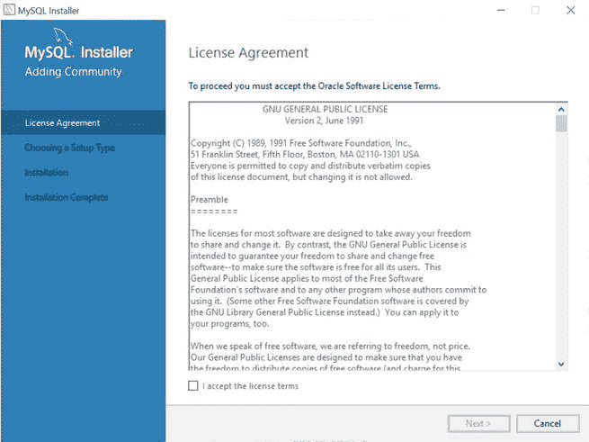
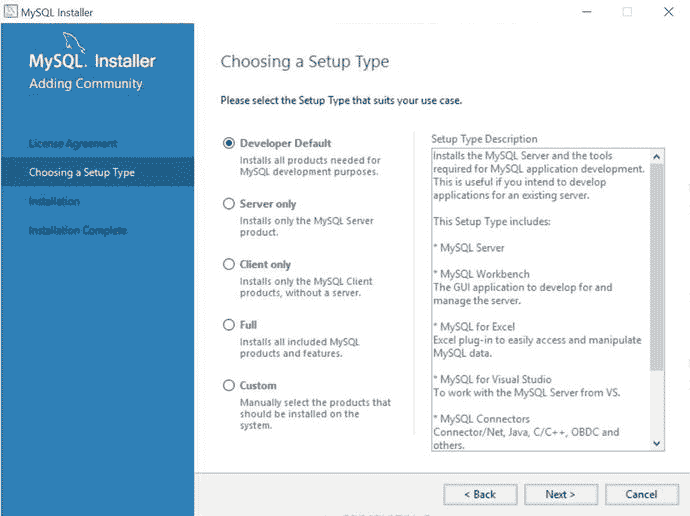
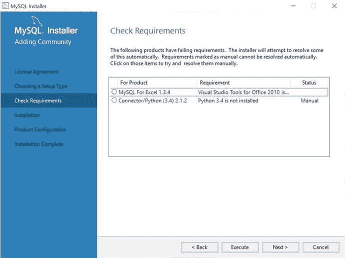
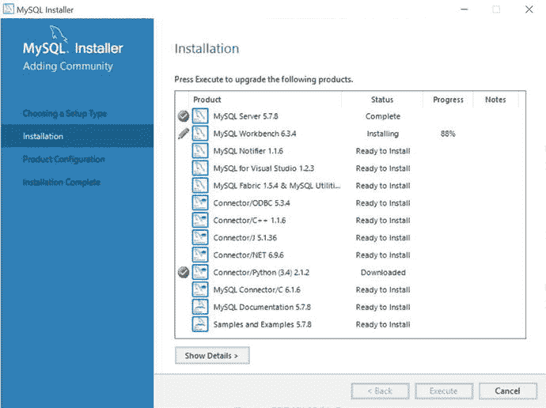
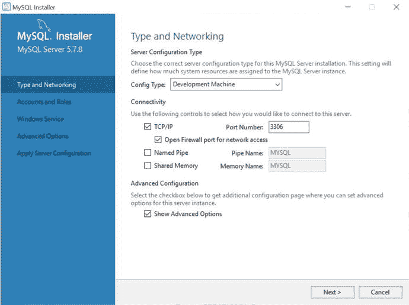
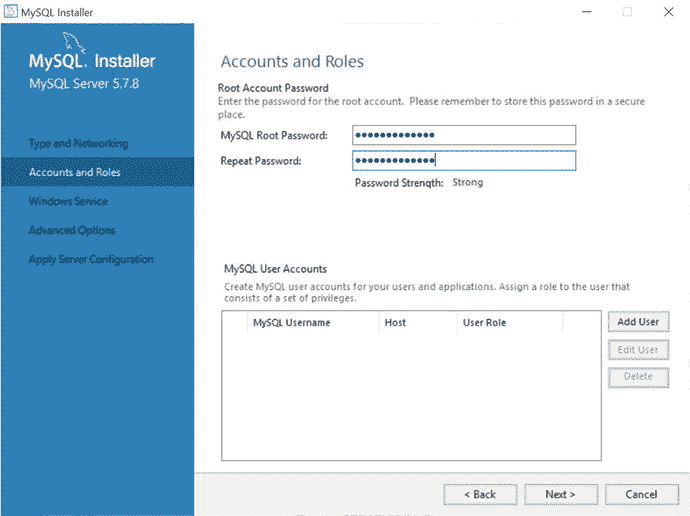
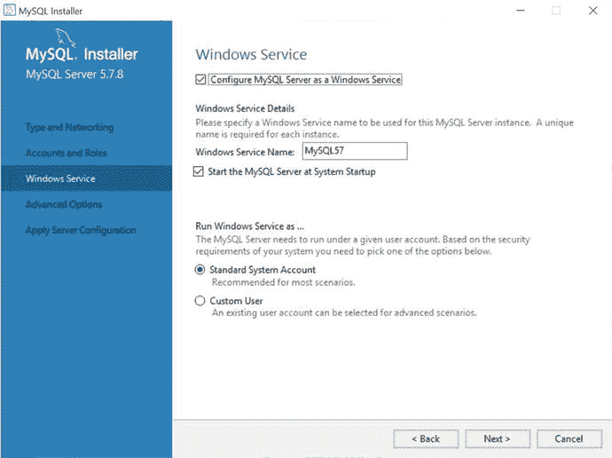
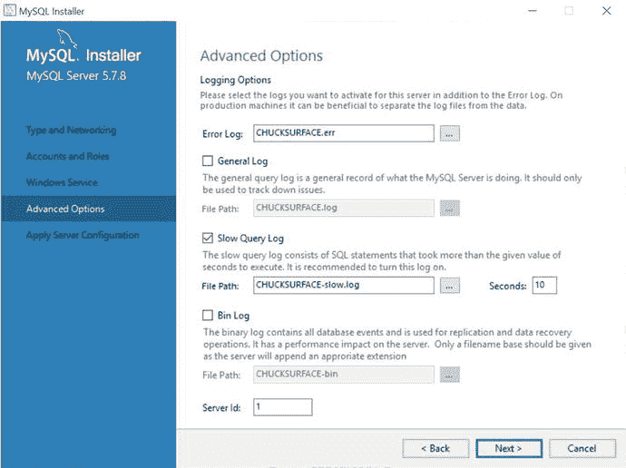
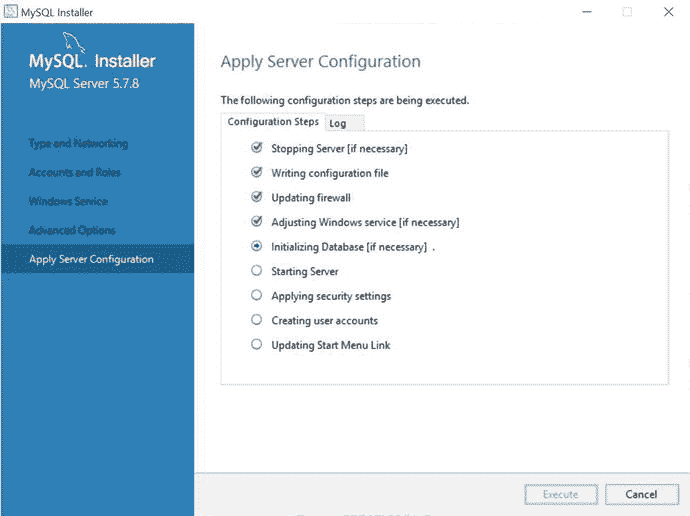
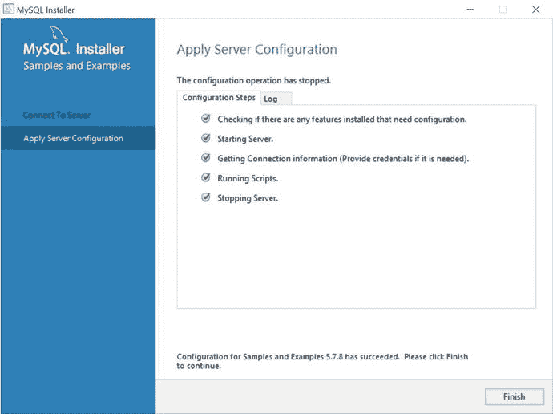

# 5.MySQL first(MySQL 第一个)

Electronic supplementary material The online version of this chapter (doi:[10.​1007/​978-1-4842-1293-6_​5](http://dx.doi.org/10.1007/978-1-4842-1293-6_5)) contains supplementary material, which is available to authorized users.

因此，您正在规划您的 IOT 解决方案，并决定在您的解决方案中内置一个数据库服务器。也许您以前从未使用过数据库系统，或者您作为用户使用过一个数据库系统，但从未需要从头开始建立一个。或者，您可能已经决定发现数据库系统有什么大惊小怪的。无论是哪种情况，你都有了入门所需的核心知识 [1](#Fn1) :你知道你要存储什么，数据是什么样子的。

回想一下，我们讨论并看到了一些 IOT 数据的示例，以及在 IOT 解决方案中如何最好地存储这些数据。回想一下，我们想要存储的每种类型的数据都有其利弊。您还了解了如何扩充数据，使其在您的 IOT 解决方案中更有用。如您所见，并不总是数据的发起者(传感器节点或平台)需要进行这种增强。正如您所了解的，拥有更多计算资源的数据聚合器更适合这种操作。但是，您还会看到数据库服务器(有时称为数据节点，因为您可以有多个数据节点)的功能更强大，它可以自动执行数据聚合和注释。

在本章中，您还将看到如何将这些技术应用到实践中，将数据存储到数据库中。更具体地说，您将学习如何使用 MySQL，并在 IOT 解决方案中利用这些知识。我们从一个简短的讨论开始，讨论如何获得 MySQL，安装它，并创建您的第一个数据库。本章的其余部分将通过例子介绍如何使用 MySQL 的简短入门。

## 入门指南

MySQL 是世界上最受欢迎的开源数据库系统，原因有很多。首先，它是开源的，这意味着任何人都可以免费使用它来完成各种各样的任务。 [2](#Fn2) 最棒的是，MySQL 被包含在许多平台仓库中，使其易于获取和安装。如果你的平台在资源库中没有包含 MySQL(比如 aptitude)，你可以从 MySQL 网站( [`http://dev.mysql.com`](http://dev.mysql.com/) )下载。

甲骨文公司拥有 MySQL。Oracle 通过收购 Sun Microsystems 获得了 MySQL，Sun Microsystems 从其原始所有者 MySQL AB 获得了 MySQL。尽管担心会出现相反的情况，但 Oracle 通过继续投资于新功能的演进和开发以及忠实地维护其开源遗产，表现出了对 MySQL 的出色管理。尽管 Oracle 也提供 MySQL 的商业许可——就像它以前的所有者过去做的那样——MySQL 仍然是开源的，每个人都可以使用。

What Is Open Source? Is It Really Free?

开源软件是从对公司财产心态的有意识抵制中成长起来的。在为麻省理工工作时，自由软件运动之父理查德·斯托尔曼抵制了软件私有(封闭)的趋势，离开了麻省理工，创办了 GNU (GNU 非 Unix)项目和自由软件基金会(FSF)。

斯托曼的目标是重建一个合作的开发者社区。然而，他有先见之明，意识到这个系统需要版权许可来保证某些自由。(有些人把斯托曼对版权的理解称为“左版权”，因为它保障了自由，而不是限制了自由。)为了解决这个问题，斯托曼创建了 GNU 公共许可证(GPL)。GPL 是一个巧妙的法律许可作品，它允许代码不受限制地被复制和修改，规定衍生作品(修改后的副本)必须在与原始版本相同的许可下发布，没有任何附加限制。

自由软件运动有一个问题。自由一词旨在保证使用、修改和发布的自由；这并不意味着“没有成本”或“免费到一个好的家。”为了消除这种误解，开放源码倡议(OSI)成立了，后来采用并推广了“开放源码”一词来描述 GPL 许可证所保证的自由。有关开源软件的更多信息，请访问 [`www.opensource.org`](http://www.opensource.org/) 。

### 我如何使用 MySQL？

MySQL 在您的系统上作为后台进程运行(或者作为前台进程，如果您从命令行启动它)。像大多数数据库系统一样，MySQL 支持结构化查询语言(SQL)。您可以使用 SQL 创建数据库和对象(使用数据定义语言[DDL])，写入或更改数据(使用数据操作语言[DML])，以及执行各种命令来管理服务器。

要发出这些命令，必须首先连接到数据库服务器。MySQL 提供了一个名为 mysql [3](#Fn3) 的客户端应用，使您能够连接到服务器并在其上运行命令。客户端接受 SQL 命令以及一些特定于客户端本身的命令。分号必须终止所有命令。

Tip

要查看客户端中可用命令的列表，请在提示符下键入`help`并按 Enter 键。

要连接到服务器，必须指定用户帐户和要连接的服务器。如果您连接到同一台机器上的服务器，您可以省略服务器信息(主机和端口)，因为这些默认为端口`3306`上的`localhost`。使用`--user`(或`-u`)选项指定用户。您可以在命令上为用户指定密码，但更安全的做法是指定`--password`(或`-p`)，并且客户端会提示您输入密码。如果您确实在命令行上指定了密码，您将会得到一个警告提示，鼓励您不要这样做。

在没有`--host`(或`-h`)和`--port`选项的同一台机器上使用 mysql 客户端不使用网络连接。如果您想要使用网络连接进行连接，或者想要使用不同的端口进行连接，则必须使用环回地址。例如，要连接到同一台机器上端口 13001 上运行的服务器，使用命令`mysql -uroot -p –h127.0.0.1 --port=13001`。

清单 [5-1](#FPar3) 展示了几个使用 mysql 客户端的 SQL 命令的例子。

Listing 5-1.Commands Using the mysql Client

`$ mysql -uroot -p`

`Enter password:`

`Welcome to the MySQL monitor.  Commands end with ; or \g.`

`Your MySQL connection id is 4`

`Server version: 5.7.8-rc-log MySQL Community Server (GPL)`

`Copyright (c) 2000, 2015, Oracle and/or its affiliates. All rights reserved.`

`Oracle is a registered trademark of Oracle Corporation and/or its`

`affiliates. Other names may be trademarks of their respective`

`owners.`

`Type 'help;' or '\h' for help. Type '\c' to clear the current input statement.`

`mysql> CREATE DATABASE plant_monitoring;`

`Query OK, 1 row affected (0.01 sec)`

`mysql> CREATE TABLE plant_monitoring.plants (plant_name char(50), sensor_value int, sensor_event timestamp);`

`Query OK, 0 rows affected (0.06 sec)`

`mysql> INSERT INTO plant_monitoring.plants VALUES ('living room', 23, NULL);`

`Query OK, 1 row affected (0.04 sec)`

`mysql> SELECT * FROM plant_monitor.plants;`

`+-------------+--------------+---------------------+`

`| plant_name  | sensor_value | sensor_event        |`

`+-------------+--------------+---------------------+`

`| living room |           23 | 2015-09-22 19:54:01 |`

`+-------------+--------------+---------------------+`

`1 row in set (0.01 sec)`

`mysql> SET @@global.server_id = 111;`

`Query OK, 0 rows affected (0.00 sec)`

`mysql>`

在本例中，您看到 DML 以`CREATE DATABASE`和`CREATE TABLE`语句的形式出现，DDL 以`INSERT`和`SELECT`语句的形式出现，还有一个简单的管理命令来设置全局服务器变量。接下来，您将看到创建一个数据库和一个表来存储数据，在表中添加一行，最后检索表中的数据。注意我是如何用大写字母表示 SQL 命令关键字的。这是一种常见的做法，有助于使 SQL 命令更容易阅读，也更容易找到用户提供的选项或数据。

您可以通过键入命令`quit`退出 MySQL 客户端。在 Linux 和 Unix 系统上，您可以按 Ctrl+D 退出客户端。

MySQL 中有很多可用的命令。幸运的是，你只需要掌握几个比较常见的。以下是您最常使用的命令。`<>`中包含的部分表示用户提供的命令组件，而`[...]`表示需要额外的选项。

*   `CREATE DATABASE <database_name>`:创建数据库
*   `USE <database>`:设置默认数据库(不是 SQL 命令)
*   `CREATE TABLE <table_name> [...]`:创建一个表格或结构来存储数据
*   `INSERT INTO <table_name> [...]`:向表格中添加数据
*   `UPDATE [...]`:更改特定行的一个或多个值
*   `DELETE FROM <table_name> [...]`:从表格中删除数据
*   `SELECT [...]`:从表格中检索数据(行)
*   `SHOW [...]`:显示对象列表

虽然这个列表只是一个简短的介绍，并不像一个完整的语法指南，但有一个很好的在线参考手册，它非常详细地解释了每个命令(以及更多)。当你对 MySQL 有任何疑问时，你应该参考在线参考手册。你可以在 [`http://dev.mysql.com/doc/`](http://dev.mysql.com/doc/) 找到它。

显示的一个更有趣的命令允许您查看对象列表。例如，您可以看到带有`SHOW DATABASES`的数据库，带有`SHOW TABLES`的表列表(一旦您更改为数据库)，甚至带有`SHOW GRANTS`的用户权限。我发现自己经常使用这些命令。

Tip

如果使用 mysql 客户端，必须用分号(`;`)或`\G`结束每个命令。

如果您认为 MySQL 不仅仅是几个简单的命令，那么您绝对是正确的。尽管 MySQL 易于使用且启动时间快，但它是一个成熟的关系数据库管理系统(RDBMS)。比你在这里看到的要多得多。有关 MySQL 的更多信息，包括所有高级特性，请参见参考手册。

Mysql—What Does It Mean?

MySQL 这个名字是一个专有名称和一个缩写的组合。SQL 是结构化查询语言。“我的部分”不是所有格形式——它是一个名称。在这种情况下，My 是创始人女儿的名字。至于发音，MySQL 专家发音为“My-S-Q-L”而不是“my sequel”

### 如何获取和安装 MySQL

MySQL 服务器可用于多种平台，包括大多数 Linux 和 Unix 平台、Mac OS X 和 Windows。要下载 MySQL 服务器，请访问 [`http://dev.mysql.com/downloads/`](http://dev.mysql.com/downloads/) ，点击社区，然后点击 MySQL 社区服务器。这是 MySQL 的 GPLv2 许可证。 [4](#Fn4) 页面会自动检测你的操作系统。如果您想为另一个平台下载，可以从下拉列表中选择。

下载页面将列出几个可供下载的文件。根据您的平台，您可能会看到几个选项，包括压缩文件、源代码和安装包。大多数人会选择在笔记本电脑或台式电脑上安装安装包。图 [5-1](#Fig1) 显示了 Debian 和 Ubuntu 平台的 APT 库的一个例子。

图 5-1。

Download page for Ubuntu Linux

最受欢迎的平台之一是微软视窗系统。Oracle 为 Windows 提供了一个名为 Windows Installer 的特殊安装包。这个包包括社区许可下所有可用的 MySQL 产品，包括 MySQL 服务器、工作台、实用程序、Fabric 和所有可用的连接器(用于连接 MySQL 的程序库)。这使得在 Windows 上安装成为一站式、一次安装的事情。图 [5-2](#Fig2) 显示了 Windows installer 的下载页面。以下几段演示如何在 Windows 10 上安装 MySQL。你将在下一章看到如何在像 Raspberry Pi 这样的单板计算机上安装 MySQL。

图 5-2。

Download page for Windows Installer

首先选择与您的 Windows 版本匹配的 Windows Installer 32 位或 64 位安装包。下载文件后，单击文件开始安装。请注意，一些浏览器(如新的 Edge 浏览器)可能会询问您是否要启动安装。您可能需要回复允许安装的对话框。

第一步是同意许可。图 [5-3](#Fig3) 显示了安装对话框的许可协议面板。

图 5-3。

License agreement

显示的许可证是社区版的 GPLv2 许可证。阅读许可 [5](#Fn5) 并同意后，选择“我接受许可条款”复选框，然后单击“下一步”。

下一个面板显示设置或安装类型。大多数人会选择 developer 选项，因为它会安装所有的 MySQL 组件和应用，并设置在本地机器上运行 MySQL 的默认设置。您可以选择不同的选项，并在右侧的文本中了解更多信息。图 [5-4](#Fig4) 显示了设置类型面板。做出选择后，单击下一步。

图 5-4。

Setup type

下一个面板将检查任何必需的组件。例如，如果您在不包含 Python 或 Visual Studio 的机器上安装，您将得到一个警告，如图 [5-5](#Fig5) 所示。要继续，您必须解决每个问题。也就是说，在解决需求之前，按钮将不可用。解决这些问题后，单击下一步。

图 5-5。

Check Requirements page

下一个面板将显示所有可供安装的软件包。如果您不想安装其中的一个或多个，您可以单击每个并选择不安装它们。图 [5-6](#Fig6) 显示了所有包装都标记为待安装的示例。一旦您对安装选项感到满意，请单击执行。

图 5-6。

Preparing for installation

面板会随着每次安装的进度进行更新，如图 [5-7](#Fig7) 所示。

图 5-7。

Installing packages

随着安装的进行，每个软件包旁边会出现不同的符号。在某些情况下，安装程序可能会下载额外的软件包。你可以在图 [5-7](#Fig7) 中看到这一点。注意，下载了 Connector/Python 2.1.2。您可以单击“显示详细信息”按钮来查看安装的更多详细信息。

一旦所有选中的包都被安装，你会看到配置面板，如图 [5-8](#Fig8) 所示。该面板根据您选择的软件包显示不同配置选项的列表。如果您选择安装所有内容，您将看到一个类似下图的面板。单击下一步继续。

图 5-8。

Product configuration

每种产品的配置过程都不同。比如配置 MySQL 服务器，从联网开始有几个步骤，如图 [5-9](#Fig9) 所示。此面板允许您选择配置类型(服务器如何启动和运行)以及网络细节。在此页面上，您可以选择服务器将监听连接的 TCP/IP 端口。如果要配置其他参数，请选择“显示高级选项”复选框。做出选择后，单击“下一步”进入下一步。

图 5-9。

Type and Networking page

下一个面板是账户和角色面板，如图 [5-10](#Fig10) 所示。此面板允许您设置初始用户帐户以及 root 密码。强烈建议您为 root 帐户选择一个强密码。您也可以通过点按“添加用户”按钮来设置具有不同角色的附加用户帐户。选择设置后，单击“下一步”进入下一步。

图 5-10。

Accounts and Roles page

下一个面板允许您控制 MySQL 在 Windows 机器上的启动方式。图 [5-11](#Fig11) 显示了细节。请注意，您可以将服务器配置为作为 Windows 服务启动，在启动时自动启动 MySQL(或不启动)，以及服务器将使用什么类型的帐户。我强烈建议保留默认设置，除非您知道如何设置帐户来运行服务。单击“下一步”进入下一步。

图 5-11。

Windows Service page

如果您在第一个配置面板中检查了高级设置，您将看到高级选项面板，如图 [5-12](#Fig12) 所示。此面板允许您打开常规日志(用于记录服务器反馈语句)、查询日志(用于记录所有查询)和二进制日志(用于复制和备份)。如果你计划在复制设置中使用服务器(我将在第 7 章的[中讨论)，你应该打开二进制日志。在复制设置中，服务器 ID 在所有服务器中必须是唯一的，您可以在此面板上进行设置。选择设置后，单击下一步。](7.html)

图 5-12。

Advanced Options panel

图 [5-13](#Fig13) 所示的下一个面板显示了配置的进度。

图 5-13。

Server configuration execution

如果您选择将 MySQL 作为 Windows 服务启动，您将会看到列出的第二组语句，如图 [5-14](#Fig14) 所示。最后，如果您选择安装示例和示例数据库，您将看到另一个对话框面板，显示安装示例数据库的进度。所有步骤完成后，单击完成。

图 5-14。

Configuring examples

除了作为一站式安装机制之外，我最喜欢 Windows Installer 的一点是能够再次使用安装程序进行更改。也就是说，您可以在另一个时间运行安装程序来安装不同的软件包，甚至删除您不再需要的软件包。这是在 Windows 上安装和配置 MySQL 的一种便捷方式。

Note

其他平台的安装程序采用了与 Windows Installer 类似的机制。例如，大多数安装包中都有配置步骤。

现在你知道了如何设置 MySQL，让我们来讨论如何使用 MySQL 存储和检索数据。

## 如何存储和检索数据

既然您已经知道了 MySQL 是什么以及它是如何使用的，那么在开始构建您的第一个数据库服务器之前，您需要对 RDBMSs 和 MySQL 有更多的了解。本节讨论 MySQL 如何存储数据(以及存储在哪里)，它如何与其他系统通信，以及管理新的 MySQL 服务器所需的一些基本管理任务。

Note

我将在第 6 章中向你展示如何在 Raspberry Pi 和类似的板上安装 MySQL。

What Is A Relational Database Management System?

RDBMS 是一种基于数据关系模型的数据存储和检索服务，由 E. F. Codd 于 1970 年提出。这些系统是结构化数据的标准存储机制。大量的研究致力于改进 Codd 提出的基本模型，正如 C. J. Date 在《数据库关系模型:回顾和分析》中所讨论的那样。理论和实践的这种演变最好地记录在第三个宣言中。 [7](#Fn7)

关系模型是存储库(数据库)的直观概念，可以通过使用一种称为查询语言的机制来检索、更新和插入数据，从而方便地查询存储库。许多供应商已经实现了关系模型，因为它具有完善的系统理论、坚实的数学基础和简单的结构。最常用的查询机制是 SQL，它类似于自然语言。虽然关系模型中不包括 SQL，但它提供了关系模型在 RDBMSs 中的实际应用的一个组成部分。

数据表示为关于某个事件或实体的相关信息(属性或列，有时称为字段)。属性值集以元组的形式形成(有时称为记录或行)。元组存储在具有相同属性集的表中。然后，表可以通过键、属性和元组的约束与其他表相关。

表可以有称为索引的列的特殊映射，允许您以特定的顺序读取数据。索引对于快速检索与索引列的值相匹配的行也很有用。

### MySQL 存储数据的方式和位置

MySQL 数据库系统通过一种有趣的编程隔离机制存储数据，这种机制称为存储引擎，由处理程序接口控制。处理程序接口允许在 MySQL 服务器中使用可互换的存储组件，以便解析器、优化器和各种组件可以使用公共机制在磁盘上存储数据时进行交互。这也称为可插拔存储引擎。

Note

MySQL 支持几种存储引擎。默认情况下，大多数都被设计为将数据写入磁盘。但是，内存存储引擎将数据存储在内存中，但不是永久性的。也就是说，当计算机重新启动时，数据会丢失。您可以使用内存存储引擎进行快速查找表。事实上，一种优化技术是在启动时使用内存存储引擎创建查找表的副本。

这对你意味着什么？这意味着您可以选择不同的数据存储机制。您可以在下面的代码示例所示的表`CREATE`语句中指定存储引擎。请注意命令中的最后一行:这是如何指定存储引擎的。去掉这个子句会导致 MySQL 使用默认的存储引擎。对于本书中的例子，MySQL 5.5 默认使用 MyISAM 存储引擎。

Tip

在 MySQL 版本 5.6 中，默认存储引擎从 MyISAM 更改为 InnoDB。

`CREATE DATABASE `bvm`;`

`CREATE TABLE `bvm`.`books` (`

``ISBN` varchar(15) DEFAULT NULL,`

``Title` varchar(125) DEFAULT NULL,`

``Authors` varchar(100) DEFAULT NULL,`

``Quantity` int(11) DEFAULT NULL,`

``Slot` int(11) DEFAULT NULL,`

``Thumbnail` varchar(100) DEFAULT NULL,`

``Description` text`

`) ENGINE=MyISAM;`

太好了。现在，MySQL 上存在哪些存储引擎？您可以通过发出`SHOW STORAGE ENGINES`命令来发现支持哪些存储引擎，如清单 [5-2](#FPar12) 所示。如你所见，有很多可供选择。我将介绍一些可能与规划 IOT 解决方案相关的内容。

Note

下面几节展示了如何在典型的类 Linux(实际上是类 Unix)平台上使用 MySQL。我发现大多数 IOT 解决方案将使用这些平台的形式，而不是 Windows 10，但这可能会在未来发生变化。目前，我主要在这些平台上探索 MySQL，而不是 Windows。然而，所示的许多示例可以在 Windows 上执行，尽管使用的是不同的命令集。

Listing 5-2.Available Storage Engines

`mysql> SHOW STORAGE ENGINES \G`

`*************************** 1\. row ***************************`

`Engine: FEDERATED`

`Support: NO`

`Comment: Federated MySQL storage engine`

`Transactions: NULL`

`XA: NULL`

`Savepoints: NULL`

`*************************** 2\. row ***************************`

`Engine: MRG_MYISAM`

`Support: YES`

`Comment: Collection of identical MyISAM tables`

`Transactions: NO`

`XA: NO`

`Savepoints: NO`

`*************************** 3\. row ***************************`

`Engine: CSV`

`Support: YES`

`Comment: CSV storage engine`

`Transactions: NO`

`XA: NO`

`Savepoints: NO`

`*************************** 4\. row ***************************`

`Engine: BLACKHOLE`

`Support: YES`

`Comment: /dev/null storage engine (anything you write to it disappears)`

`Transactions: NO`

`XA: NO`

`Savepoints: NO`

`*************************** 5\. row ***************************`

`Engine: MyISAM`

`Support: YES`

`Comment: MyISAM storage engine`

`Transactions: NO`

`XA: NO`

`Savepoints: NO`

`*************************** 6\. row ***************************`

`Engine: InnoDB`

`Support: DEFAULT`

`Comment: Supports transactions, row-level locking, and foreign keys`

`Transactions: YES`

`XA: YES`

`Savepoints: YES`

`*************************** 7\. row ***************************`

`Engine: ARCHIVE`

`Support: YES`

`Comment: Archive storage engine`

`Transactions: NO`

`XA: NO`

`Savepoints: NO`

`*************************** 8\. row ***************************`

`Engine: MEMORY`

`Support: YES`

`Comment: Hash based, stored in memory, useful for temporary tables`

`Transactions: NO`

`XA: NO`

`Savepoints: NO`

`*************************** 9\. row ***************************`

`Engine: PERFORMANCE_SCHEMA`

`Support: YES`

`Comment: Performance Schema`

`Transactions: NO`

`XA: NO`

`Savepoints: NO`

`9 rows in set (0.00 sec)`

`mysql>`

从 5.6 版本开始，MySQL 默认使用 InnoDB 存储引擎。以前的版本默认使用 MyISAM。InnoDB 是一个完全事务性的、ACID [8](#Fn8) 存储引擎。事务是一批语句，在将任何更改写入磁盘之前，这些语句必须全部成功。典型的例子是银行转账。如果您考虑一个需要从一个帐户中扣除一笔金额，然后将该金额存入另一个帐户以完成资金转移的系统，您不会希望第一个帐户成功而第二个帐户失败，或者相反！

将语句包装在一个事务中可以确保在所有语句都正确无误地完成之前，不会将任何数据写入磁盘。在这种情况下，事务用一个`BEGIN`语句指定，并以一个`COMMIT`保存更改或一个`ROLLBACK`撤销更改结束。InnoDB 将其数据存储在一个文件中(还有一些用于管理索引和事务的附加文件)。

MyISAM 存储引擎针对读取进行了优化。MyISAM 作为默认引擎已经有一段时间了，并且是第一批可用的存储引擎之一。事实上，服务器的很大一部分是专用于支持 MyISAM 的。它与 InnoDB 的不同之处在于，它不支持事务，并且以索引顺序访问方法格式存储数据。这意味着它支持快速索引。如果您不需要事务，并且希望能够移动或备份单个表，那么您应该选择 MyISAM 而不是 InnoDB。

您可能需要考虑的另一个存储引擎是归档，尤其是对于传感器网络。该引擎不支持删除(但是您可以删除整个表),并且针对磁盘上的最小存储进行了优化。很明显，如果你在一个像 Raspberry Pi 这样的小系统上运行 MySQL，小系统总是更好！无法删除数据可能会限制更高级的应用，但大多数传感器网络只是存储数据，很少删除数据。在这种情况下，您可以考虑使用归档存储引擎。

还有 CSV 存储引擎(其中 CSV 代表逗号分隔值)。此存储引擎创建文本文件，以纯文本形式存储数据，其他应用(如电子表格应用)可以读取这些数据。如果您将传感器数据用于统计分析，CSV 存储引擎可能会使获取数据的过程更容易。

那么，这些数据都在哪里呢？如果您查询 MySQL 服务器并发出命令`SHOW VARIABLES LIKE "datadir";`，您会看到所有存储引擎用来存储数据的磁盘位置的路径。对于 InnoDB，这是位于数据目录中的磁盘上的一个文件。InnoDB 也创建一些管理文件，但是数据存储在单个文件中。对于除了`NDB`和`MEMORY`之外的大多数其他存储引擎，表的数据存储在 data 目录下的一个以数据库名称命名的文件夹中。清单 [5-3](#FPar13) 展示了一个来自 Mac OS X 机器的例子。您可能需要在自己的机器上使用不同的路径。

Listing 5-3.Finding Where Your Data Is Located

`mysql> SHOW VARIABLES LIKE 'datadir'`

`+---------------+------------------------+`

`| Variable_name | Value                  |`

`+---------------+------------------------+`

`| datadir       | /usr/local/mysql/data/ |`

`+---------------+------------------------+`

`1 row in set (0.00 sec)`

`mysql> quit;`

`bye`

`$ sudo ls -lsa /usr/local/mysql/data`

`rwxr-x---    58 _mysql  wheel       1972 Feb  6 15:05 .`

`drwxr-xr-x   17 root    wheel        578 Jan 20 16:38 ..`

`-rw-rw----    1 _mysql  wheel          0 Feb  6 15:04 Chucks-iMac.local.err`

`-rw-rw----    1 _mysql  wheel          5 Feb  6 15:00 Chucks-iMac.local.pid`

`drwx------    6 _mysql  wheel        204 Oct 17 15:16 bvm`

`-rw-rw----    1 _mysql  wheel    5242880 Feb  6 15:00 ib_logfile0`

`-rw-rw----    1 _mysql  wheel    5242880 Feb  6 15:00 ib_logfile1`

`-rw-rw----    1 _mysql  wheel  815792128 Feb  1 17:16 ibdata1`

`-rw-rw----    1 _mysql  wheel   52428800 Feb  1 17:16 ibdata2`

`drwxr-x---   77 _mysql  wheel       2618 Jan  8 15:24 mysql`

`drwx------   38 _mysql  wheel       1292 Nov 27 08:46 sakila`

`drwx------  192 _mysql  wheel       6528 Oct 22 12:17 test`

`drwx------    6 _mysql  wheel        204 Dec 18 17:05 world_innodb`

`$ sudo ls -lsa /usr/local/mysql/data/bvm`

`drwx------   6 _mysql  wheel   204 Oct 17 15:16 .`

`drwxr-x---  58 _mysql  wheel  1972 Feb  6 15:05 ..`

`-rw-rw----   1 _mysql  wheel  5056 Oct 17 15:24 books.MYD`

`-rw-rw----   1 _mysql  wheel  1024 Oct 17 15:25 books.MYI`

`-rw-rw----   1 _mysql  wheel  8780 Oct 17 15:16 books.frm`

`-rw-rw----   1 _mysql  wheel    65 Oct 17 15:15 db.opt`

该示例首先向数据库服务器查询数据目录的位置(它位于该计算机上受保护的文件夹中)。如果您发出一个列表命令，您可以看到由前缀`ib`和`ibd`标识的 InnoDB 文件。您还可以看到许多目录，所有这些目录都是该服务器上的数据库。之后是一个数据库文件夹的列表。注意扩展名为`.MY?`的文件:这些是 MyISAM 文件(数据和索引)。`.frm`文件是服务器创建和维护的配置文件。

Tip

如果您想通过复制文件将数据从一个服务器复制到另一个服务器，请确保也复制了`.frm`文件！这对于 MyISAM 和 Archive 来说很容易，但对于 InnoDB 来说要困难得多。在 InnoDB 的情况下，你必须复制所有的数据库文件夹和 InnoDB 文件，以确保你得到所有的东西。

虽然在您的 IOT 解决方案中，您不太可能需要一个数据库节点的事务存储引擎，比如运行 MySQL Server 的 Raspberry Pi，但是 MySQL 5.6 有一个，并且默认情况下是打开的。更有可能的情况是对表使用 MyISAM 或归档引擎。

有关存储引擎及其选择和特性的更多信息，请参见在线 MySQL 参考手册“存储引擎”( [`http://dev.mysql.com/doc/`](http://dev.mysql.com/doc/) )一节。

#### MySQL 配置文件

MySQL 服务器可以使用与配置 Raspberry Pi 类似的配置文件进行配置。在 Windows 上，MySQL 配置文件位于安装文件夹中，命名为`my.ini`。在其他系统上，它位于`/etc/mysql`文件夹中，并被命名为`my.cnf`。该文件包含几个部分，其中一部分被标记为`[mysqld]`。此列表中的项目是键值对；等号左边的名称是选项，右边是它的值。以下是一个典型的配置文件(为简洁起见，省略了许多行):

`[mysqld]`

`port = 3306`

`basedir = /usr/local/mysql`

`datadir = /usr/local/mysql/data`

`server_id = 5`

`general_log`

如您所见，这是配置系统的简单方法。该示例设置 TCP 端口、基目录(MySQL 安装的根目录，包括数据以及二进制文件和辅助文件)、数据目录和服务器 ID(用于复制，稍后会讨论)，并打开常规日志(当包含布尔开关时，它会打开日志)。您可以为 MySQL 设置许多这样的变量。有关使用配置文件的详细信息，请参阅在线 MySQL 参考手册。当您在 Raspberry Pi 上设置 MySQL 时，您将更改这个文件。

#### 如何在 Windows 上启动、停止和重启 MySQL

在计算机上使用数据库和配置 MySQL 时，您可能需要控制 MySQL 服务器的启动和关闭。安装 MySQL 的默认模式是在启动时自动启动，在关机时自动停止，但是您可能希望更改这一模式，或者您可能需要在更改参数后停止并启动服务器。此外，当您更改配置文件时，需要重新启动服务器才能看到更改的效果。

您可以使用通知程序托盘应用或通过 Windows 服务控制面板来启动、停止和重启 MySQL 服务器。只需选择 MySQL 服务，右键单击即可停止或启动该服务。这将执行一个受控的关机和启动，如果你需要这样做。

#### 创建用户和授予访问权限

在使用 MySQL 之前，您需要了解另外两个管理操作:创建用户帐户和授予数据库访问权限。MySQL 可以用`GRANT`语句执行这两项操作，如果用户不存在，它会自动创建一个用户。但是更迂腐的方法是首先发出一个`CREATE USER`命令，然后是一个或多个`GRANT`命令。例如，下面显示了名为`sensor1`的用户的创建，并授予该用户对数据库`room_temp`的访问权限:

`CREATE USER 'sensor1'@'%' IDENTIFIED BY 'secret'`

`GRANT SELECT, INSERT, UPDATE ON room_temp.* TO 'sensor1'@'%'`

第一个命令创建名为`sensor1`的用户，但是该名称也有一个`@`后跟另一个字符串。第二个字符串是与用户相关联的机器的主机名。也就是说，MySQL 中的每个用户都有一个用户名和一个主机名，以`user@host`的形式来唯一地标识他们。这意味着用户和主机`sensor1@10.0.1.16`以及用户和主机`sensor1@10.0.1.17`是不同的。但是，`%`符号可以用作通配符，将用户与任何主机关联起来。`IDENTIFIED BY`子句为用户设置密码。

A Note About Security

为您的应用创建一个对 MySQL 系统没有完全访问权限的用户总是一个好主意。这是为了最大限度地减少任何意外更改，也是为了防止被利用。对于传感器网络，建议您创建一个只能访问存储(或检索)数据的数据库的用户。您可以使用以下命令更改 MySQL 用户密码:

`SET PASSWORD FOR sensor1@"%" = PASSWORD("secret");`

对于主机使用通配符`%`也要小心。虽然创建单个用户并让用户从任何主机访问数据库服务器变得更加容易，但这也使得恶意用户更容易访问您的服务器(一旦他们发现了密码)。

另一个考虑是连接性。与 Raspberry Pi 一样，如果您将一个数据库连接到您的网络，而该网络又连接到 Internet，那么您的网络或 Internet 上的其他用户就有可能访问该数据库。不要让他们轻易得逞——更改您的 root 用户密码，并为您的应用创建用户。

第二个命令允许访问数据库。您可以授予用户许多权限。该示例显示了您最有可能向传感器网络数据库用户提供的集合:读取(`SELECT`)、添加数据(`INSERT`)和更改数据(`UPDATE`)。有关安全性和帐户访问权限的更多信息，请参见在线参考手册。

该命令还指定要授予权限的数据库和对象。因此，可以给用户一些表的读(`SELECT`)权限，给另一些表的写(`INSERT`、`UPDATE`)权限。这个例子让用户可以访问`room_temp`数据库中的所有对象(表、视图等等)。

如上所述，您可以将这两个命令合并成一个命令。你可能会在文献中更经常地看到这种形式。下面显示了组合语法。在这种情况下，您需要做的就是将`IDENTIFIED BY`子句添加到`GRANT`语句中。酷！

`GRANT SELECT, INSERT, UPDATE ON room_temp.` `* TO  'sensor1'@'%' IDENTIFIED BY 'secret'`

## 常见的 MySQL 命令和概念

学习和掌握数据库系统需要训练、经验和极大的毅力。精通所需的主要知识是如何使用常见的 SQL 命令和概念。本节通过介绍最常见的 MySQL 命令和概念来完成 MySQL 入门。

Note

本节介绍高级命令和概念，而不是重复引用《参考手册》、 [9](#Fn9) 。如果您决定使用任何命令或概念，请参考在线参考手册，了解更多详细信息、完整的命令语法和其他示例。

### MySQL 命令

本节回顾了最常见的 SQL 和 MySQL 特有的命令，您需要了解这些命令，以便充分利用您的 IOT 数据库。虽然您已经看到了其中的一些功能，但是本节提供了一些额外的信息来帮助您使用它们。

Note

用户提供的变量的大小写敏感性(例如，`last_name`对`Last_Name`)在不同的平台上是不一致的。例如，Windows 上的区分大小写行为与 Mac OS X 上的不同。MySQL 遵循该平台的区分大小写策略。查看您的平台的在线参考手册，了解区分大小写如何影响用户提供的变量。

#### 创建数据库和表

您需要学习和掌握的最基本的命令是`CREATE DATABASE`和`CREATE TABLE`命令。回想一下，MySQL 之类的数据库服务器允许您创建任意数量的数据库，您可以用逻辑方式添加表和存储数据。

要创建一个数据库，使用`CREATE DATABASE`后跟一个数据库名称。如果您正在使用 MySQL 客户端，您必须使用`USE`命令切换到特定的数据库。客户端焦点是在启动时(在命令行上)或通过`USE`命令指定的最新数据库。您可以通过首先引用数据库名称来覆盖它。例如，`SELECT * FROM db1.table1`将执行，而不管默认的数据库设置。但是，省略数据库名称会导致 mysql 客户端使用默认数据库。下面显示了创建和更改数据库焦点的两个命令:

`mysql> CREATE DATABASE plant_monitoring;`

`mysql> USE plant_monitoring;`

Tip

回想一下，如果您想查看服务器上的所有数据库，可以使用`SHOW DATABASES`命令。

创建表格需要 yes，`CREATE TABLE`命令。该命令有许多选项，不仅允许您指定列及其数据类型，还允许您指定附加选项，如索引、外键等。还可以使用`CREATE INDEX`命令创建一个索引(参见下面的代码)。以下显示了如何创建一个简单的表格来存储工厂传感器数据。

`CREATE TABLE `plant_monitoring`.`plants` (`

``plant_name` char(30) NOT NULL,`

``sensor_value` float DEFAULT NULL,`

``sensor_event` timestamp NOT NULL DEFAULT CURRENT_TIMESTAMP ON UPDATE CURRENT_TIMESTAMP,`

``sensor_level` char(5) DEFAULT NULL,`

`PRIMARY KEY `plant_name` (`plant_name`)`

`) ENGINE=InnoDB DEFAULT CHARSET=latin1;`

注意这里我指定了表名(`plants`)和四列(`plant_name`、`sensor_value`、`sensor_event`和`sensor_level`)。我使用了几种数据类型。对于`plant_name`，我使用了一个最多包含 30 个字符的字符字段，一个浮点数据类型用于`sensor_value`，一个时间戳值用于`sensor_event`，另一个字符字段用于包含 5 个字符的`sensor_level`。

`TIMESTAMP`数据类型在 IOT 解决方案或任何您想要记录事件或行动的日期和时间的时候特别有用。例如，知道何时读取传感器值通常是有帮助的。通过向表中添加一个`TIMESTAMP`列，您不需要计算、读取或格式化传感器甚至聚合节点上的日期和时间。

还要注意，我指定将`sensor_name`列定义为一个键，这将创建一个索引。在这种情况下，它也是主键。`PRIMARY KEY`短语告诉服务器确保表中存在且只有一行匹配列的值。通过重复关键字，可以指定几个要在主键中使用的列。注意，所有主键列都不允许空值(`NOT NULL`)。

如果您不能确定唯一标识一行的一组列(并且您想要这样的行为——有些人喜欢没有这种限制的表，但是一个好的 DBA 不会),那么您可以为 integer 字段使用一个称为`AUTO INCREMENT`的人工数据类型选项。当用于某一列(必须是第一列)时，服务器会为插入的每一行自动增加该值。这样，它就创建了一个默认主键。有关自动递增列的更多信息，请参见联机参考手册。

Tip

最佳实践表明，在某些情况下，在字符字段上使用主键并不是最佳选择，例如表中的每一列都有很大的值或者有许多唯一值。这可能会降低搜索和索引的速度。在这种情况下，您可以使用 auto increment 字段来人工添加一个更小的主键(但有点神秘)。

可用的数据类型比上一个示例中显示的多得多。您应该查阅联机参考手册，以获得数据类型的完整列表。请参见“数据类型”一节如果你想知道一个表格的布局或“模式”,使用`SHOW CREATE TABL` E 命令。

像数据库一样，您也可以使用`SHOW TABLES`命令获得数据库中所有表的列表。

#### 获得结果

您需要知道的最常用的基本命令是从表中返回数据的命令(也称为结果集或行)。为此，您可以使用`SELECT`语句。这个 SQL 语句是数据库系统的核心。所有对数据的查询都将使用该命令执行。 [10](#Fn10)

`SELECT`语句允许您指定想要从数据中选择哪些列。该列表作为语句的第一部分出现。第二部分是`FROM`子句，它指定了要从中检索行的表。

Note

`FROM`子句可以用来用`JOIN`操作符连接表。在后面的小节中，您将看到一个简单的连接示例。

指定列的顺序决定了结果集中的显示顺序。如果你想要所有的列，使用星号(`*`)代替。清单 [5-4](#FPar21) 展示了生成相同结果集的三条语句。也就是说，在每个的输出中将显示相同的行。事实上，为了简单起见，我使用了一个只有四行的表。

Listing 5-4.Example SELECT Statements

`mysql> SELECT plant_name, sensor_value, sensor_event, sensor_level FROM plant_monitoring.plants;`

`+------------------------+--------------+---------------------+--------------+`

`| plant_name             | sensor_value | sensor_event        | sensor_level |`

`+------------------------+--------------+---------------------+--------------+`

`| fern in den            |       0.2319 | 2015-09-23 21:04:35 | NULL         |`

`| fern on deck           |         0.43 | 2015-09-23 21:11:45 | NULL         |`

`| flowers in bedroom1    |        0.301 | 2015-09-23 21:11:45 | NULL         |`

`| weird plant in kitchen |        0.677 | 2015-09-23 21:11:45 | NULL         |`

`+------------------------+--------------+---------------------+--------------+`

`4 rows in set (0.00 sec)`

`mysql> SELECT * FROM plant_monitoring.plants;`

`+------------------------+--------------+---------------------+--------------+`

`| plant_name             | sensor_value | sensor_event        | sensor_level |`

`+------------------------+--------------+---------------------+--------------+`

`| fern in den            |       0.2319 | 2015-09-23 21:04:35 | NULL         |`

`| fern on deck           |         0.43 | 2015-09-23 21:11:45 | NULL         |`

`| flowers in bedroom1    |        0.301 | 2015-09-23 21:11:45 | NULL         |`

`| weird plant in kitchen |        0.677 | 2015-09-23 21:11:45 | NULL         |`

`+------------------------+--------------+---------------------+--------------+`

`4 rows in set (0.00 sec)`

`mysql> SELECT sensor_value, plant_name,` `sensor_level, sensor_event FROM plant_monitoring.plants;`

`+--------------+------------------------+--------------+---------------------+`

`| sensor_value | plant_name             | sensor_level | sensor_event        |`

`+--------------+------------------------+--------------+---------------------+`

`|       0.2319 | fern in den            | NULL         | 2015-09-23 21:04:35 |`

`|         0.43 | fern on deck           | NULL         | 2015-09-23 21:11:45 |`

`|        0.301 | flowers in bedroom1    | NULL         | 2015-09-23 21:11:45 |`

`|        0.677 | weird plant in kitchen | NULL         | 2015-09-23 21:11:45 |`

`+--------------+------------------------+--------------+---------------------+`

`4 rows in set (0.00 sec)`

请注意，前两条语句以相同的顺序生成相同的行和相同的列，但是第三条语句虽然生成相同的行，但以不同的顺序显示列。

您还可以使用列列表中的函数来执行计算和类似操作。一个特殊的例子是使用`COUNT()`函数来确定结果集中的行数，如下所示。关于 MySQL 提供的函数的更多例子，请参阅在线参考手册。

`SELECT COUNT(*) FROM plant_monitoring.plants;`

`SELECT`语句中的下一个子句是`WHERE`子句。您可以在这里指定用于限制结果集中行数的条件。也就是说，只有那些符合条件的行。这些条件基于列，可能相当复杂。也就是说，您可以基于计算、连接结果等来指定条件。但是为了回答一个问题，大多数条件将是一列或多列上的简单等式或不等式。例如，假设您想要查看传感器读数小于 0.40 的植物。在这种情况下，我们发出以下查询并接收结果。注意，我只指定了两列:工厂名称和从传感器读取的值。

`mysql> SELECT plant_name, sensor_value FROM plant_monitoring.plants WHERE sensor_value < 0.40;`

`+---------------------+--------------+`

`| plant_name          | sensor_value |`

`+---------------------+--------------+`

`| fern in den         |       0.2319 |`

`| flowers in bedroom1 |        0.301 |`

`+---------------------+--------------+`

`2 rows in set (0.01 sec)`

您还可以使用其他子句，包括用于对行进行分组以进行聚合或计数的`GROUP BY`子句，以及用于对结果集进行排序的`ORDER BY`子句。让我们从聚合开始，快速地看一下每一个。

假设您想要计算每个传感器在表中读取的传感器值的平均值。在这种情况下，我们有一个包含各种传感器随时间变化的传感器读数的表。虽然该示例只包含四行(因此可能没有统计信息)，但是该示例非常清楚地展示了聚合的概念，如清单 [5-5](#FPar22) 所示。请注意，我们收到的只是四个传感器读数的平均值。

Listing 5-5.GROUP BY Example

`mysql> SELECT plant_name, sensor_value FROM plant_monitoring.plants WHERE plant_name = 'fern on deck'`

`+--------------+--------------+`

`| plant_name   | sensor_value |`

`+--------------+--------------+`

`| fern on deck |         0.43 |`

`| fern on deck |         0.51 |`

`| fern on deck |        0.477 |`

`| fern on deck |         0.73 |`

`+--------------+--------------+`

`4 rows in set (0.00 sec)`

`mysql> SELECT plant_name, AVG(sensor_value) as avg_value FROM plant_monitoring.plants WHERE plant_name = 'fern on deck' GROUP BY plant_name;`

`+--------------+-------------------+`

`| plant_name   | avg_value         |`

`+--------------+-------------------+`

`| fern on deck | 0.536750003695488 |`

`+--------------+-------------------+`

`1 row in set (0.00 sec)`

注意，我在列列表中指定了 average 函数`AVG()`，并传入了我想要求平均值的列的名称。MySQL 中有许多这样的函数可以用来执行一些强大的计算。显然，这是数据库服务器中存在多少功率的另一个示例，这将需要网络中典型的轻量级传感器或聚合器节点上的更多资源。

还要注意，我用关键字`AS`重命名了平均值列。您可以使用它来重命名任何指定的列，这将更改结果集中的名称，如清单所示。

子句的另一个用途是计数。在这种情况下，我们用`COUNT()`替换了`AVG()`，得到了与`WHERE`子句匹配的行数。更具体地说，我们想知道每个工厂存储了多少传感器值。

`mysql> SELECT plant_name, COUNT(sensor_value) as num_values FROM plant_monitoring.plants GROUP BY plant_name;`

`+------------------------+------------+`

`| plant_name             | num_values |`

`+------------------------+------------+`

`| fern in den            |          1 |`

`| fern on deck           |          4 |`

`| flowers in bedroom1    |          1 |`

`| weird plant in kitchen |          1 |`

`+------------------------+------------+`

`4 rows in set (0.00 sec)`

现在，假设我们想要查看按传感器值排序的结果集的结果。我们将使用为面板上的蕨类植物选择行的相同查询，但是我们使用`ORDER BY`子句按照传感器值以升序和降序对行进行排序。清单 [5-6](#FPar23) 显示了每个选项的结果。

Listing 5-6.ORDER BY Examples

`mysql> SELECT plant_name, sensor_value FROM plant_monitoring.plants WHERE plant_name = 'fern on deck' ORDER BY sensor_value ASC;`

`+--------------+--------------+`

`| plant_name   | sensor_value |`

`+--------------+--------------+`

`| fern on deck |         0.43 |`

`| fern on deck |        0.477 |`

`| fern on deck |         0.51 |`

`| fern on deck |         0.73 |`

`+--------------+--------------+`

`4 rows in set (0.00 sec)`

`mysql> SELECT plant_name, sensor_value FROM plant_monitoring.plants WHERE plant_name = 'fern on deck' ORDER BY sensor_value DESC;`

`+--------------+--------------+`

`| plant_name   | sensor_value |`

`+--------------+--------------+`

`| fern on deck |         0.73 |`

`| fern on deck |         0.51 |`

`| fern on deck |        0.477 |`

`| fern on deck |         0.43 |`

`+--------------+--------------+`

`4 rows in set (0.00 sec)`

正如我提到的,`SELECT`陈述比这里显示的要多得多，但是我们在这里看到的会让你走得更远，尤其是在处理大多数中小型 IOT 解决方案的典型数据时。

#### 添加数据

现在您已经创建了一个数据库和表，您将希望向表中加载或插入数据。您可以使用`INSERT INTO`语句来实现。这里我们指定表格和行的数据。下面是一个简单的例子:

`INSERT INTO plant_monitoring.plants (plant_name, sensor_value) VALUES ('fern in den', 0.2319);`

在这个例子中，我通过指定名称和值为我的一个工厂插入数据。你想知道其他的柱子呢？在这种情况下，其他列包括一个时间戳列，它将由数据库服务器填充。所有其他列(只有一列)将被设置为`NULL`，这意味着没有值可用、值缺失、值不为零或值为空。 [11](#Fn11)

请注意，我在该行的数据之前指定了列。当您希望插入的列数少于表中包含的列数时，这是必要的。更具体地说，关闭列列表意味着您必须为表中的所有列提供数据(或`NULL`)。此外，列出的列的顺序可以不同于它们在表中的定义顺序。关闭列列表将导致根据列数据在表中的显示方式对其进行排序。 [12](#Fn12)

您也可以使用逗号分隔的行值列表，使用相同的命令插入几行，如下所示:

`INSERT INTO plant_monitoring.plants (plant_name, sensor_value) VALUES ('flowers in bedroom1', 0.301), ('weird plant in kitchen', 0.677), ('fern on deck', 0.430);`

这里我用相同的命令插入了几行。请注意，这只是一种简化机制，除了自动提交之外，与发出单独的命令没有什么不同。 [十三](#Fn13)

#### 更改数据

有时，您需要更改或更新数据。您可能需要更改一列或多列的值，替换多行的值，或者更正数字数据的格式甚至比例。为了更新数据，我们使用`UPDATE`命令。

您可以更新特定的列，更新一组列，对一列或多列执行计算，等等。我通常不太需要更改 IOT 解决方案中的数据，但有时在传感器读取代码出错或类似数据输入问题的情况下，这可能是必要的。

更有可能的是，您或您的用户想要重命名数据库中的对象。例如，假设我们确定甲板上的植物实际上不是蕨类植物，而是一种外来开花植物。 [14](#Fn14) 在本例中，我们希望将所有植物名称为“fern on deck”的行改为“flowers on deck”以下命令执行更改:

`UPDATE plant_monitoring.plants SET plant_name = 'flowers on deck' WHERE plant_name = 'fern on deck'`

注意这里的关键操作符是`SET`操作符。这告诉数据库为指定的列分配一个新值。您可以在命令中列出多个 set 操作。

注意，我在这里使用了一个`WHERE`子句来将`UPDATE`限制到一组特定的行。这就是你在`SELECT`语句中看到的同一个`WHERE`子句，它做同样的事情；它允许您指定限制受影响的行的条件。如果不使用`WHERE`子句，更新将应用于所有行。

Caution

别忘了`WHERE`条款！发出不带`WHERE`子句的`UPDATE`命令将影响表中的所有行！

#### 删除数据

有时，您最终会得到需要删除的表中的数据。也许您使用了测试数据，并希望去除虚假的行，或者也许您希望压缩或清除您的表，或者希望消除不再适用的行。要删除行，使用`DELETE FROM`命令。

我们来看一个例子。假设您有一个正在开发的工厂监控解决方案，您发现您的一个传感器或传感器节点读取的值太低，原因是编码、布线或校准错误。在这种情况下，我们希望删除传感器值小于 0.20 的所有行。以下命令可以做到这一点:

`DELETE FROM plants WHERE sensor_value < 0.20;`

Caution

别忘了`WHERE`条款！发出不带`WHERE`子句的`DELETE FROM`命令将永久删除表中的所有行！

注意我在这里使用了一个`WHERE`子句。也就是说，一个条件语句来限制被操作的行数。您可以使用您想要的任何列或条件；只要确保你有正确的！我喜欢在`SELECT`语句中首先使用相同的`WHERE`子句。例如，我将首先发出下面的命令来检查我是否要删除我想要的行，并且只删除那些行。请注意，这是同一个`WHERE`子句。

`SELECT * FROM plants WHERE sensor_value < 0.20;`

### MySQL 概念

除了前面显示的命令之外，您还可以考虑使用其他概念。虽然每个都有一个 SQL 命令，但我在这里将它们作为一个概念列出，因为它们比简单的对象创建或数据检索更复杂。

#### 指数

创建表时不使用任何排序。也就是说，表是无序的。虽然 MySQL 每次都会以相同的顺序返回数据，但是没有隐含的(或可靠的)顺序，除非您创建一个索引。我这里所指的排序并不像你在排序时所想的那样(在`SELECT`语句的`ORDER BY`子句中是可能的)。

相反，索引是服务器在执行查询时用来读取数据的映射。例如，如果一个表上没有索引，并且希望选择某列中值大于某个值的所有行，则服务器必须读取所有行来查找所有匹配项。但是，如果我们在该列上添加了一个索引，服务器将只能读取那些符合标准的行。

我应该注意到有几种形式的索引。这里我指的是一个聚集索引，索引中列的值存储在索引中，允许服务器只读取索引，而不读取行来测试标准。

要创建索引，您可以在`CREATE TABLE`语句中指定索引，或者发出一个`CREATE INDEX`命令。下面是一个简单的例子:

`CREATE INDEX plant_name ON plants (plant_name);`

该命令在`plant_name`列上添加一个索引。观察这对表格的影响。

`CREATE TABLE `plants` (`

``plant_name` char(30) DEFAULT NULL,`

``sensor_value` float DEFAULT NULL,`

``sensor_event` timestamp NOT NULL DEFAULT CURRENT_TIMESTAMP ON UPDATE CURRENT_TIMESTAMP,`

``sensor_level` char(5) DEFAULT NULL,`

`KEY `plant_name` (`plant_name`)`

`) ENGINE=InnoDB DEFAULT CHARSET=latin1`

像这样创建的索引不会影响表中行的唯一性，换句话说，确保存在且只有一行可以被特定列的特定值访问。我所指的是主键(或主索引)的概念，这是在创建表时使用的一个特殊选项，如前所述。

#### 视图

视图是一个或多个表的结果的逻辑映射。它们可以像查询中的表一样被引用，这使它们成为创建数据子集的强大工具。您用`CREATE VIEW`创建一个视图，并给它起一个类似于表格的名字。下面显示了一个简单的例子，其中我们创建了一个测试视图来从表中读取值。在这种情况下，我们限制了视图的大小(行数)，但是您可以为视图使用各种各样的条件，包括组合来自不同表的数据。

`CREATE VIEW test_plants AS SELECT * FROM plants LIMIT 5;`

在中小型数据库解决方案中通常不会遇到视图，但是我将它们包括在内是为了在您决定进行额外的分析并希望将数据组织成更小的组以便于阅读时让您了解它们。

#### 扳机

另一个高级概念(以及相关的 SQL 命令)是使用事件驱动的机制，当数据发生变化时会“触发”该机制。也就是说，您可以创建一组简短的 SQL 命令(过程),这些命令将在插入或更改数据时执行。

触发器将在几种事件或条件下执行。您可以在更新、插入或删除操作之前或之后设置触发器。触发器与单个表相关联，其主体是一个特殊的构造，允许您对受影响的行进行操作。下面是一个简单的例子:

`DELIMITER //`

`CREATE TRIGGER set_level BEFORE INSERT ON plants FOR EACH ROW`

`BEGIN`

`IF NEW.sensor_value < 0.40 THEN`

`SET NEW.sensor_level = 'LOW'`

`ELSEIF NEW.sensor_value < 0.70 THEN`

`SET NEW.sensor_level = 'OK'`

`ELSE`

`SET NEW.sensor_level = 'HIGH'`

`END IF;`

`END //`

`DELIMITER ;`

该触发器将在每次插入表之前执行。在复合语句(`BEGIN`中可以看到...`END`)，我们根据`sensor_value`的值将名为`sensor_level`的列设置为`LOW`、`OK`或`HIGH`。要了解这一点，请考虑下面的命令。`FOR EACH ROW`语法允许触发器作用于事务中的所有行。

`INSERT INTO plants (plant_name, sensor_value) VALUES ('plant1', 0.5544);`

由于我们提供的值小于中间值(0.70)，我们期望触发器为我们填充`sensor_level`列。下面显示了触发器触发时发生的情况:

`+-------------+--------------+---------------------+--------------+`

`| plant_name  | sensor_value | sensor_event        | sensor_level |`

`+-------------+--------------+---------------------+--------------+`

`| plant1      |       0.5544 | 2015-09-23 20:00:15 | OK           |`

`+-------------+--------------+---------------------+--------------+`

`1 row in set (0.00 sec)`

这展示了一种有趣而强大的方法，可以利用数据库服务器的能力创建派生列，并节省传感器或聚合器节点的处理能力。我鼓励您考虑这个以及类似的强大概念，以利用数据库服务器的强大功能。

#### 简单连接

数据库系统最强大的概念之一是在数据之间建立关系的能力(因此得名关系型)。也就是说，一个表中的数据可以引用另一个(或多个)表中的数据。最简单的形式称为主从关系，其中一个表中的一行引用或关联到另一个表中的一行或多行。

一个常见的(也是经典的)主从关系的例子来自订单跟踪系统，其中一个表包含订单的数据，另一个表包含订单的行项目。因此，我们只存储一次订单信息，如客户号和发货信息，并在检索订单时合并或“连接”这些表。

让我们看一个来自示例数据库的名为`world`的例子。你可以在 MySQL 网站上找到这个数据库( [`http://dev.mysql.com/doc/index-other.html`](http://dev.mysql.com/doc/index-other.html) )。请随意下载它和任何其他示例数据库。它们都展示了数据库系统的各种设计。您还会发现练习查询数据很方便，因为它包含了许多简单的行。

Note

如果要运行以下示例，需要安装示例文档中描述的世界数据库( [`http://dev.mysql.com/doc/world-setup/en/world-setup-installation.html`](http://dev.mysql.com/doc/world-setup/en/world-setup-installation.html) )。

清单 5-7 展示了一个简单连接的例子。这里发生了很多事情，所以花点时间检查一下`SELECT`语句的各个部分，尤其是我是如何指定`JOIN`子句的。您可以忽略`LIMIT`选项，因为它只是限制了结果集中的行数。

Listing 5-7.Simple JOIN Example

`mysql> SELECT Name, Continent, Language FROM Country JOIN CountryLanguage ON Country.Code = CountryLanguage.CountryCode LIMIT 10;`

`+-------------+---------------+------------+`

`| Name        | Continent     | Language   |`

`+-------------+---------------+------------+`

`| Aruba       | North America | Dutch      |`

`| Aruba       | North America | English    |`

`| Aruba       | North America | Papiamento |`

`| Aruba       | North America | Spanish    |`

`| Afghanistan | Asia          | Balochi    |`

`| Afghanistan | Asia          | Dari       |`

`| Afghanistan | Asia          | Pashto     |`

`| Afghanistan | Asia          | Turkmenian |`

`| Afghanistan | Asia          | Uzbek      |`

`| Angola      | Africa        | Ambo       |`

`+-------------+---------------+------------+`

`10 rows in set (0.00 sec)`

这里我使用了一个`JOIN`子句，它接受两个指定的表，这样第一个表使用特定的列及其值连接到第二个表(`ON`指定匹配)。数据库服务器所做的是从表中读取每一行，并只返回那些列中的值指定匹配的行。一个表中不在另一个表中的任何行都不会被返回。

Tip

但是您可以检索那些具有不同连接的行。有关更多详细信息，请参见内部和外部连接的在线参考手册。

还要注意，我只包括了几个专栏。在本例中，我从`Country`表中指定了国家名称和大陆，从`CountryLanguage`表中指定了语言列。如果列名不是惟一的(相同的列出现在每个表中)，我就必须用表名来指定它们，比如`Country.Name`。事实上，总是以这种方式限定列被认为是一种好的做法。

这个例子中有一个有趣的异常，我觉得有必要指出来。事实上，有些人会认为这是一个设计缺陷。注意，在`JOIN`子句中，我指定了表格和每个表格的列。这是正常且正确的，但是请注意，两个表中的列名并不匹配。虽然这真的没有关系，并且只需要一点额外的输入，但是一些 DBA 会认为这是错误的，并且希望在两个表中使用相同的公共列名。

连接的另一个用途是检索公共数据、存档数据或查找数据。例如，假设您有一个表，其中存储了不变(或很少变)的事物的详细信息，如与邮政编码相关联的城市或与标识号相关联的名称(例如，SSN)。您可以将这些信息存储在一个单独的表中，并在需要时将数据连接到一个公共列(和值)上。在这种情况下，公共列可以用作外键，这是另一个高级概念。

外键用于维护数据完整性(也就是说，如果一个表中的数据与另一个表相关，但这种关系需要保持一致)。例如，如果您想确保在删除主行时所有的细节行也被删除，您可以在主表中声明一个外键，指向细节表的一列(或多列)。有关外键的更多信息，请参见联机参考手册。

关于连接的讨论只涉及最基本的内容。事实上，连接可以说是数据库系统中最困难和最容易混淆的领域之一。如果您发现您想要使用联接来组合几个表或扩展数据，以便从几个表提供数据(外部联接)，您应该花一些时间来深入研究数据库概念，如 Clare Churcher 的书《数据库设计入门》(Apress，2012)。

#### 其他高级概念

MySQL 中有更多可用的概念和命令，但有两个可能会引起人们的兴趣，那就是`PROCEDURE`和`FUNCTION`，它们有时被称为例程。我在这里介绍这些概念，以便如果您想探索它们，您可以理解它们是如何在高层次上使用的。

假设您需要运行几个命令来更改数据。也就是你需要在计算的基础上做一些复杂的改变。对于这些类型的操作，MySQL 提供了存储过程的概念。存储过程允许您在调用该过程时执行复合语句(一系列 SQL 命令)。存储过程有时被认为是一种主要用于定期维护的高级技术，但它们在更简单的情况下也很方便。

例如，假设您想要开发您的 IOT 解决方案，但是由于您正在开发它，您需要定期重新开始，并且想要首先清除所有数据。如果只有一个表，存储过程不会有太大帮助，但是假设有几个表分布在几个数据库中(对于较大的 IOT 解决方案来说并不少见)。在这种情况下，存储过程可能会有所帮助。

Tip

在 MySQL 客户端中输入带有复合语句的命令时，您需要临时更改分隔符(分号),以便行尾的分号不会终止命令条目。例如，在用复合语句编写命令之前使用`DELIMITER //`，使用`//`结束命令，用`DELIMITER ;`将分隔符改回来。这仅在使用客户端时。

由于存储过程可能相当复杂，如果您决定使用它们，在尝试开发自己的存储过程之前，请阅读联机参考手册的“创建过程和创建函数语法”一节。创建存储过程的内容远不止这一部分。

现在假设您想执行一个复合语句并返回一个结果—您想将它用作一个函数。您可以使用函数通过执行计算、数据转换或简单的翻译来填充数据。因此，函数可用于提供值来填充列值、提供聚合、提供日期操作等等。

您已经看到了几个函数(`COUNT`、`AVG`)。这些被认为是内置函数，在线参考手册中有一整节专门介绍它们。但是，您也可以创建自己的函数。例如，您可能希望创建一个函数来对您的数据执行一些数据规范化。更具体地说，假设您有一个传感器，它产生一个特定范围内的值，但是根据该值和来自不同传感器或查找表的另一个值，您想要对该值进行加、减、平均等操作来校正它。您可以编写一个函数来实现这一点，并在触发器中调用它来填充计算列的值。

Tip

对计算值使用新列，以便保留原始值。

What About Changing Objects?

您可能想知道当您需要修改表、过程、触发器等时该怎么做。放心吧，你不必从头开始！MySQL 为每个对象提供了一个`ALTER`命令。也就是说，有一个`ALTER TABLE`、`ALTER PROCEDURE`等等。关于每个`ALTER`命令的更多信息，参见在线参考手册“数据定义语句”一节。

## 规划 IOT 数据的数据库存储

既然您已经知道了如何获取、安装和使用 MySQL，那么是时候关注如何应用您在前面章节中学到的知识，并为存储 IOT 数据建立一个数据库了。召回 IOT 数据可以是任何形式的传感器数据、个人信息、代码、事件日期、设备标识等。

我以举例的方式提出这个主题。更具体地说，我觉得最好是演示数据库设计，而不是通过花言巧语来规定实践和政策。我认为这些例子展示了许多您在为您的 IOT 解决方案设计自己的数据库时可能会遇到的概念和构造。让我们深入了解工厂监控解决方案的完整设计。

由于我在前几节中使用了这些表的一些原语，下面的内容可能看起来很熟悉。但是，本节包含一个完全开发的数据库设计。这只是我可能用过的一种设计。如果您考虑实施自己的工厂监控解决方案，我建议您考虑替代方案。

Correct Database Design: Am I Doing This Right?

设计数据库没有任何错误的方法。虽然有些 DBA 会对这种说法感到畏缩，但是只要您能够以合理的性能实现所有的目标，并且不会丢失数据，您就应该认为您的设计是可行的。毕竟，即使是最复杂和专业设计的数据库也会经历常规的和进化的变化。也就是说，你不必一开始就做对。您可以随时调整您的数据库，以满足您不断增长和成熟的 IOT 解决方案需求。

### 示例 1:工厂监控系统

让我们探索一种 IOT 解决方案，用于监控植物的环境温度和土壤湿度。在这种情况下，解决方案被设计为支持任意数量的工厂(目标数据对象)。这种 IOT 解决方案的一个关键组成部分是，所有收集的数据都存储在所使用的传感器中，大约每小时读取一次。

在下面的例子中，我向您展示了设计数据库时我喜欢使用的四个基本步骤。你可能会发现其他哲学有更多的步骤和更严格的过程(这很好)，但是对于爱好者和业余爱好者，我推荐使用这些简化的步骤。这并不意味着你不能设计任何其他方式，只是这种方法应该为大多数工作。事实上，如果你有设计数据库的经验，你应该会看到与你自己的方法的相似之处。

#### 步骤 1:描述数据

设计数据库时，您应该做的第一件事是尽可能完整地描述数据。你应该用英语来描述数据，甚至可以把它写在一张纸上。这样做有助于您从概念上定义数据的样子，以便您可以确定要存储多少个对象，它们由什么组成，以及如何组织它们。

植物监控系统应该存储关于植物的信息。具体来说，我们希望存储告诉我们植物何时需要浇水以及浇水频率的信息。了解植物的名称、位置以及是在室内还是室外也很重要。因此，我们需要存储的数据包括植物名称、位置、室内室外、土壤湿度传感器值、温度传感器值和传感器读数时间。我们还决定要量化土壤湿度的值，以便于编写应用来检测植物何时需要浇水。事实上，我们甚至可以在未来增加自动浇水功能！

因为植物名称总是相同的，所以我们不需要多次存储该信息。因此，我们将创建一个表来存储关于我们正在监控的工厂的信息，并创建另一个表来存储传感器读数。这样，如果你需要改变一个植物的名字(就像我们之前看到的)或者你想改变它的位置，你只需要在一个地方改变它。因为我们将传感器读数存储在不同的表中，所以我们必须选择一个列来连接这些表。因为我们没有为每个工厂分配任何合理的数值，所以我们可以使用自动增量特性来添加一个唯一的键(在本例中是主键)。

#### 步骤 2:设计数据库对象

现在让我们看看这些表是什么样子的。我们将主表(存储工厂信息的表)命名为`plants`，将明细表(传感器读数)命名为`readings`。我们将这些表放在名为`plant_monitoring`的数据库中。清单 [5-8](#FPar33) 显示了数据库中每个表的布局或模式。

Listing 5-8.Plant-Monitoring Schema

`-- A database for storing plant soil moisture and ambient temperature`

`CREATE DATABASE plant_monitoring;`

`USE plant_monitoring;`

`-- This table stores information about a plant.`

`CREATE TABLE `plants` (`

``id` int(11) NOT NULL AUTO_INCREMENT,`

``name` char(50) DEFAULT NULL,`

``location` char(30) DEFAULT NULL,`

``climate` enum ('inside','outside') DEFAULT 'inside',`

`PRIMARY KEY (`id`)`

`) ENGINE=InnoDB DEFAULT CHARSET=latin1;`

`-- This table stores values read from sensors. The sensors are read`

`-- periodically by a sensor node and the values stored as a single row`

`-- with the date and time added by the database server.`

`CREATE TABLE `readings` (`

``id` int(11) NOT NULL,`

``moisture` float DEFAULT NULL,`

``temperature` float DEFAULT NULL,`

``event_time` timestamp NOT NULL DEFAULT CURRENT_TIMESTAMP ON UPDATE CURRENT_TIMESTAMP,`

``soil_status` enum ('DRY', 'OK', 'WET') DEFAULT NULL`

`) ENGINE=InnoDB DEFAULT CHARSET=latin1;`

`DELIMITER //`

`CREATE TRIGGER set_status BEFORE INSERT ON readings FOR EACH ROW`

`BEGIN`

`IF NEW.moisture < 250 THEN`

`SET NEW.soil_status = 1;`

`ELSEIF NEW.moisture < 400 THEN`

`SET NEW.soil_status = 2;`

`ELSE`

`SET NEW.soil_status = 3;`

`END IF;`

`END //`

`DELIMITER ;`

注意`readings`表上定义的触发器。回想一下上一节，触发器可以用来为计算列提供数据，这就是我们想要存储在`soil_status`列中的数据。在这种情况下，我们将干土壤的低阈值设为 250，湿土壤的低阈值设为 400 以上。因此，在 250 和 399 之间，植物土壤被认为是正常的(Ok)。

另外，请注意 SQL 代码中包含的注释。双破折号是 MySQL 客户端会忽略的注释。虽然这个示例数据库相当简单，但添加对数据库对象(表等)的简短描述也无妨，这样您就可以在忘记时记住每个对象的作用，或者作为其他人使用数据库或您的 IOT 解决方案(如定制应用)。

还要注意`plants`表中的`location`列。这是一个使用枚举值的例子，这样您就不必为添加到表中的每个工厂重复输入字符串。值从 1 开始，因此您可以为内部指定 1，为外部指定 2，如下所示:

`mysql> INSERT INTO plants VALUES(NULL, 'Jerusalem Cherry', 'deck', 2);`

`Query OK, 1 row affected (0.01 sec)`

`mysql> select * from plants;`

`+----+---------------------+----------+---------+`

`| id | name                | location | climate |`

`+----+---------------------+----------+---------+`

`|  1 | Jerusalem Cherry    | deck     | outside |`

`+----+---------------------+----------+---------+`

`1 row in set (0.00 sec)`

Note

我尽可能为这些列选择描述性的名称。我还加入了一些模糊的东西。你能说出哪些可以用一个更好的名字吗？提示:气候对你意味着什么？显然，为列选择有效的、有意义的名称是一项挑战，也是一种艺术形式。

最后，请注意，虽然我向`plants`表添加了一个主键，在本例中为`AUTO_INCRMENT`数据类型，但是我没有向`readings`表添加一个主键。这样我们可以在`readings`表中存储任意数量的行，并且数据完全有可能不是唯一的。更准确地说，从传感器读取的值可能与两个或多个读数相同。因此，我在`readings`表的定义中忽略了唯一性因素。

我还应该注意使用`AUTO_INCREMENT`数据类型来惟一标识行的结果。虽然从概念上讲，在`plants`表中的同一位置不能有多于一种植物被命名为相同的植物(即使有三种蕨类植物，你很可能会给它们起不同的名字)，但事实上`AUTO_INCREMENT`是一种人工的唯一性机制，这意味着你很可能两次输入相同的数据，从而产生不同的`AUTO_INCREMENT`值。因此，在与`AUTO_INCREMENT`合作时，谨慎一点是明智的。

在设计表格时，有两个方便的工具可以使用。首先，您可以使用`SHOW CREATE TABLE`命令查看实际的 SQL 命令来重新创建表。事实上，`SHOW CREATE`可以用于任何物体，如`SHOW CREATE TRIGGER`。其次，您可以使用`EXPLAIN`命令，如清单 [5-9](#FPar35) 所示。

Listing 5-9.Using EXPLAIN

`mysql> explain plants;`

`+------------+----------+------+-----+---------+----------------+`

`| Field      | Type     | Null | Key | Default | Extra          |`

`+------------+----------+------+-----+---------+----------------+`

`| id         | int(11)  | NO   | PRI | NULL    | auto_increment |`

`| name       | char(50) | YES  |     | NULL    |                |`

`| location   | char(30) | YES  |     | NULL    |                |`

`| plant_type | char(30) | YES  |     | NULL    |                |`

`+------------+----------+------+-----+---------+----------------+`

`4 rows in set (0.00 sec)`

`mysql> explain readings;`

`+-------------+-------------+------+-----+-------------------+-----------------------------+`

`| Field       | Type        | Null | Key | Default           | Extra                       |`

`+-------------+-------------+------+-----+-------------------+-----------------------------+`

`| id          | int(11)     | NO   |     | NULL              |                             |`

`| moisture    | float       | YES  |     | NULL              |                             |`

`| temperature | float       | YES  |     | NULL              |                             |`

`| event_time  | timestamp   | NO   |     | CURRENT_TIMESTAMP | on update CURRENT_TIMESTAMP |`

`| soil_status | enum('DRY', | YES  |     | NULL              |                             |`

| | '好'，'湿')| | | | |

`+-------------+-------------+------+-----+-------------------+-----------------------------+`

`5 rows in set (0.00 sec)`

这里您可以看到一个结果集，它显示了所有列及其数据类型，以及`plant monitoring`数据库中每个表的选项。注意我们为时间戳字段获得的额外信息。这里它告诉我们，当行被更新时，时间戳将被更新，但它也适用于新行。

但是等等！每个传感器如何知道每个植物的 ID 是什么？嗯，这有点本末倒置。如果您认为每个传感器都可以通过一个小的微控制器板读取和发送数据，那么代码(Arduino 行话中的草图)必须知道来自`plants`表的 ID。因为我们在表中使用了一个`AUTO_INCREMENT`列，所以我们必须首先插入关于工厂的数据，然后查询表中的 ID。下面显示了一个示例:

`mysql> INSERT INTO plant_monitoring.plants VALUES (NULL, 'fern', 'beside picnic table', 2);`

`Query OK, 1 row affected (0.01 sec)`

`mysql> SELECT LAST_INSERT_ID();`

`+------------------+`

`| LAST_INSERT_ID() |`

`+------------------+`

`|                9 |`

`+------------------+`

`1 row in set (0.00 sec)`

`mysql> SELECT * FROM plant_monitoring.plants WHERE id = 9;`

`+----+------+---------------------+---------+`

`| id | name | location            | climate |`

`+----+------+---------------------+---------+`

`|  9 | fern | beside picnic table | outside |`

`+----+------+---------------------+---------+`

`1 row in set (0.00 sec)`

但是请注意，我实际上并不需要查询`plants`表。相反，我使用了`LAST_INSERT_ID()`函数，它返回最后生成的`AUTO_INCREMENT`值。酷！

一旦我们有了这些信息，我们就可以对传感器读取器进行编程，将这些信息发送到数据库，以填充读数表，从而建立与植物表的关系。这意味着当我们查询特定工厂的所有传感器读数时，join 将返回正确的信息。因此，如果我想用`id = 9`存储关于工厂的数据，我将使用如下的`INSERT`语句:

`INSERT INTO plant_monitoring.readings VALUES (9, 233, 38.4, NULL, NULL);`

Database Design First? What About The Application?

我曾经为一个认为应用和用户界面比数据库设计更重要的组织工作过。我想这就是为什么他们最终雇佣了更多的 DBA 而不是开发人员。在应用的开发过程中，他们不得不多次重新设计数据库，这导致了交付的重大延迟和一些有趣而严重的错误。

在定义了高级需求之后、实现源代码之前，一定要设计好数据库，包括您想问的问题。这样，您的应用将基于具有良好定义的查询的全功能数据库系统，而不是努力使查询适合某些代码实现。

现在让我们看看如何从数据库中获取信息。

#### 步骤 3:为数据库设计查询或问题

每当设计一个数据库时，我都把它作为一个要点，如果不是一个必需的里程碑的话，来确定我想对数据运行什么查询(换句话说，我想问的问题和我期望的答案)。这些问题是为向用户呈现信息而设计的应用会遇到的问题。请这样想:如果您有一个工厂监控系统，您希望在用户界面上看到什么功能或结果？在设计应用之前定义这些将使应用开发进行得更加顺利。

我们可能希望对工厂监控解决方案执行的查询包括但不限于以下内容。正如您将看到的，其中一些简单易行，而另一些可能需要更复杂的`SELECT`语句才能实现。我将在接下来的小节中演示其中的一些，剩下的留给您自己去探索。

*   哪些植物需要浇水？
*   哪些植物正在经历最高的温度？
*   每天每株植物的平均土壤湿度是多少？
*   特定植物在白天能忍受的温度范围是多少？
*   有多少工厂受到监控？
*   外面有多少植物？
*   工厂内部或外部的平均温度是多少？

下面几节将向您介绍如何为其中的三个问题创建查询。我首先给出没有验证的查询，然后将通过相同的逻辑过程向您展示如何用已知的测试数据测试每个查询。然而，对于一些更复杂的查询，我将向您展示它们是如何在上下文中工作的，以便您可以看到各个部分是如何组合在一起的。

##### 示例 1:一个简单的查询

让我们从一个简单的查询开始。这一个包括做一些聚集。回想一下我们想问的一个问题是，“植物内部或外部的平均温度是多少？”在这种情况下，让我们简单一点，只查询室外的植物。正如您将看到的，更改查询来查找内部植物是很简单的。

像所有好的查询设计一样，我们从分解问题开始。对于这个查询，我们需要知道每株植物的平均温度。回想一下，我们需要在`AVG()`函数中使用一个`GROUP BY`子句。但是，如果我们希望将行限制为只显示某一天(比如今天)的读数，该怎么办呢？也就是说，我们的应用可能会提供每家工厂当天平均温度的周期性状态。我们可以在一个时间范围内查询数据，但这更多的是一种分析操作——并不是说你不能这样做。为了简单起见，我们将使用今天的阅读材料。

那么，如何查询这类信息呢？显然，我们需要使用某种形式的日期检查。幸运的是，MySQL 提供了许多这样的功能。为此，我们将使用`DATE()`和`CURRENT_DATE()`函数。它们执行使用`event_time TIMESTAMP`列确定今天采集的样本的操作。数据库的一个非常酷和强大的特性是，如果我们使用这些函数，我们可以创建查询、视图、函数等等，自动确定今天记录了哪些行。因此，当使用这些函数进行查询时，我们不需要读取、存储和传输日期。酷！

下面的`WHERE`子句演示了如何做到这一点。注意，我们将`event_time`列传递给函数，然后由函数确定日期。我们将其与当前日期进行比较，从而只找到传感器读数是在今天获得的那些行。

`WHERE DATE(event_time) = CURRENT_DATE()`

现在我们只需要做平均。我们之前已经看过一个例子，所以下面的 SQL 命令应该看起来很熟悉——至少在概念上是这样的:

`SELECT id, AVG(temperature) as avg_temp FROM readings WHERE DATE(event_time) = CURRENT_DATE() GROUP BY id;`

这将为我们提供平均温度和今天读取的每株植物的 ID。剩下的工作就是将这些信息与`plants`表中的信息相结合，以获得名称、位置和平均温度。以下 SQL 语句显示了如何做到这一点:

`SELECT name, location, AVG(temperature) as avg_temp`

`FROM plants JOIN readings ON plants.id = readings.id`

`WHERE DATE(event_time) = CURRENT_DATE()`

`GROUP BY plants.id;`

哇，对于这样一个简单的查询，这里发生了很多事情！为了便于阅读，我把每一个子句放在单独的一行上。让我们逐一回顾一下。

首先，我们看到选择的列是工厂`name`和`location`以及平均值`temperature`。回想一下`GROUP BY`子句是控制向函数提供哪些行的。在这种情况下，我们按工厂 ID 分组。注意，`FROM`子句执行了`plants`表和`readings`表之间的连接。这样我们就可以从`plants`表中获得工厂信息，但对与`plants`表相匹配的`readings`表中的数据进行计算(平均温度)。因此，一个简单的连接！最后，我们使用前面描述的`WHERE`子句将数据限制为今天采集的样本。

但我们还没完。我们还没有完全回答这个问题。也就是说，我们还想知道室外设备的平均温度。我们需要做的就是将该条件添加到`WHERE`子句中，如下所示:

`SELECT name, location, AVG(temperature) as avg_temp`

`FROM plants JOIN readings ON plants.id = readings.id`

`WHERE DATE(event_time) = CURRENT_DATE() AND plants.climate = 2`

`GROUP BY plants.id;`

现在，我们完成了！要查询内部工厂，只需将`climate`值更改为 1。回想一下，这是`climate`列的枚举数据类型的值。

现在让我们看一个更复杂的查询。乍一看，这看起来很简单，但是你会看到它有很多层。

Note

下面只是如何形成查询的一个例子。还有几个其他的，一些更好的，但是我想展示你可以用来解决这个问题的逻辑思维过程。请随意试验和改进下面的例子。

##### 示例 2:复杂的查询

现在让我们看一个更复杂的查询。或者更确切地说，是一种形成简单但实施起来并非微不足道的方法。在这种情况下，考虑查询“哪些植物需要浇水？”为此，我们需要知道哪些植物的水分值低于我们的干/好/湿阈值。因为我们使用计算列，所以我们不必看到实际的传感器值。也就是说，我们可以查询`readings`表，发现哪些被标记为 DRY。

您可能认为我们只需要查询`readings`表，以获得今天传感器读数的 DRY 值。这将让你接近，但它可能会导致一些行，但如果你或自动植物浇水系统浇水，或者如果下雨怎么办？你可能只有几个干燥的读数，但有更多的正常或潮湿的读数。在这种情况下，植物可能根本不需要浇水。

您也可以考虑为每个工厂选择最新的传感器读数。事实上，这是大多数人都会做的事情。但这并不包括传感器读取的数值处于边界或产生虚假读数的情况。例如，业余水平的土壤湿度传感器(换句话说，负担得起的传感器)不是 100%准确，可能会产生轻微的不一致的读数。只要你明白你应该回顾几个读数，或者取平均值，或者考虑一个范围的读数相对于另一个范围的读数的百分比，它们对于一个“广泛”的读数来说是非常好的。

我们需要的是一种方法来确定那些比其他值更频繁的植物干旱读数，这需要一点数学知识。你认为这很简单。如果你把它分解成更小的部分，这就是为什么我选择这个例子。让我们把它分成几个部分。我们从我们想要的最基本的陈述开始。

更具体地说，我们想知道所有植物当天的土壤状态。我们将计算`soil_status`的值，并根据当天的总读数确定发生的百分比。我们可以利用这些信息来决定哪些植物需要浇水。

为了做到这一点，我们将在 MySQL 中使用一个叫做视图的概念。Recall 视图是结果集的逻辑表示，可以像其他`SELECT`语句中的表一样对待。下图显示了检索当天土壤状态的视图:

`CREATE VIEW soil_status_today AS`

`SELECT id, soil_status, count(soil_status) as num_events FROM plant_monitoring.readings`

`WHERE DATE(event_time) = CURRENT_DATE() GROUP BY id, soil_status;`

还要注意，我使用了一个`GROUP BY`子句来聚合值，计算每个状态值的数量。让我们来看一个示例结果。注意，我像查询表一样查询视图。

`mysql> SELECT * FROM plant_monitoring.soil_status_today;`

`+----+-------------+------------+`

`| id | soil_status | num_events |`

`+----+-------------+------------+`

`|  1 | DRY         |         10 |`

`|  2 | OK          |         10 |`

`|  3 | DRY         |          4 |`

`|  3 | OK          |          4 |`

`|  3 | WET         |          2 |`

`|  4 | OK          |          6 |`

`|  4 | WET         |          4 |`

`|  5 | OK          |         10 |`

`+----+-------------+------------+`

`8 rows in set (0.01 sec)`

所以，这告诉我们，今天，植物 IDs 1 和 3 是干的。但我们还没完！考虑到一天中采集了多个样本。一些植物可能处于稍微干燥的阈值，但没有干燥到传感器读数一致的程度。所以，我们希望植物持续干旱，干旱事件比正常或潮湿多。我们可以使用另一个视图来获取这些信息，但是让我们看看如何使用一个存储函数来实现这一点。下面创建了一个函数，该函数返回给定工厂今天收集的最大样本数:

`DELiMITER //`

`CREATE FUNCTION plant_monitoring.max_samples_today (in_id int)`

`RETURNS int DETERMINISTIC READS SQL DATA`

`BEGIN`

`DECLARE num_samples int;`

`SELECT COUNT(*) into num_samples FROM plant_monitoring.readings`

`WHERE DATE(event_time) = CURRENT_DATE() AND readings.id = in_id;`

`RETURN num_samples;`

`END //`

`DELIMITER ;`

让我们看看这个函数是如何工作的。让我们使用视图创建一个查询，并计算每个植物的每个值的出现百分比。下面的`SELECT`语句用一点数学知识完成了这个任务。我包括这些行是为了向您展示它是有效的。

`mysql> SELECT *, max_samples_today(id) as max_samples, (num_events/max_samples_today(id)) as percent_occurrence FROM plant_monitoring.soil_status_today;`

`+----+-------------+------------+-------------+--------------------+`

`| id | soil_status | num_events | max_samples | percent_occurrence |`

`+----+-------------+------------+-------------+--------------------+`

`|  1 | DRY         |         10 |          10 |             1.0000 |`

`|  2 | OK          |         10 |          10 |             1.0000 |`

`|  3 | DRY         |          4 |          10 |             0.4000 |`

`|  3 | OK          |          4 |          10 |             0.4000 |`

`|  3 | WET         |          2 |          10 |             0.2000 |`

`|  4 | OK          |          6 |          10 |             0.6000 |`

`|  4 | WET         |          4 |          10 |             0.4000 |`

`|  5 | OK          |         10 |          10 |             1.0000 |`

`+----+-------------+------------+-------------+--------------------+`

`8 rows in set (0.01 sec)`

在这种情况下，我今天正好有十个传感器读数。这是因为我的测试数据(我将在后面的小节中展示)是固定的。当我在家里的实时植物监控解决方案上运行时，我的传感器读数平均每小时一个，每天 18 到 24 个。

注意，我添加了函数调用来获取最大样本数(读数),然后添加了另一列来计算总出现次数的百分比。但是这是很大的工作量。既然我们知道了如何在查询中进行数学运算，我们就可以轻松一点了。

我们现在需要做的就是添加一个百分比检查，比方说超过 50 %,并将行限制在那些带有`soil_status`DRY 的行。因此，我们采用前面的查询，并添加几个条件。我们还会将结果中的列限制为仅包含`id`。以下查询显示了一个示例`SELECT`语句，用于确定哪些读数指示哪棵或哪些植物今天需要浇水:

`mysql> SELECT id FROM soil_status_today WHERE ((num_events/max_samples_today(id)) > 0.50) AND soil_status = 1;`

`+----+`

`| id |`

`+----+`

`|  1 |`

`+----+`

`1 row in set (0.00 sec)`

我们快到了。同样，我们将使用前面的查询并连接到`plant`表来确定哪些工厂需要监控。

`SELECT name, location FROM plants JOIN (SELECT id FROM soil_status_today WHERE ((num_events/max_samples_today(id)) > 0.50) AND soil_status = 1) as sub_query on plants.id = sub_query.id;`

现在我们知道了今天需要浇水的植物。请注意，我们只是简单地使用了如何从最基本的开始向外查找数据的逻辑分解(就像缩小我们的结果一样)。正如您所看到的，这个查询并没有那么难，因为我们创建了一个函数和一个视图来帮助我们，所以编写类似于这个查询的查询会容易得多。

#### 步骤 4:测试数据库

既然我们已经设计、实现了数据库，并决定了查询(或者至少是我们能想到的所有查询)，我们就可以开始构建传感器网络并编写应用了，对吗？没有。我们需要测试这些查询，不仅要确保它们能够工作(也就是说，具有正确的语法)，还要确保我们得到了我们期望的结果。这需要有一个已知的数据集来处理。如果您发现在您的应用像病毒一样传播之后，有一个查询没有返回正确的数据，这将对您没有什么好处。

此时，数据可能不完全准确，也不需要实际的实时数据。您可以使用虚构的数据，只要您制作的数据代表表中每列的值范围。也就是说，确保您知道传感器可以读取的最小值和最大值。清单 [5-10](#FPar38) 显示了我为测试工厂监控解决方案的查询而创建的一些样本数据。

Listing 5-10.Sample Data

`INSERT INTO plant_monitoring.plants VALUES (NULL, 'Jerusalem Cherry', 'deck', 2);`

`INSERT INTO plant_monitoring.plants VALUES (NULL, 'Moses in the Cradle', 'patio', 2);`

`INSERT INTO plant_monitoring.plants VALUES (NULL, 'Peace Lilly', 'porch', 1);`

`INSERT INTO plant_monitoring.plants VALUES (NULL, 'Thanksgiving Cactus', 'porch', 1);`

`INSERT INTO plant_monitoring.plants VALUES (NULL, 'African Violet', 'porch', 1);`

`INSERT INTO plant_monitoring.readings VALUES (1, 235, 39.9, NULL, NULL);`

`INSERT INTO plant_monitoring.readings VALUES (1, 235, 38.7, NULL, NULL);`

`INSERT INTO plant_monitoring.readings VALUES (1, 230, 38.8, NULL, NULL);`

`INSERT INTO plant_monitoring.readings VALUES (1, 230, 39.1, NULL, NULL);`

`INSERT INTO plant_monitoring.readings VALUES (1, 215, 39.2, NULL, NULL);`

`INSERT INTO plant_monitoring.readings VALUES (1, 215, 39.5, NULL, NULL);`

`INSERT INTO plant_monitoring.readings VALUES (1, 225, 39.2, NULL, NULL);`

`INSERT INTO plant_monitoring.readings VALUES (1, 220, 38.9, NULL, NULL);`

`INSERT INTO plant_monitoring.readings VALUES (1, 222, 38.5, NULL, NULL);`

`INSERT INTO plant_monitoring.readings VALUES (1, 218, 37.1, NULL, NULL);`

`INSERT INTO plant_monitoring.readings VALUES (2, 355, 38.1, NULL, NULL);`

`INSERT INTO plant_monitoring.readings VALUES (2, 350, 38.6, NULL, NULL);`

`INSERT INTO plant_monitoring.readings VALUES (2, 366, 38.7, NULL, NULL);`

`INSERT INTO plant_monitoring.readings VALUES (2, 378, 38.8, NULL, NULL);`

`INSERT INTO plant_monitoring.readings VALUES (2, 361, 38.7, NULL, NULL);`

`INSERT INTO plant_monitoring.readings VALUES (2, 348, 37.5, NULL, NULL);`

`INSERT INTO plant_monitoring.readings VALUES (2, 343, 39.1, NULL, NULL);`

`INSERT INTO plant_monitoring.readings VALUES (2, 342, 38.8, NULL, NULL);`

`INSERT INTO plant_monitoring.readings VALUES (2, 358, 36.9, NULL, NULL);`

`INSERT INTO plant_monitoring.readings VALUES (2, 377, 36.1, NULL, NULL);`

`INSERT INTO plant_monitoring.readings VALUES (3, 155, 33.6, NULL, NULL);`

`INSERT INTO plant_monitoring.readings VALUES (3, 150, 33.7, NULL, NULL);`

`INSERT INTO plant_monitoring.readings VALUES (3, 166, 33.6, NULL, NULL);`

`INSERT INTO plant_monitoring.readings VALUES (3, 278, 32.3, NULL, NULL);`

`INSERT INTO plant_monitoring.readings VALUES (3, 261, 31.2, NULL, NULL);`

`INSERT INTO plant_monitoring.readings VALUES (3, 248, 32.5, NULL, NULL);`

`INSERT INTO plant_monitoring.readings VALUES (3, 313, 33.6, NULL, NULL);`

`INSERT INTO plant_monitoring.readings VALUES (3, 342, 32.8, NULL, NULL);`

`INSERT INTO plant_monitoring.readings VALUES (3, 458, 31.9, NULL, NULL);`

`INSERT INTO plant_monitoring.readings VALUES (3, 470, 33.4, NULL, NULL);`

`INSERT INTO plant_monitoring.readings VALUES (4, 333, 33.1, NULL, NULL);`

`INSERT INTO plant_monitoring.readings VALUES (4, 345, 33.6, NULL, NULL);`

`INSERT INTO plant_monitoring.readings VALUES (4, 360, 34.4, NULL, NULL);`

`INSERT INTO plant_monitoring.readings VALUES (4, 380, 34.2, NULL, NULL);`

`INSERT INTO plant_monitoring.readings VALUES (4, 395, 33.7, NULL, NULL);`

`INSERT INTO plant_monitoring.readings VALUES (4, 385, 33.4, NULL, NULL);`

`INSERT INTO plant_monitoring.readings VALUES (4, 425, 32.3, NULL, NULL);`

`INSERT INTO plant_monitoring.readings VALUES (4, 420, 31.1, NULL, NULL);`

`INSERT INTO plant_monitoring.readings VALUES (4, 422, 33.8, NULL, NULL);`

`INSERT INTO plant_monitoring.readings VALUES (4, 418, 32.5, NULL, NULL);`

`INSERT INTO plant_monitoring.readings VALUES (5, 335, 39.9, NULL, NULL);`

`INSERT INTO plant_monitoring.readings VALUES (5, 335, 38.7, NULL, NULL);`

`INSERT INTO plant_monitoring.readings VALUES (5, 330, 38.8, NULL, NULL);`

`INSERT INTO plant_monitoring.readings VALUES (5, 330, 39.1, NULL, NULL);`

`INSERT INTO plant_monitoring.readings VALUES (5, 315, 39.2, NULL, NULL);`

`INSERT INTO plant_monitoring.readings VALUES (5, 315, 39.5, NULL, NULL);`

`INSERT INTO plant_monitoring.readings VALUES (5, 325, 39.2, NULL, NULL);`

`INSERT INTO plant_monitoring.readings VALUES (5, 320, 38.9, NULL, NULL);`

`INSERT INTO plant_monitoring.readings VALUES (5, 322, 38.5, NULL, NULL);`

`INSERT INTO plant_monitoring.readings VALUES (5, 318,` `37.1, NULL, NULL);`

注意，我在最后两列中使用了`NULL`。这是我做 DBA 时养成的习惯，我总是为表中的每个字段提供一个值。你不必那样做。事实上，只使用您知道的值来指定 SQL 命令也是正确的，但是请记住使用列列表，如下所示:

`INSERT INTO plant_monitoring.readings (id, moisture, temperature) VALUES (7,418,32.5);`

作为一个简单的测试，让我们做一个简单的连接来找到特定植物的所有读数。例如，我们问这样一个问题，“甲板上植物的湿度读数是多少？”以下查询返回结果:

`mysql> SELECT name, location, moisture FROM plants JOIN readings ON plants.id = readings.id WHERE location LIKE '%deck%'`

`+------+----------+----------+`

`| name | location | moisture |`

`+------+----------+----------+`

`| fern | deck     |      235 |`

`| fern | deck     |      235 |`

`| fern | deck     |      230 |`

`| fern | deck     |      230 |`

`| fern | deck     |      215 |`

`| fern | deck     |      215 |`

`| fern | deck     |      225 |`

`| fern | deck     |      220 |`

`| fern | deck     |      222 |`

`| fern | deck     |      218 |`

`+------+----------+----------+`

`10 rows in set (0.00 sec)`

注意，我在`WHERE`子句中使用了一个`LIKE`函数。我用它是因为我不确定甲板上是否有不止一种植物。例如，可能有一种植物的位置是“桌子旁边的甲板”或“在树下的甲板上”在每一侧使用带有通配符`%`的`LIKE`，将返回 location 列值中包含“deck”的所有行。酷！花些时间看看清单 [5-10](#FPar38) 中的样本数据，以确保你看到的是正确的数据。

现在我们有了一些样本数据，让我们看看示例查询的结果。我按照解释上一个查询的顺序遍历结果。

##### 测试示例 1

回想一下这个查询，我们只需要室外植物的平均温度。当我测试一个查询时，我喜欢把它分解成最简单的部分——就像我开发它时一样。这样，我可以验证我得到了每个部分的正确结果。让我们再看一下那个查询。

`SELECT name, location, AVG(temperature) as avg_temp`

`FROM plants JOIN readings ON plants.id = readings.id`

`WHERE DATE(event_time) = CURRENT_DATE() AND plants.climate = 2`

`GROUP BY plants.id;`

让我们从最基本的数据开始——生活在室外的植物的名称和位置。

Note

我将按部分输入查询，这样您可以更好地阅读结果。如您所见，这种方式在 MySQL 客户端中读取要容易得多，客户端会“等待”直到您键入分号来执行查询。

`mysql> SELECT * FROM plants`

`-> WHERE climate = 2;`

`+----+---------------------+----------+---------+`

`| id | name                | location | climate |`

`+----+---------------------+----------+---------+`

`|  1 | Jerusalem Cherry    | deck     | outside |`

`|  2 | Moses in the Cradle | patio    | outside |`

`+----+---------------------+----------+---------+`

`2 rows in set (0.00 sec)`

所以，我们看到外面有两株植物，一株在甲板上，另一株在院子里。现在，每株植物今天的平均温度是多少？

`mysql> SELECT id, AVG(temperature)`

`-> FROM readings`

`-> WHERE DATE(event_time) = CURRENT_DATE() GROUP BY id;`

`+----+--------------------+`

`| id | AVG(temperature)   |`

`+----+--------------------+`

`|  1 |  38.89000015258789 |`

`|  2 |  38.12999954223633 |`

`|  3 | 32.859999656677246 |`

`|  4 |  33.21000003814697 |`

`|  5 |  38.89000015258789 |`

`+----+--------------------+`

`5 rows in set (0.00 sec)`

让我们将两者结合起来，以确保我们从测试数据中得到我们所期望的。我们应该首先检查数据，并试图确定我们应该看到什么。在这种情况下，我们应该看到一个工厂的平均温度为 38.89，另一个工厂的平均温度为 38.13(四舍五入)。

`mysql> SELECT name, location, AVG(temperature) as avg_temp`

`-> FROM plants JOIN readings ON plants.id = readings.id`

`-> WHERE DATE(event_time) = CURRENT_DATE() AND plants.climate = 2`

`-> GROUP BY plants.id;`

`+---------------------+----------+-------------------+`

`| name                | location | avg_temp          |`

`+---------------------+----------+-------------------+`

`| Jerusalem Cherry    | deck     | 38.89000015258789 |`

`| Moses in the Cradle | patio    | 38.12999954223633 |`

`+---------------------+----------+-------------------+`

`2 rows in set (0.00 sec)`

没错。现在我们知道查询得到了我们想要的结果。另一个复杂的查询呢？

##### 测试复杂查询

对于复杂的查询，我们想知道今天需要浇水的植物。您已经看到了如何将这个查询分解成几个部分来构造 SQL 语句。让我们看看数据库如何生成每个部分的结果，然后组合它们来验证查询。

让我们从我们创建的视图开始。回想一下，这个视图返回今天获取的那些读数的 ID、`soil_status`和每个`soil_status`值的计数。也就是说，我们应该看到今天有多个土壤状态值的植物的几行。

`mysql> SELECT *`

`-> FROM soil_status_today;`

`+----+-------------+------------+`

`| id | soil_status | num_events |`

`+----+-------------+------------+`

`|  1 | DRY         |         10 |`

`|  2 | OK          |         10 |`

`|  3 | DRY         |          4 |`

`|  3 | OK          |          4 |`

`|  3 | WET         |          2 |`

`|  4 | OK          |          6 |`

`|  4 | WET         |          4 |`

`|  5 | OK          |         10 |`

`+----+-------------+------------+`

`8 rows in set (0.00 sec)`

太好了。现在我们知道了今天每株植物的土壤湿度状况。注意一些植物有不止一个值，因为它们的土壤湿度在一天中不断变化。我们要的是那些比其他价值更有“干”价值的植物。但是让我们慢一点。

回想一下，我们使用了一个函数来计算今天采集的给定植物的最大样本。让我们使用这个函数来关注前面结果中的工厂 id。在这种情况下，我们看到几行的`soil_status`值都较高。让我们使用函数返回找到的每个值的出现百分比。在这种情况下，我将查询所有的植物，计算百分比，以便我们可以更容易地看到所有的数据。我们应该看到的是与之前相同的行，只是添加了平均样本。

`mysql> SELECT id, soil_status, num_events, (num_events/max_samples_today(id)) as percent_occurrence`

`-> FROM soil_status_today;`

`+----+-------------+------------+--------------------+`

`| id | soil_status | num_events | percent_occurrence |`

`+----+-------------+------------+--------------------+`

`|  1 | DRY         |         10 |             1.0000 |`

`|  2 | OK          |         10 |             1.0000 |`

`|  3 | DRY         |          4 |             0.4000 |`

`|  3 | OK          |          4 |             0.4000 |`

`|  3 | WET         |          2 |             0.2000 |`

`|  4 | OK          |          6 |             0.6000 |`

`|  4 | WET         |          4 |             0.4000 |`

`|  5 | OK          |         10 |             1.0000 |`

`+----+-------------+------------+--------------------+`

`8 rows in set (0.00 sec)`

太好了，七排！现在，我们有进展了。现在，让我们将该结果的输出限制为那些出现率高于 50%的结果。

`mysql> SELECT id, soil_status, num_events, (num_events/max_samples_today(id)) as percent_occurrence`

`-> FROM soil_status_today`

`-> WHERE (num_events/max_samples_today(id)) > 0.50;`

`+----+-------------+------------+--------------------+`

`| id | soil_status | num_events | percent_occurrence |`

`+----+-------------+------------+--------------------+`

`|  1 | DRY         |         10 |             1.0000 |`

`|  2 | OK          |         10 |             1.0000 |`

`|  4 | OK          |          6 |             0.6000 |`

`|  5 | OK          |         10 |             1.0000 |`

`+----+-------------+------------+--------------------+`

`4 rows in set (0.00 sec)`

请注意，我们所做的只是添加了一个`WHERE`子句。现在我们已经得到了今天获得的读数的行，这些行中有超过 50%的`soil_status`的单个值出现。让我们再一次扩展查询并添加`soil_status = 'DRY'`的条件。

Tip

你注意到那里有什么东西吗？看`soil_status = 'DRY'`。注意到有什么奇怪的吗？是的，这是一个枚举列，我使用了其中的一个值，而不是像前面的例子那样使用一个数值。如您所见，只要枚举中列出了值，您就可以使用数值或文本值。如果文本与枚举值之一不匹配，将会出现错误。

`mysql> SELECT id, soil_status, num_events, (num_events/max_samples_today(id)) as percent_occurrence                    -> FROM soil_status_today`

`-> WHERE (num_events/max_samples_today(id)) > 0.50 AND soil_status = 'DRY'`

`+----+-------------+------------+--------------------+`

`| id | soil_status | num_events | percent_occurrence |`

`+----+-------------+------------+--------------------+`

`|  1 | DRY         |         10 |             1.0000 |`

`+----+-------------+------------+--------------------+`

`1 row in set (0.00 sec)`

完美！我们快到了。现在，我们想知道那株植物的名称和位置。为此，我们添加了一个新的连接来从`plants`表中获取信息。请注意，我使用土壤状态列的数值。

`mysql> SELECT plants.id, name, location, soil_status, num_events, (num_events/max_samples_today(plants.id)) as percent_occurrence`

`-> FROM soil_status_today JOIN plants ON soil_status_today.id = plants.id`

`-> WHERE (num_events/max_samples_today(plants.id)) > 0.50 AND soil_status = 1;`

`+----+------------------+----------+-------------+------------+--------------------+`

`| id | name             | location | soil_status | num_events | percent_occurrence |`

`+----+------------------+----------+-------------+------------+--------------------+`

`|  1 | Jerusalem Cherry | deck     | DRY         |         10 |             1.0000 |`

`+----+------------------+----------+-------------+------------+--------------------+`

`1 row in set (0.01 sec)`

啊哈！现在，我们有了。嗯，差不多了。我们有太多的信息。但至少我们可以看到信息是正确的。现在，我们只想知道工厂的名称和位置。让我们稍微限制一下输出。

`mysql> SELECT name, location`

`-> FROM soil_status_today JOIN plants ON soil_status_today.id = plants.id`

`-> WHERE (num_events/max_samples_today(plants.id)) > 0.50 AND soil_status = 1;`

`+------------------+----------+`

`| name             | location |`

`+------------------+----------+`

`| Jerusalem Cherry | deck     |`

`+------------------+----------+`

`1 row in set (0.00 sec)`

就在那里！很简单，对吧？嗯，如果这是您的第一次尝试，就不会太多，但是请注意，当我们使用视图、函数和聚合特性等工具时，编写查询要容易得多！

现在我们已经看到了一个完整的工作示例，让我们考虑一下为 IOT 解决方案设计数据库的建议和最佳实践。 [十五](#Fn15)

### 建议和最佳做法

让我们回顾一下最佳实践和建议，看看您应该如何为您的 IOT 解决方案构建数据库。本节介绍了一些设计数据库的技巧。也就是说，本节不能涵盖所有关于数据库设计的知识。事实上，还有很多，特别是对于企业级的数据库设计和管理。因此，它需要几个章节，许多页，以及一整本书的许多倍于这一节的大小来公正地对待它。但是，我觉得在结束关于学习在 IOT 解决方案中使用 MySQL 和数据库的讨论时，有必要提供一份参考资料，供您在规划 IOT 数据库设计时参考。我没有特别的顺序列出它们。

*   使用正确的数据类型:做好准备工作，确定每列使用的最佳数据类型。避免使用所有字符字段的诱惑，这可能会使比较返回错误的结果，或者使您在试图找出视图或函数失败的原因时感到沮丧。
*   使用最小的数据类型:尽量为你的数据使用最小的数据类型。例如，避免使用宽字符字段。如果需要，您可以随时增加大小(如果您开始截断数据)。同样，使用与您将存储的最大值相匹配的二进制类型。例如，如果不需要高精度或大数值，就不要使用双精度或长整型数据类型。
*   使用索引:对于超过几十行的数据查询，考虑在经常查询的列上添加索引。如果正在比较或计算的列上有索引，索引可以极大地改善连接和复杂查询(如范围)。
*   不要存储冗余数据:尽量避免在多个表中存储相同值的诱惑。这可能会使您的查询更容易编写，但会使更新变得困难。也就是说，对于较大的数据库，您如何知道该列的每次出现在哪里？使用主从关系来简化数据。
*   计划您的查询:在设计表时，始终包括您想向数据库提出的问题。提前准备查询将有助于以后的开发工作。
*   避免使用 SELECT*:虽然获取一个表的所有列很容易，但是在列规范中使用*对于大型表或有很多列的表来说可能不是最佳选择。我们在前面的复杂示例中看到了这一点。唯一需要的列是名称和位置。因此，您应该抵制获取所有列的诱惑，而是指定您想要的列。
*   对固定或很少更改的数据使用查找表:与冗余数据类似，使用静态(或很少更新的)表有助于减少在结果集中传递和存储的额外数据量。存储一个较短的整数或类似的键比在整个表中存储一个或多个字段要有效得多。
*   尽可能使用数据库服务器的能力:设法将聚合、数学函数的处理，尤其是计算开销大的任务(如日期和字符串操作)卸载到数据库服务器上。不能低估视图、函数、触发器等的力量。精通这些概念可能需要一些时间，但回报可能意味着在您的 IOT 网络节点中使用更小、更便宜的组件。
*   使用好的、连贯的名称:尽量在数据库对象中使用描述性的、连贯的名称。抵制使用 a、b、c 等作为对象或列名来节省编码击键的诱惑。如果除了你之外的其他人试图弄清楚这些数据描述了什么，他们将会完全迷失。稍微啰嗦比简洁好。最后，避免使用首字母缩写或非标准缩写，因为它们会混淆意思。比如什么是 kdxprt？儿童专家？没有。我不得不问设计师——它的意思是(以一种政治上正确的方式)，“前父母。”别这样。
*   在主表上使用主键:对于任何可以唯一标识的数据，使用可以唯一标识每一行的主键。主键中可以使用多个列。对于列不唯一标识行的表，可以使用`AUTO_INCREMENT`整数数据类型添加代理或人工主键。
*   避免宽表:如果你的表包含 20 个或更多的列，很可能它的设计很差。更具体地说，用数据库术语来说，它不是规范化的。再次查看数据，确定所使用的列是否可以移动到另一个表中。寻找本质上被引用、不经常改变或冗余的列。
*   不要丢弃数据:您应该始终保留表中的原始数据。如果您的数据库存储传感器读数，请存储原始值。如果您需要一个计算列来使阅读或查询更容易，可以像我展示的那样将它们存储在工厂监控数据库中，但要尽量使这些列简单，并使用触发器来设置值，而不是在您的数据或传感器节点上编写代码。这将代码隔离到一个单独的位置，并且一旦经过测试就可以依赖。拥有原始数据将允许您在将来计划查询，而您可能没有考虑过需要原始数据。
*   避免存储二进制数据:虽然数据库系统允许您存储大型的二进制数据(在 MySQL 中是 BLOB 或二进制大型对象)，但对于以这种方式存储许多行的表来说，它们效率不高，也不是一个好的选择，尤其是在它们没有变化的情况下。例如，如果您想要存储与数据项(主表中的一行)相关联的照片，您应该考虑创建一个字段来存储图像的路径，并将其存储在数据库服务器上。虽然这产生了一个新问题——改变路径——但是它从表中删除了 BLOB，并且可以使查询更有效。
*   规范化您的数据库:规范化对于许多数据库专家来说是一件大事，这是理所当然的，但是对于爱好者和业余爱好者来说，将您的数据库转换成一种更高级的范式(根据关系数据库理论)可能是太多的工作了。也就是说，我鼓励你去争取第三范式， [16](#Fn16) 但不要为了达到那里而自毁前程。试图过度规范化可能会很快毁掉一个大型数据库。如果为了获得简单性而不损失效率，少量的欠标准化是允许的。
*   编码前设计数据库:总是在定义了高级需求之后、实现源代码之前设计数据库。这可能听起来很落后，但这是一个很好的习惯。
*   测试测试测试！我怎么强调这一点都不为过。花时间测试数据库，更重要的是用已知(测试)数据进行查询，这将为您以后开发查询和显示数据的应用省去很多麻烦。
*   备份数据:一旦您的解决方案开始运行，就对数据进行备份。如果您没有大量数据，mysqldump、MySQL Utilities、 [17](#Fn17) 等工具可以以 SQL 形式对您的数据进行逻辑备份，您可以在需要时恢复这些数据。如果您的数据较大，比如千兆字节或更多，您应该考虑商业备份解决方案，如 MySQL Enterprise Backup。
*   记录您的数据库:如果您的数据库只包含一个或少数几个表和少量数据，这可能看起来是额外的工作，但是想象一下，如果您的解决方案运行多年而没有出现问题，然后有一天您需要添加新功能或解决问题，会发生什么情况。如果您不知道数据库存储了什么或者它是如何产生结果的(视图、触发器等等)，您可能会花很多时间去挖掘错误的线索。您可以用多种方式记录数据库。我喜欢将 SQL 语句存储在一个文件中，并为每个对象编写简短的描述。有关示例，请参见本章的示例代码。

## 摘要

MySQL 数据库服务器是一个强大的工具。鉴于 MySQL 作为互联网数据库服务器在市场上的独特地位，IOT 开发者(以及许多初创公司和类似的互联网公司)选择 MySQL 作为他们的 IOT 解决方案也就不足为奇了。该服务器不仅功能强大且易于使用，还可以作为免费的社区许可证获得，您可以使用它来将您的初始投资控制在预算之内。

在本章中，您了解了使用数据库服务器的一些功能，数据库服务器如何存储数据，如何发出创建数据库和存储数据的表的命令以及检索数据的命令。虽然这一章只介绍了 MySQL 的一个小入门，但是您已经通过示例 IOT 解决方案学习了如何开始使用您自己的 IOT 数据。您自己的 IOT 解决方案很可能在范围上是相似的(但可能不是相同的数据库对象或表布局[模式])。

在下一章中，您将看到如何使用 Raspberry Pi 构建一个数据库节点。您将看到如何利用本章中关于数据存储方式和位置的示例，使用低成本的计算机来构建健壮的 MySQL 服务器。在其他主板上安装 MySQL 的过程是相似的。

Footnotes [1](#Fn1_source)

即使是对数据及其形式的初步了解，对于成功的数据库配置也是至关重要的。

  [2](#Fn2_source)

根据 GNU ( [`http://gnu.org/philosophy/free-sw.html`](http://gnu.org/philosophy/free-sw.html) )，“自由软件是自由的问题，不是价格的问题。为了理解这个概念，你应该把“免费”理解为“言论自由”，而不是“免费啤酒”。"

  [3](#Fn3_source)

有时称为 MySQL 监视器、终端监视器，甚至是 MySQL 命令窗口。

  [4](#Fn4_source)

如果您是 Oracle 的付费客户，并且拥有 MySQL 的订阅或支持协议，请联系您的销售代表了解详细信息。

  [5](#Fn5_source)

你读过这些，是吗？

  [6](#Fn6_source)

C.数据库关系模型:回顾与分析。

  [7](#Fn7_source)

C.J. Date 和 H. Darwen,《未来数据库系统的基础:第三宣言》(雷丁，麻省，Addison-Wesley，2000 年)。

  [8](#Fn8_source)

[T2`http://en.wikipedia.org/wiki/ACID`](http://en.wikipedia.org/wiki/ACID)

  [9](#Fn9_source)

现在，这是一个专业回流可能做不到的技巧。 [`https://en.wikipedia.org/wiki/Stevie_Starr`见](https://en.wikipedia.org/wiki/Stevie_Starr)。

  [10](#Fn10_source)

不包括直接的引擎级查询，如 NoSQL 使用 NDB。

  [11](#Fn11_source)

[T2`https://en.wikipedia.org/wiki/Null_%28SQL%29`](https://en.wikipedia.org/wiki/Null_%28SQL%29)

  [12](#Fn12_source)

如果你像我一样是关系数据库专家，那么在数据库系统中，尤其是 SQL 中，像这样的排序概念会让我毛骨悚然。“无序”的概念到此为止！

  [13](#Fn13_source)

有关多行插入命令的附加条件和差异，请参见联机参考手册。

  [14](#Fn14_source)

嘿，这是常有的事。虽然这是虚构的，但我和妻子发现了一种我们认为是一回事的植物，当它开始开花时，结果却是另一回事。

  [15](#Fn15_source)

实际上，遵循任何数据库设计的最佳实践。

  [16](#Fn16_source)

[T2`https://en.wikipedia.org/wiki/Database_normalization`](https://en.wikipedia.org/wiki/Database_normalization)

  [17](#Fn17_source)

[T2`http://dev.mysql.com/downloads/utilities/`](http://dev.mysql.com/downloads/utilities/)