# 6.构建低成本的 MySQL 数据节点

Electronic supplementary material The online version of this chapter (doi:[10.​1007/​978-1-4842-1293-6_​6](http://dx.doi.org/10.1007/978-1-4842-1293-6_6)) contains supplementary material, which is available to authorized users.

数据节点是 IOT 解决方案中的一个关键组件。您的解决方案可以使用一个或多个数据聚合器将数据发送到云中的数据库服务器或解决方案本身中的一个或多个数据库服务器。如果您的 IOT 解决方案使用定制设计的硬件，您甚至可以在嵌入式计算组件上集成一个数据库服务器。无论选择哪一种，您都需要了解更多关于在解决方案中使用数据库服务器的信息。

至少，您需要知道如何让解决方案中的这些节点或组件向数据库服务器发送数据。这可以是具有微控制器的传感器节点，该微控制器将数据发送到数据聚合器，传感器节点将数据发送到数据聚合器，或者数据聚合器将数据发送到数据库服务器。

虽然数据库服务器有多种选择，包括台式机或服务器计算机，但 IOT 解决方案倾向于使用较小的计算设备，如您在第 3 章中看到的设备，如单板计算机。例如，您可以使用像 pcDuino 这样的小型 PC，像 Raspberry Pi、Beaglebone Black 或 Intel Galileo 这样的单板计算机。

因为 Raspberry Pi 是更受欢迎的选择之一，所以在这一章中我将重点放在 Raspberry Pi 上，但是我包括了关于其他平台的注释，以防你想使用它们。请记住，其中一些平台仍在发展中，可能需要比树莓派更多的工作。在讨论完 Raspberry Pi 之后，您应该会了解到其他平台所需的背景知识。

本章从传感器网络的角度介绍了如何在 IOT 解决方案中使用数据节点，也就是说，该解决方案使用节点网络来分配处理成本或物理分配(例如读取大型农业或工业综合体周围的传感器)。

在本章中，您将学习如何创建一个数据节点(数据库服务器),本章首先简要介绍了 Raspberry Pi，然后介绍了如何使用 Raspberry Pi 建立一个 MySQL 服务器。您还将了解如何从传感器或数据聚合节点连接到数据库服务器。

让我们先来看看树莓派。

## 介绍树莓派

Raspberry Pi 是一款小型廉价的个人电脑。尽管它缺乏内存扩展能力，也不能容纳诸如 CD、DVD 和硬盘驱动器等机载设备，但它拥有一台简单的个人电脑所需的一切。树莓派已经有了几次迭代。最新版本的树莓派 2B ( [`http://raspberrypi.org/products/raspberry-pi-2-model-b/`](http://raspberrypi.org/products/raspberry-pi-2-model-b/) )有四个 USB 端口、一个以太网端口、HDMI 视频，甚至还有一个用于声音的音频连接器。

树莓派 2B 有一个微型 SD 驱动器 [2](#Fn2) ，你可以用它将电脑启动到几个 Linux 操作系统中的任何一个。您只需要一台 HDMI 显示器(或带 HDMI 转 DVI 适配器的 DVI)、一个 USB 键盘和鼠标，以及一个 5V 电源，就可以开始运行了！

Note

我用术语`micro SD`来指代特定的介质，用`SD`来抽象地指代驱动器或卡。

您也可以使用电脑上的 USB 端口为您的 Raspberry Pi 供电。在这种情况下，您需要一根 USB A 型公线到 micro-USB B 型公线。将 A 型插头插入电脑的 USB 端口，将微型 USB B 型插头插入 Raspberry Pi 电源端口。

在树莓派问世的几年里，它已经有了很多改进。但是最大的改进是在支持领域。`Raspberrypi.org`组织非常努力地改善新用户的初始体验。有一个易于使用和导航的网站，将所有旧的、难以找到的维基、列表、图表和博客合并到一个中心位置。你可以在 Raspberrypi.org 找到任何你需要的东西。图 [6-1](#Fig1) 显示了主页面的摘录。

图 6-1。

Raspberrypi.org main page (courtesy of Raspberrypi.org)

顶部的菜单提供了他们的大量博客的链接，包括示例和操作方法文章，所有可用操作系统和工具的综合下载页面，社区 Raspberry Pi 项目，文档(帮助)，论坛，以及教师，学生和开发者的资源。

还有一个到 Raspberry Pi 在线商店的链接(见右边带有 Raspberry Pi 标志的标签)，在那里你可以购买电路板、配件、赠品等等。这家商店位于英国，但如果你想找一个离你更近的经销商，这里有网上零售商的链接。

Raspberry Pi 板有几种版本，裸板价格低至 35 美元(新的 Raspberry Pi Zero 为 5 美元)。也可以从 Sparkfun 和 Adafruit 等电子产品供应商那里在线购买。大多数供应商都有一系列经过测试和验证可以与 Raspberry Pi 一起使用的附件。这些设备包括小型显示器、微型键盘，甚至用于安装主板的机箱。

在本节中，您将探索树莓 Pi 2B 的起源，浏览硬件连接，并了解开始使用树莓 Pi 需要哪些配件。

### 高贵的出身

Raspberry Pi 旨在成为一个探索计算机科学主题的平台。设计者看到了提供廉价、易操作的计算机的需要，这些计算机可以被编程以与诸如伺服电机、显示设备和传感器之类的硬件交互。他们还想打破在个人电脑上花费数百美元的模式，从而让更多的人可以使用电脑。

设计者观察到学生进入计算机科学课程的体验下降。学生们在进入他们的学年时，对计算机系统、硬件或编程很少或没有经验，而不是在编程或硬件方面有一些经验。相反，学生们精通互联网技术和应用。其中一个因素是个人电脑的成本更高，更复杂，这意味着父母不愿意让他们的孩子在家用电脑上做实验。

这给学术机构带来了挑战，它们不得不调整课程，让计算机科学迎合学生的口味。由于学生缺乏兴趣或能力，他们不得不放弃较低级别的硬件和软件课题。学生们不再想学习计算机科学的基础知识，如汇编语言、操作系统、计算理论和并发编程。相反，他们希望学习更高级的语言来开发应用和 web 服务。因此，一些学术机构不再提供基础计算机科学的课程。这可能会导致未来几代计算机专业人员知识和技能的流失。

为了应对这种趋势，树莓派的设计者认为，配备了正确的平台，年轻人可以回到个人电脑的实验中，因为在那个时代，个人电脑需要更大的承诺来学习系统和编程，以满足你的需求。例如，久负盛名的 Commodore 64、Amiga 以及早期的苹果和 IBM 个人电脑提供的软件有限。拥有许多这样的机器后，我在很小的时候就接触到了编程的奇迹和发现。 [4](#Fn4)

Why Is It Called Raspberry Pi?

这个名字部分来源于设计委员会的贡献，部分是为了延续以水果命名新计算平台的传统(想想吧)。Pi 部分来自 Python，因为设计者希望 Python 成为计算机编程的首选语言。但是，也有其他编程语言可供选择。

Raspberry Pi 试图提供一个鼓励实验的廉价平台。以下部分将探讨更多有关 Raspberry Pi 的信息，包括可用的型号、所需的附件以及在哪里购买主板。

### 模型

Raspberry Pi 板的选择已经发展到包括四种型号，有几个版本和迭代。我在这里概述了每一种选择。图 [6-2](#Fig2) 到 [6-4](#Fig4) 显示了每个的表示。

*   Raspberry Pi 2 Model B:第二代主板，具有更快的处理器和 1Gb RAM，但保留了 Model B 的布局。
*   Raspberry Pi 1 型号 B+:具有更多 GPIO 引脚、更多 USB 端口(四个)和一个 micro SD 卡插槽的新一代主板。它也比旧的主板需要更少的能量。
*   Raspberry Pi Model A+:与 Model B 具有相同的新功能，但价格更低，USB 端口更少，没有以太网，占地面积略小。
*   计算模块开发套件:集成了一个新的、更小的边缘安装的 Raspberry Pi 模块和扩展的 GPIO 引脚(120 个而不是 40 个)。它是为工业应用而设计的。

图 6-4。

Raspberry Pi Compute Module Development Kit (courtesy of Raspberrypi.org)

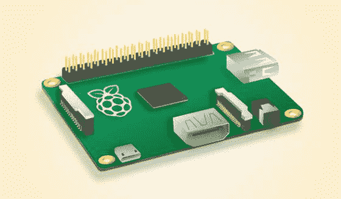

图 6-3。

Raspberry Pi Model A+ (courtesy of Raspberrypi.org)

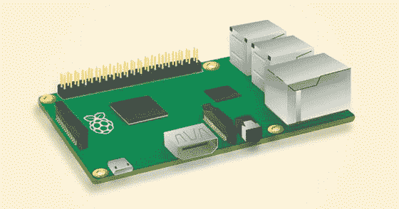

图 6-2。

Raspberry Pi 2 Model B and Pi 1 Model B+ (courtesy of Raspberrypi.org) Note

在写这篇文章的时候，树莓派 Zero 发布了。它拥有与最初的 Raspberry Pi 相同的处理器和内存，但缺少以太网和辅助视频端口。这样做是为了将成本保持在令人惊讶的 5.00 美元的低水平，并将外形尺寸缩小到一包口香糖的大小。

What Happened To The $20 Raspberry Pi?

如果你一直在各种媒体上关注 Raspberry Pi 的发布，你可能听说过这款主板的售价仅为 25 美元。然而，大多数零售商列出的树莓派售价为 35 美元或更高。为什么会这样？

简单的答案是 A+型的价格是 25 美元，而 B 型的价格是 35 美元。这是因为型号 B 有一些更多的功能，特别是以太网。如果您不需要以太网或其他 B 专用选项，您可以通过购买 A+来节省一点。

然而，由于供求关系，你可能会看到两种主板(在美国)的平均价格都在 40 美元或以上。明智购物。

图 [6-2](#Fig2) 很好的代表了 Model B 系列。圆周率 2 和圆周率 1 很难区分。你必须检查板上的印刷来确定差异。有细微的差别，但很难看出来。幸运的是，由于它们使用相同的布局，大多数 B 型机箱将适合两种板。

本章和其余章节中的示例使用 B 型变型。

### 董事会之旅

不比一副扑克牌大多少，Raspberry Pi 板包含许多用于连接设备的端口。本节介绍电路板的概况。如果你想跟着你的冲浪板走，拿着它，让树莓派的标志朝上。我将顺时针绕着棋盘工作。

在近侧的中央，您可以看到一个 HDMI 连接器。左边是一个 microUSB 连接器，用于为电路板供电，右边是一个音频端口。众所周知，某些主板上的电源连接器有点脆弱，所以插拔时要小心。使用您的树莓派时，请务必避免给这根电缆带来额外的压力。

HDMI 端口是连接显示器的主要方式。但是，左侧有一个小的带状电缆连接器，称为 DSI 视频连接器。7 英寸树莓派触摸显示屏( [`http://element14.com/community/docs/DOC-78156?ICID=hp-7inchpidisplay-ban`](http://element14.com/community/docs/DOC-78156?ICID=hp-7inchpidisplay-ban) )可以连接到这里，提供真正漂亮的小型平板电脑体验。图 [6-5](#Fig5) 显示树莓 Pi 触摸显示屏。

图 6-5。

Raspberry Pi 7" Touch Display (courtesy of Raspberrypi.org)

以太网端口后面还有一个摄像头连接器，用于连接摄像头(对许多应用都很有用)。

Note

一些有进取心的制造商已经为这种新显示器开发了Shell，包括可以 3D 打印的平板电脑。最新的原型和设计见 [`http://thingiverse.com`](http://thingiverse.com/) 。

主板底部左侧是底部的微型 SD 卡插槽。

在电路板的另一侧和顶部是通用输入/输出(GPIO)接头(双排引脚)，可用于连接传感器和其它器件。

电路板的右侧是大多数连接器的位置。有四个 USB 连接器和一个以太网连接器。连接到 Raspberry Pi 上的 USB 端口的外部供电 USB 集线器可以为一些电路板供电，但建议您使用连接到 micro-USB 连接器的专用电源。

花点时间检查一下电路板的顶面和底面。如您所见，元件安装在两侧。这与大多数只在一面有元件的电路板不同。Raspberry Pi 两面都有组件的主要原因是它使用多层进行跟踪。这使得电路板可以更小，并且可以使用两个表面。这可能是考虑使用Shell的最有说服力的理由——保护电路板底部的元件，从而避免短路和电路板故障。

### 所需附件

Raspberry Pi 是作为裸系统板出售的，没有机箱、电源或外围设备。根据您计划如何使用 Raspberry Pi，您需要一些常见的附件。如果你像我一样一直在积累备用物品，快速翻一翻你的商店可能会找到你需要的大部分物品。

如果你想在控制台模式下使用 Raspberry Pi(没有图形用户界面)，你需要一个 USB 电源，一个键盘和一个 HDMI 显示器(或 7 英寸触摸显示器)。在 5V 下运行时，电源的最小额定值应为 700mA 或更大。如果您想使用带有图形用户界面的 Raspberry Pi，您还需要一个定点设备(如鼠标)。

如果你不得不购买这些物品，坚持使用没有额外功能的普通品牌和型号。例如，避免使用最新的多功能键盘和鼠标。很有可能，它们需要的驱动程序并不适用于 Raspberry Pi 的各种操作系统。

你还必须有一个微型 SD 卡。我推荐 8GB 或者更高的版本。回想一下，micro SD 是唯一可用的板载存储介质。您需要将操作系统安装到卡上，并且您创建的任何文件都将存储在卡上。我将在后面的部分演示这一点。

如果您想在应用中使用声音，您还需要一套支持标准 3.5 毫米音频插孔的有源扬声器。最后，如果您想将 Raspberry Pi 连接到互联网，您需要一根以太网电缆或兼容 Raspberry Pi 的 USB Wi-Fi 加密狗。

How Can I Tell If My Device Will Work?

如果你想确保你的设备能和树莓派一起工作，最简单的方法就是尝试一下！如果你不想碰运气，你可以在 [`http://elinux.org/RPi_VerifiedPeripherals`](http://elinux.org/RPi_VerifiedPeripherals) 查看树莓派硬件兼容性列表。该列表包含许多设备和社区中测试过这些设备的各种用户的评论。如果您刚刚开始使用 Raspberry Pi，请寻找需要很少或不需要额外配置或驱动程序的设备。

### 推荐配件

我强烈建议至少添加小的橡胶或硅胶自粘缓冲垫，以使电路板远离您的办公桌。电路板底部有许多尖尖的插脚，可能会接触到导电材料，从而导致短路，更糟糕的是，可能会出现树莓皮。这些保险杠在大多数家装和五金店都有售。

如果您计划将板从一个房间移动到另一个房间，或者您想要确保您的 Raspberry Pi 受到良好的保护以防意外损坏，您应该考虑购买一个盒子来放置板。有许多箱子可供选择，从简单的卡扣模型到由激光切割丙烯酸树脂甚至轧制铝制成的模型。以下列表包括几个不错的选择，从便宜的到顶级的豪华包都有:

*   树莓派 2B+清案: [`http://sparkfun.com/products/12996`](http://sparkfun.com/products/12996)
*   丕锡`:` [`http://sparkfun.com/products/13102`](http://sparkfun.com/products/13102)
*   美丽的空气: [`http://makershed.com/products/the-bel-aire`](http://makershed.com/products/the-bel-aire)
*   阿达果圆周率框: [`http://adafruit.com/products/1985`](http://adafruit.com/products/1985)
*   忍者 Pibow: [`http://adafruit.com/products/2081`](http://adafruit.com/products/2081)
*   一体式铝制Shell: [`http://adafruit.com/products/2198`](http://adafruit.com/products/2198)

另一个选择是用 3D 打印机打印自己的案例。如果你没有 3D 打印机，你可以在当地的库、社区大学或者朋友的朋友那里找到。如果你友好地提出要求，大多数 3D 打印机爱好者很可能会乐意为你打印一个案例。事实上，有许多这样的案例设计可供下载和打印。图 [6-6](#Fig6) 显示了我在 3D 打印机上打印的一张。

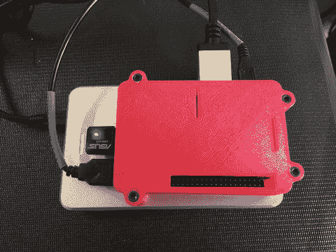

图 6-6。

3D-printed Raspberry Pi 2 Model B+ case Tip

如果您计划使用 GPIO 引脚进行试验，或者需要接触电源测试引脚或位于主板内部的其他端口，您可能需要考虑使用自粘式缓冲垫选项，或者订购顶部开口的机箱，以便于接触。如果经常开关，有些箱子容易破损。

除了机箱之外，您还应该考虑购买(或从备件中取出)一个带电源的 USB 集线器。USB 集线器电源模块应为 700–1000 毫安。如果您计划使用消耗大量电力的 USB 设备，如 USB 硬盘驱动器或 USB 软导弹发射器，则需要一个供电集线器。

Caution

因为板子很小，所以很容易把它用在不稳定的地方，比如在行驶中的汽车上或凌乱的桌子上。确保您的 Raspberry Pi 放在安全的地方。电源、HDMI 和 micro SD 卡插槽似乎是最容易受到攻击的连接器。

### 去哪里买

树莓派在欧洲已经有一段时间了。越来越容易找到，但很少有实体店有树莓酱。幸运的是，许多在线零售商都有它的存货，还有许多已知与树莓派配合使用的配件。以下是一些比较受欢迎的在线零售商，提供了他们的 Raspberry Pi 目录条目链接:

*   "活力四射" " t1 " " t0 " " T2 "
*   Adafruit: [`http://adafruit.com/category/105`](http://adafruit.com/category/105)
*   制造者棚: [`http://makershed.com/collections/raspberry-pi`](http://makershed.com/collections/raspberry-pi)

A Raspberry Pi Laptop?

Raspberry Pi 对物理计算做出了重大贡献。它不仅能实现更复杂的传感器节点，还能制造出一台相当轻便的通用计算机。有了合适的显示器、鼠标和存储设备，您就可以完成大多数互联网和一般的工作任务。事实上，有些人已经把他们的家用台式电脑换成了树莓派！

如果你像我一样，你需要能够在任何地方工作， [5](#Fn5) 考虑到你必须有单独的显示器和键盘，使用树莓派可能不是很方便。如果你可以带着你的树莓派，那不是很棒吗？现在你可以了！

你需要的是来自摩托罗拉的多余的刺桐。Lapdock 最初设计用于将 Aria 手机用作笔记本电脑，提供了 11.6 英寸 HDMI 显示器、USB 键盘、鼠标、双端口 USB 集线器和扬声器。更重要的是，它是电池供电的，可以轻松地为树莓派供电。Lapdock 具有迷你 HDMI 和迷你 USB 端口，可以连接到 Raspberry Pi，而无需修改 Lapdock。

但有一个问题:你必须购买一个迷你 HDMI 母到母适配器和一个迷你 HDMI 公到 HDMI 公电缆 [6](#Fn6) ，并用一根微型 USB 延长线和一根 A 型 USB 线制作自己的弗兰肯斯坦 USB 线。需要定制电缆来允许 Raspberry Pi 使用 USB 键盘和鼠标以及给电路板供电。下图显示了电缆的结构。可以在 [`www.adafruit.com/blog/2012/09/10/cables-adapters-for-the-atrix-raspberry-pi-laptop/`](http://www.adafruit.com/blog/2012/09/10/cables-adapters-for-the-atrix-raspberry-pi-laptop/) 找到详细的教程视频。

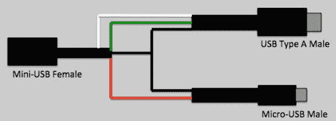

要制作线缆，从标准 USB 线缆上切下一个普通的 USB A 型连接器， [7](#Fn7) 将一根标准微型 USB 延长线一分为二，并拼接电线，如下图所示。您可以放弃未显示连接的末端中的导线。微型 USB 插头将用于为 Raspberry Pi 供电，USB A 型插头将提供与 Lapdock 键盘和鼠标的连接。一旦你做好了这根电缆，你就可以开始工作了。为了获得最佳效果，我推荐一个坚固的盒子来装你的树莓派，以免在运输过程中损坏它。

要使用 Raspberry Pi 笔记本电脑，首先连接 HDMI 电缆，然后连接任何外围设备(如硬盘)，然后连接 USB 电缆；打开船坞的盖子。几秒钟之内，您的新笔记本电脑就可以使用了！下图显示了折叠门下 Lapdock 后部的端口，后一张图显示了笔记本电脑的运行情况。

您不仅可以将此解决方案用于您的 Raspberry Pi，其他几个电路板也同样适用。我已经成功地使用 Lapdock 为其他电路板供电。事实上，Lapdock 是一款出色的 pcDuino 笔记本电脑！即使您的主板不支持键盘或鼠标，HDMI 屏幕也很方便。

这个项目最好的部分是成本。你可以在拍卖网站和类似的电子清仓商店找到二手和多余的 Lapdock。例如，在易贝，鳕鱼的价格约为 60 美元。您也可以在网上或大多数电子商店找到这些电缆。然而，女性对女性的迷你 HDMI 适配器有点难找到。我在易贝从中国的经销商那里买了一辆。运输速度惊人的快，而且费用合理。我的手机树莓派(不包括树莓派)价格不到 100 美元。

下一节将介绍一个关于开始使用 Raspberry Pi 的简短教程。如果你已经学会了如何使用 Raspberry Pi，你可以浏览这一部分，看看在启动和运行 Raspberry Pi 方面的最新改进。

## 树莓派教程

以下部分提供了一个简短的教程，介绍如何开始使用新的 Raspberry Pi，从裸板到完全可操作的平台。许多优秀的作品更详细地讨论了这个主题。如果你发现自己被困住了，或者想知道更多关于开始使用 Raspberry Pi 和 Raspbian 操作系统的信息，请参阅 Peter Membrey 和 David Hows 的《在 Linux 上学习 Raspberry Pi》(a press，2012)。如果您想了解更多关于在硬件项目中使用 Raspberry Pi 的信息，Brendan Horan (Apress，2013)的《实用 Raspberry Pi》是一个很好的资源。

如“所需附件”一节所述，您需要一个微型 SD 卡、一个额定电流为 700mA 或更高的 USB 电源(带公微型 USB 连接器)、一个键盘、一个鼠标(可选)以及一台 HDMI 显示器、一台 HDMI 电视或一台带 HDMI 适配器的 DVI 显示器。然而，在您启动您的 Raspberry Pi 并享受它的光辉之前，您需要为您的 micro SD 卡创建一个启动映像。

### 选择启动映像(操作系统)

你需要做的第一件事是决定你想要使用哪个操作系统版本。有几个很好的选择，包括标准的 Raspbian“Jessie”变体。每一个都可以作为一个称为图像或卡片图像的压缩文件。你可以在 Raspberry Pi foundation 下载页面上找到推荐图片的列表以及下载每张图片的链接: [`www.raspberrypi.org/downloads`](http://www.raspberrypi.org/downloads) 。以下图片可在网站上找到:

*   Raspbian (Jessie):基于 Debian 的官方操作系统，包含一个图形用户界面(轻量级 X11 桌面环境[LXDE])、开发工具和基本的多媒体功能。
*   Ubuntu Mate:以 Ubuntu 桌面和缩小版的 Ubuntu 操作系统为特色。如果你熟悉 Ubuntu，你会觉得这个版本很舒服。
*   Snappy Ubuntu Core:核心 Ubuntu 系统开发者版；与 Mate 相同，但增加了开发者核心实用程序。
*   视窗 10 IOT 核心:视窗 10 为 IOT。微软首屈一指的 IOT 操作系统。是的，它看起来和感觉上确实像 Windows，但是没有笨重的图形用户界面。
*   OSMC:开源媒体中心。给自己建一个媒体中心。
*   OpenElec:开放式嵌入式 Linux 娱乐中心。另一个媒体中心选项。
*   PiNet:教室管理系统。教育工作者在课程中使用树莓 Pi 的特别版。
*   RISC OS:非 Linux，类 Unix 操作系统。如果您知道 IBM AIX 是什么，或者您使用过其他 Unix 操作系统，您就会认识到这个怪物。

Tip

如果您刚刚开始使用 Raspberry Pi，您应该使用 Raspbian 图像。本书中的例子也推荐使用这个图像。

还有一些其他的图像选择，包括来自 Adafruit 的 Raspbian 图像的特殊变体。Adafruit 将其图像称为`occidentals`,包括预装的许多应用和实用程序，包括 Wi-Fi 支持和几个实用程序。一些树莓派的例子——尤其是来自 Adafruit 的例子——需要西方人的形象。您可以在 [`http://learn.adafruit.com/adafruit-raspberry-pi-educational-linux-distro/overview`](http://learn.adafruit.com/adafruit-raspberry-pi-educational-linux-distro/overview) 找到更多关于图像的信息并下载。

安装启动映像有两种方法。首先，你可以使用名为新的开箱即用软件(NOOBS [8](#Fn8) )的自动化图形用户界面平台，或者你可以从头开始将你的映像安装到一个微型 SD 驱动器上。两者都需要下载并格式化 micro SD 驱动器。

如果你刚刚开始，NOOBS 的解决方案是最简单的。这将需要更长一点的时间(但不会太长)并简化过程。除了格式化微型 SD 卡，一切都是自动化的。我将在下面的小节中介绍这两种选择。

#### 使用 noob

到目前为止，NOOBS 是让你的树莓派运转起来的最好方式。使用 NOOBS，您可以下载一个包含 Raspbian Jessie 的基本安装程序映像。您可以选择安装它或配置 NOOBS 下载其他图像之一，并安装它。但首先，你必须得到 NOOBS 启动图像，并将其复制到您的微型 SD 驱动器。

从 [`http://raspberrypi.org/downloads/noobs/`](http://raspberrypi.org/downloads/noobs/) 下载 NOOBS 安装程序开始。您将看到两个选项，一个包含 Raspbian 映像的网络安装程序(有时称为`offline installer`)或一个不包含任何操作系统的基础映像。如果您想将自动安装程序与尚未包含的操作系统(如 Adafruit 的版本)一起使用，可以使用这个基础映像。

Tip

如果你的下载带宽有限，网上零售商会提供一个预配置的包含 NOOB 的微型 SD 卡。事实上，你经常可以找到任何流行的 Raspberry Pi 操作系统的微型 SD 卡。插上电源就可以走了。它们通常比同样大小的空白卡贵几美元。 [9](#Fn9)

一旦你下载了安装程序(到目前为止大约 1.4Gb)，你将需要格式化一个至少 8Gb 的微型 SD 卡。根据您的桌面平台，您可以使用多种方法来实现这一点。如果您使用 Mac OS X，您可以使用“磁盘工具”来格式化驱动器。或者您可以使用适用于 Windows 或 Mac OS X 的 SD Formatter 4.0 实用程序( [`http://sdcard.org/downloads/formatter_4/`](http://sdcard.org/downloads/formatter_4/) )。只需下载应用并安装它。然后将您的 micro SD 卡插入读卡器并启动应用。确认选择了正确的媒体后，输入卡的名称(我使用的是 NOOBS ),然后点按“格式化”。图 [6-7](#Fig7) 显示了 SDFormatter 应用。

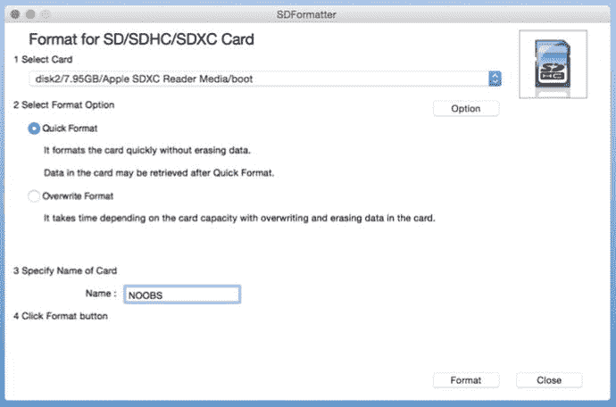

图 6-7。

SDFormatter 4.0 But, I Don’T Have An Sd Card Reader!

您的计算机上必须连接有 SD 卡读写器。有些系统内置了 SD 卡驱动器(联想笔记本电脑、苹果笔记本电脑和台式机等等)。如果您没有 SD 读卡器，您可以在任何出售电子产品或照片设备的地方找到 USB SD 读卡器。大多数阅读器可以接受各种格式，包括 micro SD 或通过 micro SD 转 SD 适配器的 micro SD。

格式化 micro SD 卡后，现在必须将 NOOBS 映像的内容复制到卡上。右键单击您下载的文件，并选择选项来解压缩文件。这将创建一个包含 NOOBS 图像的文件夹。将所有这些文件(不是外部文件夹)复制到 SD 卡并弹出。现在，您已经准备好启动到 NOOBS 并安装您的操作系统。当此过程完成后，安全地取出 SD 卡，并将其插入您的 Raspberry Pi。

现在，您可以连接所有外围设备了。我喜欢把事情简单化，只连接一个显示器、键盘和(对 NOOBS 来说)一个鼠标。如果你想下载 Raspbian 以外的操作系统，你还需要将你的 Raspberry Pi 连接到你的网络。

一旦你的 Raspberry Pi 开机，你会看到各种信息的滚动显示。这是正常的，在 NOOBS 开始前可能会滚动一段时间。当加载 NOOBS 时，你会看到一个类似于图 [6-8](#Fig8) 的屏幕。

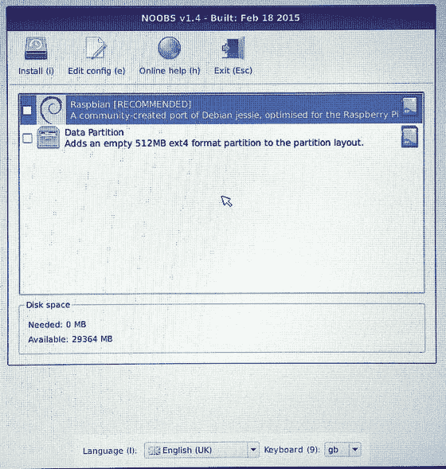

图 6-8。

NOOBS startup screen

请注意，您将在操作系统列表中看到 Raspbian 映像。要安装它，只需勾选缩略图旁边的复选框，然后单击安装。但是，请注意底部的两个框。这将设置在 NOOBS 使用的语言和键盘。它不影响 Raspbian 的设置。

一旦你开始安装，你会看到一系列的对话框，因为 Raspbian 开始安装。这可能需要一段时间。好消息是对话框提供了很多有用的信息来帮助你开始。您将了解如何登录 Raspbian，配置和定制的技巧，以及如何充分利用您的体验的建议。

安装完成后，在完成的对话框中单击 OK，然后等待 Raspberry Pi 重新启动到 Raspbian。在第一次启动时，您可能会看到 Raspberry Pi 配置对话框。“配置”对话框用于设置您所在地区的时间和日期、启用硬件(如相机板)、创建用户、更改密码等等。图 [6-9](#Fig9) 显示了配置对话框。

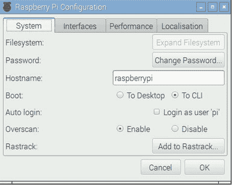

图 6-9。

Raspbian configuration dialog Tip

您还可以通过打开终端并运行命令`raspi-config`来运行基于控制台的配置实用程序。

您将看到四个选项卡，可用于更改系统设置。我在下面的列表中简要地解释了每一个，并给出了每一个的推荐设置。完成更改后，单击“确定”关闭对话框。根据您选择的设置，可能会要求您重新启动。

*   系统:系统的控制板。使用此面板更改 root 密码(强烈推荐)、主机名(可选)、引导类型(如果您想将 Raspberry Pi 设置为无头引导，请使用命令行界面[CLI])和自动登录(不推荐)。
*   接口:用于启用系统和硬件服务，如摄像头、SSH(推荐)和 GPIO 头的硬件接口。
*   性能:用于更改处理器的执行方式。你可以选择超频(运行 CPU 更快)，但我不建议将这个设置用于将托管数据库或 web 服务器(或两者)的 Raspberry Pi。
*   本地化:用于设置默认语言、键盘、日期和时间。如果您没有更改任何其他内容，请确保将这些设置为您的本地设置。

Tip

Raspbian Jessie 的默认登录使用用户名`pi`和密码`raspberry`。我建议在 Raspberry Pi 配置对话框中进行更改。

要关闭或重新启动 Raspbian，请单击菜单，然后选择关闭。您将看到重启、关机或返回命令行的提示。如果你在命令行，使用命令`shutdown -h now`关闭系统。

#### 在 Micro SD 卡上安装启动映像

安装启动映像的过程包括选择映像、下载映像，然后将其复制到您的 micro SD 卡。以下部分详细介绍了相关步骤。这是一个手动过程，比 NOOBS 选项稍微复杂一点，但也不过分。

一旦您选择了一个图像并下载了它，您首先解压缩文件，然后将其复制到您的 SD 卡。有多种方法可以做到这一点。以下部分描述了一些适用于各种平台的简化方法。

##### Windows 操作系统

要在 Windows 上创建 SD 卡映像，您可以使用来自 Launchpad ( [`https://launchpad.net/win32-image-writer`](https://launchpad.net/win32-image-writer) )的 Win32 磁盘映像软件。下载该文件，并将其安装在您的系统上。如果还没有解压缩映像，请将其解压缩，然后将 SD 卡插入 SD 卡读写器。启动 Win32 Disk Imager 应用，选择顶部框中的图像，然后单击 WRITE 将图像复制到 SD。

Caution

复制过程会覆盖 SD 卡上已有的任何内容，因此请务必先将这些照片复制到您的硬盘上！

##### Mac OS X

要在 Mac 上创建 SD 卡映像，请下载映像并将其解压缩。将您的 SD 卡插入 SD 卡读写器。确保卡是用 FAT32 格式化的。接下来，打开系统报告(提示:使用苹果菜单，然后选择关于这台 Mac)。

如果您有内置读卡器，请单击读卡器，或者浏览 USB 菜单并找到 SD 卡。记下磁盘编号。例如，它可能是磁盘 4。

接下来，打开“磁盘工具”并卸载 SD 卡。您需要这样做，以允许“磁盘工具”装载并连接到该卡。现在事情变得有点混乱。打开终端，运行以下命令，将磁盘号替换为 n，将镜像文件的路径和名称替换为`<image_file>`:

`sudo dd if=<image_file> of=/dev/diskn bs=1m`

此时，您应该会看到磁盘驱动器指示灯闪烁(如果有)，您需要耐心等待。这个步骤可以在没有用户反馈的情况下运行一段时间。当命令提示符再次显示时，您就知道它完成了。

##### Linux 操作系统

要使用 Linux 创建 SD 卡映像，您需要知道 SD 卡读卡器的设备名称。执行以下命令查看当前安装的设备:

`df -h`

接下来，插入 SD 卡或连接读卡器，等待系统识别。再次运行该命令:

`df -h`

花点时间检查这个列表，并将其与第一次执行进行比较。“额外”设备是您的 SD 读卡器。记下设备名称(例如，`/dev/sdc1`)。该数字是分区号。所以，`/dev/sdc1`是分区 1，设备是`/dev/sdc`。接下来，卸载设备(我将使用前面的例子)。

`umount /dev/sdc1`

使用以下命令写入映像，用设备名称代替`<device>`，用映像文件的路径和名称代替`<image_file>`(例如`/dev/sdc`和`my_image.img`):

`sudo dd bs=4M if=<image_file> of=<device>.`

此时，您应该会看到磁盘驱动器指示灯闪烁(如果有)，您可能需要耐心等待。这个步骤可以在没有用户反馈的情况下运行一段时间。当命令提示符再次显示时，您就知道它完成了。

### 启动

要启动您的 Raspberry Pi，请插入带有新图像的 SD 卡，并插入您的外围设备。等到最后插上 USB 电源。因为树莓派没有开/关开关，所以一通电就会启动。系统启动，然后开始加载操作系统。您会看到一长串语句，这些语句传达了每个子系统在加载时的状态。你不必试图去阅读甚至理解所有出现的行， [10](#Fn10) 但是你应该注意任何错误或警告。当引导序列完成时，你会看到一个命令提示符，如图 [6-10](#Fig10) 所示。

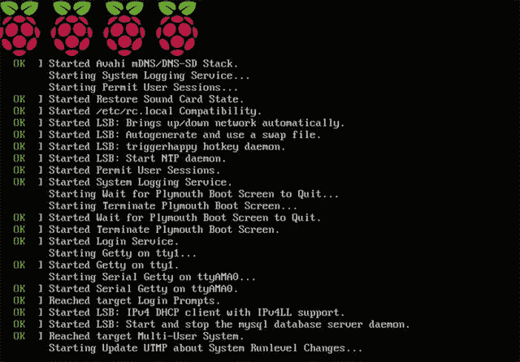

图 6-10。

Example boot sequence[11](#Fn11)

可能会提示您输入用户名和密码。默认用户简单来说就是 pi，密码是 raspberry(无引号，全小写)。在提示符下输入，Raspberry Pi 会显示如图 [6-11](#Fig11) 所示的配置菜单。如果您没有看到这个，您可以通过键入命令`raspi-config`来启动它。

图 6-11。

Raspberry Pi configuration menu

配置菜单显示了使用 Raspberry Pi 时您可能想要设置的常见初始选项列表。为了方便起见，它在第一次引导时加载。您可以使用上下箭头键在选项中导航，并使用 Tab 键选择操作按钮。菜单项简要描述如下:

*   扩展文件系统:使用 SD 卡上的全部空间。
*   更改用户密码:更改 Pi 用户的密码。如果您的 Raspberry Pi 将连接到网络，尤其是可以从互联网访问，请使用此选项。
*   引导选项:启用/禁用 GUI 窗口系统的引导。
*   过扫描:更改视频信号发送到显示器/电视的方式。如果 Raspberry Pi 的输出图像没有填满可用的显示区域，请使用此选项。
*   国际化选项:更改键盘映射(特定于国家/语言)、时区和语言，设置特定于国家/语言的时间、货币、日期等显示模式。
*   启用相机:打开/启用相机模块。
*   添加到 Raspberry Pi:将您的 Raspberry Pi 添加到 Pi 地图，这是世界上树莓 Pi 的全球指标。
*   超频:更改系统的 CPU 计时设置(也称为速度)。仅限专家。正常的 Raspberry Pi 使用不需要这样。
*   高级选项:启用/禁用各种系统服务，如 SSH。
*   关于`raspi-config`:获取如何使用该工具的信息。

Note

配置菜单的未来版本将包括附加选项。一旦你将你的 Raspberry Pi 连接到互联网并执行了更新选项，查看菜单寻找新选项是个好主意。

第一次引导系统时，您应该使用其中的一些选项。至少，您应该将根文件系统设置为使用整个 SD 卡空间，更改键盘设置，设置您的地区和时区，如果您希望能够远程登录，还应该启用 SSH 服务器。

当您首次初始化 SD 卡上的映像时，该过程不会使用全部可用空间。“扩展文件系统”选项可以帮您做到这一点。在某些情况下，操作完成后系统会重新启动，所以在执行此选项之前，请确保您没有运行其他程序。

通过设置键盘、区域设置和时区，您可以像在 PC 上一样使用 Raspberry Pi。特别是，你的键盘会有你期望的特殊符号；日期、时间和类似的值将正确显示。你的时钟将被设置为正确的当地时间。这些操作可能不需要重新启动。你应该在认真使用 Raspberry Pi 之前设置这些。

在以后的引导中，系统将会启动，并且一旦您登录，它将处于终端模式(除非您选择了在窗口环境中启动的选项)。从这里，您可以使用命令行实用程序探索系统，或者使用`startx`启动图形用户界面。在继续之前，请花些时间研究一下这个系统。如果您想重启配置会话，请使用命令`sudo raspi-config`。

一旦您的 Raspberry Pi 正在运行，并且您已经花时间探索和学习了系统管理的基础知识，您就可以开始尝试硬件了。

Sd Card Corruption

想象一下这个场景。您正在创建文件、下载文档等等。您的生产力很高，并且您正在享受您的新的低成本、超级酷的树莓派。现在想象一下电源线不小心被踢出墙外，你的树莓 Pi 没电了。没什么大不了的，对吧？嗯，大部分时间。

SD 卡没有你的硬盘坚固。您可能已经知道突然关闭 Linux 系统是不明智的，因为这样做会导致文件损坏。嗯，在 Raspberry Pi 上，它会导致您的磁盘映像完全丢失。症状包括从轻微的读取错误到无法在引导程序上引导或加载映像。这是有可能发生的——而且据其他人报道，这种情况已经发生了不止一次。

这并不是说所有的 SD 卡都是坏的，也不是说 Raspberry Pi 有问题。意外断电时的损坏是这种介质的副作用。有人报告说，某些 SD 卡比其他 sd 卡更容易出现这种情况。你能做的保护自己的最好的事情是使用一个已知的可以与 Raspberry Pi 一起工作的 SD 卡，并确保使用`sudo shutdown -h now`命令关闭系统——并且永远不要以任何其他方式关闭系统。

你也可以备份你的 SD 卡。详见 [`http://elinux.org/RPi_Beginners#Backup_your_SD_card`](http://elinux.org/RPi_Beginners#Backup_your_SD_card) 。

既然您已经知道如何设置和运行您的 Raspberry Pi，现在让我们来看看如何将它转变为您的 IOT 解决方案的数据库服务器。

## MySQL 安装和设置

是时候弄脏你的手，在你毫无戒心的树莓派上施展魔法了！让我们从给它添加一个 USB 硬盘开始。根据数据的大小，您可能需要认真考虑这样做。

也就是说，如果您的数据很小(从不超过几兆字节)，您可以从启动映像 SD 卡使用 MySQL。但是，如果您想确保不会耗尽空间，并使您的数据与您的启动映像分开(这总是一个好主意)，您应该安装一个在启动时自动连接的 USB 驱动器。本节详细解释了如何做到这一点。

Tip

请确保您使用高质量的 USB 集线器来托管您的外部驱动器。如果你使用的是传统的主轴驱动，这一点尤为重要，因为它会消耗更多的能量。将外部驱动器直接连接到 Raspberry Pi 可能会剥夺它的电源并导致无尽的沮丧。症状包括随机重启(总是令人惊喜)、命令失败、数据丢失等等。请务必为您的外围设备和 Raspberry Pi 提供充足的电源。

使用什么样的磁盘由您决定。你可以使用 USB 闪存驱动器，如果它有足够的空间和足够的速度(大多数新型号足够快)，应该可以正常工作。如果您有额外的固态硬盘或者想要将功耗和热量降至最低，您也可以使用固态硬盘(SSD)。另一方面，你可能有一个额外的硬盘可以使用。本节的示例使用安装在典型 USB 硬盘驱动器Shell中的剩余 250GB 笔记本电脑硬盘驱动器。

Tip

使用外部硬盘驱动器(SSD 或传统的主轴驱动器)比访问闪存驱动器上的数据要快得多。它通常每单位(千兆字节)更便宜，或者，正如我提到的，可以很容易地从盈余。

### 对驱动器进行分区和格式化

在使用与 Raspberry Pi 不兼容的文件系统的新驱动器或现有驱动器之前，必须对驱动器进行分区和格式化。我发现在我的台式电脑上做这个更容易，建议你也这样做。因此，以下假设外部驱动器具有单个 FAT(或 FAT32)分区。这并不重要，因为为了获得最佳性能，我们将删除它并使用 ext4 文件系统创建一个新的分区。

首先，将驱动器连接到树莓派。然后使用`fdisk -l`命令查看连接的可用磁盘，确定连接了哪些驱动器。如果你有一个标准的 Raspbian 映像，你应该看到你的硬盘被列为`/dev/sda`。如果您使用不同的映像或您的设备有不同的标签，请在以下步骤中使用您系统中的地址。

一旦您识别了磁盘，再次启动`fdisk`，将设备作为一个选项，如清单 [6-1](#FPar19) 所示。

Listing 6-1.Partitioning a Hard Disk on Raspberry Pi

`pi@raspberrypi ∼ $ sudo fdisk /dev/sda`

`Welcome to fdisk (util-linux 2.25.2).`

`Changes will remain in memory only, until you decide to write them.`

`Be careful before using the write command.`

`Command (m for help): m`

`Help:`

`Generic`

`d   delete a partition`

`l   list known partition types`

`n   add a new partition`

`p   print the partition table`

`t   change a partition type`

`v   verify the partition table`

`Misc`

`m   print this menu`

`x   extra functionality (experts only)`

`Save & Exit`

`w   write table to disk and exit`

`q   quit without saving changes`

`Create a new label`

`g   create a new empty GPT partition table`

`G   create a new empty SGI (IRIX) partition table`

`o   create a new empty DOS partition table`

`s   create a new empty Sun partition table`

`Command (m for help): p`

`Disk /dev/sda: 111.8 GiB, 120034123776 bytes, 234441648 sectors`

`Units: sectors of 1 * 512 = 512 bytes`

`Sector size (logical/physical): 512 bytes / 512 bytes`

`I/O size (minimum/optimal): 512 bytes / 512 bytes`

`Disklabel type: gpt`

`Disk identifier: 790E7C68-F089-45C7-A9E9-D7C2CA56BB31`

`Command (m for help): n`

`Partition number (1-128, default 1): 1`

`First sector (34-234441614, default 2048):`

`Last sector, +sectors or +size{K,M,G,T,P} (2048-234441614, default 234441614):`

`Created a new partition 1 of type 'Linux filesystem' and of size 111.8 GiB.`

`Command (m for help): w`

`The partition table has been altered.`

`Calling ioctl() to re-read partition table.`

`Syncing disks.`

这里发生了很多事情。我用粗体突出显示了这些步骤。请注意，首先我显示了该实用程序的帮助菜单，并根据提示使用了`m`命令。接下来，我使用`p`命令打印分区表，验证那里没有分区。如果你已经定义了分区并且想要删除它们，你可以使用`d`命令来完成。

Caution

如果您的驱动器上有一个分区包含您想要保留的数据，请立即中止，并首先将数据复制到另一个驱动器。以下步骤将擦除驱动器上的所有数据！

然后使用命令`n`创建一个新的分区，并接受缺省值，使用所有的空闲空间。为了检查您的工作，您可以使用`p`命令来打印设备分区表和元数据。它显示(并确认)新的分区。

如果你担心你可能犯了一个错误，不要惊慌！关于`fdisk`的伟大之处在于，它不会写或改变磁盘，直到你用`w`或`write`命令告诉它。在示例中，您发出`w`命令来写入分区表。要查看可用命令的完整列表，您可以使用`h`命令或运行`man fdisk`。

Tip

对于所有的 Linux 命令，您可以使用命令`man <application>`查看手册文件。

下一步是用 ext4 文件系统格式化驱动器。这很简单，只需要一个命令:`mkfs` (make file system)。你把设备名传给它。如果你回忆一下，这是`/dev/sda1`。即使您创建了一个新分区，它仍然是第一个分区，因为驱动器上只有一个分区。如果您尝试使用不同的分区，请确保使用正确的编号！该命令可能需要几分钟时间来运行，具体取决于驱动器的大小。以下示例显示了该命令的实际效果:

`pi@raspberrypi ∼ $ sudo mkfs.ext4 /dev/sda1`

`mke2fs 1.42.12 (29-Aug-2014)`

`Creating filesystem with 29304945 4k blocks and 7331840 inodes`

`Filesystem UUID: 0285ba01-3880-4ee5-8a19-7f47404f1500`

`Superblock backups stored on blocks:`

`32768, 98304, 163840, 229376, 294912, 819200, 884736, 1605632, 2654208,`

`4096000, 7962624, 11239424, 20480000, 23887872`

`Allocating group tables: done`

`Writing inode tables: done`

`Creating journal (32768 blocks): done`

`Writing superblocks and filesystem accounting information: done`

现在您有了一个新的分区，并且已经正确格式化了。下一步是将驱动器与引导映像上的挂载点相关联，然后在引导时连接该驱动器，这样每次启动 Raspberry Pi 时，您都不必做任何事情来使用该驱动器。

### 设置自动驱动安装

Linux 中的外置驱动器通过`mount`连接(挂载)，通过`umount`断开(卸载)。与某些操作系统不同，不先卸载就拔掉 USB 驱动器通常不是个好主意。同样，您必须先安装驱动器，然后才能使用它。本节说明了安装驱动器并使驱动器在每次引导时自动安装所需的步骤。

我首先讨论安装驱动器并为自动安装做好准备的预备步骤。这些包括在`/media`文件夹下创建一个文件夹来挂载驱动器(称为挂载点)，更改文件夹的权限以允许访问，以及执行一些可选步骤来调整驱动器。

`pi@raspberrypi ∼ $ sudo mkdir -p /media/HDD`

`pi@raspberrypi ∼ $ sudo chmod 755 /media/HDD`

`pi@raspberrypi ∼ $ sudo tune2fs -m 0 /dev/sda1`

`tune2fs 1.42.12 (29-Aug-2014)`

`Setting reserved blocks percentage to 0% (0 blocks)`

`pi@raspberrypi ∼ $ sudo tune2fs -L MYSQL /dev/sda1`

`tune2fs 1.42.12 (29-Aug-2014)`

`pi@raspberrypi ∼ $ sudo mount /dev/sda1 /media/HDD`

这些命令很容易识别，是基本的文件和文件夹命令。然而，使用`tune2fs` (tune file system)的调优步骤用于首先重置用于特权访问的块数(这节省了一点空间)，然后将驱动器标记为 MYSQL。同样，这些是可选的，如果你愿意，你可以跳过它们。

Tip

可以用`sudo umount /dev/sda1`卸载驱动器。

此时，驱动器可以访问并准备好使用。你可以切换到`/media/HDD`文件夹，创建文件或者做任何你想做的事情。现在，让我们来完成为自动挂载设置驱动器的任务。

最好的方法是通过驱动器的通用唯一标识符(UUID)来引用它。这被分配给这个驱动器，并且只分配给这个驱动器。您可以告诉操作系统将具有特定 UUID 的驱动器挂载到特定的挂载点(`/media/HDD`)。

还记得之前的`/dev/sda`设备名称吗？如果您将驱动器插入另一个集线器端口，或者更好的情况是，如果有其他驱动器连接到您的设备，并且您卸载然后再装载它们，则下次引导时设备名称可能会不同！UUID 帮助您确定哪个驱动器是您的数据驱动器，使您不必将驱动器插入特定的端口，并允许您使用其他驱动器，而不必担心如果驱动器被赋予不同的设备名称会破坏您的 MySQL 安装。

要获得 UUID，使用`blkid`(块 ID)应用。

`pi@raspberrypi ∼ $ sudo blkid`

`/dev/mmcblk0: PTUUID="000575b3" PTTYPE="dos"`

`/dev/mmcblk0p1: LABEL="RECOVERY" UUID="0761-F2EA" TYPE="vfat" PARTUUID="000575b3-01"`

`/dev/mmcblk0p3: LABEL="SETTINGS" UUID="13062706-1a48-47bc-9f3a-0ded961267e4" TYPE="ext4" PARTUUID="000575b3-03"`

`/dev/mmcblk0p5: SEC_TYPE="msdos" LABEL="boot" UUID="07D7-3A9D" TYPE="vfat" PARTUUID="000575b3-05"`

`/dev/mmcblk0p6: LABEL="root" UUID="c9d8e201-90e5-4d6b-9c8f-92d658fec13c" TYPE="ext4" PARTUUID="000575b3-06"`

`/dev/sda1: LABEL="MYSQL" UUID="0285ba01-3880-4ee5-8a19-7f47404f1500" TYPE="ext4" PARTUUID="ab7357a8-536a-4015-a36d-f80280c2efd1"`

注意粗体的那一行。哇哦！那是一大串。UUID 是一个 128 字节(字符)的字符串。为下一步复制它。

要设置自动驱动器映射，您可以使用一个称为文件系统静态信息的特性(`fstab`)。这包括位于系统上的`/etc`文件夹中的一个文件。你可以随意编辑这个文件。如果你来自 Linux 或者 Unix 的老学校，你可能会选择使用 vi。[T312](#Fn12)由此产生的文件如下:

`pi@raspberrypi ∼ $ sudo nano /etc/fstab`

`proc            /proc           proc    defaults          0       0`

`/dev/mmcblk0p5  /boot           vfat    defaults          0       2`

`/dev/mmcblk0p6  /               ext4    defaults,noatime  0       1`

`UUID=0285ba01-3880-4ee5-8a19-7f47404f1500 /media/HDD ext4 defaults.noatime 0 0`

`# a swapfile is not a swap partition, no line here`

`#   use  dphys-swapfile swap[on|off]  for that`

您添加的行以粗体显示。在这里，您只需添加 UUID、挂载点、文件系统和选项。就这样！您可以使用以下命令重启您的 Raspberry Pi，并在消息滚动时观察屏幕。最终，您会看到驱动器已安装。如果有任何错误，您可以在启动序列中看到它。

`$ sudo shutdown –r now`

现在您已经准备好构建 MySQL 数据库服务器了！下一节详细介绍了使用 Raspberry Pi 实现这一点所需的步骤。

### 安装 MySQL 服务器

将 Raspberry Pi 转变成 MySQL 数据库服务器很容易。本节将向您展示如何安装 MySQL，以及如何将它的默认数据目录从您的引导映像移动到您在上一节中连接的新的外部驱动器。

所涉及的步骤包括更新您的能力库(软件包管理器)，然后安装 MySQL。虽然这个过程相当漫长，但我觉得最好向您展示整个过程，以防您的基本图像不同或遇到错误。

#### 安装 MySQL

要安装 MySQL 或基础映像中没有的任何软件，您必须连接到互联网。如果您尚未这样做，请使用以太网端口或无线网络设备将您的 Raspberry Pi 连接到互联网。

您可能还记得，您使用的是基于 Debian 的 Raspbian Jessie 发行版。如果您使用其他发行版，它可能有不同的包管理器，本节中的命令可能不起作用。在这种情况下，您应该能够为您的发行版找到类似的命令。

让我们从更新包管理器包头开始。这总是一个好主意，尤其是如果您使用的是几个月前发布的发行版。命令`apt-get update`告诉系统从已知的主机发行版下载最新的头文件。这可以确保您获得正在安装的任何软件的最新版本。

之后，安装软件就像告诉 aptitude 安装一样简单。诀窍是知道正确的名字。在这种情况下，您要寻找的是`mysql-server`。清单 [6-5](#FPar42) 展示了更新 aptitude 和安装 MySQL 的步骤。(为了简洁起见，我省略了一些行。)除了输入命令之外，还会要求您回复询问是否可以下载 MySQL 及其先决条件的提示，并输入 MySQL root 用户的密码。

Note

当您在示例中看到密码 secret 时，它被用作您选择的任何密码的占位符，而不是明确的单词 secret。

让我们从用`sudo apt-get update`命令更新包管理器开始，如下所示:

`pi@raspberrypi ∼ $ sudo apt-get update`

`Get:1`[`http://archive.raspberrypi.org`](http://archive.raspberrypi.org/)T2】

`Get:2`[`http://mirrordirector.raspbian.org`](http://mirrordirector.raspbian.org/)T2】

`Get:3`[`http://archive.raspberrypi.org`](http://archive.raspberrypi.org/)T2】

`Get:4`[`http://mirrordirector.raspbian.org`](http://mirrordirector.raspbian.org/)T2】

`Get:5`[`http://archive.raspberrypi.org`](http://archive.raspberrypi.org/)T2】

`Get:6`[`http://archive.raspberrypi.org`](http://archive.raspberrypi.org/)T2】

`Get:7`[`http://archive.raspberrypi.org`](http://archive.raspberrypi.org/)T2】

`Get:8`[`http://mirrordirector.raspbian.org`](http://mirrordirector.raspbian.org/)T2】

`Get:9`[`http://mirrordirector.raspbian.org`](http://mirrordirector.raspbian.org/)T2】

`...`

`Fetched 9,194 kB in 1min 11s (129 kB/s)`

`Reading package lists... Done`

接下来，让我们用如下所示的`sudo apt-get install mysql-server`命令安装 MySQL。开始 MySQL 安装后，可能会提示您设置 MySQL 的 root 用户密码。请务必选择一个您容易记住的密码。

`pi@raspberrypi ∼ $ sudo apt-get install mysql-server`

`Reading package lists... Done`

`Building dependency tree`

`Reading state information... Done`

将安装以下额外的软件包:

`libaio1 libdbd-mysql-perl libdbi-perl libhtml-template-perl libmysqlclient18 libterm-readkey-perl mysql-client-5.5 mysql-common`

`mysql-server-5.5 mysql-server-core-5.5`

`Suggested packages:`

`libclone-perl libmldbm-perl libnet-daemon-perl libsql-statement-perl libipc-sharedcache-perl mailx tinyca`

将安装以下新软件包:

`libaio1 libdbd-mysql-perl libdbi-perl libhtml-template-perl libmysqlclient18 libterm-readkey-perl mysql-client-5.5 mysql-common`

`mysql-server mysql-server-5.5 mysql-server-core-5.5`

`0 upgraded, 11 newly installed, 0 to remove and 3 not upgraded.`

`Need to get 8,121 kB of archives.`

`After this operation, 88.8 MB of additional disk space will be used.`

`Do you want to continue? [Y/n] y`

`Get:1`[`http://mirrordirector.raspbian.org/raspbian/`](http://mirrordirector.raspbian.org/raspbian/)T2】

`Get:2`[`http://mirrordirector.raspbian.org/raspbian/`](http://mirrordirector.raspbian.org/raspbian/)T2】

`Get:3`[`http://mirrordirector.raspbian.org/raspbian/`](http://mirrordirector.raspbian.org/raspbian/)T2】

`...`

`Setting up libaio1:armhf (0.3.110-1) ...`

`Setting up libmysqlclient18:armhf (5.5.44-0+deb8u1) ...`

`Setting up libdbi-perl (1.631-3+b1) ...`

`Setting up libdbd-mysql-perl (4.028-2+b1) ...`

`Setting up libterm-readkey-perl (2.32-1+b2) ...`

`Setting up mysql-client-5.5 (5.5.44-0+deb8u1) ...`

`Setting up mysql-server-core-5.5 (5.5.44-0+deb8u1) ...`

`Setting up mysql-server-5.5 (5.5.44-0+deb8u1) ...`

`151001 12:58:57 [Warning] Using unique option prefix key_buffer instead of key_buffer_size is deprecated and will be removed in a future release. Please use the full name instead.`

`151001 12:58:57 [Note] /usr/sbin/mysqld (mysqld 5.5.44-0+deb8u1) starting as process 18455 ...`

`Setting up libhtml-template-perl (2.95-1) ...`

`Setting up mysql-server (5.5.44-0+deb8u1) ...`

`Processing triggers for libc-bin (2.19-18+deb8u1) ...`

`Processing triggers for systemd (215-17+deb8u2) ...`

What If It Doesn’T Work?

尽管可能性极小，但如果一切都不靠谱，你可以用下面的命令删除 MySQL 安装包。它们会卸载每个软件包，并删除安装过程中创建的任何文件。

`sudo apt-get autoremove mysql-server mysql-server-5.5`

`sudo apt-get purge mysql-server mysql-server-5.5`

一旦你这样做了，你可以再次尝试安装步骤，并纠正你的错误。

现在 MySQL 已经安装好了，让我们使用 MySQL 控制台并尝试连接到服务器。命令是`mysql –uroot –p<password>`，其中`<password>`是您安装 MySQL 时提供的密码。清单 [6-2](#FPar25) 显示了与新 MySQL 服务器的成功连接。我执行了一些命令来进行测试，并为下一步收集信息。请注意，MySQL 控制台显示了 MySQL 服务器的版本以及平台的简称。在这种情况下，我连接到 Debian 平台上的 MySQL 5.5.28-1 服务器。

Listing 6-2.Connecting to MySQL

`pi@raspberrypi ∼ $ mysql -uroot -p`

`Enter password:`

`Welcome to the MySQL monitor.  Commands end with ; or \g.`

`Your MySQL connection id is 43`

`Server version: 5.5.44-0+deb8u1 (Raspbian)`

`Copyright (c) 2000, 2015, Oracle and/or its affiliates. All rights reserved.`

`Oracle is a registered trademark of Oracle Corporation and/or its`

`affiliates. Other names may be trademarks of their respective owners.`

`Type 'help;' or '\h' for help. Type '\c' to clear the current input statement.`

`mysql> SHOW DATABASES;`

`+--------------------+`

`| Database           |`

`+--------------------+`

`| information_schema |`

`| mysql              |`

`| performance_schema |`

`+--------------------+`

`3 rows in set (0.00 sec)`

`mysql> SHOW VARIABLES LIKE '%dir%'`

`+-----------------------------------------+----------------------------+`

`| Variable_name                           | Value                      |`

`+-----------------------------------------+----------------------------+`

`| basedir                                 | /usr                       |`

`| binlog_direct_non``_`T2】

`| character_sets_dir                      | /usr/share/mysql/charsets/ |`

`| datadir                                 | /var/lib/mysql/            |`

`| innodb_data_home_dir                    |                            |`

`| innodb_log_group_home_dir               | ./                         |`

`| innodb_max_dirty_pages_pct              | 75                         |`

`| lc_messages_dir                         | /usr/share/mysql/          |`

`| plugin_dir                              | /usr/lib/mysql/plugin/     |`

`| slave_load_tmpdir                       | /tmp                       |`

`| tmpdir                                  | /tmp                       |`

`+-----------------------------------------+----------------------------+`

`11 rows in set (0.00 sec)`

`mysql>`

在这个例子中，我发出了`SHOW DATABASES`命令来查看数据库列表，发出了`SHOW VARIABLES`命令来显示所有包含名称`dir`的变量。注意最后一个命令的`datadir`输出:这是数据的位置。

在下一节中，您将告诉 MySQL 使用外部驱动器来存储您的数据库和数据。

#### `Moving the Data Directory to the External` `Drive`

回想一下，您希望使用 MySQL 来存储您的传感器数据。因此，传感器数据的量可能会增长，并且随着时间的推移可能会消耗大量空间。您可以使用外部驱动器来保存数据，而不必冒填满启动映像 SD(通常只有几千兆字节)的风险。这一节将向您展示如何告诉 MySQL 更改其保存数据的默认位置。

所涉及的步骤需要停止 MySQL 服务器，更改其配置，然后重新启动服务器。最后，测试更改以确保所有新数据都保存在新位置。首先停止 MySQL 服务器。

`$ sudo /etc/init.d/mysql stop`

您必须为新数据目录创建一个文件夹。

`$ sudo mkdir /media/HDD/mysql`

现在，您将现有的数据目录及其内容复制到新文件夹中。注意，您只复制数据，而不是整个 MySQL 安装，这是不必要的。

`$ sudo cp -R /var/lib/mysql/*  /media/HDD/mysql`

`$ chown -R mysql mysql /media/HDD/mysql/`

接下来编辑 MySQL 的配置文件。在这种情况下，您将`datadir`行改为`datadir = /media/HDD/mysql`。注释掉`bind-address`行以允许从网络上的其他系统访问 MySQL 也是一个好主意。

`$ sudo vi /etc/mysql/my.cnf`

还有最后一步。您必须将所有者和组更改为安装时创建的 MySQL 用户。以下是正确的命令:

`$ sudo chown -R mysql:mysql /media/HDD/mysql`

现在你重启 MySQL。

`$ sudo /etc/init.d/mysql start`

您可以通过连接到 MySQL，创建一个新的数据库，然后检查新文件夹是否是在外部驱动器上创建的，来确定这些更改是否有效，如清单 [6-3](#FPar26) 所示。

Listing 6-3.Testing the New Data Directory

`pi@raspberrypi ∼ $ mysql -uroot -p`

`Enter password:`

`Welcome to the MySQL monitor.  Commands end with ; or \g.`

`Your MySQL connection id is 43`

`Server version: 5.5.44-0+deb8u1 (Raspbian)`

`Copyright (c) 2000, 2015, Oracle and/or its affiliates. All rights reserved.`

`Oracle is a registered trademark of Oracle Corporation and/or its`

`affiliates. Other names may be trademarks of their respective`

`owners.`

`Type 'help;' or '\h' for help. Type '\c' to clear the current input statement.`

`mysql> CREATE DATABASE TESTME;`

`Query OK, 1 row affected (0.00 sec)`

`mysql> SHOW DATABASES;`

`+--------------------+`

`| Database           |`

`+--------------------+`

`| information_schema |`

`| mysql              |`

`| performance_schema |`

`| test               |`

`| testme             |`

`+--------------------+`

`5 rows in set (0.00 sec)`

`mysql> quit`

您可以通过使用以下命令显示文件结构来检查数据库是否已创建:

`$ sudo ls -lsa /media/HDD/mysql`

您应该在`mysql`文件夹中看到的是每个数据库的单独文件夹。实际上，您应该看到为新创建的数据库创建的文件夹，表示为文件夹`testme`。现在，你有了它——一个运行在 Raspberry Pi 上的新的 MySQL 数据库服务器！

What About Overheating?

对树莓 Pi 过热的担忧主要是针对那些试图超频和其他冒险修改的人；您应该担心您的树莓 Pi 是否持续运行。通常情况下，数据库服务器 24/7 全天候运行，只有在维护时才将其关闭。

如果你担心过热，你可以以合理的价格(大约 15 美元)为你的树莓 Pi 的主要组件添加散热器。然而，如果将树莓 Pi 放在一个允许散热的Shell中，并且放在一个气候可控的环境中，我还没有看到它无限期运行的任何问题。这个问题的确切答案已经由创始人之一自己提供了(见 [`www.youtube.com/watch?v=Sz8NMp4MgG0`](http://www.youtube.com/watch?v=Sz8NMp4MgG0) )。

现在我们已经配置好了 Raspberry Pi，安装并运行了 MySQL，让我们看看如何将设备连接到数据库服务器来保存数据。但首先，让我讨论一下树莓派的一些替代品。

## 其他平台

虽然我重点介绍了 Raspberry Pi 来演示如何构建低成本的 MySQL 数据库服务器，但 Raspberry Pi 并不是唯一的选择。事实上，您可以使用任意数量的低成本计算机和嵌入式平台来托管 MySQL 服务器。在本节中，我将介绍三种替代方案:BeagleBone Black、pcDuino 和 Intel Galileo。

虽然所有这些的过程都是相似的，但还是有一些小的差异和其他需要考虑的事情。因此，我将在接下来的章节中简要介绍这两种方法。之前已经阅读了 Raspberry Pi 教程，您应该能够轻松完成以下任务。

### 比格犬骨黑

回想一下第 3 章中的内容，黑色比格犬骨是原始比格犬骨的低价版本。它配有预配置的板载可引导 Linux 操作系统。像 Raspberry Pi 一样，它拥有许多端口，包括用于连接存储设备的 USB 端口。

开机前，请务必将 BeagleBone Black 连接到您的网络。我使用了板载以太网端口，发现它足以远程访问电路板。你可能遇到的唯一问题是发现你的板正在使用哪个 IP 地址。我建议使用端口扫描仪。大多数平台都有许多这样的应用。使用那个 IP 地址，用`ssh root@<IP address>`遥控你的 BeagleBone Black。

Note

BeagleBone Black 上的默认 root 密码为空。

#### `Installing` `MySQL`

BeagleBone Black 上的 MySQL 安装类似于前面的 Raspberry Pi 示例，只是命令略有不同，但我们以相同的顺序执行它们。下面显示了您执行的命令。我们必须首先更新本地包和包头。使用以下命令来完成此操作:

`$ opkg update`

接下来，我们用以下命令安装 MySQL:

`$ opkg install mysql5`

这个过程需要一段时间，从下载一些包和支持库开始。安装完成后，发出以下命令启动 MySQL:

`$ /etc/init.d/mysqld start`

根据 BeagleBone Black 预装操作系统的日期，您可能会看到类似以下内容的错误:

`/etc/init.d/mysqld: line 3: /etc/default/rcS: No such file or directory`

`BeagleBone - mysqld error.png`

问题出在启动 MySQL 的脚本中。我们用下面的命令编辑该文件，并注释掉文件中的第三行(更确切地说，是显示`/etc/default/rcS`的那一行)。只需在第一列中放一个#来注释掉它。

`$ vi /etc/init.d/mysqld`

保存文件，然后重新启动 MySQL，如下所示:

`$ /etc/init.d/mysqld``sta`T2】

Note

BeagleBone Black 默认安装上没有`sudo`。要关机，只需使用`shutdown –h now`命令。

#### `Configuring the Hard` `Drive`

在 BeagleBone Black 上配置硬盘使用与 Raspberry Pi 上相同的命令。也就是说，您使用`fdisk`创建一个分区，使用`mkfs`创建文件系统。

### pcDuino

pcDuino 是一款独特的电路板。最新版本支持 A20 或更高版本的处理器(多核，比其他主板稍快)。该板还有许多连接器，包括用于支持 SATA 硬盘的板载 SATA 端口。也许最有趣的，事实上也是这个名字的原因是该板支持 Arduino 兼容的屏蔽。正如您在第 3 章中看到的，这允许我们在单个设备上开发我们的 Arduino 解决方案。

然而，真正好的部分是 pcDuino 的板载可启动操作系统是 Ubuntu 12 的一个版本。这意味着它的行为类似于 Ubuntu 的完整安装。事实上，作为一个 Ubuntu 的普通用户(Mac OS X 的第二选择)，我发现自己在 pcDuino 上就像在家一样，尤其是当我使用我的 Lapdock 连接到 pcDuino 时。

也就是说，通过将 pcDuino 连接到显示器、键盘和鼠标，它的操作方式与笔记本电脑非常相似。它也几乎一样快！此外，pcDuino 3B 的板载 Wi-Fi 功能使得使用该板非常方便(房间内没有以太网电缆)。

因为 pcDuino 运行 Ubuntu，所以在 pcDuino 上安装 MySQL 的过程与在大多数其他 Ubuntu 机器上安装 MySQL 的过程是一样的。您甚至可以使用在互联网上其他地方找到的相同文档和示例。有关 pcDuino 特定文档，请参见 [`http://linksprite.com/?page_id=874`](http://linksprite.com/?page_id=874) 。

Tip

pcDuino 的默认用户是密码为`ubuntu`的`ubuntu`。

#### 安装 MySQL

在 pcDuino 上安装 MySQL 需要以下命令。我们从更新包和包头开始，如下所示:

`$ sudo apt-get update`

接下来，我们用以下命令安装 MySQL:

`$ sudo apt-get install mysql-server`

在安装过程中，您必须选择两次 root 用户密码，但仅此而已！您剩下要做的就是根据您的需要配置 MySQL。例如，您可能想要编辑`my.cnf`文件，并按照上一章所述设置您的数据库。

#### `Configuring the Hard` `Drive`

在 pcDuino 上配置硬盘也与其他平台类似。由于平台有点不同，我将向您介绍这个过程。

首先将 USB 驱动器插入 USB 端口。当驱动器被识别后(访问 LED 可能会闪烁几次，然后稳定亮起)，执行`fdisk`来创建分区，执行`mkfs`来格式化，然后挂载驱动器。最后，使用我们在 Raspberry Pi 上使用的相同命令来设置驱动器，使挂载持久化，并将 MySQL 数据库`datadir`转移到驱动器，如前所示。

### 英特尔伽利略

英特尔 Galileo 是英特尔 Einstein 平台的姐妹主板，它是另一种包含 Arduino 屏蔽接口的主板。与运行 Linux 操作系统(如 Yun)的 pcDuino 和较新的 Arduino 主板一样，英特尔 Galileo 提供从 Linux 或通过串行连接到您的台式计算机对 Arduino 的访问。因此，像 pcDuino 一样，您可以使用它来编写 Arduino 草图以及在您的 IOT 解决方案中嵌入节点。

英特尔 Galileo 的板载可启动 Linux 是最小的，但我建议下载最新的英特尔 SD 卡 Linux 映像(目前位于 [`http://intel.com/support/galileo/sb/CS-035101.htm`](http://intel.com/support/galileo/sb/CS-035101.htm) )，将其解压缩并安装在可启动的 micro SD 驱动器上(您可以在 [`https://software.intel.com/en-us/creating-bootable-micro-sd-card-for-intel-galileo-board`](https://software.intel.com/en-us/creating-bootable-micro-sd-card-for-intel-galileo-board) 找到说明)，然后从 micro SD 卡启动 Galileo。

您可以通过以太网电缆将 Galileo 直接连接到您的网络，并且像 BeagleBone Black 示例一样，使用端口扫描器来定位 IP 地址。不幸的是，Galileo 上没有 HDMI 显示端口，所以使用显示器和键盘不是一个选择。

此外，Galileo 的 Linux 映像有点偏瘦，构建的包不像其他平台那样完整。事实上，我们将不得不使用另一个包存储库来安装 MySQL。

#### 安装 MySQL

英特尔 Galileo 上的 MySQL 安装与 BeagleBone Black 几乎相同，但正如您将看到的，它并不干净。一个不同之处是，默认的 SD 卡 Linux 映像没有可用的基础 MySQL 包。幸运的是，AlexT [14](#Fn14) 为我们做了这项工作。您所需要做的就是修改包的位置并执行更新。为了完整起见，下面显示了所有步骤。我建议从英特尔的 SD 卡 Linux 映像干净启动开始。

Note

Galileo 上的 SD 卡 Linux 映像没有 root 密码。

我们首先用下面的命令和数据更新名为`SSS`的包位置文件。把这个粘贴到空文件中。

`$ vi /etc/opkg/base-feeds.conf`

`src/gz all`[`http://repo.opkg.net/galileo/repo/all`T3】](http://repo.opkg.net/galileo/repo/all)

`src/gz clanton`[`http://repo.opkg.net/galileo/repo/clanton`T3】](http://repo.opkg.net/galileo/repo/clanton)

`src/gz i586`[`http://repo.opkg.net/galileo/repo/i586`T3】](http://repo.opkg.net/galileo/repo/i586)

然后，我们更新本地包和包头。使用以下命令来完成此操作:

`$ opkg update`

接下来，我们用以下命令安装 MySQL:

`$ opkg install mysql5`

这个过程需要一段时间，从下载一些包和支持库开始。如果出现错误，您可能需要使用以下命令覆盖`uclibc`文件，然后重新启动安装:

`$ opkg install --force-overwrite uclibc`

安装完成后，您应该能够如下启动 MySQL 服务器。如果您看到如下错误，您可能需要做一些额外的工作。在安装失败后，我在至少一个 Galileo 板上看到了这种情况。你可能不需要这些步骤，但我把它们包括在内，以防你被这个问题卡住。发生的情况是安装在创建特殊用户`mysql`之前失败了，这对于大多数 Linux 安装来说是常见的。但是，这很容易解决。

`$ /etc/init.d/mysqld start`

`$ 010101 00:27:46 mysqld_safe Logging to '/var/log/mysqld.err'.`

`chown: unknown user mysql`

`010101 00:27:46 mysqld_safe Starting mysqld daemon with databases from /var/mysql`

`010101 00:27:47 mysqld_safe mysqld from pid file /var/lib/mysql/mysqld.pid ended`

要解决这个问题，只需如下创建`mysql`用户并再次启动服务器。如果你想了解更多关于这个过程的内容，请参阅在线 MySQL 参考手册中源代码安装部分的预配置步骤( [`http://dev.mysql.com/doc/refman/5.6/en/installing-source-distribution.html`](http://dev.mysql.com/doc/refman/5.6/en/installing-source-distribution.html) )。

`$ groupadd mysql`

`$ useradd -r -g mysql mysql`

`$ chown -R mysql /var/lib/mysql`

`$ chgrp -R mysql /var/lib/mysql`

`$ mysql_install_db --user=mysql`

`$ /etc/init.d/mysqld``s`T2】

#### `Configuring the Hard` `Drive`

Galileo 上的硬盘配置与其他平台类似。由于平台有点不同，我将向您介绍这个过程。

首先将 USB 驱动器插入 USB 端口。当驱动器被识别后(访问 LED 可能会闪烁几次，然后稳定亮起)，执行`fdisk`来创建分区，执行`mkfs`来格式化，然后挂载驱动器。最后，使用我们在 Raspberry Pi 上使用的相同命令来设置驱动器，使挂载持久化，并将 MySQL 数据库`datadir`转移到驱动器，如前所示。

Does It Matter What Version Of Mysql I Use?

你可能想知道你应该使用哪个版本的 MySQL。虽然 MySQL 的最新版本是 5.7，但您不太可能在 Linux 和类似操作系统的软件包列表或存储库中找到这个版本。幸运的是，大多数软件包和存储库都有可用的 MySQL 5.1 或 5.5，这对大多数 IOT 解决方案来说应该足够了，并且您不太可能需要 MySQL 的最新特性。

但是，如果您确实需要最新的兼容性或一致性特性，您可能需要直接从 Oracle 下载源代码并在本地构建安装。或者您可以为您平台搜索预编译的二进制文件，甚至是安装包。虽然它们很少见，但我不时会遇到这些包裹。不要害怕向你的董事会支持论坛上的人寻求帮助。很可能有人已经创造了你需要的东西。

## MySQL 客户端:如何连接和保存数据

您已经看到了如何使用 MySQL 客户端连接到 MySQL 服务器。该工具是一个交互式工具，我们可以在其中执行查询，但它对保存来自传感器或数据节点的数据没有帮助。我们需要的是一种叫做`connector`的东西。连接器是一个编程模块，用于允许我们的草图(来自 Arduino)或脚本或程序向数据库服务器发送数据。连接器还允许我们查询数据库服务器以从服务器获取数据。

我将介绍您在开发自己的 IOT 解决方案时可能会遇到的两个主要连接器。我将每一个都作为一个教程，您可以使用它来跟随您自己的硬件。我首先介绍一个用于 Arduino 的连接器(Connector/Arduino)，然后介绍一个用于编写 Python 脚本的连接器(Connector/Python)。

Database Connectors For Mysql

MySQL 有很多数据库连接器。Oracle 为各种语言提供了许多数据库连接器。以下是可从 [`http://dev.mysql.com/downloads/connector/`](http://dev.mysql.com/downloads/connector/) 下载的当前数据库连接器:

*   连接器/ODBC:符合标准 ODBC
*   连接器/网络:Windows。Net 平台
*   连接器/J: Java 应用
*   连接器/Python: Python 应用
*   连接器/C++:标准化的 C++应用
*   连接器/C(libmysql): C 应用
*   PHP 的 MySQL 本地驱动程序(mysqlnd): PHP 5.3 或更新的连接器
*   连接器/Arduino: Arduino 草图

如您所见，几乎所有您可能遇到的编程语言都有一个连接器——现在甚至还有一个用于 Arduino 的连接器！

## `Introducing` `Connector/Arduino`

借助专门为 Arduino 设计的新数据库连接器，您可以将 Arduino 项目直接连接到 MySQL 服务器，而无需使用中间计算机或基于 web 的服务。直接访问数据库服务器意味着您可以将从项目中获取的数据存储在数据库中。您还可以检查存储在服务器上的表中的值。该连接器允许您将 IOT 解决方案保存在本地，甚至可以断开与互联网或任何其他外部网络的连接。

将数据保存在数据库中不仅可以保存数据供以后分析，还意味着您的项目可以将数据提供给更复杂的应用。更好的是，如果您的项目使用大量数据进行计算或查找，您可以将数据存储在服务器上，只检索计算或操作所需的数据，而无需占用 Arduino 上的大量内存。显然，这为 Arduino 项目开辟了一条全新的道路！

数据库连接器被命名为 Connector/Arduino。它在为 Arduino 平台构建的库中实现了 MySQL 客户端通信协议(称为数据库连接器)。此后，在讨论一般概念和特性时，我会提到 Connector/Arduino，并将实际的源代码称为 Connector/Arduino 库、连接器或简称为库。

为使用该库而编写的草图(程序)允许您对 SQL 语句进行编码以插入数据，并运行小型查询以从数据库返回数据(例如，使用查找表)。

您可能想知道，内存和处理能力有限的微控制器怎么可能支持将数据插入 MySQL 服务器的代码。您可以这样做，因为与 MySQL 服务器通信的协议不仅广为人知且有据可查，而且是专门设计为轻量级的。这是 MySQL 吸引嵌入式开发者的小细节之一。

要与 MySQL 通信，Arduino 必须通过网络连接到 MySQL 服务器。为此，Arduino 必须使用以太网或 Wi-Fi 屏蔽，并连接到可以连接到数据库服务器的网络或子网(您甚至可以通过互联网连接)。该库与大多数新的 Arduino 以太网、Wi-Fi 和支持标准以太网库的兼容克隆屏蔽兼容。

Note

兼容性与其说是硬件要求，不如说是软件库限制。也就是说，如果您使用的网络设备使用附带的以太网库或基于标准`Ethernet.Client`类的库，您的硬件应该是兼容的。一些较新的低成本以太网模块可能不兼容。

你可以用连接器/Arduino 做很多事情。接下来是连接器入门的简短入门。如果你需要更多的帮助或者想要更深入地了解这个库以及更多的例子，从 [`https://github.com/ChuckBell/MySQL_Connector_Arduino/blob/master/extras/MySQL_Connector_Arduino_Reference_Manual.pdf`](https://github.com/ChuckBell/MySQL_Connector_Arduino/blob/master/extras/MySQL_Connector_Arduino_Reference_Manual.pdf) 下载参考手册。

What About Memory?

连接器/Arduino 是作为 Arduino 库实现的。尽管该协议是轻量级的，但是库确实会消耗一些内存。事实上，该库需要大约 20KB 的闪存来加载。因此，它需要 ATmega328 或具有 32KB 闪存的类似处理器。

这看起来似乎没有太多空间来编写您的解决方案，但事实证明，对于大多数传感器来说，您真的不需要那么多空间。如果你这样做了，你可以升级到一个新的更大内存的 Arduino。例如，最新的 Arduino，Due，有 512KB 的内存用于程序代码。基于此，仅仅 20KB 的开销是微不足道的。

该库是开源的，许可为 GPLv2，归 Oracle 公司所有。因此，您打算共享的对库的任何修改都必须符合 GPLv2 许可。虽然它不是 Oracle 或 MySQL 官方支持的产品，但您可以使用 GPLv2 下的库。

Tip

有一个讨论连接器的 MySQL 论坛。 [`http://forums.mysql.com/list.php?175`见](http://forums.mysql.com/list.php?175)。如果你被卡住了，需要一些帮助，检查论坛可能的答案。

### 安装连接器/Arduino

有两种方法可以获得和安装连接器/Arduino。第一种也是推荐的方法是使用库管理器来搜索和安装库。从任意草图中，单击草图➤包括库➤管理库菜单。这将打开库管理器。在过滤器搜索框中输入`MySQL`，然后选择连接器，最后点击安装。几秒钟之内，新库就安装完毕，可以使用了。酷吧。图 [6-12](#Fig12) 显示了选择安装 MySQL 连接器/Arduino 库的库管理器对话框。

图 6-12。

Arduino Library Manager dialog

如果您不想使用 Library Manager，或者因为使用了不同的 IDE 或编辑器而无法使用，可以从 GitHub 网站( [`https://github.com/ChuckBell/MySQL_Connector_Arduino`](https://github.com/ChuckBell/MySQL_Connector_Arduino) )下载。

要手动安装连接器，首先导航到 GitHub 上的连接器/Arduino 页面( [`https://github.com/ChuckBell/MySQL_Connector_Arduino`](https://github.com/ChuckBell/MySQL_Connector_Arduino) )。最新版本总是可供下载的版本。该文件被命名为`MySQL_Connector_Arduino-master.zip`。查看页面右侧，单击按钮下载并保存到您的计算机。下载完成后，解压缩文件。您将在解压缩文件的位置看到一个新文件夹。

您需要将文件夹复制或移动到您的`Arduino/Libraries`文件夹中。将重命名为`MySQL_Connector_Arduino`的文件夹及其内容放入 Arduino 库文件夹中。你可以通过检查 Arduino 环境的首选项来找到这个位置，如图 [6-13](#Fig13) 所示。

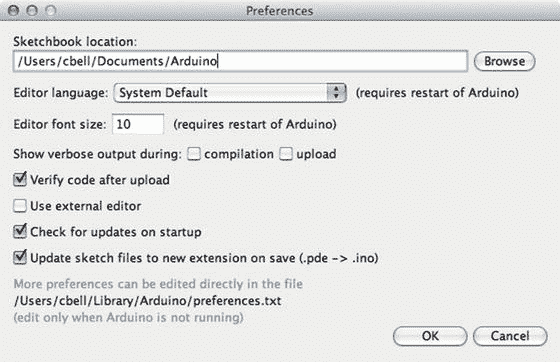

图 6-13。

Arduino Preferences dialog Tip

如果您在 Arduino 应用运行时将一个库复制到您的`Libraries`文件夹，您必须重新启动它以检测新的库。

既然已经安装了连接器/Arduino 库，就可以开始编写支持数据库的草图了！在进入库源代码之前，让我们首先检查一下使用库的一些限制。

Wait! I Have Version 1.0\. Can’T I Use That?

如果您已经发现了 Connector/Arduino 库，并且一直在使用 1.0.4 或更早的版本，您将需要升级到较新的版本才能使用本书中的示例。这是因为在 1.1 版本中做了很多改变，使得它与旧版本不兼容。

但不要绝望，因为旧版本仍在 Launchpad 中，并将在那里保留一段时间。最重要的是，新版本不会与您现有的任何草图产生冲突。也就是说，您现有的草图不会受到安装新库的影响。

然而，如果你想在你现有的草图中使用最新的版本，你将不得不改变一些东西。请参阅位于库源代码的 extras 文件夹中的参考手册中的“对以前版本的更改”。

#### 使用连接器/Arduino

让我们从一个简单的草图开始，这个草图设计用来在 MySQL 的一个表中插入一行。你在创造一个“你好，世界！”草图(但保存在数据库表中)。所有支持数据库的草图共享相同的公共构建块。这些包括设置要使用的数据库、使用一组特定的包含文件创建草图、连接到数据库服务器以及执行查询。本节将介绍创建和执行启用数据库的草图所需的基本步骤。

Tip

该库包括许多示例草图，可帮助您快速入门。在你探索掌握库的过程中检查例子。你会发现如何使用 WiFi 连接，甚至如何从草图中的变量构建复杂查询的例子。

您首先需要的是一台数据库服务器！首先创建一个数据库和一个表来存储数据。在这个实验中，您创建一个简单的表，它有两列:一个文本列(`char`)用于存储消息，一个`TIMESTAMP`列用于记录保存行的日期和时间。我发现`TIMESTAMP`数据类型是存储传感器数据的绝佳选择。您很少会不想知道样本是何时采集的！最重要的是，MySQL 使它易于使用。事实上，您只需要向服务器传递一个令牌`NULL`值，它自己生成并存储当前时间戳。

清单 [6-4](#FPar40) 显示了一个 MySQL 客户端(名为`mysql`)会话，它创建数据库和表，并手动向表中插入一行。草图将从您的 Arduino 执行一个类似的`INSERT`语句。通过发出一个`SELECT`命令，你可以看到每次表被更新。

Listing 6-4.Creating the Test Database

`$ mysql -uroot -psecret`

`Welcome to the MySQL monitor.  Commands end with ; or \g.`

`Your MySQL connection id is 102`

`Server version: 5.6.14-log Source distribution`

`Copyright (c) 2000, 2011, Oracle and/or its affiliates. All rights reserved.`

`Oracle is a registered trademark of Oracle Corporation and/or its`

`affiliates. Other names may be trademarks of their respective`

`owners.`

`Type 'help;' or '\h' for help. Type '\c' to clear the current input statement.`

`mysql> CREATE DATABASE test_arduino;`

`Query OK, 1 row affected (0.00 sec)`

`mysql> USE test_arduino;`

`Database changed`

`mysql> CREATE TABLE hello (source char(20), event_date timestamp);`

`Query OK, 0 rows affected (0.01 sec)`

`mysql> GRANT ALL ON *.* to 'root'@'%' IDENTIFIED BY 'secret'`

`mysql> INSERT INTO hello VALUES ('From Laptop', NULL);`

`Query OK, 1 row affected (0.00 sec)`

`mysql> SELECT * FROM hello;`

`+-------------+---------------------+`

`| source      | event_date          |`

`+-------------+---------------------+`

`| From Laptop | 2013-02-16 20:40:12 |`

`+-------------+---------------------+`

`1 row in set (0.00 sec)`

`mysql>`

#### 开始新的草图

是时候开始写你的草图了。打开你的 Arduino 环境，创建一个名为`hello_mysql`的新草图。以下部分详细介绍了一个典型的支持 MySQL 数据库的草图的各个部分。您从所需的包含文件开始。

##### 包括文件

要使用连接器/Arduino 库，请记住它需要一个以太网屏蔽，因此需要以太网库。连接器/Arduino 库需要使用`MySQL_Connection`库进行连接，使用`MySQL_Cursor`库进行查询。因此，您必须按顺序包括其中的每一项。下面显示了一个支持 MySQL 数据库的草图至少需要包含的所有库头文件。现在开始输入这些。

`#include <Ethernet.h>`

`#include <MySQL_Connection.h>`

`#include <MySQL_Cursor.h>`

##### 初步设置

设置好包含文件后，接下来必须处理一些初步声明。这些包括对以太网库和连接器/Arduino 的声明。

以太网库要求您设置服务器的 MAC 地址和 IP 地址。MAC 地址是一串十六进制数字，不需要任何特殊的东西，但是它在网络上的机器中应该是唯一的。它使用动态主机控制协议(DHCP)来获取 IP 地址、DNS 和网关信息。服务器的 IP 地址是使用`IPAddress`类定义的(正如您所期望的，它将值存储为一个由四个整数组成的数组)。

另一方面，以太网类也允许您为 Arduino 提供一个 IP 地址。如果您为 Arduino 分配 IP 地址，该地址对于它所连接的网段必须是唯一的。请务必使用 IP 扫描仪，以确保您选择的 IP 地址尚未被使用。

下面显示了 10.0.1.X 网络中节点的这些语句:

`/* Setup for Ethernet Library */`

`byte mac_addr[] = { 0xDE, 0xAD, 0xBE, 0xEF, 0xFE, 0xED };`

`IPAddress server_addr(10, 0, 1, 23);`

接下来，您需要为 Connector/Arduino 设置一些变量。您需要定义对连接类的引用。我们稍后动态分配 cursor 类，以便更好地管理内存。连接类需要一个参数，该参数是`Ethernet.Client`类的实例。如果你使用 Arduino 以太网屏蔽，你可以简单地使用`EthernetClient`类。如果您使用另一个库或 WiFi 盾，您将使用适当的客户端。例如，将 WiFiClient 用于 Arduino WiFi 盾。

您还需要一些字符串用于草图中使用的数据。至少包括一个用户 ID 字符串、一个密码字符串和一个您使用的查询字符串。最后一个字符串是可选的，因为您可以在查询调用中直接使用文字字符串，但是为查询语句生成字符串是一个很好的实践。这也是使查询参数化以便重用的最佳方式。

以下是完成草图声明所需的语句示例:

`/* Setup for the Connector/Arduino */`

`EthernetClient client;`

`MySQL_Connection conn((Client *)&client);`

`char user[] = "root";`

`char password[] = "secret";`

`char INSERT_SQL[] = "INSERT INTO test_arduino.hello VALUES ('Hello from Arduino!', NULL)";`

请注意`INSERT`语句。您包括一个字符串来表明您正在从您的 Arduino 运行查询。您还包括了`NULL`值，这样服务器将为该行创建时间戳，如前面的手动执行所示。

##### 连接到 MySQL 服务器

预备工作到此结束；让我们写点代码吧！接下来，更改`setup()`方法。这是应该放置连接到 MySQL 服务器的代码的地方。回想一下，每次 Arduino 启动时，这个方法只被调用一次。下面显示了所需的代码:

`void setup() {`

`Ethernet.begin(mac_addr);`

`Serial.begin(115200);`

`while (!Serial);`

`delay(1000);`

`Serial.println("Connecting...");`

`if (conn.connect(server_addr, 3306, user, password))`

`delay(500);`

`else`

`Serial.println("Connection failed.");`

`}`

代码首先调用以太网库来初始化网络连接。回想一下，当您使用`Ethernet.begin()`方法时，只传递 MAC 地址，如示例所示，这会导致以太网库使用 DHCP 来获取 IP 地址。如果您想手动分配 IP 地址，请参见 [`http://arduino.cc/en/Reference/EthernetBegin`](http://arduino.cc/en/Reference/EthernetBegin) 中的`Ethernet.begin()`方法文档。

接下来是对串行监控器的调用。虽然不完全必要，但是包含它是一个好主意，这样您就可以看到由 Connector/Arduino 编写的消息。如果您在连接或运行查询时遇到问题，请确保使用串行监控器，以便可以看到库发送的消息。

现在调用`delay()`方法。您发出一秒钟的等待命令，以确保您有时间启动串行监控器，并且不会错过调试语句。如果您需要更多时间来启动串行监控器，请随意尝试更改该值。

延迟之后，您向串行监控器打印一条语句，表明您正在尝试连接到服务器。连接到服务器是对名为`connect()`的连接器/Arduino 库的一次调用。您传递 MySQL 数据库服务器的 IP 地址、服务器监听的端口以及用户名和密码。如果这个调用通过，代码将进入下一个`delay()`方法调用。

在发出额外的 MySQL 命令之前，需要这种延迟来减缓执行速度。与前面的延迟一样，根据您的硬件和网络延迟，您可能不需要此延迟。如果您强烈反对使用延迟来避免延迟问题，您应该进行试验。另一方面，如果连接失败，代码会通过 print 语句告诉您连接已经失败。

##### 运行查询

现在是运行查询的时候了。我们首先实例化一个`MySQL_Cursor`类的实例，并传入连接实例。这将动态地分配类(想想代码)。然后我们调用`execute()`方法，并传入我们想要运行的查询。由于没有返回结果(因为我们正在运行一个`INSERT`，我们可以关闭连接并删除实例。下面按顺序显示了所有这些步骤。

将这段代码放在成功连接后执行的分支中。下面显示了前面重写的条件语句，其中包含了运行插入查询的方法调用:

`if (conn.connect(server_addr, 3306, user, password))`

`{`

`delay(500);`

`/* Write Hello to MySQL table test_arduino.hello */`

`// Create an instance of the cursor passing in the connection`

`MySQL_Cursor *cur = new MySQL_Cursor(&conn);`

`cur->execute(INSERT_SQL);`

`delete cur;`

`}`

`else`

`Serial.println("Connection failed.");`

`}`

请注意，您只需调用一个名为`execute()`的方法，并向其传递您之前定义的查询。是的，就是这么简单！

##### 测试草图

现在，除了`loop()`方法之外，您已经拥有了完成草图所需的所有代码。在这种情况下，您让它成为一个空方法，因为您没有做任何重复的事情。清单 [6-5](#FPar42) 显示了完成的草图。

Tip

如果您在让连接器工作时遇到问题，请参见 MySQL 连接器参考手册 [15](#Fn15) 中的“连接器/Arduino 故障排除”部分，然后返回到这个项目。

Listing 6-5.“Hello, MySQL!” Sketch

`/**`

`* Example: Hello, MySQL!`

`*`

`* This code module demonstrates how to create a simple database-enabled`

`* sketch.`

`*/`

`#include <Ethernet.h>`

`#include <MySQL_Connection.h>`

`#include <MySQL_Cursor.h>`

`/* Setup for Ethernet Library */`

`byte mac_addr[] = { 0xDE, 0xAD, 0xBE, 0xEF, 0xFE, 0xED };`

`IPAddress server_addr(10, 0, 1, 23);   // The IP address of your database server`

`/* Setup for the Connector/Arduino */`

`EthernetClient client;`

`MySQL_Connection conn((Client *)&client);`

`char user[] = "root";`

`char password[] = "secret";`

`char INSERT_SQL[] = "INSERT INTO test_arduino.hello VALUES ('Hello from Arduino!', NULL)";`

`void setup() {`

`Ethernet.begin(mac_addr);`

`Serial.begin(115200);`

`while (!Serial);`

`Serial.println("Connecting...");`

`if (conn.connect(server_addr, 3306, user, password))`

`{`

`delay(500);`

`/* Write Hello, World to MySQL table test_arduino.hello */`

`// Initiate the query class instance`

`MySQL_Cursor *cur_mem = new MySQL_Cursor(&conn);`

`// Execute the query`

`cur_mem->execute(INSERT_SQL);`

`delete cur_mem;`

`Serial.println("Query Success!");`

`}`

`else`

`Serial.println("Connection failed.");`

`}`

`void loop() {`

`}`

在您点击按钮编译和上传草图之前，让我们讨论一下可能出现的几个错误。如果 MySQL 服务器的 IP 地址或用户名和密码错误，您可能会在串行监控器中看到如图 [6-14](#Fig14) 所示的连接失败。

图 6-14。

Failed connection

如果您的 Arduino 连接到 MySQL 服务器，但查询失败，您会在串行监控器中看到如图 [6-15](#Fig15) 所示的错误。

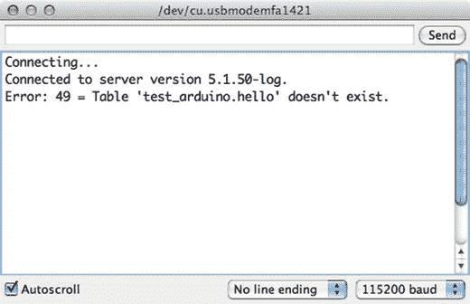

图 6-15。

Failed query

请务必仔细检查您的 MySQL 服务器的源代码和 IP 地址，以及选择的用户名和密码。如果您在连接时仍然遇到问题，请参见 MySQL 连接器参考手册 [16](#Fn16) 中的“连接器/Arduino 故障排除”一节，了解确保您的 MySQL 服务器配置正确的测试内容列表。

仔细检查服务器安装和草图中的信息后，编译草图并上传到 Arduino。然后启动串口监控器，观察连接 MySQL 服务器的过程。图 [6-16](#Fig16) 显示了代码的完整和成功执行。

图 6-16。

Correct serial monitor output Note

在例子中，我连接到一个旧版本的 MySQL，它安装在我的 BeagleBone Black board 上。该草图将连接到 MySQL 5.0 及更高版本的任何版本。

哇，是这个吗？不是很有趣，是吗？如果你在你的串行监控器中看到如图 [6-16](#Fig16) 所示的语句，请放心 Arduino 已经连接到 MySQL 服务器并向其发出查询。要进行检查，只需返回到`mysql`客户机并在表上发出 select。但是首先，多次运行草图，在表中发布几个插入。

有两种方法可以做到这一点。首先，你可以在你的 Arduino 上按下`RESET`。如果让串行监控器运行，Arduino 会按顺序显示消息，如图 [6-17](#Fig17) 所示。第二，可以再次上传草图。在这种情况下，串行监控器关闭，您必须重新打开它。这种方法的优点是每次都可以更改查询语句，从而将不同的行插入到数据库中。现在继续尝试，并检查您的数据库的变化。

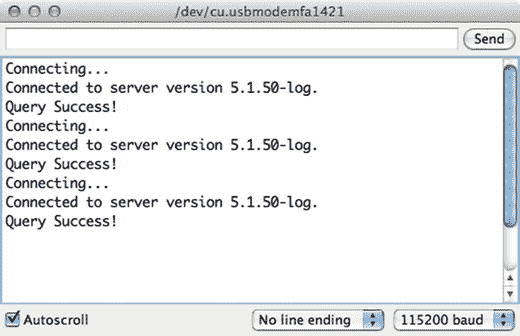

图 6-17。

Results of running the sketch several times

让我们检查一下试运行的结果。为此，您使用`mysql`客户机连接到数据库服务器，并发出一个`SELECT`查询。清单 [6-6](#FPar44) 显示了示例中三次运行的结果。注意每次运行的不同时间戳。正如你所看到的，我运行了一次，然后等了几分钟又运行了一次(我用了我的 Arduino 以太网盾上的`RESET`按钮)，然后马上又运行了一次。很酷，不是吗？

Listing 6-6.Verifying the Connection with the Serial Monitor

`$ mysql -uroot -psecret`

`Welcome to the MySQL monitor.  Commands end with ; or \g.`

`Your MySQL connection id is 33`

`Server version: 5.6.14-log Source distribution`

`Copyright (c) 2000, 2010, Oracle and/or its affiliates. All rights reserved.`

`This software comes with ABSOLUTELY NO WARRANTY. This is free software,`

`and you are welcome to modify and redistribute it under the GPL v2 license`

`Type 'help;' or '\h' for help. Type '\c' to clear the current input statement.`

`mysql> select * from test_arduino.hello;`

`+---------------------+---------------------+`

`| source              | event_date          |`

`+---------------------+---------------------+`

`| From laptop         | 2013-02-19 15:17:38 |`

`| Hello from Arduino! | 2013-02-19 15:18:12 |`

`| Hello from Arduino! | 2013-02-19 15:28:``3`T2】

`| Hello from Arduino! | 2013-02-19 15:29:16 |`

`+---------------------+---------------------+`

`4 rows in set (0.01 sec)`

`mysql>`

除了这里显示的，您还可以使用连接器做更多的事情。事实上，您可以向数据库服务器查询查找数据；发现变量的值；创建数据库、表、视图。等等。在合理的范围内，你可以做任何你想做的事情。向数据库服务器查询大量行或大数据行可能会超出 Arduino 的内存限制。幸运的是，你将要写的大部分草图将会用简单的`INSERT`语句保存数据。

Tip

您可以在位于`extras`文件夹中的连接器/Arduino 参考手册中找到更多如何使用连接器的示例。该文件被命名为`MySQL_Connector_Arduino_Reference_Manual.pdf`。

既然您已经看到了 Arduino 连接器，让我们来看一个更通用的连接器，一个您可以在您的笔记本电脑、台式机、低成本计算机、嵌入式系统等等上使用的连接器，任何可以运行 Python 的东西都可以写入 MySQL 数据库！

### 连接器/Python 简介

Oracle 的 Python 连接器是一个全功能连接器，为 Python 应用和脚本提供了到 MySQL 数据库服务器的连接。最新版本是 release-2.1.3GA，与 Connector/Arduino 不同的是，Connector/Python 得到了 Oracle 的全面支持和积极维护。

Connector/Python 特性支持从版本 4.1 和更新版本开始的所有当前 MySQL 服务器版本。编写它是为了提供 Python 和 MySQL 之间的自动数据类型转换，使构建查询和解密结果变得容易。它还支持压缩，允许通过 SSL 连接，并支持所有 MySQL SQL 命令。当前版本 2.1.3 增加了 C 库以提高性能。

在 Python 脚本中使用 Connector/Python 包括导入基本模块、启动连接和使用游标执行查询，这与 Connector/Arduino 类似。这并不奇怪，因为我是用 Connector/Python 作为模型编写 Connector/Arduino 的。

然而，与 Connector/Arduino 不同，Connector/Python 没有这样的内存限制，允许您完成大量的处理。事实上，我会将大部分字符串、日期和数学处理转移到 Python 脚本中，而不是在 Arduino 上尝试。

在我们开始讨论如何使用 Connector/Python 编写一些支持 MySQL 数据库的应用之前，我们先来讨论一下如何获得和安装 Connector/Python。

Python? Isn’t That a Snake?

Python 编程语言是一种高级语言，旨在尽可能接近阅读英语，同时简单、易学且功能强大。皮托尼斯塔斯 [17](#Fn17) 会告诉你设计师们确实达到了这些目标。

Python 在使用前不需要编译步骤。相反，Python 应用(其文件名以`.py`结尾)是动态解释的。这是非常强大的，但是除非您使用包含自动语法检查器的 Python 集成开发环境(IDE ),否则在执行应用之前不会发现一些语法错误。幸运的是，Python 提供了一个健壮的异常处理机制，可以传达出哪里出错了。

如果您从未使用过 Python，或者您想了解更多，下面是几本介绍这种语言的好书。互联网上也有很多资源，包括位于 [`www.python.org/doc/`](http://www.python.org/doc/) 的 Python 文档页面。

*   西蒙·蒙克(McGraw-Hill，2013 年)的《树莓派编程》
*   马格努斯·李·赫特兰德的《从新手到专业人员的 Python 入门》，第二版(2008 年出版)
*   David Beazley 和 Brian K. Jones 的 Python 食谱(O'Reilly Media，2013 年)

有趣的是，Python 是以英国喜剧团 Monty Python 而不是爬行动物命名的。当你学习 Python 的时候，你可能会遇到对 Monty Python 剧集的无聊引用。我对巨蟒小组情有独钟，觉得这些参考资料很有趣。当然，您的里程可能会有所不同。

#### 安装连接器/Python

下载过程与您在服务器上发现的过程相同。可以从 Oracle 的 MySQL 网站( [`http://dev.mysql.com/downloads/connector/python/`](http://dev.mysql.com/downloads/connector/python/) )下载 Connector/Python。该页面将自动检测您的平台，并显示适用于您平台的可用下载。你可能会看到几个选择。请确保选择与您的配置相匹配的选项。

##### 在台式机/笔记本电脑平台上安装

因为大多数平台都安装了 Python，所以您可能不需要做任何准备工作来准备您的系统；只需下载安装程序并安装即可。您可以在产品下载页面( [`http://dev.mysql.com/downloads/connector/python/`](http://dev.mysql.com/downloads/connector/python/) )找到最新的 Python 安装程序。请注意，Connector/Python 需要 Python 2.7(推荐)或 Python 3.3。

图 [6-18](#Fig18) 显示了 Ubuntu 平台的典型下载页面。如果您的平台未列出，请使用下拉框选择不同的平台。但是，如果您使用的平台(如 Windows)不包含 Python，您应该首先安装 Python。

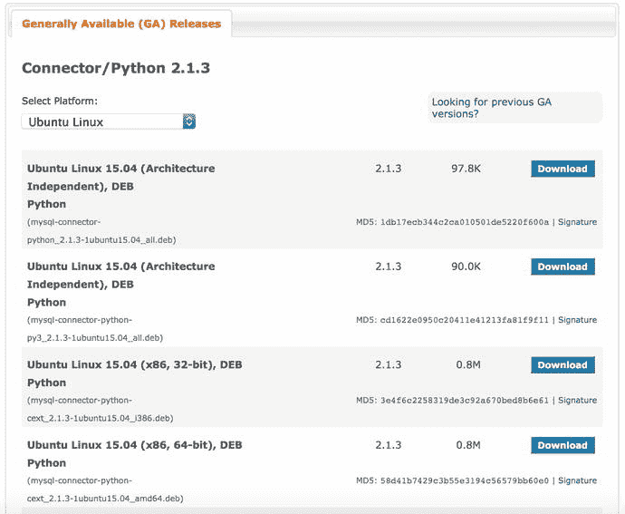

图 6-18。

Connector/Python download page

正如我提到的，Connector/Python 的当前版本是 2.1.3，但是大多数版本 2.0 或更高版本应该适合您的解决方案。最新版本增加了高可用性功能，可用于名为 MySQL Fabric 的企业级高可用性解决方案。任何 2.0 或 2.1 版本都可以用于 IOT 解决方案。

Tip

关于在某些平台上安装的具体注意事项，请参见在线参考手册( [`http://dev.mysql.com/doc/connector-python/en/connector-python-installation.html`](http://dev.mysql.com/doc/connector-python/en/connector-python-installation.html) )。

##### 在低成本平台上安装

在较小的平台上安装 Connector/Python 要复杂一些，但不会太复杂。简而言之，您通过使用平台的打包机制(`apt-get`、`opkg`等等)来安装 Connector/Python。下面展示了如何使用 Raspbian Jessie 在 Raspberry Pi 上安装 Connector/Python。其他平台也差不多。

`$ sudo pip3 install mysql-connector-python --allow-external mysql-connector-python`

`Downloading/unpacking mysql-connector-python`

`mysql-connector-python an externally hosted file and may be unreliable`

`Downloading mysql-connector-python-2.0.4.zip (277kB): 277kB downloaded`

`Running setup.py (path:/tmp/pip-build-mm9szi9x/mysql-connector-python/setup.py) egg_info for package mysql-connector-python`

`Installing collected packages: mysql-connector-python`

`Running setup.py install for mysql-connector-python`

`Successfully installed mysql-connector-python`

`Cleaning up...`

注意，我使用 Python 包管理器(来自 PyPi)来获取和安装连接器。这将安装一个旧版本的连接器，但它功能齐全，将满足您的 IOT 解决方案的需要。

##### 检查安装

一旦安装了 Connector/Python，您可以使用下面的简短示例来验证它是否正常工作。通过输入命令`python`开始。这将打开一个交互式提示，允许您一次输入一行 Python 代码并执行它；这是一个 Python 命令行解释器，在测试小代码片段时非常有用。只需输入以下几行，如示例所示:

`$ python`

`Python 2.7.6 (default, Mar  4 2014, 16:53:21)`

`[GCC 4.2.1 Compatible Apple LLVM 5.0 (clang-500.2.79)] on darwin`

`Type "help", "copyright", "credits" or "license" for more information.`

`>>> import mysql.connector`

`>>> print mysql.connector.__version__`

`2.1.3`

`>>> quit()`

您应该看到的是打印的连接器/Python 版本。如果您看到任何关于找不到连接器的错误，请务必检查您的安装以确保它正常工作。一旦您成功地访问了 Connector/Python，您就可以继续看一些例子了。

Tip

如果安装了多个 Python 版本，并且在不同于默认版本的 Python 版本下安装了 Connector/Python，请使用特定于版本的 Python 可执行文件。例如，如果您在 Python3 下安装了 Connector/Python，但是 Python2.7 是默认的，那么使用命令`python3`来启动解释器。否则，您可能会在导入时看到错误。

#### 使用连接器/Python

让我们从一个简单的例子开始，我们连接到 MySQL 服务器并获得一个数据库列表。在这种情况下，我们首先导入连接器/Python `connector`类，然后调用`connect()`方法连接到服务器。为了保持整洁，我们使用字典来存储连接信息。确保您的 MySQL 服务器正在运行，并更改以下示例以匹配您的设置。例如，为服务器提供正确的密码和主机名。

`$ python`

`Python 2.7.6 (default, Mar  4 2014, 16:53:21)`

`[GCC 4.2.1 Compatible Apple LLVM 5.0 (clang-500.2.79)] on darwin`

`Type "help", "copyright", "credits" or "license" for more information.`

`>>> import mysql.connector`

`>>> server = {`

`...   'user': 'root',`

`...   'password': <secret>,`

`...   'host': '127.0.0.1',`

`...   'database': 'employees',`

`...   'raise_on_warnings': True,`

`... }`

`>>> cnx = mysql.connector.connect(**server)`

如果此时出现错误，请返回并检查您的连接参数。很有可能是您的 MySQL 服务器不可访问、已关闭或者您指定了错误的凭据。如果您没有收到交互式解释器的响应，那也没关系——您已经连接好了，可以开始了！

现在，让解释器运行并添加以下语句。这里我们将打开一个游标对象来执行查询和检索行。我用一种简单的方式编写了这个循环，向您展示了如何遍历所有可用的行(还有其他几种有效的方式来编写这个位)。

`>>> cur = cnx.cursor()`

`>>> cur.execute("SHOW DATABASES")`

`>>> rows = cur.fetchall()`

`>>> for row in rows:`

`...     print row`

`...`

当您得到`...`(这是一个提示)时，按 Enter 并观察结果，如下所示。根据服务器上的数据库，您的列表可能会略有不同。

`(u'arduino',)`

`(u'employees',)`

`(u'library',)`

`(u'mysql',)`

`(u'performance_schema',)`

`(u'plant_monitoring',)`

`(u'test',)`

`(u'test_arduino',)`

`(u'world',)`

`(u'world_innodb',)`

但我们还没完。还需要两步。我们需要关闭光标和连接，然后退出解释器。

`>>> cur.close()`

`True`

`>>> cnx.close()`

`>>> quit()`

恭喜你！您已经编写了第一个支持 MySQL 的 Python 脚本。现在我们知道了基础知识，让我们继续使用源文件而不是交互式解释器来编写更强大的脚本。

大多数 Python 脚本(应用)都是使用名为`<something>.py`的文件构建的，并从命令行执行，如下所示。我们将使用这个方法来执行下面的例子。因此，对于每个示例，您应该打开一个文件并输入如下所示的文本。

`$ python my_script.py`

现在让我们看看如何在表格中插入一些数据。在这种情况下，我们只想从文件中读取数据，并将其插入到表中。我会让你发挥你的想象力，你如何可以改变文件读取传感器。事实上，我将在后面的章节中向您展示如何做到这一点。

Note

工作台布局参见第 5 章[。如果您执行了来自](5.html)[第 5 章](5.html)的示例，请确保清空该表，这样您可以在运行该示例时避免键违规。

打开您最喜欢的文本编辑器，输入清单 [6-7](#FPar50) 中所示的代码。用名称`simple_insert.py`保存文件。

Listing 6-7.Inserting Data with Connector/Python

`import mysql.connector`

`server = {`

`'user': 'root',`

`'password': <secret>,`

`'host': '127.0.0.1',`

`'database': 'employees',`

`'raise_on_warnings': True,`

`}`

`cnx = mysql.connector.connect(**server)`

`cur = cnx.cursor()`

`# read rows from a file for inserting into plant_monitor table`

`f = open("plants_data.txt")`

`lines = f.readlines()`

`f.close()`

`# now insert the data`

`for line in lines:`

`cols = line.strip('\n').split(",") # comma-separated row`

`query = "INSERT INTO plant_monitoring.plants (name, location, climate)" \`

`" VALUES ('{0}','{1}',{2});".format(cols[0], cols[1], cols[2])`

`print query`

`cur.execute(query)`

`cnx.commit()`

`cur.close()`

`cnx.close()`

这里我们看到与上一个例子相同的启动代码，只是这次我们从一个文件中读取值，并对每个值执行一个`INSERT` SQL 语句。花点时间研究一下代码及其工作原理。注意，它使用了字符串替换。

注意粗体的那一行。该命令对于确保将行写入表中是必要的。更具体地说，因为我使用了事务存储引擎，并且我的服务器是为事务设置的，所以在我显式提交更改之前，不会写入任何数据。您的服务器可能会有不同的设置，但是在这里添加这个命令没有坏处。您也可以将它添加到循环内部，但是最好将您的提交推到最新的代码块，在这种情况下，它在循环外部。

我们正在阅读的文件只有几行，是第五章中工厂监控系统示例的模型。清单 [6-8](#FPar51) 显示了文件内容。注意，我把它标为`plants_data.txt`。如果更改文件名，请确保相应地更改代码。

Listing 6-8.Sample Data

`Jerusalem Cherry,deck,2`

`Moses in the Cradle,patio,2`

`Peace Lilly,porch,1`

`Thanksgiving Cactus,porch,1`

`African Violet,porch,1`

要运行该脚本，请从存储文件的文件夹中发出以下命令。确保首先将数据文件放在同一个文件夹中。我展示了运行脚本的结果。

`$ python ./simple_insert.py`

`INSERT INTO plant_monitoring.plants (name, location, climate) VALUES ('Jerusalem Cherry','deck',2);`

`INSERT INTO plant_monitoring.plants (name, location, climate) VALUES ('Moses in the Cradle','patio',2);`

`INSERT INTO plant_monitoring.plants (name, location, climate) VALUES ('Peace Lilly','porch',1);`

`INSERT INTO plant_monitoring.plants (name, location, climate) VALUES ('Thanksgiving Cactus','porch',1);`

`INSERT INTO plant_monitoring.plants (name, location, climate) VALUES ('African Violet','porch',1);`

现在让我们检查一下我们的桌子。如果我们从一个空表开始，我们应该看到以下内容:

`mysql> SELECT * FROM plant_monitoring.plants;`

`+----+---------------------+----------+---------+`

`| id | name                | location | climate |`

`+----+---------------------+----------+---------+`

`| 30 | Jerusalem Cherry    | deck     | outside |`

`| 31 | Moses in the Cradle | patio    | outside |`

`| 32 | Peace Lilly         | porch    | inside  |`

`| 33 | Thanksgiving Cactus | porch    | inside  |`

`| 34 | African Violet      | porch    | inside  |`

`+----+---------------------+----------+---------+`

`5 rows in set (0.00 sec)`

除了这里显示的，您还可以使用连接器做更多的事情。事实上，你可以做任何你想做的事情。通常，我使用 Python 脚本在我的数据库和数据库服务器上执行复杂的操作。例如，我可以编写一个脚本来设置我所有的数据库、表、函数等等，这样我就可以在任何我想要的服务器上重新加载一个测试或者开始一个实验；我只是提供不同的连接参数并运行它。

Mysql Utilities: Python-Based Database Administration

如果您是一名 Python 开发者，并且发现自己越来越多地使用 MySQL，尤其是当您发现自己处于管理员的角色时，您可能想看看 Oracle 的 MySQL 实用程序。MySQL Utilities 是一组用于管理 MySQL 服务器的 Python 脚本和 Python 库。您可以做各种各样的事情，从复制用户权限到克隆服务器到发现两个数据库之间的差异。详见 [`http://dev.mysql.com/downloads/utilities/`](http://dev.mysql.com/downloads/utilities/) 。

您可能还想编写复杂的 Python 脚本来处理来自传感器或 IOT 数据收集器的数据。也就是说，您可以使用 Raspberry Pi 作为数据聚合器来准备存储数据。你甚至可以使用 Python 应用直接从 Raspberry Pi 读取传感器，正如我在我的书`Beginning Sensor Networks with Arduino and Raspberry Pi` (Apress，2014)中演示的那样。

对于包括执行事务、创建表和运行复杂查询在内的更复杂的示例，请参见 Connector/Python 在线参考手册中的编码示例部分( [`http://dev.mysql.com/doc/connector-python/en/connector-python-examples.html`](http://dev.mysql.com/doc/connector-python/en/connector-python-examples.html) )。

## 摘要

本章介绍了 MySQL，并向您提供了一个关于如何设置 Raspberry Pi、安装 MySQL 和使用它的速成课程。您还学习了如何使用 Arduino 草图和另一台机器上的 Python 程序(Raspberry Pi、BeagleBone Black、pcDuino 等)将数据写入数据库服务器。

虽然它没有高可用性、五个九正常运行时间(99.999%)数据库服务器的复杂性，但带有附加 USB 硬盘驱动器的低成本 Raspberry Pi 是一个占用空间非常小的数据库服务器，可以放在任何地方。这很好，因为 IOT 解决方案本质上(通常是必然的)需要小而低的成本。必须构建一个昂贵的数据库服务器通常不是所期望的投资水平。

在下一章，我们将探讨一个高级主题:高可用性。更具体地说，我们将看到如何通过提供冗余以及跨多个数据库节点分离读取(`SELECT`)和写入(`INSERT`、`UPDATE`、`DELETE`)的能力来使我们的数据库服务器更加可靠。

Footnotes [1](#Fn1_source)

但可以接受基于 USB 的记忆棒和硬盘。

  [2](#Fn2_source)

Micro Secure Digital (micro SD):一种小型可移动存储驱动器。 [`http://en.wikipedia.org/wiki/Secure_Digital`见](http://en.wikipedia.org/wiki/Secure_Digital)。

  [3](#Fn3_source)

我的母校也经历了类似的转变。我哀悼知识的丧失。

  [4](#Fn4_source)

我的第一台真正的电脑是 IBM PCjr。随后，我在 computer 公司制造了自己的 IBM 个人电脑，配有一个 10MB 的硬盘。啊，那是个人电脑的光辉岁月！

  [5](#Fn5_source)

像你的沙发、最喜欢的躺椅、露台、咖啡吧等地方。

  [6](#Fn6_source)

确保选择支持设备感应的电缆。如果连接 Raspberry Pi 时，您的 Lapdock 不通电，很可能是 HDMI 电缆的问题。尝试另一根电缆。

  [7](#Fn7_source)

在向朋友或配偶“借”电缆之前，一定要获得许可——当你完成修改后，它就不能作为标准电缆使用了。

  [8](#Fn8_source)

不要和 noob 混为一谈，有点贬义。 [`https://en.wiktionary.org/wiki/noob`见](https://en.wiktionary.org/wiki/noob)。

  [9](#Fn9_source)

操作系统是免费的。你只是为某人为你格式化并安装在卡上的图像的便利而付费。

  [10](#Fn10_source)

他们走得如此之快；反正你也不可能看懂。基本上，除非有错误，否则它们就是噪音，并且通常出现在显示的最后几行中。

  [11](#Fn11_source)

Raspberry Pi 图像是用`fbgrab`生成的。可以用`sudo apt-get install fbgrab`安装。

  [12](#Fn12_source)

`vi`是什么意思？如果您曾经有幸第一次尝试学习它，您可能会认为它意味着“几乎不可能”，因为命令很简洁(根据设计)，很难记住。不过说真的，`vi`是`vim`或者`Vi Improved`文字编辑器的简称。这个名字表明最初的编辑器很可能已经被`completely`不可能使用了！

  [13](#Fn13_source)

一个高度技术性的术语，指计算机没有做你认为它们应该做的事情。

  [14](#Fn14_source)

[T2`http://alextgalileo.altervista.org/package-repo-configuration-instructions.html`](http://alextgalileo.altervista.org/package-repo-configuration-instructions.html)

  [15](#Fn15_source)

[T2`https://github.com/ChuckBell/MySQL_Connector_Arduino/blob/master/extras/MySQL_Connector_Arduino_Reference_Manual.pdf`](https://github.com/ChuckBell/MySQL_Connector_Arduino/blob/master/extras/MySQL_Connector_Arduino_Reference_Manual.pdf)

  [16](#Fn16_source)

[T2`https://github.com/ChuckBell/MySQL_Connector_Arduino/blob/master/extras/MySQL_Connector_Arduino_Reference_Manual.pdf`](https://github.com/ChuckBell/MySQL_Connector_Arduino/blob/master/extras/MySQL_Connector_Arduino_Reference_Manual.pdf)

  [17](#Fn17_source)

Python 专家经常用这个术语来称呼自己。它是为最狂热和最有经验的 Python 程序员保留的。