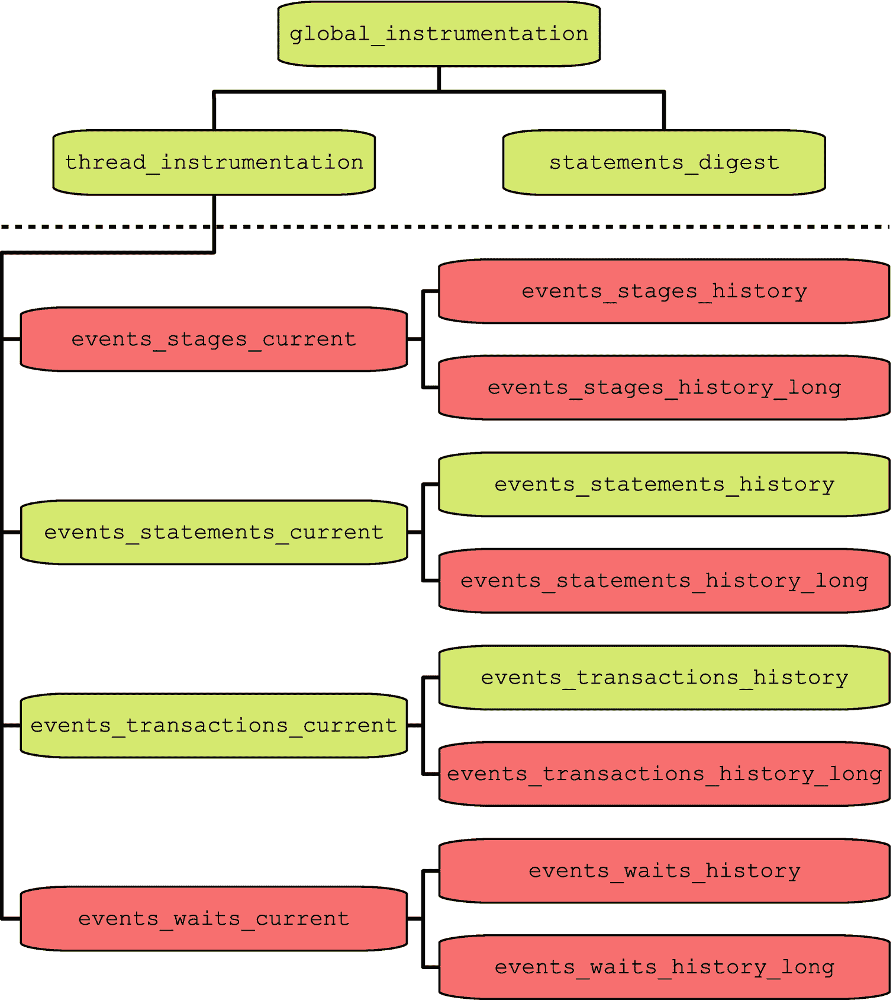
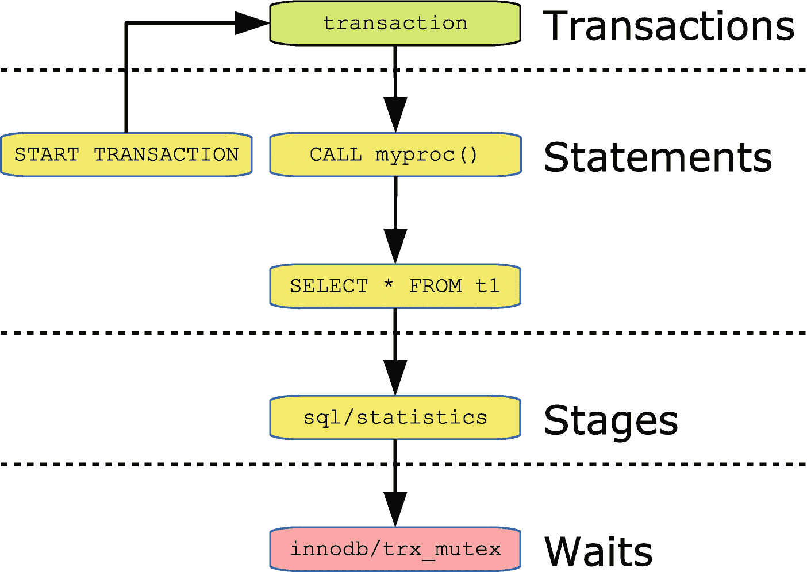

# 5.性能模式

性能模式是 MySQL 中与性能相关的诊断信息的主要来源。它最初是在 MySQL 5.5 版本中引入的，然后在 5.6 版本中被大量修改为当前的结构，此后在 5.7 和 8 版本中逐渐得到改进。

本章介绍并概述了性能模式，因此在本书的其余部分使用性能模式时，它是如何工作的就很清楚了。与性能模式密切相关的是将在下一章讨论的 sys 模式和第 7 章的主题信息模式。

本章讨论了性能模式特有的概念，特别关注线程、工具、使用者、事件、摘要和动态配置。但是，首先有必要熟悉性能模式中使用的术语。

## 术语

在学习一门新学科时，术语是很难的事情之一，性能模式也不例外。由于术语之间几乎是循环关系，所以没有明确的顺序来描述它们。相反，本节将提供本章中使用的最重要术语的简要概述，以便您了解这些术语的含义。到本章结束时，你应该能更好地理解这些概念的含义以及它们之间的关系。

表 [5-1](#Tab1) 总结了性能模式中最重要的术语。

表 5-1

MySQL 性能模式术语

<colgroup><col class="tcol1 align-left"> <col class="tcol2 align-left"></colgroup> 
| 

学期

 | 

描述

 |
| --- | --- |
| 行动者 | 用户名和主机名的组合(帐户)。 |
| 消费者 | 收集由*仪器*产生的数据的过程。 |
| 摘要 | 规范化查询的校验和。摘要用于聚集相似查询的统计数据。 |
| 动态配置 | 性能模式可以在运行时配置，这称为动态配置。这是通过*设置表*完成的，而不是通过改变系统变量。 |
| 事件 | 事件是由*消费者*从*仪器*收集数据而产生的。因此，一个事件包含度量和关于度量在何时何地被收集的信息。 |
| 工具 | 进行测量的代码点。 |
| 目标 | 表、事件、函数、过程或触发器。 |
| 设置表 | 性能模式有几个用于动态配置的表。这些被称为设置表，表名以`setup_`开头。 |
| 一览表 | 包含汇总数据的表。表名包括单词 summary，名称的其余部分表示数据的类型和分组依据。 |
| 线 | 线程对应于连接或后台线程。性能模式线程和操作系统线程之间是一一对应的。 |

当你阅读这一章时，如果你遇到不确定其含义的术语，参考这个表会很有用。

## 线

线程是性能模式中的一个基本概念。当在 MySQL 中做任何事情时，无论是处理连接还是执行后台工作，工作都是由线程完成的。MySQL 在任何时候都有几个线程，因为它允许 MySQL 并行执行工作。对于连接，只有一个线程。

Note

InnoDB 中引入了对执行聚集索引和分区的并行读取的支持，这在一定程度上混淆了一个连接一个线程的画面。但是，由于执行并行扫描的线程被认为是后台线程，因此对于本讨论，您可以将连接视为单线程。

每个线程都有一个唯一标识该线程的 id，在性能模式表中存储该 id 的列称为`THREAD_ID`。检查线程的主表是清单 [5-1](#PC1) 中的`threads`表，展示了 MySQL 8 中存在的线程类型的典型示例。可用的线程数量和确切的线程类型取决于查询`threads`表时实例的配置和使用情况。

```
mysql> SELECT THREAD_ID AS TID,
              SUBSTRING_INDEX(NAME, '/', -2) AS THREAD_NAME,
              IF(TYPE = 'BACKGROUND', '*', ") AS B,
              IFNULL(PROCESSLIST_ID, ") AS PID
         FROM performance_schema.threads;
+-----+--------------------------------------+---+-----+
| TID | THREAD_NAME                          | B | PID |
+-----+--------------------------------------+---+-----+
|   1 | sql/main                             | * |     |
|   2 | mysys/thread_timer_notifier          | * |     |
|   4 | innodb/io_ibuf_thread                | * |     |
|   5 | innodb/io_log_thread                 | * |     |
|   6 | innodb/io_read_thread                | * |     |
|   7 | innodb/io_read_thread                | * |     |
|   8 | innodb/io_read_thread                | * |     |
|   9 | innodb/io_read_thread                | * |     |
|  10 | innodb/io_write_thread               | * |     |
|  11 | innodb/io_write_thread               | * |     |
|  12 | innodb/io_write_thread               | * |     |
|  13 | innodb/io_write_thread               | * |     |
|  14 | innodb/page_flush_coordinator_thread | * |     |
|  15 | innodb/log_checkpointer_thread       | * |     |
|  16 | innodb/log_closer_thread             | * |     |
|  17 | innodb/log_flush_notifier_thread     | * |     |
|  18 | innodb/log_flusher_thread            | * |     |
|  19 | innodb/log_write_notifier_thread     | * |     |
|  20 | innodb/log_writer_thread             | * |     |
|  21 | innodb/srv_lock_timeout_thread       | * |     |
|  22 | innodb/srv_error_monitor_thread      | * |     |
|  23 | innodb/srv_monitor_thread            | * |     |
|  24 | innodb/buf_resize_thread             | * |     |
|  25 | innodb/srv_master_thread             | * |     |
|  26 | innodb/dict_stats_thread             | * |     |
|  27 | innodb/fts_optimize_thread           | * |     |

|  28 | mysqlx/worker                        |   | 9   |
|  29 | mysqlx/acceptor_network              | * |     |
|  30 | mysqlx/acceptor_network              | * |     |
|  31 | mysqlx/worker                        | * |     |
|  34 | innodb/buf_dump_thread               | * |     |
|  35 | innodb/clone_gtid_thread             | * |     |
|  36 | innodb/srv_purge_thread              | * |     |
|  37 | innodb/srv_purge_thread              | * |     |
|  38 | innodb/srv_worker_thread             | * |     |
|  39 | innodb/srv_worker_thread             | * |     |
|  40 | innodb/srv_worker_thread             | * |     |
|  41 | innodb/srv_worker_thread             | * |     |
|  42 | innodb/srv_worker_thread             | * |     |
|  43 | innodb/srv_worker_thread             | * |     |
|  44 | sql/event_scheduler                  |   | 4   |
|  45 | sql/compress_gtid_table              |   | 6   |
|  46 | sql/con_sockets                      | * |     |
|  47 | sql/one_connection                   |   | 7   |
|  48 | mysqlx/acceptor_network              | * |     |
|  49 | innodb/parallel_read_thread          | * |     |
|  50 | innodb/parallel_read_thread          | * |     |
|  51 | innodb/parallel_read_thread          | * |     |
|  52 | innodb/parallel_read_thread          | * |     |
+-----+--------------------------------------+---+-----+

49 rows in set (0.0615 sec)

Listing 5-1Threads in MySQL 8

```

`TID`列是每个线程的`THREAD_ID`,`THREAD_NAME`列包括线程名称的最后两个部分(第一个部分是所有线程的`thread`),`B`列有一个星号表示后台线程，`PID`列有前台线程的进程列表 id。

Note

不幸的是，术语 thread 在 MySQL 中被重载了，在某些地方被用作连接的同义词。在本书中，连接是指用户连接，线程是指性能模式线程，也就是说，它可以是后台或前台(包括连接)线程。例外情况是当讨论一个明显违反该约定的表时。

线程列表显示了线程的几个重要概念。进程列表 id 和线程 id 不相关。事实上，线程 id = 28 的线程的进程列表 id (9)比线程 id 为 44 的线程的进程列表 id(4)高。因此，甚至不能保证顺序是相同的(尽管对于非`mysqlx`线程来说，通常是这样)。

对于`mysqlx/worker`线程，一个是前台线程，另一个是后台线程。这反映了 MySQL 如何使用 X 协议处理连接，这与传统的连接处理方式有很大的不同。

还有一些“混合”线程既不是完全的后台线程，也不是完全的前台线程。压缩`mysql.gtid_executed`表的`sql/compress_gtid_table`线程就是一个例子。它是一个前台线程，但是如果你执行`SHOW PROCESSLIST`，它将不会被包含。

Tip

`performance_schema.threads`表非常有用，也包含了`SHOW PROCESSLIST`显示的所有信息。因为与执行`SHOW PROCESSLIST`或查询`information_schema.PROCESSLIST`表相比，查询该表的开销更小，所以推荐使用线程表以及`sys.processlist`和`sys.session`视图来获得连接列表。

获取连接的线程 id 有时会很有用。这有两个功能:

*   `PS_THREAD_ID()` **:** 获取作为参数提供的连接 id 的性能模式线程 id。

*   `PS_CURRENT_THREAD_ID()` **:** 获取当前连接的性能模式线程 id。

在 MySQL 8.0.15 和更早的版本中，使用`sys.ps_thread_id()`并给出一个参数`NULL`来获取当前连接的线程 id。使用这些函数的一个例子是

```
mysql> SELECT CONNECTION_ID(),
              PS_THREAD_ID(13),
              PS_CURRENT_THREAD_ID()\G
*************************** 1\. row ***************************
       CONNECTION_ID(): 13
      PS_THREAD_ID(13): 54
PS_CURRENT_THREAD_ID(): 54
1 row in set (0.0003 sec)

```

使用这些函数相当于查询`performance_schema.threads`表中的`PROCESSLIST_ID`和`THREAD_ID`列来链接一个连接 id 和一个线程 id。清单 [5-2](#PC3) 展示了一个使用`PS_CURRENT_THREAD_ID()`函数查询当前连接的`threads`表的例子。

```
mysql> SELECT *
         FROM performance_schema.threads
        WHERE THREAD_ID = PS_CURRENT_THREAD_ID()\G
*************************** 1\. row ***************************
          THREAD_ID: 54
               NAME: thread/mysqlx/worker
               TYPE: FOREGROUND
     PROCESSLIST_ID: 13
   PROCESSLIST_USER: root
   PROCESSLIST_HOST: localhost
     PROCESSLIST_DB: performance_schema
PROCESSLIST_COMMAND: Query
   PROCESSLIST_TIME: 0
  PROCESSLIST_STATE: statistics
   PROCESSLIST_INFO: SELECT *
         FROM threads
        WHERE THREAD_ID = PS_CURRENT_THREAD_ID()
   PARENT_THREAD_ID: 1
               ROLE: NULL
       INSTRUMENTED: YES
            HISTORY: YES
    CONNECTION_TYPE: SSL/TLS
       THREAD_OS_ID: 31516
     RESOURCE_GROUP: SYS_default
1 row in set (0.0005 sec)

Listing 5-2Querying the threads table for the current connection

```

有几栏提供了有关性能调优的有用信息，将在后面的章节中使用。这里值得注意的是名称以`PROCESSLIST_`开头的列。这些等同于由`SHOW PROCESSLIST`返回的信息，但是查询`threads`表对连接的影响较小。`INSTRUMENTED`和`HISTORY`列指定是否为线程收集指令数据，以及是否为线程保存事件历史。您可以更新这两列来改变线程的行为，或者您可以基于`setup_threads`表中的线程类型或者基于使用`setup_actors`表的帐户来定义线程的默认行为。这就回避了乐器和事件是什么的问题。接下来的三个部分将讨论这一点以及如何使用这些工具。

## 工具

仪器是进行测量的代码点。有两种类型的工具:可以定时的和不能定时的。定时工具是事件和`idle`工具(当线程空闲时测量)，而非定时工具计算错误和内存使用。

仪器按其名称分组，形成一个层次结构，组件之间用/分隔。一个名字有多少个组成部分没有规则，有些只有一个组成部分，而另一些有多达五个组成部分。

工具名的一个例子是`statement/sql/select`，它代表直接执行的`SELECT`语句(即，不是从存储过程中执行的)。另一个工具是`statement/sp/stmt`,它是一个在存储过程中执行的语句。

随着新特性的增加，以及更多的检测点被插入到现有代码中，检测的数量也在不断增加。在 MySQL 8.0.18 中，没有安装额外的插件或组件时，大约有 1229 个工具(工具的确切数量也取决于平台)。这些仪器在表 [5-2](#Tab2) 中列出的顶级组件中进行拆分。*定时*栏显示仪器是否可以定时，*计数*栏显示该顶层组件的仪器总数以及 8.0.18 中默认启用的仪器数量。

表 5-2

MySQL 8.0.18 中的顶级仪器组件

<colgroup><col class="tcol1 align-left"> <col class="tcol2 align-left"> <col class="tcol3 align-left"> <col class="tcol4 align-left"></colgroup> 
| 

成分

 | 

定时的

 | 

数数

 | 

描述

 |
| --- | --- | --- | --- |
| `error` | 不 | 总计:1已启用:1 | 是否收集有关遇到的错误和警告的信息。没有子组件。 |
| `idle` | 是 | 总计:1已启用:1 | 用于检测线程何时空闲。没有子组件。 |
| `memory` | 不 | 总数:511启用:511 | 收集内存分配和释放的数量和大小。名称由三部分组成:`memory`、代码区和仪器名称。 |
| `stage` | 是 | 总数:119已启用:16 | 收集有关查询阶段事件的信息。这些名称有三个组成部分:`stage`、代码区和阶段名。 |
| `statement` | 是 | 总数:212已启用:212 | 收集关于语句事件的信息。有一到两个子组件。 |
| `transaction` | 是 | 总计:1已启用:1 | 收集有关事务事件的信息。没有子组件。 |
| `wait` | 是 | 总数:384已启用:52 | 收集有关最低级别事件的等待事件的信息。例如，这包括获取锁和互斥锁以及执行 I/O 操作 |

命名方案使得确定仪器测量的内容相对容易。您可以在`setup_instruments`表中找到所有可用的仪器，该表还允许您配置仪器是否启用和定时。对于某些仪器，还有一个简短的文档，记录了该仪器收集的数据。

如果您想在 MySQL 启动时启用或禁用工具，您可以使用`performance-schema-instrument`选项。它的工作方式与大多数选项不同，因为您可以多次指定它来更改几个仪器的设置，并且您可以使用`%`通配符来匹配模式。如何使用该选项的示例如下

```
[mysqld]
performance-schema-instrument = "stage/sql/altering table=ON"
performance-schema-instrument = "memory/%=COUNTED"

```

第一个选项启用`stage/sql/altering table`乐器的计数和计时，而第二个选项启用所有记忆乐器的计数(这也是默认设置)。

Caution

启用所有工具(以及接下来讨论的消费者)似乎很诱人。但是，检测和使用的越多，开销就越大。启用所有功能实际上会导致停机(本书的作者已经看到了这种情况)。特别是，`wait/synch/%`仪器和`events_waits_%`消费者增加了开销。根据经验，监控的粒度越细，增加的开销就越多。在大多数情况下，MySQL 8 中的默认设置在可观察性和开销之间提供了一个很好的折衷。

仪器生成的数据必须被使用，以便这些数据在性能模式表中可用。这是消费者做的。

## 顾客

消费者处理由仪器生成的数据，并使其在性能模式表中可用。消费者在`setup_consumers`表中定义，除了消费者名称之外，该表还有一列指定消费者是否被启用。

消费者形成如图 [5-1](#Fig1) 所示的层次结构。该图分为两部分，虚线上方为高级消费者，虚线下方为事件消费者。默认情况下，绿色(浅色)用户处于启用状态，红色(深色)用户处于禁用状态。



图 5-1

消费者等级制度

消费者形成一个层次结构意味着消费者只有在它自己和层次结构中所有更高的消费者都被启用的情况下才消费事件。因此，禁用`global_instrumentation`消费者实际上禁用了所有消费者。您可以使用`sys`模式函数`ps_is_consumer_enabled()`来确定消费者及其依赖的消费者是否被启用，例如:

```
mysql> SELECT sys.ps_is_consumer_enabled(
                  'events_statements_history'
              ) AS IsEnabled;
+-----------+
| IsEnabled |
+-----------+
| YES       |
+-----------+
1 row in set (0.0005 sec)

```

`statements_digest`消费者负责收集按语句摘要分组的数据，例如，通过`events_statements_summary_by_digest`表提供的数据。对于查询性能调优，这可能是最重要的消费者。它只取决于全球消费者。`thread_instrumentation`使用者确定线程是否正在收集特定于线程的测量数据。它还控制是否有任何事件消费者收集数据。

对于消费者，每个消费者有一个配置选项，选项名称由前缀`performance-schema-consumer-`和消费者名称组成，例如:

```
[mysqld]
performance-schema-consumer-events-statements-history-long = ON

```

这将使`events_statements_history_long`消费者。

您很少需要考虑禁用三个高级消费者中的任何一个。事件消费者通常是专门配置的，并且将与事件的概念一起讨论。

## 事件

事件是消费者记录仪器收集的数据的结果，您可以用它来观察 MySQL 中正在发生的事情。有几种事件类型，并且事件是相互关联的，因此通常一个事件既有一个父事件，又有一个或多个子事件。本节介绍事件是如何工作的。

### 事件类型

有四种事件类型，涵盖了从事务到等待的各种级别的细节。事件类型还将相似类型的事件分组，为事件收集的信息取决于其类型。例如，表示语句执行的事件包括查询和检查了多少行，而事务的事件包含诸如请求的事务隔离级别之类的信息。事件类型如图 [5-2](#Fig2) 所示。


图 5-2

四种事件类型

事件对应于不同级别的详细信息，事务是最高级别(最低级别的详细信息)，等待事件是最低级别(最高级别的详细信息):

*   **事务:**事件描述事务，包括诸如请求的事务隔离级别(但不一定使用)、事务状态等细节。默认情况下，收集每个线程的当前和最后十个事务。

*   **语句:**这是最常用的事件类型，包含有关所执行查询的信息。它还包括有关在存储过程中执行的语句的信息。这包括检查的行数、返回的行数、是否使用了索引以及执行时间等信息。默认情况下，收集每个线程的当前和最后十条语句。

*   **阶段:**这大致对应于`SHOW PROCESSLIST`报告的状态。这些在默认情况下是不启用的(InnoDB 进度信息是部分例外)。

*   **等待:**这些是低级事件，包括 I/O 和等待互斥。这些非常具体，对于低级性能调优非常有用，但也是最昂贵的。默认情况下，不会启用任何等待事件使用者。

还有一个问题是记录的事件要保存多久。

### 事件范围

对于每种事件类型，都有三个使用者，它们指定了被使用事件的生存期。范围是

*   **current:** 当前正在进行的事件，以及空闲线程最后完成的事件。在某些情况下，同一级别的事件可能不止一个。例如，当执行存储过程时，过程本身既有语句事件，又有当前正在过程中执行的语句。

*   **历史:**每个线程的最后十个(默认)事件。当线程关闭时，事件被丢弃。

*   **history_long:** 最后 10，000 个(默认)事件，不考虑生成事件的线程。即使在线程关闭后，事件仍会保留。

事件类型和范围共同构成了 12 个事件消费者。每个事件消费者都对应一个性能模式表，表名与消费者名相同，如清单 [5-3](#PC7) 所示。

```
mysql> SELECT TABLE_NAME
         FROM performance_schema.setup_consumers c
              INNER JOIN information_schema.TABLES t
                 ON t.TABLE_NAME = c.NAME
        WHERE t.TABLE_SCHEMA = 'performance_schema'
              AND c.NAME LIKE 'events%'
        ORDER BY c.NAME;
+----------------------------------+
| TABLE_NAME                       |
+----------------------------------+
| events_stages_current            |
| events_stages_history            |
| events_stages_history_long       |
| events_statements_current        |
| events_statements_history        |
| events_statements_history_long   |
| events_transactions_current      |
| events_transactions_history      |
| events_transactions_history_long |
| events_waits_current             |
| events_waits_history             |
| events_waits_history_long        |
+----------------------------------+
12 rows in set (0.0323 sec)

Listing 5-3The correspondence between consumer and table names

```

如图 [5-2](#Fig2) 中事件类型之间的箭头所暗示的，类型之间的关系超出了它们所代表的细节层次。这种关系不是层次结构，而是由事件嵌套组成。

### 事件嵌套

一般来说，事件是由其他事件生成的，所以事件形成一个树，每个事件有一个父事件，可能还有许多子事件。虽然看起来事件类型形成了一个层次结构，例如，事务是语句的父级，但关系要比这复杂得多，而且是双向的。以开始一个事务的`START TRANSACTION`语句为例，该语句成为该事务的父级，而该事务又是其他语句的父级。另一个例子是调用存储过程的`CALL`语句，该存储过程成为在该过程中执行的语句的父级。

嵌套会变得非常复杂。图 [5-3](#Fig3) 显示了包括所有四种事件类型的事件链示例。



图 5-3

一连串事件的例子

对于语句事件，显示实际的查询，而对于其他事件类型，显示事件名称或事件名称的一部分。这个链从启动一个事务的`START TRANSACTION`语句开始。在事务内部，调用了`myproc()`过程，这使得它成为了`SELECT`语句的父语句，该语句经历了包括`stage/sql/statistics`在内的几个阶段，该阶段又包括请求 InnoDB 中的`trx_mutex`。

事件表有两列用于跟踪事件之间的关系:

*   `NESTING_EVENT_ID` **:** 父事件 id

*   `NESTING_EVENT_TYPE` **:** 父事件的事件类型(`TRANSACTION`、`STATEMENT`、`STAGE`或`WAIT`)

语句事件表有一些与嵌套语句事件相关的附加列:

*   `OBJECT_TYPE` **:** 父语句事件的对象类型。

*   `OBJECT_SCHEMA` **:** 存储父语句对象的模式。

*   `OBJECT_NAME` **:** 父报表对象的名称。

*   `NESTING_EVENT_LEVEL` **:** 语句嵌套有多深。最顶层语句的级别为 0，每创建一个子级别，`NESTING_EVENT_LEVEL`就加 1。

`sys.ps_trace_thread()`过程是如何自动生成事件树的一个很好的例子。在第 20 章[中有一个使用`ps_trace_thread()`的例子。](20.html)

### 事件属性

无论事件的类型如何，它们都有一些共同的属性。这些属性包括主键、事件 id 和事件的计时方式。

事件的当前和历史(但不是长期历史)表的主键由`THREAD_ID`和`EVENT_ID`列组成。随着线程创建更多的事件，`EVENT_ID`列会增加，所以如果您想让事件按顺序排列，您必须按`EVENT_ID`排序。每个线程都有自己的事件 id 序列。每个事件表中都有两个事件 id 列:

*   `EVENT_ID` **:** 这是事件的主事件 id，在事件开始时设置。

*   `END_EVENT_ID` **:** 事件结束时设置该 id。这意味着您可以通过检查`END_EVENT_ID`列是否为`NULL`来确定事件是否正在进行中。

此外，`EVENT_NAME`列包含负责该事件的仪器的名称，而用于语句、阶段和等待的`SOURCE`列包含仪器触发的源代码中的文件名和行号。

有三列与记录事件开始、结束和持续时间的事件计时相关:

*   `TIMER_START` **:** 当 MySQL 启动时，内部定时器计数器设置为 0，每皮秒递增一次。当一个事件开始时，计数器的值被取并赋给 TIMER_START。但是，由于单位是皮秒，计数器可能会达到支持的最大值(大约 30.5 周后发生)，在这种情况下，计数器会再次从 0 开始计数。

*   `TIMER_END` **:** 对于正在进行的事件，这是当前时间，对于已完成的事件，这是事件完成的时间。

*   `TIMER_WAIT` **:** 这是事件的持续时间。对于仍在进行中的事件，它是自事件开始以来的时间量。

不包括计时的交易除外。

Note

不同的事件类型使用不同的计时器，因此您不能使用`TIMER_START`和`TIMER_END`列来对不同类型的事件进行排序。

计时以皮秒为单位(10 <sup>-12</sup> 秒)。选择这个单位是出于性能原因，因为它允许 MySQL 在尽可能多的情况下使用乘法(最便宜的数学运算和加法)。计时列是 64 位无符号整数，这意味着它们将在大约 30.5 周后溢出，此时值又从 0 开始。

虽然从计算的角度来看，使用皮秒是好的，但对人类来说不太实际。因此，函数`FORMAT_PICO_TIME()`的作用是将皮秒转换成人类可读的格式，例如:

```
SELECT FORMAT_PICO_TIME(111577500000);
+--------------------------------+
| FORMAT_PICO_TIME(111577500000) |
+--------------------------------+
| 111.58 ms                      |
+--------------------------------+
1 row in set (0.0004 sec)

```

MySQL 8.0.16 中增加了该功能。在早期版本中，您需要使用`sys.format_time()`函数来代替。

## 演员和对象

性能模式允许您配置默认情况下应该检测哪些用户帐户和模式对象。账户通过`setup_actors`表配置，对象通过`setup_objects`表配置。默认情况下，除了`mysql`、`information_schema`和`performance_schema`系统模式中的对象之外，所有帐户和所有模式对象都会被检测。

## 摘要

性能模式为基于语句摘要执行的语句生成统计信息。这是基于规范化查询的阿沙-256 哈希。具有相同摘要的语句被视为相同的查询。

规范化包括删除注释(但不包括优化器提示)，将空格改为单空格字符，用问号替换`WHERE`子句中的值，等等。您可以使用函数`STATEMENT_DIGEST_TEXT()`来获得规范化的查询，例如:

```
mysql> SELECT STATEMENT_DIGEST_TEXT(
                 'SELECT *
                    FROM city
                   WHERE ID = 130'
              ) AS DigestText\G
*************************** 1\. row ***************************
DigestText: SELECT * FROM `city` WHERE `ID` = ?
1 row in set (0.0004 sec)

```

类似地，您可以使用`STATEMENT_DIGEST()`函数来获取查询的 SHA-256 散列:

```
mysql> SELECT STATEMENT_DIGEST(
                 'SELECT *
                    FROM city
                   WHERE ID = 130'
              ) AS Digest\G
*************************** 1\. row ***************************
Digest: 26b06a0b2f651e04e61751c55f84d0d721d31041ea57cef5998bc475ab9ef773
1 row in set (0.0004 sec)

```

例如，如果您想要查询一个语句事件表，即`events_statements_histogram_by_digest`表或`events_statements_summary_by_digest`表，以找到关于具有相同摘要的查询的信息，那么`STATEMENT_DIGEST()`函数会很有用。

Note

升级 MySQL 时，不能保证给定查询的摘要保持不变。这意味着您不应该比较不同 MySQL 版本的摘要。

当 MySQL 计算摘要时，查询被标记化，为了避免过多的内存使用，这个过程允许的每个连接的内存量是有上限的。这意味着，如果您有大型查询(就查询文本而言)，规范化查询(称为摘要文本)将被截断。您可以使用`max_digest_length`变量配置在规范化过程中允许连接为令牌使用多少内存(默认为 1024，需要重启 MySQL)。如果您有大型查询，您可能需要增加这个值，以避免长度超过`max_digest_length`字节的查询之间的冲突。如果您增加了`max_digest_length`，您可能还想增加`performance_schema_max_digest_length`选项，它指定了存储在性能模式中的摘要文本的最大长度。但是，要小心，因为这将增加存储在性能模式中的所有摘要文本值的大小，并且由于性能模式表存储在内存中，这可能会导致内存使用的显著增加。作者已经看到了几个支持票，其中 MySQL 无法启动，因为摘要长度设置得太高，所以 MySQL 耗尽了内存。

Caution

不要盲目地增加摘要长度选项，否则可能会耗尽内存。

## 表格类型

您已经遇到了性能模式中可用的一些表。这些表可以根据它们包含的信息类型进行分组，本章前面提到的设置表和事件表构成了其中的两个组。表 [5-3](#Tab3) 总结了从 MySQL 8.0.18 开始可用的表的类型。

表 5-3

性能模式表类型

<colgroup><col class="tcol1 align-left"> <col class="tcol2 align-left"></colgroup> 
| 

表格类型

 | 

描述

 |
| --- | --- |
| 设置 | 具有动态配置的表。这包括`setup_consumers`和`setup_instruments`。所有设置表的名称都以`setup_.`开头 |
| 事件 | 存储当前正在进行的或历史的单个事件的表。这包括`events_statements_current`。所有表都与其中一个事件使用者同名。常见的还有表名以`events_`开头，但不包括`summary`或`histogram`。 |
| 情况 | 实例表包含从互斥到预准备语句的实例信息。最常用的实例表是`prepared_statements_instances`，它包含服务器端准备语句的统计信息。除了`table_handles`之外，所有实例表都有以`_instances`结尾的表名。 |
| 摘要 | 汇总表可以被认为是一种报告。它们汇总事件表中的事件，因此您可以获得更长期的概述。最常用的汇总表是`events_statements_summary_by_digest`，它按照默认模式和语句摘要对语句事件数据进行分组。汇总表的另一个例子是`file_summary_by_instance`,它根据文件实例对与文件相关的统计数据进行分组。所有表名都包含`_summary_`或以`status_`开头。表名还包括`_by_`，后跟数据分组依据的描述。从 8.0.18 开始，有 45 个汇总表，这是最大的一组表。 |
| 柱状图 | 直方图表是类似于汇总表的报告表，但提供了语句延迟的直方图统计。目前有两种直方图表格:`events_statements_histogram_by_digest`和`events_statements_histogram_global`。 |
| 连接和螺纹 | 各种包含连接和线程信息的表格。这包括`threads`、`session_account_connect_attrs`、`session_connect_attrs`、`accounts`、`host_cache`、`hosts`和`users`表格。 |
| 分身术 | 关于传统异步复制和组复制的复制配置和状态的信息。除了`log_status`以外的所有表名都以`replication_`开头。 |
| 锁 | 这个组包括三个表，其中包含关于数据和元数据锁的信息:`data_locks`、`data_lock_waits`和`metadata_locks`。 |
| 可变的 | 变量表包含关于系统和状态变量(全局和会话范围)以及用户变量的信息。所有的表名都包含单词`variables`或`status`。 |
| 克隆 | 使用克隆插件时有关状态和进度的信息。表格包括`clone_progress`和`clone_status`。 |
| 多方面的 | `keyring_keys`和`performance_timers`表。 |

最常用的表格是汇总表，因为它们提供了对数据的简单访问，这些数据本身可以用作报告，类似于您将在下一章的`sys`模式视图中看到的内容。

## 动态配置

除了可以使用`SET PERSIST_ONLY`或在配置文件中设置的传统 MySQL 配置选项之外，性能模式还通过设置表提供了自己独特的动态配置。本节解释了动态配置的工作原理。

表 [5-4](#Tab4) 列出了 MySQL 8 中可用的设置表。对于允许插入和删除的表，所有列都可以更改，但对于可设置的列，只列出非键列。

表 5-4

绩效模式设置表

<colgroup><col class="tcol1 align-left"> <col class="tcol2 align-left"> <col class="tcol3 align-left"> <col class="tcol4 align-left"></colgroup> 
| 

设置表

 | 

关键列

 | 

可设置列

 | 

描述

 |
| --- | --- | --- | --- |
| `setup_actors` | `HOST``USER``ROLE` | `ENABLED``HISTORY` | 此表用于确定前台线程是否被检测，以及是否根据帐户默认收集了历史记录。`ROLE`列目前未被使用。您可以在该表中插入和删除行。 |
| `setup_consumers` | `NAME` | `ENABLED` | 此表定义了启用哪些使用者。 |
| `setup_instruments` | `NAME` | `ENABLED``TIMED` | 此表定义了启用和定时的仪器。 |
| `setup_objects` | `OBJECT_TYPE``OBJECT_SCHEMA``OBJECT_NAME`` | `ENABLED``TIMED` | 此表定义了启用和计时的模式对象。您可以在该表中插入和删除行。 |
| `setup_threads` | `NAME` | `ENABLED``HISTORY` | 此表定义了缺省情况下检测哪些线程类型并收集历史记录。 |

对于带有`HISTORY`列的表格，只有在仪器也启用的情况下才能记录历史。同样，对于`TIMED`栏，仅当仪器或对象被启用时才相关。对于`setup_instruments`，注意不是所有的仪器都支持计时，在这种情况下`TIMED`栏总是`NULL`。

在设置表中，`setup_actors`和`setup_objects`表是特殊的，因为您可以为它们插入和删除行。这包括使用`TRUNCATE TABLE`语句删除所有行。因为表存储在内存中，所以不能随意插入任意多的行。相反，最大行数由`performance_schema_setup_actors_size`和`performance_schema_setup_objects_size`配置选项定义。默认情况下，两个选项都是自动调整大小的。需要重启 MySQL 来使对表大小的更改生效。

您使用常规的`UPDATE`语句来操作配置。对于`setup_actors`和`setup_objects`表，您也可以使用`INSERT`、`DELETE`和`TRUNCATE TABLE`。启用`events_statements_history_long`消费者的一个例子是

```
mysql> UPDATE performance_schema.setup_consumers
          SET ENABLED = 'YES'
        WHERE NAME = 'events_statements_history_long';
Query OK, 1 row affected (0.2674 sec)

Rows matched: 1  Changed: 1  Warnings: 0

```

当重新启动 MySQL 时，这种配置不是持久的，因此如果您想在没有配置选项的情况下更改这些表的配置，可以将所需的 SQL 语句添加到一个 init 文件中，并通过`init_file`选项执行它。

对性能模式的介绍到此结束，但是您将在本书的剩余部分看到许多使用这些表的例子。

## 摘要

本章涵盖了性能模式中最重要的概念。MySQL 是一个多线程进程，性能模式包括所有线程的信息，包括前台线程(连接)和后台线程。

工具对应于源代码中被检测的代码点，从而决定收集哪些数据。启用仪器时，除了记忆和错误仪器外，还可以选择对其进行计时。

消费者获取仪器收集的数据，对其进行处理，并通过性能模式表使其可用。十二个使用者代表四种事件类型，每种类型有三个作用域。

这四种事件类型是事务、语句、阶段和等待，涵盖不同的详细级别。这三个事件范围是当前或最后完成的事件的当前范围、仍然存在的每个线程的最后十个事件的历史范围以及最后 10，000 个事件的历史范围，而不考虑生成它们的线程。事件可以触发其他事件，所以它们形成一棵树。

一个重要的概念是摘要，它允许 MySQL 通过规范化查询来聚合数据分组。当您要寻找查询调优的候选对象时，这个特性将被证明是特别有用的。

最后，总结了性能模式中的各种类型的表。最常用的一组表是汇总表，它本质上是报告，使从性能模式中访问聚合数据变得容易。基于性能模式的报告的另一个例子——在一些汇总表的情况下——是在`sys`模式中可用的信息，这是下一章的主题。