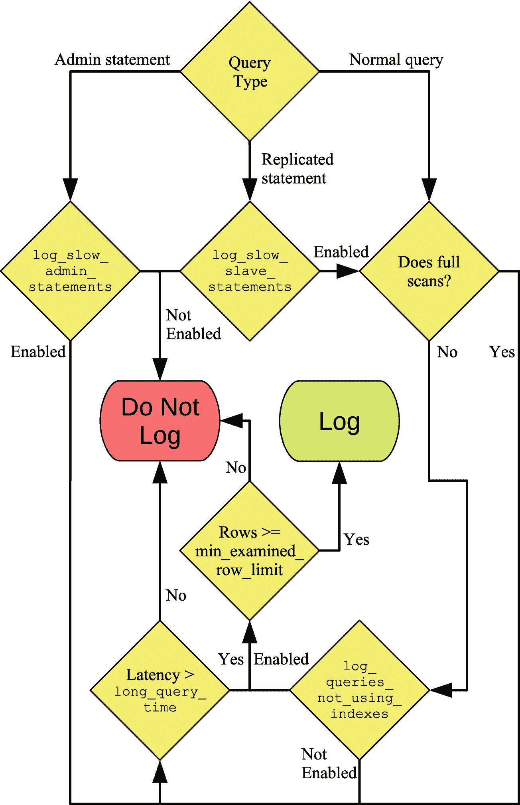

# 9.慢速查询日志

在能够从性能模式中获取查询统计信息之前，慢速查询日志是查找可进行优化的查询的主要信息源。即使在今天，缓慢的查询日志也不应该被完全抛弃。

与性能模式中的语句摘要信息相比，慢速查询日志有三个主要优势。记录的查询是持久化的，所以您可以在 MySQL 重新启动后查看信息，查询被记录了时间戳，并且实际的查询被记录。由于这些原因，慢速查询日志通常与性能模式一起使用。

Tip

像 MySQL Enterprise Monitor([`https://dev.mysql.com/doc/mysql-monitor/en/mem-qanal-using.html`](https://dev.mysql.com/doc/mysql-monitor/en/mem-qanal-using.html))这样的监控解决方案可以克服性能模式的这些限制，所以如果您有一个包含详细查询信息的监控解决方案，您就不太可能需要缓慢的查询日志。

缓慢的查询日志也有缺点。开销高于性能模式，因为查询被写入纯文本文件，并且在写入事件时没有并发支持。对查询日志的支持也很有限(您可以将慢速查询日志存储在一个表中，但这有其自身的缺点)，这使得在调查过程中使用它不太实际。

本章将介绍如何配置慢速查询日志、原始日志事件的外观，以及如何使用`mysqldumpslow`(在 Microsoft Windows 上为`mysqldumpslow.pl`)脚本来聚合日志。

## 配置

有几个选项可用于配置慢速查询日志以及记录哪些查询。由于启用日志的开销随着记录的查询数量的增加而增加，所以配置良好的慢速查询日志非常重要。记录“恰到好处”的查询也使得识别感兴趣的查询变得更加容易。

默认情况下不启用慢速查询日志，当启用该日志时，默认情况下只记录直接在本地实例上执行的非管理查询，并且该查询的执行时间超过 10 秒。表 [9-1](#Tab1) 总结了可用于微调该行为的配置选项。该信息包括默认值以及该选项是用于全局范围还是会话范围，或者两者都用。选项按字母顺序列出。

表 9-1

慢速查询日志的配置选项

<colgroup><col class="tcol1 align-left"> <col class="tcol2 align-left"></colgroup> 
| 

选项/默认值/范围

 | 

描述

 |
| --- | --- |
| `min_examined_row_limit`默认值:0范围:全局，会话 | 只有检查的行数超过该值的查询才会被记录。这在允许记录所有执行全扫描的查询时特别有用。 |
| `log_output`默认:`FILE`范围:全球 | 控制慢速查询日志和常规查询日志是记录到文件、表或两者中，还是根本不记录。 |
| `log_queries_not_using_indexes`默认:`OFF`范围:全球 | 启用后，所有执行全表或索引扫描的查询都会被记录下来，不管它们需要多长时间。 |
| `log_short_format`默认:`OFF`范围:全球 | 启用时，记录的信息较少。此选项只能在配置文件中设置。 |
| `log_slow_admin_statements`默认:`OFF`范围:全球 | 启用时，像`ALTER TABLE`和`OPTIMIZE TABLE`这样的管理语句可以进行日志记录。 |
| `log_slow_extra`默认:`OFF`范围:全球 | 启用时，有额外的信息，如查询的`Handler_%`状态变量的值。只有在记录到文件以及 MySQL 8.0.14 和更高版本中，才支持该功能。不启用`log_slow_extra`的主要原因是如果您有需要旧格式的脚本。 |
| `log_slow_slave_statements`默认:`OFF`范围:全球 | 启用后，复制的语句也有资格进行日志记录。这只适用于语句格式的二进制日志事件。 |
| `log_throttle_queries_not_using_indexes`默认:`0`范围:全球 | 当您启用了对执行完全扫描的所有查询的记录时，此选项可以限制每分钟可以记录查询的最大次数。 |
| `log_timestamps`默认:`UTC`范围:全球 | 时间戳是使用 UTC 还是系统时区。此选项也适用于错误日志和一般查询日志。它仅在记录到文件时适用。 |
| `long_query_time`默认:`10`范围:全局，会话 | 记录查询之前的最短查询延迟时间(秒)(除非它正在进行完全扫描，并且您已启用记录这些查询)。支持小数秒。设置为 0 以记录所有查询。**警告:**记录所有查询有很大的开销，最好在测试系统上或短时间内完成。 |
| `slow_query_log`默认:`OFF`范围:全球 | 是否启用慢速查询日志。 |
| `slow_query_log_file`默认:`<hostname>-slow.log`范围:全球 | 慢速查询日志文件的路径和文件名。默认位置在数据目录中，根据系统的主机名命名。 |

建议将`log_output`保留为默认值，并将事件记录到由`slow_query_log_file`设置的文件中。以表格的形式获取慢速查询日志似乎很有吸引力；但是，在这种情况下，数据保存为逗号分隔值(CSV ),对表的查询不能使用索引。还有一些功能如`log_slow_extra`是`log_output = TABLE`不支持的。

这些选项意味着您可以细粒度地控制记录哪些查询。除了`log_short_format`以外的所有选项都可以动态更改，所以您可以根据情况需要进行更改。如果你觉得很难确定选项是如何相互作用的，那么图 [9-1](#Fig1) 显示了一个决定过程的流程图，该过程决定一个查询是否应该被记录。(流程图只是说明性的，实际的代码路径是不同的。)



图 9-1

确定是否将查询记录到慢速日志的流程图

流程从查询类型开始。对于管理语句和复制语句，它们只有在启用了相应选项的情况下才会继续。常规查询首先检查它们是否符合不使用索引的条件，然后依靠检查查询执行时间(延迟)。如果满足任一条件，则检查是否检查了足够多的行。一些更好的细节，比如不使用索引的语句的节流，在图中被忽略了。

一旦有了所需的查询设置，就需要查看日志中的事件，以确定是否有任何查询需要注意。

## 记录事件

慢速查询日志由纯文本格式的事件组成。这意味着您可以使用任何您喜欢的文本查看器来检查文件。在 Linux 和 Unix 上，`less`命令是一个很好的选择，因为它对处理大文件有很好的支持。在 Microsoft Windows 上，Notepad++是一种常见的选择，但对大文件没有同样好的支持。Windows 上的另一个选项是安装 Windows Subsystem for Linux (WSL ),它允许您安装 Linux 发行版，并以这种方式访问像`less`这样的命令。

事件的格式取决于设置。清单 [9-1](#PC1) 显示了一个默认格式的事件示例，用`long_query_time = 0`记录所有查询。请注意，由于页面宽度有限，一些行已经换行。

```
# Time: 2019-09-17T09:37:53.269881Z
# User@Host: root[root] @ localhost [::1]  Id:    22
# Query_time: 0.032531  Lock_time: 0.000221 Rows_sent: 10  Rows_examined: 4089
SET timestamp=1568713073;
SELECT CountryCode, COUNT(*) FROM world.city GROUP BY CountryCode ORDER BY COUNT(*) DESC LIMIT 10;

Listing 9-1A slow query log event in the default format

```

第一行显示了查询的执行时间。这是时间戳，您可以控制是使用 UTC 还是系统时间来使用`log_timestamp`选项。第二行显示了哪个帐户执行了查询和连接 id。第三行包括查询的一些基本统计数据:查询执行时间、等待锁的时间、返回给客户机的行数和检查的行数。

`SET timestamp`查询设置查询的时间戳，以 epoch(1970 年 1 月 1 日 00:00:00 UTC)以来的秒数度量，最后慢速查询在最后一行。

在统计数据中，查询时间和检查的行数与发送的行数之间的比率是特别重要的。与返回的行数相比，检查的行数越多，索引的效率通常越低。但是，您应该总是在查询的上下文中查看信息。在这种情况下，查询会找到城市最多的十个国家代码。如果不执行全表或索引扫描，就无法找到，所以在这种情况下，检查的行数与发送的行数之比很低是有原因的。

如果您在版本 8.0.14 和更高版本中启用了`log_slow_extra`，那么您将获得查询的附加信息，如清单 [9-2](#PC2) 所示。

```
# Time: 2019-09-17T10:09:50.054970Z
# User@Host: root[root] @ localhost [::1]  Id:    22
# Query_time: 0.166589  Lock_time: 0.099952 Rows_sent: 10  Rows_examined: 4089 Thread_id: 22 Errno: 2336802955 Killed: 0 Bytes_received: 0 Bytes_sent: 0 Read_first: 1 Read_last: 0 Read_key: 1 Read_next: 4079 Read_prev: 0 Read_rnd: 0 Read_rnd_next: 0 Sort_merge_passes: 0 Sort_range_count: 0 Sort_rows: 10 Sort_scan_count: 1 Created_tmp_disk_tables: 0 Created_tmp_tables: 0 Start: 2019-09-17T10:09:49.888381Z End: 2019-09-17T10:09:50.054970Z
SET timestamp=1568714989;
SELECT CountryCode, COUNT(*) FROM world.city GROUP BY CountryCode ORDER BY COUNT(*) DESC LIMIT 10;

Listing 9-2Using log_slow_extra with the slow query log

```

从性能角度来看，主要感兴趣的统计数据是以`Bytes_received`开始，以`Created_tmp_tables`结束的统计数据。其中一些统计数据相当于查询的`Handler_%`状态变量。在这种情况下，您可以看到`Read_next`计数器是大量被检查行的主要贡献者。`Read_next`在扫描索引以查找行时使用，因此可以断定查询执行了索引扫描。

如果您需要知道在给定时间执行了什么，查看原始事件会非常有用。如果您更想知道哪些查询通常对系统负载贡献最大，那么您需要聚合数据。

## 聚合

可以使用 MySQL 安装中包含的`mysqldumpslow`(在 Microsoft Windows 上为`mysqldumpslow.pl`)脚本来聚合慢速查询日志中的数据。`mysqldumpslow`是一个 Perl 脚本，默认情况下，它通过用`N`替换数值，用`'S'`替换字符串来规范化日志中的查询。这允许脚本以类似于性能模式中的`events_statements_summary_by_digest`表的方式来聚合查询。

Note

该脚本要求在您的系统上安装 Perl。在总是有 Perl 的 Linux 和 Unix 上，这不是问题，但是在 Microsoft Windows 上，您将需要自己安装 Perl。一种选择是从 [`http://strawberryperl.com/`](http://strawberryperl.com/) 安装草莓 Perl。

有几个选项可以控制`mysqldumpslow`的行为。这些总结在表 [9-2](#Tab2) 中。此外，慢速查询日志文件可以作为不带选项名称的参数给出。

表 9-2

`mysqldumpslow`的命令行参数

<colgroup><col class="tcol1 align-left"> <col class="tcol2 align-left"> <col class="tcol3 align-left"></colgroup> 
| 

[计]选项

 | 

缺省值

 | 

描述

 |
| --- | --- | --- |
| `-a` |   | 不要用`N`和`'S'`替换数字和字符串值。 |
| `--debug` |   | 在调试模式下执行。 |
| `-g` |   | 对查询执行模式匹配(使用与`grep`相同的语法),并且只包括匹配的查询。 |
| `-h` | `*` | 默认情况下，`mysqldumpslow`搜索 MySQL 配置文件中设置的`datadir`中的文件。此选项指定文件应该匹配的主机名，假设使用默认的慢速查询日志文件名。可以使用通配符。 |
| `--help` |   | 显示帮助文本。 |
| `-i` |   | 在自动算法中使用的`mysql.server`启动脚本中的实例名，以查找慢速查询日志文件。 |
| `-l` |   | 不要提取查询的锁定时间。 |
| `-n` | `0` | 在抽象为`N`之前，数字中必须包含的最小位数。 |
| `-r` |   | 颠倒查询的返回顺序。 |
| `-s` | `at` | 如何对查询进行排序。默认情况下，根据平均查询时间进行排序。排序选项的完整列表将单独介绍。 |
| `-t` | (全部) | 在结果中返回的最大查询数。 |
| `--verbose` |   | 在脚本执行期间打印附加信息。 |

`-s`、`-t`和`-r`选项是最常用的。虽然`mysqldumpslow`可以使用默认路径和主机名中的 MySQL 配置文件来搜索慢速查询日志，但更常见的是在命令行中将慢速查询日志文件的路径指定为参数。

`-s`选项用于指定如何对结果中包含的查询进行排序。对于某些排序选项，可以选择使用总计或平均值进行排序。分类选项在表 [9-3](#Tab3) 中列出，也可从`mysqldumpslow --help`输出中获得。*总计*列指定用于按总计排序的选项，而*平均值*列显示用于按平均值排序的选项。

表 9-3

`mysqldumpslow`的排序选项

<colgroup><col class="tcol1 align-left"> <col class="tcol2 align-left"> <col class="tcol3 align-left"></colgroup> 
| 

总数

 | 

平均的

 | 

描述

 |
| --- | --- | --- |
| `c` |   | 按查询执行的次数(计数)排序。 |
| `l` | `al` | 按锁定时间排序。 |
| `r` | `ar` | 按发送的行数排序。 |
| `t` | `at` | 按查询时间排序。 |

有时使用不同的排序选项生成几个报告会很有用，这样可以更好地了解在实例上执行的查询。

作为一个案例研究，考虑一个实例从一个空的慢速查询日志文件开始；然后执行清单 [9-3](#PC3) 中的查询。执行这些查询时，会话的`long_query_time`设置为 0，以记录所有查询，这有助于避免花费很长时间执行查询。

```
SET GLOBAL slow_query_log = ON;
SET long_query_time = 0;
SELECT * FROM world.city WHERE ID = 130;
SELECT * FROM world.city WHERE ID = 131;
SELECT * FROM world.city WHERE ID = 201;
SELECT * FROM world.city WHERE ID = 2010;
SELECT * FROM world.city WHERE ID = 1;
SELECT * FROM world.city WHERE ID = 828;
SELECT * FROM world.city WHERE ID = 131;
SELECT * FROM world.city WHERE CountryCode = 'AUS';
SELECT * FROM world.city WHERE CountryCode = 'CHN';
SELECT * FROM world.city WHERE CountryCode = 'IND';
SELECT * FROM world.city WHERE CountryCode = 'GBR';
SELECT * FROM world.city WHERE CountryCode = 'USA';
SELECT * FROM world.city WHERE CountryCode = 'NZL';
SELECT * FROM world.city WHERE CountryCode = 'BRA';
SELECT * FROM world.city WHERE CountryCode = 'AUS';
SELECT * FROM world.city WHERE CountryCode = 'DNK';
SELECT * FROM world.city ORDER BY Population DESC LIMIT 10;
SELECT * FROM world.city ORDER BY Population DESC LIMIT 4;
SELECT * FROM world.city ORDER BY Population DESC LIMIT 9;

Listing 9-3The queries used to create slow query log events for a case study

```

对于`WHERE`子句或`LIMIT`子句，有三个具有不同值的基本查询。首先，通过主键找到城市，主键将搜索一行以返回一行。第二，城市是通过作为二级索引的`CountryCode`找到的，所以找到了几行，但返回的行数仍然相同。第三，检查所有城市以返回人口最多的城市。

假设慢速查询日志文件被命名为`mysql-slow.log`，并且您正在文件所在的同一个目录中执行`mysqldumpslow`，那么您可以对查询进行分组，并按照查询被执行的次数对它们进行排序，如清单 [9-4](#PC4) 所示。`-t`选项用于将报告限制为包括三个(规范化的)查询。

```
shell$ mysqldumpslow -s c -t 3 mysql-slow.log

Reading mysql slow query log from mysql-slow.log
Count: 9  Time=0.00s (0s)  Lock=0.00s (0s)  Rows=150.1 (1351), root[root]@localhost
  SELECT * FROM world.city WHERE CountryCode = 'S'

Count: 7  Time=0.02s (0s)  Lock=0.00s (0s)  Rows=1.0 (7), root[root]@localhost
  SELECT * FROM world.city WHERE ID = N

Count: 3  Time=0.00s (0s)  Lock=0.00s (0s)  Rows=7.7 (23), root[root]@localhost
  SELECT * FROM world.city ORDER BY Population DESC LIMIT N

Listing 9-4Using mysqldumpslow to sort the queries by count

```

注意`WHERE`和`LIMIT`条款是如何被修改成使用`N`和`'S'`的。查询时间以`Time=0.00s (0s)`的形式列出，平均查询时间(`0.00s`)在前，总时间在括号中。锁和行统计信息也是如此。

因为`mysqldumpslow`脚本是用 Perl 编写的，所以如果您想包含对新排序选项的支持或者更改输出，修改脚本相对容易。例如，如果您想在平均执行时间中包含更多的小数，您可以在`usage`子例程之前修改`printf`语句(MySQL 8.0.18 包含的脚本中的第 168–169 行),如下所示

```
    printf "Count: %d  Time=%.6fs (%ds)  Lock=%.2fs (%ds)  Rows=%.1f (%d), $user\@$host\n%s\n\n",
          $c, $at,$t, $al,$l, $ar,$r, $_;

```

变化出现在第一行的`Time=%.6fs`部分。这将打印以微秒为单位的平均执行时间。

## 摘要

本章展示了如何使用慢速查询日志来收集在 MySQL 实例上执行的查询的信息。慢速查询日志侧重于根据执行时间和查询是否使用索引(实际上是执行全表扫描还是索引扫描)来捕获查询。与性能模式相比，慢速查询日志的主要优点是日志包括执行的确切语句，并且是持久化的。缺点是开销大，而且很难得到返回您感兴趣的查询的报告。

首先，讨论了用于配置慢速查询日志的配置选项。有一些选项可以控制最小执行时间、是否应该记录不使用索引的查询而不管执行时间、要记录的查询类型等等。在 MySQL 8.0.14 和更高版本中，您可以使用`log_slow_extra`来包含关于慢速查询的更多详细信息。

其次，讨论了两个慢速查询日志事件的例子。有一个使用默认信息的例子和一个启用了`log_slow_extra`的例子。如果您正在查找在给定时间点执行的查询的信息，原始事件会很有用。对于更一般的查询，用`mysqldumpslow`脚本聚集数据更有用。在上一节中讨论了`mysqldumpslow`的使用。

下一部分将介绍一些对性能调优有用的工具，首先以 MySQL Enterprise Monitor 为例讨论监控。