# 10.MySQL 企业监视器

无论是在系统级还是查询级，监控都是性能调优的关键之一。本章将介绍 MySQL 可用的监控解决方案之一，MySQL 企业监控器，也称为 MEM。

本章将首先概述 MySQL 企业监视器的架构和原理。如果您想尝试 MySQL Enterprise Monitor，那么有一个部分提供了安装说明，随后讨论了如何启动和停止服务管理器，以及如何将 MySQL 实例添加到受监控实例的列表中。最后，是用户界面之旅。

本书的其余部分使用 MySQL Enterprise Monitor 中的图表和报告来说明监控工具的使用，但是您也可以使用其他监控解决方案。如果你对 MySQL 企业监视器不感兴趣，可以跳过这一章。

## 概观

MySQL Enterprise Monitor 是 Oracle 专用于 MySQL 的监控解决方案。它作为 MySQL Server 的配套产品提供给客户，由 MySQL 开发团队开发。

Note

MySQL Enterprise Monitor 需要 MySQL Enterprise Edition 或 MySQL Cluster CGE(运营商级版本)订阅才能在 30 天试用版之后使用(另请参见下一节中的下载说明)。您可以在 [`www.mysql.com/products/enterprise/`](http://www.mysql.com/products/enterprise/) 查看 MySQL 商业特性。

MySQL Enterprise Monitor 由多个组件组成，每个组件在整个监控解决方案中都扮演着自己的角色。在版本 8 中，有两个主要组件:

*   **服务管理器:**该组件存储收集的指标，并提供查看数据和管理配置的前端接口。服务管理器由两部分组成，一部分是 Tomcat 服务器，它是服务管理器的应用程序端，另一部分是*存储库*，它是一个存储数据的 MySQL 数据库。

*   **代理:** MySQL Enterprise Monitor 使用代理连接到被监控的 MySQL 实例。服务管理器包括一个内置代理，默认情况下它会监控存储库。代理可以监控本地操作系统以及本地和远程 MySQL 实例。

Note

本书遵循 MySQL 企业监控手册( [`https://dev.mysql.com/doc/mysql-monitor/en/`](https://dev.mysql.com/doc/mysql-monitor/en/) )的惯例，用标题案例来写服务经理和代理。

由于代理只能监视运行它的操作系统 CPU 和内存使用量、磁盘容量等指标——所以最好在监视 MySQL 实例的每台主机上安装一个代理。这将允许您将主机指标与 MySQL 活动相关联。如果您无法在本地安装代理，例如，如果您使用的云解决方案不允许您访问操作系统，您可以使用安装在另一台主机上的代理来监控 MySQL 指标。在这种情况下，一种选择是使用服务管理器中的内置代理。图 [10-1](#Fig1) 显示了一个有三台主机的设置示例，其中一台用于服务管理器，两台主机安装了被监控的 MySQL 实例。


图 10-1

MySQL 企业监视器组件概述

顶部的主机安装了 MySQL 企业监控服务管理器。它包括前端——这里用一个带有图形的网页来描述——以及内置的代理和存储库。内置代理监控存储库，也可以选择性地用于监控其他 MySQL 实例(图中未显示),如果您无法访问主机(例如某些云产品),或者如果您正在测试并希望监控安装了服务管理器的同一主机上的第二个 MySQL 实例，这将非常有用。

主机 1 和主机 2 是两台安装了 MySQL 服务器的主机。每台主机上都安装了一个 MySQL 企业监控代理。代理向 MySQL 实例查询指标，并将指标发送给服务管理器，服务管理器将它们存储在存储库中。服务管理器还可以向代理发送请求，例如，运行特别报告或更改代理收集指标的频率。

服务经理和代理的安装过程相似，都使用客户安装程序。下一节将介绍如何安装服务管理器。如果您想尝试安装代理，那么它将作为一个练习留给读者。

## 装置

MySQL Enterprise Monitor 的安装非常简单，尽管与其他 MySQL 产品不同。下载该软件与您使用 MySQL 社区版时可能习惯的方式不同，安装总是通过专用的安装程序来完成。本节将指导您完成 MySQL Enterprise Monitor 的下载、安装过程和设置。

### [计] 下载

安装的第一步是下载 MySQL 企业监视器。有两个地方可以下载 MySQL 企业监视器。现有的 MySQL 客户可以从 My Oracle Support (MOS)中的 Patches & Updates 选项卡下载。这是推荐给客户的位置，因为修补程序和更新会更频繁地更新，并且包括自 2011 年以来的所有版本。另一个地点是位于 [`https://edelivery.oracle.com/`](https://edelivery.oracle.com/) 的甲骨文软件交付云，它也允许注册用户下载 30 天的试用版。这些说明涵盖了 Oracle 软件交付云。

Note

新帐户和一段时间没有使用的帐户可能需要进行出口验证，这可能需要几天时间。

你从“主页”开始，如图 [10-2](#Fig2) 所示。

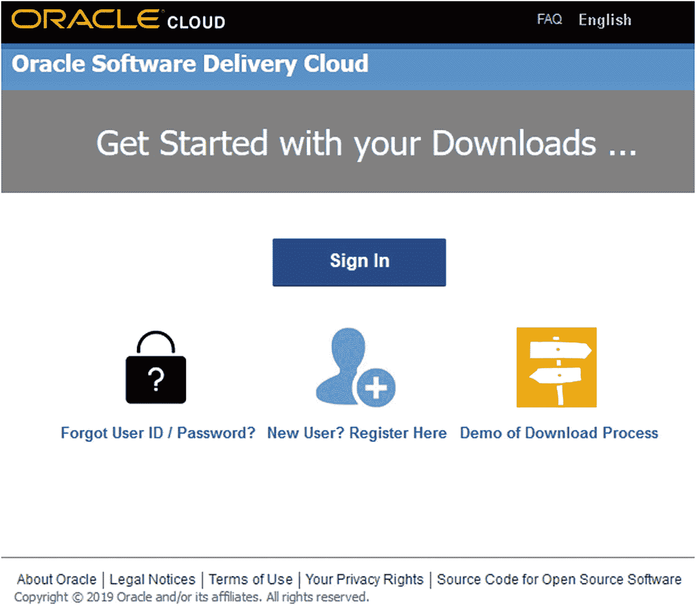

图 10-2

甲骨文软件交付云主页

如果您没有登录，您需要使用*新用户创建一个新用户？在此注册*图标。登录后，您将进入搜索页面。图 [10-3](#Fig3) 显示了搜索表单的一部分。

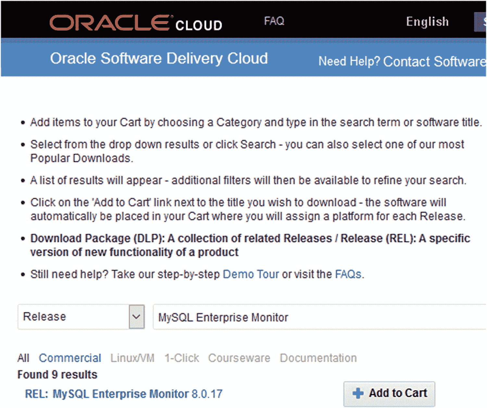

图 10-3

Oracle 软件交付云搜索表单

在文本字段左侧的下拉框中选择*释放*。如果您对其他产品也感兴趣，您可以保留默认值，即*所有类别*，其中包括软件包。在文本字段中，输入 *MySQL Enterprise Monitor* ，并在显示的搜索列表中单击 *MySQL Enterprise Monitor* ，或者单击文本字段右侧的*搜索*按钮(图中未显示列表和按钮)。然后点击 MySQL Enterprise Monitor 结果旁边的*添加到购物车*。

当产品被添加到购物车后，您可以点击页面右上角附近的*结帐*链接(图中也没有显示)。下一个屏幕如图 [10-4](#Fig4) 所示，允许您选择为哪些平台下载。


图 10-4

选择要下载的平台

选择你感兴趣的平台。如果您计划在一个平台上安装服务管理器，同时在另一个平台上安装代理来监控实例，那么您需要选择两个平台。当您决定要为哪些平台下载时，点击*继续*。

下一步是接受许可协议。接受前请仔细阅读。Oracle 试用许可协议位于文档末尾。接受条款和条件后，点击*继续*。

Note

作为其中一个步骤，您可能需要完成一项关于 Oracle 软件交付云可用性的调查。

最后一步是选择您想要下载 MySQL Enterprise Monitor 的哪些部分。如图 [10-5](#Fig5) 所示。

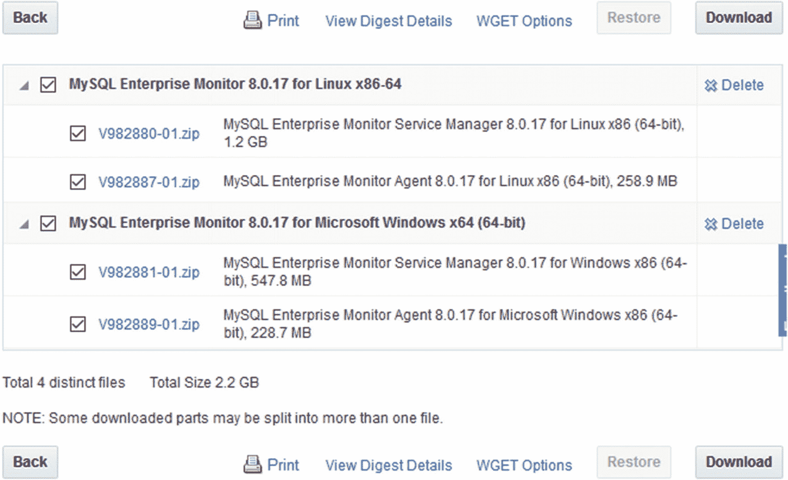

图 10-5

选择要下载 MySQL 企业监视器的哪些部分

每个平台有两个软件包，一个用于服务经理，一个用于代理。可选地(推荐)，您可以单击屏幕截图底部中间的*查看摘要详细信息*链接，以显示每个文件的 SHA-1 和 SHA-256 校验和。您可以使用这些来验证下载是否成功完成。

您可以通过两种方式下载文件。如果您单击文件名，您将一个接一个地下载文件。或者，检查您想要的文件并点击*下载*按钮，使用下载管理器开始下载。如果您没有安装下载管理器，您将在下载开始前被引导完成安装。

Tip

Oracle 软件交付云使用通用文件名，如`V982880-01.zip`。将文件重命名为包含您下载的产品、平台和版本信息的名称非常有用。

下载完成后，您可以开始安装过程。

### 安装过程

MySQL Enterprise Monitor 使用自己的安装程序，该程序在所有平台上都是一样的。支持通过图形用户界面或文本模式使用向导模式执行安装，或者您可以在命令行上提供所有参数并使用无人值守模式。

下载文件的名称取决于您下载的平台和 MySQL 企业监视器的版本。例如，用于微软 Windows 的服务管理器版本 8.0.17 被命名为`V982881-01.zip`。其他文件的名称类似。如果解压缩 ZIP 文件，您会发现几个文件:

```
PS> ls | select Length,Name

   Length Name
   ------ ----
  6367299 monitor.a4.pdf
  6375459 monitor.pdf
  5275639 mysql-monitor-html.tar.gz
  5300438 mysql-monitor-html.zip
281846252 mysqlmonitor-8.0.17.1195-windows64-installer.exe
281866739 mysqlmonitor-8.0.17.1195-windows64-update-installer.exe
      975 README_en.txt
      975 READ_ME_ja.txt

```

确切的文件名和大小取决于平台和 MySQL 企业监视器版本。注意，有两个可执行文件，在本例中是`mysqlmonitor-8.0.17.1195-windows64-installer.exe`和`mysqlmonitor-8.0.17.1195-windows64-update-installer.exe`。前者用于从头开始安装 MySQL Enterprise Monitor，而另一个(有时也称为更新安装程序)用于执行现有安装的升级。PDF 和 HTML 文件是手册，但您通常最好使用位于 [`https://dev.mysql.com/doc/mysql-monitor/en/`](https://dev.mysql.com/doc/mysql-monitor/en/) 的在线手册，因为它会定期更新。

Tip

如果您想使用基于文本的向导或无人值守模式，请使用`--help`参数调用安装程序，以获得受支持参数的列表。

本讨论将继续使用图形用户界面进行安装。您可以通过执行不带任何参数的安装程序来开始安装。第一步是选择语言(英语、日语和简体中文均可)。然后，系统会告诉您需要确保将安装过程中输入的用户名和密码保存在一个安全的位置。

通过欢迎屏幕后，通过指定安装位置来正确启动配置。在 Microsoft Windows 上，默认位置是`C:\Program Files\MySQL\Enterprise\Monitor`，在 Linux 上，作为`root`用户安装时是`/opt/mysql/enterprise/monitor`，作为非特权用户安装时是相对于主目录的`mysql/enterprise/monitor`。

图 [10-6](#Fig6) 所示的下一个屏幕要求您选择要监控多大的系统。

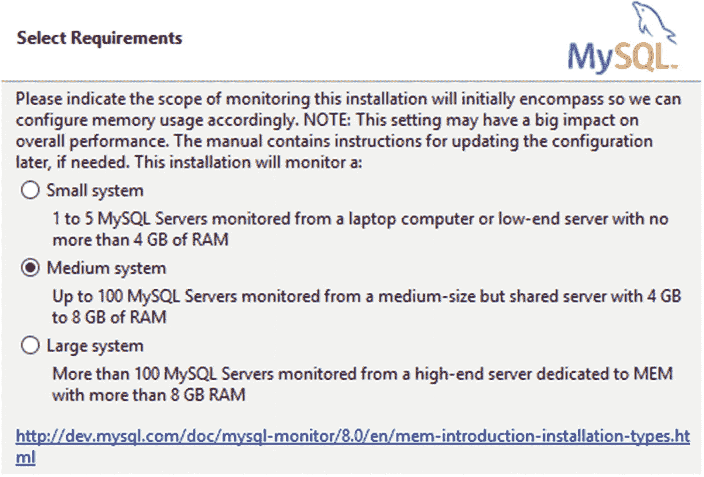

图 10-6

选择系统的大小

系统大小决定了默认设置，例如服务管理器的内存配置。安装完成后，您可以手动调整内存设置，但是选择正确的系统大小意味着您不必一开始就担心这些设置。除非您只想用几个实例来尝试 MySQL Enterprise Monitor，否则请选择中型或大型系统。

接下来，您需要指定要使用的端口号。MySQL Enterprise Monitor 使用 Tomcat 服务器作为前端，端口 18080 作为默认的未加密端口，18443 作为默认的 SSL 端口。您将始终使用 SSL 端口。(非 SSL 端口是出于传统原因而存在的，但不能用于前端。)

此时，如果您使用`root`帐户在 Linux 上安装，将会询问您希望在哪个用户帐户下运行 Tomcat 进程(MySQL 服务器存储库进程将使用`mysql`用户)。默认是`mysqlmem`。如果您使用非 root 帐户在 Linux 上安装，将会通知您安装程序无法设置自动启动。

服务管理器使用 MySQL 实例来存储数据，包括收集的指标。您可以选择(见图 [10-7](#Fig7) )使用安装程序附带的 MySQL 实例或使用现有的 MySQL 实例。


图 10-7

选择要使用的 MySQL 实例

除非您有非常充分的理由选择其他方式，否则建议使用捆绑的 MySQL 数据库。这不仅允许安装程序使用已知与服务管理器配合良好的基本配置，还简化了升级。

Caution

不要试图使用您想要监控的 MySQL 实例作为服务管理器的存储库。MySQL Enterprise Monitor 确实会导致大量的数据库活动，如果您使用生产数据库，那么当它应该监视的数据库关闭时，您的监视将停止工作。

现在，您可以选择服务管理器用来连接 MySQL 实例的用户名和密码，以及端口号和模式名。如图 [10-8](#Fig8) 所示。


图 10-8

为捆绑的 MySQL 服务器选择设置

不要轻易选择密码。监控将包括许多关于您的系统的细节，包括主机名和查询。这意味着选择强密码很重要。

这就是配置的结束，安装程序准备开始实际的安装步骤。安装需要一点时间，因为它包括安装 MySQL 服务器实例和 Tomcat 服务器前端。安装完成后，显示一个确认屏幕，随后显示图 [10-9](#Fig9) 中的警告。

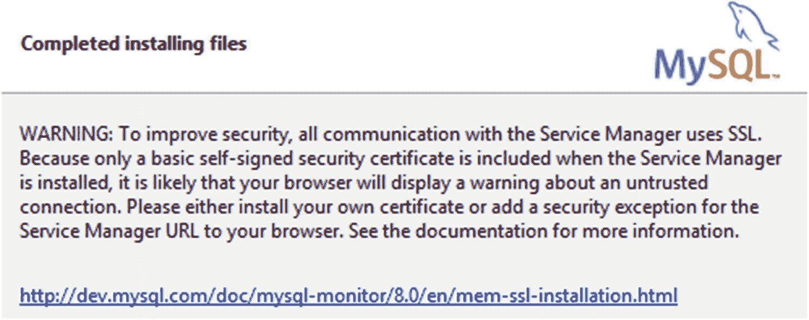

图 10-9

关于默认情况下使用的自签名证书的警告

安装程序为 SSL 连接创建自签名证书。这将很好地加密通信，但它不允许验证您是否连接到正确的服务器。您可以选择购买由可信提供商签名的证书，并让 MySQL Enterprise Monitor 使用该证书。如果您继续使用默认的自签名证书(这里假设的)，浏览器将在您第一次连接到服务管理器时抱怨您不能信任该连接(在这种情况下这是无害的)。

这就完成了安装。最后一个屏幕显示确认您已完成向导，您可以选择打开自述文件并启动浏览器。安装程序已经在后台启动了服务管理器，因此除了在浏览器中打开服务管理器的 URL 之外，您不需要做任何其他事情。如果您的浏览器与安装服务管理器的主机在同一台主机上，并且您选择了默认的 SSL 端口(18443)，则 URL 为`https://localhost:18443/`。

Note

Tomcat 可能需要一点时间来准备响应连接，这使得第一次连接尝试需要一段时间才能完成。

如上所述，如果您使用默认的自签名证书，浏览器将警告您存在潜在的安全风险。Firefox 的一个例子如图 [10-10](#Fig10) 所示。


图 10-10

Firefox 警告网站无法验证

你需要接受这个风险。如何做到这一点取决于您的浏览器和版本。在 Firefox 68 的情况下，你进入*高级*选项并选择*接受风险并继续*。

连接到服务管理器的第一步是进行更多的配置。如图 [10-11](#Fig11) 所示，大部分信息都集中在一个屏幕上。

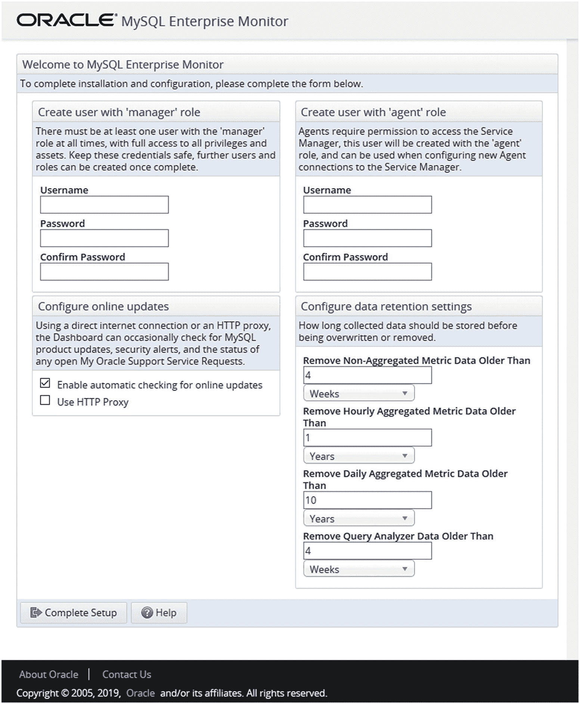

图 10-11

服务管理器配置屏幕

顶部要求您配置两个用户。具有管理员角色的用户是您用来通过浏览器登录服务管理器的管理用户(如果需要，您可以在以后创建更多具有较少权限的用户)。具有代理角色的用户是在其他主机上安装代理来监视 MySQL 实例时使用的用户。确保为两个用户选择强密码。

左下角允许您配置 MySQL Enterprise Monitor 是否应该自动检查升级，如果是，是否需要代理设置。在右下角，您可以配置数据应该保留多长时间。您保存数据的时间越长，您就可以追溯到更远的时间来调查问题，并且您保存的细节也越多。代价是数据库的大小增加了。

完成设置后，您将被带到一个新特性页面，您可以为新创建的管理用户设置想要使用的时区和区域设置。

Tip

如果要再次卸载服务管理器，可以使用卸载程序。在 Microsoft Windows 上，您可以通过控制面板中的程序应用程序来完成此操作。在其他平台上，使用最顶层安装目录中的`uninstall`命令。

因为在测试期间您可能需要启动和停止服务管理器，下一节将展示如何做。

## 启动和停止服务管理器

服务管理器被设计为作为服务启动和停止。在 Microsoft Windows 上，当您在 Linux 上使用`root`帐户安装服务管理器时，安装程序将始终为您安装服务。如果您在 Linux 上以非 root 用户的身份安装它，您可以手动执行服务脚本来启动和停止服务管理器。

Tip

如果手动启动进程，首先启动 MySQL 存储库服务，然后启动 Tomcat。停止它的时候，是反过来的，先停止 Tomcat，再停止 MySQL repository 服务。

### 微软视窗软件

在 Microsoft Windows 上，安装程序始终需要管理员权限才能运行，这意味着它也可以将 Service Manager 进程作为服务安装。默认情况下，这些服务被设置为在您启动和关闭计算机时自动启动和停止。

您可以通过打开服务应用程序来编辑服务的设置。在 Windows 10 上，最简单的方法是使用键盘上的 Windows 键(或者通过单击左下角的 Windows 图标打开开始菜单)，然后输入 *Services* ，如图 [10-12](#Fig12) 所示。

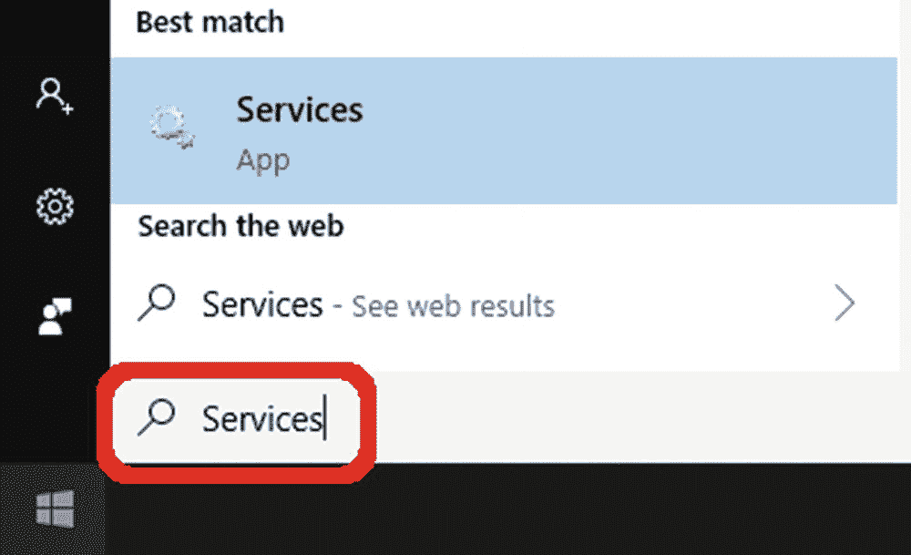

图 10-12

打开服务应用程序

与截图相比，搜索结果可能在某种程度上有所不同。点击*最佳匹配*下的*服务应用*匹配。这将打开应用程序，您可以在其中控制服务。在服务应用程序中，您可以通过启动、停止、暂停或重新启动服务来控制服务。存储库服务命名为 *MySQL Enterprise MySQL，*，Tomcat 服务命名为 *MySQL Enterprise Tomcat* ，如图 [10-13](#Fig13) 所示。


图 10-13

控制服务

点按服务时，您会在服务列表左侧的面板中获得基本控制操作。您也可以右键单击服务来获取操作以及编辑服务属性的选项。这些属性包括是否自动启动和停止服务。

### Linux 操作系统

如何在 Linux 上启动和停止 MySQL Enterprise Monitor 取决于您是否使用`root`操作系统用户执行了安装。如果您使用的是`root`用户，那么您可以通过`mysql-monitor-server`服务使用`service`命令(没有对`systemd`的本地支持)来启动和停止进程；否则，使用安装目录下的`mysqlmonitorctl.sh`脚本。无论哪种方式，您都可以添加`tomcat`或`mysql`参数来更改其中一个进程的状态。

清单 [10-1](#PC2) 展示了如何使用`service`命令来启动、重启和停止 MySQL 企业监视器。

```
shell$ sudo service mysql-monitor-server start
Starting mysql service  [ OK ]
2019-08-24T06:45:43.062790Z mysqld_safe Logging to '/opt/mysql/enterprise/monitor/mysql/data/ol7.err'.
2019-08-24T06:45:43.168359Z mysqld_safe Starting mysqld daemon with databases from /opt/mysql/enterprise/monitor/mysql/data
Starting tomcat service  [ OK ]

shell$ sudo service mysql-monitor-server restart
Stopping tomcat service . [ OK ]
Stopping mysql service 2019-08-24T06:47:57.907854Z mysqld_safe mysqld from pid file /opt/mysql/enterprise/monitor/mysql/runtime/mysqld.pid ended
. [ OK ]
Starting mysql service  [ OK ]
2019-08-24T06:48:04.441201Z mysqld_safe Logging to '/opt/mysql/enterprise/monitor/mysql/data/ol7.err'.
2019-08-24T06:48:04.544643Z mysqld_safe Starting mysqld daemon with databases from /opt/mysql/enterprise/monitor/mysql/data
Starting tomcat service  [ OK ]

shell$ sudo service mysql-monitor-server stop tomcat
Stopping tomcat service . [ OK ]

shell$ sudo service mysql-monitor-server stop mysql
Stopping mysql service 2019-08-24T06:48:54.707288Z mysqld_safe mysqld from pid file /opt/mysql/enterprise/monitor/mysql/runtime/mysqld.pid ended
. [ OK ]

Listing 10-1Changing the status of the services with the service command

```

首先启动两个服务，然后重新启动，最后逐个停止服务。没有必要一个接一个地停止服务，但是这可能是有用的，例如，如果您需要对存储库进行维护。

清单 [10-2](#PC3) 展示了使用`mysqlmonitorctl.sh`脚本的相同示例。

```
shell $ ./mysqlmonitorctl.sh start
Starting mysql service  [ OK ]
2019-08-24T06:52:34.245379Z mysqld_safe Logging to '/home/myuser/mysql/enterprise/monitor/mysql/data/ol7.err'.
2019-08-24T06:52:34.326811Z mysqld_safe Starting mysqld daemon with databases from /home/myuser/mysql/enterprise/monitor/mysql/data
Starting tomcat service  [ OK ]

shell$ ./mysqlmonitorctl.sh restart
Stopping tomcat service . [ OK ]
Stopping mysql service 2019-08-24T06:53:08.292547Z mysqld_safe mysqld from pid file /home/myuser/mysql/enterprise/monitor/mysql/runtime/mysqld.pid ended
. [ OK ]
Starting mysql service  [ OK ]
2019-08-24T06:53:15.310640Z mysqld_safe Logging to '/home/myuser/mysql/enterprise/monitor/mysql/data/ol7.err'.
2019-08-24T06:53:15.397898Z mysqld_safe Starting mysqld daemon with databases from /home/myuser/mysql/enterprise/monitor/mysql/data
Starting tomcat service  [ OK ]

shell$ ./mysqlmonitorctl.sh stop tomcat
Stopping tomcat service . [ OK ]

shell$ ./mysqlmonitorctl.sh stop mysql
Stopping mysql service 2019-08-24T06:54:39.592847Z mysqld_safe mysqld from pid file /home/myuser/mysql/enterprise/monitor/mysql/runtime/mysqld.pid ended
. [ OK ]

Listing 10-2Changing the status of the services with mysqlmonitorctl.sh

```

这些步骤与前面使用`service`命令的例子非常相似。事实上，service 命令调用的脚本与`mysqlmonitorctl.sh`脚本相同，只是其中的路径和用户名取决于用来安装服务管理器的操作用户和安装路径。

## 添加 MySQL 实例

如果您只是想玩玩 MySQL Enterprise Monitor，您不需要做更多的事情。服务管理器的内置代理将自动监视存储库实例，因此当您第一次登录到用户界面时，已经有了可用的监视数据。如果安装了代理，代理还会自动注册它正在监视的实例。最后一个选项是从用户界面添加一个实例，这将在本节中讨论。

如果您要添加监控的 MySQL 实例与服务管理器或现有代理安装在同一台主机上，它将被自动检测到，并且页面右上方带有海豚和问号的图标将被突出显示，如图 [10-14](#Fig14) 所示。


图 10-14

一个实例显示为不受监控

请注意，在海豚的右边写着 1，在一个(黄色)圆圈里有一个问号。这是已找到但未被监控的 MySQL 实例的数量。当您将鼠标悬停在图标上时，将显示一个工具提示，其中包含未受监视的实例的数量。如果您单击海豚或数字，它会将您带到 MySQL 实例配置屏幕，您也可以通过左侧窗格中的菜单访问该屏幕。

Note

通过用户界面添加的实例将由现有代理(如果您自己没有安装任何代理，则为内置代理)监视。只有安装了代理的系统的操作系统才会受到监控。

实例配置屏幕包括添加新实例的选项、MySQL Enterprise Monitor 找到的未受监控实例的列表以及受监控实例的列表。图 [10-15](#Fig15) 显示了与开始监控新的和未被监控的实例相关的页面部分。

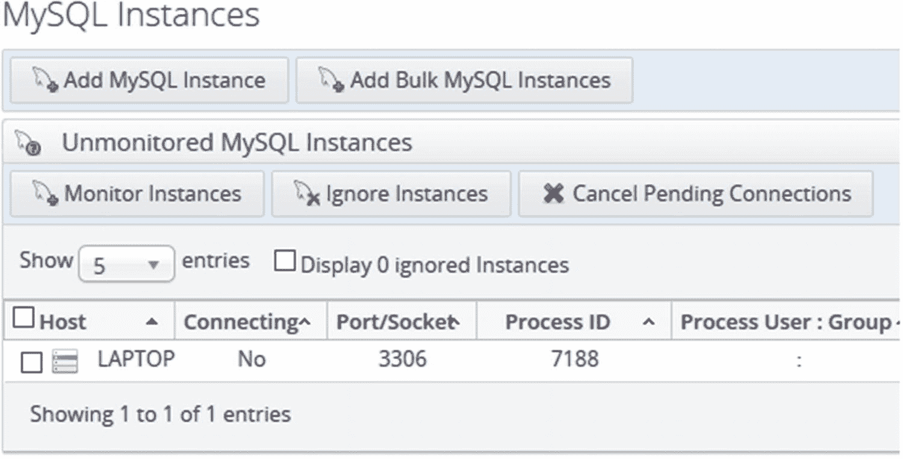

图 10-15

“实例配置”页面

您可以通过使用页面顶部的*添加 MySQL 实例*或*添加批量* *MySQL 实例*按钮来添加对任何 MySQL 实例的监控。如果您想要监控的实例列在未监控的 MySQL 实例列表中，您也可以在那里选择它，然后单击*监控实例*按钮，这将带您进入与*添加 MySQL 实例*相同的表单，不同之处在于已知的连接设置已经预先填充。该表单有多个选项卡，其中连接设置选项卡如图 [10-16](#Fig16) 所示。

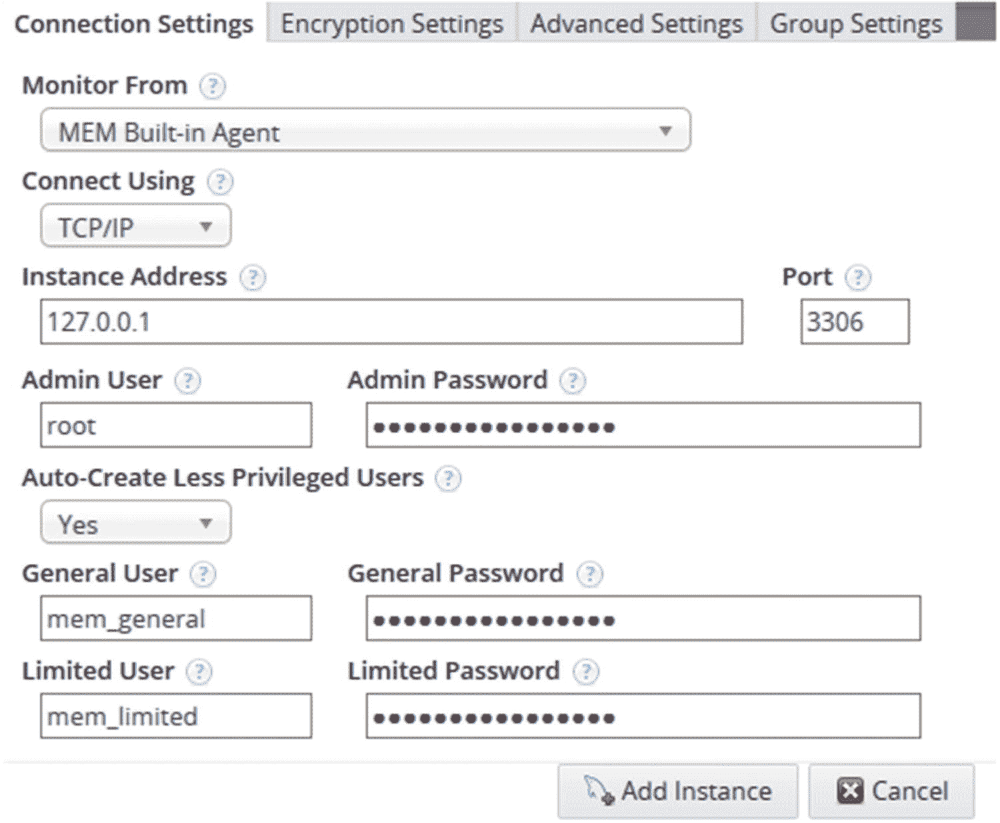

图 10-16

“添加实例”表单的“连接设置”选项卡

关于连接设置需要注意的主要问题是，您可以选择让 MySQL Enterprise Monitor 自动创建比用于设置监控的管理用户权限更少的用户。建议允许创建这些用户，因为这允许代理使用权限尽可能少的用户来执行任务。

如果您有加密要求，可以在“加密设置”选项卡中编辑这些要求。很少需要高级设置选项卡。如果要设置对多个实例的监视，您可能需要在“组设置”选项卡中为实例指定一个组。添加实例后，也可以更改这些设置。

添加实例需要一些时间。当它准备好时，您可以开始探索用户界面的其余部分。

## 图形用户界面

服务管理器的 Tomcat 服务器提供的用户界面是您使用 MySQL Enterprise Monitor 花费最多时间的地方。正如您已经看到的，它可以用来添加新的实例。本节将进一步深入用户界面，并讨论一般导航、指导、时间序列图和查询分析器。

### 一般导航

MySQL Enterprise Monitor 用户界面将特性分成逻辑组，支持按组、主机、代理或实例进行过滤。本节将简要介绍该界面，目的是当本书后面提到图表或报告时，如果您想更深入地了解它，可以在界面中找到它们。

图 [10-17](#Fig17) 显示了用户界面中页面的左上部分。在这里，您可以选择要访问的功能以及要显示哪些目标的数据。


图 10-17

MySQL 企业监视器中页面的左上角

功能导航位于左侧窗格的中央，页面顶部的两个搜索字段中应用了过滤器。屏幕截图中带有标签 *Global Summaries* 的搜索字段允许您选择一组实例。可以手动创建组，也可以为相互复制的实例自动创建组。*全局概要*是一个包含所有实例的特殊组。右侧的搜索字段允许您限制组中包括的实例、代理或主机。

这些功能包括仪表板、图表、报告等。可用功能列表取决于您应用的过滤器。菜单项包括

*   **概述:**这是一个高级仪表板。

*   **拓扑:**仅当选择了复制组时，此选项才可用。它将带您进入一个图表，该图表显示了该组的拓扑以及每个实例的复制状态。

*   **事件:**返回实例的监控事件报告。当顾问(稍后)设置的某些条件满足时，就会引发事件。这些事件具有不同的严重性，从通知到紧急情况不等。

*   **指标:**这将带您进入显示代理收集的指标的报告。无论使用哪种过滤器，时间序列图表总是可用的(但是哪个图表取决于过滤器)。对于单个实例，还有关于表统计、用户统计、内存使用、数据库文件 I/O、InnoDB 缓冲池、进程和锁等待的报告。这些报告中的几个将在后面的章节中使用。

*   **查询:**这是 MySQL 查询分析器，允许您调查在实例上执行了哪些查询。timeseries 图形链接到查询分析器，因此您可以从检查图形到查看在被调查的时间段内执行了哪些查询。

*   **复制:**复制仪表板和其他与复制相关的报告。

*   **备份:**MySQL 企业备份(MEB)创建的备份信息。

*   **配置:**配置 MySQL Enterprise Monitor 的各个方面，包括实例和顾问。

*   **帮助:**文档包括您已经看到的新内容，以及下载可用于故障排除的诊断报告的权限。如果您有 MySQL 支持合同，并且需要在支持票据中提供诊断，则通常会使用诊断报告。

有必要进一步解释的一个术语是顾问。

### 顾问

Advisor 是 MySQL Enterprise Monitor 用于定义数据收集频率、触发事件的条件以及事件严重性的规则的名称。这是一个重要的概念，您应该花一些时间来理解和配置。

获得有用的监控解决方案的最重要步骤之一是确保在正确的时间获得正确的事件(警报),但避免不必要的事件。这包括确保将每个警报设置为适当的严重性。起初，你可能认为事件越多越好，这样你就能知道发生的一切。然而，这并不是使用监控系统的最佳方式。如果您在检查事件时有许多误报，或者您在凌晨 3:00 因为一个很容易等到早上的问题被不必要的叫醒，那么您开始忽略事件，这肯定会迟早错过一个重要的事件。简而言之，你与顾问的合作应该是持续的，以不断改进他们，在“正确的”时间触发“正确的”事件。

Tip

监控工作的一个重要部分是确保监控系统触发与问题紧急程度相匹配的事件。我们的目标应该是永远不要忽略一个事件，并且总是在一个适合紧急情况的时间和方式得到提醒。

可以在左侧窗格的*配置*项下配置顾问。顾问按组组织，如图 [10-18](#Fig18) 所示。

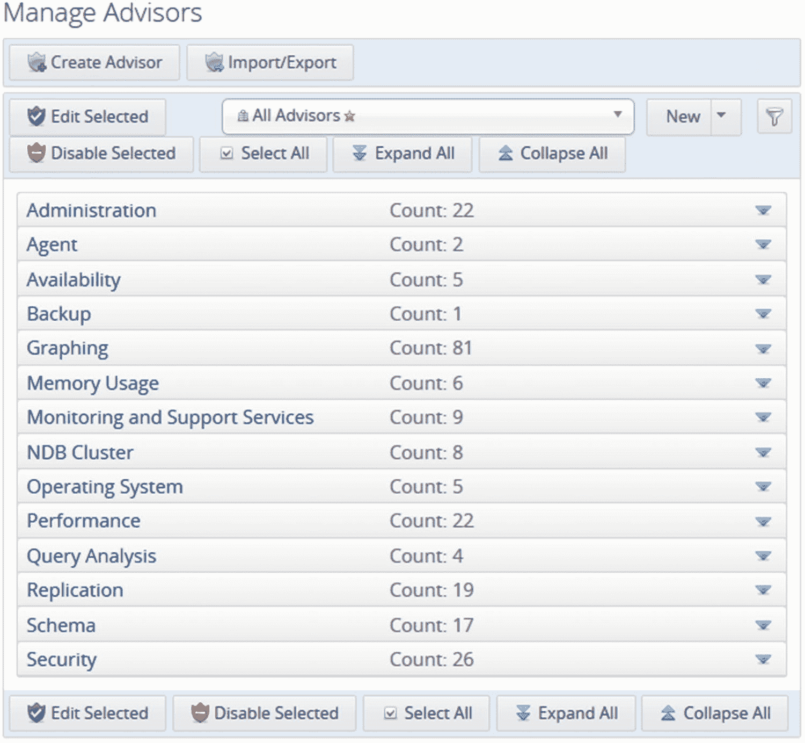

图 10-18

顾问被组织成小组

每个组都包含相似类型的指导，例如，有一个性能组有 22 个指导，如过多的锁定进程和未被有效使用的索引。

默认情况下，所有指导都启用了严重性级别的阈值，这些阈值设置为在许多情况下都能正常工作的值。然而，由于没有两个系统是相同的，您需要通过展开组并点击顾问名称左侧的菜单图标来微调设置，如图 [10-19](#Fig19) 所示。

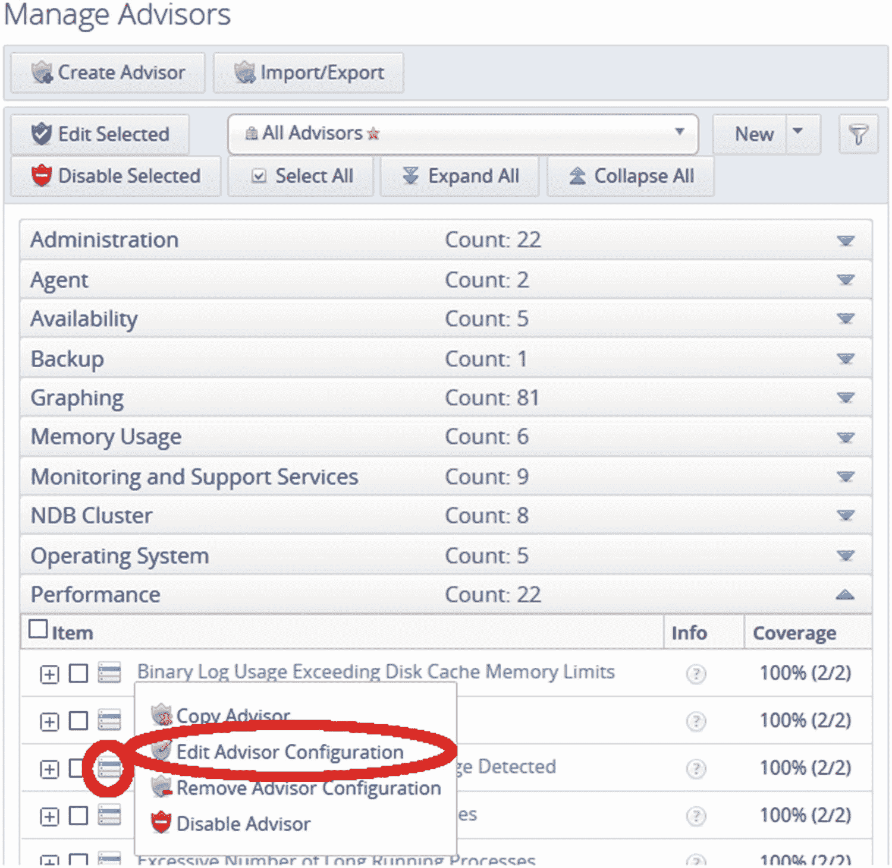

图 10-19

用于编辑指导配置的菜单

还可以使用指导项目左侧的+图标展开指导，这允许您编辑特定实例组或单个实例的指导。那个？ *Info* 列中的图标提供了附加信息，如评估的表达式或指导的数据源。还有图中未示出的附加信息。

### 时间序列图表

时间序列图是显示一段时间内指标的图表。这是所有监控解决方案的标准功能。您可以过滤要显示的图形，并更改要绘制的时间范围以及绘制样式。

图 [10-20](#Fig20) 显示了 timeseries graphs 页面的一部分，重点是访问过滤和绘图风格的控件。

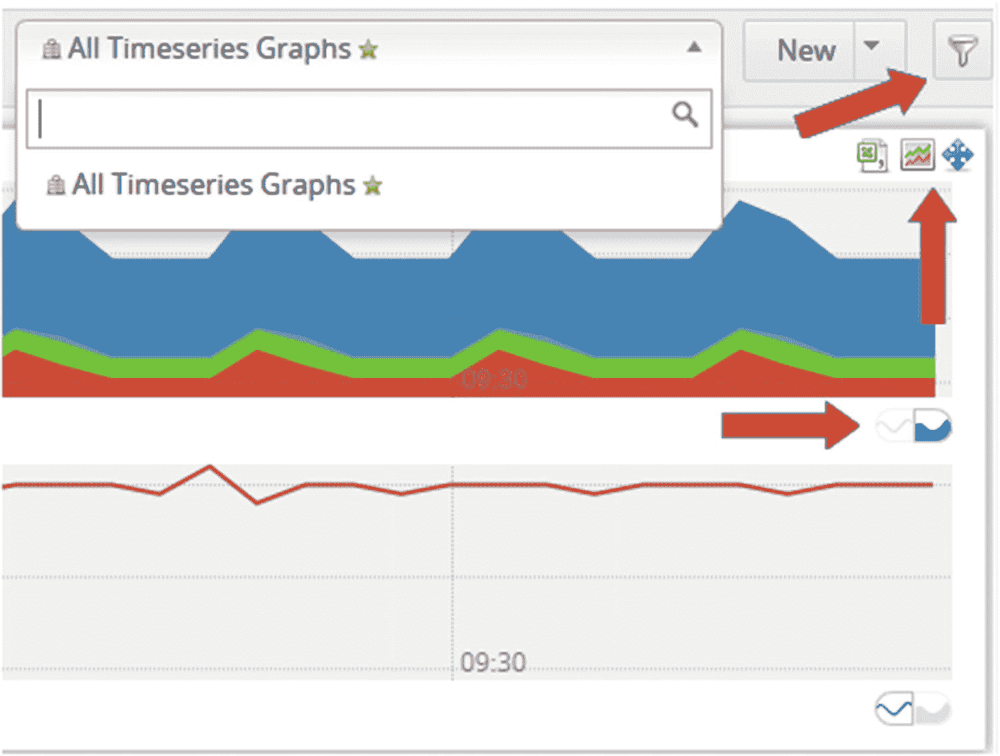

图 10-20

时间序列图

图表上方是选择显示哪些图表以及图表的时间范围的选项。屏幕截图左侧的搜索字段允许您在保存的时间序列组之间进行选择。默认情况下，有一个名为 *All Timeseries Graphs* 的组——顾名思义——包括所有适合实例过滤的时间序列图。

您可以使用屏幕截图右上角的漏斗图标来访问时间序列图表的选项。这将打开一个框架，允许您选择要显示的图表和要覆盖的时间范围。

每个图形下方的两个小按钮允许您在使用折线图和堆叠图模式之间切换。该屏幕截图显示了顶部图形中的堆叠模式和下部图形中的线条模式的示例。线路模式是默认模式。您还可以使用字段左侧的滑块(不包括在屏幕截图中)在保存的图表组之间进行选择，来更改图表的高度。

当您将鼠标悬停在图表上方时，图表上方的三个图标会变得可见，并允许您以 CSV 格式导出图表数据、以 PNG 图像打开图表或移动图表，从而允许您根据自己的需要对图表进行重新排序。在这种情况下，如果有两个组合在一起的图形，控件将应用于这两个图形。

更改图表时间范围的另一种方法是突出显示感兴趣的图表部分，并放大该部分。这还允许您转到查询分析器，检查在此期间执行了哪些查询。图 [10-21](#Fig21) 显示了一个在图表中突出显示时间帧的例子。

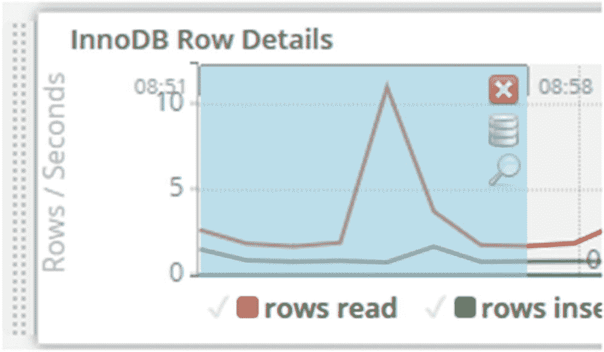

图 10-21

选择时间序列图的一部分

请注意，在突出显示区域的右上方，有三个图标来控制如何处理选择。框中的 X 放弃选择，数据库圆柱体在查询分析器中打开所选时间范围的图形，放大镜缩放时间序列图形以使用所选时间范围。

### 查询分析器

查询分析器是一个使 MySQL Enterprise Monitor 从其他监控解决方案中脱颖而出的特性。它允许您查看在给定时间段内对实例执行了哪些查询，这在调查性能问题时是非常宝贵的。

查询分析器页面分为三个区域。在顶部可以访问过滤选项，然后可以选择一个或多个图表，页面的其余部分是语句列表。图 [10-22](#Fig22) 显示了一个例子。

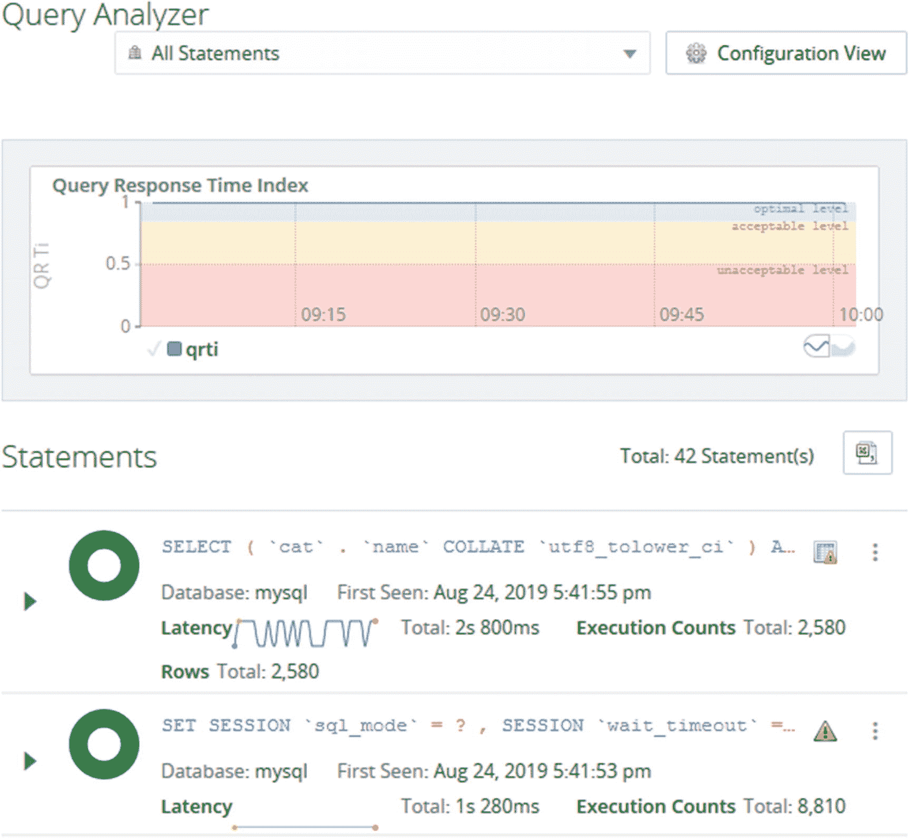

图 10-22

查询分析器

顶部的下拉框显示截图中的*所有语句*，允许您选择要显示语句的语句类型。默认情况下包括所有语句。右边是*配置视图*按钮，它带您到一个页面，您可以在这里配置查询分析器页面应该如何配置。这包括要覆盖的时间范围、要显示的图表、过滤选项以及每个语句要包含的信息。

默认情况下，查询分析器包括查询响应时间索引(QRTi)的图表。查询响应时间索引的定义以及如何使用将在第 [19](19.html) 章中介绍，在该章中，查询分析器用于寻找优化的候选对象。

MySQL 企业监视器之旅到此结束。我们鼓励您自己进一步探索用户界面。

## 摘要

本章简要介绍了 MySQL Enterprise Monitor，目的是让您安装它并监控一个 MySQL 实例。首先，讨论了体系结构和原理的概述。MySQL Enterprise Monitor 包含一个服务管理器，数据在其中聚合，您可以通过用户界面访问监控系统。对主机和实例的监控由代理完成。服务管理器中有一个内置的代理，您可以在 MySQL 实例的主机上安装其他代理。

概述之后是下载和安装说明。由于 MySQL Enterprise Monitor 是一款纯商业产品，您可以从 Oracle 软件交付云或 My Oracle Support 下载。使用安装程序完成安装。本章介绍了如何使用服务管理器安装程序的图形用户界面。

启动和停止服务管理器的基础是将其作为服务安装。在 Linux 和 Unix 上，您也可以将服务管理器安装为非 root 用户，在这种情况下，可以从安装目录中直接调用`service`命令使用的相同脚本。

添加要监控的实例有两种主要方式。如果安装代理来监视实例，代理将注册该实例。您还可以从服务管理器的用户界面添加实例。

最后，我们快速浏览了一下服务管理器的图形用户界面。重点是过滤您看到的实例数据和特性列表、时间序列图和查询分析器。这些特性中的几个将在本书的剩余部分用来演示监控。

下一章将介绍在后面章节中用到的另一个有用的工具:MySQL Workbench。