# 11.MySQL 工作台

MySQL Workbench 是 Oracle 的图形用户界面，用于查询和管理 MySQL 服务器。它可以被看作是使用 MySQL 的两把瑞士军刀之一，另一把是 MySQL Shell，将在下一章讨论。

MySQL Workbench 的主要特性是查询模式，在这种模式下可以执行查询。然而，还有几个其他功能，如性能报告、可视化解释、管理配置和检查模式的能力等等。

如果将 MySQL Workbench 与 MySQL Enterprise Monitor 进行比较，那么 MySQL Enterprise Monitor 专用于监控，是一个服务器解决方案，而 MySQL Workbench 是一个桌面解决方案，主要是一个与 MySQL 服务器协同工作的客户端。类似地，MySQL Workbench 中包含的监控都是特定的监控，而 MySQL Enterprise Monitor 作为一个服务器解决方案包含了对存储历史数据的支持。

本章将介绍 MySQL Workbench，并介绍其安装、基本用法以及如何创建 EER 图。性能报告和直观解释将在后面的章节中介绍。

Tip

如果你已经熟悉 MySQL Workbench，可以考虑跳过这一章或者略读。

## 装置

MySQL Workbench 的安装方式与其他 MySQL 程序相同，只是只支持使用软件包管理器(因此没有独立安装)。MySQL Workbench 版本号遵循 MySQL Server 版本，因此 MySQL Workbench 8.0.18 与 MySQL Server 8.0.18 同时发布。MySQL Workbench 版本支持在发布时仍在维护的 MySQL 服务器版本，因此 MySQL Workbench 8.0.18 支持连接到 MySQL 服务器 5.6、5.7 和 8。

Tip

最好使用最新的 MySQL Workbench 版本。你可以在 [`https://dev.mysql.com/doc/mysql-compat-matrix/en/`](https://dev.mysql.com/doc/mysql-compat-matrix/en/) 看到 MySQL 工具的兼容性。

本节将展示如何在 Microsoft Windows、“Enterprise Linux 7”(Oracle Linux、Red Hat Enterprise Linux 和 CentOS)以及 Ubuntu 19.10 上安装 MySQL Workbench 的示例。其他 Linux 平台在概念上类似于这两个 Linux 示例。

Tip

如果您是 MySQL 客户，建议从 My Oracle Support (MOS)中的 Patches & Updates 下载 MySQL Workbench。这将使您能够访问商业版的 MySQL Workbench，它具有一些额外的功能，如审计日志检查器和 MySQL 企业备份(MEB)的图形用户界面。

### 微软视窗软件

在 Microsoft Windows 上，安装 MySQL Workbench 的首选方式是使用 MySQL Installer for Windows。如果您安装了其他 MySQL 产品，您可能已经安装了 MySQL 安装程序，在这种情况下，您可以跳过这些说明的第一步，而是点击主屏幕上的*添加*，这将带您进入图 [11-5](#Fig5) 的位置。

可以从 [`https://dev.mysql.com/downloads/installer/`](https://dev.mysql.com/downloads/installer/) 下载 MySQL 安装程序。图 [11-1](#Fig1) 显示下载部分。

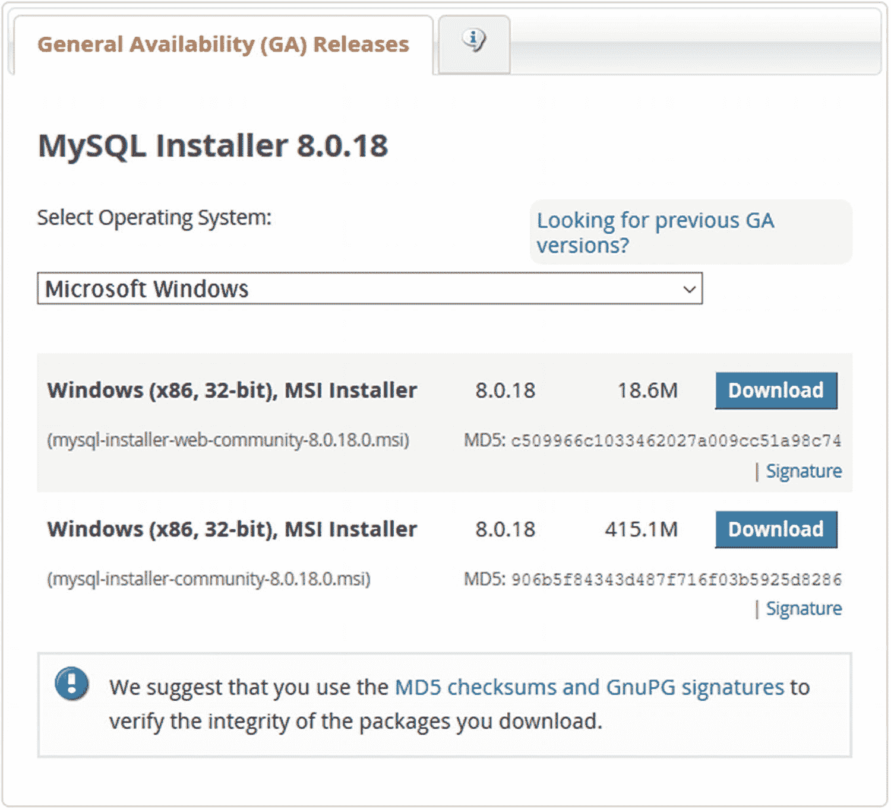

图 11-1

MySQL 工作台下载页面

安装程序有两种选择。第一个称为 web 安装程序(`mysql-installer-web-community-8.0.18.0.msi`)的只是 MySQL 安装程序，而第二个(`mysql-installer-community-8.0.18.0.msi`)也包括 MySQL 服务器。如果您还打算安装 MySQL Server，那么选择包含 MySQL 安装程序和 MySQL Server 的下载文件是有意义的，因为这样可以避免以后等待安装程序下载 MySQL Server 安装文件。此示例假设您选择了 web 安装程序。

你点击*下载*按钮进入下载。如果您没有登录，它将带您到开始下载页面，您可以在登录和立即开始下载之间进行选择。如图 [11-2](#Fig2) 所示。

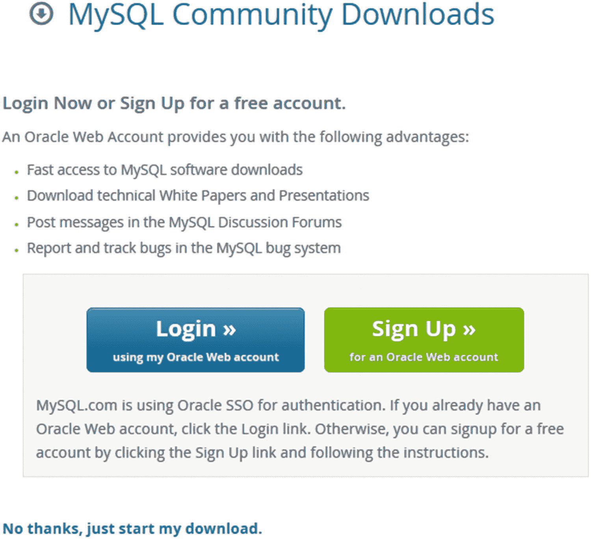

图 11-2

下载 MySQL Workbench 的第二步

如果您已经有帐户，您可以登录。否则，您可以选择注册 Oracle 帐户。您也可以选择不登录就下载安装程序，方法是单击*不，谢谢，只需启动我的下载*链接。

下载完成后，启动下载的文件。除了确认您将允许安装程序和 MySQL 安装程序修改已安装的程序之外，安装 MySQL 安装程序不需要任何操作。安装完成后，MySQL 安装程序会自动启动并检测已经使用 MSI 安装程序安装的 MySQL 程序，如图 [11-3](#Fig3) 所示。

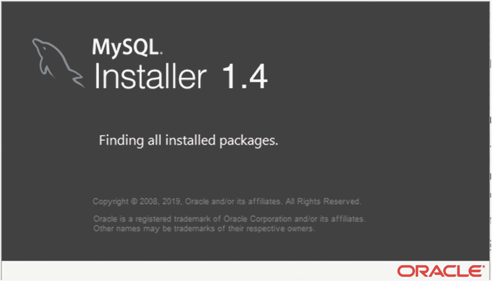

图 11-3

MySQL 安装程序检测以前安装的 MySQL 程序

如果您没有安装任何 MySQL 程序，则会出现一个屏幕，要求您确认是否同意许可条款。请在继续之前仔细阅读许可条款。如果您可以接受许可，请勾选*我接受许可条款*复选框，然后点击标有*下一个* ➤的按钮继续。

下一步是选择安装什么。设置类型选择屏幕如图 [11-4](#Fig4) 所示。


图 11-4

MySQL 安装程序安装类型选择器

您可以在几个包中进行选择，比如 developer bundle(称为 *Developer Default* )，它安装了开发环境中通常使用的产品。当您选择安装类型时，屏幕右侧的描述包括将要安装的产品列表。对于此示例，将使用自定义安装类型。

下一步是选择要安装的产品。使用如图 [11-5](#Fig5) 所示的选择器。


图 11-5

选择要安装的内容

您可以在应用下的可用产品列表中找到 MySQL Workbench。单击指向右侧的箭头，将 MySQL Workbench 添加到要安装的产品和功能列表中。随意选择附加产品；对于这本书，建议还包括 MySQL Shell。添加完所有需要的产品后，点击*下一步* ➤继续。

以下屏幕提供了将要安装的产品的摘要。点击*执行*开始安装。如果 MySQL 安装程序没有本地副本，安装过程包括下载产品。安装可能需要一段时间才能完成。完成后，点击*下一步* ➤继续。最后一个屏幕列出了已安装的程序，并让您选择启动 MySQL Workbench 和 MySQL Shell。点击*完成*关闭 MySQL 安装程序。

如果您稍后想要安装更多产品或执行升级或删除产品，您可以再次启动 MySQL 安装程序，这将带您进入 MySQL 安装程序主屏幕，如图 [11-6](#Fig6) 所示。

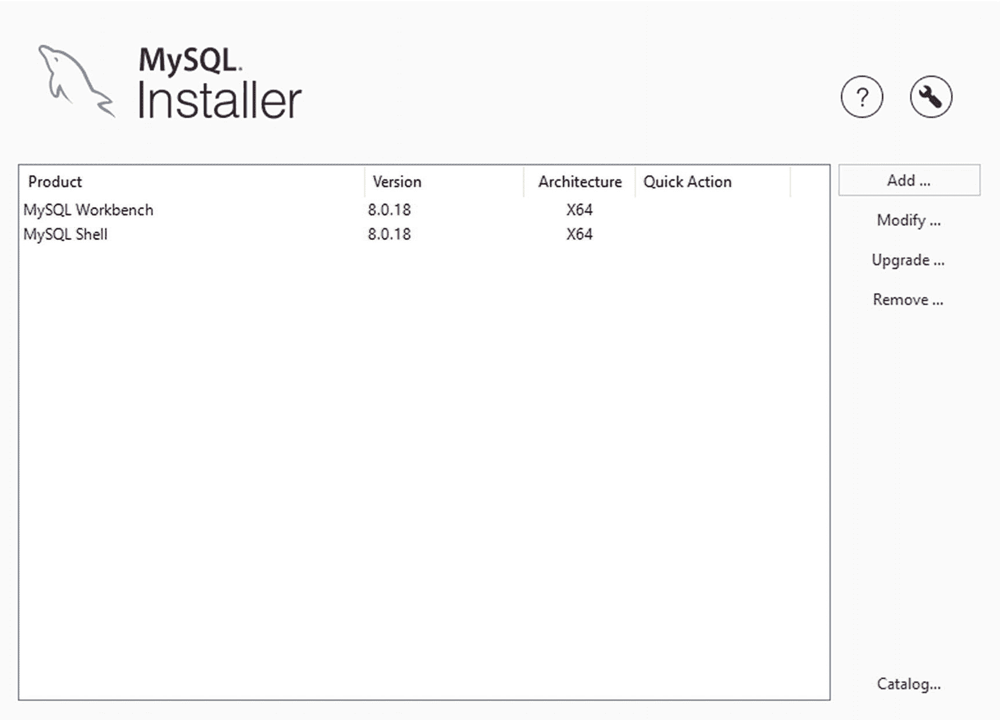

图 11-6

MySQL 安装程序主屏幕

您可以在屏幕的最右边选择想要执行的操作。这些行动是

*   **添加:**安装产品和功能。

*   **修改:**改变现有产品的安装。这主要对 MySQL 服务器有用。

*   **升级:**升级已经安装的产品。

*   **卸载:**卸载一个产品。

*   **目录:**更新 MySQL 安装程序的可用 MySQL 产品列表。

这五个动作允许您执行 MySQL 产品生命周期中所需的所有步骤。

### 企业版 Linux 7

如果您使用的是 Linux，您可以使用包管理器安装 MySQL Workbench。在 Oracle Linux、Red Hat Enterprise Linux 和 CentOS 7 上，首选的软件包管理器是`yum`，因为它将帮助解决您安装或升级的软件包的依赖性。MySQL 为其社区产品提供了一个 yum 知识库。这个例子将展示如何安装它并使用它来安装 MySQL Workbench。

您可以在 [`https://dev.mysql.com/downloads/repo/yum/`](https://dev.mysql.com/downloads/repo/yum/) 找到存储库定义的 URL。还有 APT 和 SUSE 的存储库。选择与您的 Linux 发行版相对应的文件，然后点击*下载*。图 [11-7](#Fig7) 显示了企业版 Linux 7 的文件。


图 11-7

Enterprise Linux 7 的存储库定义下载

如果您没有登录，它会将您带到第二个屏幕，就像在 Microsoft Windows 上安装 MySQL Workbench 的例子一样。这将允许您登录到您的 Oracle Web 帐户，创建一个帐户，或在不登录的情况下下载。或者下载 RPM 文件并保存在您想要安装的目录中，或者右键单击*下载*按钮(如果您已登录)或*不，谢谢，只需启动我的下载*链接并复制 URL，如图 [11-8](#Fig8) 所示。


图 11-8

将链接复制到存储库安装文件

您现在可以安装清单 [11-1](#PC1) 中所示的存储库定义。

```sql
shell$ wget https://dev.mysql.com/get/mysql80-community-release-el7-3.noarch.rpm
...
HTTP request sent, awaiting response... 200 OK
Length: 26024 (25K) [application/x-redhat-package-manager]
Saving to: 'mysql80-community-release-el7-3.noarch.rpm'

100%[=========================>] 26,024      --.-K/s   in 0.001s

2019-08-18 12:13:47 (20.6 MB/s) - 'mysql80-community-release-el7-3.noarch.rpm' saved [26024/26024]

shell$ sudo yum install mysql80-community-release-el7-3.noarch.rpm
Loaded plugins: langpacks, ulninfo
Examining mysql80-community-release-el7-3.noarch.rpm: mysql80-community-release-el7-3.noarch
Marking mysql80-community-release-el7-3.noarch.rpm to be installed
Resolving Dependencies
--> Running transaction check
---> Package mysql80-community-release.noarch 0:el7-3 will be installed
--> Finished Dependency Resolution

Dependencies Resolved

=================================================================
 Package
      Arch   Version
                   Repository                               Size
=================================================================
Installing:
 mysql80-community-release
      noarch el7-3 /mysql80-community-release-el7-3.noarch  31 k

Transaction Summary
=================================================================
Install  1 Package

Total size: 31 k
Installed size: 31 k
Is this ok [y/d/N]: y
Downloading packages:
Running transaction check
Running transaction test
Transaction test succeeded
Running transaction
  Installing : mysql80-community-release-el7-3.noarch        1/1
  Verifying  : mysql80-community-release-el7-3.noarch        1/1

Installed:
  mysql80-community-release.noarch 0:el7-3

Complete!

Listing 11-1Installing the MySQL community repository

```

MySQL Workbench 需要 EPEL 仓库中的一些包。在 Oracle Linux 7 上，您可以像这样启用它

```sql
sudo yum install oracle-epel-release-el7

```

在 Red Hat Enterprise Linux 和 CentOS 上，您需要从 Fedora 下载存储库定义:

```sql
wget https://dl.fedoraproject.org/pub/epel/epel-release-latest-7.noarch.rpm

sudo yum install epel-release-latest-7.noarch.rpm

```

您现在可以安装 MySQL Workbench 了，如清单 [11-2](#PC4) 所示。

```sql
shell$ sudo yum install mysql-workbench
...
Dependencies Resolved

================================================================
 Package        Arch   Version      Repository             Size
================================================================
Installing:
 mysql-workbench-community
                x86_64 8.0.18-1.el7 mysql-tools-community  26 M

Transaction Summary
================================================================
Install  1 Package

Total download size: 26 M
Installed size: 116 M
Is this ok [y/d/N]: y
Downloading packages:
warning: /var/cache/yum/x86_64/7Server/mysql-tools-community/packages/mysql-workbench-community-8.0.18-1.el7.x86_64.rpm: Header V3 DSA/SHA1 Signature, key ID 5072e1f5: NOKEY
Public key for mysql-workbench-community-8.0.18-1.el7.x86_64.rpm is not installed
mysql-workbench-community-8.0.18-1\.         |  31 MB  00:14
Retrieving key from file:///etc/pki/rpm-gpg/RPM-GPG-KEY-mysql
Importing GPG key 0x5072E1F5:
 Userid     : "MySQL Release Engineering <mysql-build@oss.oracle.com>"
 Fingerprint: a4a9 4068 76fc bd3c 4567 70c8 8c71 8d3b 5072 e1f5
 Package    : mysql80-community-release-el7-3.noarch (@/mysql80-community-release-el7-3.noarch)
 From       : /etc/pki/rpm-gpg/RPM-GPG-KEY-mysql
Is this ok [y/N]: y
Running transaction check
Running transaction test
Transaction test succeeded
Running transaction
  Installing : mysql-workbench-community-8.0.18-1.el7.x86   1/1
  Verifying  : mysql-workbench-community-8.0.18-1.el7.x86   1/1

Installed:
  mysql-workbench-community.x86_64 0:8.0.17-1.el7

Complete!

Listing 11-2Installing MySQL Workbench on Enterprise Linux 7

```

您的输出看起来可能会有所不同，例如，根据您已经安装的包，可能会引入依赖项。第一次从 MySQL 数据库安装软件包时，会要求您接受用于验证下载的软件包的 GPG 密钥。如果您从 Fedora 安装了 EPEL 存储库，那么您还需要接受来自该存储库的 GPG 密钥。

### Debian 和 Ubuntu

在 Debian 和 Ubuntu 上安装 MySQL Workbench 遵循与上例相同的原则。对于这里演示的步骤，将使用 Ubuntu 19.10。

Tip

参见 [`https://dev.mysql.com/doc/mysql-apt-repo-quick-guide/en/`](https://dev.mysql.com/doc/mysql-apt-repo-quick-guide/en/) 获取使用 MySQL APT 库的完整文档。

对于 Debian 和 Ubuntu，需要安装 MySQL APT 库，定义文件可以从 [`https://dev.mysql.com/downloads/repo/apt/`](https://dev.mysql.com/downloads/repo/apt/) 下载。在撰写本文时，只有一个文件可用——见图[11-9](#Fig9)——它是独立于架构的，适用于所有支持的 Debian 和 Ubuntu 版本。


图 11-9

APT 存储库配置文件

如果您没有登录，您将被带到一个屏幕，您可以在登录和立即开始下载之间进行选择。要么下载 DEB 包，要么右键点击*下载*按钮(如果你已经登录)或者*不用谢，直接启动我的下载*链接，复制网址如图 [11-10](#Fig10) 所示。

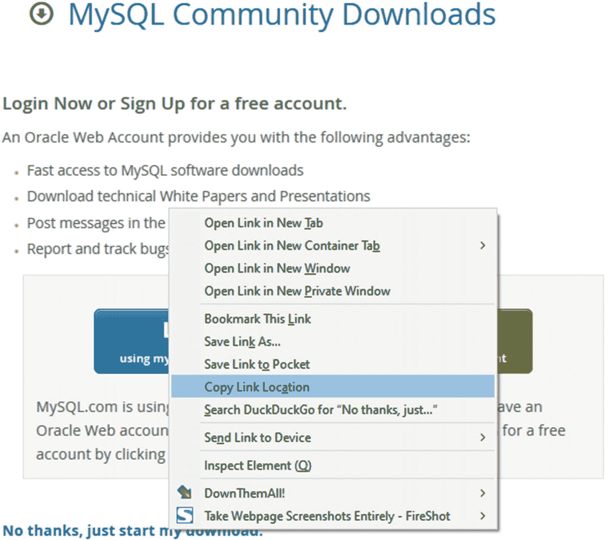

图 11-10

将链接复制到存储库安装文件

您现在可以安装 MySQL 存储库，如清单 [11-3](#PC5) 所示。

```sql
shell$ wget https://dev.mysql.com/get/mysql-apt-config_0.8.14-1_all.deb
...
Connecting to repo.mysql.com (repo.mysql.com)|23.202.169.138|:443... connected.
HTTP request sent, awaiting response... 200 OK
Length: 35564 (35K) [application/x-debian-package]
Saving to: 'mysql-apt-config_0.8.14-1_all.deb'

mysql-apt-config_0\. 100%[==================>]  34.73K  --.-KB/s    in 0.02s

2019-10-26 17:16:46 (1.39 MB/s) - 'mysql-apt-config_0.8.14-1_all.deb' saved [35564/35564]

shell$ sudo dpkg -i mysql-apt-config_0.8.14-1_all.deb
Selecting previously unselected package mysql-apt-config.
(Reading database ... 161301 files and directories currently installed.)
Preparing to unpack mysql-apt-config_0.8.14-1_all.deb ...
Unpacking mysql-apt-config (0.8.14-1) ...
Setting up mysql-apt-config (0.8.14-1) ...
Warning: apt-key should not be used in scripts (called from postinst maintainerscript of the package mysql-apt-config)
OK

Listing 11-3Installing the DEB package definition

```

在第二步中(`dpkg -i`命令)，您可以选择哪些 MySQL 产品应该可以通过存储库获得。此设置的屏幕如图 [11-11](#Fig11) 所示。


图 11-11

MySQL APT 存储库的包配置

默认情况下，启用 MySQL 服务器和集群以及工具和连接器。对于 MySQL 服务器和集群，您还可以选择想要使用的版本，默认值为 8。为了安装 MySQL Shell，你需要确保 *MySQL 工具&连接器*被设置为启用。完成更改后，选择*确定*。

在开始使用存储库之前，您需要对`apt-get`执行更新命令:

```sql
shell$ sudo apt-get update
Hit:1 http://repo.mysql.com/apt/ubuntu eoan InRelease
Hit:2 http://au.archive.ubuntu.com/ubuntu eoan InRelease
Hit:3 http://au.archive.ubuntu.com/ubuntu eoan-updates InRelease
Hit:4 http://au.archive.ubuntu.com/ubuntu eoan-backports InRelease
Hit:5 http://security.ubuntu.com/ubuntu eoan-security InRelease
Reading package lists... Done

```

现在可以使用 apt-get 的 install 命令安装 MySQL 产品。清单 [11-4](#PC7) 展示了一个安装 MySQL Workbench 的例子(注意包名是`mysql-workbench-community`——结尾的“-community”很重要)。

```sql
shell$ sudo apt-get install mysql-workbench-community
Reading package lists... Done
Building dependency tree
Reading state information... Done
...
Setting up mysql-workbench-community (8.0.18-1ubuntu19.10) ...
Setting up libgail-common:amd64 (2.24.32-4ubuntu1) ...
Processing triggers for libc-bin (2.30-0ubuntu2) ...
Processing triggers for man-db (2.8.7-3) ...
Processing triggers for shared-mime-info (1.10-1) ...
Processing triggers for desktop-file-utils (0.24-1ubuntu1) ...
Processing triggers for mime-support (3.63ubuntu1) ...
Processing triggers for hicolor-icon-theme (0.17-2) ...
Processing triggers for gnome-menus (3.32.0-1ubuntu1) ...

Listing 11-4Installing MySQL Workbench from the APT repository

```

输出非常详细，包括安装 MySQL Workbench 所需的其他包的更改列表。软件包列表取决于您已经安装了什么。

您现在可以开始使用 MySQL Workbench 了。

## 创建连接

第一次启动 MySQL Workbench 时，您需要定义到 MySQL 服务器实例的连接。如果您安装了 MySQL 通知程序 <sup>[1](#Fn1)</sup> ，MySQL Workbench 将自动为 root 用户创建一个到 MySQL 通知程序所监控的每个实例的连接。

您也可以根据需要创建连接。一种选择是从 MySQL Workbench connections 屏幕上进行，如图 [11-12](#Fig12) 所示。

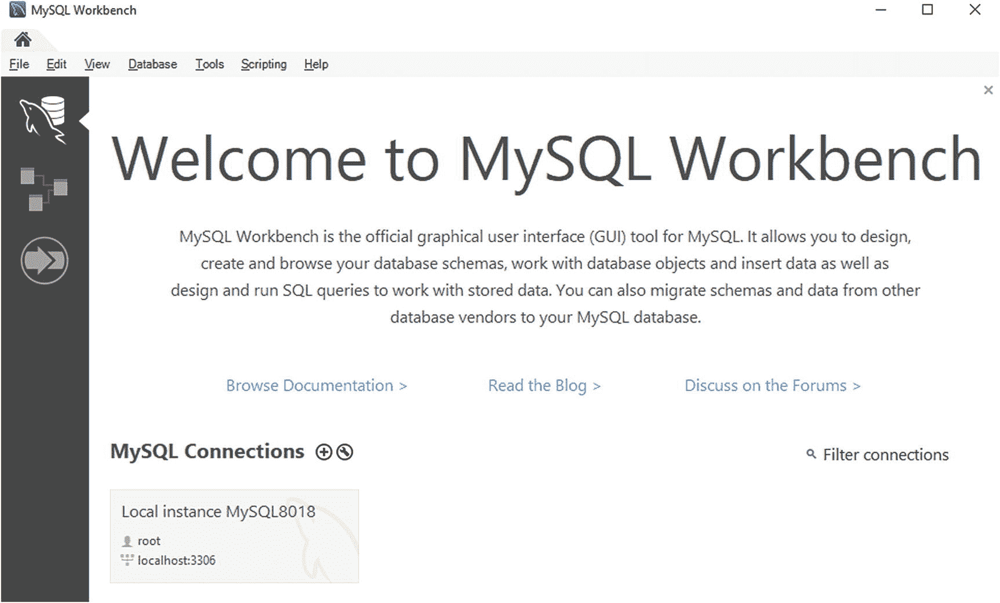

图 11-12

MySQL 工作台连接屏幕

点击左上角的图标可以访问连接屏幕，该图标显示了一个带有 dolphin 的数据库。下面的图标带有由线连接的表，将带您进入数据库建模功能，三个图标中的最后一个图标打开数据迁移功能的选项卡。

该屏幕截图显示了 connections 屏幕，其中包含欢迎消息和一个已经存在的连接。您可以右键单击连接来访问连接选项，包括打开连接(创建到 MySQL 实例的连接)、编辑连接、将其添加到组中等等。

您可以通过点击 *MySQL 连接*右侧的+来添加一个新连接。配置连接的对话框如图 [11-13](#Fig13) 所示。创建新连接和编辑现有连接的对话框非常相似。

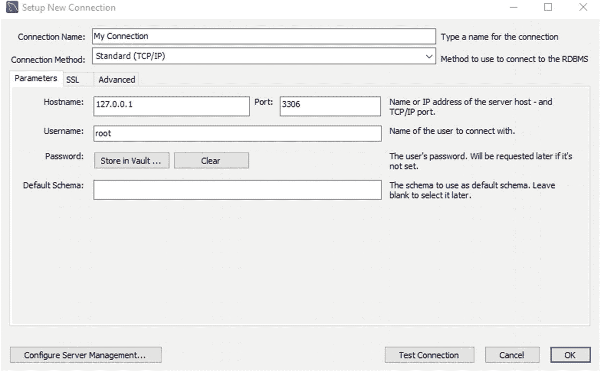

图 11-13

用于创建新连接的对话框

您可以用自己选择的名称来命名连接。它是一个自由格式的字符串，只是用来更容易地识别连接的目的。剩下的选项都是常用的连接选项。

建立连接后，您可以在连接屏幕上双击它来创建连接。

## 使用 MySQL 工作台

MySQL Workbench 中最常用的特性是执行查询的能力。这是通过“查询”选项卡完成的，除了能够执行查询之外，该选项卡还包括几个功能。这些特性包括显示结果集、获得名为 Visual Explain 的查询计划的可视化表示、获得上下文帮助、重新格式化查询等等。本节将从概述开始，介绍一些特性。

### 概观

“查询”选项卡包含两个区域，一个是编辑器，您可以在其中编写查询，另一个是查询结果。还支持显示上下文帮助和查询统计。从技术上讲，这两个附加区域不是查询选项卡的一部分，但是由于它们通常与查询选项卡一起使用，所以这里也将对它们进行讨论。

图 [11-14](#Fig14) 显示了 MySQL Workbench 的查询选项卡和最重要的特性编号。

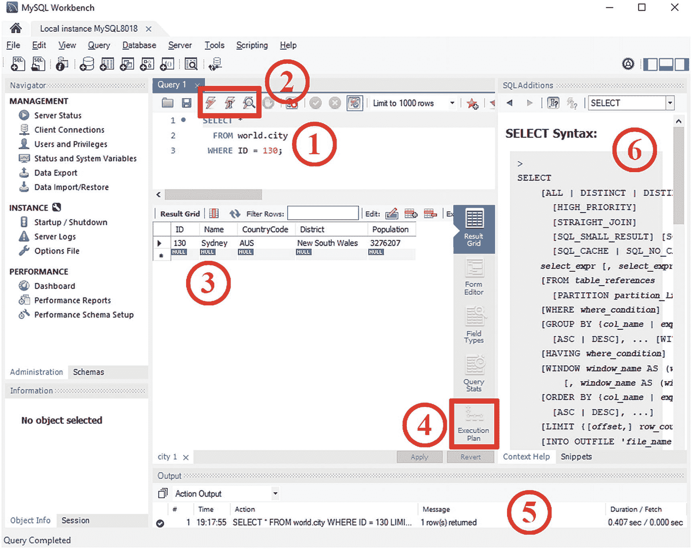

图 11-14

MySQL 工作台和查询选项卡

标记为①的区域是您编写查询的地方。您可以在这里保存几个查询，MySQL Workbench 会保存它们，所以当您再次打开连接时，它们会被恢复。这使得存储最常用的查询非常方便。

您可以使用标记为②的三个闪电图标之一来执行一个或多个查询。左侧图标是一个简单的闪电符号，用于执行在查询编辑器部件中选择的一个或多个查询。这与使用键盘快捷键 Ctrl+Shift+Enter 相同。带有闪电符号和光标的中间图标执行光标所在位置的查询。使用此图标等同于在编辑器中使用快捷键 Ctrl+Enter。第三个图标在闪电符号前面有一个放大镜，它为当前光标所在的查询创建表单中的查询计划。显示查询计划的默认方式是可视化的解释图。也可以使用快捷键 Ctrl+Alt+X 来获取查询计划。

结果显示在查询编辑器③的下方，您可以使用查询结果右侧的项目在几种格式之间进行选择。最后一项是*执行计划* ④，如果您直接从查询编辑器中请求，它会以相同的方式显示查询的查询计划。

query 选项卡下面是 output frame ⑤，默认情况下，它显示上次执行的查询的统计信息。这包括执行查询的时间、查询、找到的行数以及执行查询需要多长时间。右边是一个带有 SQL 附加物⑥的框架，默认显示上下文帮助。您可以启用自动上下文帮助，或者使用帮助文本上方的图标手动请求帮助。

### 配置

MySQL Workbench 有几个设置可以更改，从颜色到行为和程序路径，比如 MySQL Workbench 依赖的`mysqldump`。

有几种方法可以达到如图 [11-15](#Fig15) 所示的设置。该图显示了 MySQL Workbench 窗口的左上和右上部分。

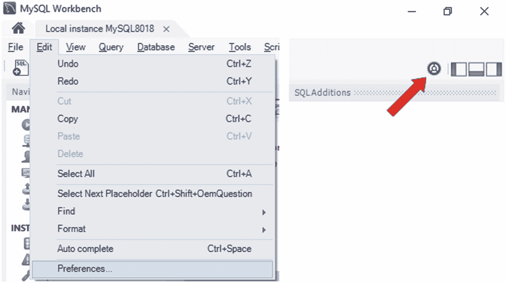

图 11-15

访问 MySQL 工作台首选项

在左侧，您可以通过使用*编辑*并转到底部的*首选项*项目，从菜单中获得首选项。或者，您可以单击窗口右侧的齿轮图标。无论哪种方式，您都会看到如图 [11-16](#Fig16) 所示的首选项弹出窗口。

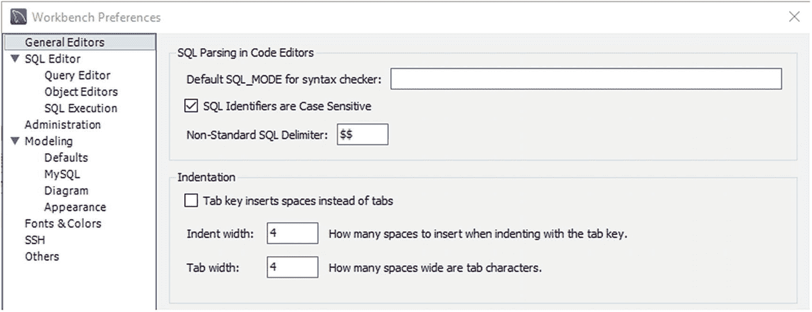

图 11-16

MySQL 工作台首选项

*通用编辑器*设置包括诸如语法检查器考虑的 SQL 模式以及是否使用空格或制表符进行缩进的设置。 *SQL 编辑器*设置包括是否使用安全设置、是否保存编辑器、编辑器和查询页签的一般行为。如果您不想使用捆绑的二进制文件，则*管理*设置指定要使用的路径，包括用于`mysqldump`的路径。*建模*设置用于数据库建模功能。*字体&颜色*设置允许你改变 MySQL 工作台的视觉外观。当您使用需要 SSH 连接到远程主机的功能时，将使用 *SSH* 设置。最后，*其他*设置包括一些不适合其他类别的设置，例如是否应在连接的开始屏幕上显示欢迎消息。

这些设置包括安全设置。那些是什么？

### 安全设置

MySQL Workbench 默认启用了两个安全设置，以帮助防止更改或删除表中的所有行，并避免获取太多行。安全设置意味着`UPDATE`和`DELETE`语句如果没有`WHERE`子句就会被阻塞，而`SELECT`语句添加了`LIMIT 1000`(可以配置最大行数)。用于`UPDATE`和`DELETE`语句的`WHERE`子句不能是无关紧要的子句。

Caution

不要因为启用了安全设置就自满。使用`WHERE`子句时，`UPDATE`和`DELETE`语句仍然会造成很大损害，使用`LIMIT 1000`的`SELECT`查询仍然会要求 MySQL 检查更多的行。

通常最好是启用这些设置，但是对于某些查询，您需要更改这些设置，以便它们按预期工作。如前所述，可以在设置中更改`SELECT`限值。在 *SQL 编辑器*下的 *SQL 执行*子菜单下设置限制。或者，更简单的方法是使用编辑器上方的下拉框，如图 [11-17](#Fig17) 所示。


图 11-17

改变`SELECT`极限

以这种方式更改限制会更新相同的设置，就像您浏览首选项一样。

可以在最下面的 *SQL 编辑器*设置中更改`UPDATE`和`DELETE`安全设置。除非您真的需要更新或删除表中的所有行，否则建议保持该状态。请注意，禁用设置需要重新连接。

### 重新格式化查询

MySQL Workbench 的一个很好的特性是查询美化工具，它通常不会引起太多关注。这对于查询调优也很有用，因为格式良好的查询可以更容易理解查询正在做什么。

查询美化器接受一个查询，将选择列表、表和过滤器拆分成单独的行，并添加缩进。图 [11-18](#Fig18) 显示了一个例子。

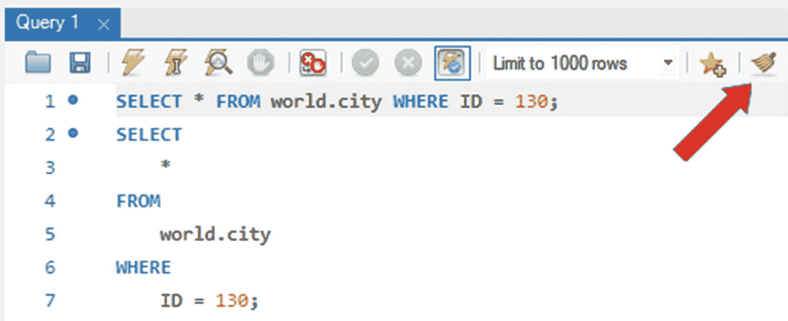

图 11-18

查询美化功能

第一个查询是原始查询，整个查询在一行中。第二个查询是重新格式化的查询。对于像本例中这样的简单查询，美化没有什么价值，但是对于更复杂的查询，它可以使查询更容易阅读。

默认情况下，美化包括将 SQL 关键字改为大写。您可以在首选项中的 *SQL 编辑器*设置的*查询编辑器*子菜单中更改这是否应该发生。

## 能效比图表

最后一个要探讨的特性是对模式逆向工程和创建增强的实体关系(EER)图的支持。这是了解您正在使用的模式的一个有用的方法。如果已经定义了外键，MySQL Workbench 将使用这些定义将表链接在一起。

你可以从*数据库*菜单选项启动逆向工程向导，然后选择*逆向工程*。或者，Ctrl+R 键盘组合也可以带您去那里。如图 [11-19](#Fig19) 所示。

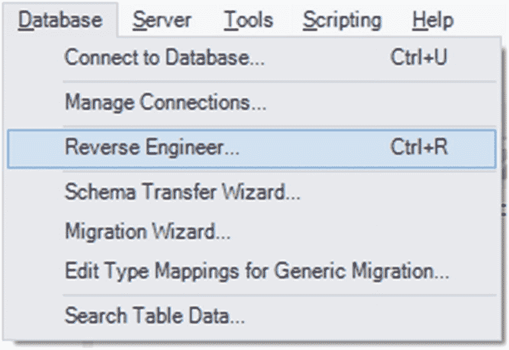

图 11-19

打开逆向工程特征

该向导将引导您完成导入模式的步骤，首先选择要使用的存储连接，或者手动配置连接。下一步是连接并导入第三步中显示的可用模式列表。在这里，您选择一个或多个模式进行逆向工程，如图 [11-20](#Fig20) 所示。


图 11-20

选择要实施反向工程的架构

在这个例子中，选择了`world`模式。接下来的步骤获取模式对象，并允许您过滤要包含的对象。最后，对象被导入并放置在图中，并显示确认信息。由此产生的能效比图如图 [11-21](#Fig21) 所示。

Tip

如果 MySQL Workbench 在创建图表时崩溃，尝试打开菜单中的编辑➤配置… ➤建模，并选中*强制使用基于软件的 EER 图表渲染*选项。

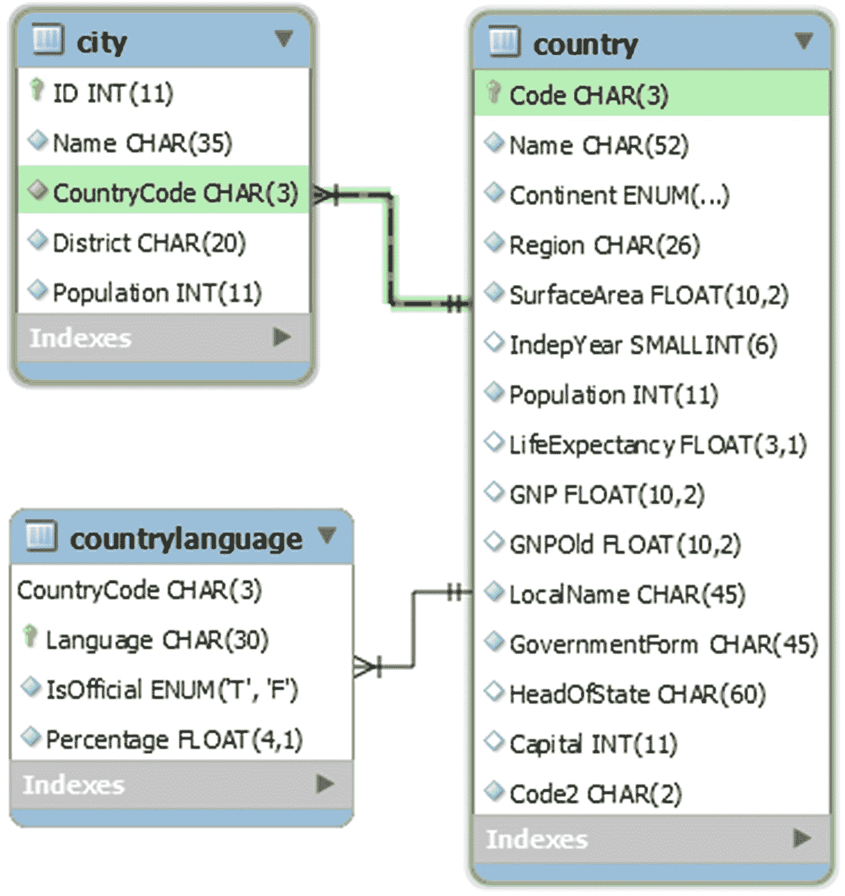

图 11-21

`world`数据库的 EER 图

该图显示了`world`数据库中的三个表。当鼠标悬停在某个表上方时，对于子表，与其他表的关系将以绿色突出显示，对于父表，以蓝色突出显示。这允许您快速探索表之间的关系，从而在您需要调优查询时获得至关重要的知识。

## 摘要

本章介绍了 MySQL Workbench，它是 MySQL 的图形用户界面解决方案。展示了如何安装 MySQL Workbench 和创建连接。然后给出了主查询视图的概述，并展示了如何配置 MySQL Workbench。默认情况下，如果没有真正的`WHERE`子句，就不能执行`UDPATE`和`DELETE`语句，并且`SELECT`查询被限制为 1000 行。

讨论的两个特性是查询美化和 EER 图。这些不是唯一的特性，后面的章节将展示性能报告和可视化解释查询计划图的例子。

下一章将讨论 MySQL Shell，它是 MySQL 提供的两把“瑞士军刀”中的第二把。

<aside aria-label="Footnotes" class="FootnoteSection" epub:type="footnotes">Footnotes [1](#Fn1_source)

[T2`www.mysql.com/why-mysql/windows/notifier/`](https://www.mysql.com/why-mysql/windows/notifier)

 </aside>