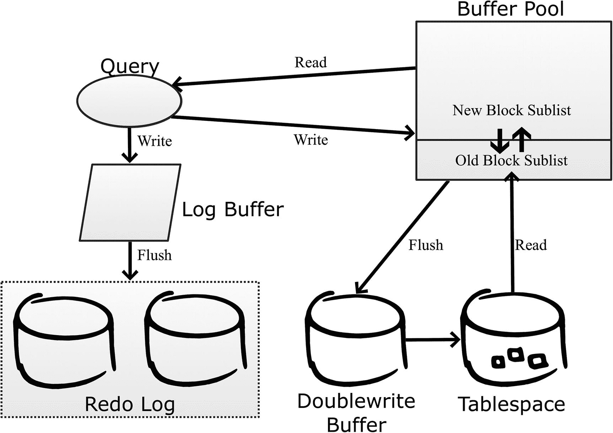
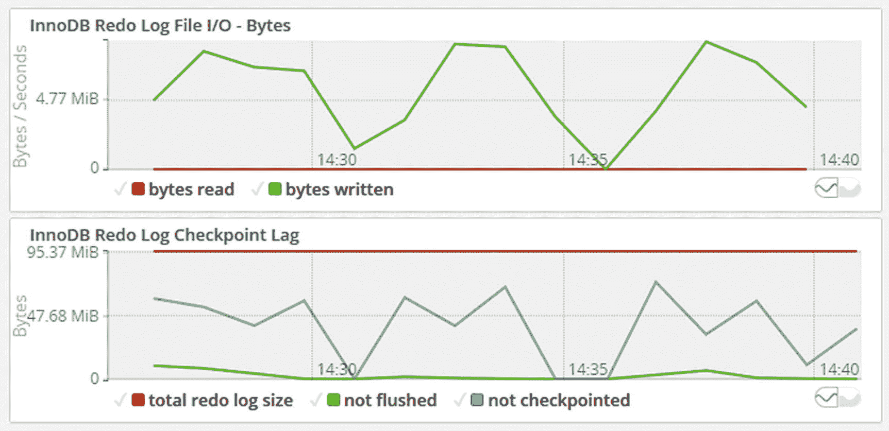

# 23.配置

在本书的第四部分中，有几个影响 MySQL 行为的配置选项的例子。这些选项包括字符集和排序规则的选择、如何创建索引统计信息、优化器应该如何工作等等。还有其他直接或间接影响查询性能的选项。本章将考虑其他地方没有涉及到的最常用的选项，以及配置 MySQL 时的一些一般注意事项。

本章从一些关于更改配置的“最佳实践”开始。接下来的部分是关于 InnoDB、查询缓冲区和内部临时表的。

## 最佳实践

当您着手进行配置更改时，有必要记住一些原则，这些原则可以让您更成功地进行配置更改。将讨论的最佳实践包括以下内容:

*   警惕最佳实践。

*   使用监控来验证效果。

*   一次更改一个选项。

*   做出相对较小的增量变化。

*   越少越好。

*   请确保您了解该选项的作用。

*   考虑一下副作用。

最佳实践列表的第一项是对最佳实践保持警惕，这听起来可能有点保守。意思是，当你看到一些建议时，你不应该直接跳到前面去应用。

没有两个系统是完全相同的，因此，虽然一个建议通常可能是好的，但您仍然需要考虑它是否也适用于您的系统。另一个问题是查看适用于旧版本 MySQL 或 8 GiB 内存太多的时候的建议。如果你用谷歌搜索一些设置，你可能会看到很多年前写的推荐。类似地，一段时间前对您的系统有效的建议可能会由于应用工作负载的变化而不再有效。最后，即使某个建议会提高系统的性能，也可能会有副作用，比如丢失已提交的更改的风险，这是您无法接受的。

Tip

警惕最佳实践的建议也适用于本书中的建议。始终考虑它们如何应用于您的系统。

那么，您应该如何处理配置变更呢？应用第 [2](02.html) 章中描述的原则。图 [23-1](#Fig1) 概括了这些步骤。


图 23-1

性能调整生命周期

您首先定义问题是什么，然后通过您的监控系统或通过定时查询或类似方式收集基线。基线也可以是可观测量的组合。然后你可以定义优化的目标。很重要的一点是，你要定义什么是足够好的，否则你永远也做不完。接下来的步骤是确定原因，并据此找到解决方案。最后，您实施解决方案，并通过与基线进行比较来验证效果。如果问题没有解决，或者你已经确定了多个问题，你可以重新开始。

监控在这个过程中非常重要，因为它既用于定义问题，收集基线，又用于验证效果。如果跳过这些步骤，您就不知道您的解决方案是否有效，也不知道它是否会影响其他查询。

当你决定一个解决方案时，尽可能小的改变。这既适用于您打开旋钮的配置选项的数量，也适用于您旋转旋钮的程度。如果您一次更改多个选项，您将无法衡量每个更改的效果。例如，两个变化可能会相互抵消，所以当其中一个变化非常有效，而另一个使情况变得更糟时，您认为解决方案不起作用。

配置选项通常也有一个最佳点。如果设置太小，选项所代表的功能就不能充分发挥作用。如果设置太大，特性的开销会变得比好处更糟。在这两者之间，您可以在开销有限的情况下获得特性优势的最佳组合。如图 [23-2](#Fig2) 所示。


图 23-2

期权价值和业绩之间的典型关系

通过微小的增量变化，你可以最大化找到最佳点的机会。

这与下一点有关:小往往更好。例如，仅仅因为您有足够的内存来增加每个查询或每个连接的缓冲区，并不意味着增加缓冲区大小会使查询更快。这当然取决于这一原则适用范围的选择。对于 InnoDB 缓冲池的大小，最好使用相对较大的缓冲区，因为它有助于减少磁盘 I/O 并从内存中提供数据。关于缓冲池需要记住的一个关键点是，内存分配只在 MySQL 启动和动态增加缓冲池大小时才会发生。但是，对于像连接缓冲区这样的缓冲区，可能会为单个查询分配多次，分配缓冲区的巨大开销可能会成为一个问题。这将在“查询缓冲区”一节中进一步讨论在所有情况下，对于与资源相关的选项，您需要记住分配给一个功能的资源不能用于其他功能。

“越少越好”的概念既适用于配置选项的最佳值，也适用于您要优化的选项数量。您在配置文件中设置的选项越多，您的配置文件就变得越混乱，并且越难保持对已更改内容及其原因的概述。(这也有助于按功能对设置进行分组，例如，将所有 InnoDB 设置放在一起。)如果您习惯于包含设置为默认值的选项，最好还是不要包含这些选项，因为包含这些选项意味着您将错过对默认值的更改，这些更改是作为优化默认配置的一部分来实现的，以反映 MySQL 内部的更改或标准硬件的更改。

Note

在 MySQL 5.6 和更高版本中，已经做了大量工作来改进 MySQL 配置选项的默认值。基于开发团队的测试以及 MySQL 支持团队、客户和社区成员的反馈，这些变化主要发生在主要版本之间。

建议开始时设置尽可能少的选项。您很可能想要设置 InnoDB 缓冲池、重做日志以及可能的表缓存的大小。您可能还希望设置一些路径和端口，并且可能要求启用一些功能，如全局事务标识符(GTIDs)或组复制。除此之外，只根据观察做出改变。

Tip

从最小配置开始，只设置 InnoDB 缓冲池和重做日志、路径和端口的大小，并启用所需的功能。否则，仅根据观察结果进行配置更改。

列表中的最后两点是相关的:确保您理解选项的作用，并考虑副作用。了解该选项的作用有助于您确定该选项对您的案例是否有用，以及该选项可能具有哪些其他效果。作为一个例子，考虑`sync_binlog`选项。这表明二进制日志的更新应该多久同步到磁盘。在 MySQL 8 中，默认情况下是每次提交时都进行同步，这对于同步性能较差的磁盘来说会显著影响查询性能。因此，很容易将`sync_binlog`设置为 0，这将禁用强制同步；但是，副作用可以接受吗？如果您不同步这些更改，那么它们只会存在于内存中，直到有其他东西(例如内存被其他人使用)强制进行同步。这意味着如果 MySQL 崩溃，那么更改就会丢失，如果您有一个副本，您将不得不重建它。这可以接受吗？

即使您可以接受潜在的丢失二进制日志事件，使用`sync_binlog = 0`还有一个更微妙的副作用。仅仅因为事务提交时没有发生同步并不意味着它永远不会发生。二进制日志的最大大小是 1gb(`max_binlog_size`选项)加上最后一个事务的大小，旋转二进制日志意味着旧的二进制日志被刷新到磁盘。如今，这通常意味着 MySQL 将结束写 1 GiB，然后一次全部刷新。即使在高速磁盘上，写出一千兆字节的数据也需要相当长的时间。与此同时，MySQL 不能执行任何提交，因此任何发出提交的连接(无论是隐式的还是显式的)都将停止，直到同步完成。这可能会让人感到意外，而且拖延的时间可能会长到让最终用户(可能是客户)感到不安。本书的作者已经看到了在几秒到半分钟的范围内由二进制日志旋转引起的提交延迟。简而言之，`sync_binlog = 0`提供了总体最高的吞吐量和平均提交延迟，但是`sync_binlog = 1`提供了最佳的数据安全性和最可预测的提交延迟。

本章的其余部分提供了一些与查询调优相关的选项的建议，这些选项最常需要更改。

## InnoDB 概述

假设所有涉及表的查询都与 InnoDB 存储引擎交互，那么花些时间查看 InnoDB 参数的配置是很重要的。这些包括 InnoDB 缓冲池的大小和重做日志的大小——这两个配置需要针对大多数生产系统进行调整。

在讨论配置选项之前，有必要回顾一下数据如何在表空间和缓冲池之间流动，以及如何通过重做日志系统返回表空间。图 [23-3](#Fig3) 显示了该流程的简单概述。



图 23-3

InnoDB 数据流

当查询请求数据时，总是从缓冲池中读取数据。如果数据不在缓冲池中，就从表空间中获取。InnoDB 将缓冲池分为两部分:旧块子列表和新块子列表。数据总是被读入整页的旧块子列表的头(顶部)。如果再次需要来自同一页面的数据，该数据将被移动到新块子列表中。这两个子列表都使用*最近最少使用的* (LRU)原则来确定在需要为新页面腾出空间时应该删除哪些页面。页面从旧块子列表的缓冲池中被逐出。由于新页面在被提升到新的块子列表之前会在旧的块子列表中花费时间，这意味着如果一个页面被使用过一次，但随后没有被使用，那么它将很快被再次从缓冲池中清除。这可以防止大型的罕见扫描(如备份)污染缓冲池。

当查询更新更改时，更改被写入内存中的日志缓冲区，并从那里写入，稍后刷新到至少由两个文件组成的重做日志。重做日志文件以循环的方式使用，所以写操作从一个文件的开头开始，然后填满该文件，当该文件填满时，InnoDB 继续处理下一个文件。这些文件的大小和数量是固定的。当日志到达最后一个文件的末尾时，InnoDB 会返回到第一个文件的开头。

这些更改还被写回缓冲池，并被标记为脏，直到它们可以被刷新到表空间文件。InnoDB 使用双写缓冲区来确保在崩溃的情况下可以检测到写操作是否成功。双写缓冲区是必要的，因为大多数文件系统不保证原子写入，因为 InnoDB 页面大于文件系统块大小。在撰写本文时，唯一可以安全禁用双写缓冲区的文件系统是 ZFS。

Caution

即使文件系统应该处理 InnoDB 页面的原子写入，它在实践中也可能不起作用。这方面的一个例子是启用了日志功能的 EXT4 文件系统，它在理论上应该是安全的，没有双写缓冲区，但实际上可能会导致数据损坏。

下一节将讨论的配置选项围绕数据的生命周期。

## InnoDB 缓冲池

InnoDB 缓冲池是 InnoDB 缓存数据和索引的地方。由于所有数据请求都要经过缓冲池，从性能角度来看，它自然成为 MySQL 的一个非常重要的部分。这里将讨论缓冲池的几个重要参数。

表 [23-1](#Tab1) 总结了与缓冲池相关的配置选项，您很可能需要更改这些选项来优化查询性能。

表 23-1

缓冲池的重要配置选项

<colgroup><col class="tcol1 align-left"> <col class="tcol2 align-left"> <col class="tcol3 align-left"></colgroup> 
| 

选项名称

 | 

缺省值

 | 

评论

 |
| --- | --- | --- |
| `innodb_buffer_pool_size` | 128 兆字节 | InnoDB 缓冲池的总大小。 |
| `innodb_buffer_pool_instances` | 自动调整大小 | 缓冲池分成多少部分。如果总大小小于 1gb，默认值为 1，否则为 8。对于 32 位 Windows，缺省值为 1.3 GiB 以下的 1；否则，每个实例为 128 MiB。最大实例数为 64。 |
| `innodb_buffer_pool_dump_pct` | Twenty-five | 转储缓冲池内容(备份缓冲池内容)时，缓冲池中最近使用的页面所占的百分比。 |
| `innodb_old_blocks_time` | One thousand | 在新的页面读取将其提升到新的块子列表之前，该页面必须在旧的块子列表中驻留多长时间(毫秒)。 |
| `innodb_old_blocks_pct` | Thirty-seven | 旧块子列表占整个缓冲池的百分比应该有多大。 |
| `innodb_io_capacity` | Two hundred | 在非紧急情况下，允许 InnoDB 每秒进行多少次 I/O 操作。 |
| `innodb_io_capacity_max` | Two thousand | 在紧急情况下，允许 InnoDB 每秒进行多少次 I/O 操作。 |
| `innodb_flush_method` | `unbuffered`或者`fsync` | InnoDB 用于将更改写入磁盘的方法。在 Microsoft Windows 上默认为`unbuffered`,在 Linux/Unix 上默认为`fsync`。 |

这些选项将在本节的剩余部分更详细地讨论，从与缓冲池大小相关的选项开始。

Note

选项`key_buffer_size`与缓存 InnoDB 索引无关。该选项在 MySQL 早期获得了它的名字，当时 MyISAM 存储引擎是主要的存储引擎，所以不需要在选项前面加上前缀`mysiam`。除非使用 MyISAM 表，否则没有理由配置`key_buffer_size`。

### 缓冲池大小

这些选项中最重要的是缓冲池的大小。128 MiB 的缺省大小很适合在您的笔记本电脑上设置一个测试实例，而不会耗尽它的内存(这也是为什么缺省值这么小的原因)，但是对于生产系统，您很可能希望分配更多的内存。您可以从增加大小中受益，直到您的*工作数据集*适合缓冲池。工作数据集是执行查询所需的数据。通常，这是整个数据集的子集，因为一些数据是不活动的，例如，因为它涉及过去的事件。

Tip

如果您有一个大的缓冲池并且启用了核心转储，那么禁用`innodb_buffer_pool_in_core_file`选项以避免在发生核心转储时转储整个缓冲池。该选项在 MySQL 8.0.14 和更高版本中可用。

您可以使用下面的公式获得缓冲池命中率——即不从磁盘读取而直接从缓冲池完成页面请求的频率:。两个变量`Innodb_pages_read`和`Innodb_buffer_pool_read_requests`是状态变量。清单 [23-1](#PC1) 展示了一个如何计算缓冲池命中率的例子。

```sql
mysql> SELECT Variable_name, Variable_value
         FROM sys.metrics
        WHERE Variable_name IN
                ('Innodb_pages_read',
                 'Innodb_buffer_pool_read_requests')\G
*************************** 1\. row ***************************
 Variable_name: innodb_buffer_pool_read_requests
Variable_value: 141319
*************************** 2\. row ***************************
 Variable_name: innodb_pages_read
Variable_value: 1028
2 rows in set (0.0089 sec)

mysql> SELECT 100 - (100 * 1028/141319) AS HitRate;
+---------+
| HitRate |
+---------+
| 99.2726 |
+---------+
1 row in set (0.0003 sec)

Listing 23-1Calculating the buffer pool hit rate

```

在这个例子中，99.3%的页面请求都是从缓冲池中完成的。这个数字适用于所有缓冲池实例。如果要确定给定期间的命中率，需要收集期间开始和结束时状态变量的值，并在计算中使用它们之间的差值。您还可以从信息模式中的`INNODB_BUFFER_POOL_STATS`视图或 InnoDB 监控器中获取速率。在这两种情况下，比率都是按照每千个请求返回的。清单 [23-2](#PC2) 展示了这样的例子。您需要确保已经执行了一些查询来生成一些缓冲池活动，以获得有意义的结果。

```sql
mysql> SELECT POOL_ID, NUMBER_PAGES_READ,
              NUMBER_PAGES_GET, HIT_RATE FROM information_schema.INNODB_BUFFER_POOL_STATS\G
*************************** 1\. row ***************************
          POOL_ID: 0
NUMBER_PAGES_READ: 1028
 NUMBER_PAGES_GET: 141319
         HIT_RATE: 1000
1 row in set (0.0004 sec)

mysql> SHOW ENGINE INNODB STATUS\G
*************************** 1\. row ***************************
  Type: InnoDB
  Name:
Status:
=================================================
2019-07-20 19:33:12 0x7550 INNODB MONITOR OUTPUT
=================================================
...
----------------------
BUFFER POOL AND MEMORY
----------------------
Total large memory allocated 137363456
Dictionary memory allocated 536469
Buffer pool size   8192
Free buffers       6984
Database pages     1190
Old database pages 428
Modified db pages  0
Pending reads      0
Pending writes: LRU 0, flush list 0, single page 0
Pages made young 38, not young 0
0.00 youngs/s, 0.00 non-youngs/s
Pages read 1028, created 237, written 1065
0.00 reads/s, 0.00 creates/s, 0.00 writes/s
Buffer pool hit rate 1000 / 1000, young-making rate 0 / 1000 not 0 / 1000
Pages read ahead 0.00/s, evicted without access 0.00/s, Random read ahead 0.00/s
LRU len: 1190, unzip_LRU len: 0
I/O sum[6]:cur[0], unzip sum[0]:cur[0]
...

Listing 23-2Getting the buffer pool hit rate directly from InnoDB

```

重要的是要认识到，InnoDB 直接返回的命中率是自上次检索缓冲池统计数据以来的一段时间内的命中率，并且是针对每个缓冲池实例的。如果你想完全控制某个时间段的命中率，你需要自己计算，要么使用状态变量，要么使用`INNODB_BUFFER_POOL_STATS`视图中的`NUMBER_PAGES_READ`和`NUMBER_PAGES_GET`。

您的目标应该是让缓冲池命中率尽可能接近 100%或 1000/1000。也就是说，在某些情况下，这是不可能的，因为数据量不可能适合内存。在这种情况下，缓冲池命中率仍然很有用，因为它允许您监控缓冲池随时间推移的有效性，并与一般的查询统计数据进行比较。如果缓冲池命中率随着查询性能的下降而开始下降，那么您应该考虑做一些准备，以便可以增加缓冲池的大小。

### 缓冲池实例

MySQL 从版本 5.5 开始就支持多个缓冲池实例。引入它的原因是典型的数据库工作负载有越来越多的查询并行运行，每台主机的 CPU 越来越多。这导致在访问缓冲池中的数据时出现互斥争用。

减少争用的解决方案之一是允许将缓冲池分成多个实例，每个实例使用不同的互斥体。实例的数量由`innodb_buffer_pool_instances`选项控制。用`innodb_buffer_pool_size`指定的缓冲池总量在实例之间平均分配。除了在 32 位 Windows 上，默认情况下，小于 1gb 的缓冲池有一个实例。对于较大的缓冲池，缺省值是八个实例。最大实例数为 64。

对于单线程工作负载，最佳方案是将所有内存放在一个缓冲池中。您的工作负载越并行，越多的额外实例有助于减少争用。增加缓冲池数量的确切效果取决于并行查询对存储在不同页面中的数据的请求程度。如果所有请求都是针对不同页面的，那么您可以从增加实例的数量和并发查询的数量中获益。如果所有查询都在同一个页面中请求数据，那么使用更多实例并没有什么好处。一般来说，注意不要让每个缓冲池实例太小。如果没有监控数据来证明，对于至少 8gb 大的缓冲池，允许每个实例为 1gb 或更大。

### 转储缓冲池

数据库重启的一个常见问题是，在缓存预热之前，缓存暂时无法正常工作。这可能导致非常差的查询性能和最终用户满意度。对此的解决方案是在关机时在缓冲池中存储一个最常用页面的列表，并在重启后立即将这些页面读入缓冲池，即使还没有查询请求它们。

默认情况下，这个特性是启用的，要考虑的主要问题是要在转储中包含多少缓冲池。这是由`innodb_buffer_pool_dump_pct`选项控制的，该选项接受要包含的页面百分比。默认值为 25%。这些页面是从新块子列表的头部读取的，因此包含的是最近使用的页面。

转储只包括对应该读取的页面的引用，所以转储的大小大约是每页 8 个字节。如果您有一个 128 GiB 的缓冲池，并且正在使用 16 个 KiB 页面，那么缓冲池中有 8，388，608 个页面。如果对缓冲池转储使用默认值 25%,那么转储大约为 16 MiB。转储存储在数据目录中的文件`ib_buffer_pool`中。

Tip

当您通过复制表空间文件创建备份(物理或原始备份)时，也要备份`ib_buffer_pool`文件。您可以使用`innodb_buffer_pool_dump_now`选项创建最近使用的页面的新副本。例如，这是由 MySQL 企业备份自动完成的。然而，对于逻辑备份(数据导出为 SQL 或 CSV 文件)，`ib_buffer_pool`文件没有用。

如果在重新启动后遇到查询速度慢的问题，可以考虑增加`innodb_buffer_pool_dump_pct`以在转储中包含更大部分的缓冲池。增加该选项的主要缺点是，随着更多的页面引用被导出，关闭需要更长的时间，`ib_buffer_pool`文件变得更大，重启后加载页面需要更长的时间。将页面加载回缓冲池是在后台进行的，但是如果包含更多的页面，那么在将所有最重要的页面恢复到缓冲池中之前，可能需要更长的时间。

### 旧块子列表

如果您有一个大于缓冲池的数据集，一个潜在的问题是大型扫描可能会拉入仅用于该扫描的数据，然后在很长一段时间内不再使用。当这种情况发生时，您会面临更频繁使用的数据被从缓冲池中排除的风险，并且需要这些数据的查询会受到影响，直到扫描完成并且恢复了平衡。由`mysqlpump`和`mysqldump`进行的逻辑备份就是触发该问题的作业的很好例子。备份过程需要扫描所有数据，但在下次备份之前不再需要这些数据。

为了避免这个问题，缓冲池被分成两个子列表:新的和旧的块子列表。当从表空间中读取页面时，它们首先被“隔离”在旧块子列表中，只有当页面在缓冲池中的时间超过`innodb_old_blocks_time`毫秒并被再次使用时，它才会被移动到新块子列表中。这有助于防止缓冲池扫描，因为单个表扫描只会快速连续地读取一页中的行，然后不会再次使用该页。这使得 InnoDB 可以在扫描完成后自由地删除页面。

`innodb_old_blocks_time`的默认值是 1000 毫秒，对于大多数工作负载来说，这足以避免扫描污染缓冲池。如果您有正在进行扫描的作业，其中该作业在短时间(但长于一秒)后再次返回到相同的行，那么如果您不希望后续访问将页面提升到新的块子列表，则可以考虑增加`innodb_old_blocks_time`。

旧块子列表的大小由`innodb_old_blocks_pct`选项设置，该选项指定应该用于旧块子列表的缓冲池的百分比。默认使用 37%。如果您有一个大的缓冲池，您可能想要减少`innodb_old_blocks_pct`以避免新加载的页面占用太多的缓冲池。旧块子列表的最佳大小还取决于将临时页面加载到缓冲池中的速率。

您可以监控新旧块子列表的使用情况，类似于如何找到命中率。清单 [23-3](#PC3) 显示了使用`INNODB_BUFFER_POOL_STATS`视图和 InnoDB 监控器的示例输出。

```sql
mysql> SELECT PAGES_MADE_YOUNG,
              PAGES_NOT_MADE_YOUNG,
              PAGES_MADE_YOUNG_RATE,
              PAGES_MADE_NOT_YOUNG_RATE,
              YOUNG_MAKE_PER_THOUSAND_GETS,
              NOT_YOUNG_MAKE_PER_THOUSAND_GETS
         FROM information_schema.INNODB_BUFFER_POOL_STATS\G
*************************** 1\. row ***************************
                PAGES_MADE_YOUNG: 98
            PAGES_NOT_MADE_YOUNG: 354
           PAGES_MADE_YOUNG_RATE: 0.00000000383894451752074
       PAGES_MADE_NOT_YOUNG_RATE: 0
    YOUNG_MAKE_PER_THOUSAND_GETS: 2
NOT_YOUNG_MAKE_PER_THOUSAND_GETS: 10
1 row in set (0.0005 sec)

mysql> SHOW ENGINE INNODB STATUS\G
*************************** 1\. row ***************************
  Type: InnoDB
  Name:
Status:
===============================================
2019-07-21 12:06:49 0x964 INNODB MONITOR OUTPUT
===============================================
...
----------------------
BUFFER POOL AND MEMORY
----------------------
Total large memory allocated 137363456
Dictionary memory allocated 463009
Buffer pool size   8192
Free buffers       6974
Database pages     1210
Old database pages 426
Modified db pages  0
Pending reads      0
Pending writes: LRU 0, flush list 0, single page 0
Pages made young 98, not young 354
0.00 youngs/s, 0.00 non-youngs/s
Pages read 996, created 223, written 430
0.00 reads/s, 0.00 creates/s, 0.00 writes/s
Buffer pool hit rate 1000 / 1000, young-making rate 2 / 1000 not 10 / 1000
Pages read ahead 0.00/s, evicted without access 0.00/s, Random read ahead 0.00/s
LRU len: 1210, unzip_LRU len: 0
I/O sum[217]:cur[0], unzip sum[0]:cur[0]
...

Listing 23-3Obtaining information about the new and old blocks sublists

```

*Pages make young*表示位于旧块子列表中的页面被移动到新块子列表中。一个页面不年轻意味着它停留在旧块子列表中。这两个速率列是自上次获取数据以来的每秒速率。每千页获取数是每千页请求中保留在旧块子列表中的年轻页数；这也是自上次报告以来的情况。

您可能需要配置旧块子列表的一个可能迹象是扫描进行时缓冲池命中率下降。如果使页面年轻的比率很高，并且同时有大量扫描，则应该考虑增加`innodb_old_blocks_time`以防止后续读取使页面年轻。或者，考虑减少`innodb_old_blocks_pct`以在旧块子列表中经过较短时间后从扫描中驱逐页面。

反之亦然，如果您扫描的次数很少，并且页面停留在旧块子列表中(非年轻的 making stats 很高)，那么您应该考虑减少`innodb_old_blocks_time`以更快地提升页面，或者增加`innodb_old_blocks_pct`以允许页面在被驱逐之前在旧块子列表中保留更长时间。

### 刷新页面

InnoDB 需要平衡将更改合并到表空间文件的难度。如果它太懒惰，重做日志最终会满，需要强制刷新，但是如果它太努力，会影响系统其他部分的性能。不用说，得到正确的等式是复杂的。除了在崩溃恢复期间或在恢复物理备份(如使用 MySQL Enterprise Backup 创建的备份)之后，合并是通过将脏页从缓冲池刷新到表空间文件来完成的。

在最近的 MySQL 版本中，只要有足够的重做日志，您通常不需要做太多事情，因为 InnoDB 使用的自适应刷新算法擅长取得良好的平衡。主要有三个选项需要考虑:两个用于设置系统的 I/O 容量，一个用于设置刷新方法。

I/O 容量的两个选项是`innodb_io_capacity`和`innodb_io_capacity_max`。`innodb_io_capacity`选项在正常刷新更改时使用，应该设置为 InnoDB 每秒允许使用的 I/O 操作数。在实践中，不太容易知道使用什么值。默认值为 200，大致相当于低端 SSD。通常高端存储可以受益于将容量设置为几千。最好从一个相对较低的值开始，如果您的监控显示刷新落后并且有备用 I/O 容量，则增加该值。

Note

`innodb_io_capacity`和`innodb_io_capacity_max`选项不仅用于确定 InnoDB 将脏页刷新到表空间文件的速度。还包括其他 I/O 活动，如从更改缓冲区合并数据。

`innodb_io_capacity_max`选项告知如果冲洗落后，允许 InnoDB 多用力。默认值是最小值 2000 和两倍的值`innodb_io_capacity`。在大多数情况下，默认值工作良好，但如果您有一个低端磁盘，您应该考虑将设置减少到 1000 以下。如果您遇到异步刷新(这将在重做日志中讨论),并且您的监控显示 InnoDB 没有使用足够的 I/O 容量，请增加`innodb_io_capacity_max`的值。

Caution

将 I/O 容量设置得太高会严重影响系统的性能。

脏页的刷新可以通过几种方式来执行，例如，使用操作系统 I/O 缓存或避免它。这由`innodb_flush_method`选项控制。在 Microsoft Windows 上，您可以在值`unbuffered`(默认和推荐)和`normal`之间进行选择。在支持以下值的 Linux 和 Unix 上，选择更加困难:

*   `fsync` **:** 这是默认值。InnoDB 使用`fsync()`系统调用。数据也将缓存在操作系统 I/O 缓存中。

*   `O_DSYNC` **:** InnoDB 在打开重做日志文件(同步写入)时使用`O_SYNC`选项，并对数据文件使用`fsync`。之所以用`O_SYNC`代替`O_DSYNC`，是因为`O_DSYNC`已经被证明太不安全，所以用`O_SYNC`代替。

*   `O_DIRECT` **:** 这和`fsync`类似，但是绕过了操作系统 I/O 缓存。它只适用于表空间文件。

*   `O_DIRECT_NO_FSYNC` **:** 除了跳过`fsync()`系统调用之外，与`O_DIRECT`相同。由于 EXT4 和 XFS 文件系统中的错误，在 MySQL 8.0.14 实现这些错误的解决方案之前，使用这种方法是不安全的。如果重做日志文件与表空间文件位于不同的文件系统上，那么应该使用`O_DIRECT`而不是`O_DIRECT_NO_FSYNC`。在大多数生产系统中，这是最好的选择。

此外，有几个实验性的刷新方法应该只用于性能测试。 <sup>[1](#Fn1)</sup> 这里不涉及这些实验方法。

哪种冲洗方法将提供最佳性能是非常复杂的。由于 InnoDB 自己缓存数据，并且比操作系统做得更好(因为 InnoDB 知道数据是如何使用的)，很自然地认为`O_DIRECT`选项中的一个会工作得最好。这也是通常的情况；但是，生活更复杂，在某些情况下，`fsync`更快。因此，您需要在您的系统上进行测试，以确定哪种冲洗方法效果最好。还有一点就是，在不重启操作系统的情况下重启 MySQL 时，如果使用`fsync` flush 方法，那么 InnoDB 在第一次读取数据时就可以受益于 I/O 缓存。

在数据流的另一端是重做日志。

## 重做日志

重做日志用于保存提交的更改，同时提供顺序 I/O 以尽可能提高性能。为了提高性能，在将更改写入日志文件之前，会先将其写入内存中的日志缓冲区。

然后，后台进程通过双写缓冲区将缓冲池中的更改合并到表空间中。尚未合并到表空间文件中的页面不能从缓冲池中收回，因为它们被认为是脏的。页面是脏的意味着它的内容与表空间中的相同页面不同，因此在合并更改之前，不允许 InnoDB 从表空间中读取页面。

表 [23-2](#Tab2) 总结了重做日志相关的配置选项，您很可能需要更改这些选项来优化查询性能。

表 23-2

重做日志的重要配置选项

<colgroup><col class="tcol1 align-left"> <col class="tcol2 align-left"> <col class="tcol3 align-left"></colgroup> 
| 

选项名称

 | 

缺省值

 | 

评论

 |
| --- | --- | --- |
| `innodb_log_buffer_size` | 16 兆字节 | 日志缓冲区的大小，重做日志事件在写入磁盘上的重做日志文件之前存储在内存中。 |
| `innodb_log_file_size` | 48 兆字节 | 重做日志中每个文件的大小。 |
| `innodb_log_files_in_group` | Two | 重做日志中的文件数。必须至少有两个文件。 |

本节的剩余部分将介绍这些选项。

### 日志缓冲区

日志缓冲区是一个内存缓冲区，InnoDB 使用它来缓冲重做日志事件，然后将它们写入磁盘。这允许事务将更改保留在内存中，直到缓冲区满或更改被提交。日志缓冲区的默认大小是 16 MiB。

如果有大型事务或大量较小的并发事务，建议增加日志缓冲区的大小。使用`innodb_log_buffer_size`选项设置日志缓冲区的大小。在 MySQL 8 中(与旧版本不同)，可以动态改变大小。理想情况下，缓冲区应该足够大，这样 InnoDB 只需在提交更改时写出更改；然而，这当然应该与内存的其他用途进行权衡。如果单个事务在缓冲区中有大量更改，也会降低提交速度，因为此时所有数据都必须写入重做日志，所以对于非常大的日志缓冲区大小，这是另一个需要考虑的问题。

一旦日志缓冲区已满或事务被提交，重做日志事件将被写入重做日志文件。

### 日志文件

重做日志的大小是固定的，由许多文件(至少两个)组成，每个文件的大小都相同。配置重做日志时的主要考虑是确保它们足够大，不会变得“满”实际上，满意味着触发异步刷新时容量的 75%。异步刷新会阻塞触发刷新的线程，而原则上其他线程可以继续工作。在实践中，异步刷新是如此凶猛，以至于它通常会导致系统突然停止。还有一个同步刷新，它在容量达到 90%时触发，并阻塞所有线程。

您可以通过两个选项`innodb_log_file_size`和`innodb_log_files_in_group`来控制尺寸。总重做日志大小是这两个值的乘积。建议将文件大小设置为 1–2 GiB，并调整文件数量，以获得最少两个文件的所需总大小。不让每个重做日志文件变得非常大的原因是它们被缓冲在操作系统 I/O 缓存中(即使使用`innodb_flush_method = O_DIRECT`)，文件越大，重做日志就越有可能使用 I/O 缓存中的大量内存。重做日志的总大小不允许超过 512 GiB，最多可以有 100 个文件。

Note

重做日志越大，可以存储的尚未从缓冲池刷新到表空间的更改就越多。这可能会增加崩溃时的恢复时间以及执行正常关机所需的时间。

确定重做日志有多大的最佳方法是通过监控解决方案来监控日志随着时间的推移有多满。图 [23-4](#Fig4) 显示了显示重做日志文件的 I/O 速率和通过检查点延迟测量的重做日志使用情况的图表示例。如果您想创建类似的东西，您需要执行密集的写工作日志；`employees`数据库对此很有用。具体需要什么取决于硬件、配置、哪些其他进程使用这些资源等等。



图 23-4

重做日志的时间序列图表

确保重做日志中没有检查点的部分没有 75%的标记。在本例中，最高峰值出现在重做日志的 96 MiB(14:37)中的大约 73 MiB 处，这意味着几乎 76%的重做日志用于脏页。这意味着在那段时间有一个异步刷新，这会影响当时运行的查询。您可以使用重做日志文件的 I/O 率来了解文件系统对重做日志进行 I/O 的压力有多大。

手动检查当前重做日志使用情况的最佳方式是启用`log_lsn_current`和`log_lsn_last_checkpoint` InnoDB 指标，它们允许您查询当前日志序列号和创建最后一个检查点时的日志序列号。检查点延迟占总重做日志的百分比计算为。

您可以从`information_schema`或`sys.metrics`视图的`INNODB_METRICS`表中获取当前值。或者，也可以从 InnoDB 监控器的`LOG`部分获取日志序列号，而不管指标是否已启用。清单 [23-4](#PC4) 展示了一个使用这些资源确定检查点延迟的例子。

```sql
mysql> SET GLOBAL innodb_monitor_enable = 'log_lsn_current',
           GLOBAL innodb_monitor_enable = 'log_lsn_last_checkpoint';
Query OK, 0 rows affected (0.0004 sec)

mysql> SELECT *
         FROM sys.metrics
        WHERE Variable_name IN ('log_lsn_current',
                                'log_lsn_last_checkpoint')\G
*************************** 1\. row ***************************
 Variable_name: log_lsn_current
Variable_value: 1678918975
          Type: InnoDB Metrics - log
       Enabled: YES
*************************** 2\. row ***************************
 Variable_name: log_lsn_last_checkpoint
Variable_value: 1641343518
          Type: InnoDB Metrics - log
       Enabled: YES
2 rows in set (0.0078 sec)

mysql> SELECT ROUND(
                100 * (
                  (SELECT COUNT
                     FROM information_schema.INNODB_METRICS
                    WHERE NAME = 'log_lsn_current')
                - (SELECT COUNT
                     FROM information_schema.INNODB_METRICS
                    WHERE NAME = 'log_lsn_last_checkpoint')
                ) / (@@global.innodb_log_file_size
                     * @@global.innodb_log_files_in_group
              ), 2) AS LogUsagePct;
+-------------+
| LogUsagePct |
+-------------+
|       39.25 |
+-------------+
1 row in set (0.0202 sec)

mysql> SHOW ENGINE INNODB STATUS\G
*************************** 1\. row ***************************
  Type: InnoDB
  Name:
Status:
===============================================
2019-07-21 17:04:09 0x964 INNODB MONITOR OUTPUT
===============================================
...
---
LOG
---
Log sequence number          1704842995
Log buffer assigned up to    1704842995
Log buffer completed up to   1704842235
Log written up to            1704842235
Log flushed up to            1696214896
Added dirty pages up to      1704827409
Pages flushed up to          1668546370
Last checkpoint at           1665659636
5360916 log i/o's done, 23651.73 log i/o's/second
...

Listing 23-4Querying the redo log usage

```

首先启用所需的 InnoDB 指标。启用它们的开销非常小，所以让它们保持启用状态是没问题的。然后从`sys.metrics`视图中查询指标值，然后使用`INNODB_METRICS`表直接计算滞后。最后，日志序列号也可以在 InnoDB monitor 输出中找到。日志序列号变化非常快，因此即使您快速连续地查询它们，如果有任何工作正在进行，它们也会发生变化。这些值反映了 InnoDB 中已经完成的工作量(以字节为单位),因此它们在任何两个系统上都是不同的。

## 并行查询执行

从 MySQL 8.0.14 开始，InnoDB 对并行执行查询的支持变得有限。这是通过使用多个读取线程对聚集索引或分区执行扫描来实现的。在 8.0.17 中，实现得到了很大的改进，这也是本文考虑的内容。

并行扫描会根据将要扫描的索引子树的数量自动进行。通过设置`innodb_parallel_read_threads`选项，您可以配置 InnoDB 可以为所有连接的并行执行创建的最大线程数。这些线程是作为后台线程创建的，只在需要时才出现。如果所有并行线程都在使用中，InnoDB 将恢复单线程执行任何额外的查询，直到线程再次可用。

从 MySQL 8.0.18 开始，并行扫描用于没有任何过滤条件的`SELECT COUNT(*)`(允许多个表)以及由`CHECK TABLE`执行的两次扫描中的第二次。

通过查找名为`thread/innodb/parallel_read_thread`的线程，您可以从`performance_schema.threads`表中看到并行线程的当前使用情况。如果您想尝试这个特性，您可以在 MySQL Shell 中使用 Python 模式来继续计算`employees.salaries`表中的行数:

```sql
Py> for i in range(100): session.run_sql('SELECT COUNT(*) FROM employees.salaries')

```

带有`innodb_parallel_read_threads = 4`(默认)的`performance_schema.threads`的输出示例如下

```sql
mysql> SELECT THREAD_ID, TYPE, THREAD_OS_ID
         FROM performance_schema.threads
        WHERE NAME = 'thread/innodb/parallel_read_thread';
+-----------+------------+--------------+
| THREAD_ID | TYPE       | THREAD_OS_ID |
+-----------+------------+--------------+
|        91 | BACKGROUND |        12488 |
|        92 | BACKGROUND |         5232 |
|        93 | BACKGROUND |        13836 |
|        94 | BACKGROUND |        24376 |
+-----------+------------+--------------+
4 rows in set (0.0005 sec)

```

您可以尝试使用较小的表，比如在`world`数据库中的表，并查看后台线程数量的差异。

如果您看到所有配置的读取线程大部分时间都在使用，并且您有空闲的 CPU，那么您可以考虑增加`innodb_parallel_read_threads`的值。支持的最大值是 256。记住为单线程查询留下足够的 CPU 资源。

如果您看到信号量等待，并且对 CPU 的监控表明在存在许多并行读取线程的情况下存在 CPU 资源争用，那么您可以考虑减少`innodb_parallel_read_threads`来降低查询的并行性。

## 查询缓冲区

MySQL 在查询执行期间使用几个缓冲区。这些包括存储连接中使用的列值、用于排序的缓冲区等等。人们很容易认为这些缓冲越多越好，但通常情况并非如此。相反，往往越少越好。本节讨论为什么会这样。

当 MySQL 需要为查询或查询的一部分使用缓冲区时，有几个因素决定了对查询的影响。这些因素包括以下内容:

*   对于所需的工作，缓冲区是否足够大？

*   内存够吗？

*   分配缓冲区的成本是多少？

如果缓冲区不够大，算法就不能以最佳状态运行，因为需要更多的迭代，或者需要溢出到磁盘。但是，在某些情况下，缓冲区的配置值用作最小大小，而不是最大大小。例如，大小由`join_buffer_size`设置的连接缓冲区就是这种情况。最小大小始终是分配的，如果在使用它进行连接时，它不足以容纳单行中所需的列，那么它将根据需要进行扩展。

关于记忆的问题也很相关。大概 MySQL 崩溃最常见的原因就是操作系统内存不足，操作系统杀死了 MySQL。对于单个查询来说，各种缓冲区所需的内存量看起来并不多，但是如果您将所有并发执行的查询相乘，并加上空闲连接和全局分配所需的内存，您可能会突然发现内存不足。这也可能导致交换，这是一个主要的性能杀手。

最后一点对大多数人来说更令人惊讶。分配内存是有成本的，通常你需要的内存越多，每字节的成本就越高。例如，在 Linux 上，分配方法的改变有不同的阈值。这些阈值取决于 Linux 发行版，但可能是 256 KiB 和 2 MiB。如果超过其中一个阈值，分配方法就会变得更加昂贵。这是选项`join_buffer_size`、`sort_buffer_size`和`read_rnd_buffer_size`的默认值为 256 KiB 的部分原因。这意味着有时缓冲区太小会更好，因为优化缓冲区大小的好处不足以提高性能来补偿分配更多内存的开销。

Tip

缓冲区的分配是需要改进的地方之一，因此在某些情况下，升级可以让您使用更大的缓冲区，而没有传统的缺点。例如，在 MySQL 8.0.12 和更高版本中，使用了排序缓冲区的新算法。这意味着在 Linux/Unix 上，对于 Windows 上的非并发排序，内存是以增量方式分配的，这使得为`sort_buffer_size`设置一个较大的值更安全。尽管如此，您仍然需要考虑单个查询允许使用多少内存。

结论是，最好保守地使用在查询期间分配的缓冲区。保持较小的全局设置(默认值是一个很好的起点),并且只在您可以证明增加设置会带来显著改善的查询中增加设置。

## 内部临时表

当一个查询需要存储一个子查询的结果，组合`UNION`语句的结果，等等，它使用一个内部临时表。MySQL 8 采用了新的`TempTable`存储引擎，当在内存中保存表时，它大大优于以前版本中使用的`MEMORY`引擎，因为它支持可变宽度列(从 8.0.13 版本开始支持 blob 和 text 列)。此外，`TempTable`引擎支持使用 mmap 溢出到磁盘，因此如果表不适合内存，可以避免存储引擎转换。

对于 MySQL 8 中的内部临时表，主要有两个设置需要考虑:`TempTable`引擎允许使用多少内存，以及如果需要溢出到磁盘时会发生什么。

您可以使用`temptable_max_ram`选项配置内部临时表使用的最大内存量。这是一个全局设置，默认为 1 GiB。这些内存由所有需要内部临时表的查询共享，因此很容易限制总的内存使用量。`temptable_max_ram`选项可以动态设置。

如果内存不足，有必要开始在磁盘上存储临时表。如何完成由 8.0.16 版本中引入的`temptable_use_mmap`选项控制。默认值是`ON`，这意味着`TempTable`引擎为磁盘上的数据分配空间，作为内存映射的临时文件。这也是 8.0.16 之前使用的方法。如果该值设置为`OFF`，则使用 InnoDB 磁盘上的内部临时表。除非内存映射文件出现问题，否则建议使用默认设置。

您可以使用`memory/temptable/physical_ram`和`memory/temptable/physical_disk`性能模式事件来监控`TempTable`的内存使用情况。物理 RAM 事件显示了`TempTable`引擎内存部分的内存使用情况，而物理磁盘事件显示了`temptable_use_mmap = ON`时的内存映射部分。清单 [23-5](#PC7) 展示了查询两个内存事件的内存使用情况的三个例子。

```sql
mysql> SELECT *
         FROM sys.memory_global_by_current_bytes
        WHERE event_name
                IN ('memory/temptable/physical_ram',
                    'memory/temptable/physical_disk')\G
*************************** 1\. row ***************************
       event_name: memory/temptable/physical_ram
    current_count: 14
    current_alloc: 71.00 MiB
current_avg_alloc: 5.07 MiB
       high_count: 15
       high_alloc: 135.00 MiB
   high_avg_alloc: 9.00 MiB
*************************** 2\. row ***************************
       event_name: memory/temptable/physical_disk
    current_count: 1
    current_alloc: 64.00 MiB
current_avg_alloc: 64.00 MiB
       high_count: 1
       high_alloc: 64.00 MiB
   high_avg_alloc: 64.00 MiB
2 rows in set (0.0012 sec)

mysql> SELECT *
         FROM performance_schema.memory_summary_global_by_event_name
        WHERE EVENT_NAME
                IN ('memory/temptable/physical_ram',
                    'memory/temptable/physical_disk')\G
*************************** 1\. row ***************************
                  EVENT_NAME: memory/temptable/physical_disk
                 COUNT_ALLOC: 2

                  COUNT_FREE: 1
   SUM_NUMBER_OF_BYTES_ALLOC: 134217728
    SUM_NUMBER_OF_BYTES_FREE: 67108864
              LOW_COUNT_USED: 0
          CURRENT_COUNT_USED: 1
             HIGH_COUNT_USED: 1
    LOW_NUMBER_OF_BYTES_USED: 0
CURRENT_NUMBER_OF_BYTES_USED: 67108864
   HIGH_NUMBER_OF_BYTES_USED: 67108864
*************************** 2\. row ***************************
                  EVENT_NAME: memory/temptable/physical_ram
                 COUNT_ALLOC: 27
                  COUNT_FREE: 13
   SUM_NUMBER_OF_BYTES_ALLOC: 273678336
    SUM_NUMBER_OF_BYTES_FREE: 199229440
              LOW_COUNT_USED: 0
          CURRENT_COUNT_USED: 14
             HIGH_COUNT_USED: 15
    LOW_NUMBER_OF_BYTES_USED: 0
CURRENT_NUMBER_OF_BYTES_USED: 74448896
   HIGH_NUMBER_OF_BYTES_USED: 141557760
2 rows in set (0.0004 sec)

mysql> SELECT *
         FROM performance_schema.memory_summary_by_thread_by_event_name
        WHERE EVENT_NAME
                IN ('memory/temptable/physical_ram',
                    'memory/temptable/physical_disk')
          AND COUNT_ALLOC > 0\G
*************************** 1\. row ***************************
                   THREAD_ID: 29
                  EVENT_NAME: memory/temptable/physical_disk
                 COUNT_ALLOC: 2
                  COUNT_FREE: 1
   SUM_NUMBER_OF_BYTES_ALLOC: 134217728
    SUM_NUMBER_OF_BYTES_FREE: 67108864
              LOW_COUNT_USED: 0
          CURRENT_COUNT_USED: 1
             HIGH_COUNT_USED: 1
    LOW_NUMBER_OF_BYTES_USED: 0
CURRENT_NUMBER_OF_BYTES_USED: 67108864
   HIGH_NUMBER_OF_BYTES_USED: 67108864
1 row in set (0.0098 sec)

Listing 23-5Querying the TempTable memory usage

```

前两个查询请求全局使用，而第三个查询请求每个线程的使用。第一个查询使用了`sys.memory_global_by_current_bytes`视图，该视图返回当时具有大于 0 的`current_alloc`的事件。这表明`TempTable`引擎正在使用中，一部分数据已经使用内存映射文件溢出到磁盘。第二个查询使用性能模式，即使当前没有为其分配内存，也将始终返回这两个事件的数据。第三个查询显示了哪些线程已经分配了`TempTable`内存。由于`TempTable`溢出的实现方式，使用性能模式不可能看到哪些线程在磁盘上有文件。

## 摘要

本章介绍了配置 MySQL 实例的一般注意事项以及最常需要调整的选项。当您考虑对配置进行更改时，最重要的是您要考虑为什么要进行更改，它应该解决什么问题，为什么它会解决这个问题，并且您要确认它是否有效。您可以通过一次对一个选项进行少量的增量更改来最好地确认这一点。

最有可能受益于非默认值的三个选项是用于设置 InnoDB 缓冲池大小的`innodb_buffer_pool_size`，以及用于设置重做日志大小的`innodb_log_file_size`和`innodb_log_files_in_group`选项。讨论的其他 InnoDB 选项控制缓冲池实例的数量、转储时包含多少缓冲池、旧块子列表、如何刷新页面以及重做日志缓冲区的大小。

在 MySQL8.0.14 和更高版本中，支持并行执行一些查询。您可以使用`innodb_parallel_read_threads`选项限制并行度，从 8.0.17 开始，该选项指定 InnoDB 将跨所有连接创建的最大并行线程总数。并行执行线程被视为后台线程，仅在并行执行查询时存在。

您的查询也可能受益于更大的每个查询缓冲区，但您必须小心，因为较大的值不一定比较小的值更好。建议对这些缓冲区使用缺省值，只有在测试证明有明显好处的情况下才增加它们。

最后，讨论了内部临时表。在 MySQL 8 中，它们使用`TempTable`引擎，当达到全局最大内存使用量时，该引擎支持溢出到磁盘。将内部临时表存储在磁盘上时，也可以将其转换为 InnoDB。

下一章将探讨如何改变查询以获得更好的性能。

<aside aria-label="Footnotes" class="FootnoteSection" epub:type="footnotes">Footnotes [1](#Fn1_source)

[T2`https://dev.mysql.com/doc/refman/en/innodb-parameters.html#sysvar_innodb_flush_method`](https://dev.mysql.com/doc/refman/en/innodb-parameters.html%2523sysvar_innodb_flush_method)

 </aside>