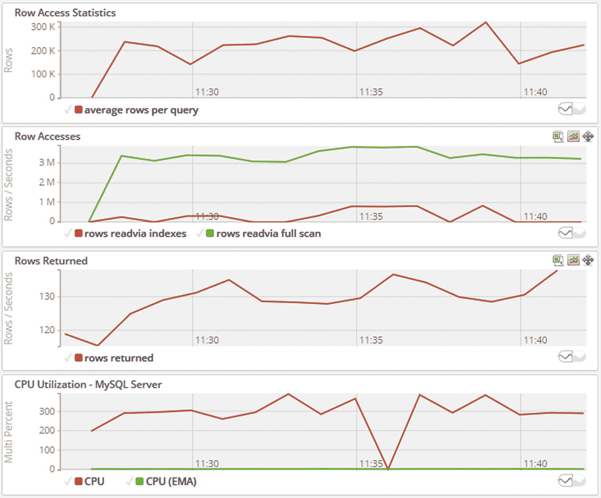
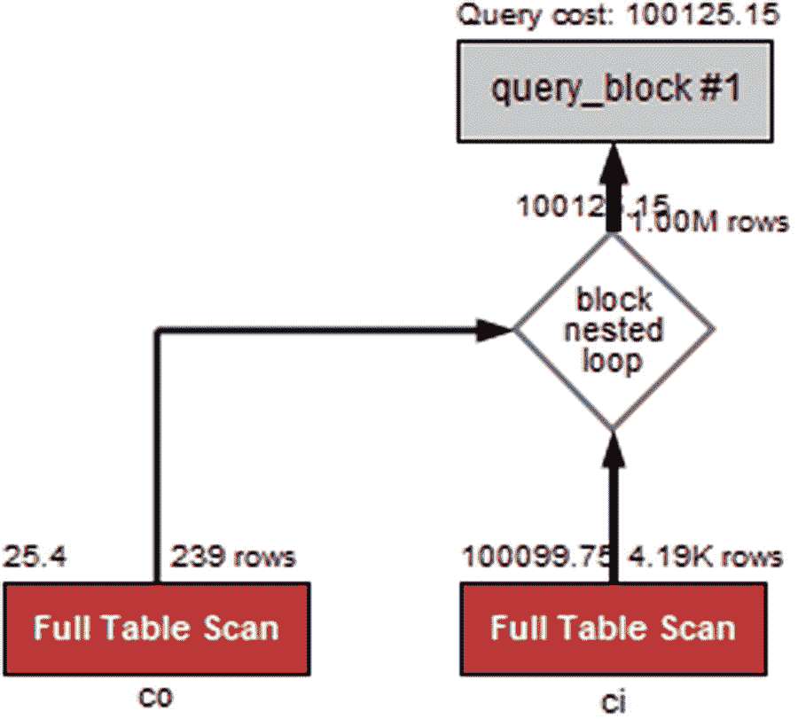
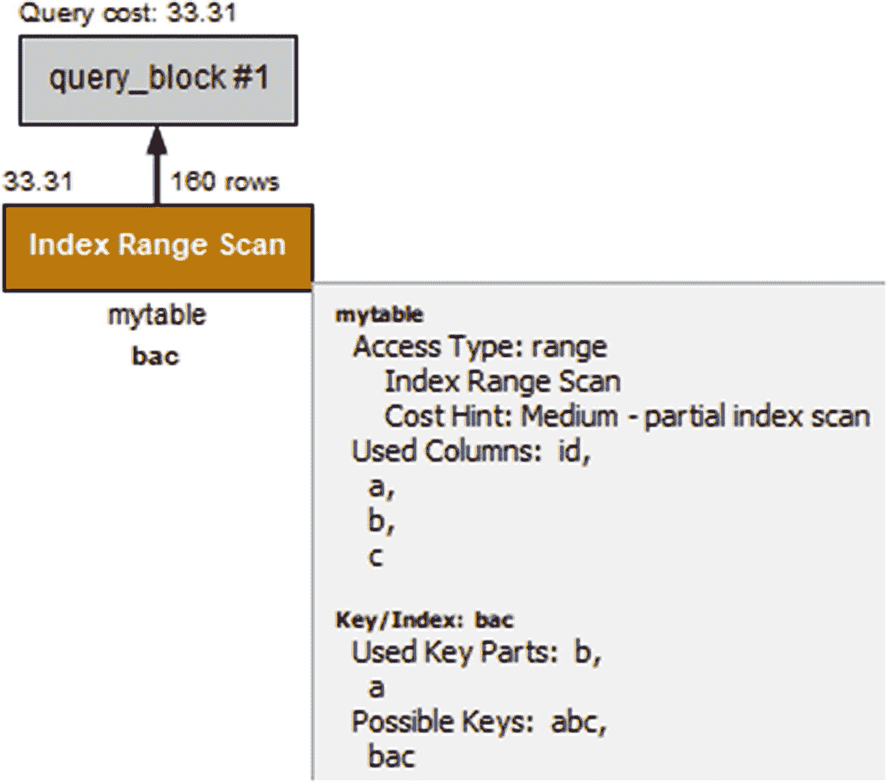
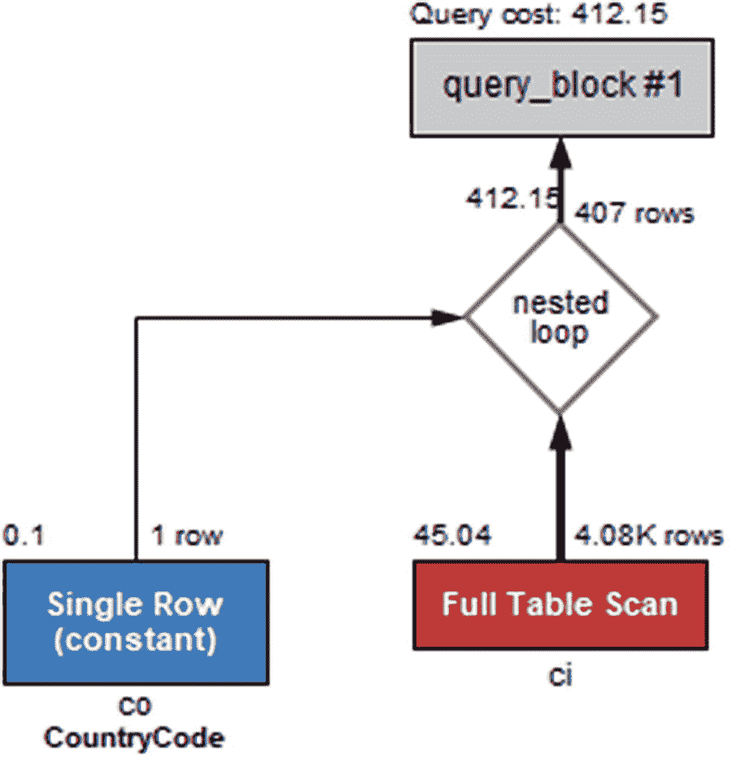
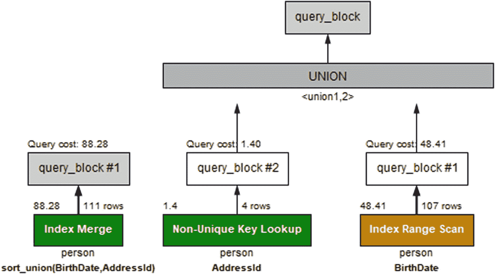
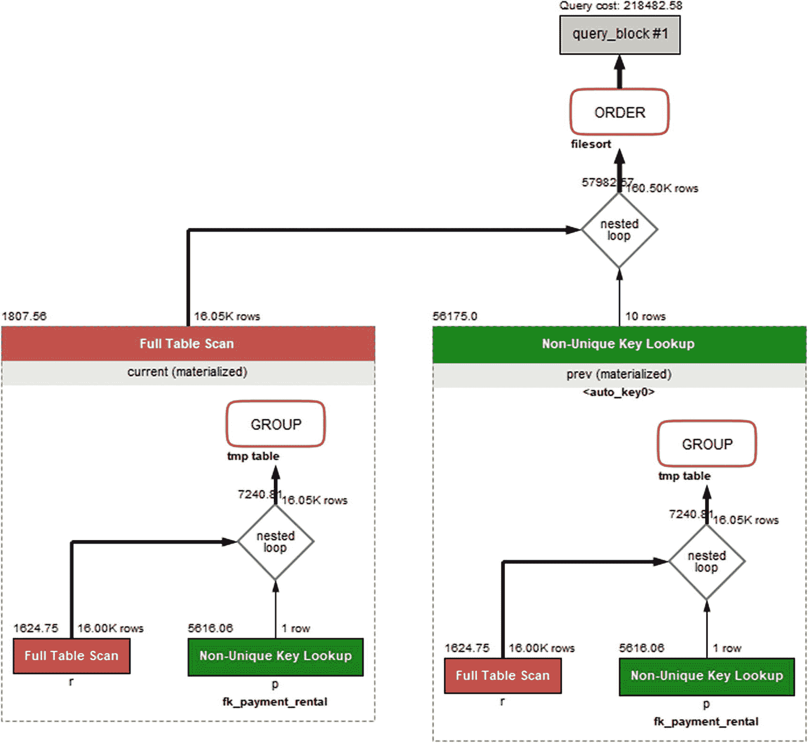
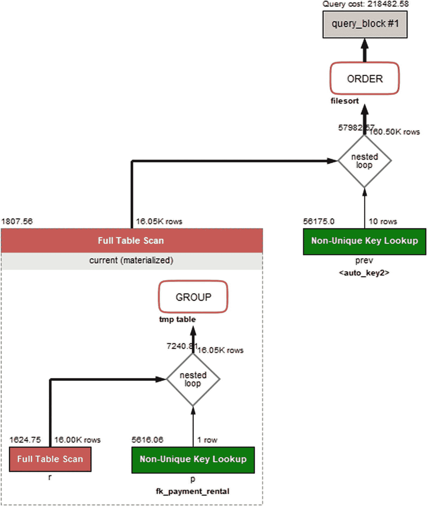

# 24.更改查询计划

性能不佳的查询不能按预期工作有几个可能的原因。这包括从查询明显错误到低级原因，如非最佳查询计划或资源争用。本章将讨论一些常见的情况和解决方案。

本章首先介绍了本章中大多数示例使用的测试数据，并讨论了过度全表扫描的症状。然后讲述了查询中的错误如何会导致严重的性能问题，以及为什么即使存在索引也不总是可以使用。本章的中间部分介绍了通过改进索引使用或重写复杂查询来改进查询的各种方法。最后一部分讨论了如何使用`SKIP LOCKED`子句实现队列系统，以及如何处理带有多个`OR`条件或带有多个值的`IN ()`子句的查询。

## 测试数据

本章主要使用专门为本章中的示例创建的测试数据。如果您想亲自尝试这些示例，本书的 GitHub 资源库中的文件`chapter_24.sql`包含了必要的表定义和数据。该脚本将删除`chapter_24`模式，并用表创建它。

您可以使用 MySQL Shell 中的`\source`命令或`mysql`命令行客户端中的`SOURCE`命令来执行该脚本。例如:

```sql
mysql shell> \source chapter_24.sql
...
mysql shell> SHOW TABLES FROM chapter_24;
+----------------------+
| Tables_in_chapter_24 |
+----------------------+
| address              |
| city                 |
| country              |
| jobqueue             |
| language             |
| mytable              |
| payment              |
| person               |
+----------------------+
8 rows in set (0.0033 sec)

```

该脚本要求在获取`chapter_24.sql`脚本之前安装`world`示例数据库。

Note

由于索引统计数据是使用对索引的随机深入来确定的，因此在每次分析之后，它们的值不会相同。因此，在尝试本章中的例子时，不要期望得到相同的输出。

## 过度全表扫描的症状

最严重的性能问题的原因之一是全表扫描，特别是当涉及到连接并且全表扫描不在查询块的第一个表上时。它会给 MySQL 带来太多的工作，还会影响其他连接。当 MySQL 无法使用索引进行查询时，就会发生全表扫描，这是因为没有过滤条件或者没有针对当前条件的索引。全表扫描的一个副作用是，大量数据被拉入缓冲池，可能永远不会返回给应用。这可能会使磁盘 I/O 量急剧增加，从而导致进一步的性能问题。

当查询执行过多的表扫描时，您需要注意的症状是 CPU 使用率增加、被访问的行数增加、索引使用率低、磁盘 I/O 可能增加以及 InnoDB 缓冲池效率降低。

检测过度全表扫描的最佳方法是使用您的监控。直接的方法是寻找在性能模式中被标记为使用全表扫描的查询，并比较检查的行数与返回的或受影响的行数之比，如第 [19 章](19.html)所述。您还可以查看 timeseries 图来发现被访问的行太多或 CPU 使用太多的模式。图 [24-1](#Fig1) 显示了在一个 MySQL 实例上进行全表扫描期间的监控图示例。(`employees`数据库在您想要模拟这种情况时非常有用，因为它有足够大的表来允许一些相对较大的扫描。)



图 24-1

当存在带有全表扫描的查询时监视图形

请注意在图表的左侧，通过完全扫描读取的行的行访问率和 CPU 使用率是如何增加的。另一方面，与被访问的行数相比，返回的行数变化很小(百分比)。特别是第二个图表显示了通过索引读取行的速率与完全扫描的比较，以及读取的行和返回的行之间的比率，这表明了一个问题。

Tip

在 MySQL 8.0.18 和更高版本中，与连接相关的全表扫描并不是一个大问题，因为散列连接可以用于等价连接。也就是说，散列连接仍然会将比所需更多的数据拉入缓冲池。

最大的问题是什么时候 CPU 使用率过高，访问的行数过多，不幸的是，答案是“视情况而定”如果您考虑 CPU 的使用情况，那么它真正能告诉您的是正在进行的工作，对于正在访问的行数和访问速率，这些指标只是告诉您应用正在请求数据。问题是当做了太多的工作，并且为应用需要答案的问题访问了太多的行时。在某些情况下，优化查询可能会增加这些指标中的一些，而不是减少它们——这只是因为带有优化查询的 MySQL 能够做更多的工作。

这是基线如此重要的一个例子。考虑度量标准的变化通常比查看它们的快照更有用。类似地，综合考虑这些指标——比如比较返回的行数和访问的行数——比单独考虑它们会得到更多。

接下来的两节讨论了访问过多行的查询示例以及如何改进它们。

## 错误的查询

查询性能最差的一个常见原因是查询写错了。这似乎是一个不太可能的原因，但实际上它比你想象的更容易发生。通常，问题是缺少联接或筛选条件，或者引用了错误的表。如果您使用一个框架，例如，使用对象关系映射(ORM)，框架中的一个错误也可能是罪魁祸首。

在极端情况下，缺少过滤条件的查询会使应用超时查询(但不会终止查询)并重试，因此 MySQL 会不断执行越来越多性能非常差的查询。这反过来会使 MySQL 失去连接。

另一种可能性是，第一个提交的查询开始将数据从磁盘拉入缓冲池。然后，每个后续查询会越来越快，因为它们可以从缓冲池中读取一些行，然后当它们到达尚未从磁盘中读取的行时会变慢。最后，查询的所有副本将在很短的时间内完成，并开始向应用返回大量数据，这会使网络饱和。一个饱和的网络可能会因为握手错误而导致连接尝试失败(在`performance_schema.host_cache`中的`COUNT_HANDSHAKE_ERRORS`列)，并且产生连接的主机最终可能会被阻塞。

这可能看起来很极端，在大多数情况下，它不会变得那么糟糕。然而，由于生成查询的框架中的一个 bug，这本书的作者确实经历了这种情况。鉴于 MySQL 实例现在通常位于云中的虚拟机中，可能具有有限的可用资源，如 CPU 和网络，也更有可能是一个糟糕的查询可能会耗尽资源。

作为缺少连接条件的查询和查询计划的一个例子，可以考虑列出连接`city`和`country`表的 [24-1](#PC2) 。

```sql
mysql> EXPLAIN
        SELECT ci.CountryCode, ci.ID, ci.Name,
               ci.District, co.Name AS Country,
               ci.Population
          FROM world.city ci
               INNER JOIN world.country co\G
*************************** 1\. row ***************************
           id: 1
  select_type: SIMPLE
        table: co
   partitions: NULL
         type: ALL
possible_keys: NULL
          key: NULL
      key_len: NULL
          ref: NULL
         rows: 239
     filtered: 100
        Extra: NULL
*************************** 2\. row ***************************
           id: 1
  select_type: SIMPLE
        table: ci
   partitions: NULL
         type: ALL
possible_keys: NULL
          key: NULL
      key_len: NULL
          ref: NULL
         rows: 4188
     filtered: 100
        Extra: Using join buffer (Block Nested Loop)
2 rows in set, 1 warning (0.0008 sec)

mysql> EXPLAIN ANALYZE
        SELECT ci.CountryCode, ci.ID, ci.Name,
               ci.District, co.Name AS Country,
               ci.Population
          FROM world.city ci
               INNER JOIN world.country co\G ************ 1\. row *********
EXPLAIN:
-> Inner hash join  (cost=100125.15 rows=1000932) (actual time=0.194..80.427 rows=974881 loops=1)
    -> Table scan on ci  (cost=1.78 rows=4188) (actual time=0.025..2.621 rows=4079 loops=1)
    -> Hash
        -> Table scan on co  (cost=25.40 rows=239) (actual time=0.041..0.089 rows=239 loops=1)

1 row in set (0.4094 sec)

Listing 24-1Query that is missing a join condition

```

注意这两个表的访问类型是如何设置为`ALL`的，以及连接是如何在块嵌套循环中使用连接缓冲区的。通常具有类似症状的原因是正确的查询，但是该查询不能使用索引。`EXPLAIN ANALYZE`输出显示在 8.0.18 版本中使用了散列连接。它还显示总共返回了差不多一百万行！查询的直观解释图如图 [24-2](#Fig2) 所示。



图 24-2

缺少联接条件的查询的可视化说明

请注意这两个(红色)全表扫描是如何脱颖而出的，以及查询成本估计如何超过 100，000。

多个全表扫描的组合、非常高的估计返回行数和非常高的成本估计是您需要寻找的警示信号。

产生类似症状的查询性能差的一个原因是 MySQL 不能为过滤和连接条件使用索引。

## 没有使用索引

当查询需要在表中查找行时，它基本上可以通过两种方式完成:在全表扫描中直接访问行，或者通过索引。在有高选择性过滤器的情况下，通过索引访问行通常比通过表扫描要快得多。

显然，如果过滤器适用的列上没有索引，MySQL 别无选择，只能使用表扫描。您可能会发现，即使有索引，也无法使用。出现这种情况的三个常见原因是:列不是多列索引中的第一列，数据类型与比较不匹配，以及对带有索引的列使用了函数。本节将讨论这些原因。

Tip

与全表扫描相比，优化器认为索引的选择性不足以使其值得使用，这种情况也可能发生。这种情况在“改进索引使用”一节中处理，同时还有 MySQL 使用错误索引的例子。

### 不是索引的左前缀

要使用索引，必须使用索引的左前缀。例如，如果一个索引包含三列作为`(a, b, c)`，那么列`b`上的条件只能在列`a`上也有相等条件时使用过滤器。

可以使用索引的条件示例如下

```sql
WHERE a = 10 AND b = 20 AND c = 30
WHERE a = 10 AND b = 20 AND c > 10
WHERE a = 10 AND b = 20
WHERE a = 10 AND b > 20
WHERE a = 10

```

不能有效使用索引的一个例子是`WHERE b = 20`。在 MySQL 8.0.13 和更高版本中，如果`a`是一个`NOT NULL`列，MySQL 可以使用跳过扫描范围优化来使用索引。如果`a`允许`NULL`值，则该指标不能使用。条件`WHERE c = 20`在任何情况下都不能使用索引。

类似地，对于条件`WHERE a > 10 AND b = 20`，索引将仅用于对`a`列进行过滤。当查询仅使用索引中列的子集时，索引中列的顺序与应用的筛选器相对应是很重要的。如果其中一列有范围条件，请确保该列是索引中使用的最后一列。例如，考虑清单 [24-2](#PC4) 中的表和查询。

```sql
mysql> SHOW CREATE TABLE chapter_24.mytable\G
*************************** 1\. row ***************************
       Table: mytable
Create Table: CREATE TABLE `mytable` (
  `id` int(10) unsigned NOT NULL AUTO_INCREMENT,
  `a` int(11) NOT NULL,
  `b` int(11) DEFAULT NULL,
  `c` int(11) DEFAULT NULL,
  PRIMARY KEY (`id`),
  KEY `abc` (`a`,`b`,`c`)
) ENGINE=InnoDB AUTO_INCREMENT=16385 DEFAULT CHARSET=utf8mb4 COLLATE=utf8mb4_0900_ai_ci
1 row in set (0.0004 sec)

mysql> EXPLAIN
        SELECT *
          FROM chapter_24.mytable
         WHERE a > 10 AND b = 20\G
*************************** 1\. row ***************************
           id: 1
  select_type: SIMPLE
        table: mytable
   partitions: NULL
         type: range
possible_keys: abc
          key: abc
      key_len: 4
          ref: NULL
         rows: 8326
     filtered: 10
        Extra: Using where; Using index
1 row in set, 1 warning (0.0007 sec)

Listing 24-2Query that cannot use the index effectively due to column order

```

注意在`EXPLAIN`输出中,`key_len`只有 4 个字节，然而如果索引同时用于`a`和`b`列，它应该是 9 个字节。输出还显示，估计只有 10%被检查的行将被包括在内。图 [24-3](#Fig3) 直观解释了同一个例子。


图 24-3

索引中非最佳列顺序的直观解释

请注意，*使用的关键零件*(靠近盒子底部，有附加细节)只列出了列`a`。但是，如果您更改索引中列的顺序，使列`b`在列`a`之前建立索引，那么该索引可以用于这两列上的条件。清单 [24-3](#PC5) 展示了添加新索引`(b, a, c)`后查询计划的变化。

```sql
mysql> ALTER TABLE chapter_24.mytable
         ADD INDEX bac (b, a, c);
Query OK, 0 rows affected (1.4098 sec)

Records: 0  Duplicates: 0  Warnings: 0

mysql> EXPLAIN
       SELECT *
         FROM chapter_24.mytable
        WHERE a > 10 AND b = 20\G
*************************** 1\. row ***************************
           id: 1
  select_type: SIMPLE
        table: mytable
   partitions: NULL
         type: range
possible_keys: abc,bac
          key: bac
      key_len: 9
          ref: NULL
         rows: 160
     filtered: 100
        Extra: Using where; Using index
1 row in set, 1 warning (0.0006 sec)

Listing 24-3Query plan with the index in optimal order

```

注意`key_len`列现在如何返回 9 个字节，并且`filtered`列显示 100%被检查的行将包含在表中。同样的情况也反映在视觉解释中，如图 [24-4](#Fig4) 所示。



图 24-4

当存在最优排序的索引时，进行可视化解释

在图中，您可以看到将要检查的行数从 8000 多行减少到了 160 行，并且使用的关键部分现在包括了`b`和`a`列。估计的查询开销也从 1683.84 降低到 33.31。

### 数据类型不匹配

您需要注意的另一件事是，条件的两端使用相同的数据类型，并且对字符串使用相同的排序规则。如果不是这样，MySQL 可能无法使用索引。

当查询由于数据类型或排序规则不匹配而无法以最佳方式工作时，一开始可能很难意识到问题出在哪里。查询是正确的，但是 MySQL 拒绝使用您期望的索引。除了查询计划与您预期的不同之外，查询结果也可能是错误的。这可能是由于铸造造成的，例如:

```sql
mysql> SELECT ('a130' = 0), ('130a131' = 130);
+--------------+-------------------+
| ('a130' = 0) | ('130a131' = 130) |
+--------------+-------------------+
|            1 |                 1 |
+--------------+-------------------+
1 row in set, 2 warnings (0.0004 sec)

```

请注意字符串“a130”是如何被视为等于整数 0 的。发生这种情况是因为字符串以非数字字符开头，因此被转换为值 0。同样，字符串“130a131”被视为等于整数 130，因为该字符串的前导数字部分被转换为整数 130。当对一个`WHERE`子句或一个连接条件使用强制转换时，也会出现同样的意外匹配。在这种情况下，检查查询的警告有时有助于发现问题。

如果您考虑本章测试模式中的`country`和`world`表(表定义将在讨论示例时显示)，您可以看到一个不使用索引的连接示例，此时这两个表使用`CountryId`列连接。清单 [24-4](#PC7) 展示了一个查询及其查询计划的例子。

```sql
mysql> EXPLAIN
        SELECT ci.ID, ci.Name, ci.District,
               co.Name AS Country, ci.Population
          FROM chapter_24.city ci
               INNER JOIN chapter_24.country co
                     USING (CountryId)
         WHERE co.CountryCode = 'AUS'\G
*************************** 1\. row ***************************
           id: 1
  select_type: SIMPLE
        table: co
   partitions: NULL
         type: const
possible_keys: PRIMARY,CountryCode
          key: CountryCode
      key_len: 12
          ref: const
         rows: 1
     filtered: 100
        Extra: NULL
*************************** 2\. row ***************************
           id: 1
  select_type: SIMPLE
        table: ci
   partitions: NULL
         type: ALL
possible_keys: CountryId
          key: NULL
      key_len: NULL
          ref: NULL
         rows: 4079
     filtered: 10
        Extra: Using where

2 rows in set, 3 warnings (0.0009 sec)
Warning (code 1739): Cannot use ref access on index 'CountryId' due to type or collation conversion on field 'CountryId'
Warning (code 1739): Cannot use range access on index 'CountryId' due to type or collation conversion on field 'CountryId'
Note (code 1003): /* select#1 */ select `chapter_24`.`ci`.`ID` AS `ID`,`chapter_24`.`ci`.`Name` AS `Name`,`chapter_24`.`ci`.`District` AS `District`,'Australia' AS `Country`,`chapter_24`.`ci`.`Population` AS `Population` from `chapter_24`.`city` `ci` join `chapter_24`.`country` `co` where ((`chapter_24`.`ci`.`CountryId` = '15'))

Listing 24-4Query not using an index due to mismatching data types

```

注意，`ci` ( `city`)表的访问类型是`ALL`。这个查询既不会使用块嵌套循环，也不会使用散列连接，因为`co` ( `country`)表是一个常量。这里包含了警告(如果您不使用启用了警告的 MySQL Shell，您将需要执行`SHOW WARNINGS`来获取警告)，因为它们提供了一个有价值的提示，说明为什么不能使用索引，例如:*由于字段‘country id’*上的类型或排序规则转换，不能对索引‘country id’使用 ref 访问。因此，有一个索引是候选索引，但由于数据类型或排序规则发生了变化，因此无法使用该索引。图 [24-5](#Fig5) 显示了使用可视化解释的相同查询计划。



图 24-5

直观解释数据类型不匹配的地方

这是您需要基于文本的输出来获得所有细节的情况之一，因为 Visual Explain 不包括警告。当您看到这样的警告时，请返回并检查表定义。这些如清单 [24-5](#PC8) 所示。

```sql
CREATE TABLE `chapter_24`.`city` (
  `ID` int unsigned NOT NULL AUTO_INCREMENT,
  `Name` varchar(35) NOT NULL DEFAULT ",
  `CountryCode` char(3) NOT NULL DEFAULT ",
  `CountryId` char(3) NOT NULL,
  `District` varchar(20) NOT NULL DEFAULT ",
  `Population` int unsigned NOT NULL DEFAULT '0',
  PRIMARY KEY (`ID`),
  KEY `CountryCode` (`CountryCode`),
  KEY `CountryId` (`CountryId`)
) ENGINE=InnoDB DEFAULT CHARSET=utf8mb4 COLLATE=utf8mb4_general_ci;

CREATE TABLE `chapter_24`.`country` (
  `CountryId` int unsigned NOT NULL AUTO_INCREMENT,
  `CountryCode` char(3) NOT NULL,
  `Name` varchar(52) NOT NULL,
  `Continent` enum('Asia','Europe','North America','Africa','Oceania','Antarctica','South America') NOT NULL DEFAULT 'Asia',
  `Region` varchar(26) DEFAULT NULL,
  PRIMARY KEY (`CountryId`),
  UNIQUE INDEX `CountryCode` (`CountryCode`)
) ENGINE=InnoDB DEFAULT CHARSET=utf8mb4 COLLATE=utf8mb4_0900_ai_ci;

Listing 24-5The table definitions for the city and country tables

```

这里很明显，`city`表的`CountryId`列是一个`char(3)`列，但是国家表的`CountryId`是一个整数。这就是为什么当`city`表是连接中的第二个表时，不能使用`city.CountryId`列的索引。

Note

如果连接以另一种方式进行，第一个表是`city`表，第二个表是`country`表，那么`city.CountryId`仍然被转换为整数，而`country.CountryId`没有改变，因此可以使用`country.CountryId`上的索引。

还要注意，这两个表的排序规则是不同的。`city`表使用`utf8mb4_general_ci`排序规则(MySQL 5.7 和更早版本中的默认`utf8mb4`排序规则)，而`country`表使用`utf8mb4_0900_ai_ci`(MySQL 8 中的默认`utf8mb4`排序规则)。不同的字符集或排序规则甚至会阻止查询一起执行:

```sql
SELECT ci.ID, ci.Name, ci.District,
       co.Name AS Country, ci.Population
  FROM chapter_24.city ci
       INNER JOIN chapter_24.country co
             USING (CountryCode)
 WHERE co.CountryCode = 'AUS';
ERROR: 1267: Illegal mix of collations (utf8mb4_general_ci,IMPLICIT) and (utf8mb4_0900_ai_ci,IMPLICIT) for operation '='

```

如果您在 MySQL 8 中创建一个表，并在查询中与在早期 MySQL 版本中创建的表一起使用，这是需要注意的。在这种情况下，您需要确保所有的表都使用相同的排序规则。

数据类型不匹配的问题是在过滤器中使用函数的特例，就像 MySQL 进行隐式转换一样。一般来说，在过滤器中使用函数可以防止索引的使用。

### 功能依赖性

不使用索引的最后一个常见原因是对列应用了函数，例如:`WHERE MONTH(birth_date) = 7`。在这种情况下，您需要重写条件以避免该函数，或者您需要添加一个函数索引。

如果可能，处理函数的使用阻止了索引的使用的情况的最好方法是重写查询以避免使用函数。虽然也可以使用函数索引，但除非它有助于创建覆盖索引，否则索引会增加开销，这可以通过重写来避免。考虑一个查询，该查询想要查找出生于 1970 年的人的详细信息，如使用`chapter_24.person`表的清单 [24-6](#PC10) 中的示例所示。

```sql
mysql> SHOW CREATE TABLE chapter_24.person\G
*************************** 1\. row ***************************
       Table: person
Create Table: CREATE TABLE `person` (
  `PersonId` int(10) unsigned NOT NULL AUTO_INCREMENT,
  `FirstName` varchar(50) DEFAULT NULL,
  `Surname` varchar(50) DEFAULT NULL,
  `BirthDate` date NOT NULL,
  `AddressId` int(10) unsigned DEFAULT NULL,
  `LanguageId` int(10) unsigned DEFAULT NULL,
  PRIMARY KEY (`PersonId`),
  KEY `BirthDate` (`BirthDate`),
  KEY `AddressId` (`AddressId`),
  KEY `LanguageId` (`LanguageId`)
) ENGINE=InnoDB AUTO_INCREMENT=1001 DEFAULT CHARSET=utf8mb4 COLLATE=utf8mb4_0900_ai_ci
1 row in set (0.0012 sec)

mysql> EXPLAIN
         SELECT *
           FROM chapter_24.person
          WHERE YEAR(BirthDate) = 1970\G
*************************** 1\. row ***************************
           id: 1
  select_type: SIMPLE
        table: person
   partitions: NULL
         type: ALL
possible_keys: NULL
          key: NULL
      key_len: NULL
          ref: NULL
         rows: 1000
     filtered: 100
        Extra: Using where
1 row in set, 1 warning (0.0006 sec)

Listing 24-6The person table and finding persons born in 1970

```

这个查询使用`YEAR()`函数来确定这个人出生的年份。另一种方法是寻找 1970 年 1 月 1 日至 1971 年 12 月 31 日(包括这两天)之间出生的所有人，这相当于同一件事。清单 [24-7](#PC11) 显示在这种情况下使用了`birthdate`列上的索引。

```sql
mysql> EXPLAIN
        SELECT *
          FROM chapter_24.person
         WHERE BirthDate BETWEEN '1970-01-01'
                             AND '1970-12-31'\G
*************************** 1\. row ***************************
           id: 1
  select_type: SIMPLE
        table: person
   partitions: NULL
         type: range
possible_keys: BirthDate
          key: BirthDate
      key_len: 3
          ref: NULL
         rows: 6
     filtered: 100
        Extra: Using index condition
1 row in set, 1 warning (0.0009 sec)

Listing 24-7Rewriting the YEAR() function to a date range condition

```

这种重写将查询从使用检查 1000 行的表扫描减少到只检查 6 行的索引范围扫描。当函数用于有效提取一系列值的日期时，类似的重写通常是可能的。

Note

使用`LIKE`操作符重写日期或日期时间范围条件是很有诱惑力的，例如:`WHERE birthdate LIKE '1970-%'`。这将不允许 MySQL 使用查询，并且不鼓励这样做。请改用合适的范围。

以刚才演示的方式重写使用函数的条件并不总是可能的。可能是条件没有映射到单个范围，或者查询是由框架或第三方应用生成的，因此您不能更改它。在这种情况下，您可以添加一个函数索引。

Note

MySQL 8.0.13 及更高版本支持函数索引。如果您使用早期版本，建议您进行升级。如果这是不可能的，或者您还需要函数返回的值，您可以通过添加带有函数表达式的虚拟列并在虚拟列上创建索引来模拟函数索引。

例如，考虑一个查询，该查询查找在给定月份生日的所有人，例如，因为您想向他们发送生日祝福。原则上，这可以通过使用范围来实现，但是每年需要一个范围，这既不实际也不太有效。相反，您可以使用`MONTH()`函数提取月份的数值(一月是 1，十二月是 12)。清单 [24-8](#PC12) 展示了如何添加一个函数索引，该索引可以与一个查询一起使用，该查询查找`chapter_24.person`表中所有生日在当月的人。

```sql
mysql> ALTER TABLE chapter_24.person
         ADD INDEX ((MONTH(BirthDate)));
Query OK, 0 rows affected (0.4845 sec)

Records: 0  Duplicates: 0  Warnings: 0

mysql> EXPLAIN
         SELECT *
           FROM chapter_24.person
          WHERE MONTH(BirthDate) = MONTH(NOW())\G
*************************** 1\. row ***************************
           id: 1
  select_type: SIMPLE
        table: person
   partitions: NULL
         type: ref
possible_keys: functional_index
          key: functional_index
      key_len: 5
          ref: const
         rows: 88
     filtered: 100
        Extra: NULL
1 row in set, 1 warning (0.0006 sec)

Listing 24-8Using a functional index

```

添加了`MONTH(BirthDate)`上的函数索引后，查询计划显示使用的索引是`functional_index`。

关于如何为当前没有使用索引的查询添加索引支持的讨论到此结束。还有几个与使用索引相关的重写。这些将在下一节讨论。

## 改进索引的使用

前一节考虑了没有索引用于 join 或`WHERE`子句的查询。在某些情况下，使用了一个索引，但是您可以改进该索引，或者另一个索引提供了更好的性能，或者由于过滤器的复杂性而无法有效地使用索引。本节将介绍一些使用索引改进查询的例子。

### 添加覆盖索引

在某些情况下，当您查询一个表时，过滤是由索引执行的，但是您已经请求了几个其他列，所以 MySQL 需要检索整行。在这种情况下，将这些额外的列添加到索引中会更有效，这样索引就包含了查询所需的所有列。

考虑一下`chapter_24`样本数据库中的`city`表:

```sql
CREATE TABLE `city` (
  `ID` int unsigned NOT NULL AUTO_INCREMENT,
  `Name` varchar(35) NOT NULL DEFAULT ",
  `CountryCode` char(3) NOT NULL DEFAULT ",
  `CountryId` char(3) NOT NULL,
  `District` varchar(20) NOT NULL DEFAULT ",
  `Population` int unsigned NOT NULL DEFAULT '0',
  PRIMARY KEY (`ID`),
  KEY `CountryCode` (`CountryCode`),
  KEY `CountryId` (`CountryId`)
) ENGINE=InnoDB DEFAULT CHARSET=utf8mb4 COLLATE=utf8mb4_general_ci;

```

如果您想查找所有带有`CountryCode = 'USA'`的城市的名称和地区，那么您可以使用`CountryCode`索引来查找这些行。这是高效的，如清单 [24-9](#PC14) 所示。

```sql
mysql> EXPLAIN
        SELECT Name, District
          FROM chapter_24.city
         WHERE CountryCode = 'USA'\G
*************************** 1\. row ***************************
           id: 1
  select_type: SIMPLE
        table: city
   partitions: NULL
         type: ref
possible_keys: CountryCode
          key: CountryCode
      key_len: 12
          ref: const
         rows: 274
     filtered: 100
        Extra: NULL
1 row in set, 1 warning (0.0376 sec)

Listing 24-9Querying cities by a non-covering index

```

请注意，索引使用了 12 个字节(3 个字符，每个字符最多 4 个字节宽)，并且`Extra`列不包括`Using index`。如果创建一个新索引，将`CountryCode`作为第一列，将`District`和`Name`作为剩余列，那么索引中就有了查询所需的所有列。选择`District`和`Name`的顺序，因为它们最有可能与过滤器中的`CountryCode`以及`ORDER BY`和`GROUP BY`子句一起使用。如果同样可能在过滤器中使用列，则在索引中选择`Name`在`District`之前，因为城市名称比地区名称更具选择性。清单 [24-10](#PC15) 展示了一个这样的例子以及新的查询计划。

```sql
mysql> ALTER TABLE chapter_24.city
       ALTER INDEX CountryCode INVISIBLE,
         ADD INDEX Country_District_Name
                  (CountryCode, District, Name);
Query OK, 0 rows affected (1.6630 sec)

Records: 0  Duplicates: 0  Warnings: 0

mysql> EXPLAIN
        SELECT Name, District
          FROM chapter_24.city
         WHERE CountryCode = 'USA'\G
*************************** 1\. row ***************************
           id: 1
  select_type: SIMPLE
        table: city
   partitions: NULL
         type: ref
possible_keys: Country_District_Name
          key: Country_District_Name
      key_len: 12
          ref: const
         rows: 274
     filtered: 100
        Extra: Using index
1 row in set, 1 warning (0.0006 sec)

Listing 24-10Querying cities by a covering index

```

当添加新索引时，刚好覆盖`CountryCode`列的旧索引是不可见的。这样做是因为新索引也可以用于旧索引的所有用途，所以通常没有理由保留两个索引。(假设`CountryCode`列上的索引比新索引小，一些查询可能会受益于旧索引。通过使它不可见，您可以在删除它之前验证它是不需要的。)

密钥长度仍然返回为 12 个字节，因为这是用于过滤的。然而,`Extra`列现在包含了`Using index`,表明正在使用覆盖索引。

### 错误的索引

当 MySQL 可以在几个索引之间进行选择时，优化器必须根据两个查询计划的估计成本来决定使用哪个。由于索引统计和成本估计不准确，MySQL 可能会选择错误的索引。特殊情况是优化器选择不使用索引，即使可以使用它，或者优化器选择使用索引，这样做可以更快地进行表扫描。无论哪种方式，您都需要使用索引提示。

Tip

正如第 [17](17.html) 章所讨论的，索引提示也可以用来影响一个索引是用于排序还是分组。有必要使用索引提示的一个例子是，当查询选择使用索引进行排序而不是过滤时，这会导致性能下降，反之亦然。可能发生相反情况的一种情况是，当您有一个`LIMIT`子句并且使用索引进行排序时，可能会允许查询提前停止查询。

当您怀疑使用了错误的索引时，您需要查看`EXPLAIN`输出的`possible_keys`列，以确定哪些索引是候选索引。清单 [24-11](#PC16) 显示了一个查找关于在 2020 年年满 20 岁并说英语的日本人的信息的例子。(假设你想给他们寄一张生日卡。)树格式的`EXPLAIN`输出的一部分已经被省略号代替，以通过将大部分行保持在页面宽度内来提高可读性。

```sql
mysql> SHOW CREATE TABLE chapter_24.person\G
*************************** 1\. row ***************************
       Table: person
Create Table: CREATE TABLE `person` (
  `PersonId` int(10) unsigned NOT NULL AUTO_INCREMENT,
  `FirstName` varchar(50) DEFAULT NULL,
  `Surname` varchar(50) DEFAULT NULL,
  `BirthDate` date NOT NULL,
  `AddressId` int(10) unsigned DEFAULT NULL,
  `LanguageId` int(10) unsigned DEFAULT NULL,
  PRIMARY KEY (`PersonId`),
  KEY `BirthDate` (`BirthDate`),
  KEY `AddressId` (`AddressId`),
  KEY `LanguageId` (`LanguageId`),
  KEY `functional_index` ((month(`BirthDate`)))
) ENGINE=InnoDB AUTO_INCREMENT=1001 DEFAULT CHARSET=utf8mb4 COLLATE=utf8mb4_0900_ai_ci
1 row in set (0.0007 sec)

mysql> SHOW CREATE TABLE chapter_24.address\G

*************************** 1\. row ***************************
       Table: address
Create Table: CREATE TABLE `address` (
  `AddressId` int(10) unsigned NOT NULL AUTO_INCREMENT,
  `City` varchar(35) NOT NULL,
  `District` varchar(20) NOT NULL,
  `CountryCode` char(3) NOT NULL,
  PRIMARY KEY (`AddressId`),
  KEY `CountryCode` (`CountryCode`,`District`,`City`)
) ENGINE=InnoDB AUTO_INCREMENT=4096 DEFAULT CHARSET=utf8mb4 COLLATE=utf8mb4_0900_ai_ci
1 row in set (0.0007 sec)

mysql> SHOW CREATE TABLE chapter_24.language\G
*************************** 1\. row ***************************
       Table: language
Create Table: CREATE TABLE `language` (
  `LanguageId` int(10) unsigned NOT NULL AUTO_INCREMENT,
  `Language` varchar(35) NOT NULL,
  PRIMARY KEY (`LanguageId`),
  KEY `Language` (`Language`)
) ENGINE=InnoDB AUTO_INCREMENT=512 DEFAULT CHARSET=utf8mb4 COLLATE=utf8mb4_0900_ai_ci
1 row in set (0.0005 sec)

mysql> UPDATE mysql.innodb_index_stats
          SET stat_value = 1000
        WHERE database_name = 'chapter_24'
              AND table_name = 'person'
              AND index_name = 'LanguageId'
              AND stat_name = 'n_diff_pfx01';
Query OK, 1 row affected (0.0920 sec)

Rows matched: 1  Changed: 1  Warnings: 0

mysql> FLUSH TABLE chapter_24.person;
Query OK, 0 rows affected (0.0686 sec)

mysql> EXPLAIN
        SELECT PersonId, FirstName,
               Surname, BirthDate
          FROM chapter_24.person
               INNER JOIN chapter_24.address

                    USING (AddressId)
               INNER JOIN chapter_24.language
                    USING (LanguageId)
         WHERE BirthDate BETWEEN '2000-01-01'
                             AND '2000-12-31'
               AND CountryCode = 'JPN'
               AND Language = 'English'\G
*************************** 1\. row ***************************
           id: 1
  select_type: SIMPLE
        table: language
   partitions: NULL
         type: ref
possible_keys: PRIMARY,Language
          key: Language
      key_len: 142
          ref: const
         rows: 1
     filtered: 100
        Extra: Using index
*************************** 2\. row ***************************
           id: 1
  select_type: SIMPLE
        table: person
   partitions: NULL
         type: ref
possible_keys: BirthDate,AddressId,LanguageId
          key: LanguageId
      key_len: 5
          ref: chapter_24.language.LanguageId
         rows: 1
     filtered: 5
        Extra: Using where
*************************** 3\. row ***************************
           id: 1
  select_type: SIMPLE
        table: address
   partitions: NULL
         type: eq_ref
possible_keys: PRIMARY,CountryCode
          key: PRIMARY
      key_len: 4
          ref: chapter_24.person.AddressId
         rows: 1
     filtered: 6.079921722412109
        Extra: Using where
3 rows in set, 1 warning (0.0008 sec)

mysql> EXPLAIN FORMAT=TREE
        SELECT PersonId, FirstName,
               Surname, BirthDate
          FROM chapter_24.person
               INNER JOIN chapter_24.address

                    USING (AddressId)
               INNER JOIN chapter_24.language
                    USING (LanguageId)
         WHERE BirthDate BETWEEN '2000-01-01'
                             AND '2000-12-31'
               AND CountryCode = 'JPN'
               AND Language = 'English'\G
*************************** 1\. row ***************************
EXPLAIN:
-> Nested loop inner join  (cost=0.72 rows=0)
    -> Nested loop inner join  (cost=0.70 rows=0)
        -> Index lookup on language using Language...
        -> Filter: ((person.BirthDate between '2000-01-01' and '2000-12-31') and (person.AddressId is not null))...
            -> Index lookup on person using LanguageId...
    -> Filter: (address.CountryCode = 'JPN')  (cost=0.37 rows=0)
        -> Single-row index lookup on address using PRIMARY...

1 row in set (0.0006 sec)

Listing 24-11Finding information about the countries where English is spoken

```

本例中的关键表是与`language`和`address`表连接的`person`表。`UPDATE`和`FLUSH`语句用于通过更新`mysql.innodb_index_stats`表并刷新该表以使新的索引统计生效，来模拟索引统计已经过时。

查询可以使用`BirthDate`、`AddressId`或`LanguageId`索引。当优化器向存储引擎请求每个条件的行数时，三个`WHERE`子句(每个表上一个)的有效性被非常精确地确定。优化器的困难在于根据连接条件的有效性以及每个连接使用哪个索引来确定最佳连接顺序。根据`EXPLAIN`的输出，优化器选择从`language`表开始，使用`LanguageId`索引连接到`person`表，最后连接到`address`表。

如果您怀疑查询使用了错误的索引(在这种情况下，使用`LanguageId`连接到`person`表并不是最佳选择，因为索引统计数据是“错误的”)，首先要做的是更新索引统计数据。其结果如清单 [24-12](#PC17) 所示。

```sql
mysql> ANALYZE TABLE
               chapter_24.person,
               chapter_24.address,
               chapter_24.language;
+---------------------+---------+----------+----------+
| Table               | Op      | Msg_type | Msg_text |
+---------------------+---------+----------+----------+
| chapter_24.person   | analyze | status   | OK       |
| chapter_24.address  | analyze | status   | OK       |
| chapter_24.language | analyze | status   | OK       |
+---------------------+---------+----------+----------+
3 rows in set (0.2634 sec)

mysql> EXPLAIN
        SELECT PersonId, FirstName,
               Surname, BirthDate
          FROM chapter_24.person
               INNER JOIN chapter_24.address
                    USING (AddressId)
               INNER JOIN chapter_24.language
                    USING (LanguageId)
         WHERE BirthDate BETWEEN '2000-01-01'
                             AND '2000-12-31'
               AND CountryCode = 'JPN'
               AND Language = 'English'\G
*************************** 1\. row ***************************
           id: 1
  select_type: SIMPLE
        table: language
   partitions: NULL
         type: ref
possible_keys: PRIMARY,Language
          key: Language
      key_len: 142
          ref: const
         rows: 1
     filtered: 100
        Extra: Using index
*************************** 2\. row ***************************
           id: 1
  select_type: SIMPLE
        table: person
   partitions: NULL
         type: range
possible_keys: BirthDate,AddressId,LanguageId
          key: BirthDate
      key_len: 3
          ref: NULL
         rows: 8
     filtered: 10
        Extra: Using index condition; Using where; Using join buffer (Block Nested Loop)
*************************** 3\. row ***************************
           id: 1
  select_type: SIMPLE
        table: address
   partitions: NULL
         type: eq_ref
possible_keys: PRIMARY,CountryCode
          key: PRIMARY
      key_len: 4
          ref: chapter_24.person.AddressId
         rows: 1
     filtered: 6.079921722412109
        Extra: Using where
3 rows in set, 1 warning (0.0031 sec)

mysql> EXPLAIN FORMAT=TREE
        SELECT PersonId, FirstName,
               Surname, BirthDate
          FROM chapter_24.person
               INNER JOIN chapter_24.address
                    USING (AddressId)
               INNER JOIN chapter_24.language
                    USING (LanguageId)
         WHERE BirthDate BETWEEN '2000-01-01'
                             AND '2000-12-31'
               AND CountryCode = 'JPN'
               AND Language = 'English'\G
*************************** 1\. row ***************************
EXPLAIN:
-> Nested loop inner join  (cost=7.01 rows=0)
    -> Inner hash join...
        -> Filter: (person.AddressId is not null)...
            -> Index range scan on person using BirthDate...
        -> Hash
            -> Index lookup on language using Language...
    -> Filter: (address.CountryCode = 'JPN')...
        -> Single-row index lookup on address using PRIMARY...

1 row in set (0.0009 sec)

Listing 24-12Updating the index statistics to change the query plan

```

这极大地改变了查询计划(为了可读性，只包括了树格式查询计划的一部分)，通过比较树格式查询计划可以很容易地看出这一点。这些表仍然以相同的顺序连接，但是现在使用散列连接来连接语言和人员表。这是有效的，因为只需要语言表中的一行，所以对`person`表进行表扫描并根据出生日期进行过滤是一个不错的选择。在大多数使用错误索引的情况下，更新索引统计信息可以解决问题，可能是在更改 InnoDB 对表进行索引潜水的次数之后。

Caution

`ANALYZE TABLE`为被分析的表触发一个隐式的`FLUSH TABLES`。如果您有使用被分析的表的长时间运行的查询，则在长时间运行的查询完成之前，不能启动需要访问这些表的其他查询。

在某些情况下，不可能通过更新索引统计信息来解决性能问题。在这种情况下，您可以使用索引提示(`IGNORE INDEX`、`USE INDEX`和`FORCE INDEX`)来影响 MySQL 将使用的索引。清单 [24-13](#PC18) 展示了一个在将索引统计数据改回过时状态后，对与之前相同的查询执行此操作的示例。

```sql
mysql> UPDATE mysql.innodb_index_stats
          SET stat_value = 1000
        WHERE database_name = 'chapter_24'
              AND table_name = 'person'
              AND index_name = 'LanguageId'
              AND stat_name = 'n_diff_pfx01';
Query OK, 1 row affected (0.0920 sec)

Rows matched: 1  Changed: 1  Warnings: 0

mysql> FLUSH TABLE chapter_24.person;
Query OK, 0 rows affected (0.0498 sec)

mysql> EXPLAIN
        SELECT PersonId, FirstName,
               Surname, BirthDate
          FROM chapter_24.person USE INDEX (BirthDate)
               INNER JOIN chapter_24.address
                    USING (AddressId)
               INNER JOIN chapter_24.language
                    USING (LanguageId)
         WHERE BirthDate BETWEEN '2000-01-01'
                             AND '2000-12-31'
               AND CountryCode = 'JPN'
               AND Language = 'English'\G
*************************** 1\. row ***************************
           id: 1
  select_type: SIMPLE
        table: language
   partitions: NULL
         type: ref
possible_keys: PRIMARY,Language
          key: Language
      key_len: 142
          ref: const
         rows: 1
     filtered: 100
        Extra: Using index
*************************** 2\. row ***************************
           id: 1
  select_type: SIMPLE
        table: person
   partitions: NULL
         type: range
possible_keys: BirthDate
          key: BirthDate
      key_len: 3
          ref: NULL
         rows: 8
     filtered: 0.625
        Extra: Using index condition; Using where; Using join buffer (Block Nested Loop)
*************************** 3\. row ***************************
           id: 1
  select_type: SIMPLE
        table: address
   partitions: NULL
         type: eq_ref
possible_keys: PRIMARY,CountryCode
          key: PRIMARY
      key_len: 4
          ref: chapter_24.person.AddressId
         rows: 1
     filtered: 6.079921722412109
        Extra: Using where
3 rows in set, 1 warning (0.0016 sec)

Listing 24-13Improving the query plan using an index hint

```

这一次为`person`表添加了`USE INDEX (BirthDate)`索引提示，它给出了与索引统计信息更新时相同的查询计划。注意，`person`表的可能键只包括`BirthDate`。这种方法的缺点是，如果数据发生变化，优化器不具备更改查询计划的灵活性，因此`BirthDate`索引不再是最佳的。

这个例子在`person`表上有三个不同的条件(生日的日期范围和两个连接条件)。在某些情况下，当一个表上有多个条件时，对查询进行一些更广泛的重写是有益的。

### 重写复杂的索引条件

在某些情况下，查询变得非常复杂，以至于优化器不可能提出一个好的查询计划，因此有必要重写查询。重写有助于在同一个表上包含多个筛选器的情况下，索引合并算法无法有效地使用。

考虑以下查询:

```sql
mysql> EXPLAIN FORMAT=TREE
        SELECT *
          FROM chapter_24.person
         WHERE BirthDate < '1930-01-01'
            OR AddressId = 3417\G
*************************** 1\. row ***************************
EXPLAIN:
-> Filter: ((chapter_24.person.BirthDate < DATE'1930-01-01') or (chapter_24.person.AddressId = 3417))  (cost=88.28 rows=111)
    -> Index range scan on person using sort_union(BirthDate,AddressId)  (cost=88.28 rows=111)

1 row in set (0.0006 sec)

```

对于`BirthDate`和`AddressId`列都有索引，但是没有跨越这两列的索引。一种可能是使用索引合并，如果优化器认为好处足够大，它将默认选择索引合并。通常，这是执行查询的首选方式，但是对于某些查询(尤其是比本例更复杂的查询)，将两个条件拆分成两个查询并使用 union 合并结果会有所帮助:

```sql
mysql> EXPLAIN FORMAT=TREE
       (SELECT *
          FROM chapter_24.person
         WHERE BirthDate < '1930-01-01'
       ) UNION DISTINCT (
        SELECT *
          FROM chapter_24.person
         WHERE AddressId = 3417
       )\G
*************************** 1\. row ***************************
EXPLAIN:
-> Table scan on <union temporary>  (cost=2.50 rows=0)
    -> Union materialize with deduplication
        -> Index range scan on person using BirthDate, with index condition: (chapter_24.person.BirthDate < DATE'1930-01-01')  (cost=48.41 rows=107)
        -> Index lookup on person using AddressId (AddressId=3417)  (cost=1.40 rows=4)

1 row in set (0.0006 sec)

```

一个`UNION DISTINCT`(也是默认的 union)用于确保满足两个标准的行不会被包含两次。图 [24-6](#Fig6) 并排显示了两个查询计划。



图 24-6

原始查询和重写查询的查询计划

左边是使用索引合并的原始查询(`sort_union`算法),右边是手工编写的联合。

## 重写复杂查询

优化器在 MySQL 8 中添加了几个转换规则，因此它可以将查询重写为性能更好的形式。这意味着，随着优化器知道越来越多的转换，重写复杂查询的需求不断减少。例如，在 8 . 0 . 17 版本中，增加了对将`NOT IN`(子查询)`NOT EXISTS`(子查询)`IN`(子查询)`IS NOT TRUE`和`EXISTS`(子查询)`IS NOT TRUE`重写为反联接的支持，这意味着子查询被移除。

也就是说，考虑如何重写查询仍然是好的，这样您就可以在优化器没有达到最佳解决方案或者不知道如何自己重写的情况下帮助优化器。还有一些情况下，您可以利用对通用表表达式(CTEs 也称为`with`语法)和窗口函数的支持，使查询更有效、更易读。本节将首先考虑常见的表表达式和窗口函数，然后使用`IN`(子查询)将查询重写为一个连接并使用两个查询。

Common Table Expressions and Window Functions

深入讨论使用常用表表达式和窗口函数的细节已经超出了本书的范围。本章将包括几个例子来说明如何使用这些特性。一个很好的概述起点是由丹尼尔·巴塞洛缪(Daniel Bartholomew)揭示并由 Apress ( [`www.apress.com/gp/book/9781484231197`](http://www.apress.com/gp/book/9781484231197) )出版的)的 *MariaDB 和 MySQL 公共表表达式和窗口函数。*

Guilhem Bichot(在 MySQL 中实现常用表表达式的 MySQL 开发人员)在特性刚开发出来的时候也写过一个关于常用表表达式的博客系列，分为四个部分: [`https://mysqlserverteam.com/?s=common+table+expressions`](https://mysqlserverteam.com/%253Fs%253Dcommon%252Btable%252Bexpressions) 。还有其他 MySQL 开发者的两篇关于窗口功能的博客: [`https://mysqlserverteam.com/?s=window+functions`](https://mysqlserverteam.com/%253Fs%253Dwindow%252Bfunctions) 。

关于最新的信息，最好的来源是 MySQL 参考手册。 [`https://dev.mysql.com/doc/refman/en/with.html`](https://dev.mysql.com/doc/refman/en/with.html) 中描述了常用的表格表达式。根据函数是常规函数还是聚合函数，窗口函数分为两部分: [`https://dev.mysql.com/doc/refman/en/window-functions.html`](https://dev.mysql.com/doc/refman/en/window-functions.html) ，其中还包括对窗口函数的一般性讨论，以及 [`https://dev.mysql.com/doc/refman/en/group-by-functions.html`](https://dev.mysql.com/doc/refman/en/group-by-functions.html) ，用于聚合窗口函数。

### 常用表表达式

公用表表达式功能允许您在查询开始时定义一个子查询，并在查询的主要部分将其用作普通表。使用公共表表达式代替内联子查询有几个优点，包括更好的性能和可读性。更好的性能部分来自于支持在一个查询中多次引用公共表表达式，而内联子查询只能被引用一次。

例如，考虑一个针对`sakila`数据库的查询，该数据库计算负责租赁的每个员工每月的销售额:

```sql
SELECT DATE_FORMAT(r.rental_date,
                   '%Y-%m-01'
       ) AS FirstOfMonth,
       r.staff_id,
       SUM(p.amount) as SalesAmount
  FROM sakila.payment p
       INNER JOIN sakila.rental r
            USING (rental_id)
 GROUP BY FirstOfMonth, r.staff_id;

```

如果你想知道每月的销售额变化有多大，那么你需要将一个月的销售额与前一个月的销售额进行比较。要做到这一点而不使用公共表表达式，您要么需要将查询结果存储在一个临时表中，要么将其复制为两个子查询。清单 [24-14](#PC22) 显示了后者的一个例子。

```sql
SELECT current.staff_id,
       YEAR(current.FirstOfMonth) AS Year,
       MONTH(current.FirstOfMonth) AS Month,
       current.SalesAmount,
       (current.SalesAmount
          - IFNULL(prev.SalesAmount, 0)
       ) AS DeltaAmount
  FROM (
         SELECT DATE_FORMAT(r.rental_date,
                            '%Y-%m-01'
                ) AS FirstOfMonth,
                r.staff_id,
                SUM(p.amount) as SalesAmount
           FROM sakila.payment p
                INNER JOIN sakila.rental r
                     USING (rental_id)
          GROUP BY FirstOfMonth, r.staff_id
       ) current
       LEFT OUTER JOIN (
         SELECT DATE_FORMAT(r.rental_date,
                            '%Y-%m-01'
                ) AS FirstOfMonth,
                r.staff_id,
                SUM(p.amount) as SalesAmount

           FROM sakila.payment p
                INNER JOIN sakila.rental r
                     USING (rental_id)
          GROUP BY FirstOfMonth, r.staff_id
       ) prev ON prev.FirstOfMonth
                    = current.FirstOfMonth
                      - INTERVAL 1 MONTH
             AND prev.staff_id = current.staff_id
 ORDER BY current.staff_id,
          current.FirstOfMonth;

Listing 24-14The monthly sales and change in sales without CTEs

```

这很难成为最容易阅读和理解的查询。这两个子查询是相同的，并且与用于查找每个员工每月销售额的子查询相同。通过比较同一名工作人员的当月和上月，将两个衍生表连接起来。最后，结果按工作人员和当月排序。结果如清单 [24-15](#PC23) 所示。

```sql
+----------+------+-------+-------------+-------------+
| staff_id | Year | Month | SalesAmount | DeltaAmount |
+----------+------+-------+-------------+-------------+
|        1 | 2005 |     5 |     2340.42 |     2340.42 |
|        1 | 2005 |     6 |     4832.37 |     2491.95 |
|        1 | 2005 |     7 |    14061.58 |     9229.21 |
|        1 | 2005 |     8 |    12072.08 |    -1989.50 |
|        1 | 2006 |     2 |      218.17 |      218.17 |
|        2 | 2005 |     5 |     2483.02 |     2483.02 |
|        2 | 2005 |     6 |     4797.52 |     2314.50 |
|        2 | 2005 |     7 |    14307.33 |     9509.81 |
|        2 | 2005 |     8 |    11998.06 |    -2309.27 |
|        2 | 2006 |     2 |      296.01 |      296.01 |
+----------+------+-------+-------------+-------------+
10 rows in set (0.1406 sec)

Listing 24-15The result of the monthly sales query

```

从结果中需要注意的一点是，2005 年 9 月到 2006 年 1 月这几个月没有销售数据。该查询假设该期间的销售额为 0。当重写该查询以使用窗口函数时，将展示如何添加缺少的月份。

图 [24-7](#Fig7) 显示了这个版本的查询的查询计划。



图 24-7

非 CTE 查询的可视化解释

查询计划显示子查询被评估了两次；然后，在名为 current 的子查询上使用全表扫描执行连接，并在嵌套循环中使用索引(和自动生成的索引)进行连接，以形成按文件排序的结果。

如果使用公用表表达式，只需定义一次子查询并引用两次即可。这简化了查询并使其性能更好。使用公共表表达式的查询版本如清单 [24-16](#PC24) 所示。

```sql
WITH monthly_sales AS (
  SELECT DATE_FORMAT(r.rental_date,
                     '%Y-%m-01'
         ) AS FirstOfMonth,
         r.staff_id,
         SUM(p.amount) as SalesAmount
    FROM sakila.payment p
         INNER JOIN sakila.rental r
              USING (rental_id)
   GROUP BY FirstOfMonth, r.staff_id
)
SELECT current.staff_id,
       YEAR(current.FirstOfMonth) AS Year,
       MONTH(current.FirstOfMonth) AS Month,
       current.SalesAmount,
       (current.SalesAmount
          - IFNULL(prev.SalesAmount, 0)
       ) AS DeltaAmount
  FROM monthly_sales current
       LEFT OUTER JOIN monthly_sales prev
               ON prev.FirstOfMonth
                     = current.FirstOfMonth
                       - INTERVAL 1 MONTH
              AND prev.staff_id = current.staff_id
 ORDER BY current.staff_id,
          current.FirstOfMonth;

Listing 24-16The monthly sales and change in sales using CTE

```

公共表表达式首先用关键字`WITH`定义，并命名为`monthly_sales`。查询的主要部分中的表列表可以引用`monthly_sales`。该查询的执行时间大约是原始查询的一半。一个额外的好处是，如果业务逻辑发生变化，您只需要在一个地方更新它，这降低了查询中出现错误的可能性。图 [24-8](#Fig8) 显示了使用公共表表达式的查询版本的查询计划。



图 24-8

使用公用表表达式时的直观解释

查询计划显示子查询只执行一次，然后作为常规表重用。否则，查询计划保持不变。

您也可以使用窗口函数来解决这个问题。

### 窗口功能

窗口函数允许您定义一个框架，其中窗口函数返回值依赖于框架中的其他行。您可以使用它来生成行号和总计百分比，将一行与上一行或下一行进行比较，等等。在这里，我们将探讨前面的例子，即找出每月的销售数字，并将其与前一个月进行比较。

您可以使用`LAG()` window 函数来获取前一行中某一列的值。清单 [24-17](#PC25) 展示了如何使用它来重写月度销售查询，以使用`LAG()`窗口函数以及添加没有销售额的月份。

```sql
WITH RECURSIVE
  month AS
  (SELECT MIN(DATE_FORMAT(rental_date,
                          '%Y-%m-01'
          )) AS FirstOfMonth,
          MAX(DATE_FORMAT(rental_date,
                          '%Y-%m-01'
          )) AS LastMonth
     FROM sakila.rental
    UNION
   SELECT FirstOfMonth + INTERVAL 1 MONTH,
          LastMonth
     FROM month
    WHERE FirstOfMonth < LastMonth
),
  staff_member AS (
  SELECT staff_id
    FROM sakila.staff
),
  monthly_sales AS (
  SELECT month.FirstOfMonth,
         s.staff_id,
         IFNULL(SUM(p.amount), 0) as SalesAmount
    FROM month
         CROSS JOIN staff_member s
         LEFT OUTER JOIN sakila.rental r
                 ON r.rental_date >=
                       month.FirstOfMonth
                AND r.rental_date < month.FirstOfMonth
                                    + INTERVAL 1 MONTH
                AND r.staff_id = s.staff_id
         LEFT OUTER JOIN sakila.payment p
              USING (rental_id)
   GROUP BY FirstOfMonth, s.staff_id
)
SELECT staff_id,
       YEAR(FirstOfMonth) AS Year,
       MONTH(FirstOfMonth) AS Month,
       SalesAmount,
       (SalesAmount
          - LAG(SalesAmount, 1, 0) OVER w_month
       ) AS DeltaAmount
  FROM monthly_sales
WINDOW w_month AS (ORDER BY staff_id, FirstOfMonth)
 ORDER BY staff_id, FirstOfMonth;

Listing 24-17Combing CTEs and the LAG() window function

```

这个查询乍一看似乎很复杂；但是，这样做的原因是，前两个常用表表达式用于将第一个月和最后一个月之间的每个月的销售数据与租赁数据相加。`month`和`staff_member`表之间的叉积(注意如何使用一个显式的`CROSS JOIN`来表明交叉连接是有意的)被用作`monthly_sales`表的基础，并在`rental`和`payment`表上进行外部连接。

主查询现在变得简单了，因为所有需要的信息都可以在`monthly_sales`表中找到。通过`staff_id`和`FirstOfMonth,`对销售数据进行排序来定义窗口，并且在该窗口上使用`LAG()`窗口功能。清单 [24-18](#PC26) 显示了结果。

```sql
+----------+------+-------+-------------+-------------+
| staff_id | Year | Month | SalesAmount | DeltaAmount |
+----------+------+-------+-------------+-------------+
|        1 | 2005 |     5 |     2340.42 |     2340.42 |
|        1 | 2005 |     6 |     4832.37 |     2491.95 |
|        1 | 2005 |     7 |    14061.58 |     9229.21 |
|        1 | 2005 |     8 |    12072.08 |    -1989.50 |
|        1 | 2005 |     9 |        0.00 |   -12072.08 |
|        1 | 2005 |    10 |        0.00 |        0.00 |
|        1 | 2005 |    11 |        0.00 |        0.00 |
|        1 | 2005 |    12 |        0.00 |        0.00 |
|        1 | 2006 |     1 |        0.00 |        0.00 |
|        1 | 2006 |     2 |      218.17 |      218.17 |
|        2 | 2005 |     5 |     2483.02 |     2264.85 |
|        2 | 2005 |     6 |     4797.52 |     2314.50 |
|        2 | 2005 |     7 |    14307.33 |     9509.81 |
|        2 | 2005 |     8 |    11998.06 |    -2309.27 |
|        2 | 2005 |     9 |        0.00 |   -11998.06 |
|        2 | 2005 |    10 |        0.00 |        0.00 |
|        2 | 2005 |    11 |        0.00 |        0.00 |
|        2 | 2005 |    12 |        0.00 |        0.00 |
|        2 | 2006 |     1 |        0.00 |        0.00 |
|        2 | 2006 |     2 |      296.01 |      296.01 |
+----------+------+-------+-------------+-------------+

Listing 24-18The result of the sales query using the LAG() function

```

请注意没有销售数据的月份是如何添加销售金额为 0 的。

Note

窗口不需要数据排序所依据的值。如果省略`month`和`staff_member`表达式，2006 年 2 月的滞后时间将变成 2005 年 8 月。这很可能是您想要的——但是与清单 [24-14](#PC22) 中的原始查询找到的解决方案相比，这是一个不同的结果。这是留给读者的一个练习，让他们更改查询并查看不同之处。

### 将子查询重写为连接

当有子查询时，可以选择将子查询更改为连接。在可能的情况下，优化器通常会自己执行这种重写，但是偶尔，在过程中帮助优化器也是有用的。

例如，考虑以下查询:

```sql
SELECT *
  FROM chapter_24.person
 WHERE AddressId IN (
         SELECT AddressId
           FROM chapter_24.address
          WHERE CountryCode = 'AUS'
                AND District = 'Queensland');

```

该查询查找居住在澳大利亚昆士兰州的所有人。它也可以写成`person`和`address`表之间的连接:

```sql
SELECT person.*
  FROM chapter_24.person
       INNER JOIN chapter_24.address
             USING (AddressId)
 WHERE CountryCode = 'AUS'
       AND District = 'Queensland';

```

事实上，MySQL 进行了完全相同的重写(除了优化器选择地址表作为第一个表，因为过滤器就在那里)。这是半连接优化的一个例子。如果您遇到优化器无法重写查询的查询，您可以像这样进行重写。通常，越接近只包含连接的查询，查询的性能就越好。然而，查询调优的过程要比这复杂得多，有时反其道而行之可以提高查询性能。教训是永远要考验。

您可以使用的另一个选项是将查询分成几个部分，然后分步执行。

### 将查询拆分成多个部分

最后一种选择是将查询分成两个或更多部分。由于 MySQL 8 支持通用表表达式和窗口函数，这种类型的重写不像 MySQL 的旧版本那样频繁。然而，记住这一点是有用的。

Tip

不要低估将一个复杂的查询拆分成两个或更多更简单的查询并逐渐生成查询结果的能力。

例如，考虑与前面讨论中相同的查询，其中您查找居住在澳大利亚昆士兰州的所有人。您可以将子查询作为一个单独的查询来执行，然后将结果放回`IN()`操作符中。这种重写最适用于应用能够以编程方式生成下一个查询的应用。为了简单起见，这个讨论将只显示所需的 SQL。清单 [24-19](#PC29) 显示了这两个查询。

```sql
mysql> SET SESSION transaction_isolation = 'REPEATABLE-READ';
Query OK, 0 rows affected (0.0002 sec)

mysql> START TRANSACTION;
Query OK, 0 rows affected (0.0400 sec)

mysql> SELECT AddressId
         FROM chapter_24.address
        WHERE CountryCode = 'AUS'
              AND District = 'Queensland';
+-----------+
| AddressId |
+-----------+
|       132 |
|       143 |
|       136 |
|       142 |
+-----------+
4 rows in set (0.0008 sec)

mysql> SELECT *
         FROM chapter_24.person
        WHERE AddressId IN (132, 136, 142, 143)\G
*************************** 1\. row ***************************
  PersonId: 79
 FirstName: Dimitra
   Surname: Turner
 BirthDate: 1937-11-16
 AddressId: 132
LanguageId: 110
*************************** 2\. row ***************************
  PersonId: 356
 FirstName: Julian
   Surname: Serrano
 BirthDate: 2017-07-30
 AddressId: 132
LanguageId: 110
2 rows in set (0.0005 sec)

mysql> COMMIT;
Query OK, 0 rows affected (0.0003 sec)

Listing 24-19Splitting a query into two steps

```

使用具有`REPEATABLE-READ`事务隔离级别的事务来执行查询，这意味着两个`SELECT`查询将使用相同的读取视图，从而以相同的方式对应于相同的时间点，就像您将问题作为一个查询来执行一样。对于这样简单的查询，使用多个查询没有任何好处；然而，在真正复杂的查询的情况下，将查询的一部分分离出来(可能包括一些连接)可能是一个优势。将查询分成几部分的另一个好处是，在某些情况下，您可以提高缓存效率。对于本例，如果有其他查询使用相同的子查询来查找昆士兰的地址，缓存可以让您将结果重复用于多种用途。

## 队列系统:跳过锁定

与数据库相关的一个常见任务是处理存储在队列中的一些任务列表。一个例子是在商店里处理订单。所有任务都被处理并且只被处理一次是很重要的，但是哪个应用线程处理每个任务并不重要。`SKIP LOCKED`条款非常适合这种情况。

考虑清单 [24-20](#PC30) 中定义的表`jobqueue`。

```sql
mysql> SHOW CREATE TABLE chapter_24.jobqueue\G
*************************** 1\. row ***************************
       Table: jobqueue
Create Table: CREATE TABLE `jobqueue` (
  `JobId` int(10) unsigned NOT NULL AUTO_INCREMENT,
  `SubmitDate` datetime NOT NULL DEFAULT CURRENT_TIMESTAMP,
  `HandledDate` datetime DEFAULT NULL,
  PRIMARY KEY (`JobId`),
  KEY `HandledDate` (`HandledDate`,`SubmitDate`)
) ENGINE=InnoDB AUTO_INCREMENT=7 DEFAULT CHARSET=utf8mb4 COLLATE=utf8mb4_0900_ai_ci
1 row in set (0.0004 sec)

mysql> SELECT *
         FROM chapter_24.jobqueue;
+-------+---------------------+-------------+
| JobId | SubmitDate          | HandledDate |
+-------+---------------------+-------------+
|     1 | 2019-07-01 19:32:30 | NULL        |
|     2 | 2019-07-01 19:32:33 | NULL        |
|     3 | 2019-07-01 19:33:40 | NULL        |
|     4 | 2019-07-01 19:35:12 | NULL        |
|     5 | 2019-07-01 19:40:24 | NULL        |
|     6 | 2019-07-01 19:40:28 | NULL        |
+-------+---------------------+-------------+
6 rows in set (0.0005 sec)

Listing 24-20The jobqueue table

and data

```

当`HandledDate`为`NULL`时，则任务尚未处理，待处理。例如，如果您的应用设置为获取最早的未处理任务，并且您希望依靠 InnoDB 行锁来防止两个线程执行同一任务，那么您可以使用`SELECT ... FOR UPDATE`(在现实世界中，该语句将是更大事务的一部分):

```sql
SELECT JobId
  FROM chapter_24.jobqueue
 WHERE HandledDate IS NULL
 ORDER BY SubmitDate
 LIMIT 1
   FOR UPDATE;

```

这对于第一个请求很有效，但是下一个请求将被阻塞，直到发生锁等待超时或者第一个任务已经被处理，因此任务处理是序列化的。诀窍是确保在您过滤和排序的列上有一个索引，然后使用`SKIP LOCKED`子句。那么第二个连接将简单地跳过锁定的行，找到满足搜索条件的第一个非锁定的行。清单 [24-21](#PC32) 显示了两个连接的例子，每个连接从队列中获取一个任务。

```sql
Connection 1> START TRANSACTION;
Query OK, 0 rows affected (0.0002 sec)

Connection 1> SELECT JobId
                FROM chapter_24.jobqueue
               WHERE HandledDate IS NULL
               ORDER BY SubmitDate
               LIMIT 1
                 FOR UPDATE
                SKIP LOCKED;
+-------+
| JobId |
+-------+
|     1 |
+-------+
1 row in set (0.0004 sec)

Connection 2> START TRANSACTION;
Query OK, 0 rows affected (0.0003 sec)

Connection 2> SELECT JobId
                FROM chapter_24.jobqueue
               WHERE HandledDate IS NULL
               ORDER BY SubmitDate
               LIMIT 1
                 FOR UPDATE
                SKIP LOCKED;
+-------+
| JobId |
+-------+
|     2 |
+-------+
1 row in set (0.0094 sec)

Listing 24-21Fetching tasks with SKIP LOCKED

```

现在，两个连接都可以获取任务并同时处理它们。一旦任务完成，可以设置`HandledDate`并将任务标记为完成。与连接设置锁列相比，这种方法的优点是，如果连接由于某种原因失败，锁会自动释放。

您可以使用性能模式中的`data_locks`表来查看哪个连接拥有每个锁(锁的顺序取决于线程 id，线程 id 对您来说是不同的):

```sql
mysql> SELECT THREAD_ID, INDEX_NAME, LOCK_DATA
         FROM performance_schema.data_locks
        WHERE OBJECT_SCHEMA = 'chapter_24'
              AND OBJECT_NAME = 'jobqueue'
              AND LOCK_TYPE = 'RECORD'
        ORDER BY THREAD_ID, EVENT_ID;
+-----------+------------+-----------------------+
| THREAD_ID | INDEX_NAME | LOCK_DATA             |
+-----------+------------+-----------------------+
|     21705 | PRIMARY    | 1                     |
|     21705 | SubmitDate | NULL, 0x99A383381E, 1 |
|     25101 | PRIMARY    | 2                     |
|     25101 | SubmitDate | NULL, 0x99A3833821, 2 |
+-----------+------------+-----------------------+
4 rows in set (0.0008 sec)

```

十六进制值是`SubmitDate`列的编码日期时间值。从输出中可以看出，每个连接在二级索引中持有一个记录锁，在主键中持有一个记录锁，正如从`SELECT`查询返回的`JobId`值中所预期的那样。

## 许多 OR 或 IN 条件

一种可能导致性能混乱的查询类型是具有许多范围条件的查询。当有许多`OR`条件或者`IN ()`操作符有许多值时，这通常会是一个问题。在某些情况下，对条件的微小更改可能会完全改变查询计划。

当优化器在索引列上遇到范围条件时，它有两种选择:它可以假设索引中的所有值出现的频率相同，或者它可以要求存储引擎进行索引搜索以确定每个范围的频率。前者最便宜，但后者准确得多。要决定使用哪种方法，有`eq_range_index_dive_limit`选项(默认值为 200)。如果有`eq_range_index_dive_limit`或更多的范围，优化器将只查看索引的基数，并假设所有值以相同的频率出现。如果范围较少，将要求存储引擎提供每个范围。

当每个值出现频率相等的假设不成立时，可能会出现性能问题。在这种情况下，当超过由`eq_range_index_dive_limit,`设置的阈值时，匹配条件的估计行数可能会突然发生显著变化，从而导致完全不同的查询计划。(当在`IN ()`操作符中有许多值时，真正重要的是匹配所包含值的平均行数接近从索引统计中获得的估计值。因此，列表中的值越多，包含的代表性样本就越多。)

清单 [24-22](#PC34) 展示了一个`payment`表的例子，它有一个带索引的列`ContactId`。大多数行的`ContactId`设置为`NULL,`，索引的基数为 21。

```sql
mysql> SHOW CREATE TABLE chapter_24.payment\G
*************************** 1\. row ***************************
       Table: payment
Create Table: CREATE TABLE `payment` (
  `PaymentId` int(10) unsigned NOT NULL AUTO_INCREMENT,
  `Amount` decimal(5,2) NOT NULL,
  `ContactId` int(10) unsigned DEFAULT NULL,
  PRIMARY KEY (`PaymentId`),
  KEY `ContactId` (`ContactId`)
) ENGINE=InnoDB AUTO_INCREMENT=32798 DEFAULT CHARSET=utf8mb4 COLLATE=utf8mb4_0900_ai_ci
1 row in set (0.0004 sec)

mysql> SELECT COUNT(ContactId), COUNT(*)
         FROM chapter_24.payment;
+------------------+----------+
| COUNT(ContactId) | COUNT(*) |
+------------------+----------+
|               20 |    20000 |
+------------------+----------+
1 row in set (0.0060 sec)

mysql> SELECT CARDINALITY
         FROM information_schema.STATISTICS
        WHERE TABLE_SCHEMA = 'chapter_24'
              AND TABLE_NAME = 'payment'
              AND INDEX_NAME = 'ContactId';
+-------------+
| CARDINALITY |
+-------------+
|          21 |
+-------------+
1 row in set (0.0009 sec)

mysql> SET SESSION eq_range_index_dive_limit=5;
Query OK, 0 rows affected (0.0003 sec)

mysql> EXPLAIN
        SELECT *
          FROM chapter_24.payment
         WHERE ContactId IN (1, 2, 3, 4)\G
*************************** 1\. row ***************************
           id: 1
  select_type: SIMPLE
        table: payment
   partitions: NULL
         type: range
possible_keys: ContactId

          key: ContactId
      key_len: 5
          ref: NULL
         rows: 4
     filtered: 100
        Extra: Using index condition
1 row in set, 1 warning (0.0006 sec)

Listing 24-22Query with many range conditions

```

在示例中，`eq_range_index_dive_limit`被设置为 5，以避免需要指定一长串值。对于四个值，优化器已经请求了这四个值中每一个值的统计信息，估计的行数是 4。但是，如果您将值列表变长，事情就会发生变化:

```sql
mysql> EXPLAIN
        SELECT *
          FROM chapter_24.payment
         WHERE ContactId IN (1, 2, 3, 4, 5)\G
*************************** 1\. row ***************************
...
          key: ContactId
      key_len: 5
          ref: NULL
         rows: 4785
...

```

突然，估计有 4785 行匹配，而不是真正匹配的 5 行。仍然使用索引，但是如果连接中涉及到带有这个条件的付款表，那么优化器很可能会选择非最佳的连接顺序。如果您让值列表变得更长，优化器将完全停止使用索引，并进行全表扫描，因为它认为索引非常有效:

```sql
mysql> EXPLAIN
        SELECT *
          FROM chapter_24.payment
         WHERE ContactId IN (1, 2, 3, 4, 5, 6, 7)\G
*************************** 1\. row ***************************
...
         type: ALL
possible_keys: ContactId
          key: NULL
...
         rows: 20107
...

```

这个查询只返回 7 行，所以索引是高度选择性的。那么，如何提高优化器的理解能力呢？根据不良估计原因的确切性质，有各种可能的行动。对于这个特殊的问题，您有以下选择:

*   增加`eq_range_index_dive_limit`。

*   更改`innodb_stats_method`选项。

*   强制 MySQL 使用索引。

最简单的解决方法就是增加`eq_range_index_dive_limit`。默认值为 200，这是一个很好的起点。如果您有一个候选查询，您可以使用不同的值`eq_range_index_dive_limit`进行测试，并确定执行索引挖掘所增加的成本是否值得从获得更好的行估计中节省下来的成本。测试查询的新值`eq_range_index_dive_limit`的一个好方法是在`SET_VAR()`优化器提示中设置该值:

```sql
SELECT /*+ SET_VAR(eq_range_index_dive_limit=8) */
       *
  FROM chapter_24.payment
 WHERE ContactId IN (1, 2, 3, 4, 5, 6, 7);

```

在这种情况下，依赖基数导致如此糟糕的行估计的原因是，几乎所有的行都将`ContactId`设置为`NULL`。默认情况下，InnoDB 认为索引中具有`NULL`值的所有行都具有相同的值。这就是为什么在这个例子中基数只有 21。如果您将`innodb_stats_method`切换到`nulls_ignored`，基数将只基于非`NULL`值进行计算，如清单 [24-23](#PC38) 所示。

```sql
mysql> SET GLOBAL innodb_stats_method = nulls_ignored;
Query OK, 0 rows affected (0.0003 sec)

mysql> ANALYZE TABLE chapter_24.payment;
+--------------------+---------+----------+----------+
| Table              | Op      | Msg_type | Msg_text |
+--------------------+---------+----------+----------+
| chapter_24.payment | analyze | status   | OK       |
+--------------------+---------+----------+----------+
1 row in set (0.1411 sec)

mysql> SELECT CARDINALITY
         FROM information_schema.STATISTICS
        WHERE TABLE_SCHEMA = 'chapter_24'
              AND TABLE_NAME = 'payment'
              AND INDEX_NAME = 'ContactId';
+-------------+
| CARDINALITY |
+-------------+
|       20107 |
+-------------+
1 row in set (0.0009 sec)

mysql> EXPLAIN
        SELECT *
          FROM chapter_24.payment
         WHERE ContactId IN (1, 2, 3, 4, 5, 6, 7)\G
*************************** 1\. row ***************************
           id: 1
  select_type: SIMPLE
        table: payment
   partitions: NULL
         type: range
possible_keys: ContactId
          key: ContactId
      key_len: 5
          ref: NULL
         rows: 7
     filtered: 100
        Extra: Using index condition
1 row in set, 1 warning (0.0011 sec)

Listing 24-23Using innodb_stats_method = nulls_ignored

```

这种方法的最大问题是`innodb_stats_method`只能全局设置，因此它会影响所有的表，并且可能会对其他查询产生负面影响。对于本例，将`innodb_stats_method`设置回默认值，并再次重新计算索引统计信息:

```sql
mysql> SET GLOBAL innodb_stats_method = DEFAULT;
Query OK, 0 rows affected (0.0004 sec)

mysql> SELECT @@global.innodb_stats_method\G
*************************** 1\. row ***************************
@@global.innodb_stats_method: nulls_equal
1 row in set (0.0003 sec)

mysql> ANALYZE TABLE chapter_24.payment;
+--------------------+---------+----------+----------+
| Table              | Op      | Msg_type | Msg_text |
+--------------------+---------+----------+----------+
| chapter_24.payment | analyze | status   | OK       |
+--------------------+---------+----------+----------+
1 row in set (0.6683 sec)

```

最后一个选项是使用索引提示来强制 MySQL 使用索引。您将需要清单 [24-24](#PC40) 中所示的`FORCE INDEX`变体。

```sql
mysql> EXPLAIN
        SELECT *
          FROM chapter_24.payment FORCE INDEX (ContactId)
         WHERE ContactId IN (1, 2, 3, 4, 5, 6, 7)\G
*************************** 1\. row ***************************
           id: 1
  select_type: SIMPLE
        table: payment
   partitions: NULL
         type: range
possible_keys: ContactId
          key: ContactId
      key_len: 5
          ref: NULL
         rows: 6699
     filtered: 100
        Extra: Using index condition
1 row in set, 1 warning (0.0007 sec)

Listing 24-24Using FORCE INDEX to force MySQL to use the index

```

这将使查询的执行速度更快，就好像它有更准确的统计数据一样。但是，如果`payment`表是具有相同`WHERE`子句的连接的一部分，那么行估计仍然是错误的(估计的 6699 行与实际的 7 行相比)，因此查询计划可能仍然是错误的，在这种情况下，您需要告诉优化器最佳的连接顺序是什么。

## 摘要

本章展示了几个提高查询性能的技术示例。第一个主题是查看过度全表扫描的症状，然后查看全表扫描的两个主要原因:查询错误和索引无法使用。无法使用索引的典型原因是所使用的列没有形成索引的左前缀、数据类型不匹配或者对列使用了函数。

也可能出现使用索引的情况，但使用情况可以改善。这可以是转换索引以覆盖查询所需的所有列，使用错误的索引，或者用复杂的条件重写查询可以改进查询计划。

重写复杂的查询也很有用。MySQL 8 支持常用的表表达式和窗口函数，它们既可以用来简化查询，也可以使查询性能更好。在其他情况下，它可以帮助进行一些优化器通常会做的重写，或者将查询分成多个部分。

最后，讨论了两种常见的情况。第一个是使用一个队列，其中可以使用`SKIP LOCKED`子句有效地访问第一个非锁定行。第二种情况是有一个很长的`OR`条件列表或者一个有很多值的`IN ()`操作符，当范围的数量达到由`eq_range_index_dive_limit`选项设置的数量时，这可能会导致查询计划发生令人惊讶的变化。

下一章着眼于提高 DDL 和批量数据装载的性能。