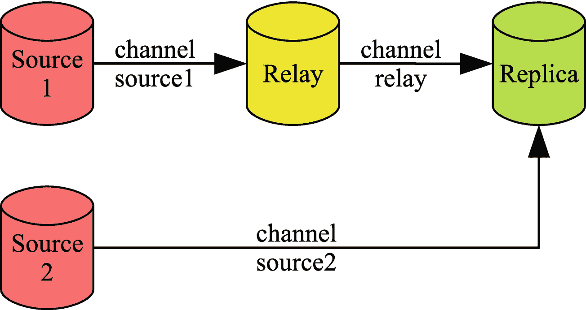

# 26.分身术

MySQL 这些年来如此受欢迎的一个特性是支持复制，这允许您拥有一个 MySQL 实例，该实例自动从其来源接收更新并应用它们。通过快速事务和低延迟网络，复制可以接近实时，但请注意，由于除了 NDB 集群之外，MySQL 中没有同步复制，因此仍然存在潜在的巨大延迟。数据库管理员的一项经常性任务是提高复制的性能。多年来，MySQL 复制有了许多改进，包括一些可以帮助您提高复制性能的改进。

Note

本章重点介绍传统的异步复制。MySQL 8 还支持组复制及其衍生的 InnoDB 集群。深入研究组复制的细节超出了本书的范围；然而，讨论仍然普遍适用。关于组复制的详细信息，推荐查尔斯·贝尔(Apress) ( [`www.apress.com/gp/book/9781484238844`](http://www.apress.com/gp/book/9781484238844) )的《T2 介绍 InnoDB 集群》一书，以及最新更新的 MySQL 参考手册( [`https://dev.mysql.com/doc/refman/en/group-replication.html`](https://dev.mysql.com/doc/refman/en/group-replication.html) )。

本章将首先提供复制的高级概述，目的是介绍将用于复制监视部分的术语和测试设置。本章的另一半讨论了如何提高连接和应用程序线程的性能，以及如何使用复制将工作转移给副本。

## 复制概述

在开始提高复制性能之前，讨论一下复制的工作原理是很重要的。这将有助于就术语达成一致，并为本章剩余部分的讨论提供参考点。

Note

传统上，术语*主*和*从*被用来描述 MySQL 复制的源和目标。最近，术语已经转向使用单词*源*和*复制品*。同样，在副本上，用于处理复制事件的两种线程类型传统上被称为 *I/O 线程*和 *SQL 线程*，而当前的术语是*连接线程*和*应用程序线程*。本书将尽最大可能使用新术语；然而，旧的术语在某些上下文中仍然存在。

复制的工作方式是记录在复制源上所做的更改，然后将这些更改发送到副本，在副本中，连接线程存储数据，一个或多个应用程序线程应用这些数据。图 [26-1](#Fig1) 显示了复制的简化概述，省略了与存储引擎和实施细节相关的所有内容。


图 26-1

复制概述

当事务提交其更改时，这些更改将被写入 InnoDB 特定文件(重做日志和数据文件)和*二进制日志*。二进制日志由一系列文件和一个索引文件组成，该索引文件列出了二进制日志文件。一旦事件被写入二进制日志文件，它们就被发送到副本服务器。可能有多个副本，在这种情况下，事件会发送到所有副本。

在副本上，连接线程接收事件并将它们写入*中继日志*。中继日志的工作方式与二进制日志相同，只是它被用作临时存储，直到应用程序线程可以应用事件。可以有一个或多个施放器螺纹。也可能是副本从多个源复制(称为多源复制)，在这种情况下，每个*复制通道*有一组一个连接线程和一个或多个应用程序线程。(也就是说，最常见的是每个副本一个源。)可选地，副本将更改写入其自己的二进制日志，这使其能够成为复制链更下游的副本的源。在这种情况下，通常称之为*中继*实例。图 [26-2](#Fig2) 显示了一个设置的例子，一个副本从两个源接收更新，其中一个是中继实例。



图 26-2

具有两个复制流的复制拓扑

这里*源 1* 复制到*中继*实例，后者又复制到*副本*实例。*源 2* 也复制到*副本*实例。每个通道都有一个名称来区分它们，在多源复制中，每个通道都必须有一个唯一的名称。默认通道名称是一个空字符串。在讨论监控时，将使用如图所示的复制设置。

## 监视

当您遇到复制性能问题时，第一步是确定延迟是在前面部分描述的一系列步骤中引入的。如果您已经在 MySQL 的早期版本中使用了复制，您可以跳转到`SHOW SLAVE STATUS`命令来检查复制的健康状况；然而，在 MySQL 8 中，这是最后一个需要检查的监控信息来源。

在 MySQL 8 中，复制监控信息的主要来源是性能模式，它包含几个表，描述副本上每个复制步骤的复制配置和状态。性能模式表的一些优点如下:

*   状态表包括关于复制延迟的更详细的信息，其形式为时间戳，对于复制过程中的每个步骤具有微秒分辨率，并且具有来自原始和即时源的时间戳。

*   您可以使用`SELECT`语句查询这些表。这允许您查询您最感兴趣的信息，并且您可以操纵数据。当您有多个复制通道时，这是一个特别的优势，在这种情况下，当在控制台中检查时，`SHOW SLAVE STATUS`的输出会很快变得难以使用，因为输出会滚动到屏幕之外。

*   数据被分成逻辑组，每组一个表。配置和应用程序流程有单独的表，配置和状态也有单独的表。

Note

`SHOW SLAVE STATUS`中的`Seconds_Behind_Master`列传统上用于测量复制延迟。它实际上显示了自事务在原始源上开始以来已经过去了多长时间。这意味着，只有当所有事务都非常快并且没有中继实例时，它才真正起作用。即使这样，它也不提供延迟原因的任何信息。如果您仍然使用`Seconds_Behind_Master`来监控复制延迟，那么建议您开始切换到性能模式表。

当您第一次开始使用 Performance Schema 复制表时，很难描绘出表之间的关系以及它们与复制流的关系。图 [26-3](#Fig3) 显示了单个复制通道的复制流程，并添加了与其包含的信息相对应的复制表。图 [26-3](#Fig3) 中的表格也可用于组复制设置，在这种情况下，`group_replication_applier`通道用于节点在线时的事务处理，而`group_replication_recovery`通道用于恢复期间。


图 26-3

复制过程及其监控表

事件从直接来源到达图的顶部，并由具有两个表`replication_connection_configuration`和`replication_connection_status`的连接线程处理。连接线程将事件写入中继日志，应用程序在应用复制过滤器时从中继日志中读取事件。复制过滤器可以在`replication_applier_filters`和`replication_applier_global_filters`表中找到。总体敷贴器配置和状态可在`replication_applier_configuration`和`replication_applier_status`表中找到。

在并行复制的情况下(也称为*多线程从属*)，协调器处理事务，并使它们对工作器可用。可以通过`replication_applier_status_by_coordinator`表监控协调器。如果副本使用单线程复制，则跳过协调器步骤。

最后一步是应用工人。在并行复制的情况下，每个复制通道有`slave_parallel_workers`个线程，每个线程在`replication_applier_status_by_worker`表中都有一行，其中包含其状态。

本节的其余部分将介绍连接和应用程序的性能模式复制表，以及日志状态和组复制表。

### 连接表

当复制事件到达复制副本时，第一步是将它们写入中继日志。这是由连接线程处理的。

有两个性能模式表提供与连接相关的信息:

*   `replication_connection_configuration` **:** 每个复制通道的配置。

*   `replication_connection_status` **:** 复制通道的状态。这包括显示最后一个和当前队列事务最初提交时间、在直接源实例上提交时间以及写入中继日志时间的时间戳。每个通道有一行。

复制连接表包括与到直接上游源的连接相关的信息以及在原始源上提交最新接收的事件时的时间戳。在简单的复制设置中，直接源和原始源是相同的，但是在链式复制中，这两者是不同的。清单 [26-1](#PC1) 显示了上一节讨论的复制设置中`relay`通道的两个连接表的内容示例。输出已被重新格式化，以提高本书的可读性。包含用于`source2`复制通道的行的原始格式化输出包含在文件`listing_26_1.txt`中。

```sql
mysql> SELECT *
         FROM performance_schema.replication_connection_configuration
        WHERE CHANNEL_NAME = 'relay'\G
*************************** 1\. row ***************************
                 CHANNEL_NAME: relay
                         HOST: 127.0.0.1
                         PORT: 3308
                         USER: root
            NETWORK_INTERFACE:
                AUTO_POSITION: 1
                  SSL_ALLOWED: YES
                  SSL_CA_FILE:
                  SSL_CA_PATH:
              SSL_CERTIFICATE:
                   SSL_CIPHER:
                      SSL_KEY:
SSL_VERIFY_SERVER_CERTIFICATE: NO
                 SSL_CRL_FILE:
                 SSL_CRL_PATH:
    CONNECTION_RETRY_INTERVAL: 60
       CONNECTION_RETRY_COUNT: 86400
           HEARTBEAT_INTERVAL: 30
                  TLS_VERSION:
              PUBLIC_KEY_PATH:
               GET_PUBLIC_KEY: NO
            NETWORK_NAMESPACE:
        COMPRESSION_ALGORITHM: uncompressed
       ZSTD_COMPRESSION_LEVEL: 3
1 row in set (0.0006 sec)

mysql> SELECT *
         FROM performance_schema.replication_connection_status
        WHERE CHANNEL_NAME = 'relay'\G
*************************** 1\. row ***************************
                                    CHANNEL_NAME: relay
                                      GROUP_NAME:
                                     SOURCE_UUID: cfa645e7-b691-11e9-a051-ace2d35785be
                                       THREAD_ID: 44
                                   SERVICE_STATE: ON
                       COUNT_RECEIVED_HEARTBEATS: 26
                        LAST_HEARTBEAT_TIMESTAMP: 2019-08-11 10:26:16.076997
                        RECEIVED_TRANSACTION_SET: 4d22b3e5-a54f-11e9-8bdb-ace2d35785be:23-44
                               LAST_ERROR_NUMBER: 0
                             LAST_ERROR_MESSAGE:
                            LAST_ERROR_TIMESTAMP: 0000-00-00 00:00:00
                         LAST_QUEUED_TRANSACTION: 4d22b3e5-a54f-11e9-8bdb-ace2d35785be:44
 LAST_QUEUED_TRANSACTION_ORIGINAL_COMMIT_TIMESTAMP: 2019-08-11 10:27:09.483703
LAST_QUEUED_TRANSACTION_IMMEDIATE_COMMIT_TIMESTAMP: 2019-08-11 10:27:10.158297
     LAST_QUEUED_TRANSACTION_START_QUEUE_TIMESTAMP: 2019-08-11 10:27:10.296164
       LAST_QUEUED_TRANSACTION_END_QUEUE_TIMESTAMP: 2019-08-11 10:27:10.299833

                              QUEUEING_TRANSACTION:
  QUEUEING_TRANSACTION_ORIGINAL_COMMIT_TIMESTAMP: 0000-00-00 00:00:00
  QUEUEING_TRANSACTION_IMMEDIATE_COMMIT_TIMESTAMP: 0000-00-00 00:00:00
       QUEUEING_TRANSACTION_START_QUEUE_TIMESTAMP: 0000-00-00 00:00:00
1 row in set (0.0006 sec)

Listing 26-1The replication connection tables

```

配置表很大程度上对应于您在使用`CHANGE MASTER TO`语句设置复制时可以给出的选项，并且数据是静态的，除非您显式地更改配置。状态表主要包含随着事件的处理而快速变化的易变数据。

状态表中的时间戳特别重要。有两组，第一组显示最后排队事件的时间戳，第二组显示当前排队事件的时间戳。事件正在排队意味着它正在被写入中继日志。例如，考虑最后一个排队事件的时间戳:

*   `LAST_QUEUED_TRANSACTION_ORIGINAL_COMMIT_TIMESTAMP` **:** 事件在原始源上提交的时间(*源 1* )。

*   `LAST_QUEUED_TRANSACTION_IMMEDIATE_COMMIT_TIMESTAMP` **:** 事件在即时源上发生的时间(*中继*)。

*   `LAST_QUEUED_TRANSACTION_START_QUEUE_TIMESTAMP` **:** 此实例开始对事件进行排队的时间，即收到事件并且连接线程开始将事件写入中继日志的时间。

*   `LAST_QUEUED_TRANSACTION_END_QUEUE_TIMESTAMP` **:** 连接线程完成将事件写入中继日志的时间。

时间戳的分辨率为微秒级，因此它允许您详细了解事件从原始源到中继日志的时间。零时间戳(`'0000-00-00 00:00:00'`)意味着没有要返回的数据；例如，当连接线程完全最新时，这可能发生在当前排队的时间戳上。应用程序表提供了关于事件在副本中经历的更多细节。

### 应用程序表

应用程序线程更复杂，因为它们都处理事件过滤和应用事件，并且支持并行应用程序。

在撰写本文时，存在以下包含应用程序线程信息的性能模式表:

*   `replication_applier_configuration` **:** 此表显示了每个复制通道的应用程序线程的配置。目前唯一的设置是已配置的复制延迟。每个通道有一行。

*   `replication_applier_filters` **:** 每个复制通道的复制过滤器。这些信息包括过滤器的配置位置和激活时间。

*   `replication_applier_global_filters` **:** 适用于所有复制通道的复制过滤器。这些信息包括过滤器的配置位置和激活时间。

*   `replication_applier_status` **:** 申请人的整体状态，包括服务状态、剩余延迟(当配置了所需的延迟时)、交易的重试次数。每个通道有一行。

*   `replication_applier_status_by_coordinator` **:** 使用并行复制时，协调器线程看到的应用程序状态。最后处理的事务和当前处理的事务都有时间戳。每个通道有一行。对于单线程复制，此表为空。

*   `replication_applier_status_by_worker` **:** 每个工人的申请人状态。有上一次应用的事务和当前正在应用的事务的时间戳。当配置并行复制时，每个通道有一个工作线程(工作线程的数量用`slave_parallel_workers`配置)行。对于单线程复制，每个通道有一行。

在高层次上，应用程序表遵循与连接表相同的模式，增加了过滤器配置表和对并行应用程序的支持。清单 [26-2](#PC2) 显示了`relay`复制通道的`replication_applier_status_by_worker`表的内容示例。为了提高可读性，输出已被重新格式化。输出也可以在本书的 GitHub 库的文件`listing_26_2.txt`中找到。

```sql
mysql> SELECT *
         FROM performance_schema.replication_applier_status_by_worker
        WHERE CHANNEL_NAME = 'relay'\G
*************************** 1\. row ***************************
                                           CHANNEL_NAME: relay
                                              WORKER_ID: 1
                                              THREAD_ID: 54
                                          SERVICE_STATE: ON
                                      LAST_ERROR_NUMBER: 0
                                     LAST_ERROR_MESSAGE:
                                    LAST_ERROR_TIMESTAMP: 0000-00-00 00:00:00
                               LAST_APPLIED_TRANSACTION:
     LAST_APPLIED_TRANSACTION_ORIGINAL_COMMIT_TIMESTAMP: 0000-00-00 00:00:00
    LAST_APPLIED_TRANSACTION_IMMEDIATE_COMMIT_TIMESTAMP: 0000-00-00 00:00:00
         LAST_APPLIED_TRANSACTION_START_APPLY_TIMESTAMP: 0000-00-00 00:00:00
           LAST_APPLIED_TRANSACTION_END_APPLY_TIMESTAMP: 0000-00-00 00:00:00
                                   APPLYING_TRANSACTION:
         APPLYING_TRANSACTION_ORIGINAL_COMMIT_TIMESTAMP: 0000-00-00 00:00:00
        APPLYING_TRANSACTION_IMMEDIATE_COMMIT_TIMESTAMP: 0000-00-00 00:00:00
             APPLYING_TRANSACTION_START_APPLY_TIMESTAMP: 0000-00-00 00:00:00
                 LAST_APPLIED_TRANSACTION_RETRIES_COUNT: 0
   LAST_APPLIED_TRANSACTION_LAST_TRANSIENT_ERROR_NUMBER: 0
  LAST_APPLIED_TRANSACTION_LAST_TRANSIENT_ERROR_MESSAGE:
 LAST_APPLIED_TRANSACTION_LAST_TRANSIENT_ERROR_TIMESTAMP: 0000-00-00 00:00:00
                     APPLYING_TRANSACTION_RETRIES_COUNT: 0
       APPLYING_TRANSACTION_LAST_TRANSIENT_ERROR_NUMBER: 0
      APPLYING_TRANSACTION_LAST_TRANSIENT_ERROR_MESSAGE:
     APPLYING_TRANSACTION_LAST_TRANSIENT_ERROR_TIMESTAMP: 0000-00-00 00:00:00

*************************** 2\. row ***************************
                                           CHANNEL_NAME: relay
                                              WORKER_ID: 2
                                              THREAD_ID: 55
                                          SERVICE_STATE: ON
                                      LAST_ERROR_NUMBER: 0
                                     LAST_ERROR_MESSAGE:
                                   LAST_ERROR_TIMESTAMP: 0000-00-00 00:00:00
                               LAST_APPLIED_TRANSACTION: 4d22b3e5-a54f-11e9-8bdb-ace2d35785be:213
     LAST_APPLIED_TRANSACTION_ORIGINAL_COMMIT_TIMESTAMP: 2019-08-11 11:29:36.1076
    LAST_APPLIED_TRANSACTION_IMMEDIATE_COMMIT_TIMESTAMP: 2019-08-11 11:29:44.822024
         LAST_APPLIED_TRANSACTION_START_APPLY_TIMESTAMP: 2019-08-11 11:29:51.910259
           LAST_APPLIED_TRANSACTION_END_APPLY_TIMESTAMP: 2019-08-11 11:29:52.403051
                                   APPLYING_TRANSACTION: 4d22b3e5-a54f-11e9-8bdb-ace2d35785be:214
         APPLYING_TRANSACTION_ORIGINAL_COMMIT_TIMESTAMP: 2019-08-11 11:29:43.092063
        APPLYING_TRANSACTION_IMMEDIATE_COMMIT_TIMESTAMP: 2019-08-11 11:29:52.685928
             APPLYING_TRANSACTION_START_APPLY_TIMESTAMP: 2019-08-11 11:29:53.141687
                 LAST_APPLIED_TRANSACTION_RETRIES_COUNT: 0
   LAST_APPLIED_TRANSACTION_LAST_TRANSIENT_ERROR_NUMBER: 0
  LAST_APPLIED_TRANSACTION_LAST_TRANSIENT_ERROR_MESSAGE:
LAST_APPLIED_TRANSACTION_LAST_TRANSIENT_ERROR_TIMESTAMP: 0000-00-00 00:00:00
                     APPLYING_TRANSACTION_RETRIES_COUNT: 0
       APPLYING_TRANSACTION_LAST_TRANSIENT_ERROR_NUMBER: 0
      APPLYING_TRANSACTION_LAST_TRANSIENT_ERROR_MESSAGE:
    APPLYING_TRANSACTION_LAST_TRANSIENT_ERROR_TIMESTAMP: 0000-00-00 00:00:00

Listing 26-2The replication_applier_status_by_worker table

```

时间戳遵循的模式与您之前看到的上次处理的事务和当前事务的信息相同。注意，对于第一行，所有时间戳都是零，这表明应用程序不能利用并行复制。

对于第二行中最后应用的全局事务标识符为 4d 22 B3 e 5-a54f-11e 9-8 BDB-ace2d 35785 be:213 的事务，可以看到，该事务于 11:29:36.1076 在原始源上提交，于 11:29:44.822024 在即时源上提交，于 11:29:51.910259 开始在该实例上执行，并于 11:29 完成执行这表明每个实例增加了大约 8 秒的延迟，但是事务本身只花了半秒钟就执行了。您可以得出结论，复制延迟不是由应用单个大型事务引起的，而是由于中继和复制副本实例处理事务的速度不如原始源，延迟是由早期长时间运行的事件引起的，复制尚未跟上，或者延迟是由复制链的其他部分引起的。

### 日志状态

与复制相关的一个表是`log_status`表，它提供关于二进制日志、中继日志和 InnoDB 重做日志的信息，使用日志锁返回对应于同一时间点的数据。该表是在考虑备份的情况下引入的，因此查询该表需要有`BACKUP_ADMIN`特权。清单 [26-3](#PC3) 展示了一个使用`JSON_PRETTY()`函数的示例输出，以便于阅读作为 JSON 文档返回的信息。

```sql
mysql> SELECT SERVER_UUID,
              JSON_PRETTY(LOCAL) AS LOCAL,
              JSON_PRETTY(REPLICATION) AS REPLICATION,
              JSON_PRETTY(STORAGE_ENGINES) AS STORAGE_ENGINES
         FROM performance_schema.log_status\G
*************************** 1\. row ***************************
    SERVER_UUID: 4d46199b-bbc9-11e9-8780-ace2d35785be
          LOCAL: {
  "gtid_executed": "4d22b3e5-a54f-11e9-8bdb-ace2d35785be:1-380,\ncbffdc28-bbc8-11e9-9aac-ace2d35785be:1-190",
  "binary_log_file": "binlog.000003",
  "binary_log_position": 199154947
}
    REPLICATION: {
  "channels": [
    {
      "channel_name": "relay",
      "relay_log_file": "relay-bin-relay.000006",
      "relay_log_position": 66383736
    },
    {
      "channel_name": "source2",
      "relay_log_file": "relay-bin-source2.000009",
      "relay_log_position": 447
    }
  ]
}
STORAGE_ENGINES: {
  "InnoDB": {
    "LSN": 15688833970,
    "LSN_checkpoint": 15688833970
  }
}
1 row in set (0.0005 sec)

Listing 26-3The log_status table

```

`LOCAL`列包含关于已执行的全局事务标识符和二进制日志文件以及在该实例上的位置的信息。`REPLICATION`列显示与每个通道一个对象的复制过程相关的中继日志数据。`STORAGE_ENGINES`列包含关于 InnoDB 日志序列号的信息。

### 组复制表

如果您使用组复制，那么有两个额外的表可以用来监视复制。一个表包含组成员的高级信息，另一个表包含成员的各种统计信息。

这两个表是

*   `replication_group_members` **:** 成员的高层概述。每个成员对应一行，数据包括当前状态以及它是主要成员还是次要成员。

*   `replication_group_member_stats` **:** 较低级别的统计数据，如队列中的事务数量、所有成员上提交的事务、本地或远程发起的事务数量等等。

`replication_group_members`表对于验证成员的状态非常有用。`replication_group_member_stats`表可用于查看每个节点如何看待已经完成的工作，以及是否存在高比率的冲突和回滚。这两个表都包含集群中所有节点的信息。

现在您已经知道如何监控复制，您可以开始优化连接和应用程序线程了。

## 这种联系

连接线程处理到直接复制源的出站连接，接收复制事件，并将事件保存到中继日志。这意味着优化连接过程围绕着复制事件、网络、维护关于已收到哪些事件的信息以及写入中继日志。

### 复制事件

当使用基于行的复制时(默认和推荐)，事件包括有关已更改的行和新值(映像之前和之后)的信息。默认情况下，更新和删除事件包括“完成之前”图像。这使得副本可以应用事件，即使源和副本具有不同顺序的列或者具有不同的主键定义。但是，它确实会使二进制日志变得更大，从而也使中继日志变得更大，这意味着更多的网络流量、内存使用和磁盘 I/O。

如果您不需要完整的前图像，您可以将`binlog_row_image`选项配置为`minimal`或`noblob`。值`minimal`表示只有识别行所需的列包含在之前的图像中，之后的图像只包含被事件改变的列。使用`noblob`时，除了`blob`和`text`列之外的所有列都包含在之前的图像中，而`blob`和`text`列只有在它们的值改变时才包含在之后的图像中。使用`minimal`对性能来说是最佳的，但是要确保在生产系统上做出改变之前进行彻底的测试。

Caution

在生产中进行配置更改之前，确保您已经验证了您的应用程序可以与`binlog_row_image = minimal`一起工作。如果应用程序不使用该设置，将导致复制副本上的复制失败。

还可以在会话范围内设置`binlog_row_image`选项，因此可以根据需要更改选项。

### 网络

MySQL 中用于复制的网络的主要调优选项是使用的接口和是否启用压缩。如果网络过载，它会很快使复制落后。避免这种情况的一种方法是为复制流量使用专用的网络接口和路由。另一种选择是启用压缩，这可以减少传输的数据量，但代价是增加 CPU 负载。这两种解决方案都是使用`CHANGE MASTER TO`命令实现的。

当您定义如何连接到复制源时，您可以使用`MASTER_BIND`选项来指定用于连接的接口。例如，如果您想使用副本服务器上 IP 地址为 192.0.2.102 的接口从 192.0.2.101 的源进行复制，那么您可以使用`MASTER_BIND='192.0.2.102'`:

```sql
CHANGE MASTER TO MASTER_BIND='192.0.2.102',
                 MASTER_HOST='192.0.2.101',
                 MASTER_PORT=3306,
                 MASTER_AUTO_POSITION=1,
                 MASTER_SSL=1;

```

根据需要替换地址和其他信息。

Caution

不启用 SSL 来提高网络性能可能很诱人。如果您这样做，包括认证信息和您的数据在内的通信将在不加密的情况下传输，任何访问网络的人都可以读取这些数据。因此，对于任何处理生产数据的设置来说，所有通信都是安全的是非常重要的——对于复制来说，这意味着启用 SSL。

MySQL 8.0.18 和更高版本使用`MASTER_COMPRESSION_ALGORITHMS`选项启用压缩，该选项采用一组允许的算法。支持的算法有

*   `uncompressed` **:** 禁用压缩。这是默认设置。

*   `zlib` **:** 使用 zlib 压缩算法。

*   `zstd` **:** 使用 ztd 1.3 版压缩算法。

如果包含了`zstd`算法，那么可以使用`MASTER_ZSTD_COMPRESSION_LEVEL`选项来指定压缩级别。支持的级别为 1–22(包括 1 和 22)，默认值为 3。将复制连接配置为使用压缩级别为 5 的`zlib`或`zstd`算法的示例如下

```sql
CHANGE MASTER TO MASTER_COMPRESSION_ALGORITHMS='zlib,zstd',
                 MASTER_ZSTD_COMPRESSION_LEVEL=5;

```

在 MySQL 8.0.18 之前，您使用`slave_compressed_protocol`选项指定是否使用压缩。如果源和副本都支持该算法，将选项设置为`1`或`ON`会使复制连接使用`zlib`压缩。

Tip

如果您在 MySQL 8.0.18 或更高版本中启用了`slave_compressed_protocol`选项，它将优先于`MASTER_COMPRESSION_ALGORITHMS`。建议禁用`slave_compressed_protocol`并使用`CHANGE MASTER TO`命令来配置压缩，因为它允许您使用`zstd`算法，并使压缩配置在`replication_connection_configuration`性能模式表中可用。

### 维护来源信息

副本需要跟踪它从源接收到的信息。这是通过`mysql.slave_master_info`表完成的。也可以将信息存储在文件中，但从 8.0.18 开始，这种做法已被否决，并且不被鼓励。使用文件还会降低副本从崩溃中恢复的弹性。

关于维护这些信息的性能，那么重要的选项是`sync_master_info`。这指定了信息更新的频率，默认值为每 10000 个事件更新一次。您可能认为与复制的源端的`sync_binlog`类似，在每个事件之后同步数据是很重要的；然而，事实并非如此。

Caution

没有必要设置`sync_master_info = 1`，这样做是复制延迟的一个常见来源。

不需要非常频繁地更新信息的原因是，通过丢弃中继日志并从应用程序到达的点开始获取所有内容，可以从信息丢失中恢复。因此，默认值 10000 是好的，很少有理由更改它。

Tip

复制可以从崩溃中恢复的确切规则非常复杂，并且会随着新改进的加入而不断变化。您可以在 [`https://dev.mysql.com/doc/refman/en/replication-solutions-unexpected-slave-halt.html`](https://dev.mysql.com/doc/refman/en/replication-solutions-unexpected-slave-halt.html) 中查看最新信息。

### 编写中继日志

中继日志是接收复制事件的连接和应用程序处理它们之间的复制事件的中间存储。主要有两个因素影响中继日志的写入速度:磁盘性能和中继日志同步到磁盘的频率。

您需要确保写入中继日志的磁盘有足够的 I/O 容量来支持读写活动。一种选择是将中继日志存储在单独的存储器上，以便其他活动不会干扰中继日志的写入和读取。

中继日志同步到磁盘的频率由`sync_relay_log`选项控制，该选项相当于`sync_binlog`的中继日志。默认设置是每 10000 个事件同步一次。除非对并行应用程序线程使用基于位置的复制(GTID 禁用或`MASTER_AUTO_POSITION=0`)，否则没有理由更改`sync_relay_log`的值，因为可以恢复中继日志。对于基于位置的并行复制，您将需要`sync_relay_log = 1`，除非在操作系统崩溃的情况下重建副本是可以接受的。

这意味着从性能角度来看，建议启用全局事务标识符，并在执行`CHANGE MASTER TO`时设置`MASTER_AUTO_POSITION=1`。否则，保留与主信息和中继日志相关的其他设置的默认值。

## 该施放器

应用程序是复制滞后的最常见原因。主要问题是，在源上所做的更改通常是高度并行工作负载的结果。相比之下，默认情况下，applier 是单线程的，因此单线程必须跟上数据源上潜在的数十或数百个并发查询。这意味着对抗由应用程序引起的复制延迟的主要工具是启用并行复制。此外，还将讨论主键的重要性、放宽数据安全设置的可能性以及复制过滤器的使用。

Note

当您为中继日志存储库使用一个表并为`mysql.slave_relay_log_info`表使用 InnoDB 时，更改`sync_relay_log_info`设置没有任何效果(两者都是默认的和推荐的)。在这种情况下，该设置实际上被忽略，并且在每次事务处理后更新信息。

### 并行应用

将应用程序配置为使用几个线程来并行应用事件是提高复制性能的最有效的方法。然而，这并不像将`slave_parallel_workers`选项设置为大于 1 的值那么简单。在源和复制副本上还有其他选项需要考虑。

表 [26-1](#Tab1) 总结了影响并行复制的配置选项，包括该选项应设置在源上还是副本上。

表 26-1

与并行复制相关的配置选项

<colgroup><col class="tcol1 align-left"> <col class="tcol2 align-left"></colgroup> 
| 

选项名称和配置位置

 | 

描述

 |
| --- | --- |
| `binlog_transaction_dependency_tracking`在源上设置 | 要在二进制日志中包含哪些关于事务间依赖关系的信息。 |
| `binlog_transaction_dependency_history_size`在源上设置 | 上次更新行时信息保留的时间。 |
| `transaction_write_set_extraction`在源上设置 | 如何提取写集合信息？ |
| `binlog_group_commit_sync_delay`在源上设置 | 等待更多事务在组提交功能中组合在一起的延迟。 |
| `slave_parallel_workers`在副本上设置 | 为每个通道创建多少个应用线程 |
| `slave_parallel_type`在副本上设置 | 是通过数据库还是逻辑时钟实现并行化。 |
| `slave_pending_jobs_size_max`在副本上设置 | 有多少内存可用于保存尚未应用的事件。 |
| `slave_preserve_commit_order`在副本上设置 | 是否确保复制副本按照与源相同的顺序将事务写入其二进制日志。启用此功能需要将`slave_parallel_workers`设置为`LOGICAL_CLOCK`。 |
| `slave_checkpoint_group`在副本上设置 | 检查点操作之间要处理的最大事务数。 |
| `slave_checkpoint_period`在副本上设置 | 检查点操作之间的最长时间(毫秒)。 |

最常用的选项是源上的`binlog_transaction_dependency_tracking`和`transaction_write_set_extraction`以及副本上的`slave_parallel_workers`和`slave_parallel_type`。

源上的二进制日志事务相关性跟踪和写集提取选项是相关的。`transaction_write_set_extraction`选项指定如何提取写集合信息(关于哪些行受事务影响的信息)。写集也是组复制用于冲突检测的对象。将此设置为`XXHASH64`，这也是组复制所需的值。

`binlog_transaction_dependency_tracking`选项指定二进制日志中有哪些事务依赖信息。这对于并行复制来说非常重要，因为它能够知道哪些事务可以安全地并行应用。默认情况下，使用提交顺序并依赖提交时间戳。为了在根据逻辑时钟进行并行化时提高并行复制性能，请将`binlog_transaction_dependency_tracking`设置为`WRITESET`。

`binlog_transaction_dependency_history_size`选项指定了行散列的数量，这些散列提供了关于哪个事务最后修改了给定行的信息。默认值 25000 通常已经足够大了；但是，如果对不同行的修改率非常高，那么增加依赖关系历史记录的大小是值得的。

在副本服务器上，使用`slave_parallel_workers`选项启用并行复制。这是将为每个复制通道创建的应用程序工作线程的数量。将这个值设置得足够高，以使复制能够跟上，但不要设置得太高，以至于您最终会有空闲的工作线程，或者您会看到来自过于并行的工作负载的争用。

在副本上更新通常需要的另一个选项是`slave_parallel_type`选项。这指定了事件应该如何在应用程序工作器之间拆分。缺省值是`DATABASE`，顾名思义，它根据更新所属的模式来分割更新。另一种方法是`LOGICAL_CLOCK`,它使用二进制日志中的组提交信息或写集信息来确定哪些事务一起应用是安全的。除非您有几层副本，并且在二进制日志中不包含写集信息，否则，`LOGICAL_CLOCK`通常是最佳选择。

如果在未启用写集的情况下使用`LOGICAL_CLOCK`并行化类型，则可以在源上增加`binlog_group_commit_sync_delay`,以便在组提交特性中将更多的事务组合在一起，代价是提交延迟更长。这将为并行复制提供更多的事务，以便在工作线程之间进行分配，从而提高效率。

复制滞后的另一个主要原因是缺少主键。

### 主键

当您使用基于行的复制时，处理事件的应用程序工作器必须找到必须更改的行。如果有一个主键，这是非常简单和有效的——只需一个主键查找。但是，如果没有主键，则有必要检查所有行，直到找到所有列的值都与复制事件的 before 映像中的值相同的行。

如果表很大，这样的搜索代价很高。如果事务修改了一个相对较大的表中的许多行，在最坏的情况下，它可能会使复制看起来好像已经停止了。MySQL 8 使用了一种优化，它使用哈希来匹配表中的一组行；但是，有效性取决于一个事件中修改的行数，它永远不会像主键查找那样高效。

强烈建议您向所有表添加一个显式主键(或一个非唯一键)。没有主键不会节省磁盘空间或内存，因为如果您自己不添加主键，InnoDB 会添加一个隐藏的主键(不能用于复制)。隐藏主键是一个 6 字节的整数，并使用一个全局计数器，所以如果您有许多带有隐藏主键的表，计数器会成为一个瓶颈。此外，如果您想要使用组复制，严格要求所有表都有一个显式主键或一个 not- `NULL`惟一索引。

Tip

启用`sql_require_primary_key`选项，要求所有表都有一个主键。该选项在 MySQL 8.0.13 和更高版本中可用。

如果不能向某些表添加主键，那么每个复制事件中包含的行数越多，哈希搜索算法的效果就越好。通过增加复制的源实例上的`binlog_row_event_max_size`的大小，可以增加事务处理在同一表中修改大量行时组合在一起的行数。

### 放松数据安全

当事务被提交时，它必须被保存在磁盘上。在 InnoDB 中，通过重做日志来保证持久性，通过二进制日志来保证复制的持久性。在某些情况下，在副本上放松对更改已被持久化的保证可能是可以接受的。这种优化的代价是，如果操作系统崩溃，您将需要重建副本。

InnoDB 使用选项`innodb_flush_log_at_trx_commit`来确定每次提交事务时是否刷新重做日志。默认(也是最安全的设置)是在每次提交后刷新(`innodb_flush_log_at_trx_commit = 1`)。刷新是一项昂贵的操作，甚至一些 SSD 驱动器也难以跟上繁忙系统所需的刷新。如果您能承受丢失一秒钟的已提交事务，您可以将`innodb_flush_log_at_trx_commit`设置为 0 或 2。如果您愿意进一步推迟刷新，您可以增加`innodb_flush_log_at_timeout`，它设置刷新重做日志之间的最大时间间隔(以秒为单位)。默认值和最小值是 1 秒。这意味着如果发生灾难性故障，您可能需要重建副本，但好处是应用程序线程可以比源线程更便宜地提交更改，因此更容易跟上。

二进制日志同样使用`sync_binlog`选项，该选项也默认为 1，这意味着在每次提交后刷新二进制日志。如果您不需要副本上的二进制日志(注意，对于组复制，必须在所有 notes 上启用二进制日志)，您可以考虑完全禁用它，或者降低日志同步的频率。通常，在这种情况下，最好将`sync_binlog`设置为 100 或 1000，而不是 0，因为 0 通常会导致整个二进制日志在旋转时被一次刷新。刷新 1gb 可能需要几秒钟；与此同时，有一个互斥锁阻止提交事务。

Note

如果放松复制副本上的数据安全设置，确保在将复制副本提升为复制源时(例如，如果需要执行维护)，将它们重新设置为更严格的值。

### 复制筛选器

如果不需要副本上的所有数据，可以使用复制筛选器来减少应用程序线程所需的工作，并减少磁盘和内存需求。这也有助于副本与源保持同步。有六个选项可以设置复制过滤器。选项可分为三组，一组是*做*选项，一组是*忽略*选项，如表 [26-2](#Tab2) 所示。

表 26-2

复制筛选器选项

<colgroup><col class="tcol1 align-left"> <col class="tcol2 align-left"></colgroup> 
| 

选项名称

 | 

描述

 |
| --- | --- |
| `replicate-do-db``replicate-ignore-db` | 是否包含作为值给出的模式(数据库)的更改。 |
| `replicate-do-table``replicate-ignore-table` | 是否包含作为值给出的表的更改。 |
| `replicate-wild-do-table``replicate-wild-ignore-table` | 类似于`replicate-do-table`和`replicate-ignore-table`选项，但是支持`_`和`%`通配符，就像编写`LIKE`子句一样。 |

当您指定其中一个选项时，您可以选择性地在纲要/表格前加上规则应该套用的频道名称和冒号。例如，忽略对`source2`通道的`world`模式的更新

```sql
[mysqld]
replicate-do-db = source2:world

```

这些选项只能在 MySQL 配置文件中设置，并且需要重启 MySQL 才能生效。您可以多次指定每个选项来添加多个规则。如果您需要动态地更改配置，您可以使用`CHANGE REPLICATION FILTER`语句来配置过滤器，例如:

```sql
mysql> CHANGE REPLICATION FILTER
              REPLICATE_IGNORE_DB = (world)
              FOR CHANNEL 'source2';
Query OK, 0 rows affected (0.0003 sec)

```

如果需要包含多个数据库，可以指定一个列表，因此需要用括号将`world`括起来。如果多次指定同一规则，则适用后者，忽略前者。

Tip

要查看`CHANGE REPLICATION FILTER`的完整规则，请参见 [`https://dev.mysql.com/doc/refman/en/change-replication-filter.html`](https://dev.mysql.com/doc/refman/en/change-replication-filter.html) 。

复制筛选器最适合基于行的复制，因为很清楚哪个表受某个事件的影响。当您有一个语句时，该语句可能会影响多个表，因此对于基于语句的复制，并不总是清楚过滤器是否应该允许该语句。应该特别注意`replicate-do-db`和`replicate-ignore-db`，因为对于基于语句的复制，它们使用默认模式来决定是否允许使用语句。更糟糕的是将复制过滤器与行和语句事件混合使用(`binlog_format = MIXED`)，因为过滤器的效果可能取决于变更复制的格式。

Tip

当您使用复制过滤器时，最好使用`binlog_format = row`(默认值)。有关评估复制过滤器的完整规则，请参见 [`https://dev.mysql.com/doc/refman/en/replication-rules.html`](https://dev.mysql.com/doc/refman/en/replication-rules.html) 。

关于如何提高复制性能的讨论到此结束。还有一个主题与迄今为止讨论的主题相反——如何通过使用副本来提高源的性能。

## 将工作卸载到副本

如果一个实例因读取查询而过载，提高性能的一个常用策略是将一些工作卸载到一个或多个副本上。一些常见的情况是将副本用于读取扩展，将副本用于报告或备份。本节将对此进行探讨。

Note

使用复制(例如，使用组复制的多主模式)不是一种横向扩展写入的方式，因为所有更改仍必须应用于所有节点。例如，对于写入横向扩展，您需要对数据进行分片，就像在 MySQL NDB 集群中所做的那样。分片解决方案超出了本书的范围。

### 读取横向扩展

复制最常见的用途之一是允许读取查询使用副本，这样可以减少复制源的负载。这是可能的，因为副本与源具有相同的数据。需要注意的主要事情是，即使在最好的情况下，从在源上提交事务到副本发生更改，也会有一个小的延迟。

如果您的应用程序对读取陈旧数据很敏感，那么可以选择组复制或 InnoDB 集群，后者在 8.0.14 版和更高版本中支持一致性级别，因此您可以确保应用程序使用所需的一致性级别。

Tip

为了更好地解释如何使用组复制一致性级别，组复制开发人员强烈推荐位于 [`https://lefred.be/content/mysql-innodb-cluster-consistency-levels/`](https://lefred.be/content/mysql-innodb-cluster-consistency-levels/) 的 Lefred 的博客以及博客顶部的博客链接。

使用副本读取还可以帮助您使应用程序和 MySQL 更接近最终用户，从而减少往返延迟，因此用户可以获得更好的体验。

### 任务分离

复制副本的另一个常见用途是在复制副本上执行一些高影响任务，以减少复制源上的负载。两个典型的任务是报告和备份。

当您使用复制副本进行报告查询时，您可能会受益于以不同于源的方式配置复制副本，从而针对其所用于的特定工作负载对其进行优化。也可以使用复制筛选器来避免包含来自源的所有数据和更新。更少的数据意味着副本必须应用更少的事务和写入更少的数据，并且您可以将更大比例的数据读入缓冲池。

使用副本进行备份也很常见。如果复制副本专用于备份，那么只要复制副本能够在下一次备份之前赶上，您就不必担心由于磁盘 I/O 或缓冲池污染而导致的锁定和性能下降。您甚至可以考虑在备份过程中关闭副本并执行冷备份。

## 摘要

本章介绍了复制的工作原理，如何监控和提高复制过程的性能，以及如何使用复制在几个实例之间分配工作。

本章开头提供了复制概述，包括术语介绍，并显示了在何处可以找到复制的监视信息。在 MySQL 8 中，监控复制的最佳方式是使用一系列性能模式表，这些表根据线程类型以及是配置还是状态来划分信息。还有专用于日志状态和组复制的表。

可以通过在复制事件中只包含有关更新行的 before 值的最少信息来减小复制事件的大小，从而优化连接线程。然而，这并不适用于所有的应用。您还可以对网络和中继日志的编写进行更改。建议使用启用了自动定位的基于 GTID 的复制，这允许您放松中继日志的同步。

对应用程序性能最重要的两件事是启用并行复制和确保所有表都有一个主键。并行复制可以通过更新影响的模式进行，也可以通过逻辑时钟进行。后者通常表现最佳，但也有例外，因此您需要根据您的工作负载进行验证。

最后，我们讨论了如何使用副本来分担原本必须在复制源上执行的工作。您可以将复制用于读取扩展，因为您可以将副本用于读取数据，并将源专用于需要写入数据的任务。您还可以将副本用于高度密集的工作，如报告和备份。

最后一章将通过使用缓存来减少工作量。