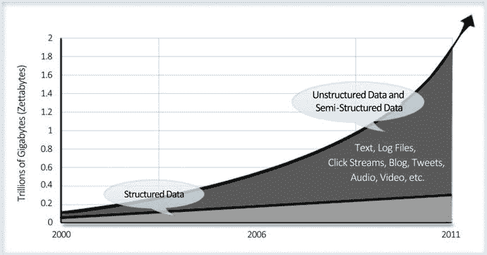

# 2.NoSQL

“NoSQL 是一种设计互联网规模的数据库解决方案的新方法。它不是一种产品或技术，而是一个术语，它定义了一组不是基于传统 RDBMS 原则的数据库技术。”

在这一章，我们将涵盖 NoSQL 的定义和基础知识。我们将向你介绍 CAP 定理，并讨论 NRW 符号。我们将比较 ACID 和 BASE 方法，并通过比较 NoSQL 和 SQL 数据库技术来结束本章。

## 2.1 SQL

RDBMS 的想法来自 e . f . Codd 1970 年的白皮书《大型共享数据库的关系数据模型》用于查询 RDBMS 系统的语言是 SQL (Sequel 查询语言)。

RDBMS 系统非常适合存储在列和行中的结构化数据，可以使用 SQL 查询这些数据。RDBMS 系统基于 ACID 事务的概念。ACID 代表原子性、一致性、孤立性和持久性，其中

*   原子意味着要么完全应用事务的所有更改，要么根本不应用。
*   一致意味着数据在应用事务后处于一致状态。这意味着提交事务后，获取特定数据的查询将看到相同的结果。
*   隔离意味着应用于同一组数据的事务相互独立。因此，一个事务不会干扰另一个事务。
*   持久意味着更改在系统中是永久性的，即使出现任何故障也不会丢失。

## 2.2 NoSQL

NoSQL 是一个用来指非关系数据库的术语。因此，它包含了大多数不基于传统 RDBMS 原则的数据存储，并用于处理 Internet 规模的大型数据集。

正如上一章所讨论的，大数据对传统的数据存储和处理方式(如 RDBMS 系统)提出了挑战。因此，我们看到了 NoSQL 数据库的兴起，这种数据库的设计是为了在时间和成本的限制下处理如此巨大数量和种类的数据。

因此，NoSQL 数据库是从处理大数据的需求发展而来的；传统的 RDBMS 技术不能提供足够的解决方案。图 [2-1](#Fig1) 显示了与结构化数据相比，这些年来非/半结构化数据的增长。

图 2-1。

Structured vs. un/Semi-Structured data

下面是一些非常适合 NoSQL 数据库的大数据用例示例:

*   社交网络图:谁和谁有联系？谁的帖子应该出现在社交网站的用户墙或主页上？
*   搜索和检索:用特定的关键字搜索所有相关的页面，按关键字在页面上出现的次数排序。

### 2.2.1 定义

NoSQL 没有正式的定义。它代表了一种与 RDBMS 根本不同的持久性/数据存储机制。但是如果硬要定义 NoSQL，这里就是:NoSQL 是不遵循 RDBMS 原则的数据存储的总称。

Note

该术语最初用于表示“如果您想要伸缩，就不要使用 SQL”后来，这被重新定义为“不仅仅是 SQL”，这意味着除了 SQL 之外，还存在其他补充的数据库解决方案。

### 2 . 2 . 2 NoSQL 简史

1998 年，Carlo Strozzi 创造了术语 NoSQL。他用这个术语来标识他的数据库，因为数据库没有 SQL 接口。这个术语在 2009 年初再次出现，当时 Eric Evans(Rackspace 的一名员工)在一次关于开源分布式数据库的活动中使用这个术语来指代非关系型的分布式数据库，并且没有遵循关系型数据库的 ACID 特性。

## 2.3 酸与碱

在介绍中，我们提到了传统的 RDBMS 应用关注于 ACID 事务。无论这些品质看起来多么重要，它们都与 Web 规模的应用的可用性和性能要求不相容。

比方说，你有一家像 OLX 这样的公司，销售诸如未使用的家庭用品(旧家具、车辆等)之类的产品。)并使用 RDBMS 作为其数据库。让我们考虑两种情况。

第一个场景:让我们看一个电子商务购物网站，用户正在购买产品。在事务过程中，用户锁定数据库的一部分，即库存，其他用户必须等待，直到锁定的用户完成事务。

第二种情况:应用可能最终使用缓存的数据，甚至未锁定的记录，导致不一致。在这种情况下，当库存实际为零时，两个用户可能最终购买了该产品。

系统可能会变慢，影响可扩展性和用户体验。

与传统 RDBMS 系统的 ACID 方法相反，NoSQL 使用一种通常称为 BASE 的方法来解决这个问题。在解释 BASE 之前，我们先来探讨一下 CAP 定理的概念。

### 2.3.1 上限定理(布鲁尔定理)

埃里克·布鲁尔在 2000 年概述了上限定理。这是一个重要的概念，需要处理分布式数据库的开发者和架构师很好地理解。该定理指出，在分布式环境中设计应用时，存在三个基本要求，即一致性、可用性和分区容差。

*   一致性意味着在执行任何更改数据的操作后，数据保持一致，并且访问应用的所有用户或客户端看到相同的更新数据。
*   可用性意味着系统始终可用。
*   分区容差意味着，即使系统被划分为无法相互通信的服务器组，系统也将继续运行。

CAP 定理指出，在任何时间点，分布式系统只能满足上述三个保证中的两个(图 [2-2](#Fig2) )。

图 2-2。

CAP Theorem

### 基地

埃里克·布鲁尔创造了基本的首字母缩写词。基础可以解释为

*   基本可用意味着系统在 CAP 定理中是可用的。
*   软状态表示即使没有输入提供给系统，状态也会随着时间而改变。这符合最终的一致性。
*   最终一致性意味着系统将在长期内达到一致性，前提是在此期间没有输入被发送到系统。

因此，BASE 与 RDBMS ACID 事务相反。

您已经看到 NoSQL 数据库最终是一致的，但是不同的 NoSQL 数据库最终的一致性实现可能会有所不同。

NRW 是用于描述最终一致性模型如何在 NoSQL 数据库中实现的符号，其中

*   n 是数据库维护的数据副本的数量。
*   r 是应用在返回读取请求的输出之前需要引用的副本数。
*   w 是在将写操作标记为成功完成之前需要写入的数据副本的数量。

使用这些符号配置，数据库实现了最终一致性的模型。

可以在读取和写入操作级别实现一致性。

*   写操作
*   N=W 意味着在将控制权返回给客户端并将写操作标记为成功之前，写操作将更新所有数据副本。这类似于传统 RDBMS 数据库在实现同步复制时的工作方式。此设置将降低写入性能。
*   如果写入性能是一个问题，这意味着您希望快速写入，您可以设置 W=1，R=N。这意味着写入将只更新任何一个拷贝，并将写入标记为成功，但每当用户发出读取请求时，它将读取所有拷贝以返回结果。如果任一拷贝未更新，它将确保更新相同的拷贝，然后只有读取会成功。这种实现会降低读取性能。
*   因此，大多数 NoSQL 实现使用 N>W>1。这意味着需要成功更新不止一个节点；然而，并非所有节点都需要同时更新。
*   读取操作
*   如果 R 设置为 1，读取操作将读取任何可能过时的数据副本。如果 R>1，则读取多个副本，并将读取最近的值。但是，这可能会降低读取操作的速度。
*   使用 N

表 [2-1](#Tab1) 比较了酸和碱。

表 2-1。

ACID vs. BASE

<colgroup><col> <col></colgroup> 
| 酸 | 基础 |
| --- | --- |
| 原子数 | 基本可用 |
| 一致性 | 最终一致性 |
| 隔离 | 柔软状态 |
| 持久耐用 |   |

## 2.4 NoSQL 的优势和劣势

在这一节中，您将看到 NoSQL 数据库的优点和缺点。

### 2 . 4 . 1 NoSQL 的优势

让我们谈谈 NoSQL 数据库的优势。

*   高可伸缩性:当事务率和快速响应需求增加时，这种向上扩展的方法就会失败。与此相反，新一代 NoSQL 数据库旨在向外扩展(即使用低端商用服务器进行水平扩展)。
*   可管理性和管理性:NoSQL 数据库主要用于自动修复、分布式数据和更简单的数据模型，导致可管理性和管理性较低。
*   低成本:NoSQL 数据库通常被设计成与廉价的商用服务器集群一起工作，使用户能够以较低的成本存储和处理更多的数据。
*   灵活的数据模型:NoSQL 数据库有一个非常灵活的数据模型，使它们能够处理任何类型的数据；它们不符合严格的 RDBMS 数据模型。因此，任何涉及更新数据库模式的应用更改都可以轻松实现。

### NoSQL 的缺点

除了上面提到的优势之外，在开始使用这些平台开发应用之前，您还需要了解许多障碍。

*   成熟度:大多数 NoSQL 数据库都是预生产版本，其关键特性仍有待实现。因此，在决定使用 NoSQL 数据库时，您应该对产品进行适当的分析，以确保这些特性被完全实现，而不是仍然在待办事项列表中。
*   支持:支持是你需要考虑的一个限制。大多数 NoSQL 数据库来自开源的初创企业。因此，与企业软件公司相比，支持是非常少的，并且可能没有全球影响力或支持资源。
*   有限的查询能力:由于 NoSQL 数据库通常是为了满足 web 级应用的伸缩需求而开发的，所以它们提供的查询能力有限。一个简单的查询需求可能涉及大量的编程专业知识。
*   管理:尽管 NoSQL 旨在提供一个无管理的解决方案，但它仍然需要技巧和精力来安装和维护该解决方案。
*   专业知识:由于 NoSQL 是一个不断发展的地区，开发者和管理员社区对该技术的专业知识非常有限。

虽然 NoSQL 正在成为数据库领域的重要组成部分，但是您需要了解这些产品的局限性和优势，以便正确选择 NoSQL 数据库平台。

## 2.5 SQL 与 NoSQL 数据库

现在您已经了解了关于 NoSQL 数据库的细节。尽管 NoSQL 越来越多地被用作数据库解决方案，但它并不是要取代 SQL 或 RDBMS 数据库。在这一节中，您将看到 SQL 和 NoSQL 数据库之间的差异。

让我们快速回顾一下 RDBMS 系统。RDBMS 系统已经流行了大约 30 年，甚至现在它们还是应用数据存储解决方案架构师的默认选择。如果我们要列出 RDBMS 系统的几个优点，首先也是最重要的是 SQL 的使用，它是一种用于数据处理的丰富的声明式查询语言。很好的被用户理解。此外，RDBMS 系统提供了对事务的 ACID 支持，这在许多领域是必不可少的，例如银行应用。

然而，RDBMS 系统的最大缺点是，随着数据的增加，它很难处理模式变化和伸缩问题。随着数据的增加，读/写性能会下降。您面临 RDBMS 系统的伸缩问题，因为它们主要是为纵向扩展而不是横向扩展而设计的。

与 SQL RDBMS 数据库相反，NoSQL 提倡脱离 RDBMS 范式的数据存储。

让我们讨论一下技术场景，以及它们在 RDBMS 和 NoSQL 中的比较:

*   模式灵活性:这对于将来的增强和与外部应用(出站或入站)的集成是必不可少的。RDBMS 在设计上相当不灵活。添加列是绝对不允许的，尤其是当表中有一些数据时。原因包括默认值、索引和性能影响。通常，您最终会创建新的表，并通过引入跨表的关系来增加复杂性。
*   复杂的查询:传统的表设计导致开发者编写复杂的连接查询，这不仅难以实现和维护，而且需要大量的数据库资源来执行。
*   数据更新:跨表更新数据可能是比较复杂的场景之一，尤其是当它们是事务的一部分时。请注意，长时间保持事务打开会影响性能。您还必须计划将更新传播到系统中的多个节点。如果系统不支持多个主机或同时写入多个节点，则存在节点故障和整个应用进入只读模式的风险。
*   可伸缩性:通常唯一需要的可伸缩性是读操作。但是，随着运营的增长，有几个因素会影响这一速度。要问的一些关键问题是:基于 NoSQL 的解决方案为上面列出的大多数挑战提供了答案。现在让我们来看看 NoSQL 对上面提到的每个技术问题提供了什么。
    *   跨物理数据库实例同步数据需要多长时间？
    *   跨数据中心同步数据需要多长时间？
    *   同步数据的带宽要求是什么？
    *   交换的数据优化了吗？
    *   跨服务器同步任何更新时的延迟是多少？通常，记录会在更新期间被锁定。NoSQL-based solutions provide answers to most of the challenges listed above.Let’s now see what NoSQL has to offer against each technical question mentioned above.
*   模式灵活性:面向列的数据库将数据存储为列，而不是 RDBMS 中的行。这允许根据需要动态地添加一个或多个列。类似地，允许存储半结构化数据的文档存储也是不错的选择。
*   复杂查询:NoSQL 数据库不支持关系或外键。没有复杂的查询。没有联接语句。这是缺点吗？如何跨表查询？毫无疑问，这是一个功能上的缺陷。要跨表查询，必须执行多个查询。数据库是一种共享资源，跨应用服务器使用，不能尽快停止使用。这些选项包括简化要执行的查询、缓存数据和在应用层执行复杂操作的组合。许多数据库都提供内置的实体级缓存。这意味着当一个记录被访问时，它可以被数据库自动透明地缓存。为了性能和规模，缓存可以是内存中分布式缓存。
*   数据更新:跨物理实例的数据更新和同步是很难解决的工程问题。与跨多个数据中心同步相比，数据中心内节点间的同步有一组不同的要求。人们希望延迟最好在几毫秒或几十毫秒之内。NoSQL 解决方案提供了很好的同步选项。例如，MongoDB 允许跨节点的并发更新、带冲突解决的同步，以及最终在几毫秒内运行的可接受时间内跨数据中心的一致性。因此，MongoDB 没有隔离的概念。注意，现在因为管理事务的复杂性可能从数据库中移出，应用将不得不做一些艰苦的工作。这方面的一个例子是在实现事务时的两阶段提交( [`http://docs.mongodb.org/manual/tutorial/perform-two-phase-commits/`](http://docs.mongodb.org/manual/tutorial/perform-two-phase-commits/) )。大量数据库提供多版本并发控制(MCC)来实现事务一致性。正如易贝大学的技术研究员丹·普里切特所说，eBay.com 不使用事务。注意，PayPal 确实使用事务。
*   可伸缩性:NoSQL 解决方案提供了更好的可伸缩性，原因显而易见。面向事务的 RDBMS 所需的许多复杂性在不符合 ACID 的 NoSQL 数据库中并不存在。有趣的是，因为 NoSQL 不提供跨表引用，也不可能有连接查询，而且因为您不能编写一个查询来比较多个表中的数据，所以一个简单而合理的解决方案是——有时——跨表复制数据。在某些情况下，将信息嵌入到主实体中——尤其是在一对一映射的情况下——可能是个好主意。

表 [2-2](#Tab2) 比较了 SQL 和 NoSQL 技术。

表 2-2。

SQL vs. NoSQL

<colgroup><col> <col> <col></colgroup> 
|   | SQL 数据库 | NoSQL 数据库 |
| --- | --- | --- |
| 类型 | 所有类型都支持 SQL 标准。 | 存在多种类型，如文档存储、键值存储、列数据库等。 |
| 发展历史 | 开发于 1970 年。 | 开发于 2000 年代。 |
| 例子 | SQL Server、Oracle、MySQL。 | 蒙戈布，巴塞，卡珊德拉。 |
| 数据存储模型 | 数据存储在表的行和列中，其中每一列都有特定的类型。这些表格通常是根据标准化原则创建的。联接用于从多个表中检索数据。 | 数据模型取决于数据库类型。比方说，数据存储为键值存储的键值对。在基于文档的数据库中，数据存储为文档。与 RDBMS 的僵硬的表模型相比，数据模型是灵活的。 |
| 计划 | 固定的结构和模式，因此对模式的任何更改都会涉及到数据库的更改。 | 动态模式、新的数据类型或结构可以通过扩展或改变当前模式来适应。可以动态添加新字段。 |
| 可量测性 | 使用放大方法；这意味着随着负载的增加，需要购买更大、更贵的服务器来容纳数据。 | 使用横向扩展方法；这意味着将数据负载分布在廉价的商用服务器上。 |
| 支持事务 | 支持 ACID 和事务。 | 支持分区和可用性，以及对事务的妥协。事务存在于特定的级别，例如数据库级别或文档级别。 |
| 一致性 | 一致性强。 | 取决于产品。很少有人选择提供强一致性，而很少有人提供最终一致性。 |
| 支持 | 提供高水平的企业支持。 | 开源模式。通过构建开源产品的第三方或公司提供支持。 |
| 成熟 | 已经存在很久了。 | 有的是成熟的；其他的在进化。 |
| 查询功能 | 通过易于使用的 GUI 界面提供。 | 查询可能需要编程技能和知识。而不是一个用户界面，重点是功能和编程接口。 |
| 专家的意见 | 利用 SQL 语言和 RDBMS 概念来设计和开发应用的大型开发者社区。 | 开发这些开源工具的小型开发者社区。 |

## 2.6 数据库的类别

在这一部分，你将快速探索 NoSQL 的风景。你会看到 NoSQL 数据库的新兴类别。表 [2-3](#Tab3) 显示了 NoSQL 景观中的几个项目，以及每个类别中的类型和参与者。

表 2-3。

NoSQL Categories

<colgroup><col> <col> <col></colgroup> 
| 种类 | 简要描述 | 例如 |
| --- | --- | --- |
| 基于文档的 | 数据以文档的形式存储。例如，{Name= "测试用户"，Address="Address1 "，年龄:8} | MongoDB |
| XML 数据库 | XML 用于存储数据。 | MarkLogic |
| 图形数据库 | 数据存储为节点集合。节点通过边连接。节点相当于编程语言中的对象。 | GraphDB(图形数据库) |
| 键值存储 | 将数据存储为键值对。 | Cassandra 再说一遍 memcached |

NoSQL 数据库根据数据的存储方式进行分类。NoSQL 大多遵循水平结构，因为需要提供大量精选信息，通常是近实时的。它们针对大规模的插入和检索操作进行了优化，内置了复制和集群功能。

表 [2-4](#Tab4) 简要提供了不同类别的 NoSQL 数据库之间的特性比较。

表 2-4。

Feature Comparison

<colgroup><col> <col> <col> <col> <col></colgroup> 
| 特征 | 面向列 | 文档存储 | 键值存储 | 图表 |
| --- | --- | --- | --- | --- |
| 类似表格的模式支持(列) | 是 | 不 | 不 | 是 |
| 完成更新/提取 | 是 | 是 | 是 | 是 |
| 部分更新/获取 | 是 | 是 | 是 | 不 |
| 对值进行查询/过滤 | 是 | 是 | 不 | 是 |
| 跨行聚合 | 是 | 不 | 不 | 不 |
| 实体之间的关系 | 不 | 不 | 不 | 是 |
| 跨实体视图支持 | 不 | 是 | 不 | 不 |
| 批量提取 | 是 | 是 | 是 | 是 |
| 批量更新 | 是 | 是 | 是 | 不 |

在考虑 NoSQL 项目时，重要的是您感兴趣的特性集。当决定使用 NoSQL 的产品时，首先你需要非常仔细地理解问题需求，然后你应该看看其他已经使用 NoSQL 产品解决类似问题的人。请记住，NoSQL 仍在不断成熟，因此这将使您能够从同行和以前的部署中学习，并做出更好的 choi ces。

此外，你还需要考虑以下问题。

*   需要处理的数据有多大？
*   读写的吞吐量是多少？
*   如何在系统中实现一致性？
*   系统需要支持高写性能还是高读性能？
*   可维护性和管理性有多容易？
*   需要查询什么？
*   使用 NoSQL 的好处是什么？

我们建议您从小处着手，但意义重大，并尽可能考虑混合方法。

## 2.7 摘要

在这一章中，你了解了 NoSQL。您现在应该明白什么是 NoSQL，以及它与 SQL 有何不同。你还研究了 NoSQL 的各种类别。

在接下来的章节中，您将了解 MongoDB，这是一个基于文档的 NoSQL 数据库。