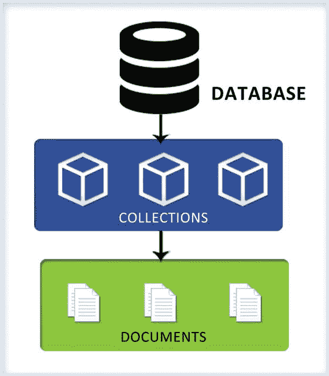

# 4.MongoDB 数据模型

“MongoDB 设计用于处理文档，不需要任何预定义的列或数据类型(不像关系数据库)，这使得数据模型非常灵活。”

在本章中，您将了解 MongoDB 数据模型。您还将了解灵活模式(多态模式)的含义，以及为什么它是 MongoDB 数据模型的一个重要方面。

## 4.1 数据模型

在前一章中，您看到了 MongoDB 是一个基于文档的数据库系统，其中的文档可以有一个灵活的模式。这意味着集合中的文档可以有不同(或相同)的字段集。这为您处理数据提供了更大的灵活性。

在本章中，您将探索 MongoDB 灵活的数据模型。在任何需要的地方，我们将展示这种方法与 RDBMS 系统的不同之处。

一个 MongoDB 部署可以有许多数据库。每个数据库都是一组集合。集合类似于 SQL 中的表的概念；然而，它们是无模式的。每个集合可以有多个文档。将文档想象成 SQL 中的一行。图 [4-1](#Fig1) 描绘了 MongoDB 数据库模型。

图 4-1。

MongoDB database model

在 RDBMS 系统中，由于表结构和每列的数据类型是固定的，所以只能在一列中添加特定数据类型的数据。在 MongoDB 中，集合是文档的集合，其中数据存储为键值对。

让我们通过一个例子来理解数据是如何存储在文档中的。以下文档包含用户的姓名和电话号码:

`{"Name": "ABC", "Phone": ["1111111", "222222" ] }`

动态模式意味着同一集合中的文档可以有相同或不同的字段或结构集，甚至公共字段也可以跨文档存储不同类型的值。在集合的文档中存储数据的方式没有严格的限制。

让我们看一个区域集合的例子:

`{ "R_ID" : "REG001", "Name" : "United States" }`

`{ "R_ID" :1234, "Name" : "New York", "Country" : "United States" }`

在这段代码中，区域集合中有两个文档。虽然这两个文档都是一个集合的一部分，但是它们有不同的结构:第二个集合有一个额外的信息字段，即 country。事实上，如果您查看“R_ID”字段，它在第一个文档中存储一个字符串值，而在第二个文档中存储一个数字。

因此，一个集合的文档可以有完全不同的模式。应用需要将特定集合中的文档存储在一起，或者拥有多个集合。

### 4.1.1 JSON 和 BSON

MongoDB 是一个基于文档的数据库。它使用二进制 JSON 来存储数据。

在本节中，您将了解 JSON 和二进制 JSON (BSON)。JSON 代表 JavaScript 对象符号。它是当今现代网络中用于数据交换的标准(和 XML 一起)。该格式是人和机器可读的。这不仅是交换数据的好方法，也是存储数据的好方法。

JSON 支持所有基本的数据类型(比如字符串、数字、布尔值和数组)。

以下代码显示了 JSON 文档的样子:

`{`

`"_id" : 1,`

`"name" : { "first" : "John", "last" : "Doe" },`

`"publications" : [`

`{`

`"title" : "First Book",`

`"year" : 1989,`

`"publisher" : "publisher1"`

`},`

`{ "title" : "Second Book",`

`"year" : 1999,`

`"publisher" : "publisher2"`

`}`

`]`

`}`

JSON 允许您将所有相关的信息保存在一个地方，这提供了出色的性能。它还使文档的更新变得独立。这是无模式的。

#### 4.1.1.1 二进制 JSON (BSON)

MongoDB 以二进制编码格式存储 JSON 文档。这被称为 BSON。BSON 数据模型是 JSON 数据模型的扩展形式。

MongoDB 对 BSON 文档的实现是快速的、高度可穿越的和轻量级的。它支持在其他数组中嵌入数组和对象，还支持 MongoDB 在对象内部构建索引，并根据查询的表达式匹配对象，包括顶级和嵌套的 BSON 键。

### 4.1.2 标识符(_id)

您已经看到 MongoDB 将数据存储在文档中。文档由键值对组成。虽然文档可以比作 RDBMS 中的行，但与行不同，文档具有灵活的模式。键只不过是一个标签，可以粗略地比作 RDBMS 中的列名。密钥用于从文档中查询数据。因此，就像 RDBMS 主键(用于惟一标识每一行)一样，您需要有一个惟一标识集合中每个文档的键。这在 MongoDB 中被称为 _id。

如果您没有为一个键显式指定任何值，MongoDB 将自动生成一个惟一的值并分配给它。这个键值是不可变的，可以是除数组之外的任何数据类型。

### 4.1.3 加盖收藏

您现在已经非常熟悉集合和文档了。我们来谈谈一种特殊类型的集合，叫做封顶集合。

MongoDB 有一个集合封顶的概念。这意味着它按照插入的顺序存储集合中的文档。当集合达到其限制时，文档将按 FIFO(先进先出)顺序从集合中移除。这意味着最近最少插入的文档将首先被删除。

这对于需要自动维护插入顺序以及需要在固定大小后删除记录的用例来说很好。一个这样的用例是在达到一定大小后自动截断的日志文件。

Note

MongoDB 本身使用上限集合来维护其复制日志。Capped 集合保证了按插入顺序保存数据，因此按插入顺序检索数据的查询可以快速返回结果，并且不需要索引。不允许更改文档大小的更新。

## 4.2 多态模式

既然您已经熟悉了 MongoDB 数据结构的无模式特性，现在让我们来探索多态模式和用例。

多态模式是一种模式，其中集合具有不同类型或模式的文档。这种模式的一个很好的例子是名为 Users 的集合。一些用户文档可能有额外的传真号码或电子邮件地址，而其他用户文档可能只有电话号码，然而所有这些文档都共存于同一个用户集合中。这种模式通常被称为多态模式。

在本章的这一部分，你将探究使用多态模式的各种原因。

### 面向对象的编程

面向对象编程使您能够使用继承让类共享数据和行为。它还允许您在父类中定义可以在子类中覆盖的函数，从而在不同的上下文中以不同的方式运行。换句话说，您可以使用相同的函数名来操作子类和父类，尽管在底层实现可能会有所不同。这种特性被称为多态性。

在这种情况下，要求能够拥有一个模式，其中所有相关的对象集或层次结构中的对象集可以放在一起，并且还可以进行相同的检索。

让我们考虑一个例子。假设您有一个应用，允许用户上传和共享不同的内容类型，如 HTML 页面、文档、图像、视频等。尽管许多字段在上述所有内容类型中都是通用的(如姓名、ID、作者、上传日期和时间)，但并非所有字段都是相同的。例如，对于图像，您有一个保存图像内容的二进制字段，而 HTML 页面有一个保存 HTML 内容的大文本字段。

在这个场景中，可以使用 MongoDB 多态模式，其中所有的内容节点类型都存储在同一个集合中，比如 LoadContent，每个文档只有相关的字段。

`// "Document collections" - "HTMLPage" document`

`{`

`_id: 1,`

`title: "Hello",`

`type: "HTMLpage",`

`text: "<html>Hi..Welcome to my world</html>"`

`}`

`...`

`// Document collection also has a "Picture" document`

`{`

`_id: 3,`

`title: "Family Photo",`

`type: "JPEG",`

`sizeInMB: 10,........`

`}`

这种模式不仅使您能够将不同结构的相关数据存储在同一个集合中，还简化了查询。同一个集合可用于对常见字段执行查询，例如获取在特定日期和时间上传的所有内容，以及对特定字段执行查询，例如查找大小大于 X MB 的图像。

因此，面向对象编程是具有多态模式有意义的用例之一。

### 模式演变

当您使用数据库时，您需要考虑的最重要的事项之一是模式演变(即模式的变化对正在运行的应用的影响)。设计应该以对应用影响最小或没有影响的方式进行，也就是说没有或只有很少的停机时间，没有或只有很少的代码更改，等等。

通常，模式演变是通过执行迁移脚本将数据库模式从旧版本升级到新版本来实现的。如果数据库不在生产环境中，脚本可以简单地删除并重新创建数据库。但是，如果数据库在生产环境中，并且包含实时数据，迁移脚本将会很复杂，因为需要保留数据。剧本应该考虑到这一点。虽然 MongoDB 提供了一个更新选项，如果添加了一个新的字段，可以使用它来更新集合中所有文档的结构，但是想象一下，如果集合中有数千个文档，那么这样做会产生什么影响。它会非常慢，并且会对底层应用的性能产生负面影响。其中一种方法是将新的结构包含到添加到集合中的新文档中，然后在应用仍在运行时逐渐在后台迁移集合。这是拥有多态模式将带来优势的众多用例之一。

例如，假设您正在处理一个票据集合，其中有包含票据详细信息的文档，如下所示:

`// "Ticket1" document (stored in "Tickets" collection")`

`{`

`_id: 1,`

`Priority: "High",`

`type: "Incident",`

`text: "Printer not working"`

`}...........`

在某个时候，应用团队决定在票据文档结构中引入一个“简短描述”字段，所以最好的替代方法是在新的票据文档中引入这个新字段。在应用中，嵌入一段代码来处理检索“旧样式”文档(没有简短描述字段)和“新样式”文档(有简短描述字段)。旧样式文档可以逐渐迁移到新样式文档。迁移完成后，如果需要，可以更新代码以删除嵌入的用于处理缺失字段的代码。

## 4.3 总结

在本章中，您学习了 MongoDB 数据模型。您还了解了标识符和上限集合。在本章结束时，您已经理解了灵活的模式是如何帮助您的。

在下一章中，您将开始使用 MongoDB。您将执行 MongoDB 的安装和配置。