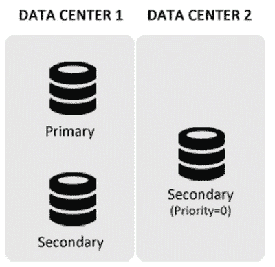

# 12.MongoDB 最佳实践

“开始使用 MongoDB 很容易，但是一旦您开始开发应用程序，您将会遇到需要最佳实践来实现特定用例的场景。”

在前面的章节中，您已经熟悉了 MongoDB。本章的目的是利用其他用户的经验概述一些众所周知的问题，同时也提供各种帮助您顺利使用 MongoDB 的方法。

如您所知，MongoDB 处理文档，使用 RAM 存储数据以增强性能，并使用复制和分片来进一步提供数据安全性和可伸缩性。

本章将介绍您应该了解的技巧，从部署策略到增强查询、数据安全性和一致性，再到监控。

## 12.1 部署

在决定部署策略时，请记住以下提示，以便正确确定硬件规模。这些提示还将帮助您决定是否使用分片和复制。

*   数据集大小:最重要的是确定当前和预期的数据集大小。这不仅让您可以为单个物理节点选择资源，还可以帮助您规划分片计划(如果有的话)。
*   数据重要性:第二重要的事情是确定数据的重要性，确定数据有多重要，以及您对任何数据丢失或数据滞后的容忍程度(尤其是在复制的情况下)。
*   内存大小:下一步是确定内存需求，并相应地管理 RAM。与其他面向数据的应用程序一样，当整个数据集可以驻留在内存中时，MongoDB 也可以工作得最好，从而避免任何类型的磁盘 I/O。页面错误是一个可以使用 MongoDB Cloud Manager 之类的监控工具来测量的指标。如果可能的话，您应该始终选择内存大于您的工作集大小的平台。如果大小超过了单个节点的内存，您应该考虑使用分片，以便可以增加可用的内存量。这最大化了整体部署的性能。
*   磁盘类型:如果速度不是主要考虑因素，或者如果数据集大于任何内存策略所能支持的范围，那么选择合适的磁盘类型就非常重要。IOPS(每秒输入/输出操作数)是选择磁盘类型的关键；IOPS 越高，MongoDB 的性能越好。如果可能的话，应该使用本地磁盘，因为网络存储会导致性能下降和高延迟。还建议在创建磁盘阵列时使用 RAID 10(只要可能)。
*   CPU:如果您预期使用 map reducing，那么时钟速度和可用的处理器就成为重要的考虑因素。当您在内存中运行大部分数据的 mongod 时，时钟速度也会对整体性能产生重大影响。在您希望最大化每秒操作数的情况下，您必须考虑在部署策略中包含一个具有高时钟/总线速度的 CPU。
*   Replication is used if high availability is one of the requirements. In any MongoDB deployment it should be standard to set up a replica set with at least three nodes.A 2x1 deployment is the most common configuration for replication with three nodes, where there are two nodes in one data center and a backup node in a secondary data center, as depicted in Figure [12-1](#Fig1).

    

    图 12-1。

    MongoDB 2*1 deployment

### 12 . 1 . 1 MongoDB 站点的硬件建议

以下内容仅旨在为 MongoDB 部署提供高级指导。实际的硬件配置取决于您的数据、可用性要求、查询、性能标准和所选硬件组件的功能。

*   内存:由于 MongoDB 大量使用内存来获得更好的性能，内存越多，性能越好。
*   存储:MongoDB 可以使用 SSD(固态硬盘)或本地附加存储。由于 MongoDB 的磁盘访问模式没有顺序属性，使用 SSD 可以让客户体验到显著的性能提升。使用 SSD 的另一个好处是，如果工作集不再适合内存，它们会稍微降低性能。大多数 MongoDB 部署应该使用 RAID-10。使用 WiredTiger 存储引擎时，由于性能问题，强烈建议使用 XFS 文件系统。此外，不要使用大页面，因为 MongoDB 使用默认的虚拟内存页面会表现得更好。
*   CPU:由于带有 MMAPv1 存储引擎的 MongoDB 很少遇到需要大量内核的工作负载，因此最好使用时钟速度较快的服务器，而不是时钟速度较慢的多核服务器。然而，WiredTiger 存储引擎是受 CPU 限制的，因此使用多核服务器可以显著提高性能。

### 12.1.2 需要注意的几点

总结本节，在为 MongoDB 选择硬件时，请考虑以下要点:

A faster CPU clock speed and more RAM are important for productivity.   Since MongoDB doesn’t perform high amounts of computation, increasing the number of cores helps but does not provide a high level of marginal return when using the MMAPv1 storage engine.   Using SATA SSD and PCI (Peripheral Component Interconnect) provides good price/performance and good results.   It’s more effective to spend on commodity SATA spinning drives.   MongoDB on NUMA Hardware : This point is only applicable for mongod running in Linux and not for instances that run on Windows or other Unix-like systems. NUMA (non-uniform memory access) and MongoDB don’t work well together, so when running MongoDB on NUMA hardware, you need to disable NUMA for MongoDB and run with an interleave memory policy because NUMA causes a number of operational problems for MongoDB, including performance slowness for periods of time or high processor usage.  

## 12.2 编码

获得硬件后，在使用数据库编码时，请考虑以下提示:

*   第一点是考虑用于给定应用程序需求的数据模型，并决定是嵌入还是引用或者两者的混合。关于这方面的更多信息，请查看第 tk 章。在快速性能和保证即时一致性之间有一个平衡，所以根据您的应用来决定。
*   避免导致文档大小无限制增长的应用程序模式。在 MongoDB 中，BSON 文档的最大大小是 16MB。应该避免让文档无限制增长的应用程序模式。例如，应用程序不应该以导致文档显著增长的方式更新文档。当文档大小超过分配的大小时，MongoDB 将重新定位文档。这个过程不仅耗时，而且是资源密集型的，并且会不必要地降低其他数据库操作的速度。此外，它还会导致存储使用效率低下。请注意，上述限制适用于 MMAPv1 存储引擎。使用 WiredTiger 时，每次更新都会重写文档。

例如，让我们考虑一个博客应用程序。在这个应用程序中，很难估计一篇博文会收到多少回复。应用程序被设置为只向用户显示评论的子集，比如最近的评论或前 10 条评论。在这种情况下，您应该创建一个引用模型，将每个响应或一组响应作为单独的文档进行维护，然后在文档中添加对博客文章的引用，而不是创建一个将博客文章和用户响应作为单个文档进行维护的嵌入式模型。通过这种方式，可以控制文档的无限制增长，如果遵循嵌入数据的第一种模型，就会发生这种情况。

*   你也可以为未来设计文档。尽管 MongoDB 提供了在需要时在文档中追加新字段的选项，但它有一个缺点。当引入新的字段时，可能会出现文档不适合当前可用空间的情况，导致 MongoDB 为文档寻找新的空间并将其移动到那里，这可能需要时间。因此，如果您知道结构，那么在开始时创建所有的字段总是很有效的，不管当时您是否有可用的数据。如上所述，空间将被分配给文档，只要有值，就只需要更新。这样做，MongoDB 将不必寻找空间；它只是更新输入的值，这要快得多。
*   您还可以根据需要创建预期大小的文档。这一点也是为了确保给文档分配足够的空间，任何进一步的增长都不会导致空间的跳跃。这可以通过使用一个垃圾字段来实现，该字段包含一个预期大小的字符串，最初插入文档，然后立即取消设置该字段:`> mydbcol.insert({"_id" : ObjectID(..),......, "tempField" : stringOfAnticipatedSize})` `> mydbcol.update({"_id" : ...}, {"$unset" : {"tempField" : 1}})`
*   当您知道并且总是知道您正在访问的字段的名称时，应该总是在这种情况下使用子文档。否则，使用数组。
*   如果您想要查询必须计算但在文档中没有显式显示的信息，最好的选择是在文档中显式显示这些信息。由于 MongoDB 被设计为只存储和检索数据，所以它不做任何计算。任何琐碎的计算都会推给客户端，从而导致性能问题。
*   此外，尽可能避免`$Where`，因为这是一个极其耗费时间和资源的操作。
*   设计文档时使用正确的数据类型。例如，数字只能存储为数字数据类型，而不能存储为字符串数据类型。使用字符串存储数据需要更多的空间，并且会影响可以对数据执行的操作。
*   另外需要注意的是，MongoDB 中的字符串是区分大小写的。因此，搜索“practicalMongoDB”不会找到“Practicalmongodb”。因此，在进行字符串搜索时，您可以执行以下操作之一:
    *   以规范化的大小写格式存储数据。
    *   搜索时使用带`/I`的正则表达式。
    *   在聚合框架中使用`$toUpper`或`$` `toLower`。
*   使用您自己的唯一键作为`_id`将节省一点空间，如果您计划在键上建立索引，这将非常有用。然而，在决定使用自己的密钥作为`_id`时，您需要记住以下几点:
    *   您必须确保密钥的唯一性。
    *   此外，还要考虑键的插入顺序，因为插入顺序将决定使用多少 RAM 来维护这个索引。
*   根据需要检索字段。当每秒完成数百或数千个请求时，只获取需要的字段当然是有利的。
*   GridFS 只用于存储大于单个文档所能容纳的数据，或者太大而无法在客户端一次加载的数据，比如视频。任何将被传输到客户机的东西都是 GridFS 的理想选择。
*   使用 TTL 删除文档。如果集合中的文档需要在预定义的时间段后删除，TTL 功能可用于在文档达到预定义的期限后自动删除文档。

假设您有一个维护包含用户和系统交互细节的文档的集合。这些文档有一个名为 lastActivity 的日期字段，用于跟踪用户和系统的交互。假设您有一个需求，要求您只需要维护用户会话一个小时。在这种情况下，您可以将字段`lastActivity`的 TTL 设置为 3600 秒。后台线程将自动运行，并检查和删除空闲时间超过 3600 秒的文档。

*   如果您需要基于插入顺序的高吞吐量，请使用上限集合。在某些情况下，根据数据大小，您需要在系统中维护一个滚动的数据窗口。例如，有上限的集合可用于存储大容量系统的日志信息，以便快速检索最新的日志条目。
*   注意，如果不小心的话，MongoDB 的灵活模式可能会导致数据不一致。例如，如果没有正确更新，复制数据(嵌入文档)的能力会导致数据不一致，等等。所以检查数据的一致性非常重要。
*   尽管 MongoDB 可以处理无缝故障转移，但是根据良好的编码实践，应用程序应该编写得很好，能够处理任何异常并优雅地处理这种情况。

## 12.3 应用程序响应时间优化

一旦开始开发应用程序，最重要的需求之一就是要有一个可接受的响应时间。换句话说，应用程序应该立即响应。您可以使用以下提示进行优化:

*   尽可能避免磁盘访问和页面错误。主动计算应用程序需要处理的数据集大小，并添加更多内存以避免页面错误和磁盘读取。此外，对应用程序进行编程，使其主要访问内存中可用数据，这样就不会经常出现页面错误。
*   对查询的字段创建索引。如果在执行的过滤器上创建索引，那么索引在内存中的存储方式会减少内存消耗，从而对查询产生积极的影响。
*   如果与完整的文档结构相比，应用程序涉及返回几个字段的查询，则创建覆盖索引。
*   拥有一个可以被最大查询使用的复合索引还可以节省内存，因为不用在内存中加载多个索引，一个索引就足够了。
*   在正则表达式中使用尾随通配符可以从关联索引中获益。
*   尝试创建索引，从根本上减少可供选择的文档。字段“性别”的索引不如字段“电话号码”的索引有用
*   索引并不总是好的。您需要保持所用索引的最佳平衡。尽管应该创建索引来支持查询，但是也应该记住删除不再使用的索引，因为每个索引都有与插入/更新操作相关的成本。如果一个索引没有被使用但仍然存在，它会对整个数据库容量产生负面影响。这对于大量插入的工作负载尤其重要。
*   文档应该以一种层次化的方式设计，相关的东西被组合在一起，并在适当的时候被描述为层次结构。这将使 MongoDB 能够在不扫描整个文档的情况下找到所需的信息。
*   当应用 AND 操作符时，应该总是从小的结果集查询到大的结果集，因为这将导致查询少量的文档。如果您知道最具限制性的条件，则该条件应该首先出现。
*   使用或查询时，应该从较大的结果集移到较小的结果集，因为这将限制后续查询的搜索空间。
*   工作集应该适合内存。
*   由于 WiredTiger 存储引擎支持块级和索引级的压缩，因此可将其用于写入密集型和 I/O 密集型应用程序。

## 12.4 数据安全

您了解了在决定部署时需要牢记的事项；您还学习了一些重要的技巧来获得良好的性能。现在，让我们来看一些关于数据安全性和一致性的提示:

*   复制和日志记录是为数据安全提供的两种方法。通常，建议使用复制来运行生产设置，而不是使用单个服务器来运行。并且应该至少有一个服务器被记录日志。当不可能启用复制并且您在单台服务器上运行时，日志记录可以提供数据安全。tk 章解释了当启用日志记录时写操作是如何工作的。
*   在服务器崩溃的情况下，修复应该是恢复数据的最后手段。尽管运行修复后数据库可能不会损坏，但它不会包含所有数据。
*   在复制环境中，将`W`设置为大多数安全写入。这是为了确保写入被复制到副本集的大多数成员。虽然这将降低写入操作的速度，但写入是安全的。
*   发出命令时，请始终指定`wtimeout`和`w`，以避免无限的等待时间。
*   MongoDB 应该始终在一个可信的环境中运行，并制定规则来防止来自所有未知系统、机器或网络的访问。

## 12.5 管理

以下是一些管理提示:

*   对耐用服务器进行即时备份。要在启用日志记录的情况下备份数据库，可以拍摄文件系统快照或执行普通的 fsync+锁，然后转储。注意，你不能在没有 fsync 和锁定的情况下复制所有的文件，因为复制不是一个瞬间的操作。
*   应该使用 Repair 来压缩数据库，因为它基本上先执行 mongodump，然后执行 mongorestore，创建数据的干净副本，并在此过程中删除数据文件中的任何空“洞”。
*   数据库概要分析器由 MongoDB 提供。它记录所有数据库操作的细粒度信息。可以启用它来记录所有事件的信息，或者只记录持续时间超过可配置阈值(默认为 100 毫秒)的事件。

Note

探查器数据存储在有上限的集合中。与解析日志文件相比，查询这个集合可能更容易。

*   解释计划可用于查看查询是如何解决的。这包括使用哪个索引、返回多少文档、索引是否覆盖查询、扫描了多少索引条目以及查询返回结果所用的时间(毫秒)等信息。当查询在不到 1 毫秒的时间内得到解决时，解释计划显示为 0。当您调用解释计划时，它会丢弃旧的计划，并启动测试可用索引的过程，以确保使用可能的最佳计划。

## 12.6 复制延迟

复制滞后是监控副本集背后的主要管理问题。给定辅助节点的复制延迟是在主节点写入操作和在辅助节点复制操作的时间差。通常，复制滞后会自我修复，并且是短暂的。然而，如果它仍然很高，并继续上升，可能是系统有问题。您可能会关闭系统直到问题解决，或者可能需要手动干预来协调不匹配，或者您甚至可能会使用过时的数据运行系统。

以下命令可用于确定副本集的当前复制延迟:

`testset:PRIMARY>` `rs.printSlaveReplicationInfo()`

此外，您可以使用`rs.printReplicationInfo()`命令来填充缺失的部分:

`testset:PRIMARY>` `rs.printReplicationInfo()`

MongoDB 云管理器还可以用来查看最近和历史的复制延迟信息。可以从每个辅助节点的“状态”选项卡中获得复制延迟图。

以下是一些有助于减少这一时间的提示:

*   在写入负载较重的情况下，您应该有一个与主节点一样强大的辅助节点，以便它可以跟上主节点，并且可以以相同的速率在辅助节点上应用写入。此外，您应该有足够的网络带宽，以便能够以创建 ops 的相同速率从主服务器检索 ops。
*   调整应用程序写入问题。
*   如果辅助节点用于索引构建，则可以计划在主节点上有少量写入活动时进行。
*   如果辅助节点用于进行备份，请考虑在不阻止的情况下进行备份。
*   检查复制错误。运行`rs.status()`并检查`errmsg`字段。此外，可以检查辅助节点的日志文件中是否有任何现有的错误消息。

## 12.7 分片

当数据不再适合一个节点时，可以使用分片来确保数据均匀分布在群集中，并且操作不会因资源限制而受到影响。

*   选择一个好的分片密钥。
*   您必须在生产部署中使用三台配置服务器来提供冗余。
*   碎片收集在达到 256GB 之前。

## 12.8 监控

应该主动监控 MongoDB 系统以检测异常行为，以便采取必要的措施来解决问题。有几个工具可用于监控 MongoDB 部署。

MongoDB 开发人员提供了一个名为 MongoDB Cloud Manager 的免费托管监控服务。MongoDB 云管理器提供了整个集群指标的仪表板视图。或者，您可以使用 nagios、SNMP 或 munin 来构建自己的工具。

MongoDB 还提供了几个工具，如 mongostat 和 mongotop，以深入了解性能。使用监控服务时，应密切关注以下事项:

*   Op 计数器:包括插入、删除、读取、更新和游标使用。
*   常驻内存:应该始终关注分配的内存。这个计数器值应该总是低于物理内存。如果内存不足，由于页面错误和索引缺失，您将会遇到性能下降的问题。
*   工作集大小:为了获得良好的性能，活动的工作集应该适合内存，因此需要密切关注工作集。您可以优化查询，使工作集适合内存，或者在工作集预计增加时增加内存。
*   队列:在 MongoDB 3.0 发布之前，读写锁用于同步读取，独占访问用于写入。在这种情况下，您可能会在单个编写器后面结束队列，其中可能包含读/写查询。需要监控队列指标和锁定百分比。如果队列和锁百分比呈上升趋势，这意味着数据库中存在争用。将操作更改为批处理模式或更改数据模型会对并发性产生显著的积极影响。从 3.0 版开始，引入了集合级锁定(在 MMAPv1 存储引擎中)和文档级锁定(在 WiredTiger 存储引擎中)。这导致并发性的提高，其中在数据库级别将不需要具有独占访问的写锁。因此，从这个版本开始，您只需要测量队列指标。
*   每当应用程序出现问题时，CRUD 行为、索引模式和索引可以帮助您更好地理解应用程序的流程。
*   建议对完整大小的数据库(如生产数据库副本)运行整个性能测试，因为在处理实际数据时，性能特征通常会得到强调。这也让您能够避免在处理实际性能数据库时可能出现的令人不快的意外。

## 12.9 摘要

在本章中，我们提供了各种方法来帮助您使用 MongoDB。